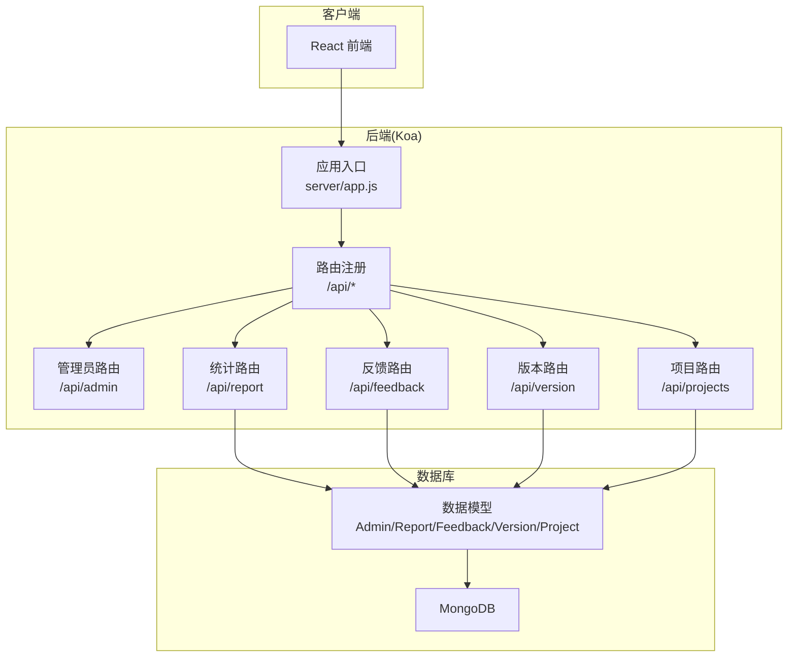
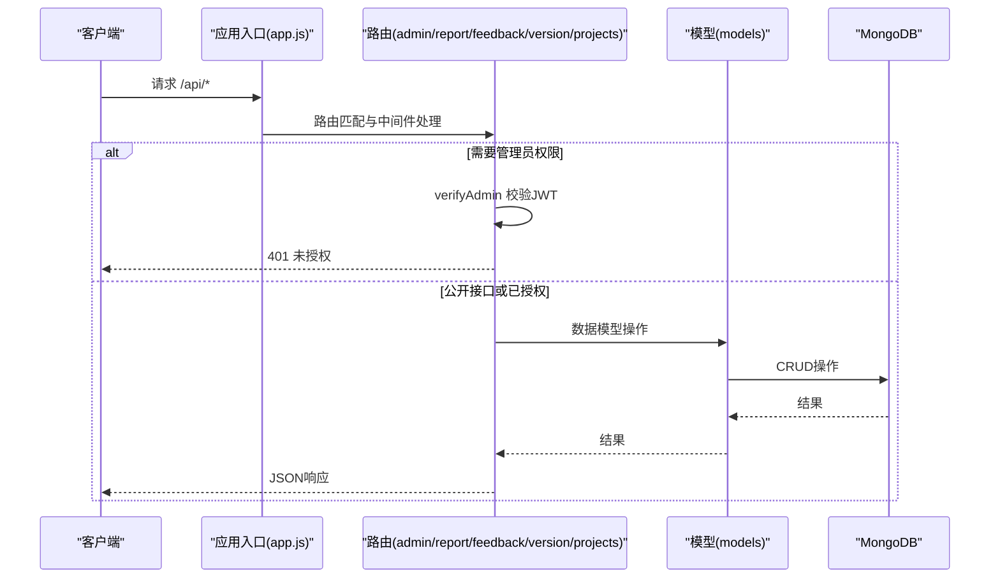
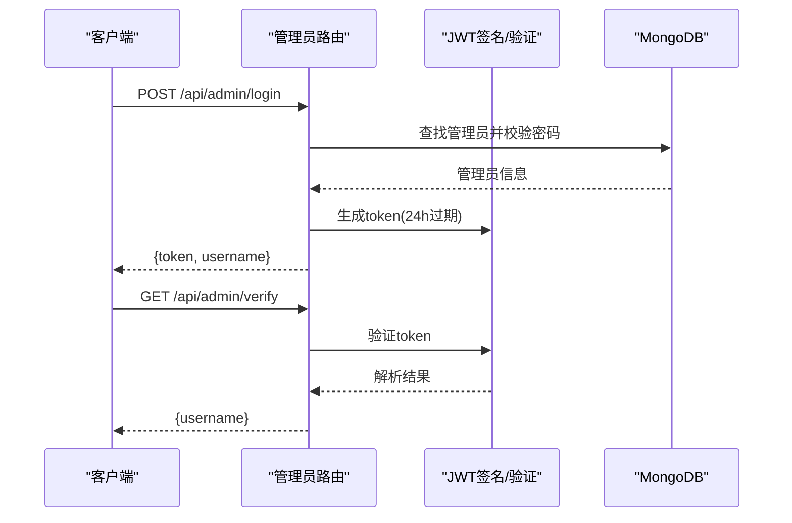
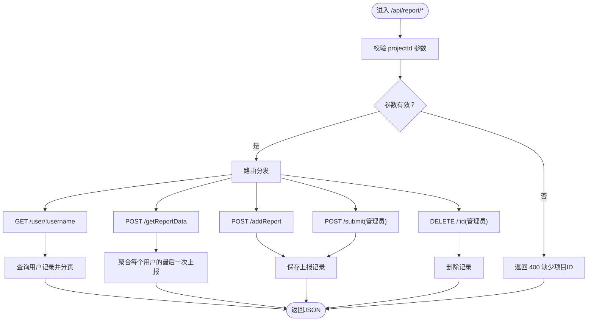
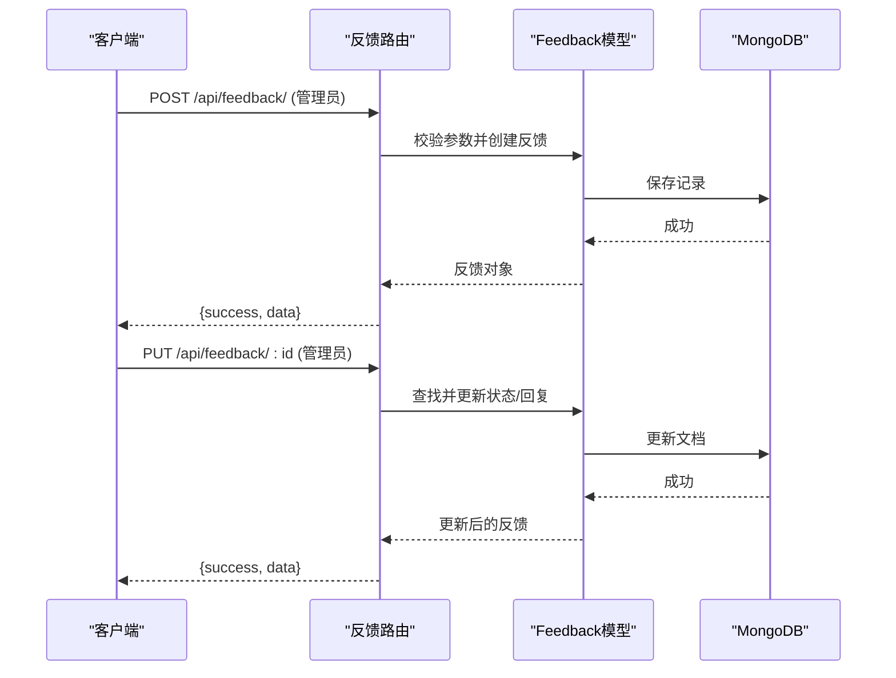
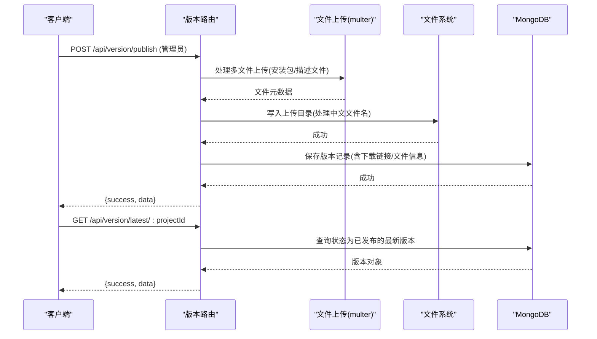
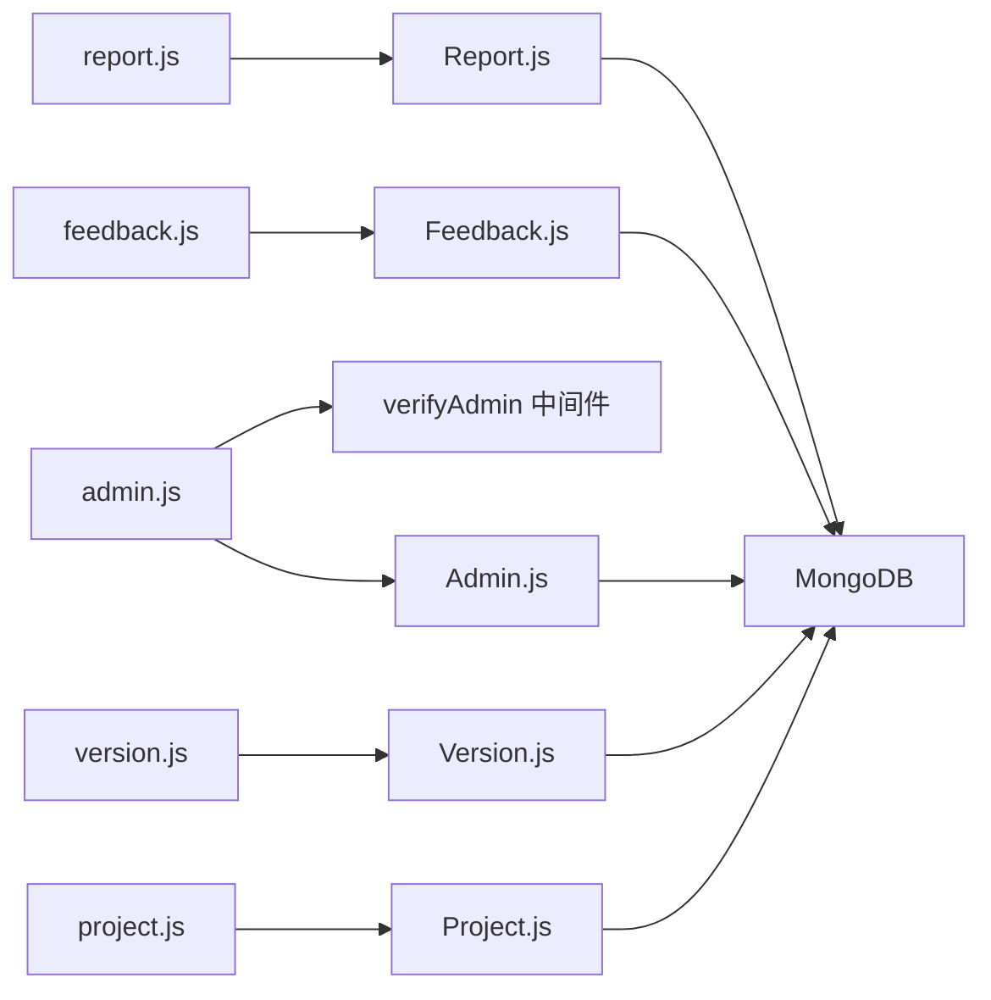

# API接口文档

<cite>
**本文档引用的文件**
- [server/app.js](file://server/app.js)
- [server/.env](file://server/.env)
- [server/routes/admin.js](file://server/routes/admin.js)
- [server/routes/report.js](file://server/routes/report.js)
- [server/routes/feedback.js](file://server/routes/feedback.js)
- [server/routes/version.js](file://server/routes/version.js)
- [server/routes/project.js](file://server/routes/project.js)
- [server/models/Admin.js](file://server/models/Admin.js)
- [server/models/Report.js](file://server/models/Report.js)
- [server/models/Feedback.js](file://server/models/Feedback.js)
- [server/models/Version.js](file://server/models/Version.js)
- [server/models/Project.js](file://server/models/Project.js)
- [api-usage-latest-version.md](file://api-usage-latest-version.md)
- [latest-example.yml](file://latest-example.yml)
- [README.md](file://README.md)
- [client/src/pages/VersionPage.jsx](file://client/src/pages/VersionPage.jsx)
</cite>

## 目录
1. [简介](#简介)
2. [项目结构](#项目结构)
3. [核心组件](#核心组件)
4. [架构总览](#架构总览)
5. [详细组件分析](#详细组件分析)
6. [依赖关系分析](#依赖关系分析)
7. [性能考虑](#性能考虑)
8. [故障排除指南](#故障排除指南)
9. [结论](#结论)
10. [附录](#附录)

## 简介
本项目为一个基于React前端、Node.js+Koa后端与MongoDB数据库的全栈应用，提供数据统计、意见反馈与版本更新通知三大功能模块。后端通过RESTful API对外提供统一接口，采用JWT进行管理员身份验证，支持文件上传与静态资源访问。

## 项目结构
后端采用Koa框架，通过路由注册统一挂载至/api前缀下，各业务模块独立维护路由与模型：

- 应用入口与中间件：Koa应用、CORS、BodyParser、静态文件服务
- 路由模块：
  - /api/admin：管理员认证与权限校验
  - /api/report：数据统计上报与查询
  - /api/feedback：意见反馈管理
  - /api/version：版本发布与查询
  - /api/projects：项目管理
- 数据模型：Admin、Report、Feedback、Version、Project



**图表来源**
- [server/app.js](file://server/app.js#L1-L61)
- [server/routes/admin.js](file://server/routes/admin.js#L1-L128)
- [server/routes/report.js](file://server/routes/report.js#L1-L271)
- [server/routes/feedback.js](file://server/routes/feedback.js#L1-L187)
- [server/routes/version.js](file://server/routes/version.js#L1-L432)
- [server/routes/project.js](file://server/routes/project.js#L1-L226)

**章节来源**
- [server/app.js](file://server/app.js#L1-L61)
- [README.md](file://README.md#L1-L44)

## 核心组件
- 认证与权限
  - 管理员登录：POST /api/admin/login，返回JWT令牌
  - 权限校验中间件：verifyAdmin，校验Authorization头中的JWT
  - 令牌验证：GET /api/admin/verify
- 数据统计
  - 上报数据：POST /api/report/addReport
  - 获取用户历史：GET /api/report/user/:username
  - 获取统计聚合：POST /api/report/getReportData
  - 自主上报：POST /api/report/submit（需管理员）
  - 删除记录：DELETE /api/report/:id（需管理员）
- 意见反馈
  - 获取反馈列表：GET /api/feedback/
  - 获取反馈详情：GET /api/feedback/:id
  - 提交反馈：POST /api/feedback/（需管理员）
  - 更新反馈：PUT /api/feedback/:id（需管理员）
  - 删除反馈：DELETE /api/feedback/:id（需管理员）
- 版本管理
  - 获取版本列表：GET /api/version/
  - 获取版本详情：GET /api/version/:id
  - 发布新版本：POST /api/version/publish（需管理员，支持多文件上传）
  - 设为最新版本：PUT /api/version/set-latest/:id（需管理员）
  - **获取最新版本**：GET /api/version/latest/:projectId（公开）
  - 更新版本状态：PUT /api/version/:id（需管理员）
  - 删除版本：DELETE /api/version/:id（需管理员）
- 项目管理
  - 获取项目列表：GET /api/projects/
  - 获取项目详情：GET /api/projects/:id
  - 创建项目：POST /api/projects/
  - 更新项目：PUT /api/projects/:id
  - 删除项目：DELETE /api/projects/:id
  - 数据迁移：POST /api/projects/migrate/:projectId

**章节来源**
- [server/routes/admin.js](file://server/routes/admin.js#L1-L128)
- [server/routes/report.js](file://server/routes/report.js#L1-L271)
- [server/routes/feedback.js](file://server/routes/feedback.js#L1-L187)
- [server/routes/version.js](file://server/routes/version.js#L1-L432)
- [server/routes/project.js](file://server/routes/project.js#L1-L226)

## 架构总览
后端通过Koa中间件链路处理请求，静态资源通过本地文件系统直接读取并返回；路由层根据权限中间件决定是否需要管理员令牌；模型层定义数据结构与约束；数据库层为MongoDB。



**图表来源**
- [server/app.js](file://server/app.js#L30-L55)
- [server/routes/admin.js](file://server/routes/admin.js#L100-L125)
- [server/routes/report.js](file://server/routes/report.js#L1-L271)
- [server/routes/feedback.js](file://server/routes/feedback.js#L1-L187)
- [server/routes/version.js](file://server/routes/version.js#L1-L432)
- [server/routes/project.js](file://server/routes/project.js#L1-L226)

## 详细组件分析

### 认证与权限
- 登录
  - 方法与路径：POST /api/admin/login
  - 请求体参数：
    - username：字符串，必填
    - password：字符串，必填
  - 成功响应：返回token与用户名
  - 失败响应：401 用户名或密码错误；500 服务器错误
- 令牌验证
  - 方法与路径：GET /api/admin/verify
  - 请求头：Authorization: Bearer <token>
  - 成功响应：返回用户名
  - 失败响应：401 未提供令牌或无效令牌
- 权限中间件
  - verifyAdmin：从Authorization头解析JWT，校验有效性并注入管理员上下文



**图表来源**
- [server/routes/admin.js](file://server/routes/admin.js#L27-L98)
- [server/models/Admin.js](file://server/models/Admin.js#L1-L32)

**章节来源**
- [server/routes/admin.js](file://server/routes/admin.js#L1-L128)
- [server/models/Admin.js](file://server/models/Admin.js#L1-L32)

### 数据统计接口
- 获取用户历史
  - 方法与路径：GET /api/report/user/:username
  - 查询参数：
    - page：整数，默认1
    - pageSize：整数，默认10
    - projectId：字符串，必填（路径参数）
  - 成功响应：返回数据数组、总数、页码与分页大小
  - 失败响应：400 缺少项目ID；500 服务器错误
- 获取统计聚合
  - 方法与路径：POST /api/report/getReportData
  - 请求体参数：
    - pageCurrent：整数，默认1
    - pageSize：整数，默认20
    - projectId：字符串，必填
  - 成功响应：返回去重后的用户最后一次上报记录与总数
  - 失败响应：400 缺少项目ID；500 获取数据统计失败
- 上报数据
  - 方法与路径：POST /api/report/addReport
  - 请求体参数：
    - username：字符串，必填
    - ip：字符串
    - userAgent：字符串
    - deviceInfo：字符串
    - location：字符串
    - version：字符串
    - remark：字符串
    - projectId：字符串，必填
  - 成功响应：返回上报记录
  - 失败响应：400 缺少项目ID或数据上报失败
- 自主上报（管理员）
  - 方法与路径：POST /api/report/submit
  - 请求体参数：与上报数据一致，服务端会注入timestamp与ip
  - 成功响应：返回上报记录
  - 失败响应：400 缺少必要字段；500 服务器错误
- 删除记录（管理员）
  - 方法与路径：DELETE /api/report/:id
  - 成功响应：删除成功
  - 失败响应：404 记录不存在；500 服务器错误



**图表来源**
- [server/routes/report.js](file://server/routes/report.js#L8-L229)

**章节来源**
- [server/routes/report.js](file://server/routes/report.js#L1-L271)

### 意见反馈接口
- 获取反馈列表
  - 方法与路径：GET /api/feedback/
  - 查询参数：
    - page：整数，默认1
    - pageSize：整数，默认10
    - projectId：字符串，必填
  - 成功响应：返回数据数组、总数、页码与分页大小
  - 失败响应：400 缺少项目ID；500 服务器错误
- 获取反馈详情
  - 方法与路径：GET /api/feedback/:id
  - 成功响应：返回反馈详情
  - 失败响应：404 未找到该反馈；500 获取失败
- 提交反馈（管理员）
  - 方法与路径：POST /api/feedback/
  - 请求体参数：
    - username：字符串，必填
    - email：字符串
    - content：字符串，必填
    - projectId：字符串，必填
  - 成功响应：返回新增反馈
  - 失败响应：400 缺少必要字段；500 提交失败
- 更新反馈（管理员）
  - 方法与路径：PUT /api/feedback/:id
  - 请求体参数：
    - status：枚举 pending/reviewed/resolved
    - replyInput：字符串，添加回复
    - admin：字符串，回复管理员名
  - 成功响应：返回更新后的反馈
  - 失败响应：404 未找到该反馈；500 更新失败
- 删除反馈（管理员）
  - 方法与路径：DELETE /api/feedback/:id
  - 成功响应：返回删除成功
  - 失败响应：404 未找到该反馈；500 删除失败



**图表来源**
- [server/routes/feedback.js](file://server/routes/feedback.js#L7-L184)
- [server/models/Feedback.js](file://server/models/Feedback.js#L1-L52)

**章节来源**
- [server/routes/feedback.js](file://server/routes/feedback.js#L1-L187)
- [server/models/Feedback.js](file://server/models/Feedback.js#L1-L52)

### 版本管理接口
- 获取版本列表
  - 方法与路径：GET /api/version/
  - 查询参数：
    - page：整数，默认1
    - pageSize：整数，默认10
    - projectId：字符串，必填
  - 成功响应：返回版本数组、总数、页码与分页大小
  - 失败响应：400 缺少项目ID；500 获取失败
- 获取版本详情
  - 方法与路径：GET /api/version/:id
  - 成功响应：返回版本详情
  - 失败响应：404 未找到该版本；500 获取失败
- 发布新版本（管理员）
  - 方法与路径：POST /api/version/publish
  - 表单参数（multipart/form-data）：
    - versionNumber：字符串，必填
    - description：字符串，必填
    - projectId：字符串，必填
    - publishedBy：字符串
    - originalFileName：字符串（可选，用于修复中文文件名）
    - updateType：枚举 force/active/passive，默认 passive
    - enableRename：字符串 'true'/'false'，控制文件名是否重命名
    - file：安装包文件（最多1个）
    - descriptionFile：描述文件（latest.yml，最多1个）
  - 成功响应：返回新建版本（含下载链接、文件信息等）
  - 失败响应：400 缺少必要字段；500 发布失败
- 设为最新版本（管理员）
  - 方法与路径：PUT /api/version/set-latest/:id
  - 流程：先将同项目其他已发布版本标记为已弃用，再将当前版本设为已发布
  - 成功响应：返回更新后的版本
  - 失败响应：404 未找到该版本；500 设置失败
- **获取最新版本（公开）**
  - **方法与路径**：GET /api/version/latest/:projectId
  - **权限要求**：无需权限验证（公开接口）
  - **查询参数**：
    - projectId：字符串，必填（路径参数）
  - **成功响应**：返回状态为已发布的最新版本
  - **失败响应**：
    - 400 缺少项目ID参数
    - 404 未找到已发布的版本
    - 500 获取失败
  - **响应数据结构**：
    ```javascript
    {
      "_id": "版本ID",
      "versionNumber": "1.0.0",
      "description": "版本描述",
      "projectId": "项目ID",
      "timestamp": "2025-07-26T12:00:00.000Z",
      "status": "published",
      "downloadUrl": "http://localhost:3000/uploads/file-123456789.zip",
      "originalFileName": "应用安装包.zip",
      "fileExt": ".zip",
      "publishedBy": "Admin",
      "fileSize": 1024000,
      "updateType": "passive",
      "descriptionFileUrl": "http://localhost:3000/uploads/latest.yml",
      "descriptionFileName": "latest.yml"
    }
    ```
  - **使用场景**：
    - 客户端应用检查是否有新版本可用
    - 自动更新功能获取最新版本信息
    - 下载页面显示最新版本信息
    - 版本对比和通知提醒
- 更新版本状态（管理员）
  - 方法与路径：PUT /api/version/:id
  - 请求体参数：
    - status：枚举 draft/published/deprecated
    - updateType：枚举 force/active/passive
    - versionNumber：字符串
    - description：字符串
  - 成功响应：返回更新后的版本
  - 失败响应：404 未找到该版本；500 更新失败
- 删除版本（管理员）
  - 方法与路径：DELETE /api/version/:id
  - 流程：删除上传文件（如存在），再删除数据库记录
  - 成功响应：返回删除成功
  - 失败响应：404 未找到该版本；500 删除失败



**图表来源**
- [server/routes/version.js](file://server/routes/version.js#L147-L339)
- [server/.env](file://server/.env#L1-L9)

**章节来源**
- [server/routes/version.js](file://server/routes/version.js#L1-L432)
- [server/.env](file://server/.env#L1-L9)
- [api-usage-latest-version.md](file://api-usage-latest-version.md#L1-L227)
- [latest-example.yml](file://latest-example.yml#L1-L38)
- [client/src/pages/VersionPage.jsx](file://client/src/pages/VersionPage.jsx#L96-L120)

### 项目管理接口
- 获取项目列表：GET /api/projects/
- 获取项目详情：GET /api/projects/:id
- 创建项目：POST /api/projects/
  - 请求体参数：name（必填）、description（可选）
  - 成功响应：返回新建项目（201）
  - 失败响应：400 项目名已存在；400 创建失败
- 更新项目：PUT /api/projects/:id
  - 请求体参数：name（可选）、description（可选，允许空字符串）
  - 成功响应：返回更新后的项目
  - 失败响应：404 未找到该项目；500 更新失败
- 删除项目：DELETE /api/projects/:id
  - 限制：系统必须保留至少一个项目
  - 成功响应：返回删除成功
  - 失败响应：400 至少保留一个项目；404 未找到该项目；500 删除失败
- 数据迁移：POST /api/projects/migrate/:projectId
  - 将所有缺失projectId的数据迁移至目标项目
  - 成功响应：返回迁移成功
  - 失败响应：500 迁移失败

**章节来源**
- [server/routes/project.js](file://server/routes/project.js#L1-L226)

## 依赖关系分析
- 组件耦合
  - 路由层依赖模型层进行数据操作
  - 管理员路由提供verifyAdmin中间件，被其他路由复用
  - 版本路由依赖multer进行文件上传，依赖文件系统与MongoDB
- 外部依赖
  - MongoDB：数据持久化
  - JWT：管理员令牌签发与验证
  - CORS：跨域支持
  - BodyParser：解析JSON与表单
  - Multer：文件上传
- 循环依赖
  - 未发现循环依赖（路由与模型单向依赖）



**图表来源**
- [server/routes/admin.js](file://server/routes/admin.js#L1-L128)
- [server/routes/report.js](file://server/routes/report.js#L1-L271)
- [server/routes/feedback.js](file://server/routes/feedback.js#L1-L187)
- [server/routes/version.js](file://server/routes/version.js#L1-L432)
- [server/routes/project.js](file://server/routes/project.js#L1-L226)
- [server/models/*.js](file://server/models/Admin.js#L1-L32)

**章节来源**
- [server/app.js](file://server/app.js#L1-L61)
- [server/routes/admin.js](file://server/routes/admin.js#L1-L128)

## 性能考虑
- 分页与聚合
  - 统计接口使用聚合管道与分页，避免一次性加载大量数据
- 文件上传
  - 上传目录与最大文件大小在环境变量中配置，建议结合Nginx或CDN优化大文件下载
- 缓存
  - 建议对公开的版本查询接口增加缓存层（如Redis）以降低数据库压力
- 并发
  - 对高并发场景建议引入限流中间件（如基于IP的滑动窗口限流）

## 故障排除指南
- 400 缺少项目ID/必要字段
  - 检查请求参数是否包含必需字段，特别是projectId
- 401 未提供令牌/无效令牌
  - 确认Authorization头格式为Bearer <token>，且令牌未过期
- 404 未找到记录
  - 确认ID或项目ID是否正确，以及相关文档是否存在
- 500 服务器错误
  - 查看后端日志定位具体异常，检查数据库连接与文件系统权限
- 文件上传失败
  - 检查上传目录权限、文件大小限制与中文文件名编码修复逻辑

**章节来源**
- [server/routes/report.js](file://server/routes/report.js#L13-L271)
- [server/routes/feedback.js](file://server/routes/feedback.js#L7-L187)
- [server/routes/version.js](file://server/routes/version.js#L147-L432)
- [server/routes/admin.js](file://server/routes/admin.js#L27-L125)

## 结论
本API设计遵循REST风格，围绕数据统计、意见反馈与版本管理三大业务域提供完整接口能力。通过JWT实现管理员权限控制，结合分页、聚合与文件上传等特性满足实际业务需求。新增的GET /api/version/latest/:projectId公开接口为客户端版本检查和自动更新提供了便利。建议在生产环境中完善限流、缓存与监控体系，并持续优化前端集成体验。

## 附录

### 认证机制说明
- JWT密钥来源：JWT_SECRET来自环境变量，默认开发密钥为固定值
- 令牌有效期：24小时
- 使用方式：在请求头中添加 Authorization: Bearer <token>
- 建议：生产环境务必设置安全的JWT_SECRET并启用HTTPS

**章节来源**
- [server/routes/admin.js](file://server/routes/admin.js#L6-L67)
- [server/.env](file://server/.env#L1-L9)

### 数据验证与格式
- 输入验证
  - 必填字段缺失时返回400
  - 枚举字段不合法时由数据库约束或路由层拦截
- 输出格式
  - 统一响应结构：{success: boolean, data?, message?, error?}
  - 分页接口额外包含total、page、pageSize
- 数据类型
  - ObjectId：通过mongoose.Types.ObjectId转换
  - 时间戳：ISO字符串
  - 文件大小：字节数

**章节来源**
- [server/routes/report.js](file://server/routes/report.js#L134-L271)
- [server/routes/feedback.js](file://server/routes/feedback.js#L71-L187)
- [server/routes/version.js](file://server/routes/version.js#L147-L432)
- [server/models/*.js](file://server/models/Report.js#L1-L22)

### API版本控制与限流策略
- 版本控制
  - 当前API未显式版本前缀，建议在路由前添加/v1以支持多版本并存
- 限流策略
  - 当前未实现限流中间件，建议针对登录与敏感接口实施IP级限流

**章节来源**
- [server/app.js](file://server/app.js#L48-L55)

### 错误码说明
- 400：请求参数缺失或非法
- 401：未提供令牌或令牌无效
- 404：资源不存在
- 500：服务器内部错误

**章节来源**
- [server/routes/report.js](file://server/routes/report.js#L13-L271)
- [server/routes/feedback.js](file://server/routes/feedback.js#L7-L187)
- [server/routes/version.js](file://server/routes/version.js#L83-L432)
- [server/routes/admin.js](file://server/routes/admin.js#L27-L125)

### API测试指南与集成示例
- 前端调用示例参考：获取最新版本接口的调用示例与React Hook集成方式
- 集成要点
  - 登录后缓存token并在后续请求头中携带
  - 对公开接口（如获取最新版本）做好404场景处理
  - 上传版本时确保multipart/form-data格式与文件大小限制
- **最新版本接口使用示例**：
  - 基础调用：`GET /api/version/latest/{projectId}`
  - 响应处理：检查success字段，404表示暂无已发布版本
  - 实际应用：客户端定期检查最新版本，触发自动更新流程

**章节来源**
- [api-usage-latest-version.md](file://api-usage-latest-version.md#L1-L227)
- [client/src/pages/VersionPage.jsx](file://client/src/pages/VersionPage.jsx#L96-L120)