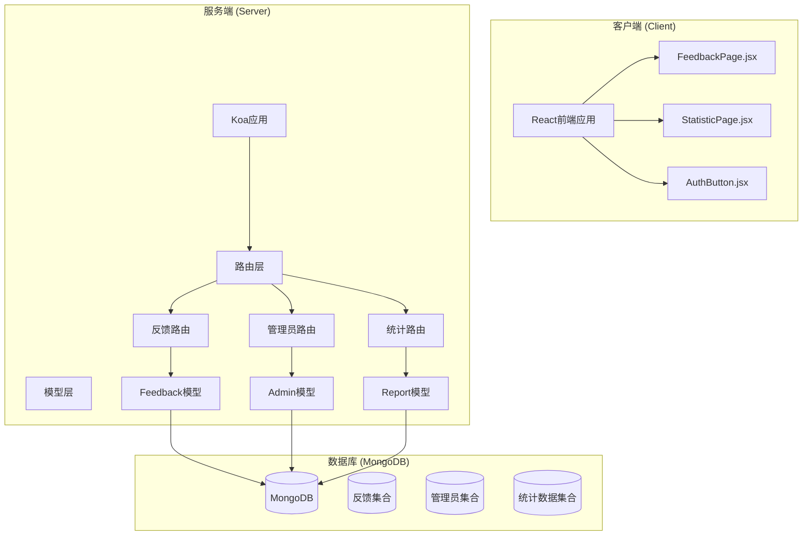
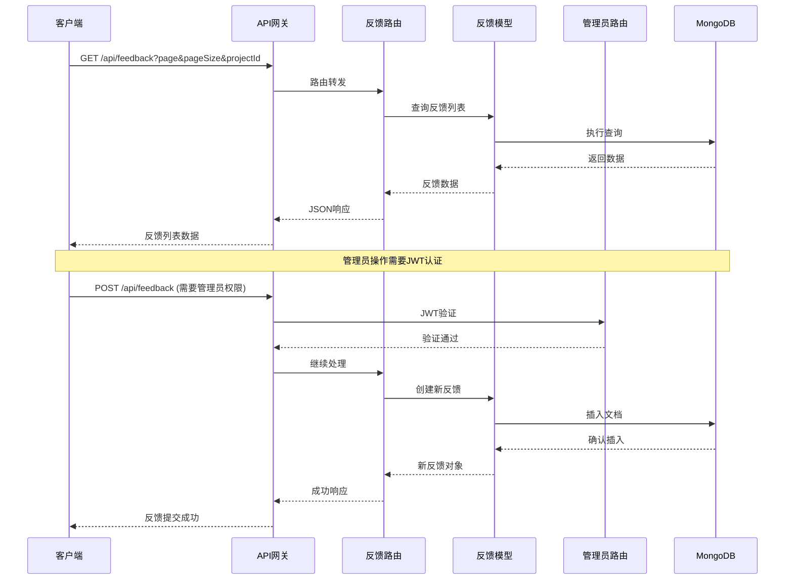
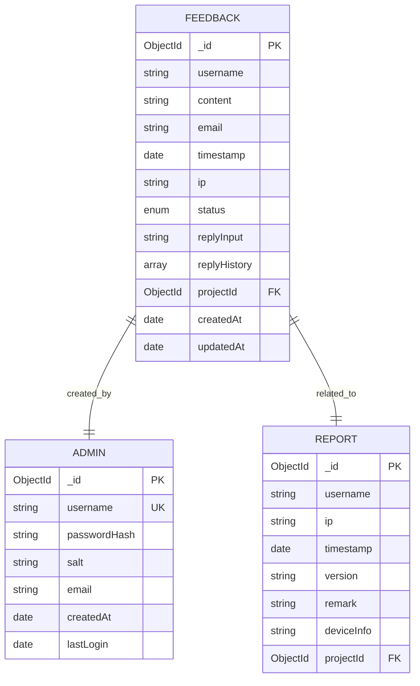
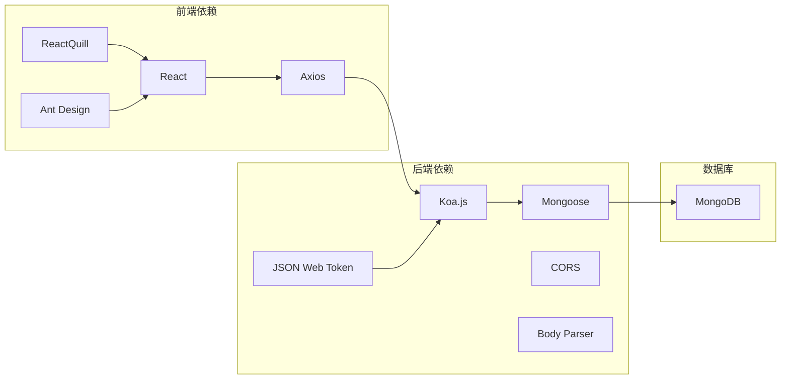

# 反馈管理API

<cite>
**本文档引用的文件**
- [server/app.js](file://server/app.js)
- [server/routes/feedback.js](file://server/routes/feedback.js)
- [server/models/Feedback.js](file://server/models/Feedback.js)
- [server/routes/admin.js](file://server/routes/admin.js)
- [server/models/Admin.js](file://server/models/Admin.js)
- [client/src/pages/FeedbackPage.jsx](file://client/src/pages/FeedbackPage.jsx)
- [client/src/components/AuthButton.jsx](file://client/src/components/AuthButton.jsx)
- [server/db.js](file://server/db.js)
- [db/woax.feedbacks.json](file://db/woax.feedbacks.json)
- [server/routes/report.js](file://server/routes/report.js)
- [server/models/Report.js](file://server/models/Report.js)
- [client/src/pages/StatisticPage/index.jsx](file://client/src/pages/StatisticPage/index.jsx)
</cite>

## 目录
1. [简介](#简介)
2. [项目结构](#项目结构)
3. [核心组件](#核心组件)
4. [架构概览](#架构概览)
5. [详细组件分析](#详细组件分析)
6. [依赖关系分析](#依赖关系分析)
7. [性能考虑](#性能考虑)
8. [故障排除指南](#故障排除指南)
9. [结论](#结论)
10. [附录](#附录)

## 简介
本项目是一个基于React前端、Node.js+Koa后端和MongoDB数据库的全栈应用程序，主要功能包括数据统计、意见反馈和版本更新通知。本文档专注于反馈管理模块的完整API文档，涵盖用户反馈提交、查询、回复、状态管理以及相关的权限控制和数据统计功能。

## 项目结构
项目采用前后端分离架构，采用模块化设计，便于维护和扩展。



**图表来源**
- [server/app.js](file://server/app.js#L1-L61)
- [server/routes/feedback.js](file://server/routes/feedback.js#L1-L187)
- [server/routes/admin.js](file://server/routes/admin.js#L1-L128)
- [server/routes/report.js](file://server/routes/report.js#L1-L271)

**章节来源**
- [server/app.js](file://server/app.js#L1-L61)
- [README.md](file://README.md#L1-L44)

## 核心组件
反馈管理模块包含以下核心组件：

### 1. 反馈管理器 (Feedback Manager)
负责处理用户反馈的完整生命周期，包括提交、查询、更新和删除操作。

### 2. 管理员认证系统 (Admin Authentication System)
提供JWT令牌验证机制，确保只有授权管理员可以执行敏感操作。

### 3. 富文本编辑器 (Rich Text Editor)
集成ReactQuill组件，支持富文本内容的编辑和展示。

### 4. 权限控制组件 (Permission Control Component)
基于AuthButton组件实现细粒度的权限控制。

**章节来源**
- [server/routes/feedback.js](file://server/routes/feedback.js#L1-L187)
- [server/models/Feedback.js](file://server/models/Feedback.js#L1-L52)
- [client/src/pages/FeedbackPage.jsx](file://client/src/pages/FeedbackPage.jsx#L1-L496)

## 架构概览
反馈管理系统采用RESTful API设计，遵循MVC架构模式，实现了完整的CRUD操作和权限控制。



**图表来源**
- [server/routes/feedback.js](file://server/routes/feedback.js#L7-L43)
- [server/routes/admin.js](file://server/routes/admin.js#L100-L125)
- [server/models/Feedback.js](file://server/models/Feedback.js#L1-L52)

## 详细组件分析

### 反馈API接口规范

#### 1. 获取反馈列表
**HTTP方法**: GET  
**路径**: `/api/feedback`  
**权限**: 无需登录  
**查询参数**:
- `page` (可选): 页码，默认值为1
- `pageSize` (可选): 每页条数，默认值为10
- `projectId` (必需): 项目ID

**响应格式**:
```javascript
{
  "success": true,
  "data": [
    {
      "_id": "ObjectId",
      "username": "string",
      "content": "string",
      "email": "string",
      "timestamp": "Date",
      "ip": "string",
      "status": "pending|reviewed|resolved",
      "replyInput": "string",
      "replyHistory": [
        {
          "content": "string",
          "time": "Date",
          "admin": "string"
        }
      ],
      "projectId": "ObjectId"
    }
  ],
  "total": number,
  "page": number,
  "pageSize": number
}
```

**章节来源**
- [server/routes/feedback.js](file://server/routes/feedback.js#L8-L43)

#### 2. 获取单个反馈详情
**HTTP方法**: GET  
**路径**: `/api/feedback/:id`  
**权限**: 无需登录

**响应格式**:
```javascript
{
  "success": true,
  "data": {
    "_id": "ObjectId",
    "username": "string",
    "content": "string",
    "email": "string",
    "timestamp": "Date",
    "ip": "string",
    "status": "pending|reviewed|resolved",
    "replyInput": "string",
    "replyHistory": [
      {
        "content": "string",
        "time": "Date",
        "admin": "string"
      }
    ],
    "projectId": "ObjectId"
  }
}
```

**章节来源**
- [server/routes/feedback.js](file://server/routes/feedback.js#L46-L69)

#### 3. 提交新反馈
**HTTP方法**: POST  
**路径**: `/api/feedback`  
**权限**: 管理员权限  
**请求头**: `Authorization: Bearer <JWT_TOKEN>`  
**请求体**:
```javascript
{
  "username": "string",
  "email": "string",
  "content": "string",
  "projectId": "ObjectId"
}
```

**响应格式**:
```javascript
{
  "success": true,
  "message": "反馈提交成功",
  "data": {
    "_id": "ObjectId",
    "username": "string",
    "content": "string",
    "email": "string",
    "timestamp": "Date",
    "ip": "string",
    "status": "pending",
    "replyHistory": [],
    "projectId": "ObjectId"
  }
}
```

**章节来源**
- [server/routes/feedback.js](file://server/routes/feedback.js#L72-L111)

#### 4. 更新反馈状态和回复
**HTTP方法**: PUT  
**路径**: `/api/feedback/:id`  
**权限**: 管理员权限  
**请求头**: `Authorization: Bearer <JWT_TOKEN>`  
**请求体**:
```javascript
{
  "status": "pending|reviewed|resolved",
  "replyInput": "string",
  "admin": "string"
}
```

**响应格式**:
```javascript
{
  "success": true,
  "message": "反馈更新成功",
  "data": {
    "_id": "ObjectId",
    "username": "string",
    "content": "string",
    "email": "string",
    "timestamp": "Date",
    "ip": "string",
    "status": "pending|reviewed|resolved",
    "replyHistory": [
      {
        "content": "string",
        "time": "Date",
        "admin": "string"
      }
    ],
    "projectId": "ObjectId"
  }
}
```

**章节来源**
- [server/routes/feedback.js](file://server/routes/feedback.js#L114-L158)

#### 5. 删除反馈
**HTTP方法**: DELETE  
**路径**: `/api/feedback/:id`  
**权限**: 管理员权限  
**请求头**: `Authorization: Bearer <JWT_TOKEN>`

**响应格式**:
```javascript
{
  "success": true,
  "message": "反馈已删除"
}
```

**章节来源**
- [server/routes/feedback.js](file://server/routes/feedback.js#L160-L184)

### 管理员认证系统

#### 1. 管理员登录
**HTTP方法**: POST  
**路径**: `/api/admin/login`  
**请求体**:
```javascript
{
  "username": "string",
  "password": "string"
}
```

**响应格式**:
```javascript
{
  "success": true,
  "data": {
    "token": "JWT_TOKEN",
    "username": "string"
  }
}
```

#### 2. 验证管理员令牌
**HTTP方法**: GET  
**路径**: `/api/admin/verify`  
**请求头**: `Authorization: Bearer <JWT_TOKEN>`

**响应格式**:
```javascript
{
  "success": true,
  "data": {
    "username": "string"
  }
}
```

**章节来源**
- [server/routes/admin.js](file://server/routes/admin.js#L27-L98)
- [server/models/Admin.js](file://server/models/Admin.js#L1-L32)

### 富文本处理和附件上传

#### 富文本处理
系统使用ReactQuill组件处理富文本内容，支持：
- 文本格式化（粗体、斜体、下划线）
- 列表（有序、无序）
- 链接和图片
- 自定义样式

#### 附件上传
系统支持文件上传功能，包括：
- 文件类型验证
- 文件大小限制
- 安全的文件存储
- 静态文件服务

**章节来源**
- [client/src/pages/FeedbackPage.jsx](file://client/src/pages/FeedbackPage.jsx#L15-L16)
- [server/app.js](file://server/app.js#L34-L45)

### 反馈查询接口

#### 分页查询
支持灵活的分页查询，包括：
- 页码控制 (`page`)
- 每页数量控制 (`pageSize`)
- 项目过滤 (`projectId`)

#### 筛选功能
支持基于项目ID的精确筛选，确保数据隔离。

#### 状态管理
反馈状态支持三种状态：
- `pending`: 待处理
- `reviewed`: 已审阅  
- `resolved`: 已解决

**章节来源**
- [server/routes/feedback.js](file://server/routes/feedback.js#L8-L43)

### 反馈回复机制

#### 回复历史
系统维护完整的回复历史记录，包括：
- 回复内容
- 管理员信息
- 时间戳
- 自动格式化显示

#### 实时更新
前端实现即时更新机制：
- 前端预渲染回复内容
- 后端持久化存储
- 数据同步优化

**章节来源**
- [client/src/pages/FeedbackPage.jsx](file://client/src/pages/FeedbackPage.jsx#L415-L459)
- [server/models/Feedback.js](file://server/models/Feedback.js#L35-L41)

### 权限控制机制

#### JWT令牌验证
系统采用JWT令牌进行身份验证：
- 24小时有效期
- 服务器端签名验证
- 自动过期处理

#### 细粒度权限控制
- 反馈查询：公开访问
- 反馈提交：管理员权限
- 反馈更新：管理员权限
- 反馈删除：管理员权限

#### 前端权限提示
AuthButton组件提供直观的权限提示：
- 未登录状态显示锁图标
- 权限不足时显示工具提示
- 自动跳转到登录界面

**章节来源**
- [client/src/components/AuthButton.jsx](file://client/src/components/AuthButton.jsx#L1-L43)
- [server/routes/admin.js](file://server/routes/admin.js#L100-L125)

### 数据模型设计

#### Feedback模型


**图表来源**
- [server/models/Feedback.js](file://server/models/Feedback.js#L3-L49)
- [server/models/Admin.js](file://server/models/Admin.js#L4-L14)
- [server/models/Report.js](file://server/models/Report.js#L3-L19)

**章节来源**
- [server/models/Feedback.js](file://server/models/Feedback.js#L1-L52)
- [server/models/Admin.js](file://server/models/Admin.js#L1-L32)
- [server/models/Report.js](file://server/models/Report.js#L1-L22)

## 依赖关系分析

### 组件耦合度
反馈管理模块具有良好的内聚性和低耦合性：
- 路由层与业务逻辑分离
- 模型层独立封装数据访问
- 前后端职责明确划分

### 外部依赖
系统依赖的关键外部组件：
- **Koa.js**: Web框架
- **MongoDB**: NoSQL数据库
- **ReactQuill**: 富文本编辑器
- **JWT**: 令牌认证
- **Ant Design**: UI组件库



**图表来源**
- [server/app.js](file://server/app.js#L1-L61)
- [client/src/pages/FeedbackPage.jsx](file://client/src/pages/FeedbackPage.jsx#L1-L496)

**章节来源**
- [server/app.js](file://server/app.js#L1-L61)
- [client/src/pages/FeedbackPage.jsx](file://client/src/pages/FeedbackPage.jsx#L1-L496)

## 性能考虑

### 数据库优化
- **索引策略**: 在`projectId`和`timestamp`字段上建立复合索引
- **查询优化**: 使用投影减少数据传输
- **分页优化**: 采用游标分页提高查询效率

### 缓存策略
- **静态资源缓存**: 利用浏览器缓存机制
- **API响应缓存**: 对不频繁变更的数据实施缓存
- **会话管理**: JWT令牌的合理过期时间

### 并发处理
- **连接池管理**: 合理配置数据库连接池
- **请求限流**: 防止恶意请求攻击
- **超时处理**: 设置合理的请求超时时间

## 故障排除指南

### 常见错误及解决方案

#### 1. 数据库连接失败
**症状**: 应用启动时报数据库连接错误  
**解决方案**:
- 检查MongoDB服务是否启动
- 验证连接字符串配置
- 确认网络连接正常

#### 2. JWT令牌验证失败
**症状**: 管理员操作返回401错误  
**解决方案**:
- 检查JWT_SECRET配置
- 验证令牌格式和有效期
- 确认管理员账户存在

#### 3. 富文本内容显示异常
**症状**: 富文本内容无法正确显示  
**解决方案**:
- 检查ReactQuill主题配置
- 验证HTML内容安全性
- 确认CSS样式加载

#### 4. 文件上传失败
**症状**: 附件上传返回错误  
**解决方案**:
- 检查上传目录权限
- 验证文件大小限制
- 确认文件类型允许

**章节来源**
- [server/db.js](file://server/db.js#L10-L24)
- [server/routes/admin.js](file://server/routes/admin.js#L100-L125)
- [client/src/pages/FeedbackPage.jsx](file://client/src/pages/FeedbackPage.jsx#L415-L459)

## 结论
反馈管理模块提供了完整的用户反馈生命周期管理功能，包括提交、查询、回复、状态管理和权限控制。系统采用现代化的技术栈，具有良好的可扩展性和维护性。通过JWT认证机制确保了操作的安全性，通过富文本编辑器提供了优秀的用户体验。

## 附录

### API使用示例

#### 1. 获取反馈列表
```javascript
// 基础查询
fetch('/api/feedback?page=1&pageSize=10&projectId=PROJECT_ID')

// 响应示例
{
  "success": true,
  "data": [...],
  "total": 100,
  "page": 1,
  "pageSize": 10
}
```

#### 2. 提交反馈
```javascript
// 需要管理员权限
const response = await fetch('/api/feedback', {
  method: 'POST',
  headers: {
    'Content-Type': 'application/json',
    'Authorization': 'Bearer YOUR_JWT_TOKEN'
  },
  body: JSON.stringify({
    username: 'testuser',
    email: 'test@example.com',
    content: '<p>反馈内容</p>',
    projectId: 'PROJECT_ID'
  })
})
```

#### 3. 更新反馈状态
```javascript
// 更新状态和添加回复
await fetch(`/api/feedback/${FEEDBACK_ID}`, {
  method: 'PUT',
  headers: {
    'Content-Type': 'application/json',
    'Authorization': 'Bearer YOUR_JWT_TOKEN'
  },
  body: JSON.stringify({
    status: 'reviewed',
    replyInput: '<p>回复内容</p>',
    admin: '管理员'
  })
})
```

### 安全最佳实践

#### 1. 输入验证
- 对所有用户输入进行验证
- 实施严格的字符过滤
- 防止XSS攻击

#### 2. 权限控制
- 实施最小权限原则
- 定期审计访问日志
- 使用HTTPS传输

#### 3. 数据保护
- 敏感数据加密存储
- 定期备份数据库
- 实施数据脱敏

**章节来源**
- [server/routes/feedback.js](file://server/routes/feedback.js#L72-L111)
- [server/routes/admin.js](file://server/routes/admin.js#L27-L67)
- [client/src/pages/FeedbackPage.jsx](file://client/src/pages/FeedbackPage.jsx#L194-L219)