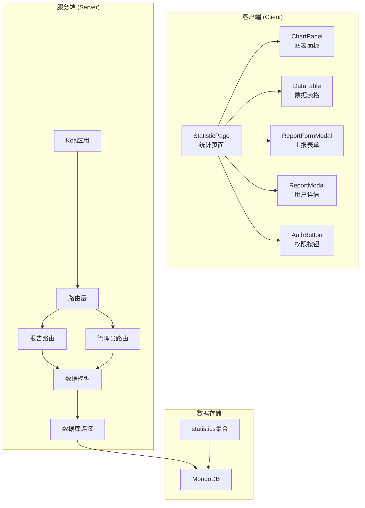
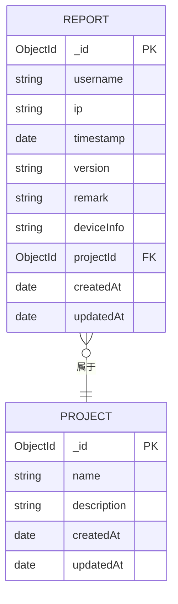
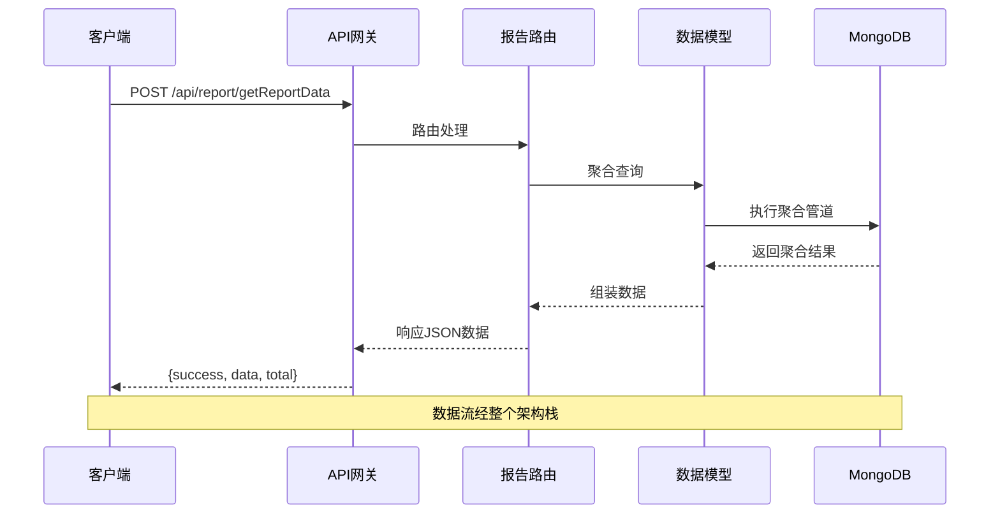
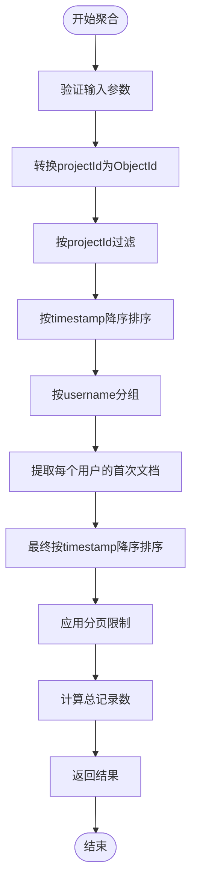
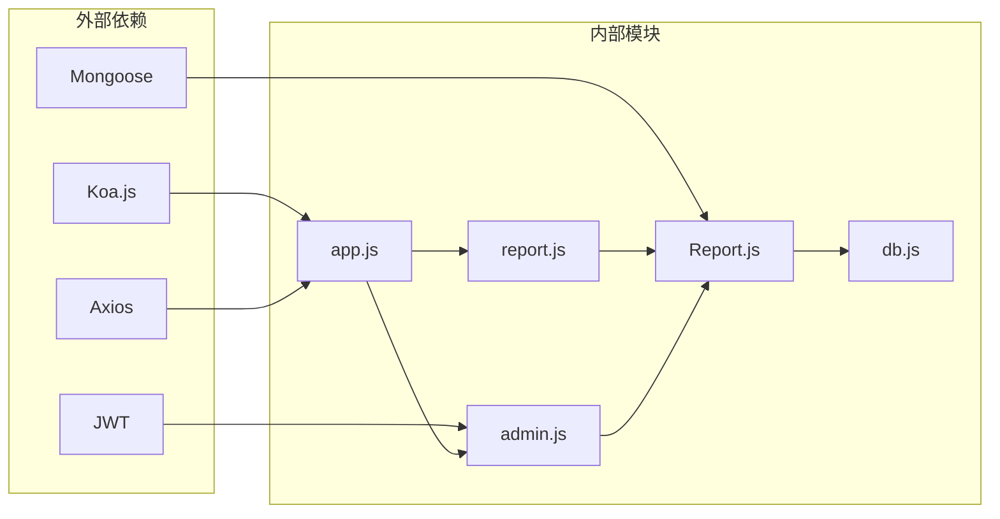
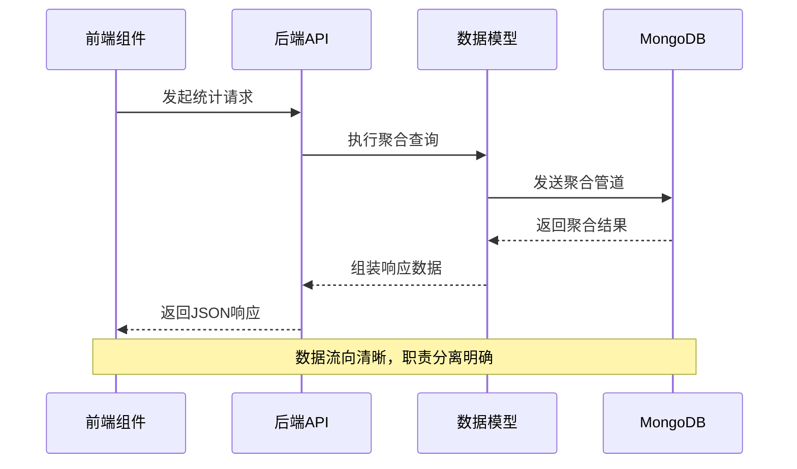
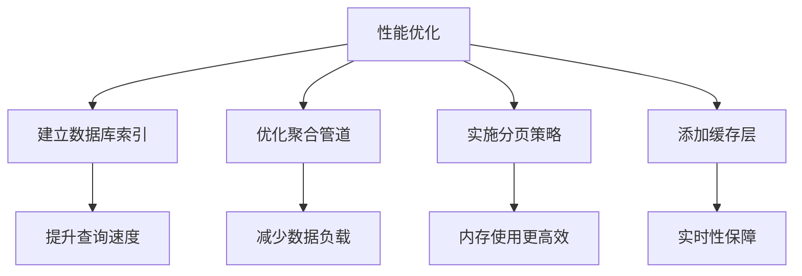

# 数据统计API

<cite>
**本文档引用的文件**
- [server/app.js](file://server/app.js)
- [server/routes/report.js](file://server/routes/report.js)
- [server/models/Report.js](file://server/models/Report.js)
- [server/routes/admin.js](file://server/routes/admin.js)
- [server/db.js](file://server/db.js)
- [client/src/pages/StatisticPage/index.jsx](file://client/src/pages/StatisticPage/index.jsx)
- [client/src/pages/StatisticPage/ChartPanel.jsx](file://client/src/pages/StatisticPage/ChartPanel.jsx)
- [client/src/pages/StatisticPage/DataTable.jsx](file://client/src/pages/StatisticPage/DataTable.jsx)
- [client/src/pages/StatisticPage/ReportFormModal.jsx](file://client/src/pages/StatisticPage/ReportFormModal.jsx)
- [client/src/pages/StatisticPage/ReportModal.jsx](file://client/src/pages/StatisticPage/ReportModal.jsx)
- [client/src/components/AuthButton.jsx](file://client/src/components/AuthButton.jsx)
- [db/woax.statistics.json](file://db/woax.statistics.json)
</cite>

## 目录
1. [简介](#简介)
2. [项目结构](#项目结构)
3. [核心组件](#核心组件)
4. [架构概览](#架构概览)
5. [详细组件分析](#详细组件分析)
6. [依赖关系分析](#依赖关系分析)
7. [性能考虑](#性能考虑)
8. [故障排除指南](#故障排除指南)
9. [结论](#结论)
10. [附录](#附录)

## 简介

数据统计API是一个基于Node.js和MongoDB构建的统计数据分析系统，主要用于收集、存储、查询和展示用户行为统计数据。该系统提供了完整的统计数据收集接口、查询接口、聚合计算功能和可视化展示能力。

系统采用前后端分离架构，后端使用Koa.js框架提供RESTful API，前端使用React+Ant Design构建用户界面。数据存储采用MongoDB，通过Mongoose ORM进行数据模型管理。

## 项目结构



**图表来源**
- [server/app.js](file://server/app.js#L1-L61)
- [server/routes/report.js](file://server/routes/report.js#L1-L271)
- [server/routes/admin.js](file://server/routes/admin.js#L1-L128)

**章节来源**
- [server/app.js](file://server/app.js#L1-L61)
- [client/src/pages/StatisticPage/index.jsx](file://client/src/pages/StatisticPage/index.jsx#L1-L262)

## 核心组件

### 数据模型设计

Report数据模型定义了统计数据的核心结构：



**图表来源**
- [server/models/Report.js](file://server/models/Report.js#L1-L22)

### API路由结构

系统提供以下主要API端点：

| 端点 | 方法 | 功能描述 | 权限要求 |
|------|------|----------|----------|
| `/api/report/getReportData` | POST | 获取统计数据（支持分页和聚合） | 无 |
| `/api/report/user/:username` | GET | 获取指定用户的全部记录 | 无 |
| `/api/report/addReport` | POST | 添加上报数据 | 无 |
| `/api/report/:id` | GET | 获取单条记录详情 | 无 |
| `/api/report/:id` | DELETE | 删除记录 | 管理员 |
| `/api/report/submit` | POST | 自主上报（管理员） | 管理员 |

**章节来源**
- [server/routes/report.js](file://server/routes/report.js#L1-L271)
- [server/routes/admin.js](file://server/routes/admin.js#L100-L125)

## 架构概览



**图表来源**
- [server/routes/report.js](file://server/routes/report.js#L8-L88)
- [server/models/Report.js](file://server/models/Report.js#L1-L22)

## 详细组件分析

### 统计数据收集接口

#### 接口定义

**端点**: `POST /api/report/getReportData`

**请求格式**:
```javascript
{
  pageCurrent: number,     // 当前页码，默认1
  pageSize: number,        // 每页大小，默认20
  projectId: string        // 项目ID（必填）
}
```

**响应格式**:
```javascript
{
  success: boolean,
  data: Array[Object],
  total: number
}
```

**数据验证规则**:
- `projectId` 必填且必须为有效的MongoDB ObjectId格式
- `pageCurrent` 和 `pageSize` 必须为正整数
- 默认分页参数：当前页1，每页20条记录

#### 聚合计算逻辑

系统实现了智能的用户去重聚合算法：



**图表来源**
- [server/routes/report.js](file://server/routes/report.js#L26-L51)

**章节来源**
- [server/routes/report.js](file://server/routes/report.js#L8-L88)

### 数据查询接口

#### 用户记录查询

**端点**: `GET /api/report/user/:username`

**查询参数**:
```javascript
{
  page: number,           // 页码，默认1
  pageSize: number,       // 每页大小，默认10
  projectId: string       // 项目ID（必填）
}
```

**响应格式**:
```javascript
{
  success: boolean,
  data: Array[Object],
  total: number,
  page: number,
  pageSize: number
}
```

**分页机制**:
- 支持动态分页参数调整
- 内置总数计算
- 支持不同页面大小（10, 20, 50, 100）

**章节来源**
- [server/routes/report.js](file://server/routes/report.js#L90-L131)

### 数据上报接口

#### 自主上报

**端点**: `POST /api/report/submit`

**请求格式**:
```javascript
{
  username: string,       // 用户名（必填）
  ip: string,             // IP地址
  userAgent: string,      // 用户代理
  deviceInfo: string,     // 设备信息
  location: string,       // 位置
  version: string,        // 版本号
  remark: string,         // 备注
  projectId: string       // 项目ID（必填）
}
```

**权限控制**:
- 需要管理员权限
- 使用JWT令牌验证
- 自动记录上报时间和IP地址

**章节来源**
- [server/routes/report.js](file://server/routes/report.js#L231-L268)
- [server/routes/admin.js](file://server/routes/admin.js#L100-L125)

### 数据导出功能

系统提供了灵活的数据导出能力：

**全量数据获取**:
- 通过设置较大的pageSize（如100000）获取全量数据
- 用于图表展示和数据分析
- 自动应用项目ID过滤

**前端实现**:
```javascript
// 获取全量数据用于图表
const response = await axios.post('/api/report/getReportData', {
  pageCurrent: 1,
  pageSize: 100000,
  projectId: currentProject._id
});
```

**章节来源**
- [client/src/pages/StatisticPage/index.jsx](file://client/src/pages/StatisticPage/index.jsx#L87-L109)

## 依赖关系分析



**图表来源**
- [server/app.js](file://server/app.js#L1-L61)
- [server/routes/report.js](file://server/routes/report.js#L1-L271)
- [server/routes/admin.js](file://server/routes/admin.js#L1-L128)
- [server/models/Report.js](file://server/models/Report.js#L1-L22)
- [server/db.js](file://server/db.js#L1-L45)

### 数据流分析



**图表来源**
- [client/src/pages/StatisticPage/index.jsx](file://client/src/pages/StatisticPage/index.jsx#L57-L109)
- [server/routes/report.js](file://server/routes/report.js#L26-L88)

**章节来源**
- [server/routes/report.js](file://server/routes/report.js#L1-L271)
- [client/src/pages/StatisticPage/index.jsx](file://client/src/pages/StatisticPage/index.jsx#L1-L262)

## 性能考虑

### 缓存策略

虽然当前实现未实现专门的缓存层，但系统具备良好的性能基础：

1. **数据库索引优化**
   - ObjectId默认索引
   - 建议为常用查询字段建立索引

2. **聚合查询优化**
   - 使用$match预过滤减少数据量
   - 合理的分页策略避免全表扫描

3. **前端缓存**
   - 图表数据缓存策略
   - 分页状态本地持久化

### 查询优化建议



### 并发处理

- 支持高并发数据上报
- 聚合查询自动去重处理
- 分页查询避免大数据集传输

## 故障排除指南

### 常见错误码

| 错误码 | 描述 | 可能原因 | 解决方案 |
|--------|------|----------|----------|
| 400 | 请求参数错误 | 缺少必需参数 | 检查请求体格式 |
| 401 | 未授权访问 | 令牌无效或缺失 | 重新登录获取令牌 |
| 404 | 资源不存在 | 记录ID错误 | 验证资源ID |
| 500 | 服务器内部错误 | 数据库连接问题 | 检查数据库状态 |

### 调试步骤

1. **检查数据库连接**
   ```bash
   # 验证MongoDB连接状态
   mongo --host localhost --port 27017
   ```

2. **验证API端点**
   ```bash
   # 测试统计接口
   curl -X POST http://localhost:3001/api/report/getReportData \
     -H "Content-Type: application/json" \
     -d '{"pageCurrent":1,"pageSize":20,"projectId":"your-project-id"}'
   ```

3. **查看日志**
   - 服务器启动日志
   - 数据库连接日志
   - API调用错误日志

### 数据验证

**前端验证**:
- 表单必填字段验证
- 项目ID格式验证
- 分页参数范围检查

**后端验证**:
- ObjectId格式验证
- 项目权限验证
- 数据完整性检查

**章节来源**
- [server/routes/report.js](file://server/routes/report.js#L134-L176)
- [server/routes/admin.js](file://server/routes/admin.js#L27-L67)

## 结论

数据统计API系统提供了完整的统计数据收集、存储、查询和展示解决方案。系统具有以下优势：

1. **架构清晰**: 前后端分离，职责明确
2. **功能完整**: 支持数据收集、查询、聚合和可视化
3. **扩展性强**: 基于MongoDB的灵活数据模型
4. **安全性**: 管理员权限控制和JWT认证

建议后续改进方向：
- 添加Redis缓存层提升查询性能
- 实现数据导出功能（CSV/Excel）
- 增加数据统计报表生成功能
- 完善监控和日志系统

## 附录

### API使用示例

**获取统计数据**:
```javascript
const response = await axios.post('/api/report/getReportData', {
  pageCurrent: 1,
  pageSize: 20,
  projectId: 'your-project-id'
});
```

**获取用户记录**:
```javascript
const response = await axios.get('/api/report/user/testuser', {
  params: {
    page: 1,
    pageSize: 10,
    projectId: 'your-project-id'
  }
});
```

**上报数据**:
```javascript
const response = await axios.post('/api/report/addReport', {
  username: 'testuser',
  ip: '127.0.0.1',
  userAgent: 'Chrome/91.0',
  deviceInfo: 'Windows - Chrome',
  location: 'Beijing',
  version: '1.0.0',
  remark: 'Test report',
  projectId: 'your-project-id'
});
```

### 数据模型字段说明

| 字段名 | 类型 | 必填 | 描述 | 示例 |
|--------|------|------|------|------|
| username | string | 是 | 用户名 | "testuser" |
| ip | string | 否 | IP地址 | "127.0.0.1" |
| timestamp | date | 否 | 上报时间 | "2025-05-10T19:27:00.747Z" |
| version | string | 否 | 版本号 | "1.0.0" |
| remark | string | 否 | 备注信息 | "Test report" |
| deviceInfo | string | 否 | 设备信息 | "Windows - Chrome" |
| projectId | ObjectId | 是 | 项目ID | "682031eaba8af1129bfdf62c" |

### 安全和隐私保护

1. **数据最小化**: 仅收集必要的统计信息
2. **访问控制**: 管理员权限验证
3. **数据加密**: 敏感信息的存储和传输
4. **审计日志**: 操作记录追踪
5. **隐私合规**: 符合相关数据保护法规