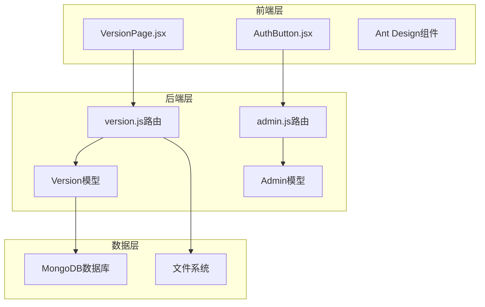
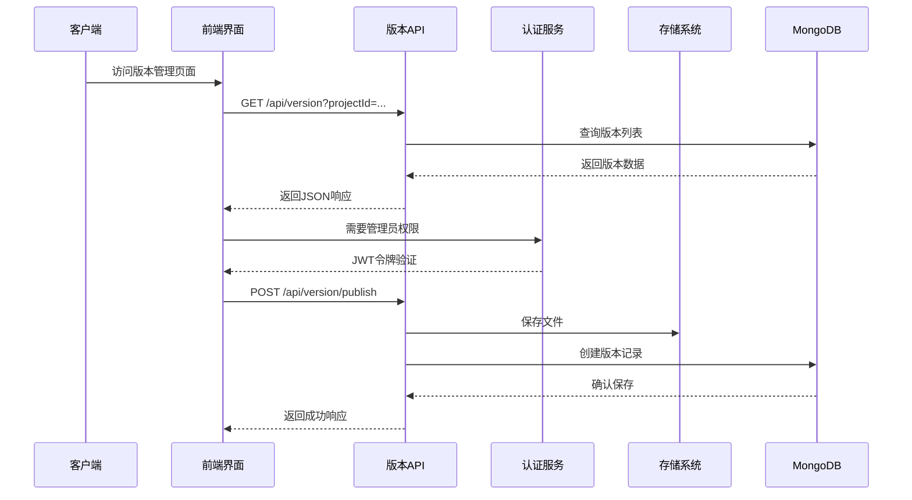
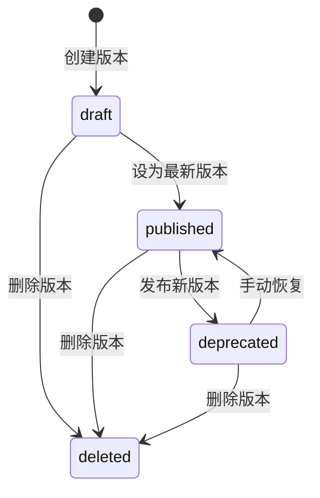
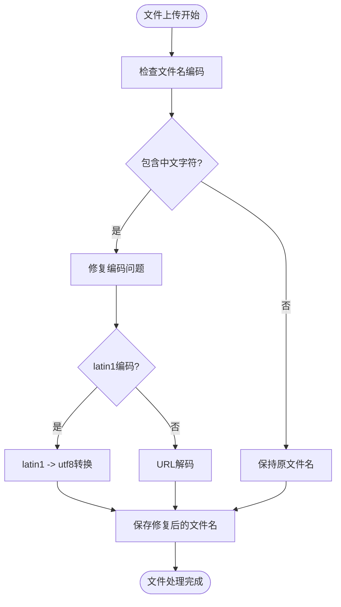
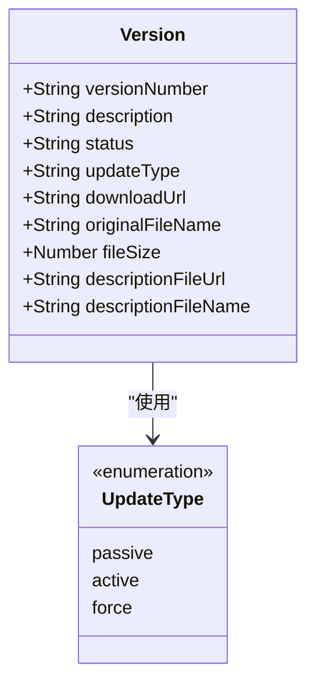
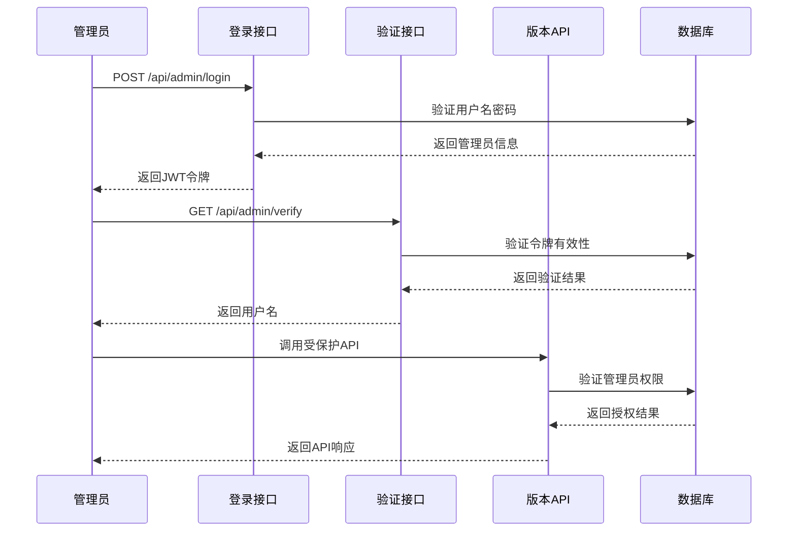
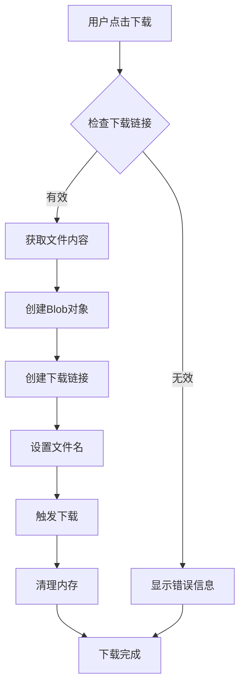
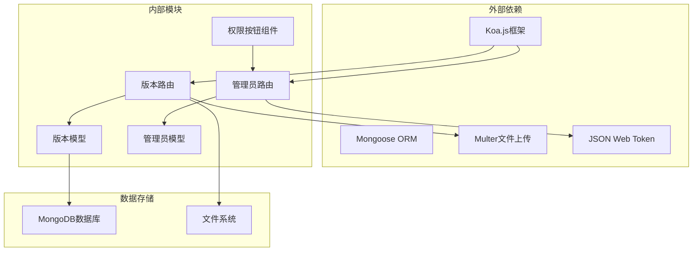

# 版本管理API

<cite>
**本文档引用的文件**
- [server/routes/version.js](file://server/routes/version.js)
- [server/models/Version.js](file://server/models/Version.js)
- [client/src/pages/VersionPage.jsx](file://client/src/pages/VersionPage.jsx)
- [server/routes/admin.js](file://server/routes/admin.js)
- [server/models/Admin.js](file://server/models/Admin.js)
- [server/uploads/latest.yml](file://server/uploads/latest.yml)
- [latest-example.yml](file://latest-example.yml)
- [fix-chinese-filename.md](file://fix-chinese-filename.md)
- [test-file-name.md](file://test-file-name.md)
- [update-type-feature.md](file://update-type-feature.md)
- [client/src/components/AuthButton.jsx](file://client/src/components/AuthButton.jsx)
- [db/woax.versions.json](file://db/woax.versions.json)
- [README.md](file://README.md)
- [api-usage-latest-version.md](file://api-usage-latest-version.md)
</cite>

## 目录
1. [简介](#简介)
2. [项目结构](#项目结构)
3. [核心组件](#核心组件)
4. [架构概览](#架构概览)
5. [详细组件分析](#详细组件分析)
6. [依赖关系分析](#依赖关系分析)
7. [性能考虑](#性能考虑)
8. [故障排除指南](#故障排除指南)
9. [结论](#结论)
10. [附录](#附录)

## 简介

WoaX版本管理API是一个基于React前端、Node.js+Koa后端和MongoDB数据库的全栈应用程序的核心组件。该系统提供了完整的版本信息管理功能，包括版本发布、状态控制、文件上传、历史查询和回滚等功能。系统支持管理员权限验证、文件名编码修复、更新方式控制和自动更新机制。

**更新** 新增最新版本API端点、增强版本模型支持更新类型字段、改进文件上传功能支持多文件上传、添加中文文件名编码修复机制

## 项目结构

版本管理模块采用前后端分离的架构设计，主要由以下组件构成：



**图表来源**
- [server/routes/version.js](file://server/routes/version.js#L1-L432)
- [server/models/Version.js](file://server/models/Version.js#L1-L62)
- [client/src/pages/VersionPage.jsx](file://client/src/pages/VersionPage.jsx#L1-L890)

**章节来源**
- [README.md](file://README.md#L1-L44)

## 核心组件

### 版本管理核心功能

版本管理API提供了以下核心功能：

1. **版本信息管理** - 支持版本号、描述、状态、更新方式等信息的管理
2. **文件上传处理** - 支持安装包文件和描述文件的上传
3. **发布状态控制** - 支持草稿、已发布、已弃用三种状态
4. **版本历史查询** - 提供分页查询和最新版本获取功能
5. **回滚功能** - 支持将指定版本设为最新版本
6. **安全验证** - 基于JWT的管理员权限验证
7. **最新版本查询** - 新增公开的最新版本查询接口

### 数据模型设计

版本数据模型包含以下关键字段：

| 字段名 | 类型 | 必填 | 描述 | 默认值 |
|--------|------|------|------|--------|
| versionNumber | String | 是 | 版本号 | - |
| description | String | 否 | 版本描述 | 空字符串 |
| projectId | ObjectId | 是 | 项目ID | - |
| status | Enum | 否 | 发布状态 | draft |
| updateType | Enum | 否 | 更新方式 | passive |
| downloadUrl | String | 否 | 下载链接 | - |
| originalFileName | String | 否 | 原始文件名 | - |
| fileExt | String | 否 | 文件扩展名 | - |
| fileSize | Number | 否 | 文件大小 | - |
| descriptionFileUrl | String | 否 | 描述文件URL | - |
| descriptionFileName | String | 否 | 描述文件名 | - |

**更新** 新增 `updateType` 字段支持三种更新方式：强制更新(force)、主动提醒(active)、被动提醒(passive)

**章节来源**
- [server/models/Version.js](file://server/models/Version.js#L3-L60)
- [db/woax.versions.json](file://db/woax.versions.json#L1-L52)

## 架构概览

版本管理系统的整体架构采用RESTful API设计，结合前端React组件和后端Koa.js框架：



**图表来源**
- [server/routes/version.js](file://server/routes/version.js#L83-L118)
- [server/routes/admin.js](file://server/routes/admin.js#L100-L125)

## 详细组件分析

### 版本发布接口

版本发布接口支持管理员权限验证和多文件上传功能：

#### 接口定义

| 属性 | 值 |
|------|-----|
| 方法 | POST |
| 路径 | `/api/version/publish` |
| 权限 | 需要管理员JWT令牌 |
| 内容类型 | multipart/form-data |

#### 请求参数

| 参数名 | 类型 | 必填 | 描述 |
|--------|------|------|------|
| versionNumber | String | 是 | 版本号 |
| description | String | 是 | 版本描述 |
| projectId | String | 是 | 项目ID |
| publishedBy | String | 否 | 发布者，默认"Admin" |
| originalFileName | String | 否 | 原始文件名 |
| updateType | String | 否 | 更新方式，默认"passive" |
| enableRename | Boolean | 否 | 是否启用重命名，默认false |
| file | File | 是 | 安装包文件 |
| descriptionFile | File | 否 | 描述文件(.yml) |

#### 响应格式

```json
{
  "success": true,
  "message": "版本发布成功",
  "data": {
    "versionNumber": "1.2.0",
    "description": "版本描述",
    "status": "draft",
    "downloadUrl": "http://localhost:3001/uploads/file-1746994622959-253399478.zip",
    "originalFileName": "app-setup.exe",
    "fileSize": 194621,
    "updateType": "passive"
  }
}
```

**更新** 支持多文件上传，包括安装包文件和描述文件，新增 `updateType` 参数

**章节来源**
- [server/routes/version.js](file://server/routes/version.js#L147-L256)

### 版本状态管理

#### 状态枚举

系统支持三种版本状态：

| 状态值 | 描述 | 用途 |
|--------|------|------|
| draft | 草稿 | 未发布的版本，仅管理员可见 |
| published | 已发布 | 当前生效的版本，对所有用户开放 |
| deprecated | 已弃用 | 已被新版本替代的旧版本 |

#### 状态转换流程



**图表来源**
- [server/models/Version.js](file://server/models/Version.js#L22-L26)

### 文件上传处理

#### 文件类型限制

系统支持以下文件类型的上传：

| 文件类型 | 支持的扩展名 | 描述 |
|----------|-------------|------|
| 安装包文件 | .exe, .msi, .dmg, .AppImage, .zip, .rar | 应用程序安装包 |
| 描述文件 | .yml, .yaml | 版本描述文件，用于自动更新检查 |

#### 文件大小限制

- 单个文件最大大小：无硬性限制（受服务器配置影响）
- 建议：安装包文件建议不超过500MB

#### 文件名处理机制

系统实现了完整的中文文件名编码修复机制：



**更新** 新增多文件上传支持，包括安装包文件和描述文件，增强文件名编码修复机制

**图表来源**
- [server/routes/version.js](file://server/routes/version.js#L11-L36)
- [client/src/pages/VersionPage.jsx](file://client/src/pages/VersionPage.jsx#L319-L349)

**章节来源**
- [server/routes/version.js](file://server/routes/version.js#L39-L74)
- [fix-chinese-filename.md](file://fix-chinese-filename.md#L1-L126)

### 版本查询接口

#### 版本列表查询

| 属性 | 值 |
|------|-----|
| 方法 | GET |
| 路径 | `/api/version` |
| 权限 | 无需认证 |
| 查询参数 | page, pageSize, projectId |

#### 最新版本查询

**新增** 最新版本查询接口，无需管理员权限即可访问：

| 属性 | 值 |
|------|-----|
| 方法 | GET |
| 路径 | `/api/version/latest/:projectId` |
| 权限 | 无需认证 |
| 参数 | projectId (路径参数) |

#### 响应示例

```json
{
  "success": true,
  "data": [
    {
      "versionNumber": "1.2.5",
      "description": "版本描述",
      "status": "published",
      "originalFileName": "app-setup.exe",
      "fileSize": 194621,
      "timestamp": "2025-05-11T20:17:31.782Z"
    }
  ],
  "total": 2,
  "page": 1,
  "pageSize": 10
}
```

**更新** 新增 `/api/version/latest/:projectId` 接口，专门用于获取最新版本信息

**章节来源**
- [server/routes/version.js](file://server/routes/version.js#L83-L118)
- [server/routes/version.js](file://server/routes/version.js#L299-L339)
- [api-usage-latest-version.md](file://api-usage-latest-version.md#L1-L227)

### 更新方式控制

#### 更新类型定义

系统支持三种更新方式：

| 更新类型 | 描述 | 用户体验 |
|----------|------|----------|
| passive | 被动提醒 | 静默显示更新信息，用户可选择更新 |
| active | 主动提醒 | 弹窗提醒用户有新版本可用 |
| force | 强制更新 | 必须更新才能继续使用应用 |

#### 更新方式配置



**更新** 新增 `updateType` 字段，支持三种更新方式的配置和管理

**图表来源**
- [server/models/Version.js](file://server/models/Version.js#L46-L51)

**章节来源**
- [update-type-feature.md](file://update-type-feature.md#L1-L277)

### 安全验证机制

#### 管理员权限验证

系统采用JWT令牌进行管理员权限验证：



**图表来源**
- [server/routes/admin.js](file://server/routes/admin.js#L27-L98)
- [server/routes/version.js](file://server/routes/version.js#L147-L178)

#### 权限控制实现

- 所有写操作（发布、更新、删除）都需要管理员权限
- 读操作（查询、下载）无需认证
- JWT令牌有效期为24小时
- 默认管理员账号：用户名 `admin`，密码 `admin123`

**章节来源**
- [server/routes/admin.js](file://server/routes/admin.js#L100-L125)
- [server/models/Admin.js](file://server/models/Admin.js#L16-L30)

### 文件下载功能

#### 下载流程



**图表来源**
- [client/src/pages/VersionPage.jsx](file://client/src/pages/VersionPage.jsx#L352-L404)

#### 文件名处理

系统实现了多层文件名修复机制：

1. **数据库存储**：保存原始文件名
2. **前端显示**：修复编码问题后显示
3. **下载处理**：使用修复后的文件名进行下载

**更新** 增强文件名编码修复机制，支持更复杂的编码问题处理

**章节来源**
- [client/src/pages/VersionPage.jsx](file://client/src/pages/VersionPage.jsx#L352-L404)
- [fix-chinese-filename.md](file://fix-chinese-filename.md#L85-L87)

## 依赖关系分析

版本管理模块的依赖关系如下：



**图表来源**
- [server/routes/version.js](file://server/routes/version.js#L1-L8)
- [server/models/Version.js](file://server/models/Version.js#L1)
- [client/src/components/AuthButton.jsx](file://client/src/components/AuthButton.jsx#L1-L43)

**章节来源**
- [server/routes/version.js](file://server/routes/version.js#L1-L8)
- [server/models/Version.js](file://server/models/Version.js#L1)

## 性能考虑

### 文件上传性能

1. **并发处理**：系统支持多文件同时上传
2. **内存管理**：使用流式处理避免大文件内存溢出
3. **缓存策略**：下载链接采用HTTP缓存机制

### 数据查询优化

1. **索引设计**：在projectId和status字段上建立索引
2. **分页查询**：默认每页10条记录，支持自定义分页大小
3. **排序优化**：按时间戳降序排列，提高最新版本查询效率

### 安全性能

1. **令牌过期**：JWT令牌24小时有效期，定期刷新
2. **权限验证**：每次请求都进行权限验证
3. **文件扫描**：上传文件进行基本的格式验证

## 故障排除指南

### 常见问题及解决方案

#### 文件名乱码问题

**问题描述**：中文文件名在上传后出现乱码显示

**解决方案**：
1. 确保前后端都实现了文件名编码修复
2. 检查浏览器对中文文件名的支持
3. 验证服务器文件系统对UTF-8编码的支持

**更新** 增强文件名编码修复机制，支持多种编码问题的自动检测和修复

**章节来源**
- [fix-chinese-filename.md](file://fix-chinese-filename.md#L1-L126)

#### 权限验证失败

**问题描述**：管理员操作返回401未授权错误

**解决方案**：
1. 检查JWT令牌是否正确传递
2. 验证令牌是否在有效期内
3. 确认管理员账户是否存在且状态正常

**章节来源**
- [server/routes/admin.js](file://server/routes/admin.js#L100-L125)

#### 文件上传失败

**问题描述**：文件上传过程中断或失败

**解决方案**：
1. 检查服务器磁盘空间
2. 验证文件类型是否在允许范围内
3. 确认网络连接稳定
4. 检查服务器防火墙设置

### 错误响应格式

所有API接口都遵循统一的错误响应格式：

```json
{
  "success": false,
  "message": "错误描述",
  "error": "错误详情"
}
```

**章节来源**
- [server/routes/version.js](file://server/routes/version.js#L110-L117)

## 结论

WoaX版本管理API提供了一个完整、安全、易用的版本管理解决方案。系统具有以下特点：

1. **功能完整**：涵盖版本管理的所有核心功能
2. **安全可靠**：基于JWT的管理员权限验证
3. **用户体验良好**：支持中文文件名处理和友好的界面设计
4. **扩展性强**：模块化设计便于功能扩展
5. **性能优化**：合理的数据结构和查询优化
6. **国际化支持**：完善的中文文件名编码修复机制
7. **灵活的更新策略**：支持多种更新方式满足不同场景需求

**更新** 新增最新版本查询接口、增强版本模型支持更新类型字段、改进文件上传功能支持多文件上传、添加中文文件名编码修复机制

该系统适用于需要版本管理功能的应用场景，特别是需要管理员权限控制和自动更新机制的软件发布平台。

## 附录

### API使用示例

#### 发布新版本（含描述文件）

```javascript
const formData = new FormData();
formData.append('versionNumber', '1.2.0');
formData.append('description', '重要安全更新');
formData.append('updateType', 'force');
formData.append('file', installPackageFile);
formData.append('descriptionFile', descriptionYmlFile);
formData.append('projectId', projectId);

const response = await axios.post('/api/version/publish', formData, {
  headers: {
    'Content-Type': 'multipart/form-data'
  }
});
```

#### 获取最新版本

```javascript
const response = await axios.get('/api/version/latest/:projectId');
const latestVersion = response.data.data;
```

#### 更新版本状态

```javascript
const updateData = {
  status: 'published',
  updateType: 'active'
};

const response = await axios.put(`/api/version/${versionId}`, updateData);
```

**更新** 新增最新版本查询接口使用示例

### 版本兼容性说明

系统设计时充分考虑了向后兼容性：

1. **默认值处理**：新字段提供合理默认值
2. **数据迁移**：现有版本数据自动适配新字段
3. **API演进**：新增功能不影响现有接口使用
4. **配置兼容**：支持通过环境变量调整行为

### 最佳实践建议

1. **文件命名规范**：建议使用语义化的版本号命名
2. **描述文件格式**：严格按照YAML格式编写描述文件
3. **权限管理**：定期检查管理员账户安全
4. **监控告警**：建立API调用和文件上传的监控机制
5. **备份策略**：定期备份数据库和上传文件
6. **更新策略**：根据版本重要性选择合适的更新方式
7. **文件名编码**：确保文件名正确编码避免乱码问题