# 认证API

<cite>
**本文引用的文件**
- [server/routes/admin.js](file://server/routes/admin.js)
- [server/models/Admin.js](file://server/models/Admin.js)
- [server/app.js](file://server/app.js)
- [server/db.js](file://server/db.js)
- [server/.env](file://server/.env)
- [client/src/context/AuthContext.jsx](file://client/src/context/AuthContext.jsx)
- [client/src/components/AuthButton.jsx](file://client/src/components/AuthButton.jsx)
- [db/woax.admins.json](file://db/woax.admins.json)
</cite>

## 目录
1. [简介](#简介)
2. [项目结构](#项目结构)
3. [核心组件](#核心组件)
4. [架构总览](#架构总览)
5. [详细组件分析](#详细组件分析)
6. [依赖关系分析](#依赖关系分析)
7. [性能考量](#性能考量)
8. [故障排查指南](#故障排查指南)
9. [结论](#结论)
10. [附录](#附录)

## 简介
本文件为认证系统的完整API文档，覆盖管理员登录与令牌验证接口、JWT认证机制、认证中间件的使用方式与权限控制逻辑，并提供请求与响应示例、常见错误码说明以及默认管理员账号的创建机制与安全建议。系统采用Koa+MongoDB+JWT实现，前端通过React+Ant Design进行交互。

## 项目结构
后端采用模块化路由组织，认证相关逻辑集中在管理员路由模块；模型层负责用户凭据的加盐哈希存储；应用入口负责路由注册与中间件装配；前端通过上下文与组件封装认证流程。

图表来源
- [server/app.js](file://server/app.js#L1-L61)
- [server/routes/admin.js](file://server/routes/admin.js#L1-L128)
- [server/models/Admin.js](file://server/models/Admin.js#L1-L32)
- [server/db.js](file://server/db.js#L1-L45)
- [server/.env](file://server/.env#L1-L9)
- [client/src/context/AuthContext.jsx](file://client/src/context/AuthContext.jsx#L1-L155)
- [client/src/components/AuthButton.jsx](file://client/src/components/AuthButton.jsx#L1-L43)

章节来源
- [server/app.js](file://server/app.js#L1-L61)
- [server/routes/admin.js](file://server/routes/admin.js#L1-L128)
- [server/models/Admin.js](file://server/models/Admin.js#L1-L32)
- [server/db.js](file://server/db.js#L1-L45)
- [server/.env](file://server/.env#L1-L9)
- [client/src/context/AuthContext.jsx](file://client/src/context/AuthContext.jsx#L1-L155)
- [client/src/components/AuthButton.jsx](file://client/src/components/AuthButton.jsx#L1-L43)

## 核心组件
- 管理员登录接口：POST /api/admin/login
- 令牌验证接口：GET /api/admin/verify
- 认证中间件：verifyAdmin（用于保护受控路由）
- 管理员模型：密码加盐哈希存储与校验
- 前端认证上下文：登录、令牌验证、登出与UI交互

章节来源
- [server/routes/admin.js](file://server/routes/admin.js#L26-L98)
- [server/models/Admin.js](file://server/models/Admin.js#L16-L30)
- [client/src/context/AuthContext.jsx](file://client/src/context/AuthContext.jsx#L24-L92)

## 架构总览
认证流程从客户端发起登录请求开始，后端验证凭据并签发JWT；后续请求携带Authorization头访问受保护资源，中间件解析并验证令牌，成功后将管理员对象注入ctx.state以供后续处理。

```mermaid
sequenceDiagram
participant C as "客户端"
participant A as "管理员路由<br/>/api/admin"
participant M as "管理员模型"
participant J as "JWT签名/验证"
participant D as "MongoDB"
C->>A : "POST /api/admin/login"
A->>D : "查询管理员"
D-->>A : "返回管理员记录"
A->>M : "校验密码"
M-->>A : "校验结果"
A->>J : "签发JWT(含过期时间)"
J-->>A : "返回token"
A-->>C : "登录成功响应"
C->>A : "GET /api/admin/verify"
A->>J : "验证JWT"
J-->>A : "解码结果"
A->>D : "根据ID查询管理员"
D-->>A : "返回管理员"
A-->>C : "验证成功响应"
```

图表来源
- [server/routes/admin.js](file://server/routes/admin.js#L26-L98)
- [server/models/Admin.js](file://server/models/Admin.js#L16-L30)

## 详细组件分析

### 管理员登录接口 /api/admin/login
- 方法与路径
  - POST /api/admin/login
- 请求体参数
  - username: 字符串，必填
  - password: 字符串，必填
- 成功响应
  - 结构：success=true，data.token（字符串），data.username（字符串）
  - 说明：登录成功后更新最后登录时间，并签发有效期为24小时的JWT
- 错误响应
  - 401 用户名或密码错误
  - 500 服务器内部错误
- 安全要点
  - 密码采用加盐PBKDF2哈希存储，不存储明文
  - 登录成功后更新lastLogin字段
- 使用示例
  - 请求示例：POST /api/admin/login，Body: { "username": "...", "password": "..." }
  - 成功响应示例：{ "success": true, "data": { "token": "...", "username": "admin" } }
  - 失败响应示例：{ "success": false, "message": "用户名或密码错误" }

章节来源
- [server/routes/admin.js](file://server/routes/admin.js#L26-L67)
- [server/models/Admin.js](file://server/models/Admin.js#L16-L30)

### 令牌验证接口 /api/admin/verify
- 方法与路径
  - GET /api/admin/verify
- 请求头
  - Authorization: Bearer {token}
- 成功响应
  - 结构：success=true，data.username（字符串）
- 错误响应
  - 401 未提供令牌 或 无效的令牌
- 使用示例
  - 请求示例：GET /api/admin/verify，Header: Authorization: Bearer {token}
  - 成功响应示例：{ "success": true, "data": { "username": "admin" } }
  - 失败响应示例：{ "success": false, "message": "无效的令牌" }

章节来源
- [server/routes/admin.js](file://server/routes/admin.js#L69-L98)

### JWT认证机制
- 令牌生成
  - 使用对称密钥（JWT_SECRET）签发，载荷包含管理员ID与用户名，有效期24小时
- 令牌验证
  - 解析并验证签名，确认管理员仍存在于数据库
- 过期处理
  - 24小时后令牌失效，需重新登录获取新令牌
- 安全考虑
  - 建议在生产环境设置强密钥并启用HTTPS传输
  - 前端应妥善存储令牌，避免泄露

章节来源
- [server/routes/admin.js](file://server/routes/admin.js#L6-L6)
- [server/routes/admin.js](file://server/routes/admin.js#L48-L53)
- [server/routes/admin.js](file://server/routes/admin.js#L79-L79)
- [server/.env](file://server/.env#L1-L9)

### 认证中间件 verifyAdmin 的使用与权限控制
- 功能
  - 从Authorization头提取Bearer令牌，验证其有效性并查询管理员
  - 将管理员对象注入ctx.state.admin，继续执行后续处理
- 使用方式
  - 在需要管理员权限的路由前挂载该中间件
  - 示例：router.use('/api/protected', verifyAdmin, handler)
- 权限控制逻辑
  - 无令牌或令牌无效：返回401
  - 令牌有效但管理员不存在：返回401
  - 令牌有效且管理员存在：放行并可读取ctx.state.admin

章节来源
- [server/routes/admin.js](file://server/routes/admin.js#L100-L125)

### 默认管理员账号创建机制
- 触发时机
  - 应用启动时自动尝试创建默认管理员（用户名为admin）
- 创建条件
  - 若数据库中不存在同名管理员，则创建并设置默认密码
- 存储结构
  - 字段：username、salt、passwordHash、createdAt、lastLogin
- 安全建议
  - 首次部署后立即修改默认管理员密码
  - 在生产环境禁止使用默认密码

章节来源
- [server/routes/admin.js](file://server/routes/admin.js#L8-L24)
- [db/woax.admins.json](file://db/woax.admins.json#L1-L15)

### 前端集成与使用
- 认证上下文
  - 自动检查本地存储中的令牌并调用验证接口
  - 登录成功后保存令牌，更新认证状态
  - 验证失败或过期时清理本地令牌并重置状态
- 权限按钮组件
  - 未登录时显示锁定图标并禁用点击，引导打开登录弹窗
  - 已登录时正常渲染按钮并触发onClick回调

章节来源
- [client/src/context/AuthContext.jsx](file://client/src/context/AuthContext.jsx#L16-L48)
- [client/src/context/AuthContext.jsx](file://client/src/context/AuthContext.jsx#L61-L92)
- [client/src/components/AuthButton.jsx](file://client/src/components/AuthButton.jsx#L12-L27)

## 依赖关系分析
- 模块耦合
  - 路由依赖模型进行用户凭据校验
  - 路由依赖JWT进行令牌签发与验证
  - 应用入口统一注册路由并装配中间件
- 外部依赖
  - MongoDB：持久化管理员凭据
  - dotenv：加载环境变量（如JWT_SECRET）
- 可能的循环依赖
  - 当前结构清晰，无明显循环依赖风险

图表来源
- [server/routes/admin.js](file://server/routes/admin.js#L1-L128)
- [server/models/Admin.js](file://server/models/Admin.js#L1-L32)
- [server/app.js](file://server/app.js#L1-L61)
- [server/db.js](file://server/db.js#L1-L45)
- [server/.env](file://server/.env#L1-L9)

章节来源
- [server/routes/admin.js](file://server/routes/admin.js#L1-L128)
- [server/models/Admin.js](file://server/models/Admin.js#L1-L32)
- [server/app.js](file://server/app.js#L1-L61)
- [server/db.js](file://server/db.js#L1-L45)
- [server/.env](file://server/.env#L1-L9)

## 性能考量
- JWT验证成本低，适合高并发场景
- 建议在生产环境启用HTTPS，避免令牌在传输中被截获
- 对于频繁访问的受保护接口，可结合缓存策略减少数据库查询次数（当前实现每次验证均查询管理员）

## 故障排查指南
- 常见错误码
  - 401 未提供令牌 / 无效的令牌 / 用户名或密码错误
  - 500 服务器内部错误
- 排查步骤
  - 确认Authorization头格式为Bearer {token}
  - 检查JWT_SECRET是否正确配置
  - 确认数据库连接正常且管理员记录存在
  - 查看服务端日志定位异常
- 前端问题
  - 令牌过期或无效时，前端会自动清理本地存储并重置认证状态
  - 登录失败时检查表单校验与网络请求状态

章节来源
- [server/routes/admin.js](file://server/routes/admin.js#L32-L41)
- [server/routes/admin.js](file://server/routes/admin.js#L72-L77)
- [server/routes/admin.js](file://server/routes/admin.js#L94-L97)
- [client/src/context/AuthContext.jsx](file://client/src/context/AuthContext.jsx#L42-L47)

## 结论
本认证系统基于JWT实现了轻量级的管理员身份验证与授权控制，具备良好的扩展性与安全性基础。建议在生产环境中强化密钥管理、启用HTTPS、定期轮换令牌并完善审计日志。

## 附录

### API定义与示例

- 管理员登录
  - 请求
    - 方法：POST
    - 路径：/api/admin/login
    - 头部：Content-Type: application/json
    - Body：{ "username": "...", "password": "..." }
  - 响应
    - 成功：{ "success": true, "data": { "token": "...", "username": "admin" } }
    - 失败：{ "success": false, "message": "用户名或密码错误" }
- 令牌验证
  - 请求
    - 方法：GET
    - 路径：/api/admin/verify
    - 头部：Authorization: Bearer {token}
  - 响应
    - 成功：{ "success": true, "data": { "username": "admin" } }
    - 失败：{ "success": false, "message": "无效的令牌" }

章节来源
- [server/routes/admin.js](file://server/routes/admin.js#L26-L98)

### 数据模型（管理员）
- 字段
  - username: 字符串，唯一，必填
  - passwordHash: 字符串，必填
  - salt: 字符串，必填
  - email: 字符串（可选）
  - createdAt: 时间戳（可选）
  - lastLogin: 时间戳（可选）
- 加密与校验
  - setPassword：生成随机salt并计算PBKDF2哈希
  - validatePassword：使用相同salt计算哈希并比对

章节来源
- [server/models/Admin.js](file://server/models/Admin.js#L4-L14)
- [server/models/Admin.js](file://server/models/Admin.js#L16-L30)
- [db/woax.admins.json](file://db/woax.admins.json#L1-L15)