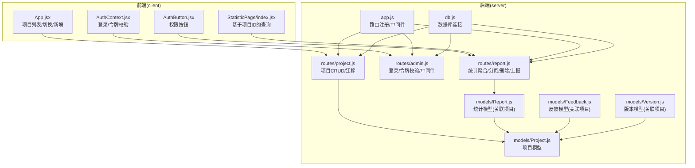
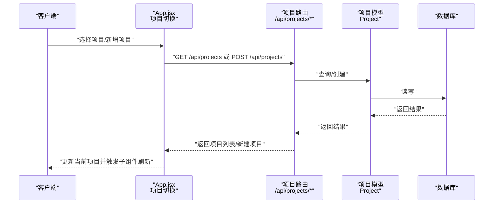
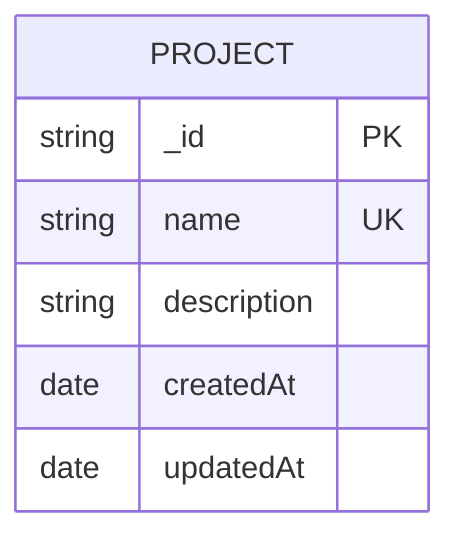
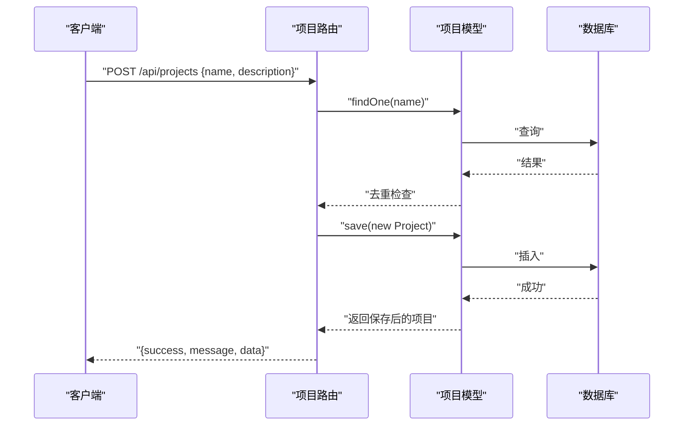
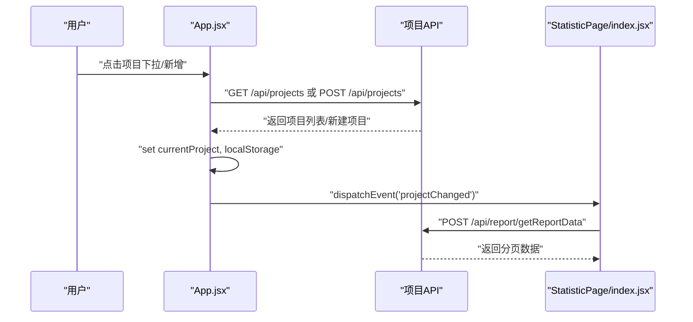
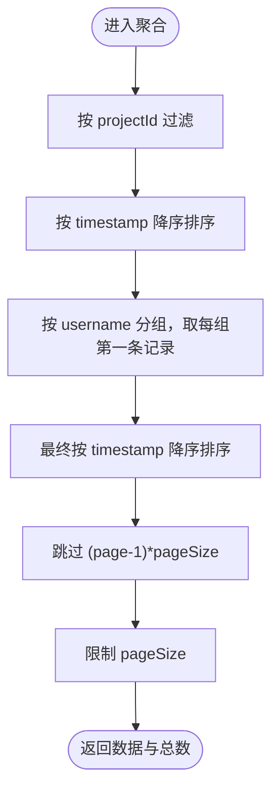
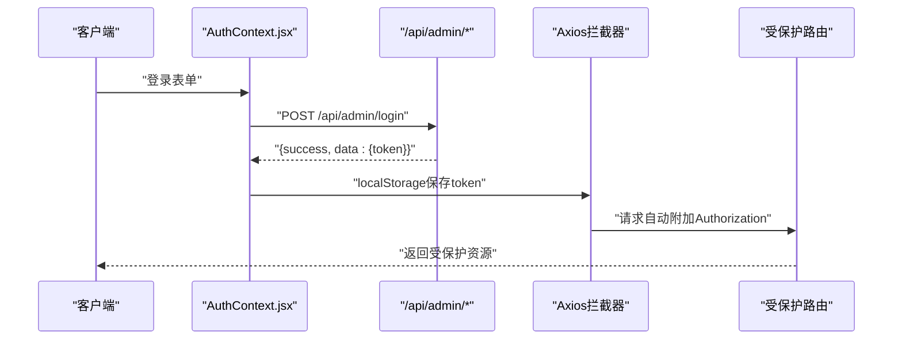
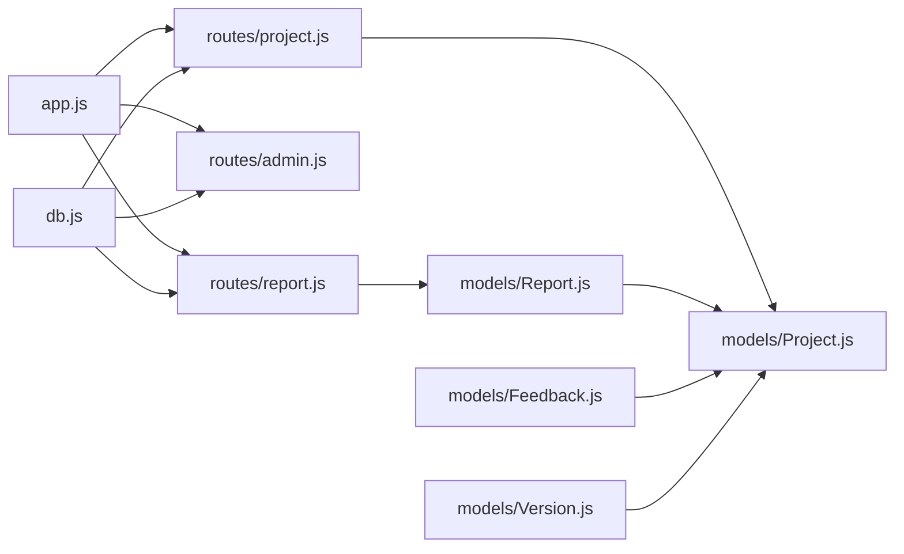

# 项目管理API

<cite>
**本文引用的文件**
- [server/app.js](file://server/app.js)
- [server/db.js](file://server/db.js)
- [server/routes/project.js](file://server/routes/project.js)
- [server/models/Project.js](file://server/models/Project.js)
- [server/models/Report.js](file://server/models/Report.js)
- [server/models/Feedback.js](file://server/models/Feedback.js)
- [server/models/Version.js](file://server/models/Version.js)
- [server/routes/admin.js](file://server/routes/admin.js)
- [server/routes/report.js](file://server/routes/report.js)
- [client/src/App.jsx](file://client/src/App.jsx)
- [client/src/context/AuthContext.jsx](file://client/src/context/AuthContext.jsx)
- [client/src/components/AuthButton.jsx](file://client/src/components/AuthButton.jsx)
- [client/src/pages/StatisticPage/index.jsx](file://client/src/pages/StatisticPage/index.jsx)
- [db/woax.projects.json](file://db/woax.projects.json)
</cite>

## 目录
1. [简介](#简介)
2. [项目结构](#项目结构)
3. [核心组件](#核心组件)
4. [架构总览](#架构总览)
5. [详细组件分析](#详细组件分析)
6. [依赖关系分析](#依赖关系分析)
7. [性能考虑](#性能考虑)
8. [故障排查指南](#故障排查指南)
9. [结论](#结论)
10. [附录](#附录)

## 简介
本文件为“项目管理模块”的完整API文档，覆盖项目CRUD操作、项目切换机制、分页与过滤、权限控制与数据安全、错误处理与最佳实践。项目采用React前端 + Koa后端 + MongoDB数据库架构，通过统一的REST风格接口提供项目管理能力，并在前端实现项目切换与权限控制。

## 项目结构
后端通过Koa路由注册统一前缀，项目管理API位于 /api/projects 下；前端通过Axios拦截器自动附加管理员JWT令牌，实现权限控制与项目切换。

**图示来源**
- [server/app.js](file://server/app.js#L47-L55)
- [server/routes/project.js](file://server/routes/project.js#L1-L226)
- [server/routes/admin.js](file://server/routes/admin.js#L1-L128)
- [server/routes/report.js](file://server/routes/report.js#L1-L271)
- [server/models/Project.js](file://server/models/Project.js#L1-L21)
- [server/models/Report.js](file://server/models/Report.js#L1-L22)
- [server/models/Feedback.js](file://server/models/Feedback.js#L1-L52)
- [server/models/Version.js](file://server/models/Version.js#L1-L62)
- [client/src/App.jsx](file://client/src/App.jsx#L77-L118)
- [client/src/context/AuthContext.jsx](file://client/src/context/AuthContext.jsx#L24-L48)

**章节来源**
- [server/app.js](file://server/app.js#L1-L61)
- [client/src/App.jsx](file://client/src/App.jsx#L77-L118)

## 核心组件
- 项目路由：提供项目列表、详情、创建、更新、删除、数据迁移等接口。
- 项目模型：定义项目字段、类型与约束。
- 统计/反馈/版本模型：均通过projectId关联到项目，确保数据隔离。
- 权限中间件：基于JWT的管理员认证与授权。
- 前端项目切换：本地持久化当前项目，事件驱动刷新子组件数据。

**章节来源**
- [server/routes/project.js](file://server/routes/project.js#L9-L226)
- [server/models/Project.js](file://server/models/Project.js#L3-L19)
- [server/models/Report.js](file://server/models/Report.js#L11-L15)
- [server/models/Feedback.js](file://server/models/Feedback.js#L42-L46)
- [server/models/Version.js](file://server/models/Version.js#L13-L17)
- [server/routes/admin.js](file://server/routes/admin.js#L100-L125)
- [client/src/App.jsx](file://client/src/App.jsx#L120-L126)

## 架构总览
项目管理API遵循REST规范，统一前缀 /api/projects。前端通过Axios拦截器自动携带Authorization头，后端通过中间件校验管理员令牌。项目数据以projectId为纽带贯穿统计、反馈、版本模块，确保多模块数据隔离与一致性。

**图示来源**
- [client/src/App.jsx](file://client/src/App.jsx#L82-L118)
- [server/routes/project.js](file://server/routes/project.js#L10-L92)
- [server/models/Project.js](file://server/models/Project.js#L1-L21)

## 详细组件分析

### 项目数据模型
项目模型包含名称、描述、创建/更新时间戳。名称唯一且必填，描述可空。

**图示来源**
- [server/models/Project.js](file://server/models/Project.js#L3-L19)

**章节来源**
- [server/models/Project.js](file://server/models/Project.js#L3-L19)
- [db/woax.projects.json](file://db/woax.projects.json#L1-L28)

### 项目CRUD接口

- 获取项目列表
  - 方法与路径：GET /api/projects
  - 请求参数：无
  - 响应结构：success(bool)、data(array of Project)
  - 排序：按createdAt倒序
  - 错误：500时返回success=false及message/error

- 获取单个项目详情
  - 方法与路径：GET /api/projects/:id
  - 路径参数：id(ObjectId)
  - 响应：success(bool)、data(Project)
  - 未找到：404，success=false，message

- 创建项目
  - 方法与路径：POST /api/projects
  - 请求体：name(string, 必填, 去空白)、description(string, 可空)
  - 业务规则：名称唯一；重复名称返回400
  - 成功：201，返回success、message、data(Project)
  - 失败：400/500，返回success=false、message/error

- 更新项目
  - 方法与路径：PUT /api/projects/:id
  - 请求体：name(可选)、description(可选)
  - 业务规则：若更新name需保证唯一性；仅对传入字段更新
  - 成功：返回success、message、data(Project)
  - 未找到：404；冲突：400；异常：500

- 删除项目
  - 方法与路径：DELETE /api/projects/:id
  - 业务规则：系统至少保留一个项目；否则返回400
  - 成功：返回success、message
  - 未找到：404；异常：500

- 数据迁移至指定项目
  - 方法与路径：POST /api/projects/migrate/:projectId
  - 作用：将Report/Feedback/Version中未绑定projectId的数据迁移至目标项目
  - 成功：返回success、message
  - 未找到目标项目：404；异常：500

**图示来源**
- [server/routes/project.js](file://server/routes/project.js#L54-L92)
- [server/models/Project.js](file://server/models/Project.js#L3-L19)

**章节来源**
- [server/routes/project.js](file://server/routes/project.js#L9-L187)

### 项目切换机制与数据流转
- 前端初始化：首次加载获取项目列表，优先使用localStorage中的currentProjectId，否则取首个项目。
- 项目切换：调用handleProjectChange，设置当前项目并持久化；同时向window派发projectChanged事件，子组件监听并刷新数据。
- 新增项目：调用POST /api/projects创建后，追加到列表并切换到新项目。
- 默认项目：若无项目，自动创建默认项目。

**图示来源**
- [client/src/App.jsx](file://client/src/App.jsx#L82-L118)
- [client/src/App.jsx](file://client/src/App.jsx#L120-L126)
- [client/src/pages/StatisticPage/index.jsx](file://client/src/pages/StatisticPage/index.jsx#L34-L55)
- [client/src/pages/StatisticPage/index.jsx](file://client/src/pages/StatisticPage/index.jsx#L58-L85)

**章节来源**
- [client/src/App.jsx](file://client/src/App.jsx#L82-L118)
- [client/src/App.jsx](file://client/src/App.jsx#L120-L126)
- [client/src/pages/StatisticPage/index.jsx](file://client/src/pages/StatisticPage/index.jsx#L34-L55)

### 分页查询、排序与过滤
- 项目列表：默认按createdAt倒序。
- 统计聚合分页：POST /api/report/getReportData，按projectId过滤，先按用户名分组取每用户的最新记录，再按时间戳倒序，最后分页。
- 用户记录分页：GET /api/report/user/:username，按username与projectId过滤，按timestamp倒序，支持page/pageSize。
- 过滤字段：projectId为必填；用户名为空时按“未知用户”分组。

**图示来源**
- [server/routes/report.js](file://server/routes/report.js#L26-L51)
- [server/routes/report.js](file://server/routes/report.js#L53-L64)

**章节来源**
- [server/routes/report.js](file://server/routes/report.js#L8-L131)

### 权限控制与数据安全
- 管理员登录：POST /api/admin/login，成功返回token与用户名；失败返回401。
- 令牌校验：GET /api/admin/verify，校验通过返回用户名；失败返回401。
- 请求拦截：前端Axios在请求头自动附加Authorization: Bearer token。
- 删除与自主上报：受verifyAdmin中间件保护，仅管理员可操作。
- 数据隔离：Report/Feedback/Version均通过projectId关联Project，避免跨项目数据泄露。

**图示来源**
- [client/src/context/AuthContext.jsx](file://client/src/context/AuthContext.jsx#L62-L92)
- [server/routes/admin.js](file://server/routes/admin.js#L27-L67)
- [client/src/App.jsx](file://client/src/App.jsx#L18-L25)
- [server/routes/report.js](file://server/routes/report.js#L204-L205)

**章节来源**
- [server/routes/admin.js](file://server/routes/admin.js#L100-L125)
- [client/src/context/AuthContext.jsx](file://client/src/context/AuthContext.jsx#L24-L48)
- [client/src/App.jsx](file://client/src/App.jsx#L18-L25)
- [server/routes/report.js](file://server/routes/report.js#L204-L205)

### 错误处理与最佳实践
- 统一响应结构：success(bool)、message(string)、data(any)、error(string，可选)。
- 状态码策略：
  - 400：参数缺失/业务冲突（如项目名重复、系统至少保留一个项目）
  - 401：未提供/无效令牌
  - 404：资源不存在
  - 500：服务器内部错误
- 建议：
  - 前端对必填字段做校验并在调用API前提示
  - 对批量操作（迁移）做好回滚预案
  - 对高频查询使用缓存或索引优化（如按projectId查询）

**章节来源**
- [server/routes/project.js](file://server/routes/project.js#L58-L67)
- [server/routes/project.js](file://server/routes/project.js#L154-L163)
- [server/routes/report.js](file://server/routes/report.js#L13-L20)
- [server/routes/report.js](file://server/routes/report.js#L95-L102)

## 依赖关系分析

**图示来源**
- [server/app.js](file://server/app.js#L47-L55)
- [server/routes/project.js](file://server/routes/project.js#L1-L7)
- [server/routes/admin.js](file://server/routes/admin.js#L1-L6)
- [server/routes/report.js](file://server/routes/report.js#L1-L4)
- [server/models/Project.js](file://server/models/Project.js#L1-L21)
- [server/models/Report.js](file://server/models/Report.js#L1-L22)
- [server/models/Feedback.js](file://server/models/Feedback.js#L1-L52)
- [server/models/Version.js](file://server/models/Version.js#L1-L62)
- [server/db.js](file://server/db.js#L9-L24)

**章节来源**
- [server/app.js](file://server/app.js#L47-L55)
- [server/db.js](file://server/db.js#L9-L24)

## 性能考虑
- 查询优化：为projectId建立索引，减少聚合与分页成本。
- 分页策略：合理设置pageSize上限，避免一次性返回过多数据。
- 缓存：对不频繁变动的项目列表进行短期缓存。
- 并发迁移：迁移操作使用Promise.all并发更新多个集合，注意事务与回滚策略。

## 故障排查指南
- 无法获取项目列表
  - 检查数据库连接是否成功
  - 确认路由前缀与路径一致
- 项目名重复
  - 确认name去空白后是否与现有项目冲突
- 删除失败
  - 确认是否为最后一个项目（系统至少保留一个）
- 401未授权
  - 检查本地token是否存在且未过期
  - 确认请求头Authorization是否正确附加
- 统计分页异常
  - 确认请求体/查询参数包含projectId
  - 检查聚合管道中分组与排序逻辑

**章节来源**
- [server/db.js](file://server/db.js#L9-L24)
- [server/routes/project.js](file://server/routes/project.js#L58-L67)
- [server/routes/project.js](file://server/routes/project.js#L154-L163)
- [client/src/context/AuthContext.jsx](file://client/src/context/AuthContext.jsx#L24-L48)
- [server/routes/report.js](file://server/routes/report.js#L13-L20)

## 结论
项目管理API提供了完整的CRUD能力与项目切换机制，配合JWT权限控制与数据模型关联，实现了清晰的数据隔离与良好的扩展性。建议在生产环境中进一步完善索引、缓存与事务处理，确保高并发场景下的稳定性与一致性。

## 附录

### API清单与示例路径
- 获取项目列表：GET /api/projects
  - 示例路径：[server/routes/project.js](file://server/routes/project.js#L10-L25)
- 获取项目详情：GET /api/projects/:id
  - 示例路径：[server/routes/project.js](file://server/routes/project.js#L28-L51)
- 创建项目：POST /api/projects
  - 示例路径：[server/routes/project.js](file://server/routes/project.js#L54-L92)
- 更新项目：PUT /api/projects/:id
  - 示例路径：[server/routes/project.js](file://server/routes/project.js#L95-L149)
- 删除项目：DELETE /api/projects/:id
  - 示例路径：[server/routes/project.js](file://server/routes/project.js#L152-L187)
- 数据迁移：POST /api/projects/migrate/:projectId
  - 示例路径：[server/routes/project.js](file://server/routes/project.js#L189-L224)

### 权限与认证
- 管理员登录：POST /api/admin/login
  - 示例路径：[server/routes/admin.js](file://server/routes/admin.js#L27-L67)
- 令牌校验：GET /api/admin/verify
  - 示例路径：[server/routes/admin.js](file://server/routes/admin.js#L69-L98)
- 请求拦截器：自动附加Authorization头
  - 示例路径：[client/src/App.jsx](file://client/src/App.jsx#L18-L25)

### 项目切换与前端交互
- 项目列表与切换：GET/POST /api/projects
  - 示例路径：[client/src/App.jsx](file://client/src/App.jsx#L82-L118)
- 子组件刷新：监听window.projectChanged事件
  - 示例路径：[client/src/pages/StatisticPage/index.jsx](file://client/src/pages/StatisticPage/index.jsx#L44-L55)