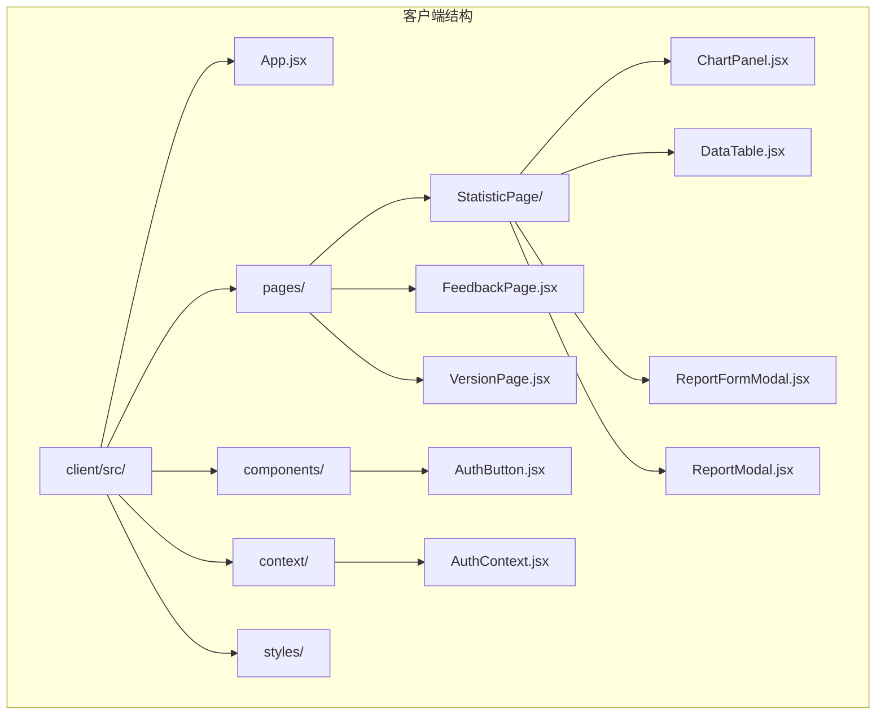
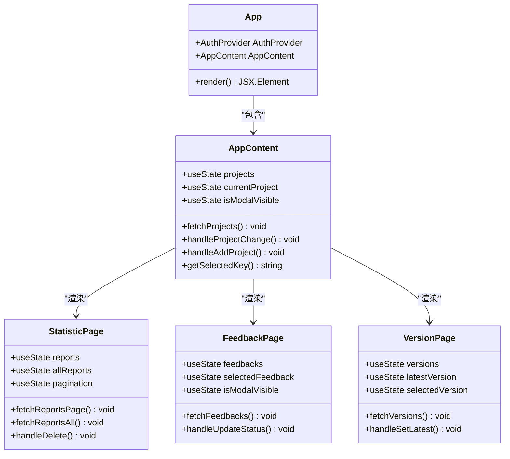
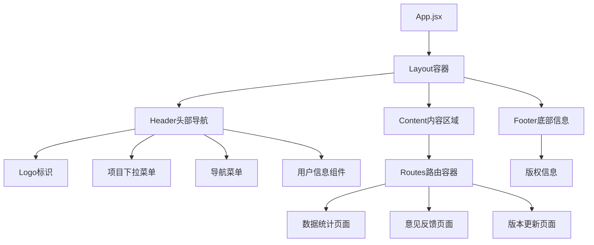
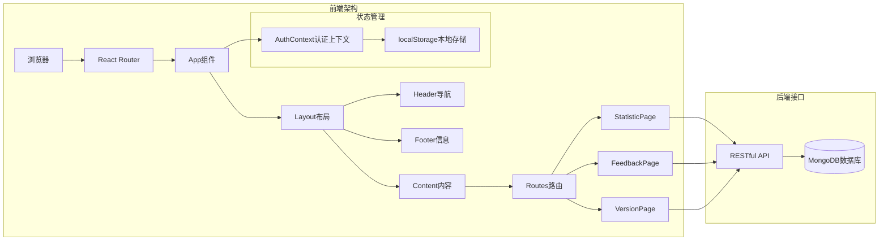
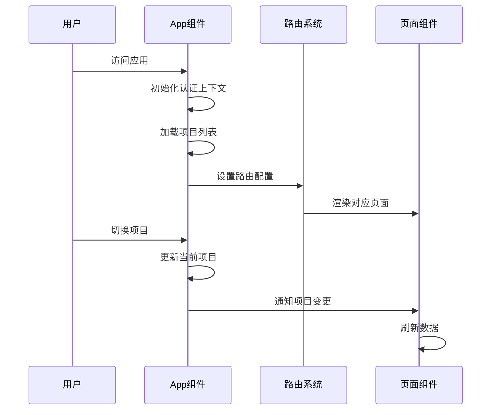
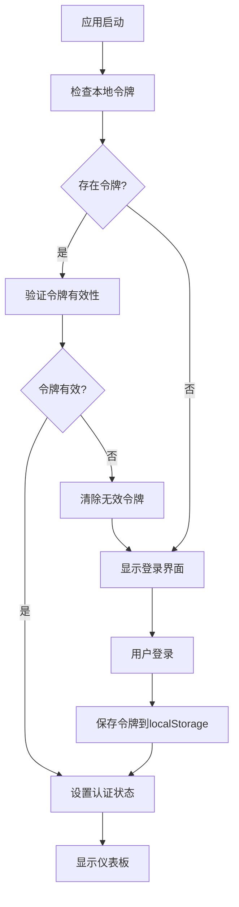
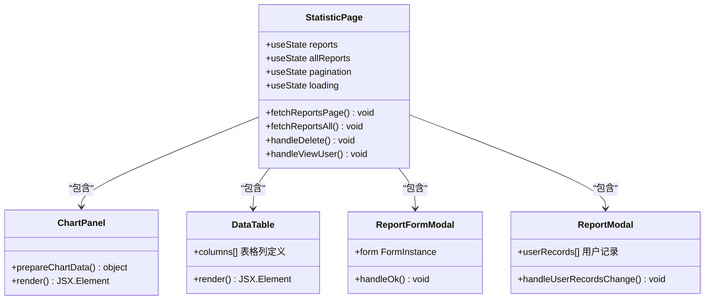
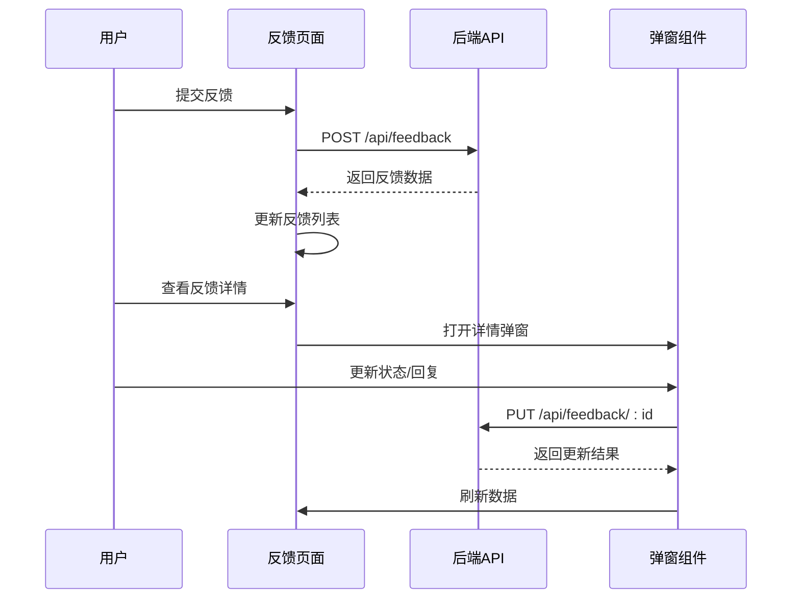

# React应用结构

<cite>
**本文档引用的文件**
- [App.jsx](file://client/src/App.jsx)
- [index.jsx](file://client/src/index.jsx)
- [AuthContext.jsx](file://client/src/context/AuthContext.jsx)
- [StatisticPage/index.jsx](file://client/src/pages/StatisticPage/index.jsx)
- [FeedbackPage.jsx](file://client/src/pages/FeedbackPage.jsx)
- [VersionPage.jsx](file://client/src/pages/VersionPage.jsx)
- [ChartPanel.jsx](file://client/src/pages/StatisticPage/ChartPanel.jsx)
- [DataTable.jsx](file://client/src/pages/StatisticPage/DataTable.jsx)
- [ReportFormModal.jsx](file://client/src/pages/StatisticPage/ReportFormModal.jsx)
- [ReportModal.jsx](file://client/src/pages/StatisticPage/ReportModal.jsx)
- [AuthButton.jsx](file://client/src/components/AuthButton.jsx)
- [package.json](file://client/package.json)
- [README.md](file://README.md)
</cite>

## 目录
1. [简介](#简介)
2. [项目结构](#项目结构)
3. [核心组件](#核心组件)
4. [架构概览](#架构概览)
5. [详细组件分析](#详细组件分析)
6. [依赖关系分析](#依赖关系分析)
7. [性能考虑](#性能考虑)
8. [故障排除指南](#故障排除指南)
9. [结论](#结论)

## 简介

WoaX是一个基于React的全栈应用程序，采用前后端分离架构。该应用提供了三个主要功能模块：数据统计、意见反馈管理和版本更新通知。应用采用现代化的技术栈，包括React 18、React Router 6、Ant Design UI框架和Recharts图表库。

## 项目结构

项目采用清晰的分层架构设计，前端客户端位于`client/src`目录下，按照功能模块进行组织：



**图表来源**
- [App.jsx](file://client/src/App.jsx#L1-L253)
- [index.jsx](file://client/src/index.jsx#L1-L15)

**章节来源**
- [README.md](file://README.md#L11-L17)
- [package.json](file://client/package.json#L1-L47)

## 核心组件

### 应用主组件架构

应用采用分层组件设计，从顶层App组件到具体页面组件形成清晰的层次结构：



**图表来源**
- [App.jsx](file://client/src/App.jsx#L245-L251)
- [StatisticPage/index.jsx](file://client/src/pages/StatisticPage/index.jsx#L12-L262)
- [FeedbackPage.jsx](file://client/src/pages/FeedbackPage.jsx#L23-L496)
- [VersionPage.jsx](file://client/src/pages/VersionPage.jsx#L30-L890)

### 布局系统设计

应用采用Ant Design的Layout组件构建响应式布局，包含Header、Content和Footer三个主要区域：



**图表来源**
- [App.jsx](file://client/src/App.jsx#L16-L242)

**章节来源**
- [App.jsx](file://client/src/App.jsx#L1-L253)

## 架构概览

应用采用客户端路由和状态管理相结合的架构模式：



**图表来源**
- [index.jsx](file://client/src/index.jsx#L8-L14)
- [AuthContext.jsx](file://client/src/context/AuthContext.jsx#L9-L155)

## 详细组件分析

### App主组件分析

App主组件是整个应用的入口点，负责全局状态管理和路由配置：

#### 组件职责
- **路由管理**：配置三个主要页面的路由规则
- **项目管理**：处理多项目切换和持久化存储
- **认证集成**：整合认证上下文提供全局认证能力
- **UI布局**：构建统一的头部导航和内容布局

#### 关键实现特性



**图表来源**
- [App.jsx](file://client/src/App.jsx#L62-L243)

**章节来源**
- [App.jsx](file://client/src/App.jsx#L245-L251)

### 路由系统配置

应用使用React Router 6的现代路由API，实现了声明式的路由配置：

#### 路由定义
- **根路径** (`/`)：数据统计页面
- **反馈路径** (`/feedback`)：意见反馈页面  
- **版本路径** (`/version`)：版本更新页面

#### 路由导航机制
- 使用`Link`组件实现声明式导航
- `useLocation`钩子跟踪当前路由状态
- 动态菜单高亮显示当前选中项

**章节来源**
- [App.jsx](file://client/src/App.jsx#L213-L217)
- [App.jsx](file://client/src/App.jsx#L69-L75)

### Header头部导航系统

Header组件实现了完整的导航功能，包含以下核心元素：

#### 项目选择功能
- **项目下拉菜单**：动态加载可用项目
- **项目切换**：实时切换当前工作项目
- **持久化存储**：使用localStorage保存用户选择

#### 导航菜单
- **数据统计**：主数据面板
- **意见反馈**：用户反馈管理
- **版本更新**：版本发布管理

#### 用户认证集成
- **登录状态显示**：根据认证状态显示不同界面
- **登出功能**：提供安全的用户登出机制

**章节来源**
- [App.jsx](file://client/src/App.jsx#L160-L209)

### 内容区域组件

Content区域采用Flex布局，为三个主要页面提供统一的容器环境：

#### 响应式设计
- **自适应高度**：使用`minHeight: '100vh'`确保全屏覆盖
- **内边距设置**：统一的内容边距规范
- **滚动优化**：合理的滚动区域划分

#### 页面渲染机制
- **条件渲染**：根据路由状态动态渲染对应页面
- **状态传递**：向子组件传递共享的项目状态

**章节来源**
- [App.jsx](file://client/src/App.jsx#L211-L219)

### Footer底部信息

Footer组件提供简洁的版权信息展示：

#### 设计特点
- **居中对齐**：水平居中的信息布局
- **简洁设计**：最小化的视觉干扰
- **技术标识**：明确标注使用的技术栈

**章节来源**
- [App.jsx](file://client/src/App.jsx#L238-L240)

### 认证上下文系统

应用采用React Context API实现全局认证状态管理：

#### 上下文提供者
- **状态管理**：维护登录状态和用户信息
- **生命周期**：初始化时自动验证现有令牌
- **本地存储**：持久化认证信息

#### 认证流程


**图表来源**
- [AuthContext.jsx](file://client/src/context/AuthContext.jsx#L16-L48)

**章节来源**
- [AuthContext.jsx](file://client/src/context/AuthContext.jsx#L9-L155)

### 数据统计页面组件

数据统计页面是应用的核心功能模块，提供了完整的数据分析和管理能力：

#### 组件架构


**图表来源**
- [StatisticPage/index.jsx](file://client/src/pages/StatisticPage/index.jsx#L12-L262)
- [ChartPanel.jsx](file://client/src/pages/StatisticPage/ChartPanel.jsx#L8-L129)
- [DataTable.jsx](file://client/src/pages/StatisticPage/DataTable.jsx#L6-L124)

#### 数据处理机制
- **分页加载**：支持大数据量的分页显示
- **全量数据**：用于图表展示的完整数据集
- **实时更新**：项目切换时自动刷新数据

#### 图表可视化
- **版本分布**：柱状图展示版本使用情况
- **时间趋势**：折线图分析使用趋势
- **设备分布**：饼图显示设备类型占比

**章节来源**
- [StatisticPage/index.jsx](file://client/src/pages/StatisticPage/index.jsx#L12-L262)
- [ChartPanel.jsx](file://client/src/pages/StatisticPage/ChartPanel.jsx#L8-L129)

### 意见反馈页面组件

意见反馈页面提供了完整的用户反馈收集和管理功能：

#### 核心功能
- **反馈列表**：分页显示用户提交的反馈
- **状态管理**：支持三种状态（待处理、已审阅、已解决）
- **回复功能**：支持管理员回复用户反馈
- **富文本编辑**：使用ReactQuill提供富文本编辑能力

#### 数据流设计


**图表来源**
- [FeedbackPage.jsx](file://client/src/pages/FeedbackPage.jsx#L194-L219)

**章节来源**
- [FeedbackPage.jsx](file://client/src/pages/FeedbackPage.jsx#L23-L496)

### 版本更新页面组件

版本更新页面专注于应用版本管理和发布流程：

#### 主要功能
- **版本列表**：显示所有已发布版本
- **最新版本**：突出显示当前最新版本
- **文件管理**：支持版本文件的上传和下载
- **状态控制**：管理版本的发布状态

#### 文件处理机制
- **多文件上传**：支持主程序文件和描述文件
- **文件名修复**：处理中文文件名编码问题
- **下载优化**：确保文件下载时的正确文件名

**章节来源**
- [VersionPage.jsx](file://client/src/pages/VersionPage.jsx#L30-L890)

### 权限控制组件

AuthButton组件提供了统一的权限控制机制：

#### 权限检查逻辑
- **认证状态**：检查用户是否已登录
- **权限提示**：未登录时显示锁定图标
- **登录引导**：自动触发登录弹窗

#### 组件设计原则
- **无侵入性**：保持原有按钮的所有属性
- **透明代理**：完全代理原始点击事件
- **用户体验**：提供清晰的权限状态反馈

**章节来源**
- [AuthButton.jsx](file://client/src/components/AuthButton.jsx#L12-L43)

## 依赖关系分析

应用的依赖关系体现了清晰的分层架构：

```mermaid
graph TD
subgraph "外部依赖"
React[react@^18.2.0]
Router[react-router-dom@^6.10.0]
Antd[antd@^5.4.0]
Axios[axios@^1.3.5]
Recharts[recharts@^2.15.3]
end
subgraph "应用内部"
App[App.jsx]
AuthContext[AuthContext.jsx]
StatisticPage[StatisticPage/index.jsx]
FeedbackPage[FeedbackPage.jsx]
VersionPage[VersionPage.jsx]
AuthButton[AuthButton.jsx]
end
React --> App
Router --> App
Antd --> App
Axios --> App
Recharts --> StatisticPage
App --> AuthContext
App --> StatisticPage
App --> FeedbackPage
App --> VersionPage
StatisticPage --> AuthButton
FeedbackPage --> AuthButton
VersionPage --> AuthButton
```

**图表来源**
- [package.json](file://client/package.json#L5-L18)

**章节来源**
- [package.json](file://client/package.json#L1-L47)

## 性能考虑

### 状态管理优化
- **局部状态**：每个页面组件维护自己的状态，避免不必要的全局更新
- **懒加载**：按需加载图表组件，减少初始渲染负担
- **缓存策略**：合理使用localStorage缓存用户选择和认证信息

### 数据加载优化
- **分页加载**：大数据量场景下采用分页策略
- **并发请求**：合理安排API请求的并发度
- **错误处理**：完善的错误边界和降级策略

### UI渲染优化
- **虚拟滚动**：表格组件支持虚拟滚动提高大数据渲染性能
- **防抖节流**：对频繁触发的UI操作进行性能优化
- **组件复用**：通过组件抽象减少重复渲染

## 故障排除指南

### 常见问题及解决方案

#### 认证相关问题
- **令牌过期**：系统会自动检测并清除无效令牌
- **登录失败**：检查网络连接和服务器状态
- **权限不足**：确认用户是否具有相应权限

#### 数据加载问题
- **API请求失败**：检查后端服务是否正常运行
- **数据格式错误**：验证API响应格式的一致性
- **网络超时**：适当调整请求超时配置

#### UI显示问题
- **样式异常**：检查CSS类名和样式文件的正确性
- **组件渲染错误**：确认组件导入路径的准确性
- **响应式布局问题**：验证断点设置和媒体查询

**章节来源**
- [AuthContext.jsx](file://client/src/context/AuthContext.jsx#L24-L48)
- [App.jsx](file://client/src/App.jsx#L18-L25)

## 结论

WoaX React应用展现了现代前端开发的最佳实践，采用了清晰的架构设计和优秀的代码组织方式。应用的主要优势包括：

### 架构优势
- **清晰的分层设计**：从路由到组件的层次结构明确
- **模块化开发**：功能模块独立，便于维护和扩展
- **状态管理合理**：结合React Hooks和Context实现高效的状态管理

### 技术亮点
- **现代化技术栈**：使用React 18和最新的React Router 6
- **丰富的UI组件**：基于Ant Design提供一致的用户体验
- **完整的功能覆盖**：涵盖数据统计、反馈管理和版本更新三大核心功能

### 开发体验
- **良好的可维护性**：代码结构清晰，注释完整
- **完善的错误处理**：全面的错误边界和用户反馈机制
- **性能优化考虑**：在多个层面进行了性能优化

该应用为类似的数据管理类应用提供了优秀的参考模板，其架构设计和实现细节值得学习和借鉴。