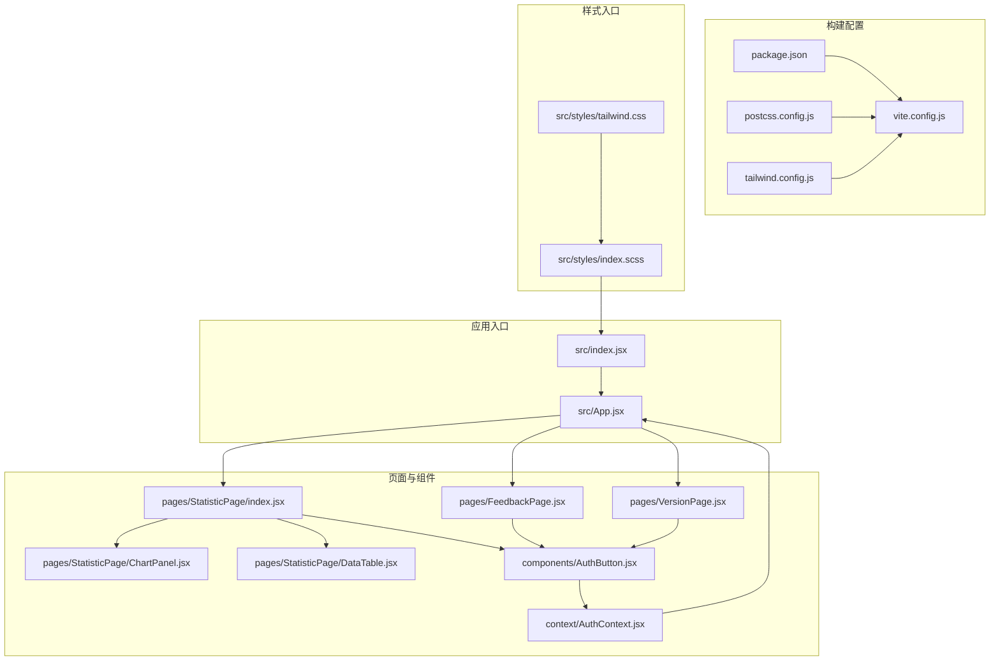
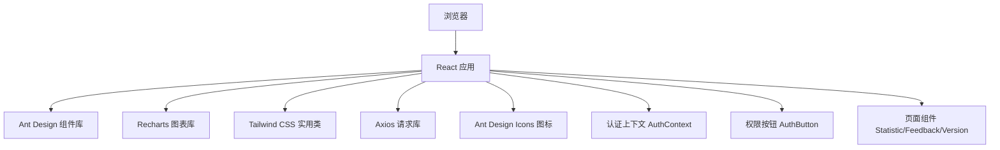
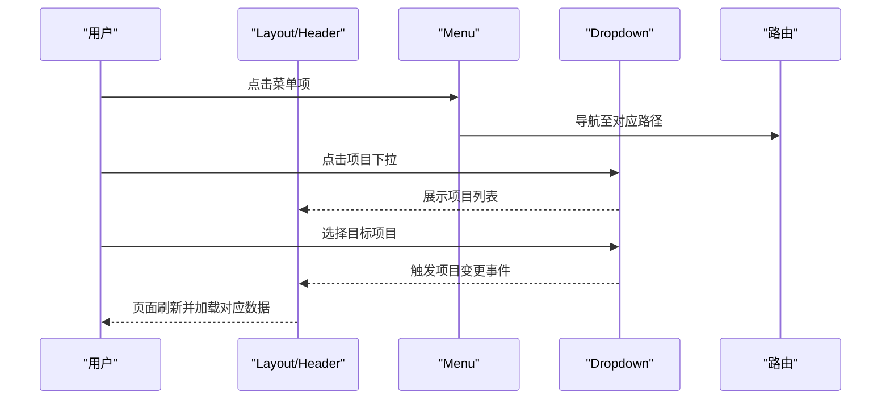
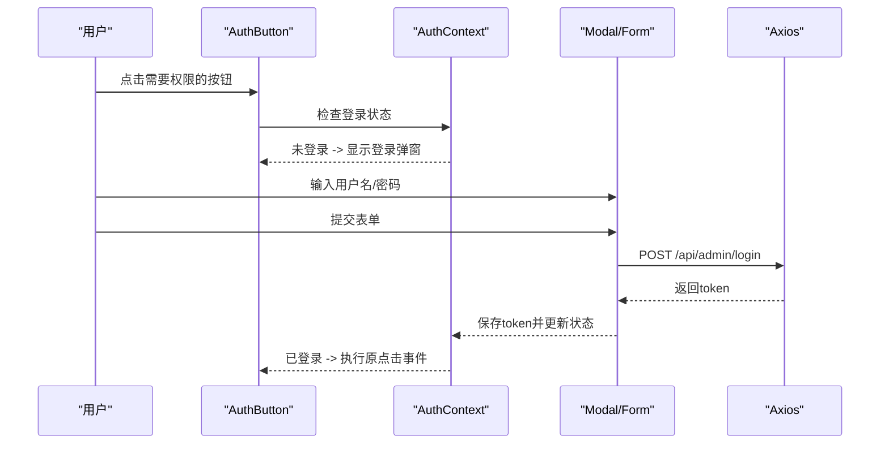
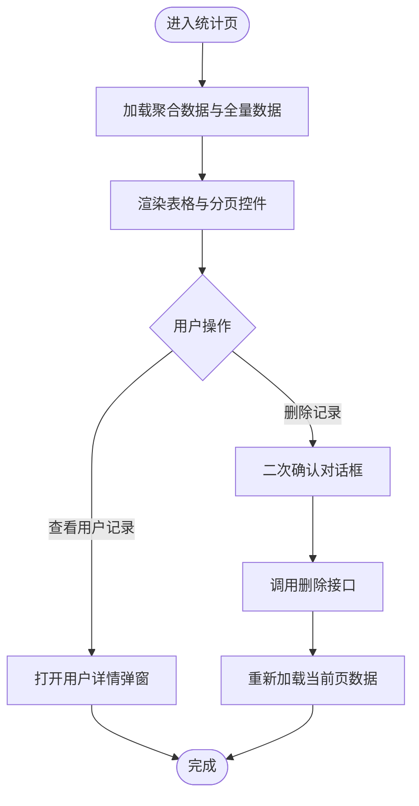
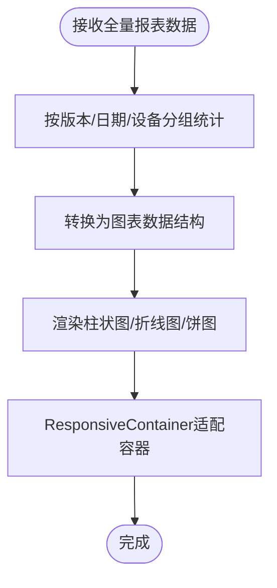
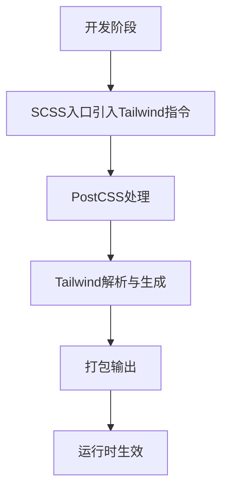
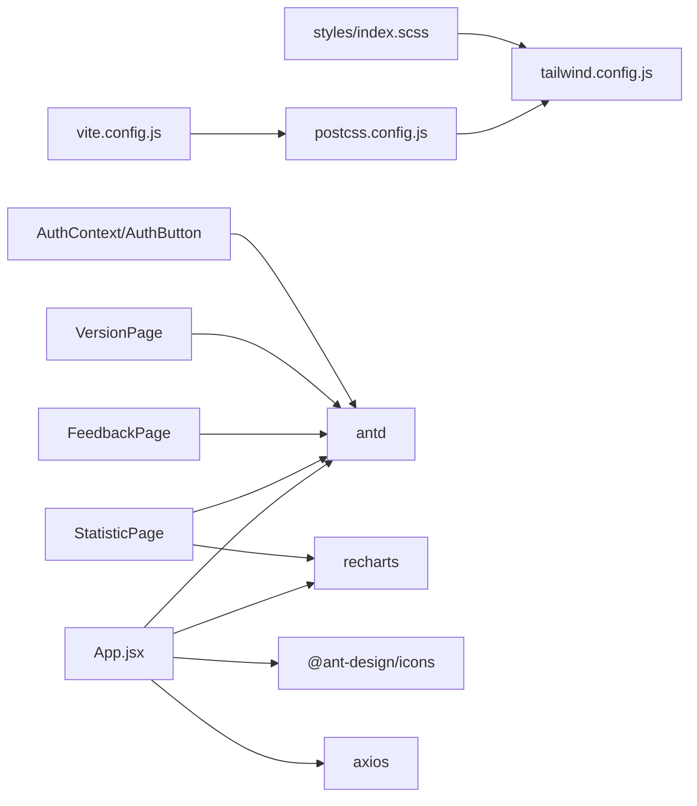

# UI库集成

<cite>
**本文引用的文件**
- [client/package.json](file://client/package.json)
- [client/tailwind.config.js](file://client/tailwind.config.js)
- [client/postcss.config.js](file://client/postcss.config.js)
- [client/vite.config.js](file://client/vite.config.js)
- [client/src/styles/index.scss](file://client/src/styles/index.scss)
- [client/src/styles/tailwind.css](file://client/src/styles/tailwind.css)
- [client/src/App.jsx](file://client/src/App.jsx)
- [client/src/index.jsx](file://client/src/index.jsx)
- [client/src/context/AuthContext.jsx](file://client/src/context/AuthContext.jsx)
- [client/src/components/AuthButton.jsx](file://client/src/components/AuthButton.jsx)
- [client/src/pages/StatisticPage/index.jsx](file://client/src/pages/StatisticPage/index.jsx)
- [client/src/pages/StatisticPage/ChartPanel.jsx](file://client/src/pages/StatisticPage/ChartPanel.jsx)
- [client/src/pages/StatisticPage/DataTable.jsx](file://client/src/pages/StatisticPage/DataTable.jsx)
- [client/src/pages/FeedbackPage.jsx](file://client/src/pages/FeedbackPage.jsx)
- [client/src/pages/VersionPage.jsx](file://client/src/pages/VersionPage.jsx)
</cite>

## 目录
1. [引言](#引言)
2. [项目结构](#项目结构)
3. [核心组件](#核心组件)
4. [架构总览](#架构总览)
5. [组件详解](#组件详解)
6. [依赖关系分析](#依赖关系分析)
7. [性能考量](#性能考量)
8. [故障排查指南](#故障排查指南)
9. [结论](#结论)
10. [附录](#附录)

## 引言
本文件面向WoaX前端UI库集成，系统性梳理并解释以下技术栈与实践：
- Ant Design的设计理念与组件体系：以Layout、Menu、Button、Modal、Table、Dropdown、Form、Badge、Descriptions、Upload等为核心，结合图标系统与认证上下文，构建统一的管理后台界面。
- Recharts图表库的集成：在统计页面中对柱状图、折线图、饼图进行数据准备、配置与交互展示。
- Tailwind CSS的配置与使用：PostCSS管线、SCSS入口、响应式与基础样式的组织方式。
- 图标系统：Ant Design Icons的引入与使用，以及如何扩展自定义图标。
- 组件定制化：主题、样式覆盖与组件扩展的最佳实践。

## 项目结构
客户端采用Vite + React + Ant Design + Recharts + Tailwind CSS的组合，样式通过SCSS入口引入Tailwind指令，构建期由PostCSS与Tailwind处理，运行时Ant Design提供UI组件与样式。

**图表来源**
- [client/vite.config.js](file://client/vite.config.js#L1-L50)
- [client/postcss.config.js](file://client/postcss.config.js#L1-L7)
- [client/tailwind.config.js](file://client/tailwind.config.js#L1-L10)
- [client/src/styles/index.scss](file://client/src/styles/index.scss#L1-L36)
- [client/src/styles/tailwind.css](file://client/src/styles/tailwind.css#L1-L3)
- [client/src/index.jsx](file://client/src/index.jsx#L1-L15)
- [client/src/App.jsx](file://client/src/App.jsx#L1-L253)
- [client/src/pages/StatisticPage/index.jsx](file://client/src/pages/StatisticPage/index.jsx#L1-L262)
- [client/src/pages/StatisticPage/ChartPanel.jsx](file://client/src/pages/StatisticPage/ChartPanel.jsx#L1-L129)
- [client/src/pages/StatisticPage/DataTable.jsx](file://client/src/pages/StatisticPage/DataTable.jsx#L1-L124)
- [client/src/pages/FeedbackPage.jsx](file://client/src/pages/FeedbackPage.jsx#L1-L496)
- [client/src/pages/VersionPage.jsx](file://client/src/pages/VersionPage.jsx#L1-L800)
- [client/src/context/AuthContext.jsx](file://client/src/context/AuthContext.jsx#L1-L155)
- [client/src/components/AuthButton.jsx](file://client/src/components/AuthButton.jsx#L1-L43)

**章节来源**
- [client/package.json](file://client/package.json#L1-L47)
- [client/vite.config.js](file://client/vite.config.js#L1-L50)
- [client/postcss.config.js](file://client/postcss.config.js#L1-L7)
- [client/tailwind.config.js](file://client/tailwind.config.js#L1-L10)
- [client/src/styles/index.scss](file://client/src/styles/index.scss#L1-L36)
- [client/src/styles/tailwind.css](file://client/src/styles/tailwind.css#L1-L3)
- [client/src/index.jsx](file://client/src/index.jsx#L1-L15)
- [client/src/App.jsx](file://client/src/App.jsx#L1-L253)

## 核心组件
本项目围绕Ant Design组件构建管理后台，关键点如下：
- 布局与导航：Layout.Header/Content/Footer + Menu + Dropdown，实现顶部导航与用户信息展示。
- 表单与弹窗：Modal + Form，用于登录、版本发布、反馈详情编辑等场景。
- 数据表格：Table + Pagination，配合分页与加载态，支持排序、筛选与行内操作。
- 图标与按钮：Button、Dropdown、Badge、Descriptions、Upload等，提升交互与信息密度。
- 权限控制：AuthButton封装权限校验与登录提示，统一约束敏感操作。

**章节来源**
- [client/src/App.jsx](file://client/src/App.jsx#L16-L242)
- [client/src/context/AuthContext.jsx](file://client/src/context/AuthContext.jsx#L1-L155)
- [client/src/components/AuthButton.jsx](file://client/src/components/AuthButton.jsx#L1-L43)
- [client/src/pages/StatisticPage/DataTable.jsx](file://client/src/pages/StatisticPage/DataTable.jsx#L1-L124)
- [client/src/pages/FeedbackPage.jsx](file://client/src/pages/FeedbackPage.jsx#L1-L496)
- [client/src/pages/VersionPage.jsx](file://client/src/pages/VersionPage.jsx#L1-L800)

## 架构总览
整体架构由“构建配置 → 样式入口 → 应用入口 → 页面与组件”构成，Ant Design提供UI能力，Recharts负责可视化，Tailwind CSS提供实用工具类，Axios负责前后端通信。

**图表来源**
- [client/src/App.jsx](file://client/src/App.jsx#L1-L253)
- [client/src/pages/StatisticPage/index.jsx](file://client/src/pages/StatisticPage/index.jsx#L1-L262)
- [client/src/pages/FeedbackPage.jsx](file://client/src/pages/FeedbackPage.jsx#L1-L496)
- [client/src/pages/VersionPage.jsx](file://client/src/pages/VersionPage.jsx#L1-L800)
- [client/src/context/AuthContext.jsx](file://client/src/context/AuthContext.jsx#L1-L155)
- [client/src/components/AuthButton.jsx](file://client/src/components/AuthButton.jsx#L1-L43)

## 组件详解

### Ant Design 布局与导航（Layout、Menu、Dropdown）
- 使用Layout划分头部、内容与底部区域；Menu作为横向导航，结合图标与路由链接实现页面跳转。
- Dropdown用于项目切换与用户信息下拉菜单，Button作为触发元素。
- Header中集成了Logo、项目选择、导航菜单、新增项目按钮与用户信息/登录入口。

**图表来源**
- [client/src/App.jsx](file://client/src/App.jsx#L173-L209)

**章节来源**
- [client/src/App.jsx](file://client/src/App.jsx#L16-L242)

### 表单与弹窗（Modal、Form、Input、Button）
- 登录弹窗：Form + Input + Button，通过AuthContext管理登录流程与令牌持久化。
- 版本发布弹窗：Form + Input + Upload + Radio + Switch，支持文件上传与描述文件附加。
- 反馈详情弹窗：Form + Descriptions + ReactQuill富文本编辑器，支持状态切换与回复历史展示。

**图表来源**
- [client/src/context/AuthContext.jsx](file://client/src/context/AuthContext.jsx#L62-L92)
- [client/src/components/AuthButton.jsx](file://client/src/components/AuthButton.jsx#L12-L41)

**章节来源**
- [client/src/context/AuthContext.jsx](file://client/src/context/AuthContext.jsx#L1-L155)
- [client/src/components/AuthButton.jsx](file://client/src/components/AuthButton.jsx#L1-L43)
- [client/src/pages/VersionPage.jsx](file://client/src/pages/VersionPage.jsx#L406-L459)
- [client/src/pages/FeedbackPage.jsx](file://client/src/pages/FeedbackPage.jsx#L117-L175)

### 数据表格（Table、Pagination、Tooltip、Space）
- StatisticPage的表格列包含序号、用户名、IP、时间、版本号、备注、设备信息与操作列。
- 支持分页、滚动、加载态与单元格超长文本的Tooltip展示。
- 操作列使用AuthButton控制删除等敏感操作的权限。

**图表来源**
- [client/src/pages/StatisticPage/index.jsx](file://client/src/pages/StatisticPage/index.jsx#L57-L125)
- [client/src/pages/StatisticPage/DataTable.jsx](file://client/src/pages/StatisticPage/DataTable.jsx#L6-L93)

**章节来源**
- [client/src/pages/StatisticPage/index.jsx](file://client/src/pages/StatisticPage/index.jsx#L1-L262)
- [client/src/pages/StatisticPage/DataTable.jsx](file://client/src/pages/StatisticPage/DataTable.jsx#L1-L124)

### 图表集成（Recharts：Bar、Line、Pie）
- ChartPanel对全量统计数据进行分组统计，分别生成版本分布柱状图、时间趋势折线图与设备分布饼图。
- 使用ResponsiveContainer保证图表在容器内自适应尺寸。
- 饼图启用Tooltip与百分比标签，颜色数组循环填充。

**图表来源**
- [client/src/pages/StatisticPage/ChartPanel.jsx](file://client/src/pages/StatisticPage/ChartPanel.jsx#L8-L53)
- [client/src/pages/StatisticPage/ChartPanel.jsx](file://client/src/pages/StatisticPage/ChartPanel.jsx#L55-L126)

**章节来源**
- [client/src/pages/StatisticPage/ChartPanel.jsx](file://client/src/pages/StatisticPage/ChartPanel.jsx#L1-L129)

### Tailwind CSS 配置与使用
- PostCSS管线启用tailwindcss与autoprefixer，确保CSS预处理与自动前缀。
- SCSS入口通过@tailwind指令引入基础、组件与工具类，同时保留基础样式重置与根容器布局。
- 项目中大量使用Ant Design提供的className与内联样式，同时可混用Tailwind工具类进行快速布局。

**图表来源**
- [client/src/styles/index.scss](file://client/src/styles/index.scss#L1-L36)
- [client/src/styles/tailwind.css](file://client/src/styles/tailwind.css#L1-L3)
- [client/postcss.config.js](file://client/postcss.config.js#L1-L7)
- [client/tailwind.config.js](file://client/tailwind.config.js#L1-L10)

**章节来源**
- [client/src/styles/index.scss](file://client/src/styles/index.scss#L1-L36)
- [client/src/styles/tailwind.css](file://client/src/styles/tailwind.css#L1-L3)
- [client/postcss.config.js](file://client/postcss.config.js#L1-L7)
- [client/tailwind.config.js](file://client/tailwind.config.js#L1-L10)

### 图标系统（Ant Design Icons）
- 在App.jsx中引入数据库、评论、上传等图标，并在Menu与按钮中使用。
- AuthButton在未登录时以锁图标提示权限不足。
- 可通过@ant-design/icons按需引入更多图标，建议保持图标命名清晰与语义一致。

**章节来源**
- [client/src/App.jsx](file://client/src/App.jsx#L4-L5)
- [client/src/components/AuthButton.jsx](file://client/src/components/AuthButton.jsx#L3-L4)

### 权限控制组件（AuthButton）
- 包装任意Ant Design Button，若未登录则显示锁图标并禁用点击，同时弹出登录弹窗。
- 若已登录则正常执行传入的onClick回调。
- Tooltip用于提示权限要求，增强可用性。

**章节来源**
- [client/src/components/AuthButton.jsx](file://client/src/components/AuthButton.jsx#L1-L43)
- [client/src/context/AuthContext.jsx](file://client/src/context/AuthContext.jsx#L1-L155)

## 依赖关系分析
- 构建与样式：Vite负责开发服务器与打包；PostCSS与Tailwind在构建期处理CSS；SCSS入口统一引入。
- 运行时依赖：Ant Design提供UI组件与样式；Recharts提供图表能力；Ant Design Icons提供图标；Axios负责HTTP请求。
- 页面与组件：各页面组件通过Ant Design与Recharts组合实现业务功能；AuthContext与AuthButton贯穿权限控制。

**图表来源**
- [client/vite.config.js](file://client/vite.config.js#L1-L50)
- [client/postcss.config.js](file://client/postcss.config.js#L1-L7)
- [client/tailwind.config.js](file://client/tailwind.config.js#L1-L10)
- [client/src/styles/index.scss](file://client/src/styles/index.scss#L1-L36)
- [client/src/App.jsx](file://client/src/App.jsx#L1-L253)
- [client/src/pages/StatisticPage/index.jsx](file://client/src/pages/StatisticPage/index.jsx#L1-L262)
- [client/src/pages/FeedbackPage.jsx](file://client/src/pages/FeedbackPage.jsx#L1-L496)
- [client/src/pages/VersionPage.jsx](file://client/src/pages/VersionPage.jsx#L1-L800)
- [client/src/context/AuthContext.jsx](file://client/src/context/AuthContext.jsx#L1-L155)
- [client/src/components/AuthButton.jsx](file://client/src/components/AuthButton.jsx#L1-L43)

**章节来源**
- [client/package.json](file://client/package.json#L1-L47)
- [client/vite.config.js](file://client/vite.config.js#L1-L50)

## 性能考量
- 图表渲染：ChartPanel在无数据时显示加载态，避免空图表导致的布局抖动。
- 表格性能：StatisticPage的表格开启固定高度与横向滚动，减少大表格重排；分页加载避免一次性渲染过多数据。
- 请求拦截：全局Axios拦截器自动注入Bearer Token，减少重复代码与错误。
- 构建优化：Vite默认ESBuild加载JSX，optimizeDeps配置确保依赖解析一致。

**章节来源**
- [client/src/pages/StatisticPage/ChartPanel.jsx](file://client/src/pages/StatisticPage/ChartPanel.jsx#L55-L126)
- [client/src/pages/StatisticPage/DataTable.jsx](file://client/src/pages/StatisticPage/DataTable.jsx#L95-L121)
- [client/src/App.jsx](file://client/src/App.jsx#L18-L25)
- [client/vite.config.js](file://client/vite.config.js#L34-L49)

## 故障排查指南
- 登录失败：检查AuthContext的登录接口返回与错误消息，确认Axios拦截器是否正确注入Authorization头。
- 权限按钮无效：确认AuthContext状态与localStorage中的token存在且未过期。
- 表格列宽异常：检查DataTable的列定义与表格容器宽度，必要时调整scroll.x与列宽。
- 图表空白：确认ChartPanel接收的数据非空，或在无数据时显示加载态。
- 文件下载中文名乱码：VersionPage中提供了文件名修复逻辑，可参考其编码处理策略。

**章节来源**
- [client/src/context/AuthContext.jsx](file://client/src/context/AuthContext.jsx#L24-L48)
- [client/src/components/AuthButton.jsx](file://client/src/components/AuthButton.jsx#L12-L41)
- [client/src/pages/StatisticPage/DataTable.jsx](file://client/src/pages/StatisticPage/DataTable.jsx#L95-L121)
- [client/src/pages/StatisticPage/ChartPanel.jsx](file://client/src/pages/StatisticPage/ChartPanel.jsx#L55-L126)
- [client/src/pages/VersionPage.jsx](file://client/src/pages/VersionPage.jsx#L319-L349)

## 结论
本项目以Ant Design为核心，结合Recharts与Tailwind CSS，构建了具备权限控制、数据可视化与响应式布局的管理后台。通过统一的认证上下文与权限按钮组件，实现了对敏感操作的精细化控制；通过图表组件与表格组件，提升了数据分析与管理效率。Tailwind CSS与PostCSS的配置为样式工程化提供了基础，便于后续的主题定制与扩展。

## 附录
- 主题与样式覆盖建议
  - 使用Tailwind的theme.extend扩展自定义颜色与字体，避免直接覆盖Ant Design内部样式。
  - 对Ant Design组件的样式覆盖建议通过className与CSS变量结合，避免使用!important。
- 组件扩展建议
  - 将通用交互（如二次确认、批量操作）抽象为高阶组件或Hook，减少重复代码。
  - 对权限控制集中于AuthContext，避免在多处分散处理登录状态与提示。