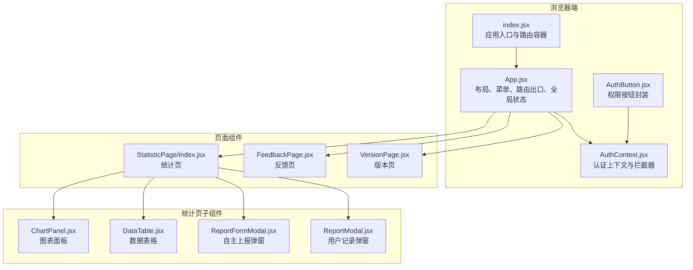
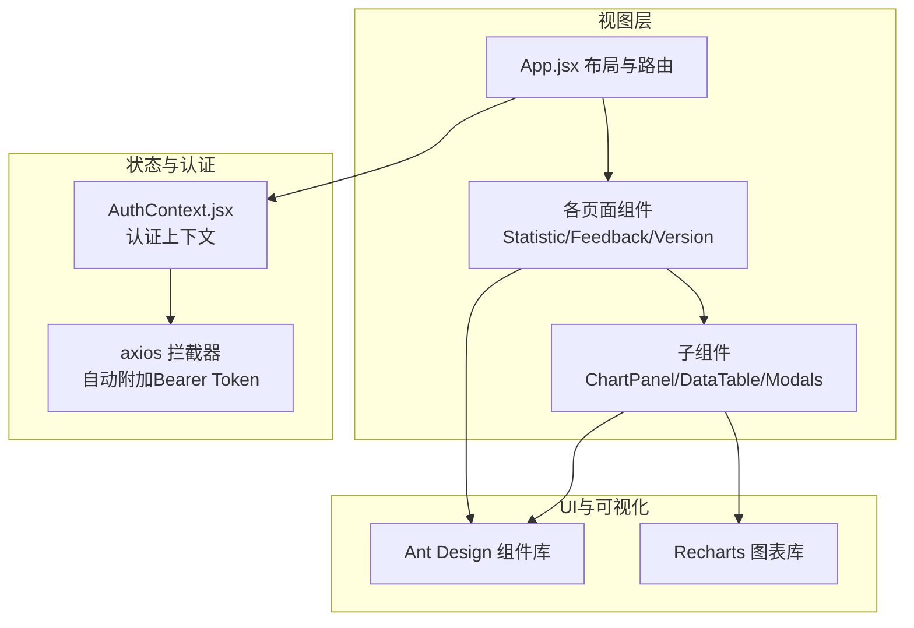
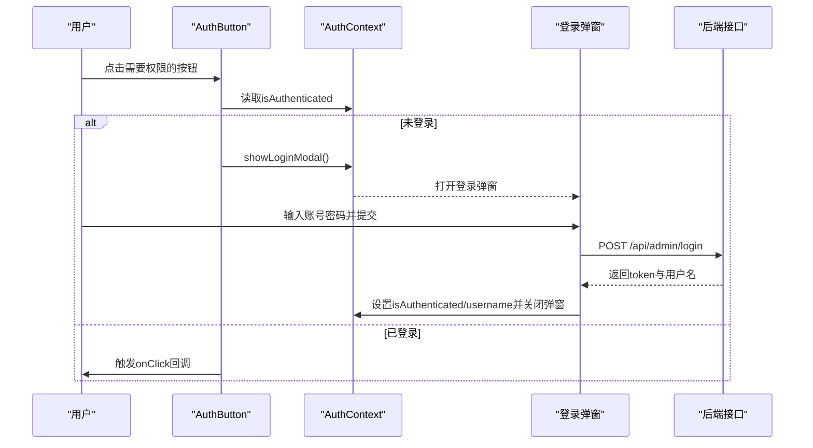
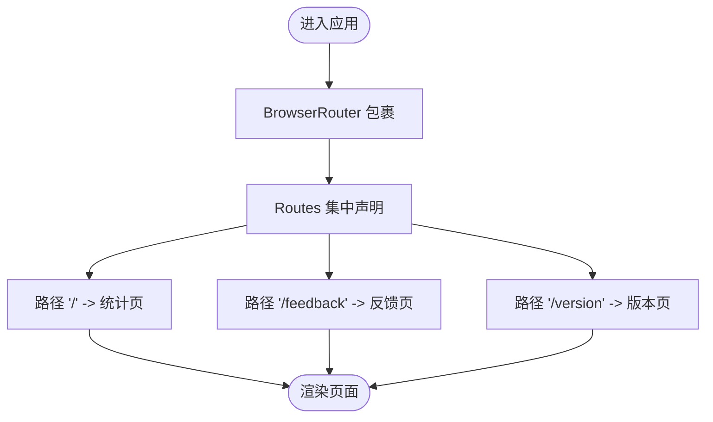
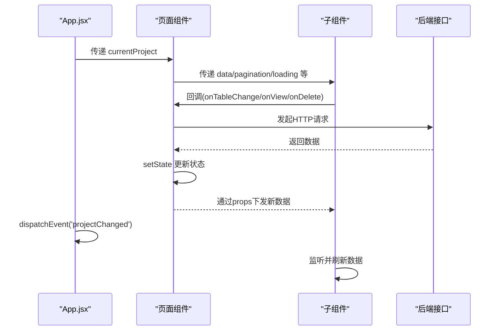
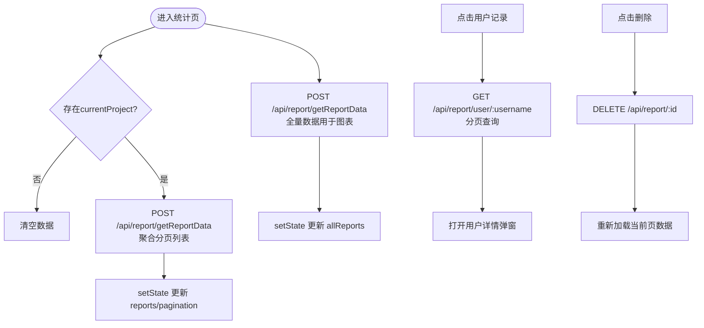
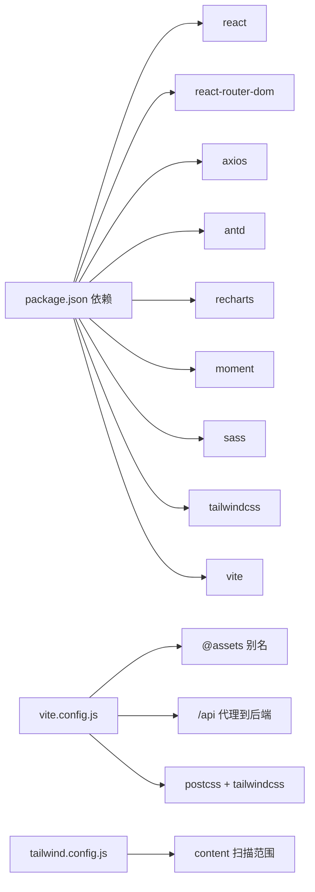

# 前端架构

<cite>
**本文引用的文件**
- [client/src/App.jsx](file://client/src/App.jsx)
- [client/src/index.jsx](file://client/src/index.jsx)
- [client/src/context/AuthContext.jsx](file://client/src/context/AuthContext.jsx)
- [client/src/components/AuthButton.jsx](file://client/src/components/AuthButton.jsx)
- [client/src/pages/StatisticPage/index.jsx](file://client/src/pages/StatisticPage/index.jsx)
- [client/src/pages/StatisticPage/ChartPanel.jsx](file://client/src/pages/StatisticPage/ChartPanel.jsx)
- [client/src/pages/StatisticPage/DataTable.jsx](file://client/src/pages/StatisticPage/DataTable.jsx)
- [client/src/pages/StatisticPage/ReportFormModal.jsx](file://client/src/pages/StatisticPage/ReportFormModal.jsx)
- [client/src/pages/StatisticPage/ReportModal.jsx](file://client/src/pages/StatisticPage/ReportModal.jsx)
- [client/src/pages/FeedbackPage.jsx](file://client/src/pages/FeedbackPage.jsx)
- [client/src/pages/VersionPage.jsx](file://client/src/pages/VersionPage.jsx)
- [client/package.json](file://client/package.json)
- [client/vite.config.js](file://client/vite.config.js)
- [client/tailwind.config.js](file://client/tailwind.config.js)
</cite>

## 目录
1. [引言](#引言)
2. [项目结构](#项目结构)
3. [核心组件](#核心组件)
4. [架构总览](#架构总览)
5. [组件详解](#组件详解)
6. [依赖关系分析](#依赖关系分析)
7. [性能与可维护性](#性能与可维护性)
8. [故障排查指南](#故障排查指南)
9. [结论](#结论)
10. [附录](#附录)

## 引言
本文件面向WoaX前端应用，系统性梳理基于React + Vite的单页应用架构，重点覆盖以下方面：
- 组件层次结构与职责边界
- 状态管理模式与数据流
- 路由系统与页面导航
- 认证上下文AuthContext的实现机制（含JWT令牌管理与权限控制）
- 组件间通信方式与状态同步策略
- Ant Design与Recharts等UI库的集成与使用
- 代码组织结构与最佳实践
- 实际使用模式与常见问题定位

## 项目结构
客户端采用按功能域划分的目录组织方式，核心入口位于浏览器端渲染，路由在应用顶层集中配置，页面组件按业务模块拆分，共享组件与上下文置于通用目录。

**图表来源**
- [client/src/index.jsx](file://client/src/index.jsx#L1-L15)
- [client/src/App.jsx](file://client/src/App.jsx#L1-L253)
- [client/src/context/AuthContext.jsx](file://client/src/context/AuthContext.jsx#L1-L155)
- [client/src/components/AuthButton.jsx](file://client/src/components/AuthButton.jsx#L1-L43)
- [client/src/pages/StatisticPage/index.jsx](file://client/src/pages/StatisticPage/index.jsx#L1-L262)
- [client/src/pages/StatisticPage/ChartPanel.jsx](file://client/src/pages/StatisticPage/ChartPanel.jsx#L1-L129)
- [client/src/pages/StatisticPage/DataTable.jsx](file://client/src/pages/StatisticPage/DataTable.jsx#L1-L124)
- [client/src/pages/StatisticPage/ReportFormModal.jsx](file://client/src/pages/StatisticPage/ReportFormModal.jsx#L1-L107)
- [client/src/pages/StatisticPage/ReportModal.jsx](file://client/src/pages/StatisticPage/ReportModal.jsx#L1-L51)
- [client/src/pages/FeedbackPage.jsx](file://client/src/pages/FeedbackPage.jsx#L1-L496)
- [client/src/pages/VersionPage.jsx](file://client/src/pages/VersionPage.jsx#L1-L890)

**章节来源**
- [client/src/index.jsx](file://client/src/index.jsx#L1-L15)
- [client/src/App.jsx](file://client/src/App.jsx#L1-L253)

## 核心组件
- 应用入口与路由容器
  - 在入口文件中包裹BrowserRouter，确保全站路由能力可用。
- 应用主体与布局
  - App负责顶部导航、项目切换、菜单路由、用户信息与登录弹窗、内容区路由出口。
  - 内部通过useLocation计算选中菜单，通过Routes集中声明页面路由。
- 认证上下文与拦截器
  - AuthProvider提供登录弹窗、登录/注销、令牌校验与状态管理；axios在请求前自动附加Authorization头。
- 权限按钮封装
  - AuthButton对需要管理员权限的按钮进行统一封装，未登录时提示并触发登录弹窗。

**章节来源**
- [client/src/index.jsx](file://client/src/index.jsx#L1-L15)
- [client/src/App.jsx](file://client/src/App.jsx#L1-L253)
- [client/src/context/AuthContext.jsx](file://client/src/context/AuthContext.jsx#L1-L155)
- [client/src/components/AuthButton.jsx](file://client/src/components/AuthButton.jsx#L1-L43)

## 架构总览
整体采用“布局层-页面层-子组件层”的三层结构，配合上下文与Axios拦截器实现认证与权限控制，Ant Design提供UI基础，Recharts负责统计可视化。

**图表来源**
- [client/src/App.jsx](file://client/src/App.jsx#L1-L253)
- [client/src/context/AuthContext.jsx](file://client/src/context/AuthContext.jsx#L1-L155)
- [client/src/pages/StatisticPage/index.jsx](file://client/src/pages/StatisticPage/index.jsx#L1-L262)
- [client/src/pages/StatisticPage/ChartPanel.jsx](file://client/src/pages/StatisticPage/ChartPanel.jsx#L1-L129)
- [client/src/pages/StatisticPage/DataTable.jsx](file://client/src/pages/StatisticPage/DataTable.jsx#L1-L124)
- [client/src/pages/FeedbackPage.jsx](file://client/src/pages/FeedbackPage.jsx#L1-L496)
- [client/src/pages/VersionPage.jsx](file://client/src/pages/VersionPage.jsx#L1-L890)

## 组件详解

### 认证上下文与JWT管理（AuthContext）
- 上下文职责
  - 管理登录态、用户名、登录弹窗可见性、表单实例与加载状态。
  - 初始化时从localStorage读取令牌并调用后端校验接口，决定是否保持登录态。
  - 提供登录、注销、显示/隐藏登录弹窗方法。
- JWT令牌管理
  - 登录成功后将token写入localStorage；请求拦截器自动在Authorization头中附加Bearer token。
  - 校验失败或异常时清理localStorage并重置状态。
- 权限控制
  - AuthButton封装未登录时的提示与登录弹窗触发，已登录则透传onClick。
- 数据流与状态同步
  - App通过自定义事件监听项目切换，触发子组件刷新；各页面组件在useEffect中响应currentProject变化。

**图表来源**
- [client/src/components/AuthButton.jsx](file://client/src/components/AuthButton.jsx#L1-L43)
- [client/src/context/AuthContext.jsx](file://client/src/context/AuthContext.jsx#L1-L155)

**章节来源**
- [client/src/context/AuthContext.jsx](file://client/src/context/AuthContext.jsx#L1-L155)
- [client/src/components/AuthButton.jsx](file://client/src/components/AuthButton.jsx#L1-L43)
- [client/src/App.jsx](file://client/src/App.jsx#L18-L25)

### 路由系统与页面导航
- 路由容器
  - 在入口文件中以BrowserRouter包裹应用，保证路由能力。
- 页面路由
  - App内Routes集中声明三类页面路由，分别对应统计、反馈、版本页。
- 菜单与选中状态
  - 依据当前路径动态计算选中菜单项，支持跳转至对应页面。

**图表来源**
- [client/src/index.jsx](file://client/src/index.jsx#L1-L15)
- [client/src/App.jsx](file://client/src/App.jsx#L213-L218)

**章节来源**
- [client/src/index.jsx](file://client/src/index.jsx#L1-L15)
- [client/src/App.jsx](file://client/src/App.jsx#L213-L218)

### 组件间通信与数据流
- Props向下传递
  - App向各页面组件传递currentProject；页面组件再向下传递给子组件（如图表、表格）。
- 事件与回调
  - 子组件通过回调（如onTableChange、onView、onDelete）向上通知父组件，父组件发起网络请求并更新状态。
- 自定义事件
  - App在项目切换时通过window.CustomEvent广播“projectChanged”，子组件订阅该事件以刷新数据。
- 全局状态
  - 认证状态、登录弹窗可见性、表单状态等由AuthContext集中管理，避免跨层级传递。

**图表来源**
- [client/src/App.jsx](file://client/src/App.jsx#L62-L126)
- [client/src/pages/StatisticPage/index.jsx](file://client/src/pages/StatisticPage/index.jsx#L33-L55)
- [client/src/pages/StatisticPage/DataTable.jsx](file://client/src/pages/StatisticPage/DataTable.jsx#L1-L124)

**章节来源**
- [client/src/App.jsx](file://client/src/App.jsx#L62-L126)
- [client/src/pages/StatisticPage/index.jsx](file://client/src/pages/StatisticPage/index.jsx#L33-L55)

### Ant Design与Recharts集成
- Ant Design
  - 布局组件（Layout/Menu/Dropdown/Button/Modal/Form/Table/...）广泛用于界面构建与交互。
  - 表单与校验、消息提示、分页、下拉菜单、头像与按钮等组件提升开发效率。
- Recharts
  - 在统计页图表面板中使用BarChart、LineChart、PieChart等组件展示版本分布、时间趋势与设备分布。
  - 数据预处理逻辑集中在图表组件内部，保证图表渲染性能与可读性。

**章节来源**
- [client/src/pages/StatisticPage/ChartPanel.jsx](file://client/src/pages/StatisticPage/ChartPanel.jsx#L1-L129)
- [client/src/pages/StatisticPage/DataTable.jsx](file://client/src/pages/StatisticPage/DataTable.jsx#L1-L124)
- [client/src/pages/FeedbackPage.jsx](file://client/src/pages/FeedbackPage.jsx#L1-L496)
- [client/src/pages/VersionPage.jsx](file://client/src/pages/VersionPage.jsx#L1-L890)

### 统计页（StatisticPage）
- 功能概览
  - 展示版本分布、时间趋势、设备分布的多维图表；提供数据记录表格与分页；支持查看用户详情与删除记录；支持管理员自主上报。
- 数据流
  - 通过聚合分页列表与全量数据两类接口分别驱动表格与图表；用户详情弹窗独立分页查询。
- 子组件
  - ChartPanel：准备三类图表数据并渲染。
  - DataTable：表格列定义、分页与操作按钮（查看/删除）。
  - ReportFormModal：管理员自主上报表单。
  - ReportModal：用户记录详情弹窗。

**图表来源**
- [client/src/pages/StatisticPage/index.jsx](file://client/src/pages/StatisticPage/index.jsx#L57-L125)
- [client/src/pages/StatisticPage/ChartPanel.jsx](file://client/src/pages/StatisticPage/ChartPanel.jsx#L8-L53)
- [client/src/pages/StatisticPage/DataTable.jsx](file://client/src/pages/StatisticPage/DataTable.jsx#L6-L93)
- [client/src/pages/StatisticPage/ReportModal.jsx](file://client/src/pages/StatisticPage/ReportModal.jsx#L1-L51)
- [client/src/pages/StatisticPage/ReportFormModal.jsx](file://client/src/pages/StatisticPage/ReportFormModal.jsx#L15-L38)

**章节来源**
- [client/src/pages/StatisticPage/index.jsx](file://client/src/pages/StatisticPage/index.jsx#L1-L262)
- [client/src/pages/StatisticPage/ChartPanel.jsx](file://client/src/pages/StatisticPage/ChartPanel.jsx#L1-L129)
- [client/src/pages/StatisticPage/DataTable.jsx](file://client/src/pages/StatisticPage/DataTable.jsx#L1-L124)
- [client/src/pages/StatisticPage/ReportFormModal.jsx](file://client/src/pages/StatisticPage/ReportFormModal.jsx#L1-L107)
- [client/src/pages/StatisticPage/ReportModal.jsx](file://client/src/pages/StatisticPage/ReportModal.jsx#L1-L51)

### 反馈页（FeedbackPage）
- 功能概览
  - 列表展示用户反馈，支持查看详情、更新状态、提交回复、删除反馈；支持提交新反馈。
- 数据流
  - 列表分页查询；详情弹窗内表单更新状态与回复内容；提交反馈时携带当前项目ID。
- 可视化
  - 使用Ant Design的Badge标识状态，表格列使用Tooltip处理超长文本。

**章节来源**
- [client/src/pages/FeedbackPage.jsx](file://client/src/pages/FeedbackPage.jsx#L1-L496)

### 版本页（VersionPage）
- 功能概览
  - 展示版本列表与最新版本信息卡片；支持查看详情、更新状态与信息、删除版本、设为最新版本、下载文件；支持发布新版本并上传安装包与描述文件。
- 数据流
  - 列表分页查询；最新版本单独查询；发布新版本时构造FormData并上传文件。
- 文件处理
  - 提供文件名编码修复与下载流程，兼容中文文件名。

**章节来源**
- [client/src/pages/VersionPage.jsx](file://client/src/pages/VersionPage.jsx#L1-L890)

## 依赖关系分析
- 依赖清单
  - React、react-router-dom、axios、antd、recharts、moment、sass、tailwindcss、vite等。
- 开发与构建
  - Vite作为构建工具，配置了别名、CSS预处理器、PostCSS插件与代理；Tailwind按需扫描源码。
- 代理与环境
  - 前端通过代理将/api转发至后端服务端口，便于开发联调。

**图表来源**
- [client/package.json](file://client/package.json#L1-L47)
- [client/vite.config.js](file://client/vite.config.js#L1-L50)
- [client/tailwind.config.js](file://client/tailwind.config.js#L1-L10)

**章节来源**
- [client/package.json](file://client/package.json#L1-L47)
- [client/vite.config.js](file://client/vite.config.js#L1-L50)
- [client/tailwind.config.js](file://client/tailwind.config.js#L1-L10)

## 性能与可维护性
- 性能优化建议
  - 图表数据预处理尽量在组件内部完成，避免重复计算；表格分页查询时仅请求必要数据。
  - 对于大列表，优先使用虚拟滚动或服务端分页；减少不必要的重渲染。
- 可维护性建议
  - 将UI常量（颜色、尺寸）抽取为常量或主题变量；统一消息提示风格。
  - 对权限按钮进行统一封装，避免散落的鉴权逻辑。
  - 将Axios实例化与拦截器集中管理，便于扩展与调试。

[本节为通用指导，无需特定文件来源]

## 故障排查指南
- 登录无响应或无法跳转
  - 检查AuthContext是否正确提供上下文值；确认登录弹窗可见性与表单校验流程。
- 请求未携带Token
  - 检查axios拦截器是否生效；确认localStorage中是否存在adminToken。
- 项目切换后数据未刷新
  - 确认App是否派发projectChanged事件；子组件是否正确监听并刷新。
- 图表空白或渲染异常
  - 检查图表数据准备逻辑与数据为空时的占位渲染。
- 文件下载中文名乱码
  - 检查文件名编码修复逻辑与下载时的文件名设置。

**章节来源**
- [client/src/context/AuthContext.jsx](file://client/src/context/AuthContext.jsx#L1-L155)
- [client/src/App.jsx](file://client/src/App.jsx#L18-L25)
- [client/src/pages/StatisticPage/index.jsx](file://client/src/pages/StatisticPage/index.jsx#L44-L55)
- [client/src/pages/StatisticPage/ChartPanel.jsx](file://client/src/pages/StatisticPage/ChartPanel.jsx#L8-L53)
- [client/src/pages/VersionPage.jsx](file://client/src/pages/VersionPage.jsx#L319-L404)

## 结论
WoaX前端采用清晰的分层架构与上下文驱动的状态管理，结合Ant Design与Recharts实现了高可用的管理后台界面。通过Axios拦截器与认证上下文，统一处理JWT令牌与权限控制；通过自定义事件与回调，实现组件间高效通信与状态同步。建议在后续迭代中进一步完善权限抽象、消息体系与性能监控，持续提升用户体验与可维护性。

[本节为总结性内容，无需特定文件来源]

## 附录
- 代码片段路径参考
  - 认证上下文初始化与令牌校验：[client/src/context/AuthContext.jsx](file://client/src/context/AuthContext.jsx#L16-L48)
  - 登录弹窗与提交流程：[client/src/context/AuthContext.jsx](file://client/src/context/AuthContext.jsx#L61-L92)
  - axios请求拦截器：[client/src/App.jsx](file://client/src/App.jsx#L18-L25)
  - 统计页数据获取与分页：[client/src/pages/StatisticPage/index.jsx](file://client/src/pages/StatisticPage/index.jsx#L57-L85)
  - 图表数据准备与渲染：[client/src/pages/StatisticPage/ChartPanel.jsx](file://client/src/pages/StatisticPage/ChartPanel.jsx#L8-L53)
  - 权限按钮封装：[client/src/components/AuthButton.jsx](file://client/src/components/AuthButton.jsx#L12-L27)
  - 版本发布与文件上传：[client/src/pages/VersionPage.jsx](file://client/src/pages/VersionPage.jsx#L406-L459)

[本节为补充说明，无需特定文件来源]