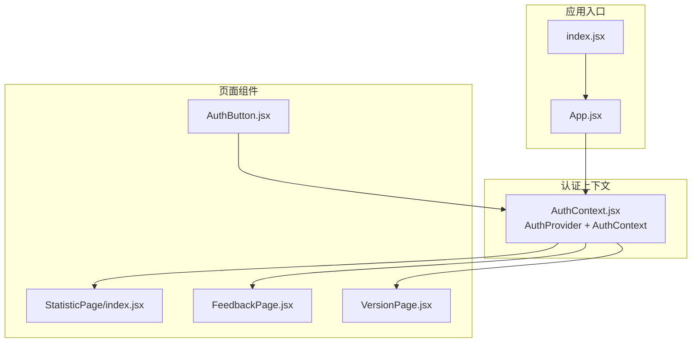
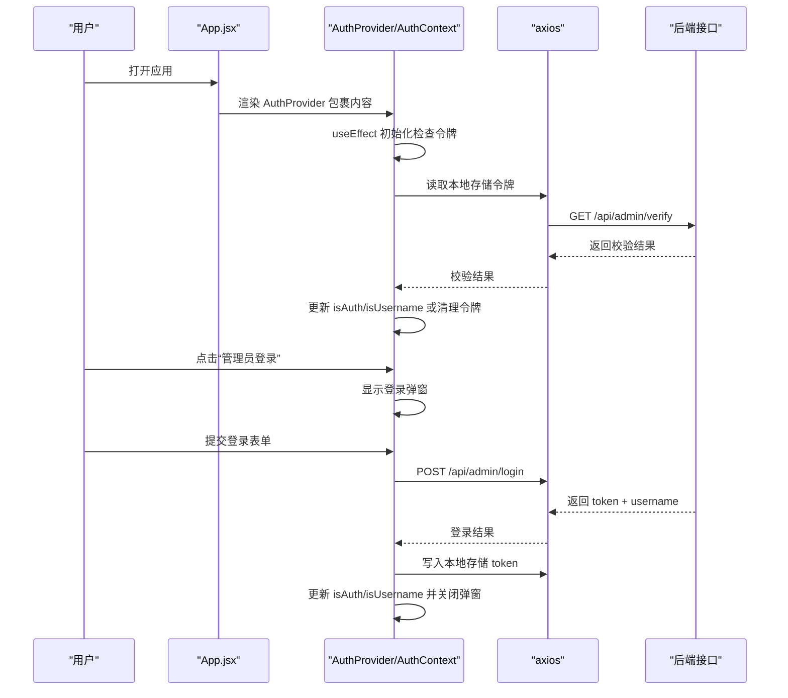
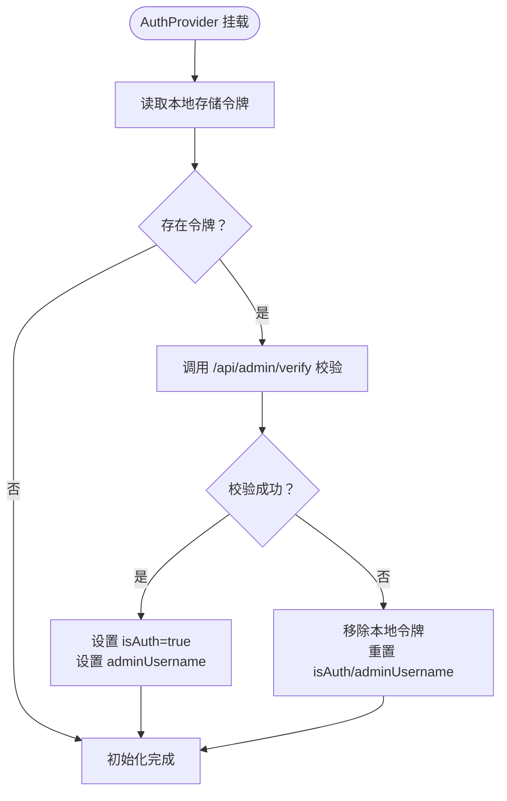
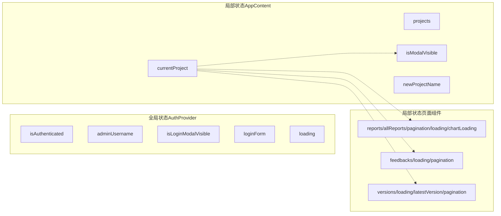
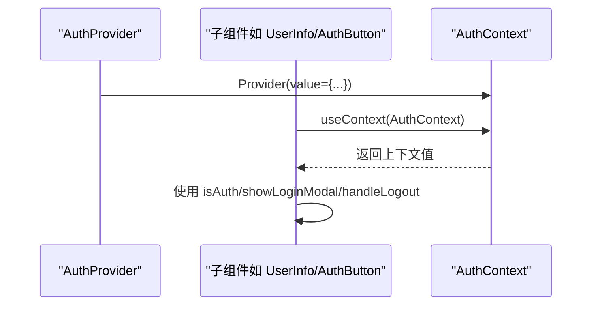
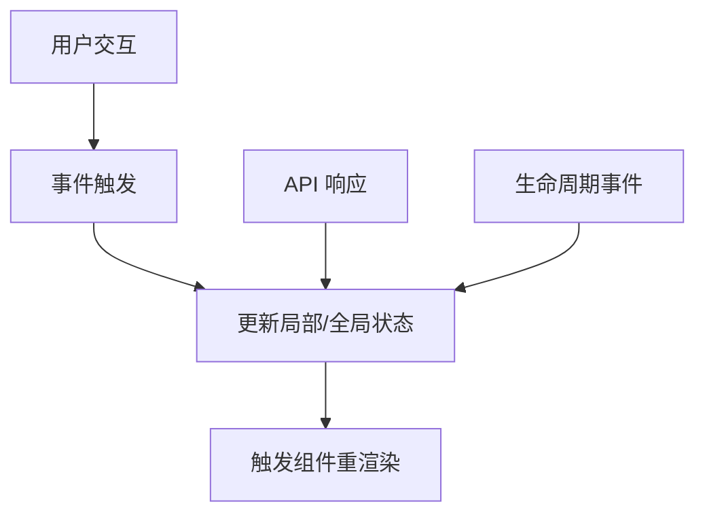
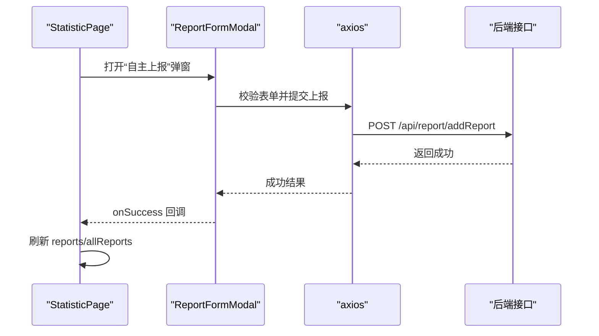
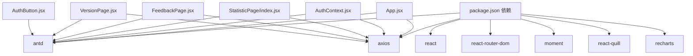

# 状态管理

<cite>
**本文引用的文件**
- [AuthContext.jsx](file://client/src/context/AuthContext.jsx)
- [App.jsx](file://client/src/App.jsx)
- [index.jsx](file://client/src/index.jsx)
- [AuthButton.jsx](file://client/src/components/AuthButton.jsx)
- [StatisticPage/index.jsx](file://client/src/pages/StatisticPage/index.jsx)
- [ReportFormModal.jsx](file://client/src/pages/StatisticPage/ReportFormModal.jsx)
- [ReportModal.jsx](file://client/src/pages/StatisticPage/ReportModal.jsx)
- [FeedbackPage.jsx](file://client/src/pages/FeedbackPage.jsx)
- [VersionPage.jsx](file://client/src/pages/VersionPage.jsx)
- [package.json](file://client/package.json)
- [README.md](file://README.md)
</cite>

## 目录
1. [简介](#简介)
2. [项目结构](#项目结构)
3. [核心组件](#核心组件)
4. [架构总览](#架构总览)
5. [详细组件分析](#详细组件分析)
6. [依赖关系分析](#依赖关系分析)
7. [性能考量](#性能考量)
8. [故障排查指南](#故障排查指南)
9. [结论](#结论)
10. [附录](#附录)

## 简介
本文件围绕 WoaX 前端的状态管理系统，系统性解析认证上下文 AuthContext 的实现机制，涵盖：
- useState/useEffect 的使用与生命周期绑定
- JWT 令牌的存储与校验流程
- 用户认证状态的维护与持久化
- 全局状态与局部状态的划分与职责边界
- Context API 的使用模式（Provider 包装与 useContext 消费）
- 状态更新的触发机制（用户交互、API 响应、生命周期事件）
- 状态管理最佳实践与性能优化建议

## 项目结构
客户端采用 React + Ant Design 架构，状态管理主要集中在上下文层与页面组件内：
- 上下文层：AuthContext 提供认证状态与登录弹窗控制
- 页面层：各功能页面（统计、反馈、版本）在自身组件内管理局部状态
- 应用入口：BrowserRouter 包裹 App，App 内部以 AuthProvider 包装应用内容

**图示来源**
- [index.jsx](file://client/src/index.jsx#L1-L15)
- [App.jsx](file://client/src/App.jsx#L245-L251)
- [AuthContext.jsx](file://client/src/context/AuthContext.jsx#L9-L155)
- [StatisticPage/index.jsx](file://client/src/pages/StatisticPage/index.jsx#L12-L262)
- [FeedbackPage.jsx](file://client/src/pages/FeedbackPage.jsx#L23-L496)
- [VersionPage.jsx](file://client/src/pages/VersionPage.jsx#L30-L890)
- [AuthButton.jsx](file://client/src/components/AuthButton.jsx#L12-L43)

**章节来源**
- [index.jsx](file://client/src/index.jsx#L1-L15)
- [App.jsx](file://client/src/App.jsx#L245-L251)
- [AuthContext.jsx](file://client/src/context/AuthContext.jsx#L9-L155)

## 核心组件
- AuthContext 与 AuthProvider：负责认证状态、登录弹窗、令牌校验与持久化
- App 与 AppContent：负责路由、菜单、项目选择、用户信息展示与全局弹窗
- 各页面组件：在自身范围内管理业务状态（如统计数据、反馈列表、版本列表等）

关键点：
- 认证状态：isAuthenticated、adminUsername
- 弹窗状态：isLoginModalVisible
- 表单状态：loginForm（由 Antd Form 提供）
- 加载状态：loading、chartLoading、userRecordsLoading 等
- 项目选择状态：projects、currentProject、localStorage 中的 currentProjectId

**章节来源**
- [AuthContext.jsx](file://client/src/context/AuthContext.jsx#L10-L155)
- [App.jsx](file://client/src/App.jsx#L62-L243)

## 架构总览
整体状态流如下：
- 初始化阶段：AuthProvider 在挂载时读取本地存储的令牌并调用后端校验接口
- 用户交互：点击“管理员登录”打开登录弹窗；登录成功后写入本地存储并更新认证状态
- 生命周期：AppContent 在挂载时获取项目列表并持久化当前项目；页面组件监听项目变化事件以刷新数据
- API 响应：登录、校验、项目列表、统计数据、反馈、版本等接口返回结果驱动状态更新
- 全局拦截：axios 请求拦截器自动附加 Bearer 令牌

**图示来源**
- [AuthContext.jsx](file://client/src/context/AuthContext.jsx#L17-L48)
- [AuthContext.jsx](file://client/src/context/AuthContext.jsx#L62-L92)
- [App.jsx](file://client/src/App.jsx#L18-L25)

**章节来源**
- [AuthContext.jsx](file://client/src/context/AuthContext.jsx#L17-L92)
- [App.jsx](file://client/src/App.jsx#L18-L25)

## 详细组件分析

### 认证上下文 AuthContext 实现机制
- 状态定义与初始化
  - 认证状态：isAuthenticated、adminUsername
  - 弹窗状态：isLoginModalVisible
  - 表单：loginForm（Antd Form 实例）
  - 加载状态：loading
- 生命周期与令牌校验
  - 组件挂载时读取本地存储令牌并调用后端校验接口
  - 校验成功：更新认证状态与用户名
  - 校验失败或异常：清理本地存储令牌并重置认证状态
- 登录流程
  - 表单校验 -> 调用登录接口 -> 成功后写入本地存储 -> 更新状态 -> 关闭弹窗 -> 成功提示
- 注销流程
  - 清理本地存储令牌 -> 重置认证状态 -> 成功提示
- Provider 暴露的上下文值
  - isAuth、adminUsername、showLoginModal、handleLogout

**图示来源**
- [AuthContext.jsx](file://client/src/context/AuthContext.jsx#L17-L48)

**章节来源**
- [AuthContext.jsx](file://client/src/context/AuthContext.jsx#L9-L155)

### 全局状态与局部状态的区分
- 全局状态（由 AuthProvider 管理）
  - 认证状态：isAuthenticated、adminUsername
  - 登录弹窗可见性：isLoginModalVisible
  - 登录表单实例：loginForm
  - 加载状态：loading
- 局部状态（由 AppContent 与页面组件管理）
  - AppContent 局部状态：projects、currentProject、isModalVisible、newProjectName
  - StatisticPage 局部状态：reports、allReports、pagination、loading、chartLoading、用户详情弹窗状态、报表弹窗状态
  - FeedbackPage 局部状态：feedbacks、loading、selectedFeedback、isModalVisible、isSubmitModalVisible、表单状态、分页状态
  - VersionPage 局部状态：versions、loading、latestVersion、loadingLatest、selectedVersion、isModalVisible、isSubmitModalVisible、文件列表、分页状态
- 项目选择状态的持久化
  - AppContent 在获取项目列表后，从 localStorage 读取上次选择的项目 ID，并在切换项目时写回
  - 页面组件监听 window.customEvent “projectChanged”，以响应项目切换并刷新数据

**图示来源**
- [App.jsx](file://client/src/App.jsx#L64-L126)
- [StatisticPage/index.jsx](file://client/src/pages/StatisticPage/index.jsx#L13-L31)
- [FeedbackPage.jsx](file://client/src/pages/FeedbackPage.jsx#L24-L43)
- [VersionPage.jsx](file://client/src/pages/VersionPage.jsx#L31-L46)

**章节来源**
- [App.jsx](file://client/src/App.jsx#L64-L126)
- [StatisticPage/index.jsx](file://client/src/pages/StatisticPage/index.jsx#L13-L31)
- [FeedbackPage.jsx](file://client/src/pages/FeedbackPage.jsx#L24-L43)
- [VersionPage.jsx](file://client/src/pages/VersionPage.jsx#L31-L46)

### Context API 的使用模式
- Provider 包装
  - App.jsx 顶层以 AuthProvider 包裹 AppContent，确保子树可消费认证上下文
- useContext 消费
  - App.jsx 中的 UserInfo 组件直接从 AuthContext 消费 isAuth、adminUsername、handleLogout、showLoginModal
  - AuthButton 组件消费 isAuth、showLoginModal，实现权限控制
- Provider 内部渲染
  - AuthProvider 在渲染 children 的同时，内嵌登录弹窗，避免额外的弹窗容器层级

**图示来源**
- [App.jsx](file://client/src/App.jsx#L28-L60)
- [AuthButton.jsx](file://client/src/components/AuthButton.jsx#L12-L43)
- [AuthContext.jsx](file://client/src/context/AuthContext.jsx#L107-L112)

**章节来源**
- [App.jsx](file://client/src/App.jsx#L28-L60)
- [AuthButton.jsx](file://client/src/components/AuthButton.jsx#L12-L43)
- [AuthContext.jsx](file://client/src/context/AuthContext.jsx#L107-L112)

### 状态更新的触发机制
- 用户交互
  - 登录按钮：showLoginModal 打开弹窗
  - 提交登录：handleLogin 校验表单并调用登录接口
  - 注销按钮：handleLogout 清理本地存储并重置状态
  - 项目切换：handleProjectChange 更新 currentProject 并写入 localStorage
- API 响应
  - 登录成功：写入 token，更新 isAuth 与 adminUsername
  - 校验失败：清理 token，重置 isAuth 与 adminUsername
  - 获取项目列表：根据返回数据设置 projects 与 currentProject
  - 页面数据：根据接口返回更新 reports、feedbacks、versions 等
- 生命周期事件
  - AppContent 挂载时获取项目列表
  - 页面组件挂载时监听项目变化事件，响应外部项目切换

**图示来源**
- [AuthContext.jsx](file://client/src/context/AuthContext.jsx#L51-L104)
- [App.jsx](file://client/src/App.jsx#L78-L126)
- [StatisticPage/index.jsx](file://client/src/pages/StatisticPage/index.jsx#L34-L55)

**章节来源**
- [AuthContext.jsx](file://client/src/context/AuthContext.jsx#L51-L104)
- [App.jsx](file://client/src/App.jsx#L78-L126)
- [StatisticPage/index.jsx](file://client/src/pages/StatisticPage/index.jsx#L34-L55)

### 页面组件中的状态管理
- StatisticPage
  - 局部状态：reports、allReports、pagination、loading、chartLoading、用户详情弹窗状态、报表弹窗状态
  - 项目变化监听：useEffect 监听 currentProject 与 window.customEvent，分别触发分页聚合与全量图表数据刷新
  - 自主上报：通过 ReportFormModal 与 ReportModal 协作，成功后刷新统计列表与图表数据
- FeedbackPage
  - 局部状态：feedbacks、loading、selectedFeedback、isModalVisible、isSubmitModalVisible、表单状态、分页状态
  - 项目变化监听：useEffect 监听 currentProject 与 window.customEvent，刷新反馈列表
  - 权限按钮：AuthButton 控制删除、提交反馈、回复等操作
- VersionPage
  - 局部状态：versions、loading、latestVersion、loadingLatest、selectedVersion、isModalVisible、isSubmitModalVisible、文件列表、分页状态
  - 项目变化监听：useEffect 监听 currentProject 与 window.customEvent，刷新版本列表与最新版本信息
  - 文件上传：支持安装包与描述文件上传，发布新版本后刷新列表与最新版本

**图示来源**
- [StatisticPage/index.jsx](file://client/src/pages/StatisticPage/index.jsx#L180-L196)
- [ReportFormModal.jsx](file://client/src/pages/StatisticPage/ReportFormModal.jsx#L15-L38)

**章节来源**
- [StatisticPage/index.jsx](file://client/src/pages/StatisticPage/index.jsx#L12-L262)
- [ReportFormModal.jsx](file://client/src/pages/StatisticPage/ReportFormModal.jsx#L5-L107)
- [ReportModal.jsx](file://client/src/pages/StatisticPage/ReportModal.jsx#L4-L51)
- [FeedbackPage.jsx](file://client/src/pages/FeedbackPage.jsx#L23-L496)
- [VersionPage.jsx](file://client/src/pages/VersionPage.jsx#L30-L890)

## 依赖关系分析
- 依赖技术栈
  - React Hooks（useState、useEffect、useContext）、Ant Design（Modal、Form、Button 等）、Axios（HTTP 请求）、React Router（路由）
- 关键依赖关系
  - App.jsx 依赖 AuthContext（useContext），并配置 axios 请求拦截器自动附加 Bearer 令牌
  - AuthContext.jsx 依赖 axios 进行登录与校验，依赖 Antd Modal/Form/Button 进行登录弹窗与表单
  - 页面组件依赖 Antd 组件与 axios 进行业务数据交互
  - AuthButton 作为权限控制组件，依赖 AuthContext

**图示来源**
- [package.json](file://client/package.json#L5-L18)
- [App.jsx](file://client/src/App.jsx#L1-L11)
- [AuthContext.jsx](file://client/src/context/AuthContext.jsx#L1-L3)
- [StatisticPage/index.jsx](file://client/src/pages/StatisticPage/index.jsx#L1-L8)
- [FeedbackPage.jsx](file://client/src/pages/FeedbackPage.jsx#L1-L18)
- [VersionPage.jsx](file://client/src/pages/VersionPage.jsx#L1-L28)
- [AuthButton.jsx](file://client/src/components/AuthButton.jsx#L1-L4)

**章节来源**
- [package.json](file://client/package.json#L5-L18)
- [App.jsx](file://client/src/App.jsx#L1-L11)
- [AuthContext.jsx](file://client/src/context/AuthContext.jsx#L1-L3)

## 性能考量
- 减少不必要的重渲染
  - 将只读状态与函数值稳定化，避免在渲染过程中创建新的对象/函数导致子组件重渲染
  - 对于频繁使用的回调，可在父组件使用 useMemo/useCallback 缓存（建议在后续优化中引入）
- 本地存储与网络请求
  - 令牌校验仅在应用启动时执行一次，避免重复请求
  - 项目选择状态写入 localStorage，减少重复请求
- 分页与大数据
  - 图表全量数据采用较大分页，避免一次性渲染过多数据
  - 表格分页使用 Antd 的分页控件，按需加载
- 请求拦截器
  - axios 请求拦截器统一注入 Bearer 令牌，避免每个请求手动拼接，提升一致性与可维护性

[本节为通用性能建议，不直接分析具体文件，故无章节来源]

## 故障排查指南
- 登录失败
  - 检查登录表单校验规则与接口返回消息
  - 确认后端登录接口返回的 token 与 username 是否正确写入本地存储
- 令牌失效
  - 校验接口返回失败或抛错时，会自动清理本地存储令牌并重置认证状态
  - 若出现“未授权”错误，检查请求拦截器是否正确附加 Bearer 令牌
- 项目选择异常
  - 确认 localStorage 中的 currentProjectId 是否存在且有效
  - 页面组件监听的 window.customEvent 是否被正确派发与移除
- 页面数据不刷新
  - 确认页面组件是否监听了 currentProject 与 window.customEvent
  - 确认项目切换时是否派发了 projectChanged 事件

**章节来源**
- [AuthContext.jsx](file://client/src/context/AuthContext.jsx#L42-L48)
- [AuthContext.jsx](file://client/src/context/AuthContext.jsx#L62-L92)
- [App.jsx](file://client/src/App.jsx#L119-L126)
- [StatisticPage/index.jsx](file://client/src/pages/StatisticPage/index.jsx#L34-L55)

## 结论
WoaX 前端通过 Context API 将认证状态集中管理，结合 useState/useEffect 实现令牌校验与持久化，配合 Antd 组件与 axios 完成用户交互与数据请求。项目选择状态采用全局与局部相结合的方式：全局通过 AuthProvider 管理认证与弹窗，局部在 AppContent 与页面组件内管理各自业务状态。整体架构清晰、职责明确，具备良好的扩展性与可维护性。建议后续引入 useMemo/useCallback 与更细粒度的状态拆分，进一步优化性能与可测试性。

[本节为总结性内容，不直接分析具体文件，故无章节来源]

## 附录
- 默认管理员账号：用户名 admin，密码 admin123
- 代理配置：前端通过 package.json 中 proxy 指向后端服务端口

**章节来源**
- [README.md](file://README.md#L44-L44)
- [package.json](file://client/package.json#L43-L43)