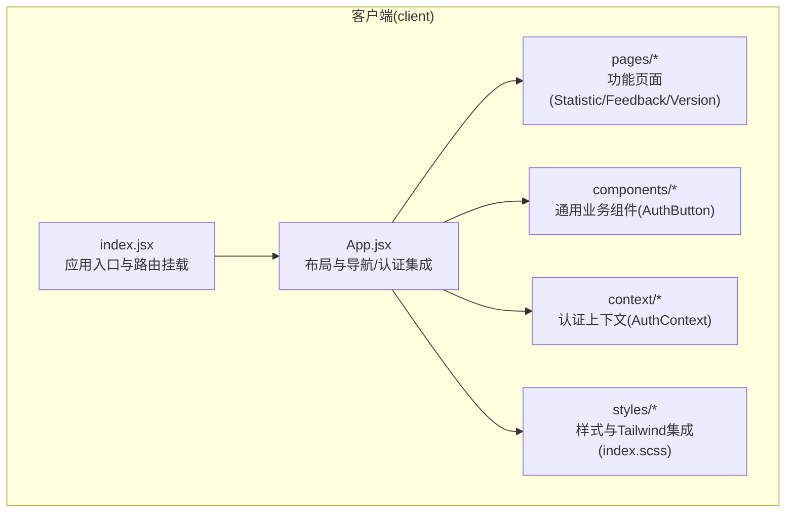
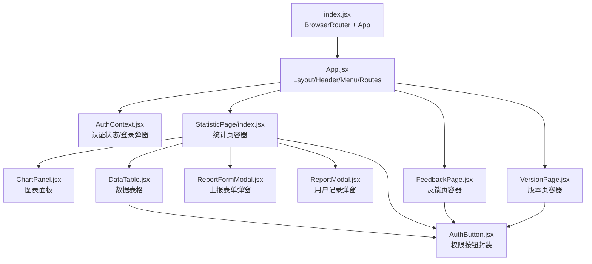
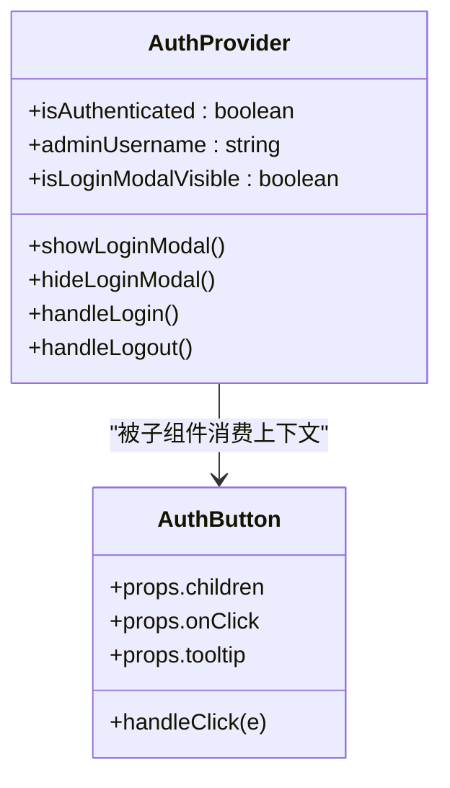
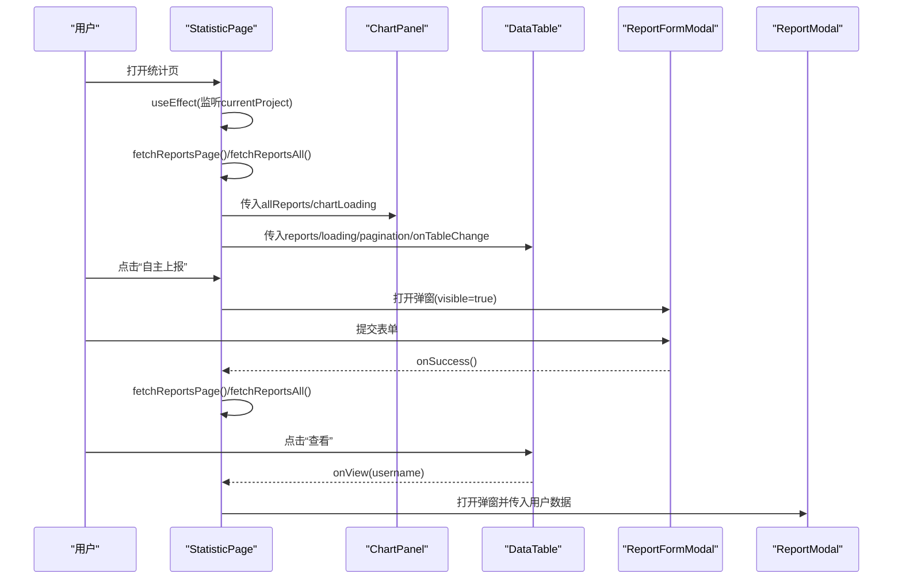
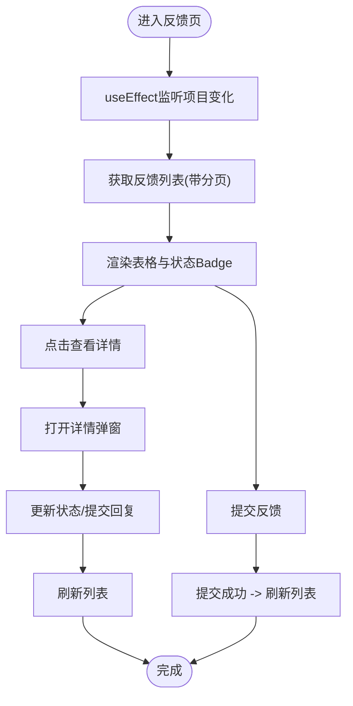
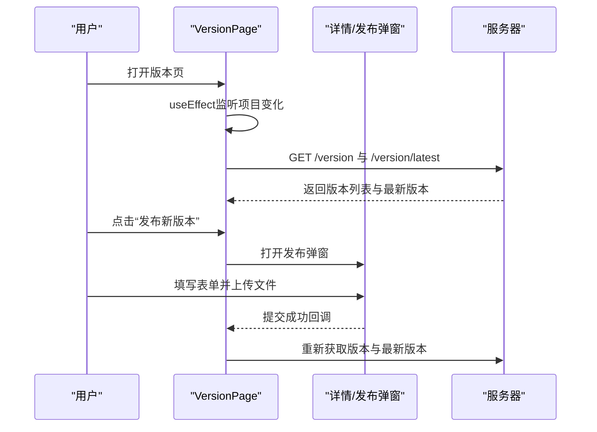
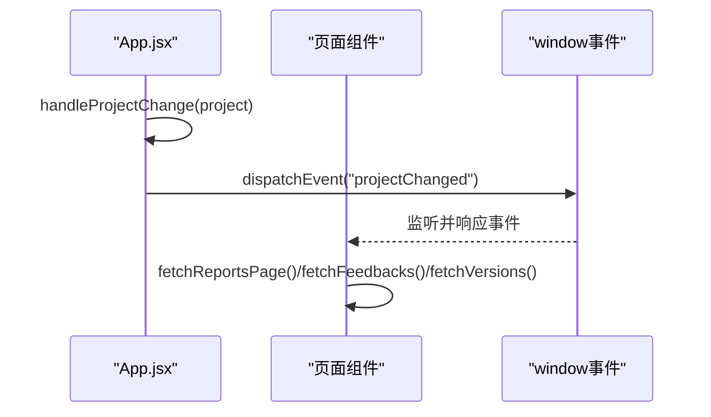
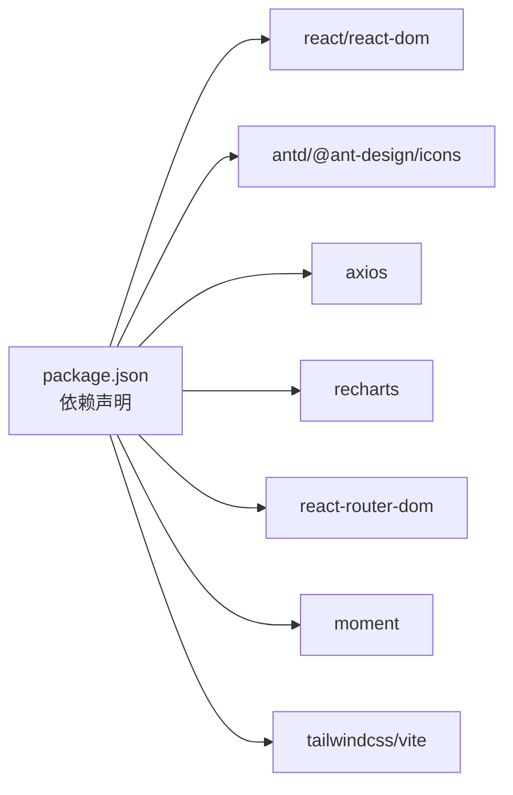

# 组件系统

<cite>
**本文引用的文件**
- [App.jsx](file://client/src/App.jsx)
- [index.jsx](file://client/src/index.jsx)
- [AuthContext.jsx](file://client/src/context/AuthContext.jsx)
- [AuthButton.jsx](file://client/src/components/AuthButton.jsx)
- [StatisticPage/index.jsx](file://client/src/pages/StatisticPage/index.jsx)
- [ChartPanel.jsx](file://client/src/pages/StatisticPage/ChartPanel.jsx)
- [DataTable.jsx](file://client/src/pages/StatisticPage/DataTable.jsx)
- [ReportFormModal.jsx](file://client/src/pages/StatisticPage/ReportFormModal.jsx)
- [ReportModal.jsx](file://client/src/pages/StatisticPage/ReportModal.jsx)
- [FeedbackPage.jsx](file://client/src/pages/FeedbackPage.jsx)
- [VersionPage.jsx](file://client/src/pages/VersionPage.jsx)
- [index.scss](file://client/src/styles/index.scss)
- [package.json](file://client/package.json)
- [README.md](file://README.md)
</cite>

## 目录
1. [简介](#简介)
2. [项目结构](#项目结构)
3. [核心组件](#核心组件)
4. [架构总览](#架构总览)
5. [组件详解](#组件详解)
6. [依赖关系分析](#依赖关系分析)
7. [性能考量](#性能考量)
8. [故障排查指南](#故障排查指南)
9. [结论](#结论)
10. [附录](#附录)

## 简介
本文件面向WoaX前端组件系统，系统性梳理基于React + Ant Design的组件设计与实现，覆盖函数组件模式、Props传递、组件复用、UI封装与样式定制、生命周期管理、组件间通信、以及最佳实践。文档同时结合仓库现有代码，给出架构图、流程图与类图，帮助开发者快速理解与扩展。

## 项目结构
客户端采用按功能域划分的目录组织：页面组件位于pages目录，通用业务组件位于components目录，全局上下文位于context目录，样式统一在styles目录，入口在index.jsx中挂载路由与应用根组件。

**图表来源**
- [index.jsx](file://client/src/index.jsx#L1-L15)
- [App.jsx](file://client/src/App.jsx#L1-L253)
- [AuthContext.jsx](file://client/src/context/AuthContext.jsx#L1-L155)
- [AuthButton.jsx](file://client/src/components/AuthButton.jsx#L1-L43)
- [StatisticPage/index.jsx](file://client/src/pages/StatisticPage/index.jsx#L1-L262)
- [FeedbackPage.jsx](file://client/src/pages/FeedbackPage.jsx#L1-L496)
- [VersionPage.jsx](file://client/src/pages/VersionPage.jsx#L1-L890)
- [index.scss](file://client/src/styles/index.scss#L1-L36)

**章节来源**
- [index.jsx](file://client/src/index.jsx#L1-L15)
- [App.jsx](file://client/src/App.jsx#L1-L253)
- [README.md](file://README.md#L1-L44)

## 核心组件
- 应用根组件与布局：App.jsx负责全局布局、菜单、头部用户信息、路由与弹窗管理；通过AuthProvider包裹，向子树注入认证上下文。
- 认证上下文：AuthContext.jsx提供登录/登出、令牌校验、登录弹窗控制等能力，形成跨组件的认证状态中心。
- 权限按钮：AuthButton.jsx对Ant Design按钮进行二次封装，统一处理未登录态的提示与拦截，复用权限控制逻辑。
- 页面组件：
  - StatisticPage：数据统计页，组合ChartPanel、DataTable、ReportFormModal、ReportModal等子组件。
  - FeedbackPage：意见反馈页，表格、详情弹窗、富文本回复、状态管理。
  - VersionPage：版本管理页，表格、详情弹窗、文件上传、状态与更新方式管理。
- 图表与表格：ChartPanel基于Recharts展示多维统计；DataTable基于Ant Design Table承载数据与分页交互。
- 样式：index.scss引入Tailwind并覆盖基础样式，确保一致的视觉与排版。

**章节来源**
- [App.jsx](file://client/src/App.jsx#L1-L253)
- [AuthContext.jsx](file://client/src/context/AuthContext.jsx#L1-L155)
- [AuthButton.jsx](file://client/src/components/AuthButton.jsx#L1-L43)
- [StatisticPage/index.jsx](file://client/src/pages/StatisticPage/index.jsx#L1-L262)
- [ChartPanel.jsx](file://client/src/pages/StatisticPage/ChartPanel.jsx#L1-L129)
- [DataTable.jsx](file://client/src/pages/StatisticPage/DataTable.jsx#L1-L124)
- [ReportFormModal.jsx](file://client/src/pages/StatisticPage/ReportFormModal.jsx#L1-L107)
- [ReportModal.jsx](file://client/src/pages/StatisticPage/ReportModal.jsx#L1-L51)
- [FeedbackPage.jsx](file://client/src/pages/FeedbackPage.jsx#L1-L496)
- [VersionPage.jsx](file://client/src/pages/VersionPage.jsx#L1-L890)
- [index.scss](file://client/src/styles/index.scss#L1-L36)

## 架构总览
整体采用“布局容器 + 页面组件 + 业务组件 + 上下文”的分层结构。认证上下文贯穿全局，页面组件通过Props向下传递数据与回调，子组件通过事件回调向上汇报状态变更。

**图表来源**
- [index.jsx](file://client/src/index.jsx#L1-L15)
- [App.jsx](file://client/src/App.jsx#L1-L253)
- [AuthContext.jsx](file://client/src/context/AuthContext.jsx#L1-L155)
- [StatisticPage/index.jsx](file://client/src/pages/StatisticPage/index.jsx#L1-L262)
- [ChartPanel.jsx](file://client/src/pages/StatisticPage/ChartPanel.jsx#L1-L129)
- [DataTable.jsx](file://client/src/pages/StatisticPage/DataTable.jsx#L1-L124)
- [ReportFormModal.jsx](file://client/src/pages/StatisticPage/ReportFormModal.jsx#L1-L107)
- [ReportModal.jsx](file://client/src/pages/StatisticPage/ReportModal.jsx#L1-L51)
- [FeedbackPage.jsx](file://client/src/pages/FeedbackPage.jsx#L1-L496)
- [VersionPage.jsx](file://client/src/pages/VersionPage.jsx#L1-L890)
- [AuthButton.jsx](file://client/src/components/AuthButton.jsx#L1-L43)

## 组件详解

### 认证上下文与权限按钮
- 认证上下文职责：初始化时读取本地令牌并校验；提供登录弹窗显隐、登录/登出、状态暴露；在请求拦截器中自动附加Authorization头。
- 权限按钮：在未登录时以禁用态与提示图标呈现，点击触发登录弹窗；已登录时透传原生点击事件，实现统一的权限守卫。

**图表来源**
- [AuthContext.jsx](file://client/src/context/AuthContext.jsx#L1-L155)
- [AuthButton.jsx](file://client/src/components/AuthButton.jsx#L1-L43)

**章节来源**
- [AuthContext.jsx](file://client/src/context/AuthContext.jsx#L1-L155)
- [AuthButton.jsx](file://client/src/components/AuthButton.jsx#L1-L43)
- [App.jsx](file://client/src/App.jsx#L18-L25)

### 数据统计页（容器组件）
- 负责聚合数据：分页列表与全量图表数据的双通道获取；监听项目切换事件，联动刷新。
- 子组件协作：ChartPanel负责可视化，DataTable负责表格与分页，ReportFormModal负责自主上报，ReportModal负责用户记录查看。
- 项目级状态：通过App.jsx提供的currentProject作为数据源，实现跨页面共享。

**图表来源**
- [StatisticPage/index.jsx](file://client/src/pages/StatisticPage/index.jsx#L1-L262)
- [ChartPanel.jsx](file://client/src/pages/StatisticPage/ChartPanel.jsx#L1-L129)
- [DataTable.jsx](file://client/src/pages/StatisticPage/DataTable.jsx#L1-L124)
- [ReportFormModal.jsx](file://client/src/pages/StatisticPage/ReportFormModal.jsx#L1-L107)
- [ReportModal.jsx](file://client/src/pages/StatisticPage/ReportModal.jsx#L1-L51)

**章节来源**
- [StatisticPage/index.jsx](file://client/src/pages/StatisticPage/index.jsx#L1-L262)
- [ChartPanel.jsx](file://client/src/pages/StatisticPage/ChartPanel.jsx#L1-L129)
- [DataTable.jsx](file://client/src/pages/StatisticPage/DataTable.jsx#L1-L124)
- [ReportFormModal.jsx](file://client/src/pages/StatisticPage/ReportFormModal.jsx#L1-L107)
- [ReportModal.jsx](file://client/src/pages/StatisticPage/ReportModal.jsx#L1-L51)

### 意见反馈页
- 表格与分页：支持分页参数与onChange回调；状态Badge渲染不同状态。
- 详情弹窗：展示反馈详情，支持状态切换与富文本回复；通过AuthButton守卫敏感操作。
- 提交反馈：独立弹窗，绑定表单并提交至后端。

**图表来源**
- [FeedbackPage.jsx](file://client/src/pages/FeedbackPage.jsx#L1-L496)

**章节来源**
- [FeedbackPage.jsx](file://client/src/pages/FeedbackPage.jsx#L1-L496)

### 版本更新页
- 表格与分页：展示版本号、描述、文件名、大小、发布时间、状态、更新方式。
- 详情弹窗：支持编辑版本号/描述/状态/更新方式；“设为最新”“删除”等操作由AuthButton守卫。
- 发布新版本：拖拽上传安装包与描述文件，支持更新方式与文件重命名选项。

**图表来源**
- [VersionPage.jsx](file://client/src/pages/VersionPage.jsx#L1-L890)

**章节来源**
- [VersionPage.jsx](file://client/src/pages/VersionPage.jsx#L1-L890)

### 组件间通信
- 父子通信：App.jsx通过Props向各页面组件传递currentProject；页面组件再向下传递给子组件（如DataTable、ChartPanel）。
- 兄弟/跨层级通信：通过window自定义事件“projectChanged”实现跨层级数据同步；页面组件在useEffect中监听该事件，触发数据刷新。
- 上下文通信：AuthContext提供isAuthenticated/adminUsername等状态，子组件通过useContext消费，避免层层传递。

**图表来源**
- [App.jsx](file://client/src/App.jsx#L120-L126)
- [StatisticPage/index.jsx](file://client/src/pages/StatisticPage/index.jsx#L44-L55)
- [FeedbackPage.jsx](file://client/src/pages/FeedbackPage.jsx#L54-L64)
- [VersionPage.jsx](file://client/src/pages/VersionPage.jsx#L59-L70)

**章节来源**
- [App.jsx](file://client/src/App.jsx#L120-L126)
- [StatisticPage/index.jsx](file://client/src/pages/StatisticPage/index.jsx#L44-L55)
- [FeedbackPage.jsx](file://client/src/pages/FeedbackPage.jsx#L54-L64)
- [VersionPage.jsx](file://client/src/pages/VersionPage.jsx#L59-L70)

### 生命周期管理
- 初始化：App.jsx在useEffect中获取项目列表并持久化；页面组件在useEffect中监听currentProject与“projectChanged”事件，首次加载数据。
- 更新：页面组件通过onTableChange/onPageChange等回调触发重新请求；弹窗关闭后重置表单；登录成功后刷新上下文状态。
- 销毁：页面组件在卸载时移除window事件监听，避免内存泄漏。

**章节来源**
- [App.jsx](file://client/src/App.jsx#L77-L118)
- [StatisticPage/index.jsx](file://client/src/pages/StatisticPage/index.jsx#L33-L55)
- [FeedbackPage.jsx](file://client/src/pages/FeedbackPage.jsx#L45-L64)
- [VersionPage.jsx](file://client/src/pages/VersionPage.jsx#L48-L70)

### UI组件封装与样式定制
- Ant Design集成：广泛使用Layout、Menu、Dropdown、Button、Table、Modal、Form、Upload、Badge、Descriptions等组件，统一风格与交互。
- 自定义组件：
  - AuthButton：在AntD Button基础上增加未登录拦截与提示，复用权限控制。
  - ChartPanel：对Recharts进行数据准备与容器封装，提供响应式图表。
  - DataTable：在AntD Table上定制列宽、滚动、Tooltip与AuthButton按钮。
- 样式定制：index.scss引入Tailwind，覆盖基础样式与Header/Logo尺寸；页面内通过内联样式或Tailwind类微调布局。

**章节来源**
- [AuthButton.jsx](file://client/src/components/AuthButton.jsx#L1-L43)
- [ChartPanel.jsx](file://client/src/pages/StatisticPage/ChartPanel.jsx#L1-L129)
- [DataTable.jsx](file://client/src/pages/StatisticPage/DataTable.jsx#L1-L124)
- [index.scss](file://client/src/styles/index.scss#L1-L36)

## 依赖关系分析
- 前端依赖：React、Ant Design、Axios、Recharts、React Router、Moment、TailwindCSS等。
- 运行时依赖：Vite构建工具，代理到后端3001端口，便于前后端联调。
- 组件耦合：页面组件与业务组件松耦合，通过Props与上下文解耦；AuthContext提供集中式认证状态，降低重复逻辑。

**图表来源**
- [package.json](file://client/package.json#L1-L47)

**章节来源**
- [package.json](file://client/package.json#L1-L47)

## 性能考量
- 请求拦截与缓存：在App.jsx中统一注入Authorization头，减少重复鉴权逻辑；建议在页面组件中对相同查询做去抖/节流与缓存。
- 列表渲染：DataTable设置固定列宽与滚动，避免表格重排；ChartPanel仅在有数据时渲染图表，空态显示Spin。
- 弹窗与表单：弹窗关闭时重置表单，减少无效渲染；Modal按需打开，避免常驻DOM。
- 事件清理：页面组件在卸载时移除window事件监听，防止内存泄漏。
- 样式体积：Tailwind按需引入，避免无用类导致体积膨胀。

[本节为通用指导，无需特定文件引用]

## 故障排查指南
- 登录失败/令牌失效：检查AuthContext中verifyToken与handleLogin流程，确认后端接口与本地存储键值。
- 项目切换无效：确认App.jsx中dispatchEvent与页面组件的addEventListener/removeEventListener配对。
- 表单校验失败：检查Form.useForm与validateFields调用时机，确保在提交前完成校验。
- 下载文件名乱码：VersionPage中提供文件名修复逻辑，可参考fixChineseFileName与URL下载流程。
- Axios错误：统一捕获异常并提示，注意区分网络错误与业务错误。

**章节来源**
- [AuthContext.jsx](file://client/src/context/AuthContext.jsx#L24-L48)
- [App.jsx](file://client/src/App.jsx#L120-L126)
- [VersionPage.jsx](file://client/src/pages/VersionPage.jsx#L319-L349)

## 结论
WoaX前端组件系统以函数组件为核心，结合Ant Design与Recharts实现高复用的UI与数据可视化；通过AuthContext集中管理认证状态，配合AuthButton实现统一的权限守卫；页面组件通过Props与上下文进行解耦通信，辅以window事件实现跨层级联动。整体结构清晰、职责明确，具备良好的扩展性与维护性。

[本节为总结，无需特定文件引用]

## 附录

### 组件命名规范与代码组织建议
- 文件命名：页面组件使用PascalCase，如StatisticPage/index.jsx；通用业务组件使用名词短语，如AuthButton.jsx。
- 目录组织：按功能域划分pages、components、context、styles；公共样式集中于styles目录。
- Props约定：以“数据+回调”形式传递，如data、loading、pagination、onTableChange等，保持接口稳定。
- 上下文使用：仅在跨层级共享状态时使用，避免过度使用导致耦合。

[本节为通用指导，无需特定文件引用]