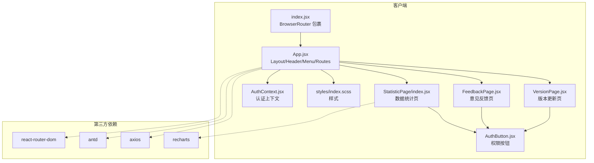
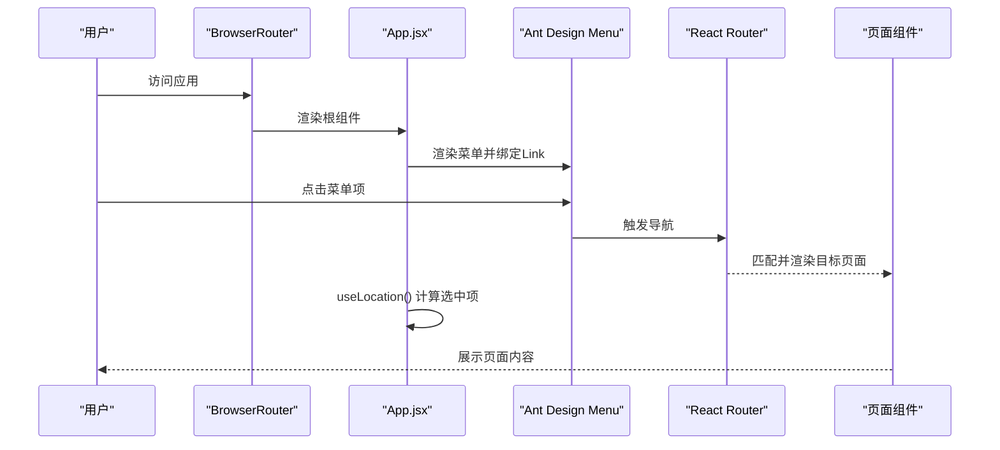
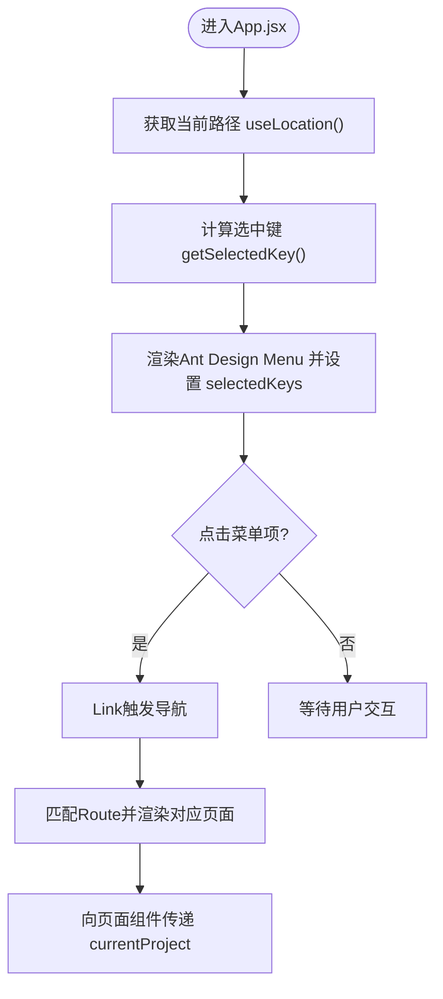
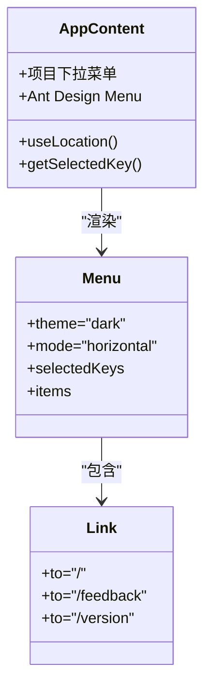
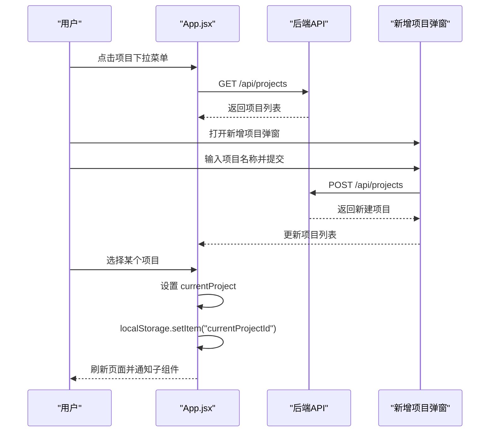
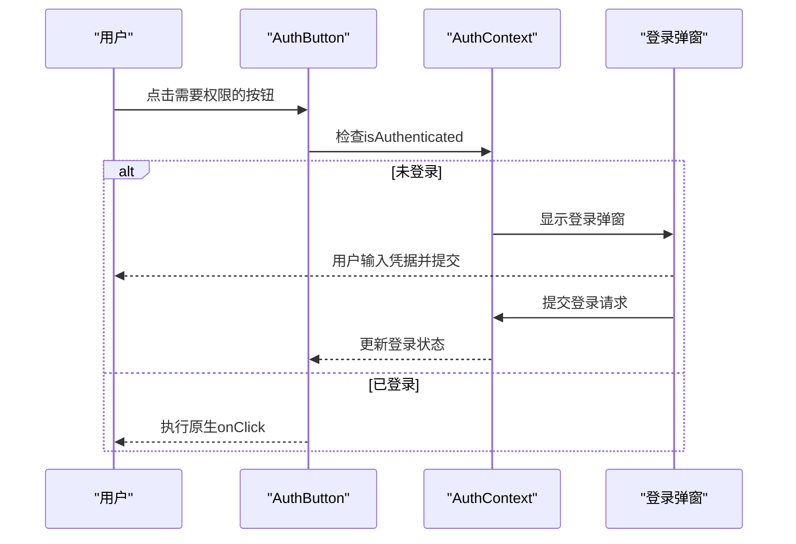
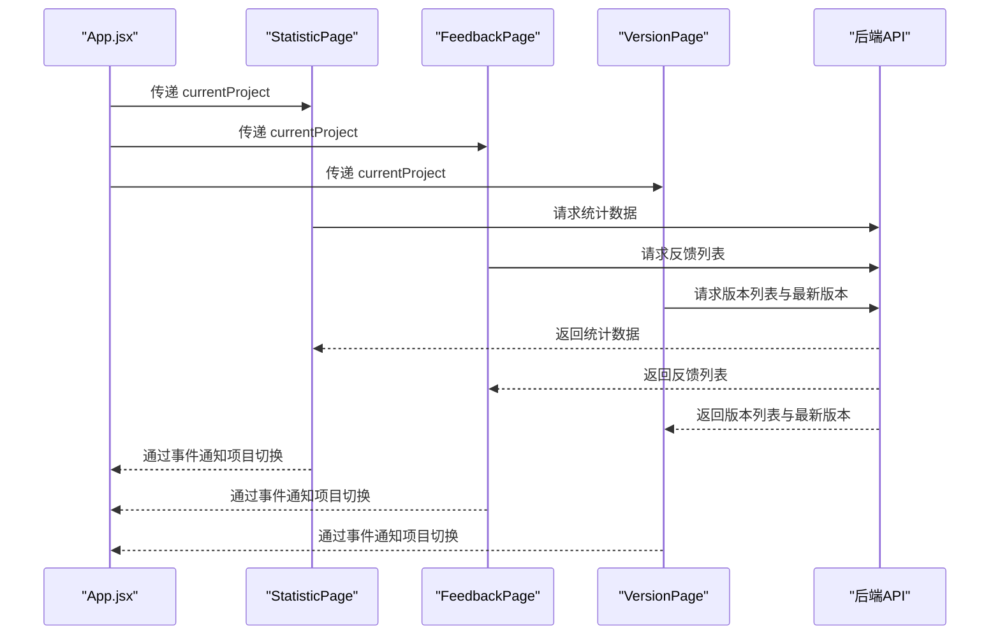
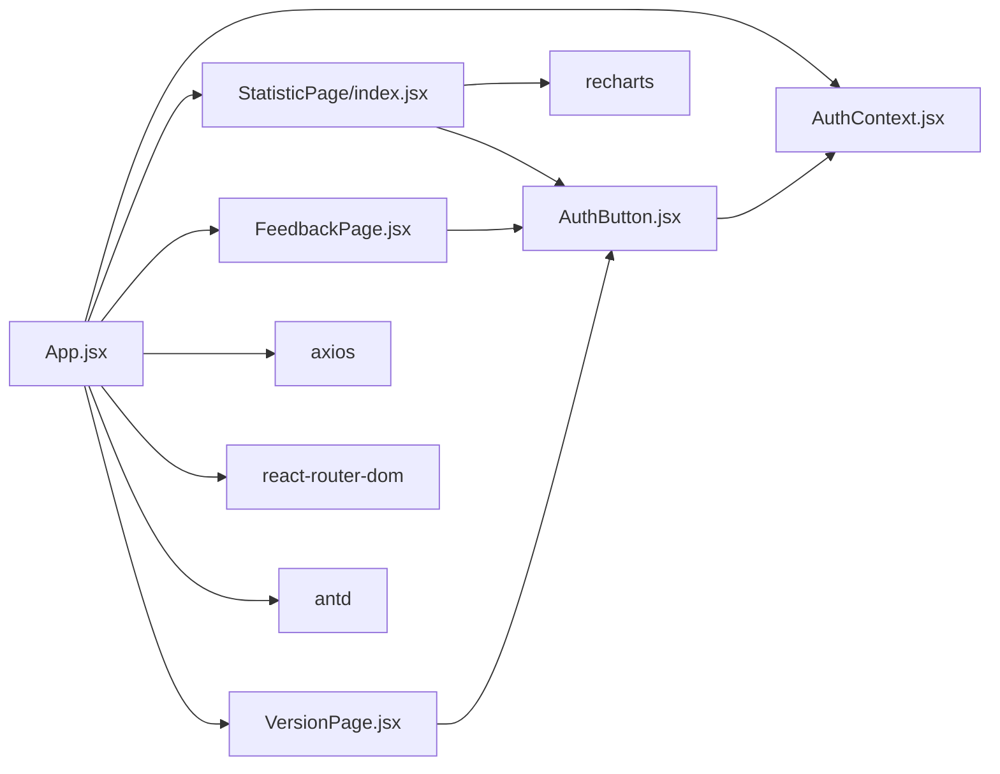

# 路由与导航

<cite>
**本文引用的文件**
- [App.jsx](file://client/src/App.jsx)
- [index.jsx](file://client/src/index.jsx)
- [AuthContext.jsx](file://client/src/context/AuthContext.jsx)
- [AuthButton.jsx](file://client/src/components/AuthButton.jsx)
- [StatisticPage/index.jsx](file://client/src/pages/StatisticPage/index.jsx)
- [FeedbackPage.jsx](file://client/src/pages/FeedbackPage.jsx)
- [VersionPage.jsx](file://client/src/pages/VersionPage.jsx)
- [ChartPanel.jsx](file://client/src/pages/StatisticPage/ChartPanel.jsx)
- [DataTable.jsx](file://client/src/pages/StatisticPage/DataTable.jsx)
- [ReportFormModal.jsx](file://client/src/pages/StatisticPage/ReportFormModal.jsx)
- [ReportModal.jsx](file://client/src/pages/StatisticPage/ReportModal.jsx)
- [index.scss](file://client/src/styles/index.scss)
- [package.json](file://client/package.json)
- [README.md](file://README.md)
</cite>

## 目录
1. [简介](#简介)
2. [项目结构](#项目结构)
3. [核心组件](#核心组件)
4. [架构总览](#架构总览)
5. [详细组件分析](#详细组件分析)
6. [依赖关系分析](#依赖关系分析)
7. [性能考量](#性能考量)
8. [故障排查指南](#故障排查指南)
9. [结论](#结论)
10. [附录](#附录)

## 简介
本文件面向WoaX前端路由与导航系统，围绕React Router在本项目中的配置与使用、Ant Design菜单与导航、路由状态管理（当前路由跟踪、菜单高亮、面包屑）、项目切换机制（下拉菜单、选择逻辑、状态持久化）以及权限控制与路由守卫的实现方案进行深入说明。文档同时提供可视化图示与可操作建议，帮助开发者快速理解与维护该系统。

## 项目结构
客户端采用Vite构建，入口在index.jsx中包裹BrowserRouter，App.jsx作为根组件负责全局布局、菜单与路由容器；页面组件按功能模块划分在pages目录下，权限控制通过AuthContext与AuthButton实现。

**图表来源**
- [index.jsx](file://client/src/index.jsx#L1-L15)
- [App.jsx](file://client/src/App.jsx#L1-L253)
- [AuthContext.jsx](file://client/src/context/AuthContext.jsx#L1-L155)
- [AuthButton.jsx](file://client/src/components/AuthButton.jsx#L1-L43)
- [StatisticPage/index.jsx](file://client/src/pages/StatisticPage/index.jsx#L1-L262)
- [FeedbackPage.jsx](file://client/src/pages/FeedbackPage.jsx#L1-L496)
- [VersionPage.jsx](file://client/src/pages/VersionPage.jsx#L1-L890)
- [index.scss](file://client/src/styles/index.scss#L1-L36)
- [package.json](file://client/package.json#L1-L47)

**章节来源**
- [index.jsx](file://client/src/index.jsx#L1-L15)
- [package.json](file://client/package.json#L1-L47)

## 核心组件
- 路由容器与入口
  - BrowserRouter包裹于index.jsx，确保整个应用具备路由能力。
  - App.jsx作为根组件，内部使用Routes与Route定义页面映射，并通过useLocation实现菜单高亮。
- 导航菜单
  - Ant Design Menu组件承载顶部横向导航，使用Link组件实现无刷新跳转。
  - 通过selectedKeys动态计算当前选中项，实现菜单高亮。
- 项目切换
  - 顶部Header区域提供项目下拉菜单，支持新增项目、持久化选择结果至localStorage。
- 权限控制
  - AuthContext提供登录态与令牌校验；AuthButton封装权限按钮行为，未登录时触发登录弹窗。
- 页面组件
  - StatisticPage、FeedbackPage、VersionPage分别对应三个路由路径，均接收currentProject作为参数，实现跨组件数据联动。

**章节来源**
- [index.jsx](file://client/src/index.jsx#L1-L15)
- [App.jsx](file://client/src/App.jsx#L1-L253)
- [AuthContext.jsx](file://client/src/context/AuthContext.jsx#L1-L155)
- [AuthButton.jsx](file://client/src/components/AuthButton.jsx#L1-L43)

## 架构总览
下图展示从浏览器到页面组件的数据流与交互路径，突出路由容器、菜单高亮、项目切换与权限控制的关键节点。

**图表来源**
- [index.jsx](file://client/src/index.jsx#L1-L15)
- [App.jsx](file://client/src/App.jsx#L62-L195)
- [StatisticPage/index.jsx](file://client/src/pages/StatisticPage/index.jsx#L12-L42)

## 详细组件分析

### 路由容器与页面映射
- Routes容器与Route定义
  - 在App.jsx中，Routes内包含三条Route规则，分别指向数据统计、意见反馈、版本更新页面，并将currentProject作为属性传递给各页面组件。
- Link导航组件
  - 菜单项的label使用Ant Design的Link组件，实现无刷新跳转。
- 路由状态管理
  - 通过useLocation获取当前路径，结合getSelectedKey方法计算selectedKeys，实现菜单高亮。
- 面包屑导航
  - 当前实现未包含面包屑组件，可在App.jsx或页面组件中扩展，基于location.pathname与静态路由配置生成层级路径。

**图表来源**
- [App.jsx](file://client/src/App.jsx#L62-L195)

**章节来源**
- [App.jsx](file://client/src/App.jsx#L213-L217)
- [App.jsx](file://client/src/App.jsx#L69-L75)

### 导航菜单设计与响应式布局
- 菜单配置
  - Menu组件采用horizontal模式，主题为dark，items数组包含三个菜单项，分别对应三个路由路径。
  - 每个菜单项使用Ant Design的Link组件包裹label，实现导航。
- 图标使用
  - 使用@ant-design/icons中的DatabaseOutlined、CommentOutlined、CloudUploadOutlined分别对应“数据统计”、“意见反馈”、“版本更新”。
- 响应式布局
  - Header使用flex布局，Logo、项目下拉菜单、菜单、用户信息/登录按钮按顺序排列。
  - 样式通过index.scss控制，Header高度、Logo宽度、间距等均有明确设置。

**图表来源**
- [App.jsx](file://client/src/App.jsx#L173-L195)

**章节来源**
- [App.jsx](file://client/src/App.jsx#L173-L195)
- [index.scss](file://client/src/styles/index.scss#L25-L36)

### 项目切换机制
- 项目下拉菜单
  - 通过Dropdown与Ant Design Button实现项目选择，菜单项来源于后端接口获取的项目列表。
- 项目选择逻辑
  - 选择项目后，更新currentProject状态并持久化到localStorage；同时通过自定义事件通知子组件刷新数据。
- 状态持久化
  - 首次加载时尝试读取localStorage中的currentProjectId，若不存在则使用第一个项目。
- 新增项目
  - 弹窗收集项目名称，调用后端接口创建项目并更新菜单列表。

**图表来源**
- [App.jsx](file://client/src/App.jsx#L77-L126)

**章节来源**
- [App.jsx](file://client/src/App.jsx#L77-L126)

### 权限控制与路由守卫
- 认证上下文
  - AuthContext负责登录态管理、令牌校验与登录弹窗控制；初始化时检查localStorage中的adminToken并调用后端接口验证。
- 权限按钮
  - AuthButton在用户未登录时显示锁定图标并禁用按钮，同时弹出登录对话框；已登录时正常渲染并透传原生onClick。
- 路由守卫
  - 当前实现未在路由层直接进行守卫拦截，但可通过以下方式扩展：
    - 在App.jsx中引入Navigate与受保护路由，结合AuthContext状态判断是否允许访问。
    - 对需要权限的页面组件（如版本更新、意见反馈）在组件内部通过AuthButton控制操作按钮，避免未授权操作。

**图表来源**
- [AuthButton.jsx](file://client/src/components/AuthButton.jsx#L12-L39)
- [AuthContext.jsx](file://client/src/context/AuthContext.jsx#L16-L48)

**章节来源**
- [AuthContext.jsx](file://client/src/context/AuthContext.jsx#L16-L48)
- [AuthButton.jsx](file://client/src/components/AuthButton.jsx#L12-L39)

### 页面组件与数据联动
- StatisticPage
  - 接收currentProject，监听项目变化事件，调用后端接口获取统计数据与图表数据；提供用户详情查看与自主上报弹窗。
- FeedbackPage
  - 接收currentProject，获取反馈列表并支持状态更新、回复、删除等操作；提供提交反馈弹窗。
- VersionPage
  - 接收currentProject，获取版本列表与最新版本信息；支持版本状态更新、设为最新、删除与文件下载。

**图表来源**
- [StatisticPage/index.jsx](file://client/src/pages/StatisticPage/index.jsx#L33-L55)
- [FeedbackPage.jsx](file://client/src/pages/FeedbackPage.jsx#L45-L64)
- [VersionPage.jsx](file://client/src/pages/VersionPage.jsx#L48-L70)

**章节来源**
- [StatisticPage/index.jsx](file://client/src/pages/StatisticPage/index.jsx#L33-L55)
- [FeedbackPage.jsx](file://client/src/pages/FeedbackPage.jsx#L45-L64)
- [VersionPage.jsx](file://client/src/pages/VersionPage.jsx#L48-L70)

## 依赖关系分析
- 组件耦合
  - App.jsx与页面组件之间通过属性传递currentProject形成松耦合；页面组件内部通过事件监听实现跨组件通信。
  - AuthContext与AuthButton形成弱耦合，权限控制集中在AuthButton中，便于复用。
- 外部依赖
  - react-router-dom提供路由能力；antd提供UI与交互组件；axios用于HTTP请求；recharts用于图表展示。
- 潜在循环依赖
  - 当前结构未发现循环依赖；AuthContext仅被AuthButton消费，未反向依赖页面组件。

**图表来源**
- [App.jsx](file://client/src/App.jsx#L1-L253)
- [AuthContext.jsx](file://client/src/context/AuthContext.jsx#L1-L155)
- [AuthButton.jsx](file://client/src/components/AuthButton.jsx#L1-L43)
- [StatisticPage/index.jsx](file://client/src/pages/StatisticPage/index.jsx#L1-L262)
- [FeedbackPage.jsx](file://client/src/pages/FeedbackPage.jsx#L1-L496)
- [VersionPage.jsx](file://client/src/pages/VersionPage.jsx#L1-L890)

**章节来源**
- [package.json](file://client/package.json#L1-L47)

## 性能考量
- 路由渲染
  - 使用React Router的懒加载与代码分割可进一步优化首屏加载；当前页面组件在App.jsx中集中导入，建议按需加载。
- 图表渲染
  - ChartPanel对大数据量进行聚合统计，建议在数据量较大时启用虚拟滚动或分页加载。
- 请求拦截
  - axios请求拦截器自动附加令牌，减少重复代码；建议统一错误处理与重试策略。
- 本地存储
  - 项目选择与登录令牌均使用localStorage，注意清理过期数据与异常场景下的降级处理。

## 故障排查指南
- 路由不生效
  - 确认index.jsx中BrowserRouter包裹了根组件；检查App.jsx中Routes与Route的路径是否与Menu中的Link一致。
- 菜单高亮不正确
  - 检查getSelectedKey方法对路径的匹配逻辑；确保Menu的selectedKeys与当前路径一致。
- 项目切换无效
  - 确认handleProjectChange是否正确更新currentProject并写入localStorage；检查子组件是否监听projectChanged事件并刷新数据。
- 权限按钮无法点击
  - 检查AuthContext的isAuthenticated状态；确认登录弹窗是否正常打开且登录成功后令牌已写入localStorage。
- 图表空白或加载缓慢
  - 检查后端接口返回的数据格式；对大数据量进行分页或聚合处理。

**章节来源**
- [index.jsx](file://client/src/index.jsx#L1-L15)
- [App.jsx](file://client/src/App.jsx#L69-L75)
- [App.jsx](file://client/src/App.jsx#L120-L126)
- [AuthContext.jsx](file://client/src/context/AuthContext.jsx#L62-L92)
- [ChartPanel.jsx](file://client/src/pages/StatisticPage/ChartPanel.jsx#L10-L51)

## 结论
WoaX前端路由与导航系统以React Router为核心，结合Ant Design菜单与权限控制组件，实现了清晰的页面导航、项目切换与权限管理。当前实现具备良好的可维护性与扩展性，建议后续在路由守卫、懒加载与错误处理方面进一步完善，以提升用户体验与系统稳定性。

## 附录
- 默认管理员账号
  - 用户名：admin
  - 密码：admin123

**章节来源**
- [README.md](file://README.md#L44-L44)