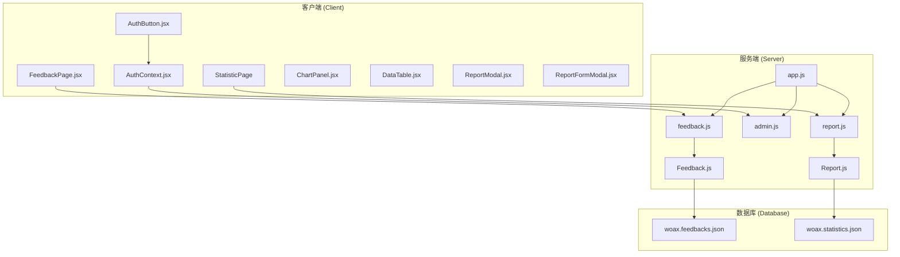
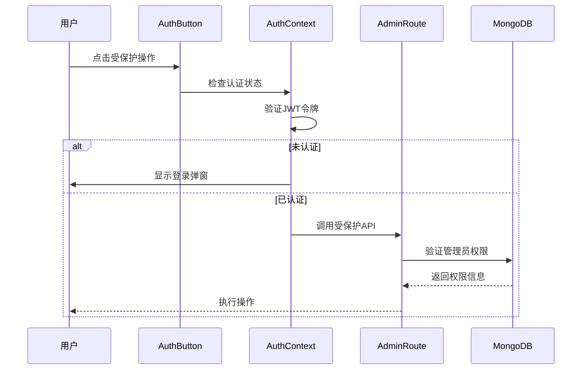
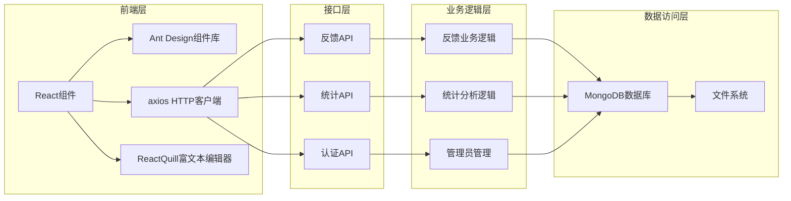
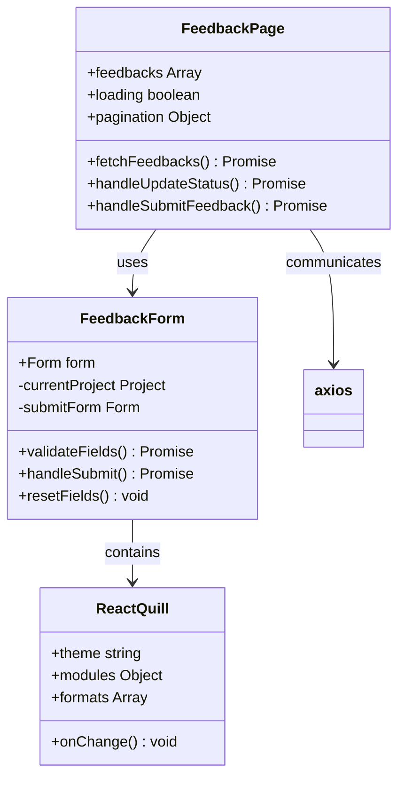
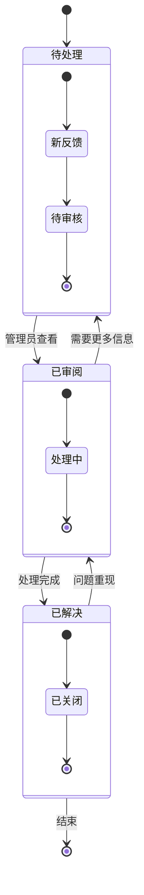
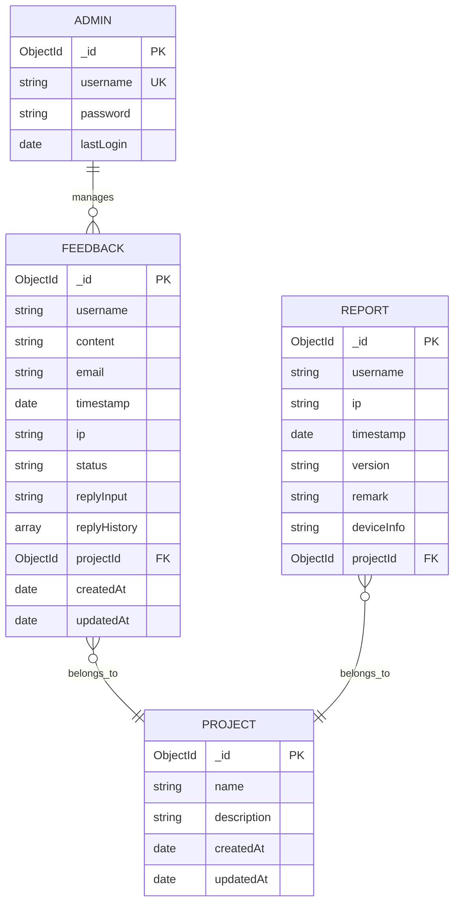
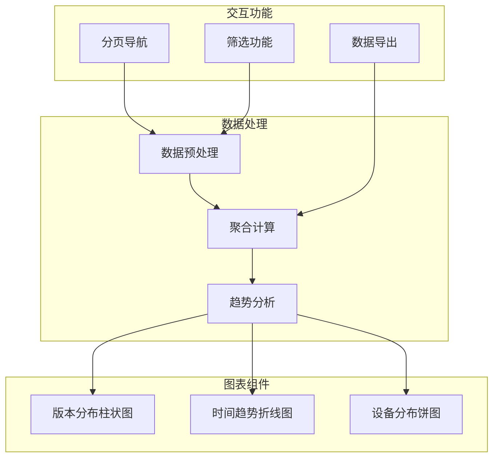
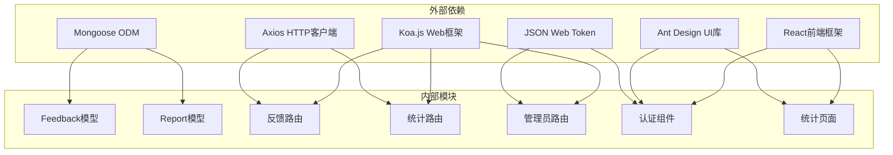
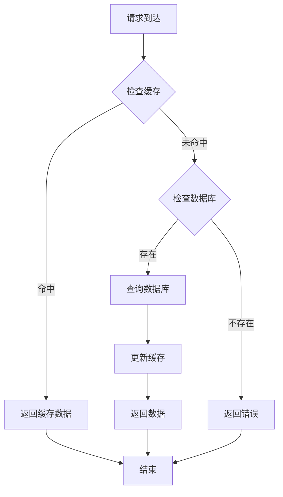

# 反馈管理模块

<cite>
**本文档引用的文件**
- [Feedback.js](file://server/models/Feedback.js)
- [feedback.js](file://server/routes/feedback.js)
- [FeedbackPage.jsx](file://client/src/pages/FeedbackPage.jsx)
- [woax.feedbacks.json](file://db/woax.feedbacks.json)
- [admin.js](file://server/routes/admin.js)
- [AuthButton.jsx](file://client/src/components/AuthButton.jsx)
- [AuthContext.jsx](file://client/src/context/AuthContext.jsx)
- [app.js](file://server/app.js)
- [Report.js](file://server/models/Report.js)
- [report.js](file://server/routes/report.js)
- [index.jsx](file://client/src/pages/StatisticPage/index.jsx)
- [ChartPanel.jsx](file://client/src/pages/StatisticPage/ChartPanel.jsx)
- [DataTable.jsx](file://client/src/pages/StatisticPage/DataTable.jsx)
- [ReportModal.jsx](file://client/src/pages/StatisticPage/ReportModal.jsx)
- [ReportFormModal.jsx](file://client/src/pages/StatisticPage/ReportFormModal.jsx)
</cite>

## 目录
1. [简介](#简介)
2. [项目结构](#项目结构)
3. [核心组件](#核心组件)
4. [架构概览](#架构概览)
5. [详细组件分析](#详细组件分析)
6. [依赖关系分析](#依赖关系分析)
7. [性能考虑](#性能考虑)
8. [故障排除指南](#故障排除指南)
9. [结论](#结论)
10. [附录](#附录)

## 简介

反馈管理模块是WoaX项目中的一个重要组成部分，负责收集、管理和分析用户反馈信息。该模块实现了完整的反馈生命周期管理，包括反馈表单设计、数据提交和存储机制、状态管理、回复功能以及数据分析统计。

系统采用前后端分离架构，前端使用React + Ant Design构建用户界面，后端基于Koa.js提供RESTful API服务，数据存储使用MongoDB数据库。模块支持管理员权限控制、富文本编辑器集成、实时状态更新和多维度数据分析功能。

## 项目结构

反馈管理模块遵循清晰的分层架构设计：

**图表来源**
- [FeedbackPage.jsx](file://client/src/pages/FeedbackPage.jsx#L1-L496)
- [feedback.js](file://server/routes/feedback.js#L1-L187)
- [admin.js](file://server/routes/admin.js#L1-L128)

**章节来源**
- [app.js](file://server/app.js#L1-L61)
- [FeedbackPage.jsx](file://client/src/pages/FeedbackPage.jsx#L1-L496)
- [index.jsx](file://client/src/pages/StatisticPage/index.jsx#L1-L262)

## 核心组件

### 数据模型设计

反馈管理模块的核心数据模型围绕Feedback和Report两个主要实体构建：

#### Feedback模型
Feedback模型设计支持完整的反馈生命周期管理：
- **基础信息**：用户名、邮箱、IP地址、时间戳
- **内容管理**：反馈内容、富文本支持
- **状态跟踪**：待处理、已审阅、已解决三种状态
- **回复机制**：支持多轮回复和历史记录
- **关联管理**：与项目模型的关联关系

#### Report模型  
Report模型专注于统计数据收集：
- **用户标识**：用户名、IP地址、用户代理
- **设备信息**：设备型号、操作系统、浏览器信息
- **地理位置**：IP定位、具体位置信息
- **版本追踪**：软件版本、更新日志
- **时间序列**：精确的时间戳记录

**章节来源**
- [Feedback.js](file://server/models/Feedback.js#L1-L52)
- [Report.js](file://server/models/Report.js#L1-L22)

### 权限控制系统

系统实现了严格的管理员权限控制机制：

**图表来源**
- [AuthButton.jsx](file://client/src/components/AuthButton.jsx#L1-L43)
- [AuthContext.jsx](file://client/src/context/AuthContext.jsx#L1-L155)
- [admin.js](file://server/routes/admin.js#L100-L125)

**章节来源**
- [AuthButton.jsx](file://client/src/components/AuthButton.jsx#L1-L43)
- [AuthContext.jsx](file://client/src/context/AuthContext.jsx#L1-L155)
- [admin.js](file://server/routes/admin.js#L1-L128)

## 架构概览

反馈管理模块采用现代化的全栈架构设计，实现了前后端的清晰分离：

**图表来源**
- [app.js](file://server/app.js#L1-L61)
- [feedback.js](file://server/routes/feedback.js#L1-L187)
- [report.js](file://server/routes/report.js#L1-L271)

系统架构特点：
- **响应式设计**：支持多种设备访问
- **实时更新**：状态变更即时反映
- **权限隔离**：不同角色访问不同功能
- **数据持久化**：完整的数据存储和备份
- **扩展性**：模块化设计便于功能扩展

## 详细组件分析

### 反馈表单系统

反馈表单系统提供了完整的用户体验，支持多种输入方式和验证机制：

#### 前端表单实现

**图表来源**
- [FeedbackPage.jsx](file://client/src/pages/FeedbackPage.jsx#L193-L219)
- [FeedbackPage.jsx](file://client/src/pages/FeedbackPage.jsx#L415-L417)

#### 富文本编辑器集成

系统集成了ReactQuill富文本编辑器，提供丰富的文本编辑功能：

| 功能特性 | 描述 | 安全性 |
|---------|------|--------|
| 文本格式化 | 粗体、斜体、下划线 | 内置HTML清理 |
| 链接插入 | URL自动识别 | 白名单过滤 |
| 列表创建 | 有序、无序列表 | DOM安全处理 |
| 代码块 | 语法高亮支持 | 内容转义 |
| 图片上传 | 支持本地图片 | 文件类型验证 |

**章节来源**
- [FeedbackPage.jsx](file://client/src/pages/FeedbackPage.jsx#L15-L17)
- [FeedbackPage.jsx](file://client/src/pages/FeedbackPage.jsx#L415-L417)

### 反馈处理流程

反馈处理流程实现了完整的状态管理和工作流控制：

**图表来源**
- [Feedback.js](file://server/models/Feedback.js#L26-L30)
- [feedback.js](file://server/routes/feedback.js#L114-L158)

#### 状态转换规则

| 当前状态 | 可执行操作 | 下一状态 | 触发条件 |
|---------|-----------|---------|----------|
| 待处理 | 查看详情 | 已审阅 | 管理员操作 |
| 已审阅 | 标记已解决 | 已解决 | 问题解决 |
| 已审阅 | 退回待处理 | 待处理 | 需要补充信息 |
| 已解决 | 重新开启 | 已审阅 | 问题重现 |

**章节来源**
- [feedback.js](file://server/routes/feedback.js#L114-L158)
- [FeedbackPage.jsx](file://client/src/pages/FeedbackPage.jsx#L118-L175)

### 数据存储机制

系统采用MongoDB作为数据存储解决方案，实现了高效的数据管理和查询优化：

#### 数据库设计模式

**图表来源**
- [Feedback.js](file://server/models/Feedback.js#L3-L49)
- [Report.js](file://server/models/Report.js#L3-L19)

#### 查询优化策略

系统实现了多种查询优化技术：
- **索引优化**：在常用查询字段上建立索引
- **分页查询**：支持大数据量的分页浏览
- **聚合查询**：使用MongoDB聚合管道进行复杂统计
- **缓存策略**：热点数据缓存减少数据库压力

**章节来源**
- [woax.feedbacks.json](file://db/woax.feedbacks.json#L1-L185)
- [feedback.js](file://server/routes/feedback.js#L8-L43)

### 统计分析功能

统计分析模块提供了多维度的数据可视化和趋势分析能力：

#### 数据可视化组件

**图表来源**
- [ChartPanel.jsx](file://client/src/pages/StatisticPage/ChartPanel.jsx#L1-L129)
- [index.jsx](file://client/src/pages/StatisticPage/index.jsx#L58-L109)

#### 统计指标体系

| 指标类型 | 计算公式 | 展示方式 | 分析价值 |
|---------|---------|---------|----------|
| 用户活跃度 | 活跃用户数/总用户数 | 折线图 | 用户增长趋势 |
| 版本分布 | 各版本用户数占比 | 饼图 | 版本接受度 |
| 设备兼容性 | 各设备用户数占比 | 柱状图 | 设备覆盖分析 |
| 地域分布 | 各地区用户数占比 | 热力图 | 市场覆盖分析 |
| 时间趋势 | 日/周/月用户增长 | 折线图 | 发展速度评估 |

**章节来源**
- [ChartPanel.jsx](file://client/src/pages/StatisticPage/ChartPanel.jsx#L1-L129)
- [DataTable.jsx](file://client/src/pages/StatisticPage/DataTable.jsx#L1-L124)

## 依赖关系分析

反馈管理模块的依赖关系体现了清晰的分层架构和模块化设计：

**图表来源**
- [app.js](file://server/app.js#L1-L61)
- [FeedbackPage.jsx](file://client/src/pages/FeedbackPage.jsx#L1-L496)

### 核心依赖关系

| 模块 | 主要依赖 | 用途 | 版本要求 |
|-----|---------|------|----------|
| 服务器端 | koa-router, koa-bodyparser, @koa/cors | Web框架和中间件 | ^12.0.0 |
| 数据访问 | mongoose, mongodb | 数据库操作 | ^6.0.0 |
| 前端组件 | antd, react-quill, axios | 用户界面和交互 | ^4.0.0 |
| 安全认证 | jsonwebtoken, bcrypt | 权限控制和加密 | ^8.0.0 |
| 开发工具 | dotenv, nodemon | 环境配置和开发调试 | ^16.0.0 |

**章节来源**
- [package.json](file://server/package.json)
- [package.json](file://client/package.json)

## 性能考虑

反馈管理模块在设计时充分考虑了性能优化和可扩展性：

### 前端性能优化

1. **组件懒加载**：使用React.lazy实现按需加载
2. **虚拟滚动**：大数据量表格使用虚拟滚动提升渲染性能
3. **状态缓存**：合理使用React.memo和useMemo避免不必要的重渲染
4. **请求去抖**：搜索和筛选操作使用防抖机制减少请求频率

### 后端性能优化

1. **数据库索引**：在常用查询字段建立复合索引
2. **查询优化**：使用投影和限制减少数据传输
3. **连接池管理**：配置合适的数据库连接池大小
4. **缓存策略**：热点数据使用Redis缓存

### 缓存策略

## 故障排除指南

### 常见问题及解决方案

#### 数据库连接问题

**症状**：应用启动时报数据库连接错误
**原因**：MongoDB服务未启动或连接字符串配置错误
**解决方案**：
1. 检查MongoDB服务状态
2. 验证连接字符串配置
3. 确认网络连通性
4. 检查防火墙设置

#### 权限认证失败

**症状**：管理员登录失败或权限验证错误
**原因**：JWT令牌过期或无效
**解决方案**：
1. 检查JWT密钥配置
2. 验证用户凭据
3. 清除本地存储的无效令牌
4. 重新登录获取新令牌

#### API请求超时

**症状**：前端请求长时间无响应
**原因**：网络延迟或服务器负载过高
**解决方案**：
1. 检查网络连接质量
2. 监控服务器资源使用情况
3. 实施请求超时和重试机制
4. 优化数据库查询性能

**章节来源**
- [AuthContext.jsx](file://client/src/context/AuthContext.jsx#L24-L48)
- [admin.js](file://server/routes/admin.js#L100-L125)

### 调试技巧

1. **浏览器开发者工具**：监控网络请求和JavaScript错误
2. **服务器日志**：查看详细的错误堆栈信息
3. **数据库监控**：使用MongoDB Compass观察数据变化
4. **性能分析**：使用React Profiler分析组件性能

## 结论

反馈管理模块是一个功能完整、架构清晰的用户反馈管理系统。通过合理的分层设计、严格的安全控制和丰富的功能特性，该模块能够有效支撑用户反馈的全生命周期管理。

系统的主要优势包括：
- **完整的功能覆盖**：从反馈收集到数据分析的全流程支持
- **良好的用户体验**：直观的界面设计和流畅的交互体验
- **强大的权限控制**：基于JWT的管理员权限管理体系
- **灵活的数据分析**：多维度的统计图表和趋势分析
- **优秀的扩展性**：模块化设计便于功能扩展和维护

未来可以考虑的功能增强：
- AI智能分类和情感分析
- 多语言支持和国际化
- 移动端原生应用支持
- 集成第三方客服系统
- 实时通知和消息推送

## 附录

### API接口规范

#### 反馈管理API

| 接口 | 方法 | 路径 | 权限 | 功能描述 |
|------|------|------|------|----------|
| 获取反馈列表 | GET | /api/feedback | 公开 | 分页获取反馈列表 |
| 获取反馈详情 | GET | /api/feedback/:id | 公开 | 获取单条反馈详情 |
| 创建反馈 | POST | /api/feedback | 管理员 | 创建新的反馈记录 |
| 更新反馈 | PUT | /api/feedback/:id | 管理员 | 更新反馈状态和回复 |
| 删除反馈 | DELETE | /api/feedback/:id | 管理员 | 删除反馈记录 |

#### 统计分析API

| 接口 | 方法 | 路径 | 权限 | 功能描述 |
|------|------|------|------|----------|
| 获取统计数据 | POST | /api/report/getReportData | 公开 | 获取聚合统计信息 |
| 获取用户记录 | GET | /api/report/user/:username | 公开 | 获取用户所有上报记录 |
| 添加上报数据 | POST | /api/report/addReport | 公开 | 添加新的上报数据 |
| 自主上报 | POST | /api/report/submit | 管理员 | 管理员自主上报数据 |
| 删除记录 | DELETE | /api/report/:id | 管理员 | 删除统计记录 |

### 配置选项

#### 环境变量配置

| 变量名 | 类型 | 必需 | 默认值 | 描述 |
|-------|------|------|--------|------|
| JWT_SECRET | string | 是 | 无 | JWT密钥 |
| MONGODB_URI | string | 是 | 无 | MongoDB连接字符串 |
| PORT | number | 否 | 3001 | 服务器端口号 |
| NODE_ENV | string | 否 | development | 运行环境 |

#### 前端配置

| 配置项 | 类型 | 默认值 | 描述 |
|-------|------|--------|------|
| API_BASE_URL | string | /api | API基础URL |
| PAGE_SIZE | number | 20 | 默认分页大小 |
| CACHE_DURATION | number | 300000 | 缓存持续时间(ms) |
| REQUEST_TIMEOUT | number | 10000 | 请求超时时间(ms) |