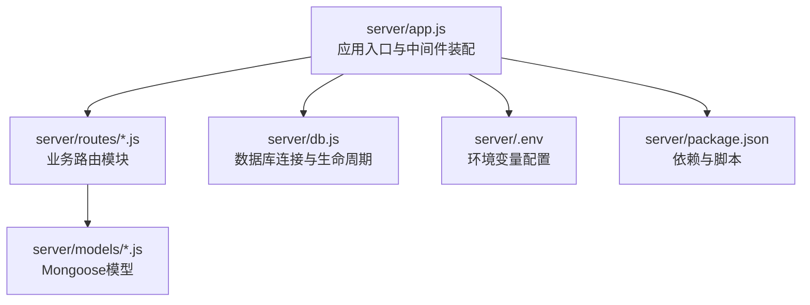
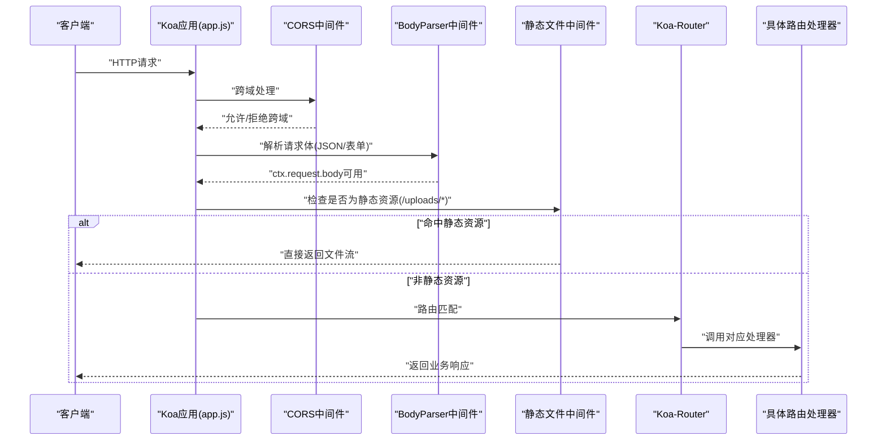
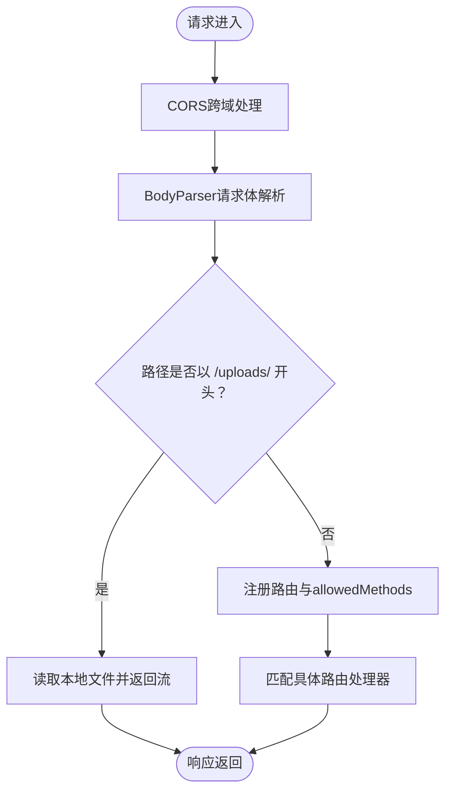
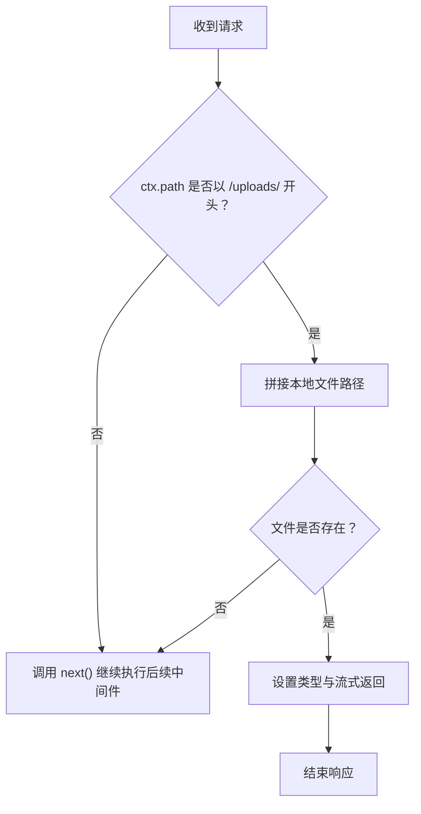
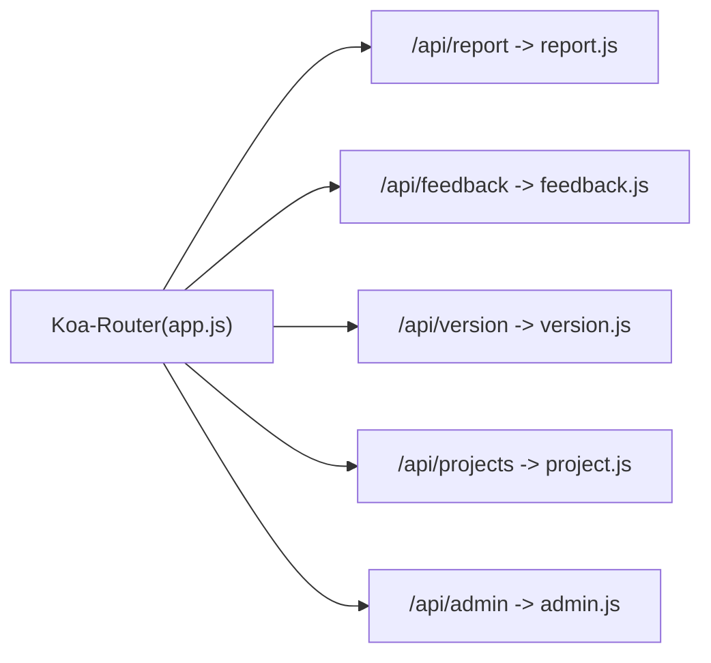
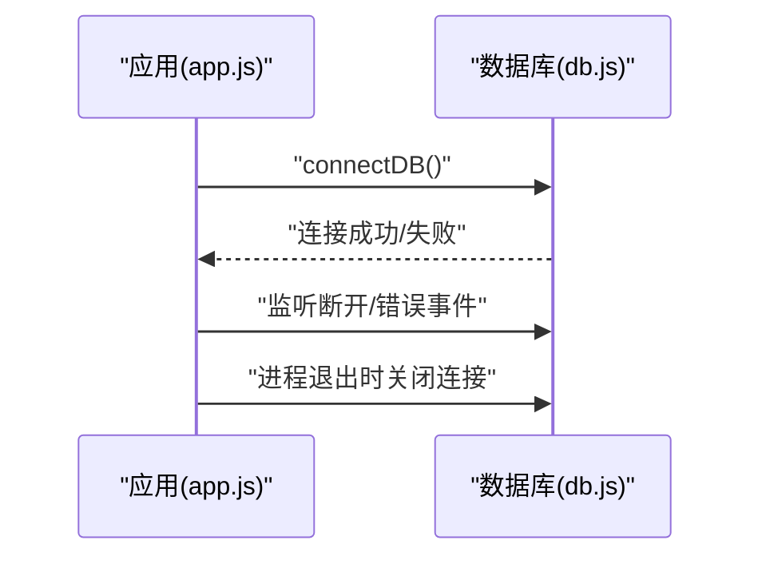
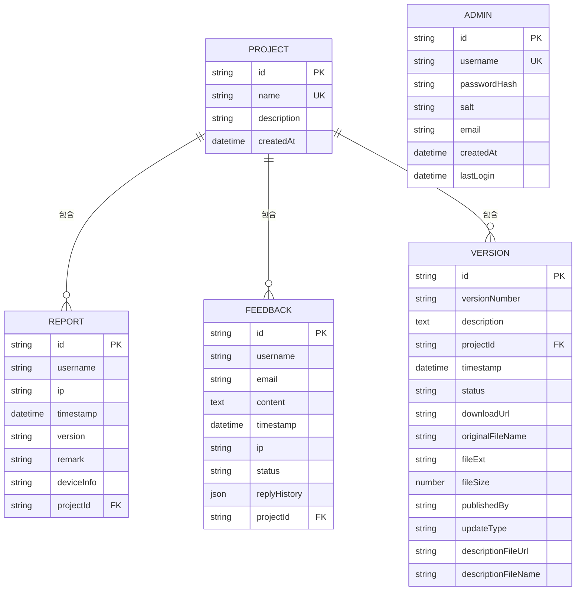
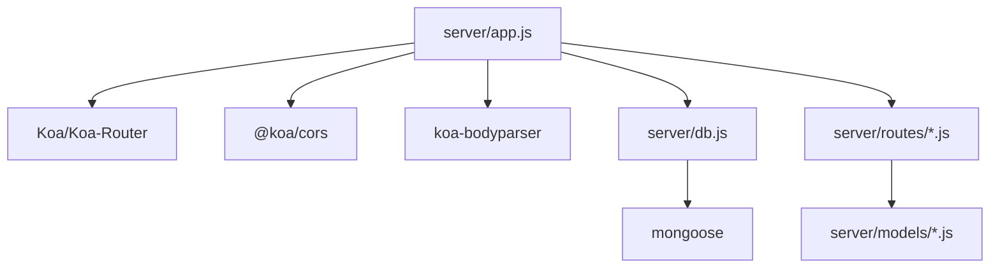

# Koa应用初始化

<cite>
**本文档引用的文件**
- [server/app.js](file://server/app.js)
- [server/package.json](file://server/package.json)
- [server/.env](file://server/.env)
- [server/db.js](file://server/db.js)
- [server/routes/report.js](file://server/routes/report.js)
- [server/routes/feedback.js](file://server/routes/feedback.js)
- [server/routes/version.js](file://server/routes/version.js)
- [server/routes/project.js](file://server/routes/project.js)
- [server/routes/admin.js](file://server/routes/admin.js)
- [server/models/Report.js](file://server/models/Report.js)
- [server/models/Feedback.js](file://server/models/Feedback.js)
- [server/models/Version.js](file://server/models/Version.js)
- [server/models/Project.js](file://server/models/Project.js)
- [server/models/Admin.js](file://server/models/Admin.js)
</cite>

## 目录
1. [简介](#简介)
2. [项目结构](#项目结构)
3. [核心组件](#核心组件)
4. [架构总览](#架构总览)
5. [详细组件分析](#详细组件分析)
6. [依赖关系分析](#依赖关系分析)
7. [性能考虑](#性能考虑)
8. [故障排除指南](#故障排除指南)
9. [结论](#结论)

## 简介
本文件面向WoaX项目的Koa应用初始化与运行流程，系统性阐述Koa应用实例创建、中间件配置与加载顺序、CORS跨域处理、BodyParser请求体解析、静态文件服务、路由注册机制与URL前缀使用、环境变量配置、端口监听与服务器启动流程。同时提供中间件执行顺序图解与最佳实践建议，帮助开发者快速理解并维护后端服务。

## 项目结构
后端采用Koa + Koa-Router + MongoDB（Mongoose）架构，核心入口位于server/app.js，路由按功能拆分至server/routes目录，数据模型位于server/models目录，数据库连接与生命周期管理位于server/db.js，环境变量配置位于server/.env。

图表来源
- [server/app.js](file://server/app.js#L1-L61)
- [server/db.js](file://server/db.js#L1-L45)
- [server/package.json](file://server/package.json#L1-L24)

章节来源
- [server/app.js](file://server/app.js#L1-L61)
- [server/package.json](file://server/package.json#L1-L24)

## 核心组件
- 应用实例与路由
  - 在server/app.js中创建Koa应用实例与Koa-Router实例，并导入各业务路由模块进行挂载。
- 中间件体系
  - CORS跨域：通过@koa/cors中间件处理跨域请求。
  - BodyParser：通过koa-bodyparser中间件解析JSON/表单等请求体。
  - 静态文件服务：自定义中间件处理以/uploads/开头的静态资源读取。
- 数据库连接
  - 通过server/db.js中的connectDB方法连接MongoDB，监听连接断开与错误事件，并在进程退出时关闭连接。
- 路由注册与URL前缀
  - 在server/app.js中使用router.use('/api/...')为各业务模块设置统一前缀，最终通过app.use(router.routes())与app.use(router.allowedMethods())注册到Koa应用。
- 环境变量与端口
  - 通过dotenv加载.env文件，端口默认取自环境变量PORT，若未设置则回退为3001。
- 服务器启动
  - 通过app.listen(PORT)启动HTTP服务并在控制台输出访问地址。

章节来源
- [server/app.js](file://server/app.js#L1-L61)
- [server/db.js](file://server/db.js#L1-L45)
- [server/.env](file://server/.env#L1-L9)

## 架构总览
下图展示从请求进入至响应返回的关键路径，涵盖中间件执行顺序与路由匹配流程。

图表来源
- [server/app.js](file://server/app.js#L30-L55)

## 详细组件分析

### 中间件与加载顺序
- 加载顺序
  1) CORS跨域处理
  2) BodyParser请求体解析
  3) 自定义静态文件中间件（优先处理/uploads/）
  4) 路由注册（router.routes()与router.allowedMethods()）
- 执行特性
  - 中间件遵循“洋葱模型”，先入后出；静态中间件在路由之前，确保静态资源优先被处理。
  - CORS与BodyParser通常放在最前，保证后续中间件能正确获取请求头与解析后的body。
- 最佳实践
  - 将通用中间件置于路由之前，避免路由层重复处理。
  - 对于静态资源，建议使用更专业的静态服务中间件（如koa-static）以获得更好的性能与缓存策略。

图表来源
- [server/app.js](file://server/app.js#L30-L55)

章节来源
- [server/app.js](file://server/app.js#L30-L55)

### CORS跨域处理
- 作用
  - 允许来自不同源的浏览器访问后端API，避免CORS错误导致的请求失败。
- 配置
  - 使用@koa/cors中间件，默认行为满足大多数场景；如需定制（如允许特定来源、自定义头部），可在初始化时传入选项。
- 注意事项
  - 生产环境中建议明确白名单来源，避免无限制放行。

章节来源
- [server/app.js](file://server/app.js#L31-L31)

### BodyParser请求体解析
- 作用
  - 解析application/json与application/x-www-form-urlencoded等常见请求体格式，将解析结果挂载到ctx.request.body。
- 配置
  - 使用koa-bodyparser中间件，默认解析JSON与表单；如需解析multipart/form-data，可结合@koa/multer或multer使用。
- 注意事项
  - 对于大文件上传，应配合文件存储与大小限制策略，避免内存压力。

章节来源
- [server/app.js](file://server/app.js#L32-L32)

### 静态文件服务
- 作用
  - 为/uploads/目录下的文件提供直接访问能力，自动设置Content-Type并以流形式返回。
- 实现要点
  - 仅对以/uploads/开头的路径生效；若文件不存在，继续执行下一个中间件（即路由）。
  - 通过fs模块读取文件并返回Readable Stream，减少内存占用。
- 最佳实践
  - 生产环境建议使用专门的静态服务中间件或CDN，提升性能与安全性。

图表来源
- [server/app.js](file://server/app.js#L34-L45)

章节来源
- [server/app.js](file://server/app.js#L34-L45)

### 路由注册机制与URL前缀
- 注册方式
  - 在server/app.js中，通过router.use('/api/模块名', 模块.routes())为各业务模块设置统一前缀。
- URL前缀示例
  - /api/report、/api/feedback、/api/version、/api/projects、/api/admin
- 路由模块职责
  - 各路由文件内部定义具体的HTTP方法与路径，如GET、POST、PUT、DELETE等。
- 最佳实践
  - 保持前缀语义化与一致性；为敏感操作（如版本发布、反馈管理）增加鉴权中间件。

图表来源
- [server/app.js](file://server/app.js#L47-L55)

章节来源
- [server/app.js](file://server/app.js#L47-L55)

### 数据库连接与生命周期
- 连接建立
  - 在server/app.js中调用connectDB()连接MongoDB；连接成功与失败分别输出日志。
- 生命周期管理
  - 监听断开与错误事件；进程接收SIGINT信号时关闭数据库连接并退出。
- 最佳实践
  - 生产环境建议在连接失败时终止进程，避免服务处于不一致状态。

图表来源
- [server/app.js](file://server/app.js#L21-L22)
- [server/db.js](file://server/db.js#L26-L40)

章节来源
- [server/app.js](file://server/app.js#L21-L22)
- [server/db.js](file://server/db.js#L1-L45)

### 环境变量配置、端口监听与服务器启动
- 环境变量
  - PORT：服务器监听端口，默认3001。
  - MONGODB_URI：MongoDB连接字符串。
  - UPLOAD_DIR：上传目录（当前代码中未直接使用该变量，但uploads目录在代码中硬编码）。
  - MAX_FILE_SIZE：最大文件大小（当前代码中未直接使用该变量）。
- 端口监听
  - 从环境变量读取PORT，若未设置则回退为3001。
- 服务器启动
  - 调用app.listen(PORT)启动服务，并在控制台打印访问地址。

章节来源
- [server/.env](file://server/.env#L1-L9)
- [server/app.js](file://server/app.js#L57-L61)

### 路由模块与业务处理
- 报表统计(report.js)
  - 提供数据聚合、分页查询、新增上报、详情查看、删除与管理员上报等功能。
  - 关键点：使用聚合管道进行去重与排序，支持按项目ID过滤。
- 反馈(feedback.js)
  - 提供反馈列表、详情、提交、状态更新与删除功能。
  - 关键点：支持回复历史与状态枚举。
- 版本(version.js)
  - 提供版本列表、详情、发布（含多文件上传）、设为最新、更新状态与删除功能。
  - 关键点：使用@koa/multer处理文件上传，修复中文文件名编码问题。
- 项目(project.js)
  - 提供项目增删改查与数据迁移功能。
  - 关键点：防止删除最后一个项目，支持批量迁移数据。
- 管理员(admin.js)
  - 提供登录、令牌验证与鉴权中间件verifyAdmin。
  - 关键点：JWT密钥从环境变量读取，登录成功返回token。

章节来源
- [server/routes/report.js](file://server/routes/report.js#L1-L271)
- [server/routes/feedback.js](file://server/routes/feedback.js#L1-L187)
- [server/routes/version.js](file://server/routes/version.js#L1-L432)
- [server/routes/project.js](file://server/routes/project.js#L1-L226)
- [server/routes/admin.js](file://server/routes/admin.js#L1-L128)

### 数据模型与关联
- Report（报表）
  - 字段：username、ip、timestamp、version、remark、deviceInfo、projectId。
- Feedback（反馈）
  - 字段：username、email、content、timestamp、ip、status、replyHistory、projectId。
- Version（版本）
  - 字段：versionNumber、description、projectId、status、downloadUrl、originalFileName、fileExt、fileSize、publishedBy、updateType、descriptionFileUrl、descriptionFileName。
- Project（项目）
  - 字段：name、description、createdAt。
- Admin（管理员）
  - 字段：username、passwordHash、salt、email、createdAt、lastLogin。

图表来源
- [server/models/Report.js](file://server/models/Report.js#L1-L22)
- [server/models/Feedback.js](file://server/models/Feedback.js#L1-L52)
- [server/models/Version.js](file://server/models/Version.js#L1-L62)
- [server/models/Project.js](file://server/models/Project.js#L1-L21)
- [server/models/Admin.js](file://server/models/Admin.js#L1-L32)

## 依赖关系分析
- 依赖层次
  - server/app.js依赖Koa、Koa-Router、@koa/cors、koa-bodyparser、dotenv、MongoDB连接模块。
  - 各路由模块依赖对应的Mongoose模型与鉴权中间件。
  - server/db.js依赖mongoose与dotenv。
- 耦合与内聚
  - 路由模块与模型解耦，通过Mongoose进行数据访问。
  - 中间件与业务逻辑分离，便于复用与测试。
- 循环依赖
  - 当前结构未发现循环依赖；路由模块之间无直接相互引用。

图表来源
- [server/app.js](file://server/app.js#L1-L15)
- [server/db.js](file://server/db.js#L1-L2)
- [server/package.json](file://server/package.json#L10-L20)

章节来源
- [server/app.js](file://server/app.js#L1-L15)
- [server/package.json](file://server/package.json#L10-L20)

## 性能考虑
- 中间件顺序优化
  - 将高开销中间件（如BodyParser、鉴权）置于静态文件之后，避免对静态资源造成额外负担。
- 静态文件服务
  - 建议使用专业静态服务中间件或CDN，提升缓存命中率与并发性能。
- 数据库连接
  - 使用连接池与合理的超时配置；在高并发场景下避免阻塞主线程。
- 请求体大小限制
  - 为BodyParser与文件上传设置合理上限，防止内存溢出。
- 日志与监控
  - 记录关键指标（请求耗时、错误率、数据库连接状态），便于性能分析与问题定位。

## 故障排除指南
- CORS相关错误
  - 症状：浏览器提示跨域失败。
  - 排查：确认@koa/cors中间件已正确加载；生产环境检查允许的来源与凭证设置。
- 请求体解析失败
  - 症状：ctx.request.body为空或解析异常。
  - 排查：确认Content-Type与BodyParser配置匹配；检查请求体格式与大小限制。
- 静态文件无法访问
  - 症状：/uploads/路径返回404或空响应。
  - 排查：确认文件存在且路径正确；检查静态中间件是否在路由之前执行。
- 路由不生效
  - 症状：访问/api/...返回404或405。
  - 排查：确认router.use前缀与路由内部路径一致；检查router.routes()与router.allowedMethods()是否注册。
- 数据库连接失败
  - 症状：启动时报MongoDB连接错误。
  - 排查：检查MONGODB_URI配置；确认MongoDB服务运行正常；查看db.js中的错误日志。
- 端口占用
  - 症状：服务器无法启动。
  - 排查：修改.env中的PORT或释放占用端口。

章节来源
- [server/app.js](file://server/app.js#L30-L55)
- [server/db.js](file://server/db.js#L10-L24)
- [server/.env](file://server/.env#L1-L9)

## 结论
WoaX的Koa应用初始化遵循清晰的模块化设计：中间件按顺序装配，路由统一前缀管理，数据库连接与生命周期完备，环境变量驱动配置。通过本文档的图解与最佳实践建议，开发者可以高效地理解并维护该后端服务，同时针对性能与稳定性进行持续优化。