# 中间件架构

<cite>
**本文档引用的文件**
- [server/app.js](file://server/app.js)
- [server/package.json](file://server/package.json)
- [server/db.js](file://server/db.js)
- [server/.env](file://server/.env)
- [server/middleware/auth.js](file://server/middleware/auth.js)
- [server/routes/admin.js](file://server/routes/admin.js)
- [server/routes/report.js](file://server/routes/report.js)
- [server/routes/feedback.js](file://server/routes/feedback.js)
- [server/routes/project.js](file://server/routes/project.js)
- [server/routes/version.js](file://server/routes/version.js)
- [server/models/Admin.js](file://server/models/Admin.js)
- [server/models/Report.js](file://server/models/Report.js)
</cite>

## 目录
1. [简介](#简介)
2. [项目结构](#项目结构)
3. [核心组件](#核心组件)
4. [架构概览](#架构概览)
5. [详细组件分析](#详细组件分析)
6. [中间件执行机制](#中间件执行机制)
7. [洋葱模型原理](#洋葱模型原理)
8. [中间件职责分工](#中间件职责分工)
9. [执行顺序与错误传播](#执行顺序与错误传播)
10. [自定义中间件开发指南](#自定义中间件开发指南)
11. [性能考虑](#性能考虑)
12. [调试技巧](#调试技巧)
13. [常见问题解决](#常见问题解决)
14. [结论](#结论)

## 简介

WoaX是一个基于Koa.js构建的全栈应用程序，采用中间件架构设计。该系统通过一系列可组合的中间件实现请求处理管道，每个中间件负责特定的功能职责，如CORS处理、请求解析、静态文件服务、身份验证等。本文档深入分析WoaX的中间件架构，解释Koa中间件的执行机制和洋葱模型原理，并提供详细的开发指南和最佳实践。

## 项目结构

WoaX项目采用清晰的分层架构，主要分为客户端和服务器端两大部分：

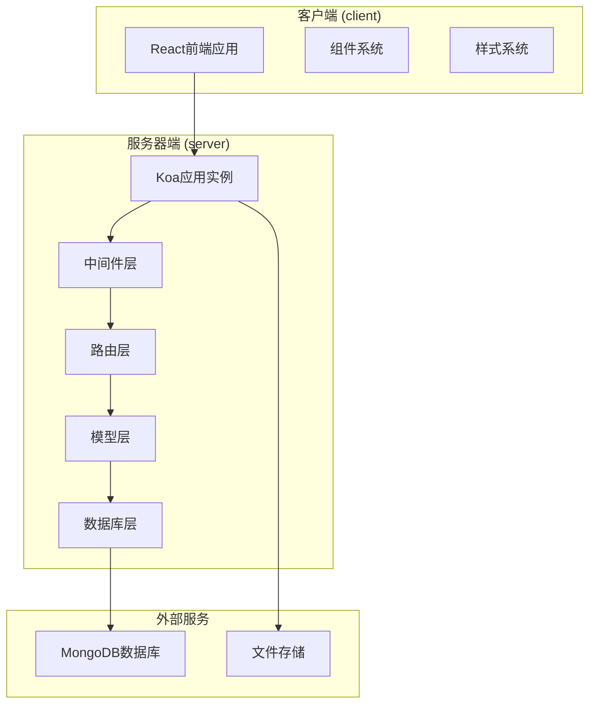

**图表来源**
- [server/app.js](file://server/app.js#L1-L61)
- [server/package.json](file://server/package.json#L1-L24)

**章节来源**
- [server/app.js](file://server/app.js#L1-L61)
- [server/package.json](file://server/package.json#L1-L24)

## 核心组件

### Koa应用实例

应用通过Koa框架创建核心实例，配置中间件和路由：

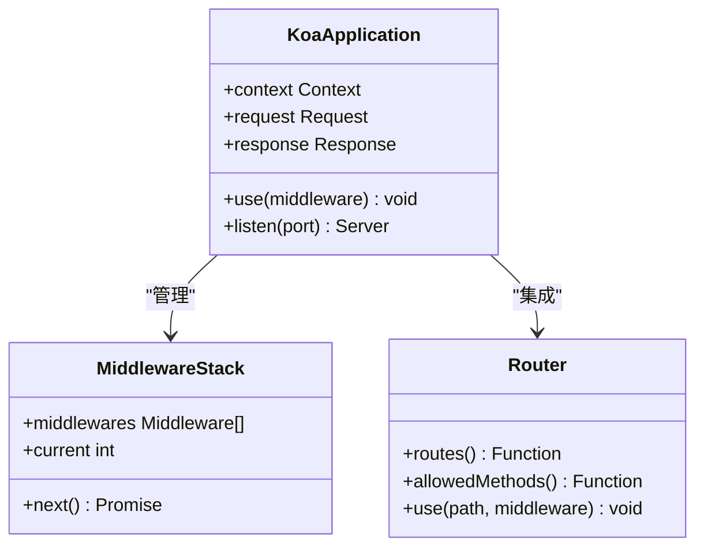

**图表来源**
- [server/app.js](file://server/app.js#L17-L19)

### 数据库连接

应用使用Mongoose进行MongoDB连接管理，提供连接池和错误处理机制：

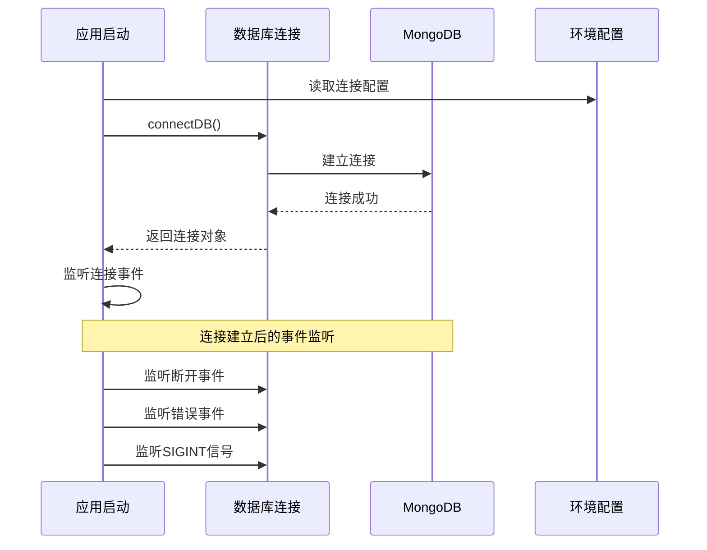

**图表来源**
- [server/db.js](file://server/db.js#L9-L24)

**章节来源**
- [server/app.js](file://server/app.js#L17-L22)
- [server/db.js](file://server/db.js#L9-L45)

## 架构概览

WoaX采用经典的三层架构模式，中间件层位于请求处理管道的核心位置：

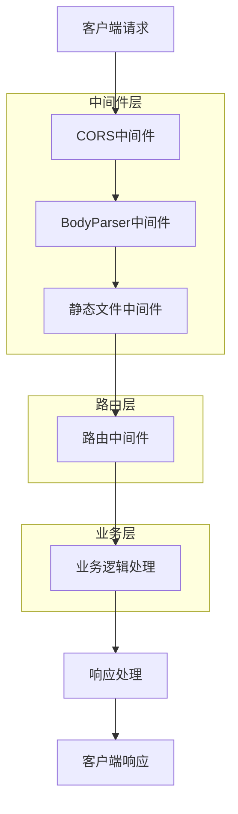

**图表来源**
- [server/app.js](file://server/app.js#L30-L55)

## 详细组件分析

### CORS中间件

CORS（跨域资源共享）中间件确保前后端分离架构下的安全通信：

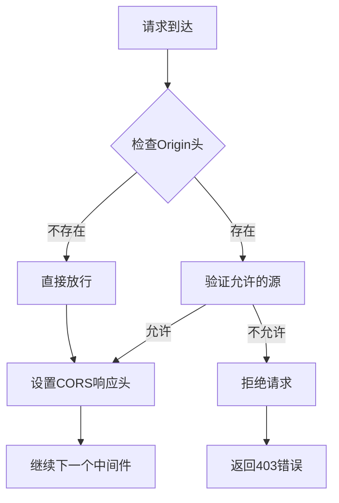

**图表来源**
- [server/app.js](file://server/app.js#L31)

### BodyParser中间件

BodyParser中间件负责解析HTTP请求体，支持多种内容类型：

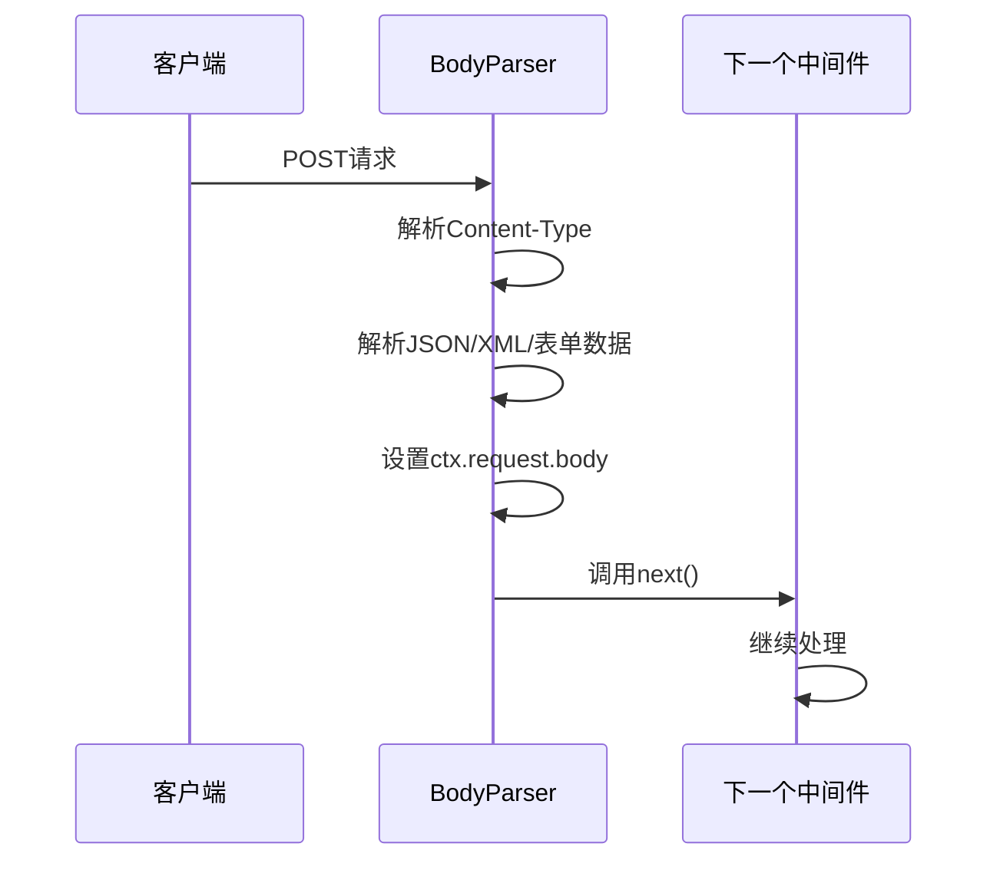

**图表来源**
- [server/app.js](file://server/app.js#L32)

### 静态文件中间件

自定义静态文件中间件提供文件上传服务和静态资源访问：

```mermaid
flowchart TD
A[请求路径] --> B{是否以/uploads/开头}
B --> |否| C[调用next()]
B --> |是| D[构建文件路径]
D --> E{文件是否存在}
E --> |否| C
E --> |是| F[设置文件类型]
F --> G[创建文件流]
G --> H[设置响应体]
H --> I[结束请求]
style I fill:#f9f9f9
```

**图表来源**
- [server/app.js](file://server/app.js#L34-L45)

**章节来源**
- [server/app.js](file://server/app.js#L30-L45)

### 路由中间件

路由中间件将请求分发到相应的业务逻辑处理函数：

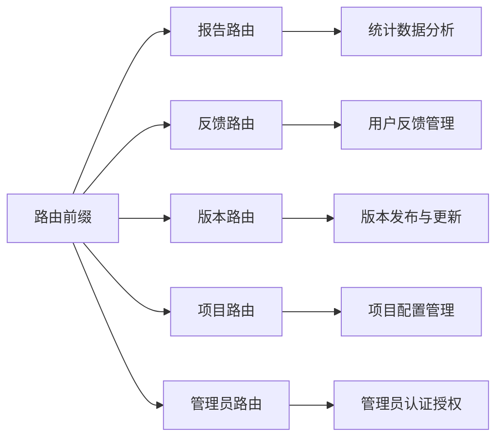

**图表来源**
- [server/app.js](file://server/app.js#L47-L55)

**章节来源**
- [server/app.js](file://server/app.js#L47-L55)

## 中间件执行机制

### 请求处理流程

WoaX中的中间件按照注册顺序形成执行链，每个中间件都有机会在请求进入和响应返回两个阶段执行：

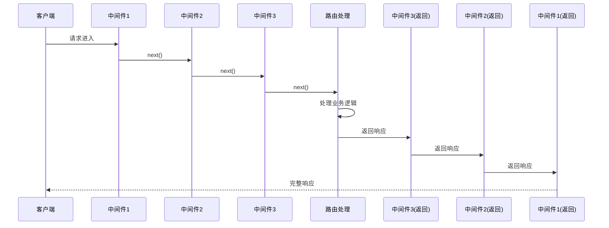

**图表来源**
- [server/app.js](file://server/app.js#L30-L55)

### 错误处理机制

中间件链中的错误会沿着调用栈向上传播，直到被适当的错误处理器捕获：

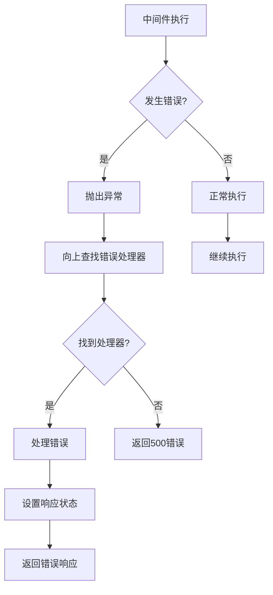

**图表来源**
- [server/routes/report.js](file://server/routes/report.js#L80-L87)
- [server/routes/feedback.js](file://server/routes/feedback.js#L35-L42)

**章节来源**
- [server/routes/report.js](file://server/routes/report.js#L80-L87)
- [server/routes/feedback.js](file://server/routes/feedback.js#L35-L42)

## 洋葱模型原理

### 执行顺序详解

Koa的洋葱模型确保中间件以"先进后出"的方式执行，形成类似洋葱的层次结构：

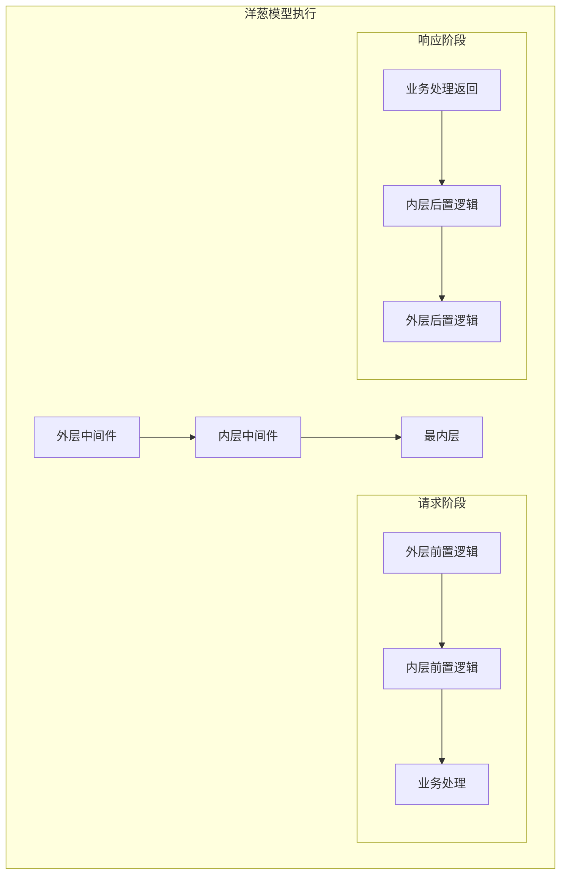

**图表来源**
- [server/app.js](file://server/app.js#L30-L45)

### 中间件注册顺序

中间件的注册顺序决定了它们在请求处理链中的位置：

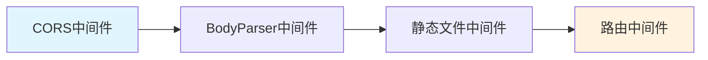

**图表来源**
- [server/app.js](file://server/app.js#L30-L55)

**章节来源**
- [server/app.js](file://server/app.js#L30-L55)

## 中间件职责分工

### CORS处理中间件

负责处理跨域请求，确保前端应用能够安全地访问后端API：

- **功能范围**: 验证请求来源、设置CORS响应头、处理预检请求
- **配置选项**: 允许的源、方法、头部、凭据支持
- **安全考虑**: 限制允许的域名，防止跨站攻击

### 请求解析中间件

解析不同格式的请求体数据：

- **JSON数据**: 解析application/json格式
- **表单数据**: 处理application/x-www-form-urlencoded
- **多部分数据**: 支持multipart/form-data（用于文件上传）
- **大小限制**: 防止过大请求体导致内存溢出

### 静态文件服务中间件

提供文件上传和静态资源访问能力：

- **上传目录**: `/uploads/` 路径下的文件访问
- **文件类型**: 自动检测并设置正确的Content-Type
- **安全性**: 验证文件存在性和访问权限
- **性能优化**: 流式传输大文件

### 身份验证中间件

实现管理员权限验证和JWT令牌处理：

- **JWT验证**: 解析和验证访问令牌
- **权限检查**: 确认管理员身份
- **上下文注入**: 将用户信息注入到请求上下文中
- **错误处理**: 统一的认证失败响应

**章节来源**
- [server/app.js](file://server/app.js#L30-L45)
- [server/routes/admin.js](file://server/routes/admin.js#L100-L125)

## 执行顺序与错误传播

### 标准执行流程

WoaX中中间件的标准执行顺序遵循以下原则：

1. **全局中间件**: CORS → BodyParser → 静态文件
2. **路由中间件**: 路由匹配 → 业务处理 → 响应处理
3. **错误处理**: 异常捕获 → 错误响应 → 完整响应

### 错误传播机制

中间件链中的错误传播遵循"冒泡"原则：

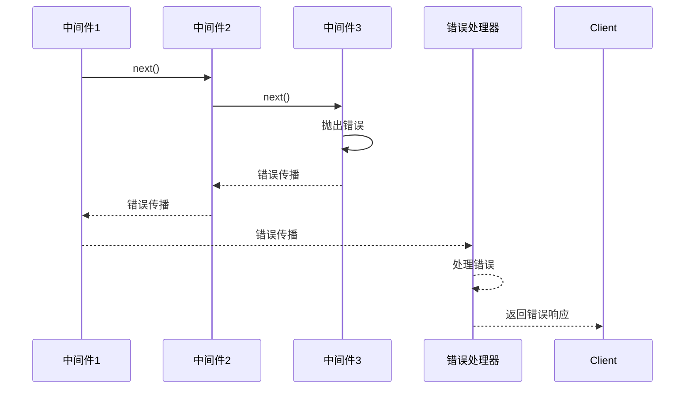

**图表来源**
- [server/routes/version.js](file://server/routes/version.js#L248-L255)

### 错误响应格式

统一的错误响应格式确保客户端能够正确处理各种错误情况：

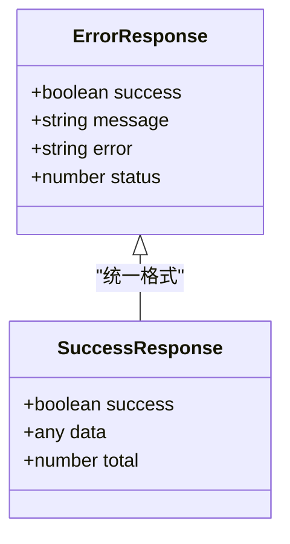

**图表来源**
- [server/routes/report.js](file://server/routes/report.js#L75-L87)

**章节来源**
- [server/routes/version.js](file://server/routes/version.js#L248-L255)
- [server/routes/report.js](file://server/routes/report.js#L75-L87)

## 自定义中间件开发指南

### 中间件开发规范

开发自定义中间件需要遵循以下规范：

```mermaid
flowchart TD
A[中间件开发] --> B[接收ctx和next参数]
B --> C[执行前置逻辑]
C --> D{是否需要处理请求?}
D --> |是| E[处理请求并设置响应]
D --> |否| F[调用next()]
E --> G[执行后置逻辑]
F --> G
G --> H[返回控制权给上游中间件]
style E fill:#e8f5e8
style G fill:#fff3e0
```

### 中间件最佳实践

1. **错误处理**: 始终包装异步操作并妥善处理异常
2. **性能考虑**: 避免阻塞操作，使用异步I/O
3. **日志记录**: 记录关键操作和错误信息
4. **资源清理**: 及时释放文件句柄和数据库连接
5. **配置管理**: 使用环境变量和配置文件管理参数

### 示例：自定义日志中间件

```javascript
// 日志中间件示例
const logger = async (ctx, next) => {
  const start = Date.now();
  
  try {
    await next();
    const ms = Date.now() - start;
    console.log(`${ctx.method} ${ctx.url} - ${ms}ms`);
  } catch (error) {
    const ms = Date.now() - start;
    console.error(`${ctx.method} ${ctx.url} - ${ms}ms - 错误: ${error.message}`);
    throw error;
  }
};
```

**章节来源**
- [server/app.js](file://server/app.js#L30-L45)

## 性能考虑

### 中间件性能优化

1. **执行顺序优化**: 将高频且轻量的中间件放在前面
2. **缓存策略**: 对静态资源和频繁查询结果进行缓存
3. **流式处理**: 对大文件和大数据集使用流式处理
4. **连接池管理**: 合理配置数据库和文件系统的连接池

### 内存管理

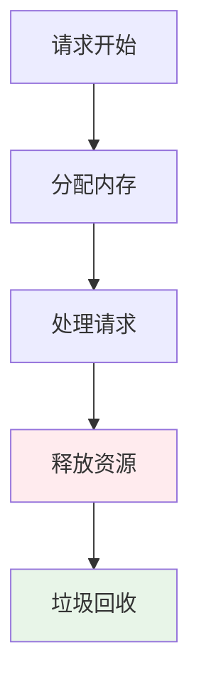

### 并发处理

- **异步操作**: 所有I/O操作都应该是异步的
- **数据库连接**: 使用连接池避免频繁创建连接
- **文件操作**: 对于大文件使用流式读写

**章节来源**
- [server/app.js](file://server/app.js#L24-L28)
- [server/db.js](file://server/db.js#L9-L24)

## 调试技巧

### 开发环境配置

1. **使用nodemon**: 实现代码热重载，提高开发效率
2. **环境变量**: 使用`.env`文件管理配置
3. **日志输出**: 在开发环境中启用详细日志

### 常用调试工具

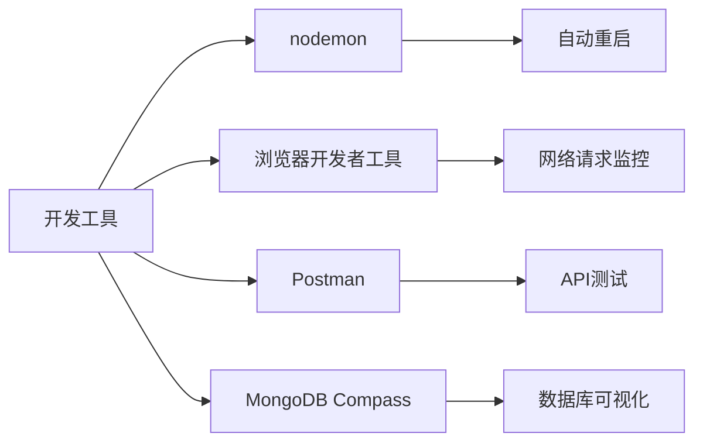

### 调试中间件

```javascript
// 调试中间件示例
const debugMiddleware = async (ctx, next) => {
  console.log('请求开始:', ctx.method, ctx.url);
  console.log('请求头:', ctx.headers);
  console.log('请求体:', ctx.request.body);
  
  await next();
  
  console.log('响应状态:', ctx.status);
  console.log('响应体:', ctx.body);
};
```

**章节来源**
- [server/package.json](file://server/package.json#L6-L8)
- [server/.env](file://server/.env#L1-L9)

## 常见问题解决

### CORS相关问题

**问题**: 跨域请求被阻止
**解决方案**: 
1. 检查CORS中间件配置
2. 确认允许的源列表
3. 验证预检请求处理

### 文件上传问题

**问题**: 文件上传失败或文件名乱码
**解决方案**:
1. 检查上传目录权限
2. 验证文件大小限制
3. 处理中文文件名编码问题

### 数据库连接问题

**问题**: 应用启动时数据库连接失败
**解决方案**:
1. 检查MongoDB服务状态
2. 验证连接字符串配置
3. 确认网络连通性

### 权限验证问题

**问题**: 管理员登录失败或权限验证错误
**解决方案**:
1. 检查JWT密钥配置
2. 验证管理员账户存在性
3. 确认密码哈希算法正确性

**章节来源**
- [server/routes/version.js](file://server/routes/version.js#L10-L36)
- [server/db.js](file://server/db.js#L18-L23)
- [server/routes/admin.js](file://server/routes/admin.js#L100-L125)

## 结论

WoaX的中间件架构展现了现代Web应用的最佳实践。通过精心设计的中间件层次结构，系统实现了高度模块化和可维护的代码组织。每个中间件都有明确的职责边界，遵循洋葱模型的执行原则，确保了请求处理的灵活性和可扩展性。

该架构的优势包括：
- **模块化设计**: 中间件可以独立开发和测试
- **可组合性**: 中间件可以灵活组合形成不同的处理管道
- **可扩展性**: 新功能可以通过添加中间件轻松实现
- **可维护性**: 清晰的职责分工便于代码维护和调试

通过深入理解和掌握这些中间件机制，开发者可以更好地扩展WoaX功能，构建更加健壮和高效的Web应用。