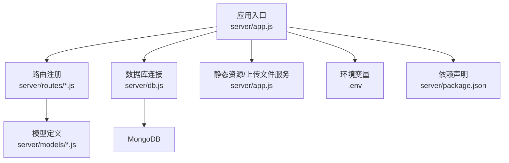
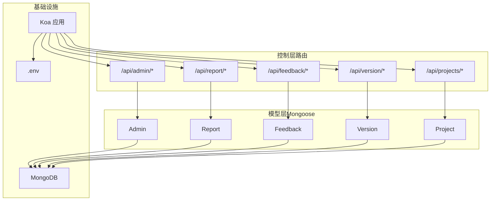
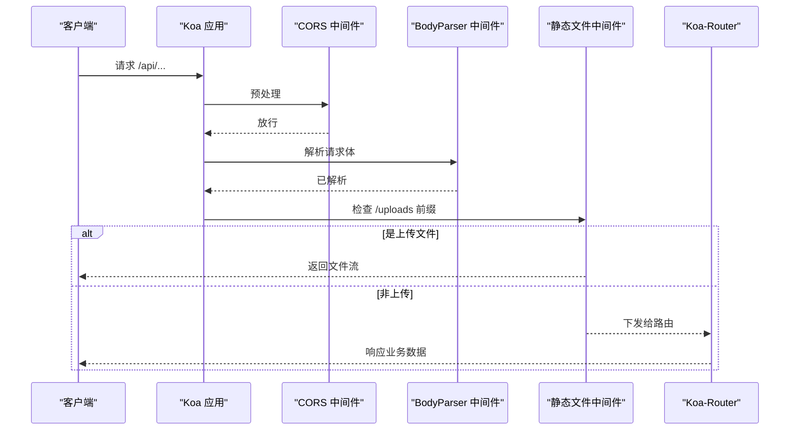
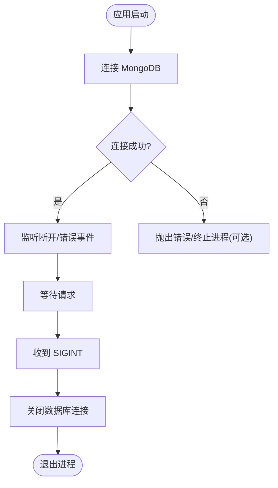
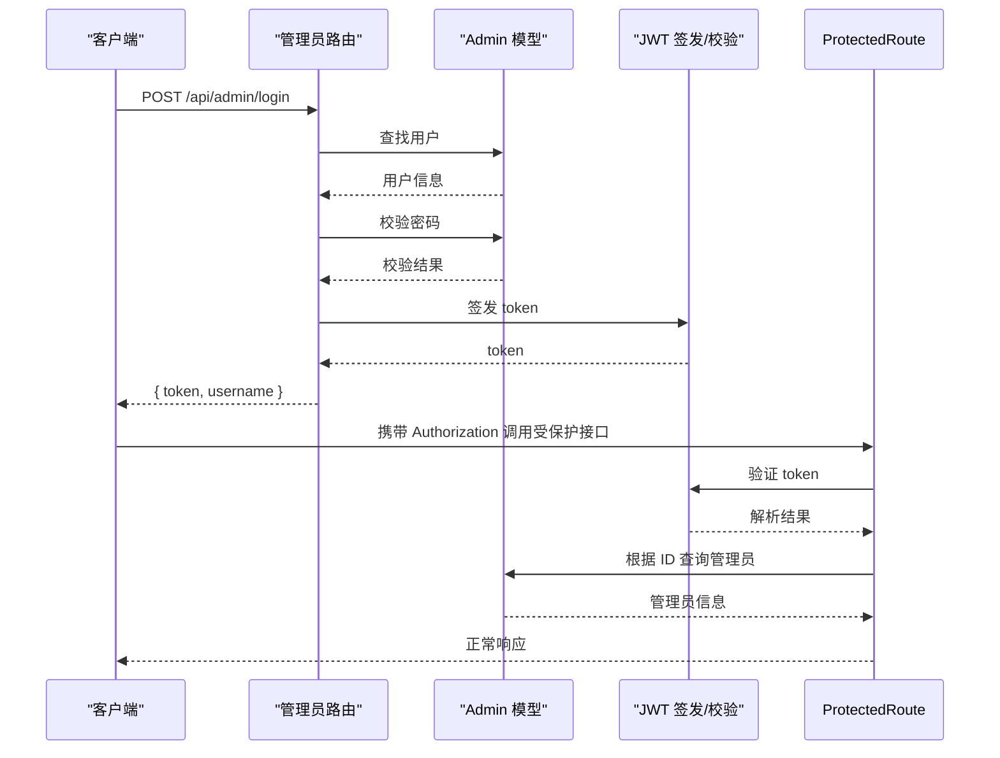
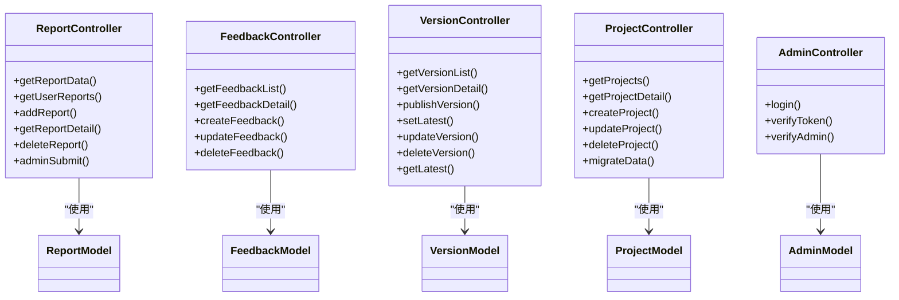
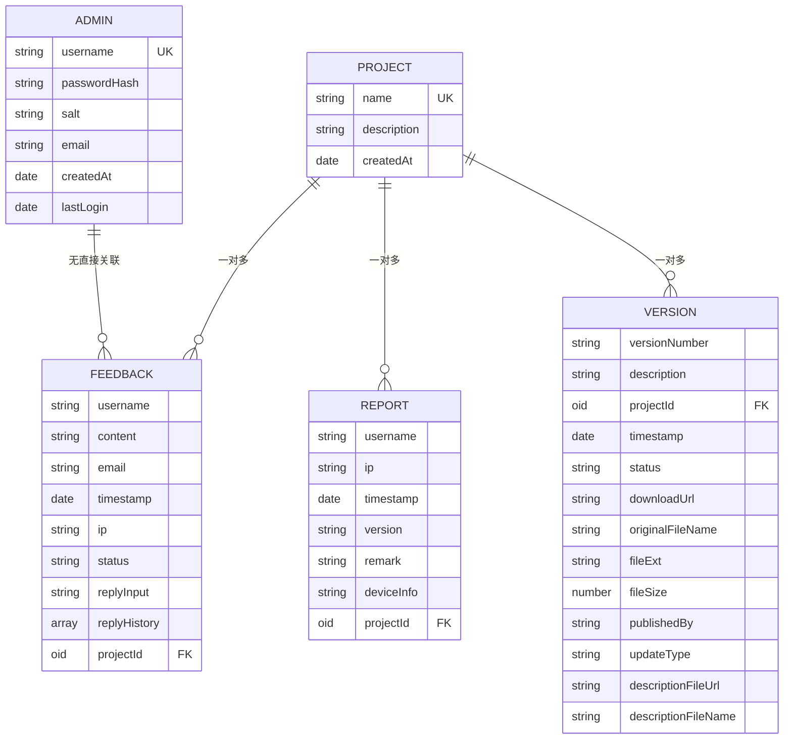
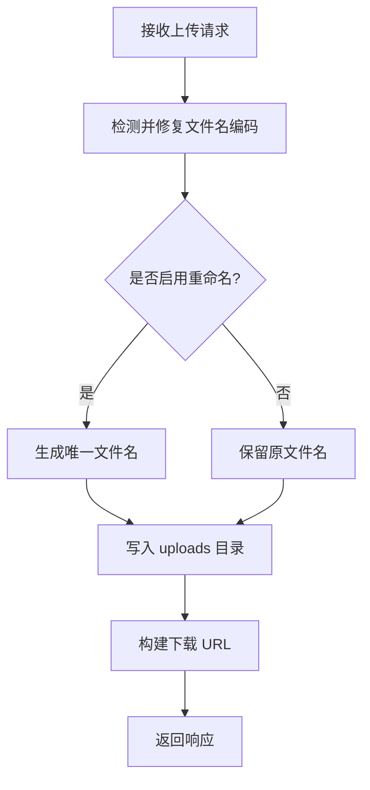
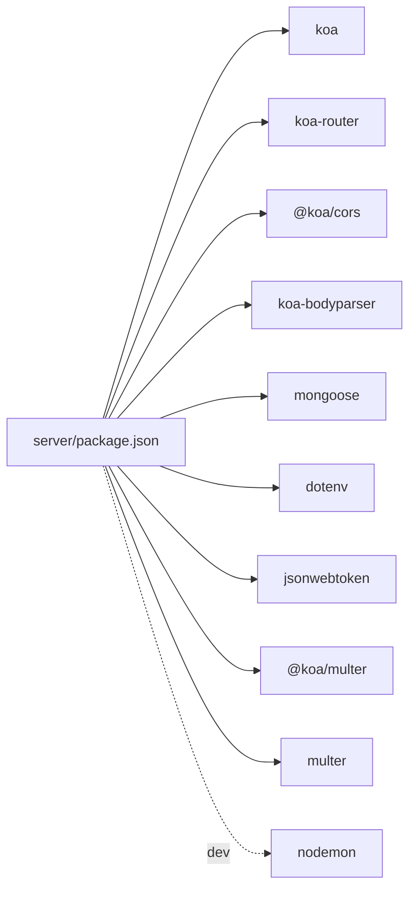

# 后端架构

<cite>
**本文引用的文件**
- [server/app.js](file://server/app.js)
- [server/db.js](file://server/db.js)
- [server/package.json](file://server/package.json)
- [server/.env](file://server/.env)
- [server/routes/admin.js](file://server/routes/admin.js)
- [server/routes/report.js](file://server/routes/report.js)
- [server/routes/feedback.js](file://server/routes/feedback.js)
- [server/routes/version.js](file://server/routes/version.js)
- [server/routes/project.js](file://server/routes/project.js)
- [server/models/Admin.js](file://server/models/Admin.js)
- [server/models/Feedback.js](file://server/models/Feedback.js)
- [server/models/Project.js](file://server/models/Project.js)
- [server/models/Report.js](file://server/models/Report.js)
- [server/models/Version.js](file://server/models/Version.js)
- [README.md](file://README.md)
</cite>

## 目录
1. [简介](#简介)
2. [项目结构](#项目结构)
3. [核心组件](#核心组件)
4. [架构总览](#架构总览)
5. [组件详解](#组件详解)
6. [依赖关系分析](#依赖关系分析)
7. [性能考量](#性能考量)
8. [故障排查指南](#故障排查指南)
9. [结论](#结论)
10. [附录](#附录)

## 简介
本文件为 WoaX 后端服务的架构文档，基于 Koa.js 的 Node.js 应用，采用 MongoDB 作为持久化存储，通过 Mongoose 进行 ODM 映射。系统提供 RESTful API，覆盖“数据统计上报”“意见反馈”“版本管理”“项目管理”以及“管理员认证”等业务域。文档重点阐述中间件机制、路由系统、数据库连接与模型设计、认证与授权、错误处理与数据验证、MVC 分层职责、性能优化与安全设计，并给出 API 接口规范与使用示例。

## 项目结构
后端位于 server 目录，采用按功能域划分的路由与模型组织方式：
- 应用入口与中间件：app.js
- 数据库连接与生命周期：db.js
- 环境变量：.env
- 路由模块：routes/admin.js、routes/report.js、routes/feedback.js、routes/version.js、routes/project.js
- 数据模型：models/Admin.js、models/Report.js、models/Feedback.js、models/Version.js、models/Project.js
- 依赖与脚本：package.json

图表来源
- [server/app.js](file://server/app.js#L1-L61)
- [server/db.js](file://server/db.js#L1-L45)
- [server/routes/admin.js](file://server/routes/admin.js#L1-L128)
- [server/routes/report.js](file://server/routes/report.js#L1-L271)
- [server/routes/feedback.js](file://server/routes/feedback.js#L1-L187)
- [server/routes/version.js](file://server/routes/version.js#L1-L432)
- [server/routes/project.js](file://server/routes/project.js#L1-L226)
- [server/models/Admin.js](file://server/models/Admin.js#L1-L32)
- [server/models/Report.js](file://server/models/Report.js#L1-L22)
- [server/models/Feedback.js](file://server/models/Feedback.js#L1-L52)
- [server/models/Version.js](file://server/models/Version.js#L1-L62)
- [server/models/Project.js](file://server/models/Project.js#L1-L21)
- [server/.env](file://server/.env#L1-L9)
- [server/package.json](file://server/package.json#L1-L24)

章节来源
- [server/app.js](file://server/app.js#L1-L61)
- [server/package.json](file://server/package.json#L1-L24)
- [README.md](file://README.md#L1-L44)

## 核心组件
- 应用实例与中间件
  - 使用 Koa 创建应用实例，注册 CORS、BodyParser、自定义静态文件服务（/uploads）等中间件。
  - 上传目录自动创建，支持直接访问上传文件。
- 路由系统
  - 使用 Koa-Router 注册各业务模块路由，前缀统一为 /api/{resource}。
  - 管理员相关操作通过 verifyAdmin 中间件进行鉴权。
- 数据库连接
  - 通过 Mongoose 连接 MongoDB，监听断开与错误事件；应用退出时关闭连接。
- 认证与授权
  - 管理员登录签发 JWT，校验中间件从请求头解析并验证令牌，注入管理员上下文。
- 模型与数据验证
  - Mongoose Schema 定义字段类型、约束与默认值；路由层对关键参数进行显式校验。
- 文件上传与处理
  - 使用 @koa/multer 处理多文件上传，支持中文文件名修复与可选重命名策略。

章节来源
- [server/app.js](file://server/app.js#L1-L61)
- [server/db.js](file://server/db.js#L1-L45)
- [server/routes/admin.js](file://server/routes/admin.js#L1-L128)
- [server/.env](file://server/.env#L1-L9)

## 架构总览
整体采用 MVC 思想在代码层面体现：
- 控制器（路由处理器）：server/routes/* 实现业务流程与数据流转。
- 模型（Mongoose）：server/models/* 定义数据结构与约束。
- 视图：本项目为纯 API 服务，不包含传统视图层，响应体即为最终输出。

图表来源
- [server/app.js](file://server/app.js#L1-L61)
- [server/routes/admin.js](file://server/routes/admin.js#L1-L128)
- [server/routes/report.js](file://server/routes/report.js#L1-L271)
- [server/routes/feedback.js](file://server/routes/feedback.js#L1-L187)
- [server/routes/version.js](file://server/routes/version.js#L1-L432)
- [server/routes/project.js](file://server/routes/project.js#L1-L226)
- [server/models/Admin.js](file://server/models/Admin.js#L1-L32)
- [server/models/Report.js](file://server/models/Report.js#L1-L22)
- [server/models/Feedback.js](file://server/models/Feedback.js#L1-L52)
- [server/models/Version.js](file://server/models/Version.js#L1-L62)
- [server/models/Project.js](file://server/models/Project.js#L1-L21)
- [server/.env](file://server/.env#L1-L9)

## 组件详解

### 应用入口与中间件链
- 中间件顺序与职责
  - CORS：允许跨域请求。
  - BodyParser：解析 JSON/表单请求体。
  - 自定义静态文件服务：拦截 /uploads 前缀，读取本地文件流返回。
- 路由注册
  - 将各模块路由挂载至统一前缀，便于前端调用与维护。
- 服务器启动
  - 从环境变量读取端口，默认 3001；打印启动日志。

图表来源
- [server/app.js](file://server/app.js#L30-L55)

章节来源
- [server/app.js](file://server/app.js#L1-L61)

### 数据库连接与生命周期
- 连接参数
  - 从环境变量读取 MONGODB_URI，默认 mongodb://localhost:27017/woax。
  - 开启 useNewUrlParser 与 useUnifiedTopology。
- 生命周期事件
  - 断开与错误监听，应用退出时关闭连接，确保资源释放。

图表来源
- [server/db.js](file://server/db.js#L9-L40)
- [server/.env](file://server/.env#L4-L5)

章节来源
- [server/db.js](file://server/db.js#L1-L45)
- [server/.env](file://server/.env#L1-L9)

### 认证与授权（管理员）
- 登录流程
  - 根据用户名查找管理员，校验密码，更新最后登录时间，签发 JWT（有效期 24h）。
- 校验流程
  - 从 Authorization 头解析 Bearer 令牌，验证签名与有效性，注入 ctx.state.admin。
- 默认管理员初始化
  - 应用启动时若不存在默认管理员，则创建并设置默认密码。

图表来源
- [server/routes/admin.js](file://server/routes/admin.js#L26-L98)
- [server/models/Admin.js](file://server/models/Admin.js#L16-L30)
- [server/.env](file://server/.env#L2-L2)

章节来源
- [server/routes/admin.js](file://server/routes/admin.js#L1-L128)
- [server/models/Admin.js](file://server/models/Admin.js#L1-L32)
- [server/.env](file://server/.env#L1-L9)

### 路由与控制器（RESTful API）
- 报表（Report）
  - 聚合查询每个用户的最后上报记录，支持分页与项目过滤。
  - 用户历史记录查询、新增上报、详情查询、删除（需管理员）、管理员自主上报。
- 反馈（Feedback）
  - 列表查询、详情查询、新增反馈（需管理员）、更新状态与回复历史（需管理员）、删除（需管理员）。
- 版本（Version）
  - 列表查询、详情查询、发布新版本（含多文件上传与中文文件名修复）、设为最新版本、更新状态、删除版本（含文件清理）、获取最新版本（无需权限）。
- 项目（Project）
  - 列表、详情、创建、更新、删除（限制至少保留一个）、将无项目 ID 的数据迁移到指定项目。
- 管理员（Admin）
  - 登录、令牌校验、权限中间件。

图表来源
- [server/routes/report.js](file://server/routes/report.js#L1-L271)
- [server/routes/feedback.js](file://server/routes/feedback.js#L1-L187)
- [server/routes/version.js](file://server/routes/version.js#L1-L432)
- [server/routes/project.js](file://server/routes/project.js#L1-L226)
- [server/routes/admin.js](file://server/routes/admin.js#L1-L128)
- [server/models/Report.js](file://server/models/Report.js#L1-L22)
- [server/models/Feedback.js](file://server/models/Feedback.js#L1-L52)
- [server/models/Version.js](file://server/models/Version.js#L1-L62)
- [server/models/Project.js](file://server/models/Project.js#L1-L21)
- [server/models/Admin.js](file://server/models/Admin.js#L1-L32)

章节来源
- [server/routes/report.js](file://server/routes/report.js#L1-L271)
- [server/routes/feedback.js](file://server/routes/feedback.js#L1-L187)
- [server/routes/version.js](file://server/routes/version.js#L1-L432)
- [server/routes/project.js](file://server/routes/project.js#L1-L226)
- [server/routes/admin.js](file://server/routes/admin.js#L1-L128)

### 数据模型与数据库设计
- Admin（管理员）
  - 字段：username（唯一）、passwordHash、salt、email、createdAt、lastLogin。
  - 方法：setPassword、validatePassword。
- Report（数据统计）
  - 字段：username、ip、timestamp、version、remark、deviceInfo、projectId（关联 Project）。
  - 集合：statistics。
- Feedback（意见反馈）
  - 字段：username、content、email、timestamp、ip、status（枚举）、replyInput、replyHistory、projectId。
  - 时间戳：createdAt、updatedAt。
- Version（版本）
  - 字段：versionNumber、description、projectId、timestamp、status（draft/published/deprecated）、downloadUrl、originalFileName、fileExt、fileSize、publishedBy、updateType（force/active/passive）、descriptionFileUrl、descriptionFileName。
  - 时间戳：createdAt、updatedAt。
- Project（项目）
  - 字段：name（唯一）、description、createdAt。
  - 时间戳：createdAt、updatedAt。

图表来源
- [server/models/Admin.js](file://server/models/Admin.js#L4-L14)
- [server/models/Report.js](file://server/models/Report.js#L3-L19)
- [server/models/Feedback.js](file://server/models/Feedback.js#L3-L49)
- [server/models/Version.js](file://server/models/Version.js#L3-L60)
- [server/models/Project.js](file://server/models/Project.js#L3-L19)

章节来源
- [server/models/Admin.js](file://server/models/Admin.js#L1-L32)
- [server/models/Report.js](file://server/models/Report.js#L1-L22)
- [server/models/Feedback.js](file://server/models/Feedback.js#L1-L52)
- [server/models/Version.js](file://server/models/Version.js#L1-L62)
- [server/models/Project.js](file://server/models/Project.js#L1-L21)

### 错误处理与数据验证
- 统一响应结构
  - 成功时返回 { success: true, data?, total?, page?, pageSize? }。
  - 失败时返回 { success: false, message, error? }。
- 参数校验
  - 关键接口要求携带 projectId；部分接口要求必填字段（如版本发布、反馈提交）。
- 状态码策略
  - 缺少参数/校验失败：400
  - 未授权/无效令牌：401
  - 资源不存在：404
  - 服务器内部错误：500
- 文件上传异常处理
  - 校验失败时主动删除已上传文件，避免垃圾文件残留。

章节来源
- [server/routes/report.js](file://server/routes/report.js#L8-L88)
- [server/routes/feedback.js](file://server/routes/feedback.js#L72-L111)
- [server/routes/version.js](file://server/routes/version.js#L147-L256)
- [server/routes/project.js](file://server/routes/project.js#L53-L92)

### 文件上传与中文文件名处理
- 多文件上传
  - 支持安装包文件与描述文件（latest.yml）同时上传。
- 中文文件名修复
  - 通过编码检测与 URL 解码修复乱码；可选择是否重命名。
- 上传目录与访问
  - 自动创建 uploads 目录；/uploads 前缀直接返回文件流。

图表来源
- [server/routes/version.js](file://server/routes/version.js#L10-L74)
- [server/routes/version.js](file://server/routes/version.js#L147-L256)
- [server/app.js](file://server/app.js#L34-L45)

章节来源
- [server/routes/version.js](file://server/routes/version.js#L1-L432)
- [server/app.js](file://server/app.js#L24-L28)

## 依赖关系分析
- 运行时依赖
  - Koa、Koa-Router、@koa/cors、koa-bodyparser、mongoose、dotenv、jsonwebtoken、@koa/multer、multer。
- 开发依赖
  - nodemon（热重启开发）。
- 环境变量
  - PORT、MONGODB_URI、UPLOAD_DIR、MAX_FILE_SIZE。

图表来源
- [server/package.json](file://server/package.json#L10-L23)
- [server/.env](file://server/.env#L1-L9)

章节来源
- [server/package.json](file://server/package.json#L1-L24)
- [server/.env](file://server/.env#L1-L9)

## 性能考量
- 数据库连接
  - 使用连接池与统一连接配置，避免频繁重建连接。
- 查询优化
  - 对高频查询建立索引（建议：projectId、timestamp、username 等常用过滤字段）。
- 分页与聚合
  - 聚合管道中先 group 再 sort，再 skip/limit，减少内存压力。
- 文件上传
  - 控制文件大小（MAX_FILE_SIZE），限制并发上传，必要时引入队列。
- 中间件顺序
  - 将静态文件服务置于 body 解析之后，避免不必要的解析成本。
- 缓存
  - 对只读列表（如最新版本）可引入短期缓存，降低数据库压力。

## 故障排查指南
- 数据库连接失败
  - 检查 MONGODB_URI 是否正确；确认 MongoDB 服务运行；查看连接错误日志。
- 上传文件无法访问
  - 确认 uploads 目录存在且具备读权限；检查 /uploads 前缀路径与文件名编码修复逻辑。
- 管理员登录失败
  - 确认用户名存在且密码正确；检查 JWT_SECRET 是否配置；查看登录响应中的错误信息。
- 接口报 401 未授权
  - 确认请求头携带 Authorization: Bearer <token>；检查令牌是否过期或被篡改。
- 删除版本后文件未清理
  - 确认删除接口执行路径；检查文件路径拼接与存在性判断。

章节来源
- [server/db.js](file://server/db.js#L18-L23)
- [server/routes/version.js](file://server/routes/version.js#L394-L430)
- [server/routes/admin.js](file://server/routes/admin.js#L26-L67)

## 结论
WoaX 后端以 Koa 为核心，结合 Mongoose 实现清晰的 MVC 分层与 RESTful API 设计。通过统一的中间件链、路由前缀化与管理员鉴权机制，系统在功能完整性与可维护性之间取得平衡。建议后续完善索引策略、引入缓存与限流、增强输入校验与日志审计，以进一步提升性能与安全性。

## 附录

### API 接口规范与使用示例

- 通用响应格式
  - 成功：{ success: true, data?, total?, page?, pageSize? }
  - 失败：{ success: false, message, error? }

- 认证与授权
  - 登录
    - 方法：POST
    - 路径：/api/admin/login
    - 请求体：{ username, password }
    - 响应：{ success: true, data: { token, username } }
  - 校验令牌
    - 方法：GET
    - 路径：/api/admin/verify
    - 请求头：Authorization: Bearer <token>
    - 响应：{ success: true, data: { username } }

- 报表（Report）
  - 获取报表数据（分页聚合）
    - 方法：POST
    - 路径：/api/report/getReportData
    - 请求体：{ pageCurrent, pageSize, projectId }
    - 响应：{ success: true, data, total }
  - 获取用户历史记录
    - 方法：GET
    - 路径：/api/report/user/:username
    - 查询参数：page, pageSize, projectId
    - 响应：{ success: true, data, total, page, pageSize }
  - 新增上报
    - 方法：POST
    - 路径：/api/report/addReport
    - 请求体：{ username, ip, userAgent, deviceInfo, location, version, remark, projectId }
    - 响应：{ success: true, message, data }
  - 获取详情
    - 方法：GET
    - 路径：/api/report/:id
    - 响应：{ success: true, data }
  - 删除记录（管理员）
    - 方法：DELETE
    - 路径：/api/report/:id
    - 请求头：Authorization: Bearer <token>
    - 响应：{ success: true, message }

- 反馈（Feedback）
  - 获取列表
    - 方法：GET
    - 路径：/api/feedback/
    - 查询参数：page, pageSize, projectId
    - 响应：{ success: true, data, total, page, pageSize }
  - 获取详情
    - 方法：GET
    - 路径：/api/feedback/:id
    - 响应：{ success: true, data }
  - 提交反馈（管理员）
    - 方法：POST
    - 路径：/api/feedback/
    - 请求头：Authorization: Bearer <token>
    - 请求体：{ username, email, content, projectId }
    - 响应：{ success: true, message, data }
  - 更新状态与回复（管理员）
    - 方法：PUT
    - 路径：/api/feedback/:id
    - 请求头：Authorization: Bearer <token>
    - 请求体：{ status?, replyInput?, admin? }
    - 响应：{ success: true, message, data }
  - 删除反馈（管理员）
    - 方法：DELETE
    - 路径：/api/feedback/:id
    - 请求头：Authorization: Bearer <token>
    - 响应：{ success: true, message }

- 版本（Version）
  - 获取列表
    - 方法：GET
    - 路径：/api/version/
    - 查询参数：page, pageSize, projectId
    - 响应：{ success: true, data, total, page, pageSize }
  - 获取详情
    - 方法：GET
    - 路径：/api/version/:id
    - 响应：{ success: true, data }
  - 发布新版本（管理员，多文件上传）
    - 方法：POST
    - 路径：/api/version/publish
    - 请求头：Authorization: Bearer <token>
    - 表单：file（安装包）、descriptionFile（latest.yml）、以及表单字段 versionNumber, description, projectId, publishedBy, originalFileName, updateType, enableRename
    - 响应：{ success: true, message, data }
  - 设为最新版本（管理员）
    - 方法：PUT
    - 路径：/api/version/set-latest/:id
    - 请求头：Authorization: Bearer <token>
    - 响应：{ success: true, message, data }
  - 更新版本（管理员）
    - 方法：PUT
    - 路径：/api/version/:id
    - 请求头：Authorization: Bearer <token>
    - 请求体：{ status?, updateType?, versionNumber?, description? }
    - 响应：{ success: true, message, data }
  - 删除版本（管理员，含文件清理）
    - 方法：DELETE
    - 路径：/api/version/:id
    - 请求头：Authorization: Bearer <token>
    - 响应：{ success: true, message }
  - 获取最新版本（无需权限）
    - 方法：GET
    - 路径：/api/version/latest/:projectId
    - 响应：{ success: true, data }

- 项目（Project）
  - 获取列表
    - 方法：GET
    - 路径：/api/projects/
    - 响应：{ success: true, data }
  - 获取详情
    - 方法：GET
    - 路径：/api/projects/:id
    - 响应：{ success: true, data }
  - 创建项目
    - 方法：POST
    - 路径：/api/projects/
    - 请求体：{ name, description }
    - 响应：{ success: true, message, data }
  - 更新项目
    - 方法：PUT
    - 路径：/api/projects/:id
    - 请求体：{ name?, description? }
    - 响应：{ success: true, message, data }
  - 删除项目
    - 方法：DELETE
    - 路径：/api/projects/:id
    - 响应：{ success: true, message }
  - 迁移数据到指定项目
    - 方法：POST
    - 路径：/api/projects/migrate/:projectId
    - 响应：{ success: true, message }

章节来源
- [server/routes/admin.js](file://server/routes/admin.js#L26-L98)
- [server/routes/report.js](file://server/routes/report.js#L8-L268)
- [server/routes/feedback.js](file://server/routes/feedback.js#L7-L184)
- [server/routes/version.js](file://server/routes/version.js#L82-L430)
- [server/routes/project.js](file://server/routes/project.js#L9-L224)