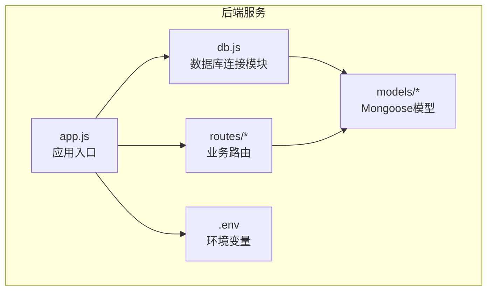
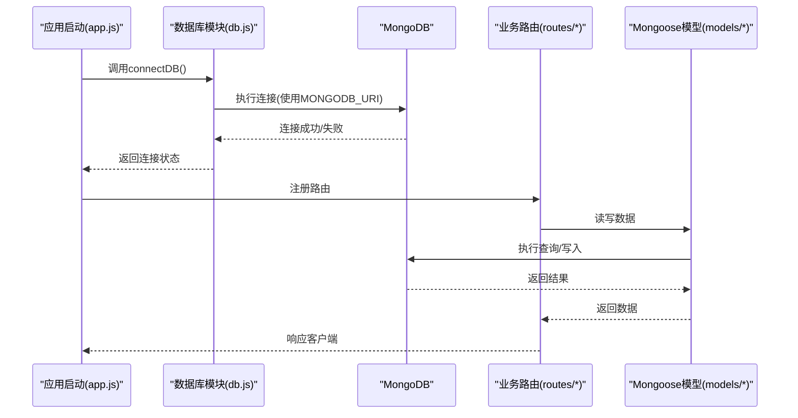
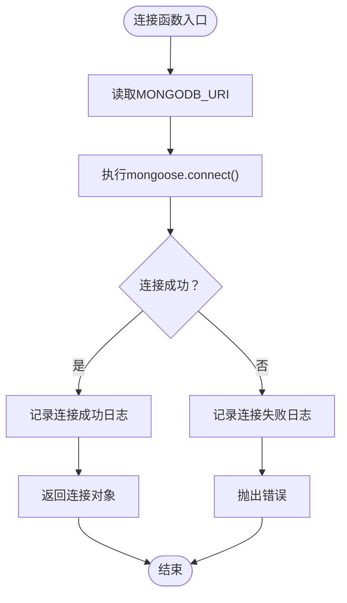
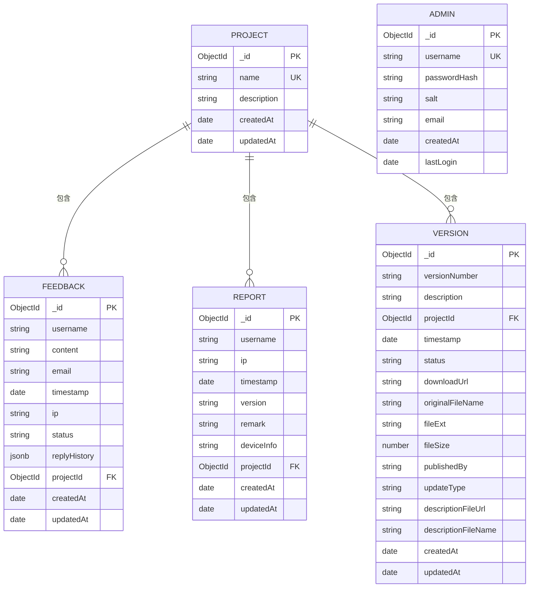
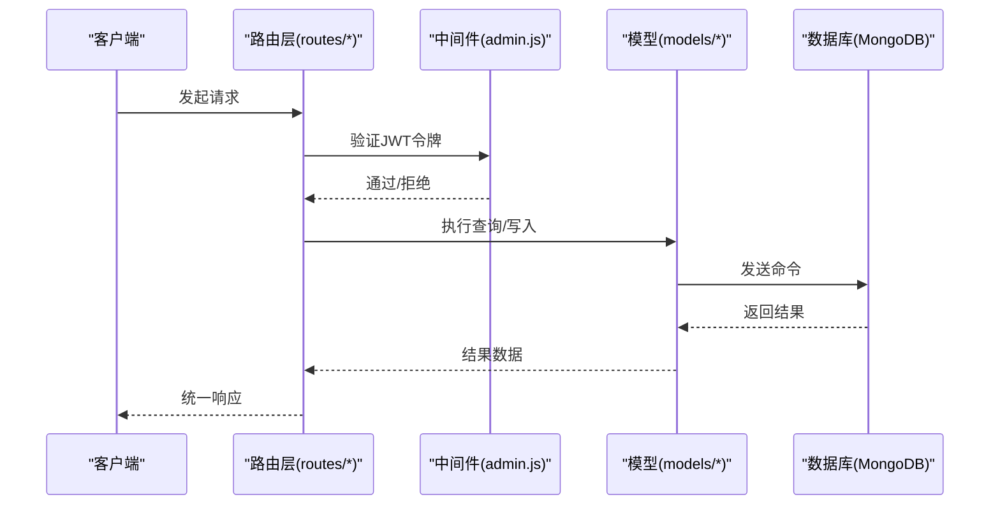
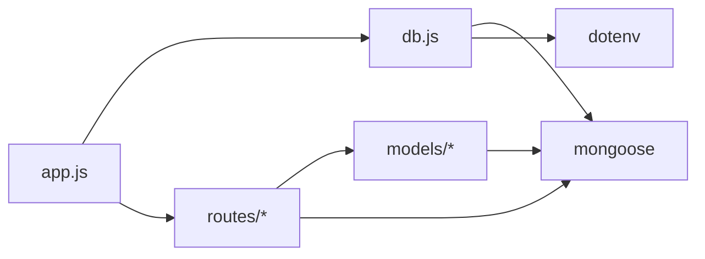

# 数据库连接管理

<cite>
**本文档引用的文件**
- [server/db.js](file://server/db.js)
- [server/.env](file://server/.env)
- [server/app.js](file://server/app.js)
- [server/models/Admin.js](file://server/models/Admin.js)
- [server/models/Feedback.js](file://server/models/Feedback.js)
- [server/models/Project.js](file://server/models/Project.js)
- [server/models/Report.js](file://server/models/Report.js)
- [server/models/Version.js](file://server/models/Version.js)
- [server/routes/admin.js](file://server/routes/admin.js)
- [server/routes/feedback.js](file://server/routes/feedback.js)
- [server/routes/project.js](file://server/routes/project.js)
- [server/routes/report.js](file://server/routes/report.js)
- [server/package.json](file://server/package.json)
- [README.md](file://README.md)
</cite>

## 目录
1. [简介](#简介)
2. [项目结构](#项目结构)
3. [核心组件](#核心组件)
4. [架构概览](#架构概览)
5. [详细组件分析](#详细组件分析)
6. [依赖关系分析](#依赖关系分析)
7. [性能考量](#性能考量)
8. [故障排查指南](#故障排查指南)
9. [结论](#结论)

## 简介
本文件聚焦于WoaX项目的数据库连接管理，系统性阐述MongoDB连接配置、Mongoose ODM使用、连接池与超时设置、重连机制、连接状态监控与错误处理策略，并提供配置文件结构、环境变量使用及连接安全注意事项。同时给出故障排查步骤与性能优化建议，帮助开发者在生产环境中稳定运行数据库连接。

## 项目结构
后端采用Koa框架，数据库连接通过独立模块集中管理，各业务路由在请求处理中直接使用Mongoose模型进行数据操作。整体结构清晰，职责分离明确。

图表来源
- [server/app.js](file://server/app.js#L1-L61)
- [server/db.js](file://server/db.js#L1-L45)
- [server/.env](file://server/.env#L1-L9)

章节来源
- [server/app.js](file://server/app.js#L1-L61)
- [server/db.js](file://server/db.js#L1-L45)
- [server/.env](file://server/.env#L1-L9)

## 核心组件
- 数据库连接模块：负责建立MongoDB连接、监听连接事件、处理应用关闭时的连接释放。
- 环境变量配置：集中存放数据库URI、端口、上传目录等配置项。
- Mongoose模型：定义各业务实体的数据结构与方法，供路由层调用。
- 路由层：封装业务接口，统一进行参数校验、权限控制与错误处理。

章节来源
- [server/db.js](file://server/db.js#L1-L45)
- [server/.env](file://server/.env#L1-L9)
- [server/models/Admin.js](file://server/models/Admin.js#L1-L32)
- [server/models/Feedback.js](file://server/models/Feedback.js#L1-L52)
- [server/models/Project.js](file://server/models/Project.js#L1-L21)
- [server/models/Report.js](file://server/models/Report.js#L1-L22)
- [server/models/Version.js](file://server/models/Version.js#L1-L62)
- [server/routes/admin.js](file://server/routes/admin.js#L1-L128)
- [server/routes/feedback.js](file://server/routes/feedback.js#L1-L187)
- [server/routes/project.js](file://server/routes/project.js#L1-L226)
- [server/routes/report.js](file://server/routes/report.js#L1-L271)

## 架构概览
下图展示从应用启动到数据库连接、再到业务请求处理的整体流程。

图表来源
- [server/app.js](file://server/app.js#L21-L22)
- [server/db.js](file://server/db.js#L10-L24)
- [server/routes/admin.js](file://server/routes/admin.js#L27-L67)
- [server/routes/feedback.js](file://server/routes/feedback.js#L8-L43)
- [server/routes/project.js](file://server/routes/project.js#L10-L25)
- [server/routes/report.js](file://server/routes/report.js#L9-L88)

## 详细组件分析

### 数据库连接模块（db.js）
- 连接建立：通过环境变量MONGODB_URI建立连接，启用统一拓扑与解析器选项。
- 错误处理：捕获连接异常并抛出，便于上层应用感知；日志输出便于调试。
- 事件监听：监听断开与错误事件，便于运维监控与告警。
- 关闭处理：监听SIGINT信号，优雅关闭数据库连接，确保资源释放。

图表来源
- [server/db.js](file://server/db.js#L10-L24)

章节来源
- [server/db.js](file://server/db.js#L1-L45)

### 环境变量与配置文件（.env）
- 数据库URI：MONGODB_URI用于指定MongoDB连接地址，默认指向本地开发库。
- 服务器端口：PORT用于指定HTTP服务监听端口。
- 上传目录：UPLOAD_DIR与最大文件大小限制，用于静态文件服务。

章节来源
- [server/.env](file://server/.env#L1-L9)

### Mongoose ODM使用与模型设计
- 模型定义：各业务模型均基于Mongoose Schema定义，包含字段类型、约束与索引策略。
- 关联关系：通过ObjectId与ref建立跨集合关联，如反馈与项目、版本与项目。
- 时间戳：部分模型启用自动时间戳，简化创建与更新时间维护。
- 方法扩展：模型可扩展实例方法，如管理员模型的密码加盐与哈希验证。

图表来源
- [server/models/Project.js](file://server/models/Project.js#L1-L21)
- [server/models/Feedback.js](file://server/models/Feedback.js#L1-L52)
- [server/models/Report.js](file://server/models/Report.js#L1-L22)
- [server/models/Version.js](file://server/models/Version.js#L1-L62)
- [server/models/Admin.js](file://server/models/Admin.js#L1-L32)

章节来源
- [server/models/Admin.js](file://server/models/Admin.js#L1-L32)
- [server/models/Feedback.js](file://server/models/Feedback.js#L1-L52)
- [server/models/Project.js](file://server/models/Project.js#L1-L21)
- [server/models/Report.js](file://server/models/Report.js#L1-L22)
- [server/models/Version.js](file://server/models/Version.js#L1-L62)

### 路由层与数据库交互
- 权限控制：管理员相关接口通过中间件验证JWT令牌，确保访问安全。
- 参数校验：路由层对必需参数进行校验，避免无效请求进入数据库。
- 数据聚合：统计类接口使用聚合管道进行高效数据汇总与分页。
- 错误处理：统一捕获异常并返回标准化响应，便于前端处理。

图表来源
- [server/routes/admin.js](file://server/routes/admin.js#L101-L125)
- [server/routes/feedback.js](file://server/routes/feedback.js#L72-L111)
- [server/routes/report.js](file://server/routes/report.js#L134-L176)
- [server/routes/project.js](file://server/routes/project.js#L54-L92)

章节来源
- [server/routes/admin.js](file://server/routes/admin.js#L1-L128)
- [server/routes/feedback.js](file://server/routes/feedback.js#L1-L187)
- [server/routes/report.js](file://server/routes/report.js#L1-L271)
- [server/routes/project.js](file://server/routes/project.js#L1-L226)

## 依赖关系分析
- 应用入口依赖数据库模块进行初始化。
- 路由层依赖模型层进行数据操作。
- 数据库模块依赖Mongoose与dotenv。
- 项目使用Mongoose 7.x，具备较新的连接与聚合能力。

图表来源
- [server/app.js](file://server/app.js#L7-L15)
- [server/db.js](file://server/db.js#L1-L2)
- [server/package.json](file://server/package.json#L10-L19)

章节来源
- [server/app.js](file://server/app.js#L1-L61)
- [server/db.js](file://server/db.js#L1-L45)
- [server/package.json](file://server/package.json#L1-L24)

## 性能考量
- 连接池与超时：当前实现未显式配置连接池大小与超时参数。建议在生产环境增加以下配置：
  - 连接池大小：根据并发请求数量与数据库承载能力设置合理上限。
  - 连接超时：设置连接超时与Socket超时，避免长时间阻塞。
  - 重试策略：在连接失败时进行有限次数的指数退避重试。
- 查询优化：
  - 对常用查询字段建立索引，如反馈与报告中的项目ID、时间戳等。
  - 聚合管道中尽量先过滤再排序，减少中间结果集大小。
- 缓存策略：对热点数据（如项目列表）引入缓存，降低数据库压力。
- 日志与监控：结合连接事件与错误事件，建立连接健康度监控与告警。

[本节为通用性能指导，不直接分析具体文件]

## 故障排查指南
- 连接失败
  - 检查MONGODB_URI格式与可达性，确认MongoDB服务正在运行。
  - 查看连接模块的日志输出，定位错误原因。
  - 在应用入口处捕获连接异常，确保问题被及时暴露。
- 断开与错误事件
  - 监听断开与错误事件，记录详细日志，便于后续分析。
  - 在生产环境可考虑在断开时触发重连或报警。
- 权限与认证
  - 确认JWT密钥配置正确，避免令牌验证失败导致的401。
  - 检查管理员账户是否存在，必要时通过默认初始化逻辑创建。
- 路由错误
  - 对缺失参数的请求返回400并附带明确提示。
  - 对未找到资源返回404，避免空指针异常。
- 数据一致性
  - 对外键引用（如项目ID）进行有效性校验，防止脏数据。
  - 使用事务（在支持的MongoDB版本中）保证多步写入的一致性。

章节来源
- [server/db.js](file://server/db.js#L27-L33)
- [server/routes/admin.js](file://server/routes/admin.js#L9-L21)
- [server/routes/admin.js](file://server/routes/admin.js#L70-L98)
- [server/routes/feedback.js](file://server/routes/feedback.js#L12-L19)
- [server/routes/report.js](file://server/routes/report.js#L138-L145)

## 结论
WoaX的数据库连接管理采用集中化设计，通过独立模块完成连接建立、事件监听与优雅关闭，配合Mongoose模型与路由层的规范化实现，满足了项目的核心需求。建议在生产环境中补充连接池与超时配置、索引优化与监控告警，以进一步提升稳定性与性能。同时保持环境变量的安全管理与最小权限原则，确保数据库连接的安全性。