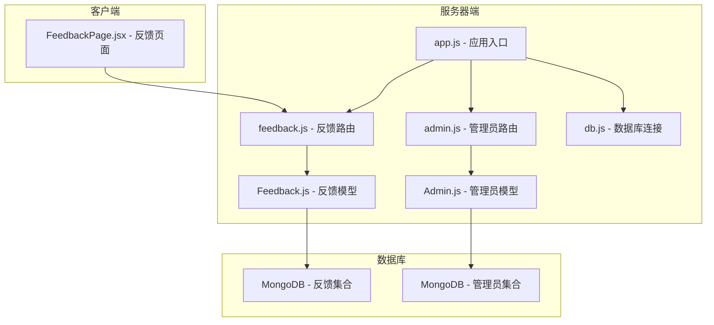
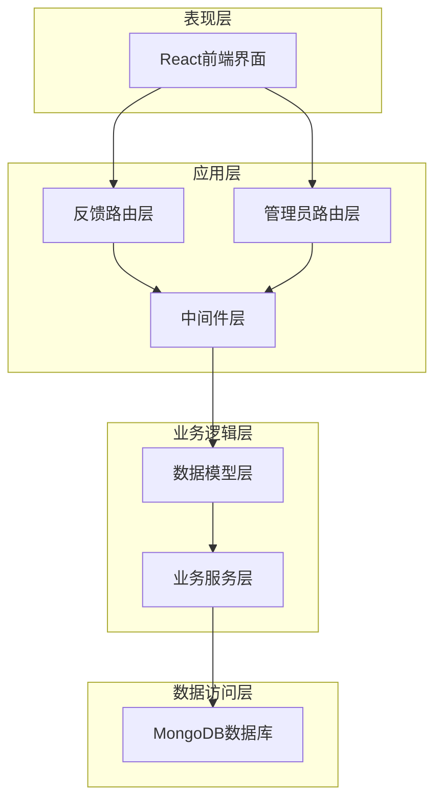
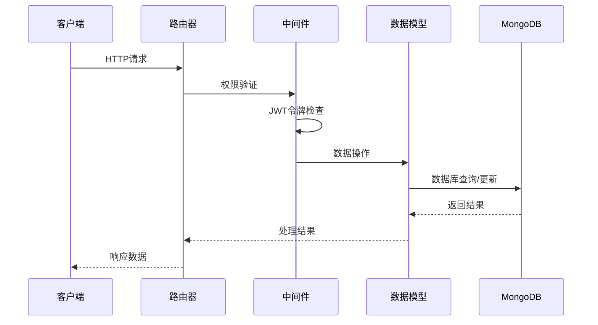
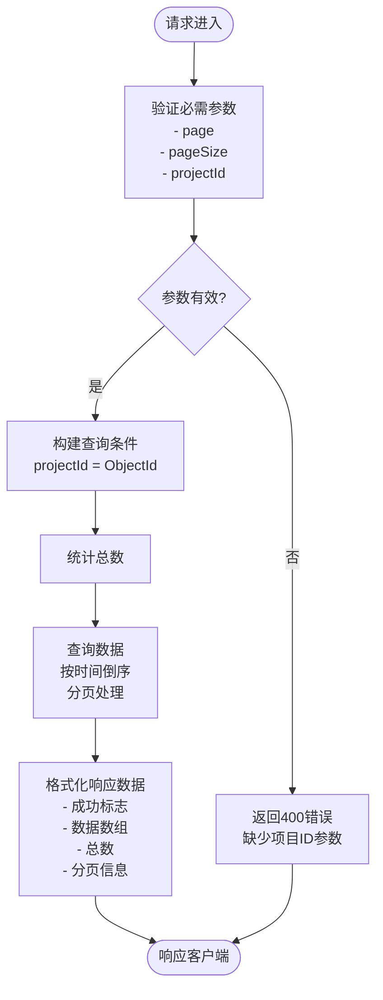
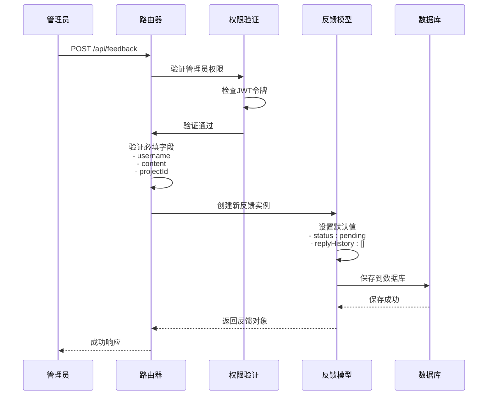
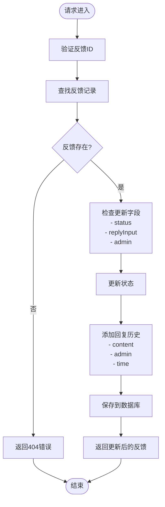
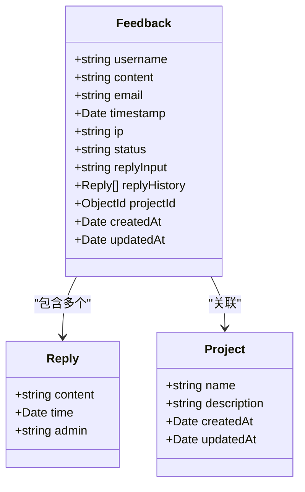
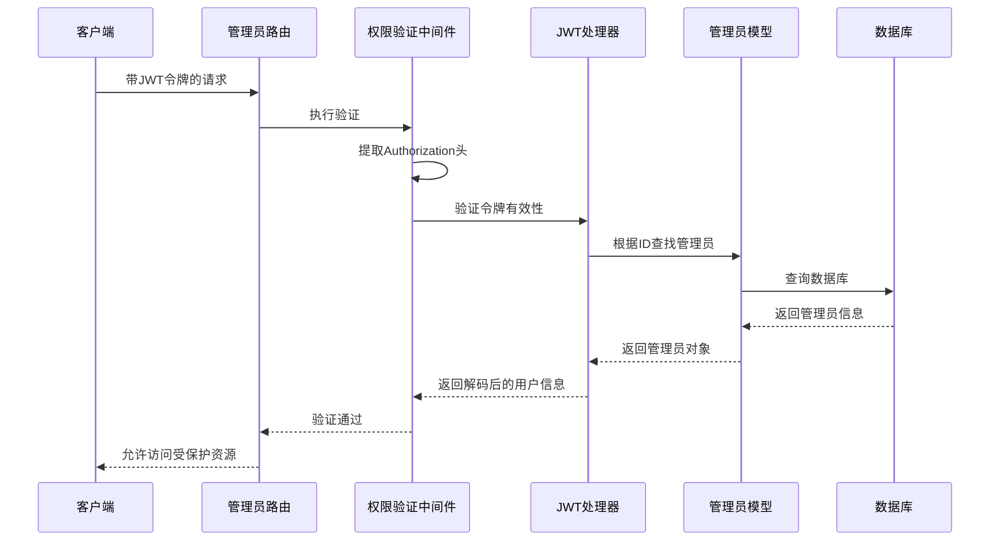
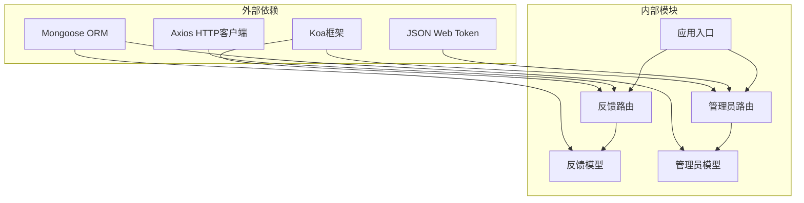
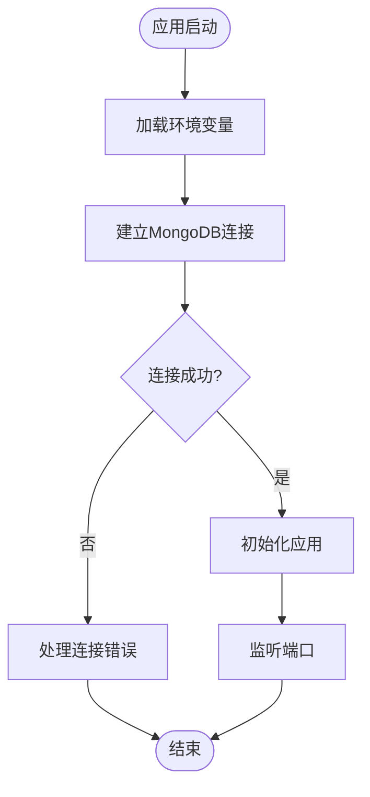

# 反馈管理路由模块

<cite>
**本文档引用的文件**
- [server/routes/feedback.js](file://server/routes/feedback.js)
- [server/models/Feedback.js](file://server/models/Feedback.js)
- [server/routes/admin.js](file://server/routes/admin.js)
- [server/models/Admin.js](file://server/models/Admin.js)
- [server/app.js](file://server/app.js)
- [client/src/pages/FeedbackPage.jsx](file://client/src/pages/FeedbackPage.jsx)
- [server/db.js](file://server/db.js)
- [server/.env](file://server/.env)
- [db/woax.feedbacks.json](file://db/woax.feedbacks.json)
</cite>

## 目录
1. [简介](#简介)
2. [项目结构](#项目结构)
3. [核心组件](#核心组件)
4. [架构概览](#架构概览)
5. [详细组件分析](#详细组件分析)
6. [依赖关系分析](#依赖关系分析)
7. [性能考虑](#性能考虑)
8. [故障排除指南](#故障排除指南)
9. [结论](#结论)

## 简介

WoaX反馈管理路由模块是一个基于Node.js和Koa框架构建的完整反馈收集和处理系统。该模块提供了用户反馈的提交、分类管理、回复处理等功能，支持富文本内容处理和文件附件上传，并实现了完整的反馈状态管理机制。

该系统采用前后端分离架构，后端使用MongoDB作为数据存储，前端使用React和Ant Design构建用户界面。所有管理员操作都需要经过JWT令牌验证，确保系统的安全性。

## 项目结构

反馈管理模块在项目中的组织结构如下：

**图表来源**
- [server/app.js](file://server/app.js#L1-L61)
- [server/routes/feedback.js](file://server/routes/feedback.js#L1-L187)
- [server/routes/admin.js](file://server/routes/admin.js#L1-L128)

**章节来源**
- [server/app.js](file://server/app.js#L1-L61)
- [server/routes/feedback.js](file://server/routes/feedback.js#L1-L187)
- [server/routes/admin.js](file://server/routes/admin.js#L1-L128)

## 核心组件

### 反馈路由控制器

反馈路由模块提供了完整的RESTful API接口，包括：

- **GET /api/feedback** - 获取反馈列表（支持分页和项目筛选）
- **GET /api/feedback/:id** - 获取单个反馈详情
- **POST /api/feedback** - 提交新反馈（需要管理员权限）
- **PUT /api/feedback/:id** - 更新反馈状态和添加回复（需要管理员权限）
- **DELETE /api/feedback/:id** - 删除反馈（需要管理员权限）

### 反馈数据模型

反馈模型定义了完整的数据结构，包括：

- 用户基本信息：用户名、邮箱
- 内容信息：反馈内容（支持富文本）
- 技术信息：时间戳、IP地址、项目关联
- 状态管理：待处理、已审阅、已解决
- 回复历史：管理员回复记录

### 管理员认证系统

系统实现了完整的管理员权限验证机制：

- JWT令牌生成和验证
- 密码哈希存储
- 权限中间件
- 登录状态管理

**章节来源**
- [server/routes/feedback.js](file://server/routes/feedback.js#L7-L187)
- [server/models/Feedback.js](file://server/models/Feedback.js#L1-L52)
- [server/routes/admin.js](file://server/routes/admin.js#L1-L128)
- [server/models/Admin.js](file://server/models/Admin.js#L1-L32)

## 架构概览

反馈管理系统的整体架构采用分层设计：

**图表来源**
- [server/app.js](file://server/app.js#L10-L55)
- [server/routes/feedback.js](file://server/routes/feedback.js#L1-L187)
- [server/routes/admin.js](file://server/routes/admin.js#L1-L128)

### 数据流图

**图表来源**
- [server/routes/feedback.js](file://server/routes/feedback.js#L72-L111)
- [server/routes/admin.js](file://server/routes/admin.js#L100-L125)

## 详细组件分析

### 反馈路由实现

#### GET /api/feedback - 反馈列表获取

该接口实现了完整的分页和筛选功能：

**图表来源**
- [server/routes/feedback.js](file://server/routes/feedback.js#L8-L43)

#### POST /api/feedback - 反馈提交

管理员提交反馈的完整流程：

**图表来源**
- [server/routes/feedback.js](file://server/routes/feedback.js#L72-L111)
- [server/routes/admin.js](file://server/routes/admin.js#L100-L125)

#### PUT /api/feedback/:id - 反馈状态更新

该接口支持同时更新状态和添加回复：

**图表来源**
- [server/routes/feedback.js](file://server/routes/feedback.js#L114-L158)

### 反馈数据模型

反馈模型的设计体现了良好的数据完整性约束：

**图表来源**
- [server/models/Feedback.js](file://server/models/Feedback.js#L3-L49)

### 管理员认证系统

#### JWT令牌验证流程

**图表来源**
- [server/routes/admin.js](file://server/routes/admin.js#L100-L125)

**章节来源**
- [server/routes/feedback.js](file://server/routes/feedback.js#L1-L187)
- [server/models/Feedback.js](file://server/models/Feedback.js#L1-L52)
- [server/routes/admin.js](file://server/routes/admin.js#L1-L128)
- [server/models/Admin.js](file://server/models/Admin.js#L1-L32)

## 依赖关系分析

反馈管理模块的依赖关系图：

**图表来源**
- [server/app.js](file://server/app.js#L1-L20)
- [server/routes/feedback.js](file://server/routes/feedback.js#L1-L6)
- [server/routes/admin.js](file://server/routes/admin.js#L1-L6)

### 数据库连接管理

系统使用独立的数据库连接模块：

**图表来源**
- [server/db.js](file://server/db.js#L10-L24)

**章节来源**
- [server/app.js](file://server/app.js#L1-L61)
- [server/db.js](file://server/db.js#L1-L45)

## 性能考虑

### 数据库优化策略

1. **索引优化**：建议在`projectId`和`timestamp`字段上创建复合索引以提高查询性能
2. **分页查询**：使用`skip()`和`limit()`实现高效的数据分页
3. **查询优化**：只选择必要的字段，避免不必要的数据传输

### 缓存策略

虽然当前实现没有内置缓存，但可以考虑：
- 反馈列表的短期缓存
- 管理员会话信息缓存
- 频繁访问的统计数据缓存

### 安全考虑

1. **输入验证**：所有用户输入都经过严格的验证和清理
2. **权限控制**：所有敏感操作都需要管理员权限
3. **SQL注入防护**：使用Mongoose ORM自动防止注入攻击
4. **XSS防护**：前端使用React的安全渲染机制

## 故障排除指南

### 常见问题及解决方案

#### 数据库连接问题

**症状**：应用启动时报数据库连接失败
**解决方案**：
1. 检查MongoDB服务是否正常运行
2. 验证`MONGODB_URI`环境变量配置
3. 确认网络连接和防火墙设置

#### 权限验证失败

**症状**：管理员操作返回401未授权
**解决方案**：
1. 检查JWT令牌格式和有效期
2. 验证管理员账户是否存在
3. 确认令牌签名密钥配置正确

#### 反馈数据异常

**症状**：反馈列表显示不完整或出现重复数据
**解决方案**：
1. 检查数据库连接状态
2. 验证查询条件和分页参数
3. 确认数据模型定义正确

**章节来源**
- [server/db.js](file://server/db.js#L10-L33)
- [server/routes/admin.js](file://server/routes/admin.js#L100-L125)

## 结论

WoaX反馈管理路由模块是一个设计良好、功能完整的反馈系统。它采用了现代化的技术栈和最佳实践，提供了：

1. **完整的API覆盖**：从基础的CRUD操作到复杂的权限管理
2. **安全的认证机制**：基于JWT的管理员权限验证
3. **灵活的数据模型**：支持富文本内容和回复历史
4. **良好的扩展性**：模块化的架构便于功能扩展

该系统为用户提供了直观的反馈收集和管理界面，为管理员提供了强大的后台管理工具。通过合理的数据库设计和安全措施，确保了系统的稳定性和可靠性。

未来可以考虑的功能增强包括：
- 反馈分类和标签系统
- 优先级管理功能
- 自动化响应和通知机制
- 更丰富的统计和报告功能