# 数据统计路由模块

<cite>
**本文档引用的文件**
- [server/routes/report.js](file://server/routes/report.js)
- [server/models/Report.js](file://server/models/Report.js)
- [client/src/pages/StatisticPage/index.jsx](file://client/src/pages/StatisticPage/index.jsx)
- [client/src/pages/StatisticPage/ChartPanel.jsx](file://client/src/pages/StatisticPage/ChartPanel.jsx)
- [client/src/pages/StatisticPage/DataTable.jsx](file://client/src/pages/StatisticPage/DataTable.jsx)
- [client/src/pages/StatisticPage/ReportFormModal.jsx](file://client/src/pages/StatisticPage/ReportFormModal.jsx)
- [client/src/pages/StatisticPage/ReportModal.jsx](file://client/src/pages/StatisticPage/ReportModal.jsx)
- [server/routes/admin.js](file://server/routes/admin.js)
- [server/app.js](file://server/app.js)
- [client/src/components/AuthButton.jsx](file://client/src/components/AuthButton.jsx)
- [db/woax.statistics.json](file://db/woax.statistics.json)
</cite>

## 目录
1. [简介](#简介)
2. [项目结构](#项目结构)
3. [核心组件](#核心组件)
4. [架构概览](#架构概览)
5. [详细组件分析](#详细组件分析)
6. [依赖关系分析](#依赖关系分析)
7. [性能考虑](#性能考虑)
8. [故障排除指南](#故障排除指南)
9. [结论](#结论)
10. [附录](#附录)

## 简介

WoaX数据统计路由模块是一个基于Koa.js和MongoDB的用户统计数据收集与管理系统。该模块提供了完整的统计数据生命周期管理，包括数据上报、聚合查询、用户详情查看、删除操作等功能。系统采用前后端分离架构，前端使用React + Ant Design构建用户界面，后端通过RESTful API提供数据服务。

该模块的核心特性包括：
- 基于项目维度的数据隔离和权限控制
- 每用户最后一次上报的智能聚合
- 支持管理员权限的自主上报功能
- 完整的CRUD操作支持
- 实时图表展示和数据可视化
- 分页查询和数据筛选

## 项目结构

数据统计路由模块在项目中的组织结构如下：

```mermaid
graph TB
subgraph "服务器端"
A[server/app.js] --> B[server/routes/report.js]
A --> C[server/routes/admin.js]
B --> D[server/models/Report.js]
C --> E[server/models/Admin.js]
end
subgraph "客户端"
F[client/src/pages/StatisticPage/index.jsx] --> G[client/src/pages/StatisticPage/ChartPanel.jsx]
F --> H[client/src/pages/StatisticPage/DataTable.jsx]
F --> I[client/src/pages/StatisticPage/ReportFormModal.jsx]
F --> J[client/src/pages/StatisticPage/ReportModal.jsx]
F --> K[client/src/components/AuthButton.jsx]
end
L[数据库: db/woax.statistics.json] <- --> D
M[静态文件: uploads/] <- --> A
```

**图表来源**
- [server/app.js](file://server/app.js#L1-L61)
- [server/routes/report.js](file://server/routes/report.js#L1-L271)
- [server/models/Report.js](file://server/models/Report.js#L1-L22)

**章节来源**
- [server/app.js](file://server/app.js#L1-L61)
- [server/routes/report.js](file://server/routes/report.js#L1-L271)

## 核心组件

### 后端路由组件

数据统计路由模块的核心路由组件包括：

#### 统计数据聚合路由
- **路径**: `/api/report/getReportData`
- **方法**: POST
- **功能**: 每用户最后一次上报数据的聚合查询
- **参数**: 
  - `pageCurrent`: 当前页码，默认1
  - `pageSize`: 每页大小，默认20
  - `projectId`: 项目ID（必需）

#### 用户详情路由
- **路径**: `/api/report/user/:username`
- **方法**: GET
- **功能**: 获取指定用户的全部上报记录
- **参数**:
  - `page`: 页码，默认1
  - `pageSize`: 每页大小，默认10
  - `projectId`: 项目ID（必需）

#### 数据上报路由
- **路径**: `/api/report/addReport`
- **方法**: POST
- **功能**: 标准用户上报数据
- **参数**: 包含用户基本信息和设备信息

#### 自主上报路由
- **路径**: `/api/report/submit`
- **方法**: POST
- **功能**: 管理员自主上报数据
- **权限**: 需要管理员权限

#### 数据管理路由
- **路径**: `/api/report/:id`
- **方法**: GET/DELETE
- **功能**: 获取和删除单条统计数据

**章节来源**
- [server/routes/report.js](file://server/routes/report.js#L8-L271)

### 前端组件

#### 主页面组件
- **文件**: `client/src/pages/StatisticPage/index.jsx`
- **功能**: 整体页面布局和状态管理
- **特性**: 
  - 项目切换监听
  - 数据加载和刷新
  - 弹窗管理

#### 图表面板组件
- **文件**: `client/src/pages/StatisticPage/ChartPanel.jsx`
- **功能**: 数据可视化展示
- **图表类型**: 柱状图、折线图、饼图

#### 数据表格组件
- **文件**: `client/src/pages/StatisticPage/DataTable.jsx`
- **功能**: 结构化数据显示
- **特性**: 分页、排序、筛选

#### 表单模态框
- **文件**: `client/src/pages/StatisticPage/ReportFormModal.jsx`
- **功能**: 自主上报表单
- **验证**: 前端表单验证

#### 用户详情模态框
- **文件**: `client/src/pages/StatisticPage/ReportModal.jsx`
- **功能**: 用户历史记录查看
- **特性**: 分页展示

**章节来源**
- [client/src/pages/StatisticPage/index.jsx](file://client/src/pages/StatisticPage/index.jsx#L1-L262)
- [client/src/pages/StatisticPage/ChartPanel.jsx](file://client/src/pages/StatisticPage/ChartPanel.jsx#L1-L129)
- [client/src/pages/StatisticPage/DataTable.jsx](file://client/src/pages/StatisticPage/DataTable.jsx#L1-L124)

## 架构概览

数据统计路由模块采用经典的MVC架构模式，结合现代前端框架的优势：

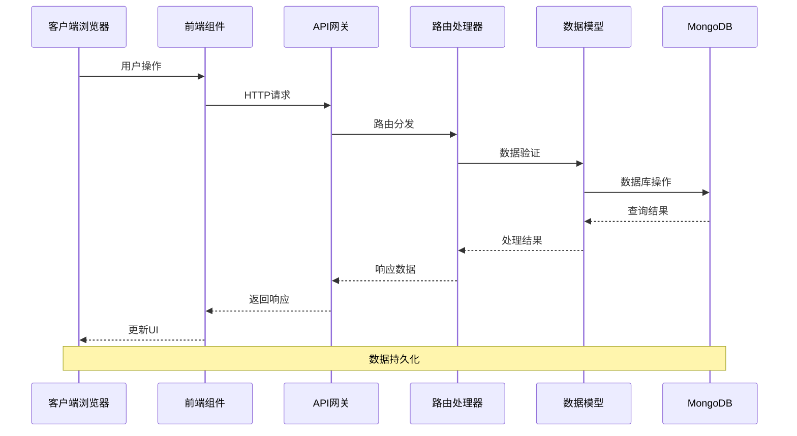

**图表来源**
- [server/app.js](file://server/app.js#L47-L55)
- [server/routes/report.js](file://server/routes/report.js#L9-L88)

### 数据流设计

系统采用异步数据流处理机制：

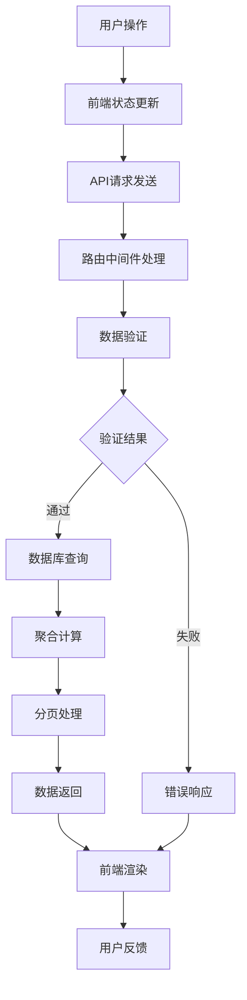

**图表来源**
- [server/routes/report.js](file://server/routes/report.js#L9-L88)
- [client/src/pages/StatisticPage/index.jsx](file://client/src/pages/StatisticPage/index.jsx#L58-L85)

## 详细组件分析

### 路由处理流程

#### 统计数据聚合处理

聚合查询是整个模块的核心功能，实现了每用户最后一次上报数据的智能提取：

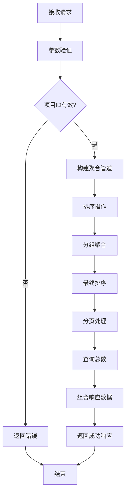

**图表来源**
- [server/routes/report.js](file://server/routes/report.js#L9-L88)

#### 用户详情查询处理

用户详情查询提供了完整的用户历史记录展示：

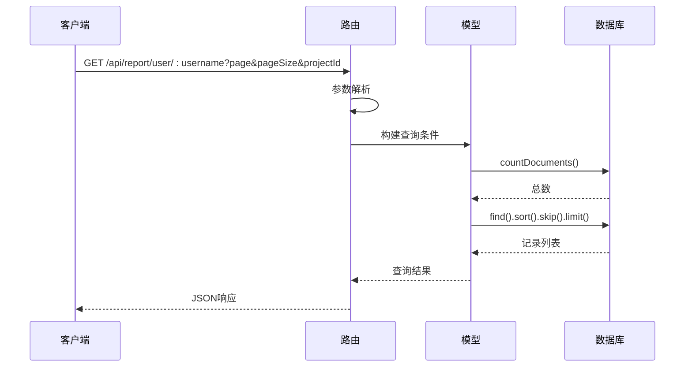

**图表来源**
- [server/routes/report.js](file://server/routes/report.js#L91-L131)

### 数据模型设计

#### 报告数据模型

Report模型定义了统计数据的结构和约束：

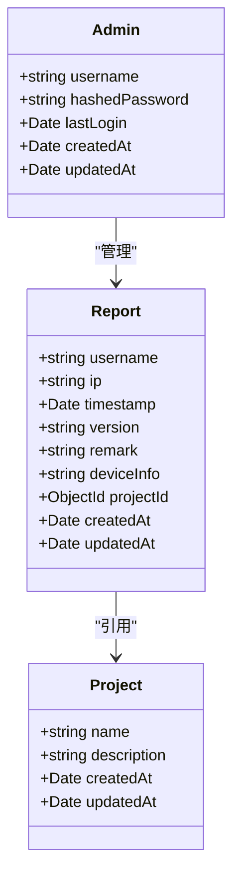

**图表来源**
- [server/models/Report.js](file://server/models/Report.js#L3-L19)

#### 数据验证规则

系统实现了多层次的数据验证机制：

| 字段名 | 必需性 | 类型 | 验证规则 | 描述 |
|--------|--------|------|----------|------|
| username | 必需 | String | 非空验证 | 用户标识符 |
| ip | 可选 | String | IP地址格式 | 用户IP地址 |
| userAgent | 可选 | String | 字符串验证 | 浏览器标识 |
| deviceInfo | 可选 | String | 字符串验证 | 设备信息 |
| location | 可选 | String | 字符串验证 | 用户位置 |
| version | 可选 | String | 字符串验证 | 应用版本 |
| remark | 可选 | String | 字符串验证 | 备注信息 |
| projectId | 必需 | ObjectId | 存在性验证 | 项目关联 |

**章节来源**
- [server/models/Report.js](file://server/models/Report.js#L5-L15)

### 前端交互设计

#### 权限控制组件

AuthButton组件实现了统一的权限控制机制：

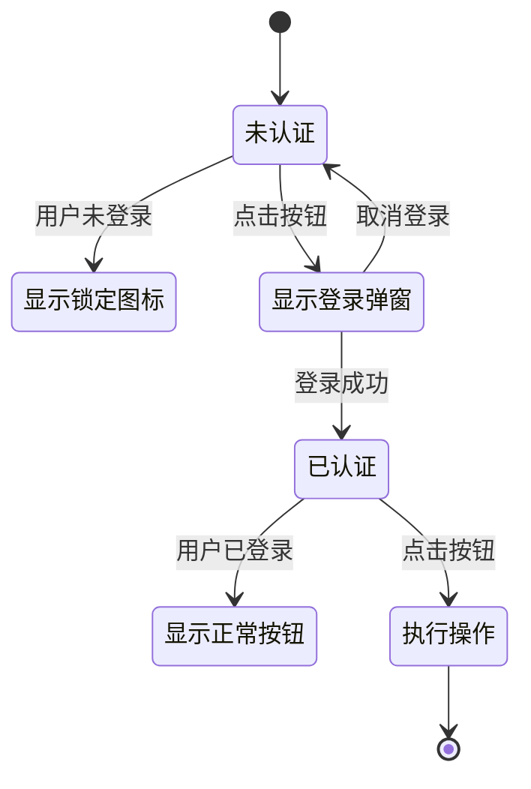

**图表来源**
- [client/src/components/AuthButton.jsx](file://client/src/components/AuthButton.jsx#L12-L41)

#### 数据可视化组件

ChartPanel组件提供了三种类型的统计图表：

1. **版本分布柱状图**: 展示不同版本的用户分布
2. **时间趋势折线图**: 展示数据随时间的变化趋势
3. **设备分布饼图**: 展示设备类型的占比情况

**章节来源**
- [client/src/pages/StatisticPage/ChartPanel.jsx](file://client/src/pages/StatisticPage/ChartPanel.jsx#L10-L51)

### API接口规范

#### 统计数据聚合接口

| 属性 | 值 |
|------|-----|
| 方法 | POST |
| 路径 | `/api/report/getReportData` |
| 请求头 | Content-Type: application/json |
| 请求体 | `{ pageCurrent, pageSize, projectId }` |
| 成功响应 | `{ success: true, data: Array, total: Number }` |
| 错误响应 | `{ success: false, message: String, error?: String }` |

#### 用户详情查询接口

| 属性 | 值 |
|------|-----|
| 方法 | GET |
| 路径 | `/api/report/user/:username` |
| 查询参数 | `page, pageSize, projectId` |
| 成功响应 | `{ success: true, data: Array, total: Number, page: Number, pageSize: Number }` |
| 错误响应 | `{ success: false, message: String, error?: String }` |

#### 数据上报接口

| 属性 | 值 |
|------|-----|
| 方法 | POST |
| 路径 | `/api/report/addReport` |
| 请求体 | `{ username, ip, userAgent, deviceInfo, location, version, remark, projectId }` |
| 成功响应 | `{ success: true, message: String, data: Object }` |
| 错误响应 | `{ success: false, message: String, error?: String }` |

**章节来源**
- [server/routes/report.js](file://server/routes/report.js#L9-L271)

## 依赖关系分析

### 技术栈依赖

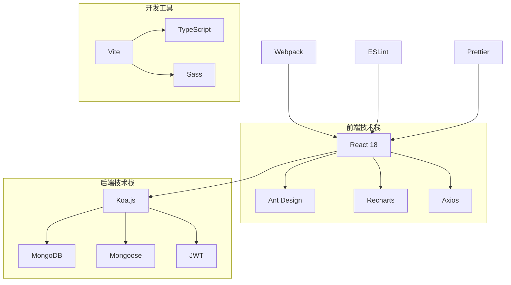

### 模块间依赖

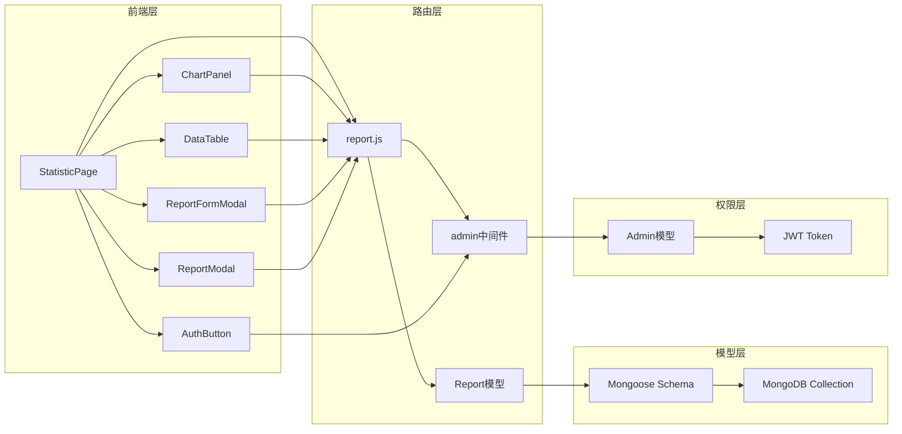

**图表来源**
- [server/routes/report.js](file://server/routes/report.js#L1-L4)
- [client/src/pages/StatisticPage/index.jsx](file://client/src/pages/StatisticPage/index.jsx#L1-L10)

**章节来源**
- [server/app.js](file://server/app.js#L10-L16)

### 数据库设计

#### 集合结构

统计信息集合采用了灵活的JSON文档结构，支持扩展字段：

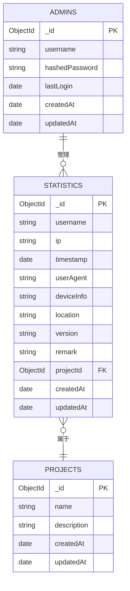

**图表来源**
- [server/models/Report.js](file://server/models/Report.js#L3-L19)
- [db/woax.statistics.json](file://db/woax.statistics.json#L1-L50)

**章节来源**
- [db/woax.statistics.json](file://db/woax.statistics.json#L1-L800)

## 性能考虑

### 查询优化策略

#### 聚合查询优化

系统采用了高效的聚合查询策略来处理大量统计数据：

1. **索引优化**: 在`username`和`timestamp`字段上建立复合索引
2. **分组优化**: 使用`$group`操作符减少数据传输量
3. **分页优化**: 采用游标分页避免全量数据加载

#### 缓存策略

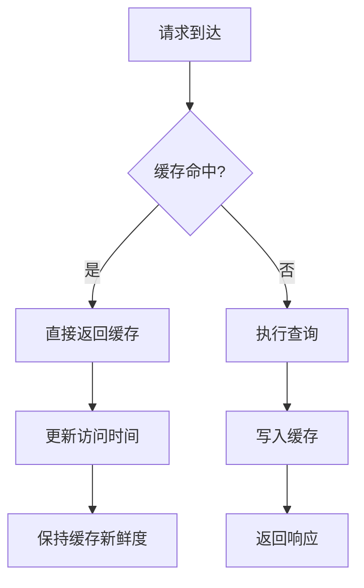

#### 并发控制

系统实现了合理的并发控制机制：

- **连接池管理**: 限制同时活跃的数据库连接数
- **请求队列**: 处理高并发场景下的请求排队
- **超时控制**: 设置合理的查询超时时间

### 前端性能优化

#### 组件懒加载

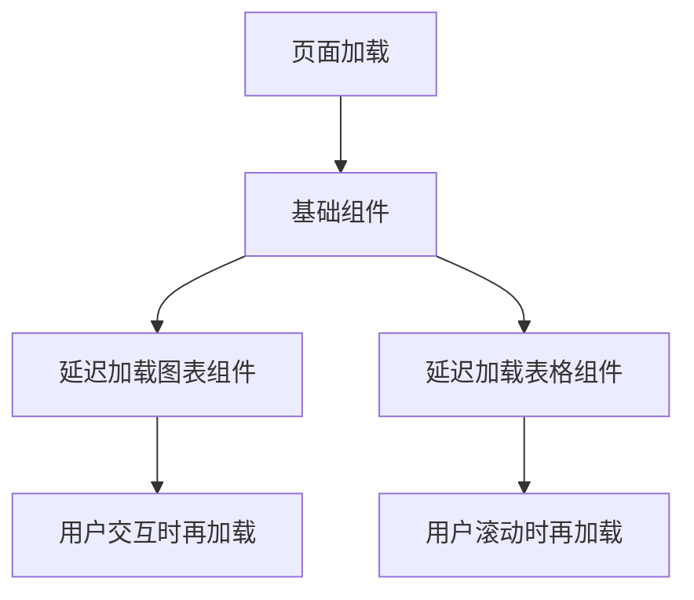

#### 数据分片

- **无限滚动**: 大数据集采用虚拟滚动技术
- **增量加载**: 按需加载更多数据
- **预加载策略**: 预加载下一页数据

## 故障排除指南

### 常见问题及解决方案

#### 数据库连接问题

**症状**: 页面无法加载或出现连接超时

**诊断步骤**:
1. 检查MongoDB服务状态
2. 验证连接字符串配置
3. 确认网络连通性

**解决方案**:
```javascript
// 连接配置示例
const connectDB = async () => {
  try {
    await mongoose.connect(process.env.MONGODB_URI, {
      useNewUrlParser: true,
      useUnifiedTopology: true,
      serverSelectionTimeoutMS: 5000,
      socketTimeoutMS: 45000,
    });
    console.log('数据库连接成功');
  } catch (error) {
    console.error('数据库连接失败:', error);
    throw error;
  }
};
```

#### 权限验证失败

**症状**: 管理员操作被拒绝

**诊断步骤**:
1. 检查JWT令牌有效性
2. 验证管理员账户状态
3. 确认令牌过期时间

**解决方案**:
```javascript
// 权限验证中间件
const verifyAdmin = async (ctx, next) => {
  try {
    const token = ctx.headers.authorization?.split(' ')[1];
    if (!token) {
      ctx.status = 401;
      ctx.body = { success: false, message: '未提供令牌' };
      return;
    }
    
    const decoded = jwt.verify(token, JWT_SECRET);
    const admin = await Admin.findById(decoded.id);
    
    if (!admin) {
      ctx.status = 401;
      ctx.body = { success: false, message: '无效的令牌' };
      return;
    }
    
    ctx.state.admin = admin;
    await next();
  } catch (error) {
    ctx.status = 401;
    ctx.body = { success: false, message: '无效的令牌' };
  }
};
```

#### 数据聚合异常

**症状**: 统计数据不准确或查询缓慢

**诊断步骤**:
1. 检查聚合管道的执行计划
2. 验证索引使用情况
3. 分析查询性能指标

**解决方案**:
```javascript
// 优化后的聚合查询
const optimizedPipeline = [
  { $match: { projectId: projectObjectId } },
  { $sort: { timestamp: -1 } },
  { 
    $group: {
      _id: { $ifNull: ["$username", "未知用户"] },
      username: { $first: "$username" },
      ip: { $first: "$ip" },
      timestamp: { $first: "$timestamp" },
      version: { $first: "$version" },
      remark: { $first: "$remark" },
      deviceInfo: { $first: "$deviceInfo" },
      docId: { $first: "$_id" }
    }
  },
  { $sort: { timestamp: -1 } },
  { $skip: (pageCurrent - 1) * pageSize },
  { $limit: pageSize }
];
```

**章节来源**
- [server/routes/admin.js](file://server/routes/admin.js#L101-L125)
- [server/routes/report.js](file://server/routes/report.js#L26-L51)

### 日志监控

系统实现了完善的日志监控机制：

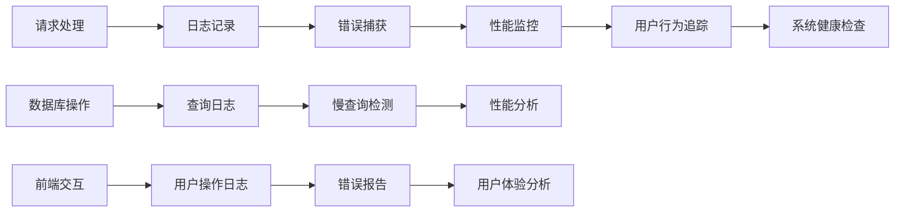

## 结论

WoaX数据统计路由模块是一个设计合理、功能完备的统计数据管理解决方案。该模块具有以下优势：

### 技术优势
- **架构清晰**: 采用MVC架构，职责分离明确
- **性能优秀**: 优化的聚合查询和分页机制
- **扩展性强**: 灵活的数据模型设计支持功能扩展
- **安全性好**: 完善的权限控制和数据验证机制

### 功能特点
- **实时性强**: 支持实时数据展示和更新
- **可视化丰富**: 多种图表类型满足不同分析需求
- **用户体验佳**: 响应式设计和友好的交互体验
- **管理便捷**: 完整的CRUD操作支持

### 改进建议
1. **增加数据导出功能**: 支持CSV、Excel等格式导出
2. **增强搜索能力**: 添加全文搜索和高级筛选功能
3. **优化移动端体验**: 改进移动端的触摸交互
4. **增加数据备份**: 实现自动化的数据备份机制

该模块为WoaX项目提供了坚实的数据统计基础，能够有效支撑项目的运营分析和用户行为研究需求。

## 附录

### 开发指南

#### 环境配置

1. **安装依赖**:
```bash
npm install
```

2. **配置环境变量**:
```bash
# .env文件示例
MONGODB_URI=mongodb://localhost:27017/woax
JWT_SECRET=your-super-secret-key
PORT=3001
```

3. **启动服务**:
```bash
# 后端
npm run server

# 前端
npm run client
```

#### API使用示例

##### 获取统计数据聚合
```javascript
// 前端调用示例
const response = await axios.post('/api/report/getReportData', {
  pageCurrent: 1,
  pageSize: 20,
  projectId: 'your-project-id'
});
```

##### 用户自主上报
```javascript
// 管理员上报示例
const response = await axios.post('/api/report/submit', {
  username: 'admin',
  ip: '127.0.0.1',
  userAgent: 'Mozilla/5.0...',
  deviceInfo: 'Windows - Chrome',
  location: 'Beijing',
  version: '1.0.0',
  remark: 'Test report',
  projectId: 'your-project-id'
}, {
  headers: {
    'Authorization': 'Bearer your-jwt-token'
  }
});
```

#### 最佳实践

1. **数据验证**: 始终在前端和后端进行双重验证
2. **错误处理**: 实现统一的错误处理和用户反馈机制
3. **性能监控**: 定期监控查询性能和系统资源使用
4. **安全防护**: 实施适当的CSRF保护和输入过滤
5. **文档维护**: 保持API文档和代码注释的同步更新