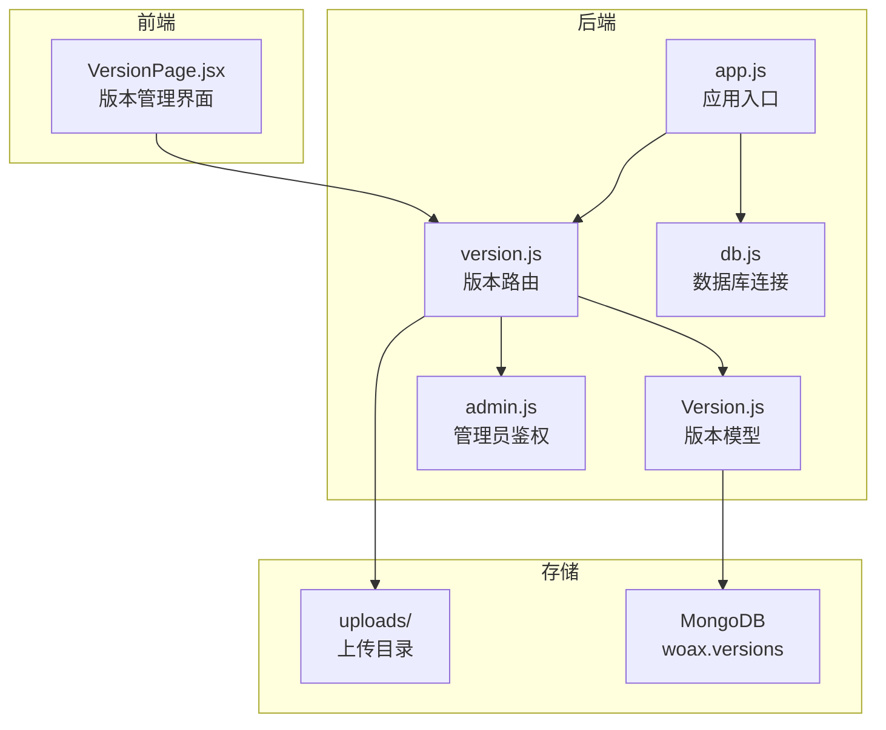
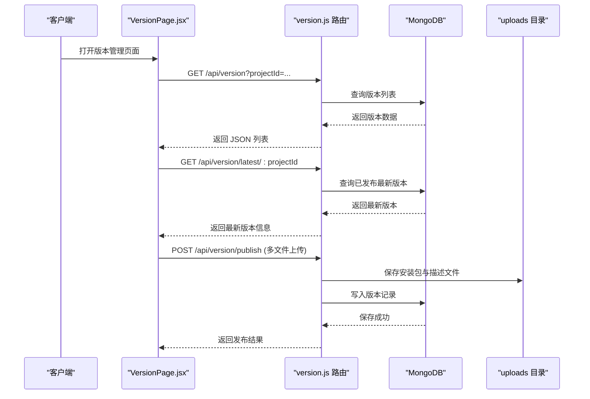
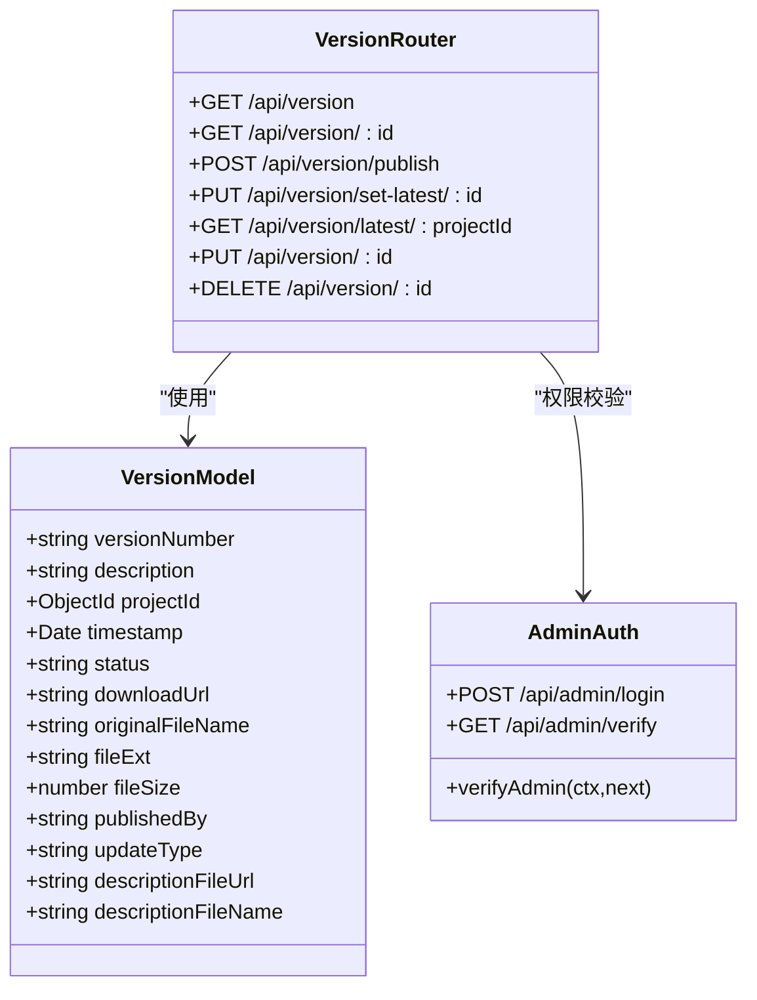

# 版本管理路由模块

<cite>
**本文档引用的文件**
- [server/routes/version.js](file://server/routes/version.js)
- [server/models/Version.js](file://server/models/Version.js)
- [server/app.js](file://server/app.js)
- [client/src/pages/VersionPage.jsx](file://client/src/pages/VersionPage.jsx)
- [server/.env](file://server/.env)
- [server/db.js](file://server/db.js)
- [server/routes/admin.js](file://server/routes/admin.js)
- [db/woax.versions.json](file://db/woax.versions.json)
- [latest-example.yml](file://latest-example.yml)
- [README.md](file://README.md)
- [api-usage-latest-version.md](file://api-usage-latest-version.md)
- [update-type-feature.md](file://update-type-feature.md)
</cite>

## 目录
1. [简介](#简介)
2. [项目结构](#项目结构)
3. [核心组件](#核心组件)
4. [架构总览](#架构总览)
5. [详细组件分析](#详细组件分析)
6. [依赖关系分析](#依赖关系分析)
7. [性能考虑](#性能考虑)
8. [故障排除指南](#故障排除指南)
9. [结论](#结论)
10. [附录](#附录)

## 简介
本文件为 WoaX 项目的版本管理路由模块提供全面的技术文档，涵盖应用版本信息管理与发布的路由设计、版本 CRUD 接口实现、文件上传处理、版本比较与自动更新机制、版本号管理、下载链接处理与兼容性检查，并提供完整的 API 文档与部署指南。该模块基于 Koa 路由与 MongoDB 数据库存储，支持管理员权限控制、中文文件名处理、多文件上传与静态资源分发。

## 项目结构
版本管理模块位于后端 server/routes/version.js，配合数据模型 server/models/Version.js，前端 client/src/pages/VersionPage.jsx 提供可视化界面与交互。静态资源上传目录 server/uploads 由中间件统一提供下载服务。

图表来源
- [server/routes/version.js](file://server/routes/version.js#L1-L432)
- [server/models/Version.js](file://server/models/Version.js#L1-L62)
- [server/app.js](file://server/app.js#L1-L61)
- [server/db.js](file://server/db.js#L1-L45)
- [server/routes/admin.js](file://server/routes/admin.js#L1-L128)

章节来源
- [server/routes/version.js](file://server/routes/version.js#L1-L432)
- [server/models/Version.js](file://server/models/Version.js#L1-L62)
- [server/app.js](file://server/app.js#L1-L61)
- [server/db.js](file://server/db.js#L1-L45)
- [server/routes/admin.js](file://server/routes/admin.js#L1-L128)

## 核心组件
- 版本路由模块：提供版本列表查询、详情查看、发布新版本、设置最新版本、更新状态、删除版本等接口；集成管理员权限校验与多文件上传。
- 版本数据模型：定义版本号、描述、项目关联、时间戳、状态、下载链接、原始文件名、文件扩展名、文件大小、发布者、更新方式、描述文件 URL 与名称等字段。
- 应用入口与中间件：注册路由、CORS、BodyParser、静态资源服务（/uploads）、数据库连接。
- 管理员鉴权：JWT 令牌验证，保护需要管理员权限的操作。
- 前端版本页面：展示版本列表、最新版本信息、上传安装包与描述文件、下载、设置最新版本、删除版本、更新状态与描述等。

章节来源
- [server/routes/version.js](file://server/routes/version.js#L82-L432)
- [server/models/Version.js](file://server/models/Version.js#L3-L60)
- [server/app.js](file://server/app.js#L30-L55)
- [server/routes/admin.js](file://server/routes/admin.js#L100-L125)
- [client/src/pages/VersionPage.jsx](file://client/src/pages/VersionPage.jsx#L1-L890)

## 架构总览
版本管理模块采用前后端分离架构：
- 前端通过 RESTful API 与后端交互，使用 axios 发起请求。
- 后端使用 Koa 路由处理请求，multer 实现多文件上传，MongoDB 存储版本数据。
- 静态资源通过 /uploads 目录提供下载，支持中文文件名修复与 Hash 重命名。
- 管理员权限通过 JWT 令牌验证，保护发布、更新、删除等敏感操作。

图表来源
- [client/src/pages/VersionPage.jsx](file://client/src/pages/VersionPage.jsx#L72-L120)
- [server/routes/version.js](file://server/routes/version.js#L82-L256)
- [server/app.js](file://server/app.js#L34-L45)

章节来源
- [client/src/pages/VersionPage.jsx](file://client/src/pages/VersionPage.jsx#L72-L120)
- [server/routes/version.js](file://server/routes/version.js#L82-L256)
- [server/app.js](file://server/app.js#L34-L45)

## 详细组件分析

### 版本路由模块（server/routes/version.js）
- 路由前缀：/api/version
- 关键功能：
  - 获取版本列表：支持分页与项目筛选，按时间倒序排序。
  - 获取单个版本详情：按 ID 查询。
  - 发布新版本：管理员权限，多文件上传（安装包与描述文件），构建下载链接，保存原始文件名与扩展名，支持 Hash 重命名。
  - 设置为最新版本：管理员权限，将同项目其他已发布版本标记为弃用，当前版本标记为已发布。
  - 获取最新版本：公开接口，查询状态为已发布的最新版本。
  - 更新版本：管理员权限，支持更新状态、更新方式、版本号与描述。
  - 删除版本：管理员权限，删除对应文件与数据库记录。
- 文件上传与中文文件名处理：
  - 使用 multer diskStorage 配置上传目录，动态创建 uploads 目录。
  - 文件名修复函数处理常见中文乱码与 URL 编码，支持 Hash 重命名与保持原文件名两种模式。
  - 描述文件（latest.yml）可选上传，用于自动更新检查。
- 权限控制：除获取最新版本外，其余接口均需管理员 JWT 令牌。

章节来源
- [server/routes/version.js](file://server/routes/version.js#L82-L432)

### 版本数据模型（server/models/Version.js）
- 字段定义：
  - versionNumber：字符串，必填，版本号。
  - description：字符串，版本描述。
  - projectId：ObjectId，关联项目，必填。
  - timestamp：日期，默认当前时间。
  - status：枚举 draft/published/deprecated，默认 draft。
  - downloadUrl：字符串，下载链接。
  - originalFileName：字符串，原始文件名。
  - fileExt：字符串，文件扩展名。
  - fileSize：数值，文件大小。
  - publishedBy：字符串，发布者。
  - updateType：枚举 force/active/passive，默认 passive。
  - descriptionFileUrl：字符串，描述文件 URL。
  - descriptionFileName：字符串，描述文件名。
- 时间戳：自动维护 createdAt/updatedAt。

章节来源
- [server/models/Version.js](file://server/models/Version.js#L3-L60)

### 应用入口与中间件（server/app.js）
- 中间件：
  - CORS、BodyParser。
  - 静态资源服务：拦截 /uploads* 请求，读取本地文件并返回。
- 路由注册：将版本、反馈、报告、项目、管理员路由挂载到 /api/*。
- 数据库连接：调用 db.js 连接 MongoDB。
- 上传目录：启动时确保 uploads 目录存在。

章节来源
- [server/app.js](file://server/app.js#L30-L55)

### 管理员鉴权（server/routes/admin.js）
- 登录：校验用户名与密码，签发 JWT 令牌。
- 校验：解析 JWT，验证管理员身份。
- 中间件 verifyAdmin：从请求头提取令牌，验证后注入 ctx.state.admin 并放行。

章节来源
- [server/routes/admin.js](file://server/routes/admin.js#L26-L125)

### 前端版本页面（client/src/pages/VersionPage.jsx）
- 功能：
  - 加载版本列表与最新版本信息。
  - 发布新版本：上传安装包与描述文件，选择更新方式，可启用 Hash 重命名。
  - 查看详情：显示版本号、描述、状态、更新方式、文件信息、下载链接。
  - 更新状态与描述：支持草稿/已发布/已弃用切换与更新方式调整。
  - 设置最新版本：将当前版本标记为已发布，其他版本降级为已弃用。
  - 删除版本：确认后删除并清理文件。
  - 下载：根据保存的原始文件名修复中文编码并触发下载。
- 交互：
  - 使用 Ant Design 组件构建表单与表格。
  - 通过 axios 调用后端 API。
  - 对中文文件名进行二次修复以提升兼容性。

章节来源
- [client/src/pages/VersionPage.jsx](file://client/src/pages/VersionPage.jsx#L1-L890)

### 数据库样例与示例文件
- 数据库样例：woax.versions.json 展示了已发布与已弃用版本的典型字段。
- 示例描述文件：latest-example.yml 展示了描述文件的结构与字段，可用于自动更新检查。

章节来源
- [db/woax.versions.json](file://db/woax.versions.json#L1-L52)
- [latest-example.yml](file://latest-example.yml#L1-L38)

## 依赖关系分析

图表来源
- [server/models/Version.js](file://server/models/Version.js#L3-L60)
- [server/routes/version.js](file://server/routes/version.js#L82-L432)
- [server/routes/admin.js](file://server/routes/admin.js#L100-L125)

章节来源
- [server/models/Version.js](file://server/models/Version.js#L3-L60)
- [server/routes/version.js](file://server/routes/version.js#L82-L432)
- [server/routes/admin.js](file://server/routes/admin.js#L100-L125)

## 性能考虑
- 分页查询：版本列表接口支持分页与项目筛选，避免一次性加载大量数据。
- 文件大小限制：通过环境变量控制最大文件大小，防止大文件占用过多带宽与存储。
- 静态资源直接读取：/uploads 目录采用流式读取，减少内存占用。
- 状态索引：建议在数据库层面为 status 与 projectId 建立索引以提升查询性能。
- 文件清理：删除版本时同步清理上传文件，避免磁盘空间浪费。

章节来源
- [server/.env](file://server/.env#L7-L9)
- [server/app.js](file://server/app.js#L34-L45)
- [server/routes/version.js](file://server/routes/version.js#L394-L430)

## 故障排除指南
- 400 缺少参数：检查请求体与查询参数是否包含必需字段（如版本号、描述、项目ID）。
- 401 未提供令牌/无效令牌：确认管理员登录成功并携带正确的 Authorization 头。
- 404 未找到版本：确认版本是否存在且状态为已发布；最新版本接口在无已发布版本时返回 404。
- 文件上传失败：检查上传目录权限、磁盘空间与文件大小限制；确认前端传入的原始文件名编码正确。
- 下载失败：确认 downloadUrl 有效且文件存在于 uploads 目录；检查浏览器对中文文件名的支持。

章节来源
- [server/routes/version.js](file://server/routes/version.js#L83-L118)
- [server/routes/version.js](file://server/routes/version.js#L147-L256)
- [server/routes/version.js](file://server/routes/version.js#L258-L339)
- [server/routes/version.js](file://server/routes/version.js#L341-L430)
- [server/app.js](file://server/app.js#L34-L45)

## 结论
版本管理路由模块提供了完善的版本信息管理与发布能力，结合管理员权限控制、中文文件名处理、多文件上传与静态资源分发，满足了版本发布、查询、更新与删除的完整生命周期需求。通过 latest.yml 描述文件与更新方式字段，系统为后续自动更新机制奠定了基础。建议在生产环境中完善日志记录、监控告警与备份策略，并为数据库建立必要的索引以提升查询性能。

## 附录

### API 文档

- 获取版本列表
  - 方法：GET
  - 路径：/api/version
  - 查询参数：
    - page：页码，默认 1
    - pageSize：每页数量，默认 10
    - projectId：项目ID（必填）
  - 返回：success、data、total、page、pageSize
  - 状态码：200 成功；400 缺少参数；500 服务器错误

- 获取单个版本详情
  - 方法：GET
  - 路径：/api/version/:id
  - 返回：success、data
  - 状态码：200 成功；404 未找到；500 服务器错误

- 发布新版本（管理员）
  - 方法：POST
  - 路径：/api/version/publish
  - 表单字段：
    - versionNumber：版本号（必填）
    - description：版本描述（必填）
    - projectId：项目ID（必填）
    - publishedBy：发布者（可选，默认 Admin）
    - originalFileName：原始文件名（可选）
    - updateType：更新方式（可选，默认 passive）
    - enableRename：是否启用 Hash 重命名（可选，默认 false）
    - file：安装包文件（必填）
    - descriptionFile：描述文件（可选）
  - 返回：success、message、data
  - 状态码：200 成功；400 缺少字段；500 服务器错误

- 设置为最新版本（管理员）
  - 方法：PUT
  - 路径：/api/version/set-latest/:id
  - 返回：success、message、data
  - 状态码：200 成功；404 未找到；500 服务器错误

- 获取最新版本（公开）
  - 方法：GET
  - 路径：/api/version/latest/:projectId
  - 返回：success、data
  - 状态码：200 成功；400 缺少参数；404 未找到已发布版本；500 服务器错误

- 更新版本（管理员）
  - 方法：PUT
  - 路径：/api/version/:id
  - 请求体字段：
    - status：状态（draft/published/deprecated）
    - updateType：更新方式（force/active/passive）
    - versionNumber：版本号
    - description：版本描述
  - 返回：success、message、data
  - 状态码：200 成功；404 未找到；500 服务器错误

- 删除版本（管理员）
  - 方法：DELETE
  - 路径：/api/version/:id
  - 返回：success、message
  - 状态码：200 成功；404 未找到；500 服务器错误

章节来源
- [server/routes/version.js](file://server/routes/version.js#L82-L432)
- [api-usage-latest-version.md](file://api-usage-latest-version.md#L1-L227)

### 部署指南
- 环境准备
  - 安装 Node.js 与 npm/pnpm。
  - 安装并启动 MongoDB。
- 后端部署
  - 进入 server 目录，安装依赖并启动服务。
  - 配置 .env 文件中的端口、数据库地址与上传目录大小限制。
  - 确保 uploads 目录可写。
- 前端部署
  - 进入 client 目录，安装依赖并启动开发服务器或构建生产包。
  - 确保前端代理指向后端 API 地址。
- 权限与安全
  - 首次启动会创建默认管理员账号（用户名 admin，密码 admin123）。
  - 生产环境建议修改默认密码并配置 HTTPS。
- 数据迁移
  - 如需导入历史版本数据，可参考 woax.versions.json 样例结构。

章节来源
- [README.md](file://README.md#L19-L35)
- [server/.env](file://server/.env#L1-L9)
- [server/db.js](file://server/db.js#L10-L24)
- [server/routes/admin.js](file://server/routes/admin.js#L8-L21)

### 自动更新与版本比较
- 描述文件（latest.yml）：用于自动更新检查，包含版本号、发布日期、文件信息、发布说明与更新策略。
- 更新方式：
  - passive：被动提醒，适合小版本更新。
  - active：主动提醒，适合新功能或性能优化。
  - force：强制更新，适合安全修复或不兼容更新。
- 版本比较：客户端可调用 /api/version/latest/:projectId 获取最新版本，与当前版本进行比较并提示更新。

章节来源
- [update-type-feature.md](file://update-type-feature.md#L1-L277)
- [latest-example.yml](file://latest-example.yml#L1-L38)
- [api-usage-latest-version.md](file://api-usage-latest-version.md#L1-L227)