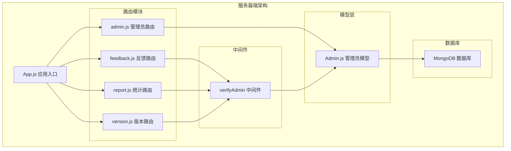
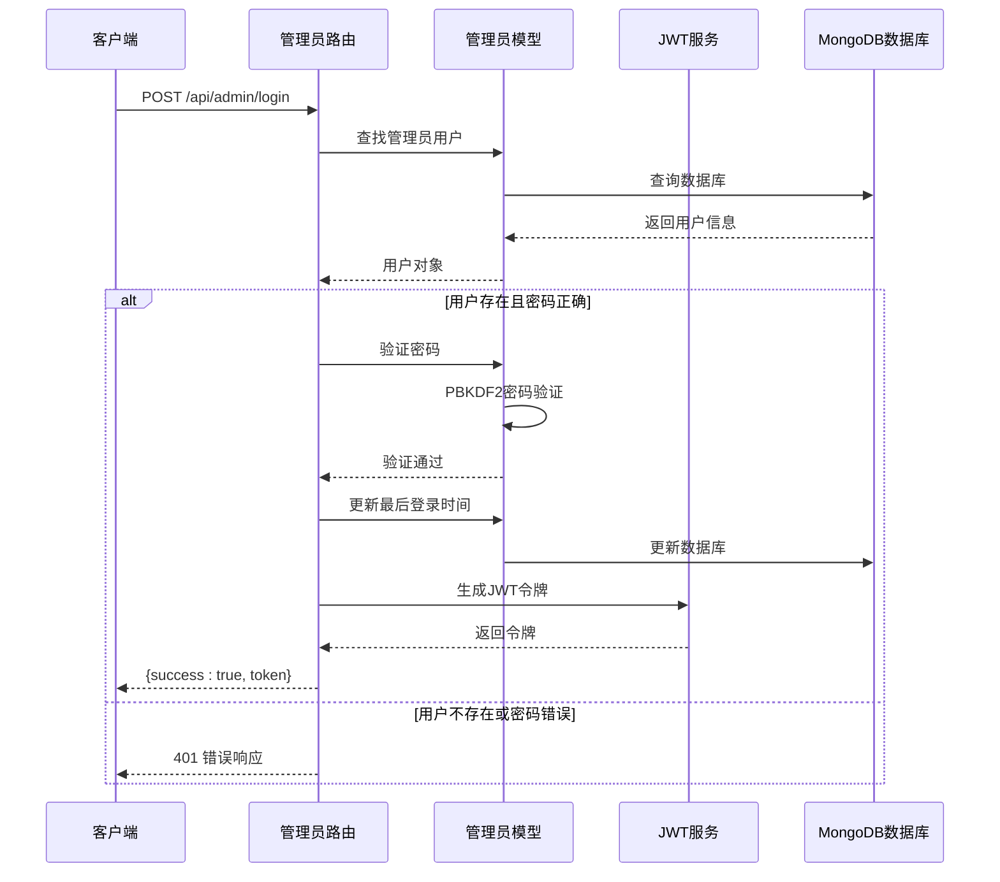
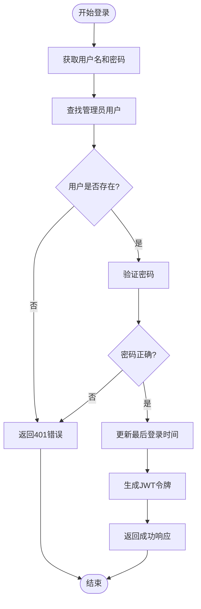
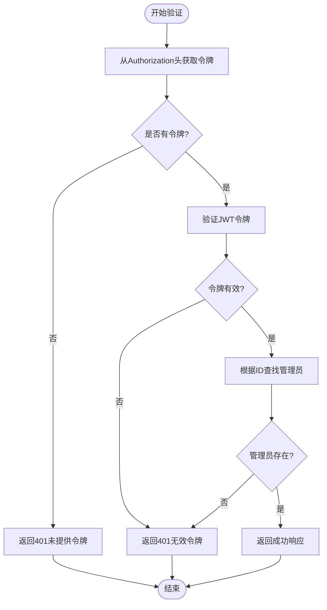
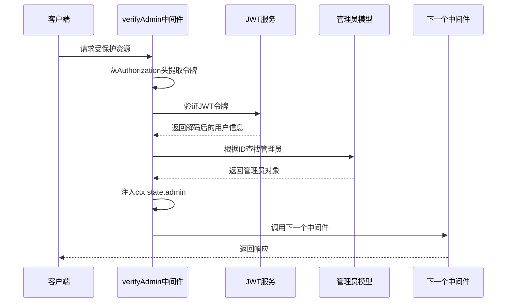
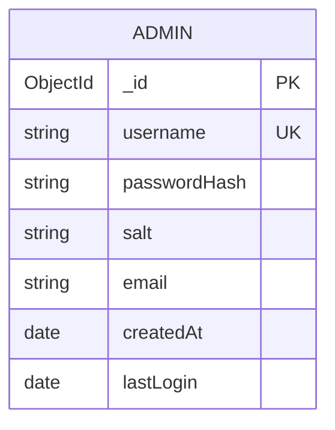
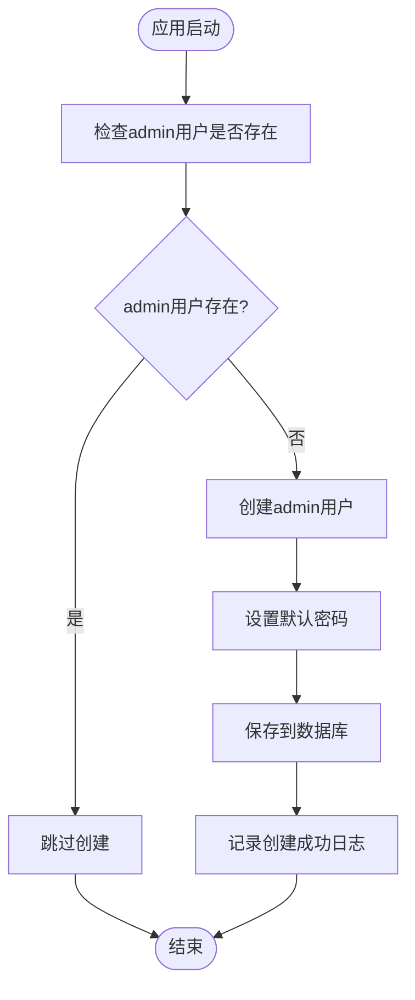
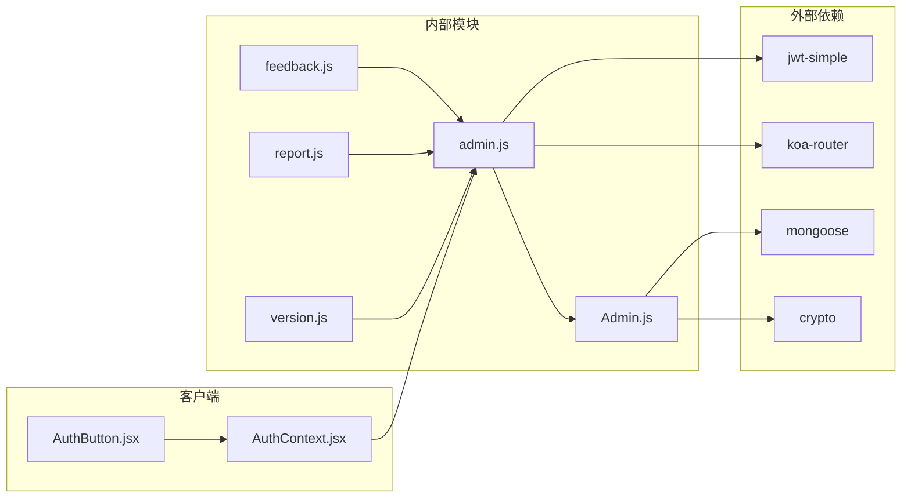

# 管理员路由模块

<cite>
**本文档引用的文件**
- [server/routes/admin.js](file://server/routes/admin.js)
- [server/models/Admin.js](file://server/models/Admin.js)
- [server/app.js](file://server/app.js)
- [server/db.js](file://server/db.js)
- [server/.env](file://server/.env)
- [client/src/context/AuthContext.jsx](file://client/src/context/AuthContext.jsx)
- [client/src/components/AuthButton.jsx](file://client/src/components/AuthButton.jsx)
- [server/routes/feedback.js](file://server/routes/feedback.js)
- [server/routes/report.js](file://server/routes/report.js)
- [server/routes/version.js](file://server/routes/version.js)
</cite>

## 目录
1. [简介](#简介)
2. [项目结构](#项目结构)
3. [核心组件](#核心组件)
4. [架构概览](#架构概览)
5. [详细组件分析](#详细组件分析)
6. [依赖关系分析](#依赖关系分析)
7. [性能考虑](#性能考虑)
8. [故障排除指南](#故障排除指南)
9. [结论](#结论)

## 简介

WoaX项目是一个基于React前端、Node.js+Koa后端和MongoDB数据库的全栈应用程序。管理员路由模块是整个系统的核心认证和授权组件，负责管理员认证、令牌验证和权限控制功能。

本模块提供了完整的管理员认证系统，包括：
- 管理员登录接口
- JWT令牌生成和验证机制
- 权限中间件验证
- 密码加密存储
- 自动化管理员账户创建

## 项目结构

管理员路由模块位于服务器端的路由系统中，采用模块化设计，与其他业务路由模块协同工作。



**图表来源**
- [server/app.js](file://server/app.js#L15-L55)
- [server/routes/admin.js](file://server/routes/admin.js#L1-L128)
- [server/models/Admin.js](file://server/models/Admin.js#L1-L32)

**章节来源**
- [server/app.js](file://server/app.js#L1-L61)
- [server/routes/admin.js](file://server/routes/admin.js#L1-L128)

## 核心组件

管理员路由模块包含以下核心组件：

### 1. 管理员认证路由
- `/api/admin/login` - 管理员登录接口
- `/api/admin/verify` - 令牌验证接口

### 2. 权限中间件
- `verifyAdmin` - 管理员权限验证中间件

### 3. 管理员模型
- 密码加密存储
- 用户名唯一性约束
- 登录时间跟踪

**章节来源**
- [server/routes/admin.js](file://server/routes/admin.js#L26-L98)
- [server/models/Admin.js](file://server/models/Admin.js#L1-L32)

## 架构概览

管理员认证系统采用JWT（JSON Web Token）技术实现无状态认证，确保系统的可扩展性和安全性。



**图表来源**
- [server/routes/admin.js](file://server/routes/admin.js#L27-L67)
- [server/models/Admin.js](file://server/models/Admin.js#L24-L30)

## 详细组件分析

### 管理员登录接口 (/api/admin/login)

管理员登录接口负责处理管理员身份验证请求，验证用户凭据并返回JWT访问令牌。

#### 接口规范

**请求方法**: POST  
**路径**: `/api/admin/login`  
**请求头**: `Content-Type: application/json`  
**请求体**:
```json
{
  "username": "string",
  "password": "string"
}
```

**响应体**:
```json
{
  "success": true,
  "data": {
    "token": "string",
    "username": "string"
  }
}
```

#### 实现流程



**图表来源**
- [server/routes/admin.js](file://server/routes/admin.js#L27-L67)

#### 错误处理机制

- **401 未授权**: 用户名或密码错误
- **500 服务器错误**: 数据库查询或令牌生成异常

**章节来源**
- [server/routes/admin.js](file://server/routes/admin.js#L27-L67)

### 令牌验证接口 (/api/admin/verify)

令牌验证接口用于验证JWT令牌的有效性，确保管理员会话的持续有效性。

#### 接口规范

**请求方法**: GET  
**路径**: `/api/admin/verify`  
**请求头**: `Authorization: Bearer <token>`

**响应体**:
```json
{
  "success": true,
  "data": {
    "username": "string"
  }
}
```

#### 验证流程



**图表来源**
- [server/routes/admin.js](file://server/routes/admin.js#L69-L98)

**章节来源**
- [server/routes/admin.js](file://server/routes/admin.js#L69-L98)

### 权限中间件 (verifyAdmin)

verifyAdmin中间件是整个系统权限控制的核心组件，用于保护需要管理员权限的路由。

#### 中间件特性

- **前置验证**: 在路由处理函数执行前进行权限验证
- **状态注入**: 将验证通过的管理员信息注入到`ctx.state.admin`
- **统一错误处理**: 统一处理令牌缺失和无效的情况

#### 使用方式

```javascript
// 在需要管理员权限的路由中使用
router.post('/protected', verifyAdmin, async (ctx) => {
  // 只有通过验证的管理员才能访问
  const admin = ctx.state.admin;
  // 执行业务逻辑
});
```

#### 中间件流程



**图表来源**
- [server/routes/admin.js](file://server/routes/admin.js#L100-L125)

**章节来源**
- [server/routes/admin.js](file://server/routes/admin.js#L100-L125)

### 管理员模型 (Admin)

管理员模型定义了管理员用户的数据库结构和密码处理方法。

#### 数据模型



**图表来源**
- [server/models/Admin.js](file://server/models/Admin.js#L4-L14)

#### 密码加密机制

管理员模型使用PBKDF2算法进行密码加密，确保密码的安全存储。

**加密流程**:
1. 生成随机盐值 (16字节)
2. 使用PBKDF2算法对密码进行加密
3. 存储加密后的哈希值和盐值

**章节来源**
- [server/models/Admin.js](file://server/models/Admin.js#L1-L32)

### 自动化管理员创建

系统启动时会自动检查并创建默认管理员账户，确保系统能够正常运行。

#### 创建逻辑



**图表来源**
- [server/routes/admin.js](file://server/routes/admin.js#L9-L24)

**章节来源**
- [server/routes/admin.js](file://server/routes/admin.js#L9-L24)

## 依赖关系分析

管理员路由模块与其他系统组件的依赖关系如下：



**图表来源**
- [server/routes/admin.js](file://server/routes/admin.js#L1-L6)
- [server/models/Admin.js](file://server/models/Admin.js#L1-L2)

**章节来源**
- [server/routes/admin.js](file://server/routes/admin.js#L1-L6)
- [server/models/Admin.js](file://server/models/Admin.js#L1-L2)

### 权限验证在其他路由中的应用

管理员权限验证中间件被广泛应用于其他业务路由中，确保只有经过认证的管理员才能执行敏感操作。

#### 受保护的路由示例

| 路由 | 方法 | 是否需要管理员权限 |
|------|------|-------------------|
| `/api/feedback` | POST | ✓ |
| `/api/feedback/:id` | PUT | ✓ |
| `/api/feedback/:id` | DELETE | ✓ |
| `/api/report` | POST | ✓ |
| `/api/version/publish` | POST | ✓ |
| `/api/version/set-latest/:id` | PUT | ✓ |

**章节来源**
- [server/routes/feedback.js](file://server/routes/feedback.js#L71-L160)
- [server/routes/report.js](file://server/routes/report.js#L204-L231)
- [server/routes/version.js](file://server/routes/version.js#L146-L296)

## 性能考虑

管理员认证系统的性能优化策略：

### 1. JWT令牌缓存
- 令牌有效期设置为24小时，平衡安全性和用户体验
- 客户端本地存储令牌，避免频繁的服务器验证

### 2. 数据库查询优化
- 管理员用户名使用唯一索引，提高查询效率
- 密码验证仅在登录时进行，日常验证使用JWT解码

### 3. 内存使用优化
- 密码加密使用PBKDF2算法，内存占用适中
- 令牌验证不加载完整用户信息，仅验证令牌有效性

### 4. 并发处理
- JWT验证为无状态操作，天然支持高并发
- 数据库连接池管理，避免连接泄漏

## 故障排除指南

### 常见问题及解决方案

#### 1. 登录失败 (401错误)
**症状**: 用户名或密码错误提示  
**原因**: 
- 用户名不存在
- 密码不匹配
- 数据库连接问题

**解决方法**:
- 检查用户名和密码输入
- 确认管理员账户已创建
- 验证数据库连接状态

#### 2. 令牌验证失败 (401错误)
**症状**: 无效的令牌错误  
**原因**:
- 令牌缺失或格式不正确
- 令牌已过期
- 令牌被篡改

**解决方法**:
- 确保Authorization头格式正确: `Bearer <token>`
- 重新登录获取新令牌
- 检查服务器时间同步

#### 3. 权限不足 (401错误)
**症状**: 访问受保护资源时被拒绝  
**原因**:
- 缺少Authorization头
- 令牌无效或过期
- 管理员账户被删除

**解决方法**:
- 确保携带有效的Authorization头
- 重新登录获取新令牌
- 检查管理员账户状态

#### 4. 数据库连接问题
**症状**: 系统启动时数据库连接失败  
**原因**:
- MongoDB服务未启动
- 连接字符串配置错误
- 网络连接问题

**解决方法**:
- 启动MongoDB服务
- 检查MONGODB_URI配置
- 验证网络连接

### 调试技巧

1. **启用详细日志**: 在开发环境中查看服务器控制台输出
2. **检查环境变量**: 确认JWT_SECRET和MONGODB_URI配置正确
3. **验证令牌格式**: 使用Base64解码验证JWT令牌结构
4. **监控数据库连接**: 确保MongoDB连接池正常工作

**章节来源**
- [server/routes/admin.js](file://server/routes/admin.js#L62-L66)
- [server/routes/admin.js](file://server/routes/admin.js#L94-L97)
- [server/routes/admin.js](file://server/routes/admin.js#L121-L124)

## 结论

WoaX项目的管理员路由模块提供了一个完整、安全且易于使用的管理员认证系统。通过JWT令牌机制和权限中间件，系统实现了无状态的管理员身份验证，确保了系统的可扩展性和安全性。

### 主要优势

1. **安全性**: 使用PBKDF2密码加密和JWT令牌机制
2. **易用性**: 自动化的管理员账户创建和令牌管理
3. **可扩展性**: 无状态设计支持水平扩展
4. **可靠性**: 完善的错误处理和故障恢复机制

### 最佳实践建议

1. **环境配置**: 在生产环境中设置强密码的JWT_SECRET
2. **安全审计**: 定期检查管理员活动日志
3. **监控告警**: 设置系统健康检查和异常告警
4. **备份策略**: 定期备份管理员账户和系统数据

这个管理员路由模块为WoaX项目提供了坚实的基础，支持了整个系统的管理和维护功能。