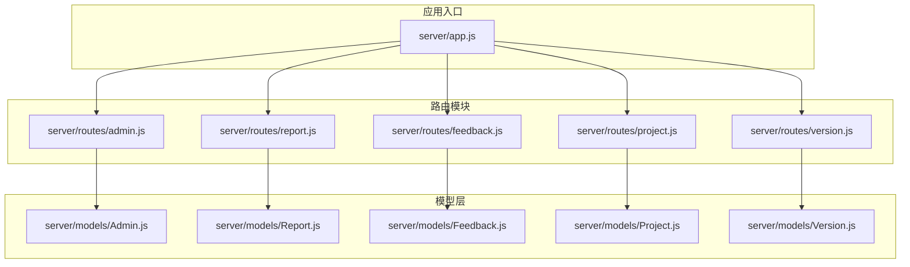
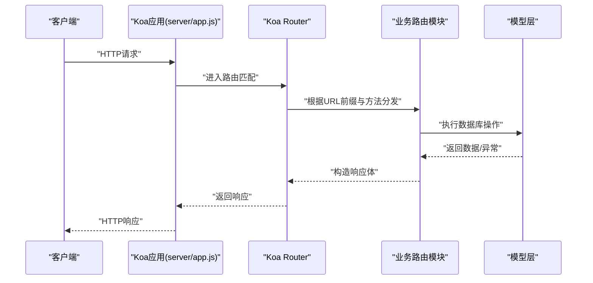
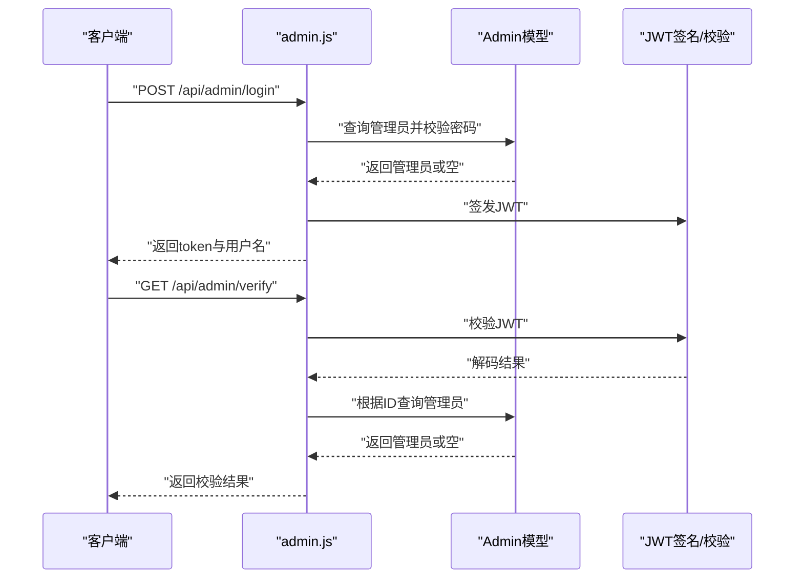
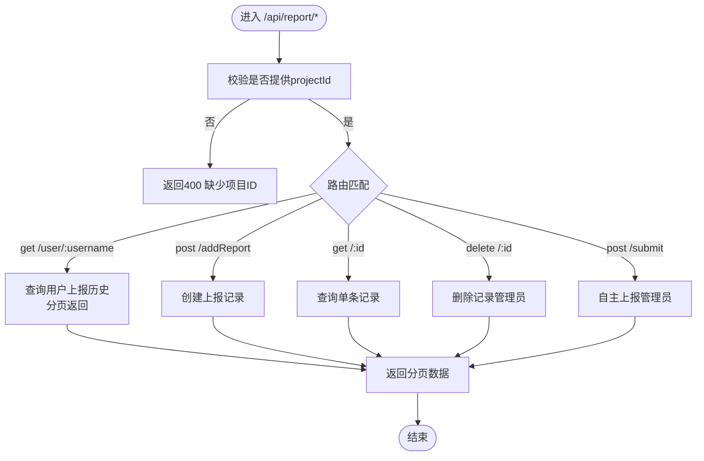
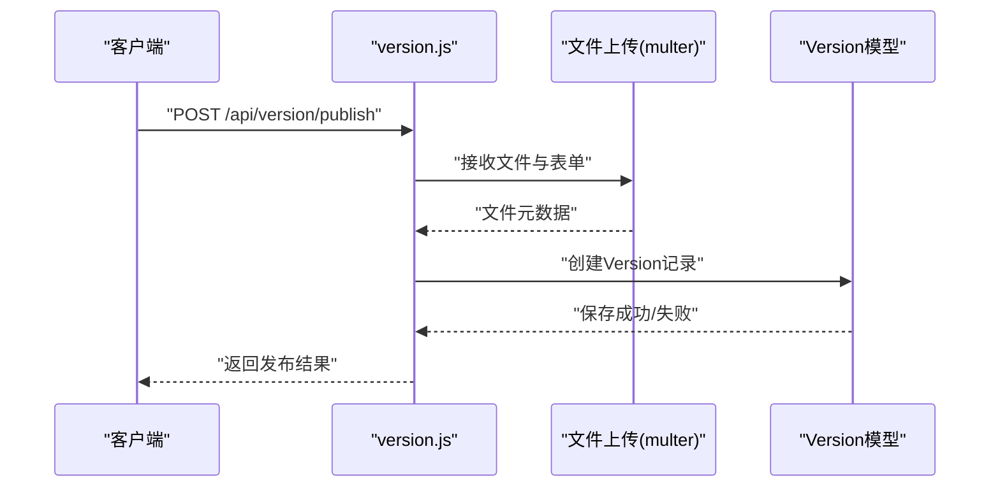
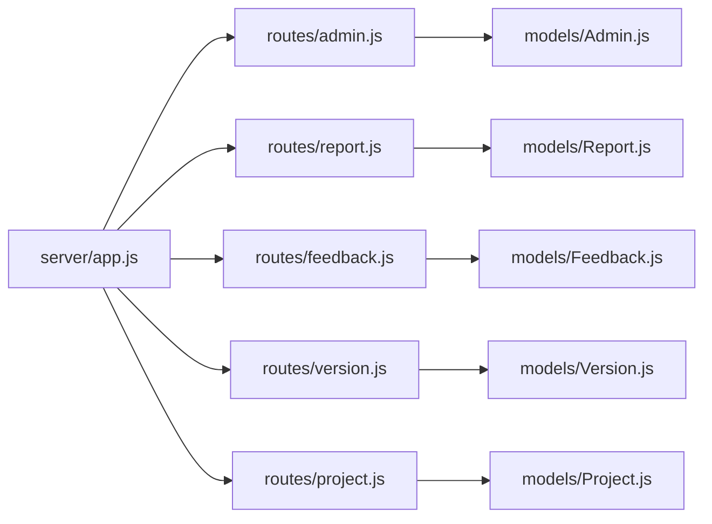

# 路由系统设计

<cite>
**本文引用的文件**
- [server/app.js](file://server/app.js)
- [server/routes/admin.js](file://server/routes/admin.js)
- [server/routes/report.js](file://server/routes/report.js)
- [server/routes/feedback.js](file://server/routes/feedback.js)
- [server/routes/project.js](file://server/routes/project.js)
- [server/routes/version.js](file://server/routes/version.js)
- [server/models/Admin.js](file://server/models/Admin.js)
- [server/models/Report.js](file://server/models/Report.js)
- [server/models/Feedback.js](file://server/models/Feedback.js)
- [server/models/Project.js](file://server/models/Project.js)
- [server/models/Version.js](file://server/models/Version.js)
- [server/.env](file://server/.env)
- [server/package.json](file://server/package.json)
- [README.md](file://README.md)
- [api-usage-latest-version.md](file://api-usage-latest-version.md)
- [latest-example.yml](file://latest-example.yml)
</cite>

## 目录
1. [简介](#简介)
2. [项目结构](#项目结构)
3. [核心组件](#核心组件)
4. [架构总览](#架构总览)
5. [详细组件分析](#详细组件分析)
6. [依赖关系分析](#依赖关系分析)
7. [性能考虑](#性能考虑)
8. [故障排查指南](#故障排查指南)
9. [结论](#结论)
10. [附录](#附录)

## 简介
本文件面向WoaX项目的后端路由系统，基于Koa Router实现。文档围绕以下目标展开：
- 解释Koa Router的使用方式与路由层级结构
- 详解各API模块的路由设计（URL模式、HTTP方法映射、参数处理）
- 阐述路由中间件与权限控制机制（JWT令牌校验）
- 覆盖路由错误处理、参数验证与响应格式标准化
- 提供路由扩展指南与最佳实践建议

## 项目结构
后端采用“入口应用 + 子路由模块 + 模型层”的分层组织：
- 入口应用负责中间件装配、静态资源服务与顶层路由挂载
- 各业务模块（报告、反馈、版本、项目、管理员）通过独立子路由文件暴露REST风格接口
- 模型层定义数据结构与约束，支撑路由层的数据持久化操作

图表来源
- [server/app.js](file://server/app.js#L1-L61)
- [server/routes/admin.js](file://server/routes/admin.js#L1-L128)
- [server/routes/report.js](file://server/routes/report.js#L1-L271)
- [server/routes/feedback.js](file://server/routes/feedback.js#L1-L187)
- [server/routes/version.js](file://server/routes/version.js#L1-L432)
- [server/routes/project.js](file://server/routes/project.js#L1-L226)
- [server/models/Admin.js](file://server/models/Admin.js#L1-L32)
- [server/models/Report.js](file://server/models/Report.js#L1-L22)
- [server/models/Feedback.js](file://server/models/Feedback.js#L1-L52)
- [server/models/Project.js](file://server/models/Project.js#L1-L21)
- [server/models/Version.js](file://server/models/Version.js#L1-L62)

章节来源
- [server/app.js](file://server/app.js#L1-L61)
- [server/package.json](file://server/package.json#L1-L24)

## 核心组件
- 应用与路由器
  - 应用实例与路由器分别创建于入口文件，随后注册全局中间件与静态资源服务
  - 顶层路由通过router.use挂载各业务子路由，前缀统一为/api/{resource}
- 中间件体系
  - CORS、BodyParser、自定义静态文件服务（/uploads）
  - 管理员权限中间件（JWT校验），在需要鉴权的路由上作为中间件使用
- 模型与数据约束
  - 各模型定义字段类型、必填项与枚举值，确保路由层参数验证与数据库一致性

章节来源
- [server/app.js](file://server/app.js#L1-L61)
- [server/routes/admin.js](file://server/routes/admin.js#L100-L125)
- [server/models/Admin.js](file://server/models/Admin.js#L1-L32)
- [server/models/Report.js](file://server/models/Report.js#L1-L22)
- [server/models/Feedback.js](file://server/models/Feedback.js#L1-L52)
- [server/models/Project.js](file://server/models/Project.js#L1-L21)
- [server/models/Version.js](file://server/models/Version.js#L1-L62)

## 架构总览
下图展示Koa应用、路由挂载与请求流转的关键节点：

图表来源
- [server/app.js](file://server/app.js#L47-L55)
- [server/routes/admin.js](file://server/routes/admin.js#L1-L128)
- [server/routes/report.js](file://server/routes/report.js#L1-L271)
- [server/routes/feedback.js](file://server/routes/feedback.js#L1-L187)
- [server/routes/version.js](file://server/routes/version.js#L1-L432)
- [server/routes/project.js](file://server/routes/project.js#L1-L226)

## 详细组件分析

### 管理员模块（/api/admin）
- 路由设计
  - 登录：POST /api/admin/login（用户名+密码，返回JWT）
  - 校验：GET /api/admin/verify（Authorization头携带JWT）
  - 权限中间件：verifyAdmin（校验JWT并注入管理员上下文）
- 参数与验证
  - 登录：请求体包含username、password；若缺失或凭据不正确返回401
  - 校验：Authorization头需为Bearer Token；缺失或无效返回401
- 响应格式
  - 统一包装success、data/message/error字段
- 安全与流程
  - 登录成功后签发带过期时间的JWT；校验失败直接返回401

图表来源
- [server/routes/admin.js](file://server/routes/admin.js#L27-L98)
- [server/models/Admin.js](file://server/models/Admin.js#L16-L30)

章节来源
- [server/routes/admin.js](file://server/routes/admin.js#L1-L128)
- [server/models/Admin.js](file://server/models/Admin.js#L1-L32)

### 报告模块（/api/report）
- 路由设计
  - 聚合最近上报：POST /api/report/getReportData（按用户名去重取最新一条）
  - 用户历史：GET /api/report/user/:username?page&pageSize&projectId
  - 上报数据：POST /api/report/addReport（新增上报记录）
  - 单条详情：GET /api/report/:id
  - 删除记录：DELETE /api/report/:id（需管理员）
  - 自主上报：POST /api/report/submit（需管理员）
- 参数与验证
  - 所有需要项目维度的接口均要求projectId；缺失则返回400
  - 分页参数默认值与类型转换在路由层处理
- 响应格式
  - 统一success/data/message/error结构；分页接口额外返回total/page/pageSize

图表来源
- [server/routes/report.js](file://server/routes/report.js#L8-L271)

章节来源
- [server/routes/report.js](file://server/routes/report.js#L1-L271)

### 反馈模块（/api/feedback）
- 路由设计
  - 列表：GET /api/feedback/?page&pageSize&projectId
  - 详情：GET /api/feedback/:id
  - 新增：POST /api/feedback/（需管理员）
  - 更新：PUT /api/feedback/:id（需管理员）
  - 删除：DELETE /api/feedback/:id（需管理员）
- 参数与验证
  - 新增反馈要求username、content、projectId；缺失返回400
  - 更新支持status与replyInput；内部维护replyHistory数组
- 响应格式
  - 统一success/data/message/error；分页接口返回total/page/pageSize

章节来源
- [server/routes/feedback.js](file://server/routes/feedback.js#L1-L187)

### 版本模块（/api/version）
- 路由设计
  - 列表：GET /api/version/?page&pageSize&projectId
  - 详情：GET /api/version/:id
  - 发布：POST /api/version/publish（需管理员；多文件上传）
  - 设为最新：PUT /api/version/set-latest/:id（需管理员）
  - 最新版本：GET /api/version/latest/:projectId（公开）
  - 更新：PUT /api/version/:id（需管理员）
  - 删除：DELETE /api/version/:id（需管理员）
- 参数与验证
  - 发布接口要求versionNumber、description、projectId；缺失返回400
  - 文件上传支持安装包与描述文件（latest.yml）；支持可选重命名
  - 最新版本接口仅接受projectId；缺失返回400
- 响应格式
  - 统一success/data/message/error；分页接口返回total/page/pageSize
- 文件处理
  - 上传目录自动创建；支持中文文件名修复；删除版本时同步清理文件

图表来源
- [server/routes/version.js](file://server/routes/version.js#L147-L256)

章节来源
- [server/routes/version.js](file://server/routes/version.js#L1-L432)
- [latest-example.yml](file://latest-example.yml#L1-L38)

### 项目模块（/api/projects）
- 路由设计
  - 列表：GET /api/projects/
  - 详情：GET /api/projects/:id
  - 新增：POST /api/projects/
  - 更新：PUT /api/projects/:id
  - 删除：DELETE /api/projects/:id
  - 迁移：POST /api/projects/migrate/:projectId（将无项目ID的数据迁移到目标项目）
- 参数与验证
  - 新增/更新均校验名称唯一性；更新时排除自身ID
  - 删除限制：系统必须保留至少一个项目
  - 迁移：目标项目存在性校验
- 响应格式
  - 统一success/data/message/error；分页接口返回total/page/pageSize

章节来源
- [server/routes/project.js](file://server/routes/project.js#L1-L226)

## 依赖关系分析
- 组件耦合
  - 路由模块依赖对应模型；管理员中间件被多个模块复用
  - 入口文件集中挂载子路由，降低模块间耦合
- 外部依赖
  - Koa、Koa Router、CORS、BodyParser、Multer、JWT、Mongoose
- 潜在循环依赖
  - 当前结构清晰，无明显循环依赖迹象

图表来源
- [server/app.js](file://server/app.js#L10-L52)
- [server/routes/admin.js](file://server/routes/admin.js#L1-L128)
- [server/routes/report.js](file://server/routes/report.js#L1-L271)
- [server/routes/feedback.js](file://server/routes/feedback.js#L1-L187)
- [server/routes/version.js](file://server/routes/version.js#L1-L432)
- [server/routes/project.js](file://server/routes/project.js#L1-L226)

章节来源
- [server/package.json](file://server/package.json#L10-L20)

## 性能考虑
- 聚合与分页
  - 报告模块使用聚合管道进行去重与排序，注意索引与投影优化
  - 分页参数默认值与类型转换避免无效查询
- 数据库查询
  - 项目模块在更新名称时进行唯一性检查，建议在名称字段建立唯一索引
- 文件上传
  - 上传目录与文件名处理减少I/O开销；删除版本时同步清理文件
- 中间件顺序
  - BodyParser与CORS置于静态文件服务之前，确保静态资源优先命中

## 故障排查指南
- 统一响应格式
  - 所有接口遵循success/data/message/error结构，便于前端统一处理
- 常见错误
  - 400：缺少必需参数（如projectId、versionNumber等）
  - 401：未提供或无效JWT令牌
  - 404：资源不存在（项目/版本/反馈/报告）
  - 500：服务器内部错误
- 日志与调试
  - 登录/校验/删除记录等关键流程包含日志输出，便于定位问题
- 最佳实践
  - 前端调用时对404进行正常化处理（例如“暂无已发布的版本”）

章节来源
- [server/routes/admin.js](file://server/routes/admin.js#L27-L98)
- [server/routes/report.js](file://server/routes/report.js#L8-L271)
- [server/routes/feedback.js](file://server/routes/feedback.js#L1-L187)
- [server/routes/version.js](file://server/routes/version.js#L82-L432)
- [server/routes/project.js](file://server/routes/project.js#L1-L226)
- [api-usage-latest-version.md](file://api-usage-latest-version.md#L1-L227)

## 结论
WoaX的路由系统以Koa Router为核心，采用模块化子路由与统一响应格式，结合JWT中间件实现了清晰的权限控制与一致的错误处理。通过明确的URL模式、严格的参数验证与标准化的响应结构，系统具备良好的可维护性与扩展性。

## 附录

### 路由层级与URL模式速览
- /api/admin
  - POST /login
  - GET /verify
- /api/report
  - POST /getReportData
  - GET /user/:username
  - POST /addReport
  - GET /:id
  - DELETE /:id
  - POST /submit
- /api/feedback
  - GET /
  - GET /:id
  - POST /
  - PUT /:id
  - DELETE /:id
- /api/version
  - GET /
  - GET /:id
  - POST /publish
  - PUT /set-latest/:id
  - GET /latest/:projectId
  - PUT /:id
  - DELETE /:id
- /api/projects
  - GET /
  - GET /:id
  - POST /
  - PUT /:id
  - DELETE /:id
  - POST /migrate/:projectId

章节来源
- [server/routes/admin.js](file://server/routes/admin.js#L27-L98)
- [server/routes/report.js](file://server/routes/report.js#L8-L271)
- [server/routes/feedback.js](file://server/routes/feedback.js#L7-L187)
- [server/routes/version.js](file://server/routes/version.js#L82-L432)
- [server/routes/project.js](file://server/routes/project.js#L9-L226)

### 参数验证与响应格式规范
- 通用规则
  - 必填参数缺失：返回400，message说明
  - 资源不存在：返回404，message说明
  - 权限不足：返回401，message说明
  - 服务器错误：返回500，message与error说明
- 分页接口
  - 返回data、total、page、pageSize字段
- 统一响应体
  - success: boolean
  - data: object|array|null
  - message: string
  - error: string|object

章节来源
- [server/routes/report.js](file://server/routes/report.js#L8-L271)
- [server/routes/feedback.js](file://server/routes/feedback.js#L7-L187)
- [server/routes/version.js](file://server/routes/version.js#L82-L432)
- [server/routes/project.js](file://server/routes/project.js#L9-L226)

### 权限控制与中间件使用
- 管理员中间件
  - verifyAdmin：从Authorization头解析JWT，校验有效性并注入管理员上下文
  - 适用范围：发布版本、设置最新版本、删除/更新版本、删除/更新反馈、删除/更新报告、自主上报
- 公开接口
  - 最新版本查询：GET /api/version/latest/:projectId

章节来源
- [server/routes/admin.js](file://server/routes/admin.js#L100-L125)
- [server/routes/version.js](file://server/routes/version.js#L147-L296)
- [server/routes/report.js](file://server/routes/report.js#L205-L268)
- [server/routes/feedback.js](file://server/routes/feedback.js#L114-L160)

### 路由扩展指南与最佳实践
- 新增模块步骤
  - 在server/routes下创建模块文件，导出路由实例
  - 在server/app.js中引入并挂载router.use('/api/xxx', module.routes())
  - 在server/models下定义模型与约束
- 参数验证
  - 对必填参数进行显式校验；对项目维度参数强制要求projectId
  - 对可能冲突的字段（如项目名）进行唯一性检查
- 响应格式
  - 统一success/data/message/error结构；分页接口补充total/page/pageSize
- 权限控制
  - 对写操作与敏感读取接口使用verifyAdmin中间件
  - 公开接口避免返回敏感信息
- 文件处理
  - 上传目录自动创建；对中文文件名进行编码修复
  - 删除资源时同步清理文件
- 性能优化
  - 为高频查询字段建立索引（如项目ID、用户名）
  - 聚合查询中合理使用投影与排序，避免全量扫描

章节来源
- [server/app.js](file://server/app.js#L10-L52)
- [server/routes/version.js](file://server/routes/version.js#L38-L74)
- [server/routes/project.js](file://server/routes/project.js#L58-L114)
- [server/.env](file://server/.env#L1-L9)
- [README.md](file://README.md#L1-L44)