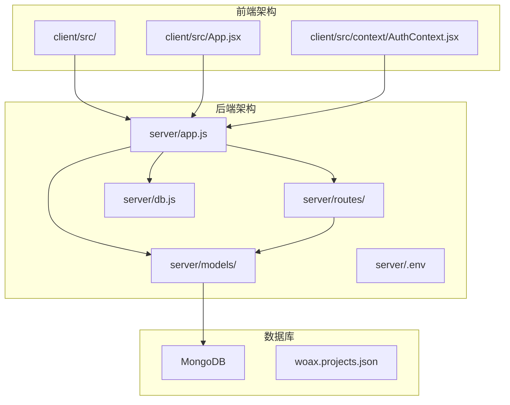
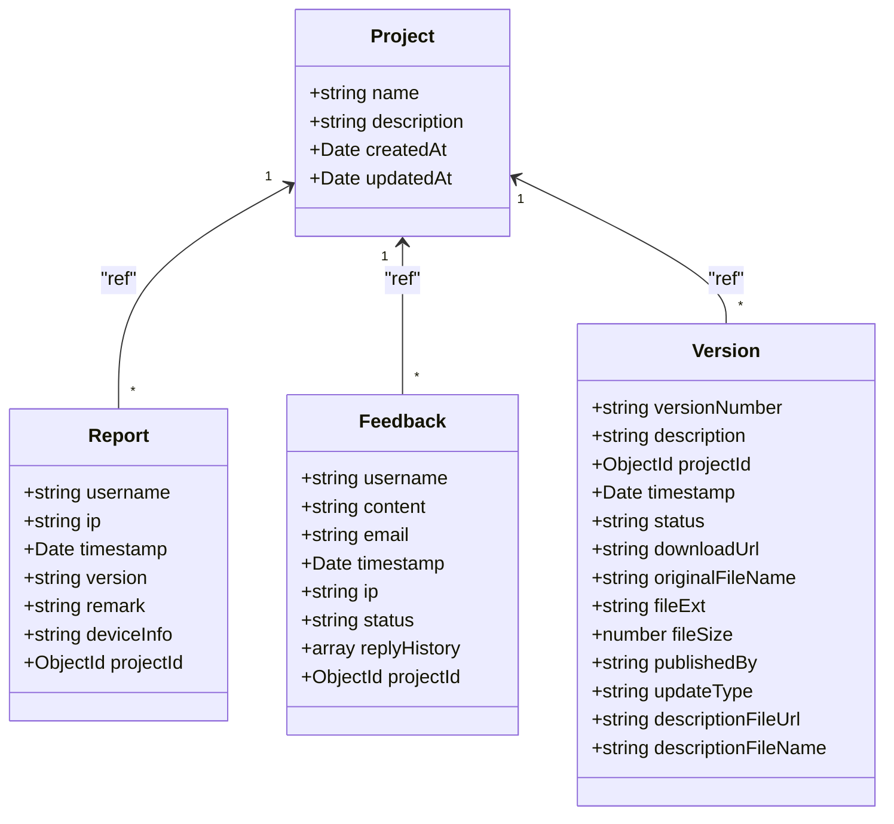
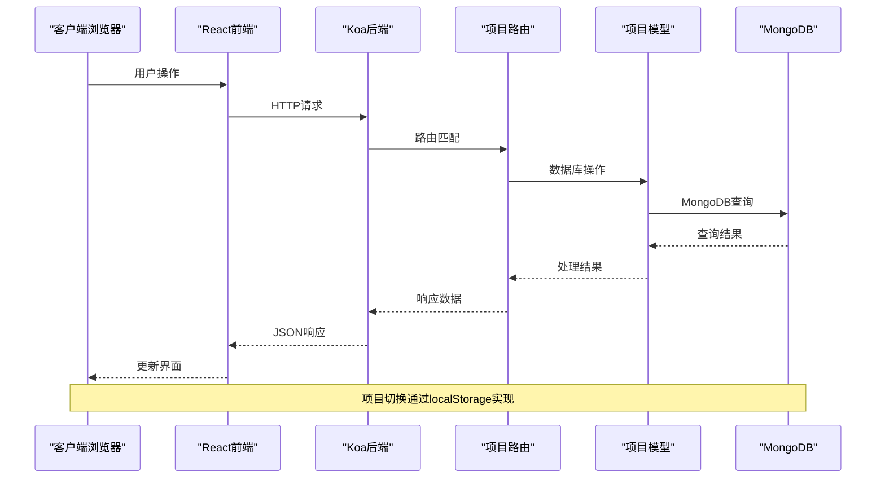
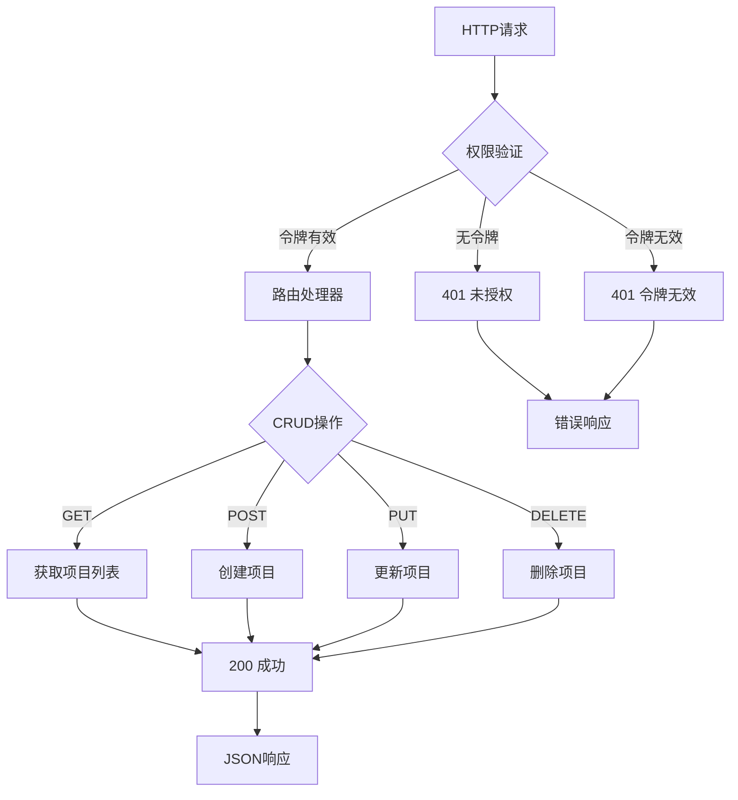
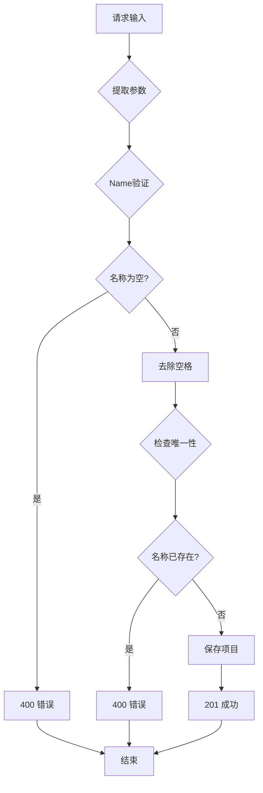
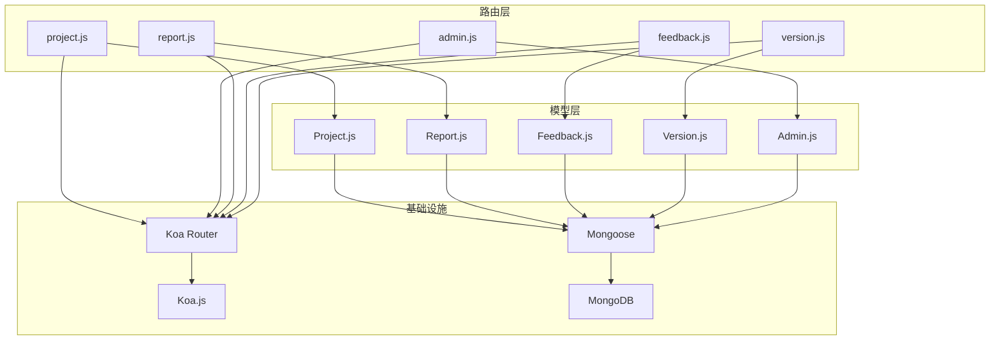
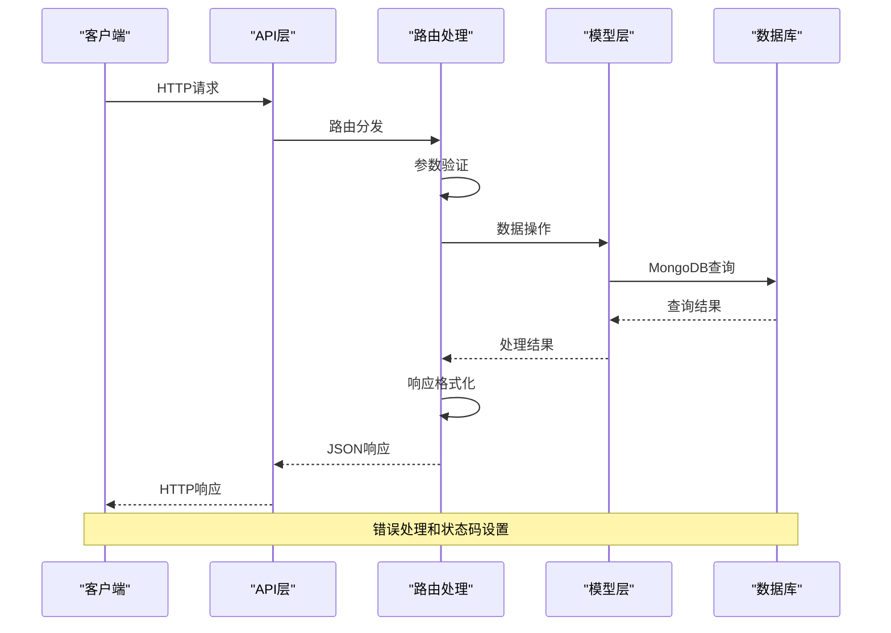

# 项目管理路由模块

<cite>
**本文档引用的文件**
- [server/app.js](file://server/app.js)
- [server/db.js](file://server/db.js)
- [server/.env](file://server/.env)
- [server/routes/project.js](file://server/routes/project.js)
- [server/models/Project.js](file://server/models/Project.js)
- [server/models/Report.js](file://server/models/Report.js)
- [server/models/Feedback.js](file://server/models/Feedback.js)
- [server/models/Version.js](file://server/models/Version.js)
- [server/models/Admin.js](file://server/models/Admin.js)
- [client/src/App.jsx](file://client/src/App.jsx)
- [client/src/context/AuthContext.jsx](file://client/src/context/AuthContext.jsx)
- [db/woax.projects.json](file://db/woax.projects.json)
</cite>

## 目录
1. [简介](#简介)
2. [项目结构](#项目结构)
3. [核心组件](#核心组件)
4. [架构概览](#架构概览)
5. [详细组件分析](#详细组件分析)
6. [依赖关系分析](#依赖关系分析)
7. [性能考虑](#性能考虑)
8. [故障排除指南](#故障排除指南)
9. [结论](#结论)
10. [附录](#附录)

## 简介

WoaX项目管理路由模块是一个基于Koa.js和MongoDB的多项目支持系统，为数据统计、意见反馈和版本更新功能提供统一的项目管理能力。该模块实现了完整的RESTful API，支持项目CRUD操作、项目切换、权限控制和数据隔离。

## 项目结构

WoaX采用前后端分离架构，项目管理路由模块位于后端server目录下的routes子目录中：



**图表来源**
- [server/app.js](file://server/app.js#L1-L61)
- [server/routes/project.js](file://server/routes/project.js#L1-L226)
- [server/models/Project.js](file://server/models/Project.js#L1-L21)

**章节来源**
- [server/app.js](file://server/app.js#L1-L61)
- [server/db.js](file://server/db.js#L1-L45)

## 核心组件

### 路由模块架构

项目管理路由模块基于Koa Router实现，提供以下核心功能：

- **项目CRUD操作**：完整的增删改查功能
- **项目切换支持**：前端项目切换的后端支撑
- **数据迁移**：批量数据项目归属转移
- **权限验证**：基于JWT的管理员权限控制

### 数据模型设计



**图表来源**
- [server/models/Project.js](file://server/models/Project.js#L3-L19)
- [server/models/Report.js](file://server/models/Report.js#L3-L18)
- [server/models/Feedback.js](file://server/models/Feedback.js#L3-L48)
- [server/models/Version.js](file://server/models/Version.js#L3-L60)

**章节来源**
- [server/models/Project.js](file://server/models/Project.js#L1-L21)
- [server/models/Report.js](file://server/models/Report.js#L1-L22)
- [server/models/Feedback.js](file://server/models/Feedback.js#L1-L52)
- [server/models/Version.js](file://server/models/Version.js#L1-L62)

## 架构概览

### 整体架构流程



**图表来源**
- [server/app.js](file://server/app.js#L47-L55)
- [server/routes/project.js](file://server/routes/project.js#L10-L25)
- [client/src/App.jsx](file://client/src/App.jsx#L120-L126)

### 权限控制架构



**图表来源**
- [client/src/context/AuthContext.jsx](file://client/src/context/AuthContext.jsx#L25-L48)
- [client/src/App.jsx](file://client/src/App.jsx#L18-L25)

## 详细组件分析

### 项目路由API设计

#### GET /api/projects - 获取项目列表

**功能描述**：返回所有项目信息，按创建时间降序排列

**请求参数**：无

**响应格式**：
```json
{
  "success": true,
  "data": [
    {
      "_id": "682031eaba8af1129bfdf62c",
      "name": "project01",
      "description": "默认项目",
      "createdAt": "2025-05-11T05:13:14.266Z",
      "updatedAt": "2025-05-11T05:13:14.266Z"
    }
  ]
}
```

**错误处理**：
- 500：数据库查询失败
- 404：未找到项目

#### GET /api/projects/:id - 获取项目详情

**功能描述**：根据项目ID获取单个项目的详细信息

**路径参数**：
- `id` (string): 项目唯一标识符

**响应格式**：
```json
{
  "success": true,
  "data": {
    "_id": "682031eaba8af1129bfdf62c",
    "name": "project01",
    "description": "默认项目",
    "createdAt": "2025-05-11T05:13:14.266Z",
    "updatedAt": "2025-05-11T05:13:14.266Z"
  }
}
```

**错误处理**：
- 404：项目不存在
- 500：服务器内部错误

#### POST /api/projects - 创建新项目

**功能描述**：创建新的项目记录

**请求体参数**：
```json
{
  "name": "string",           // 项目名称（必填）
  "description": "string"     // 项目描述（可选）
}
```

**响应格式**：
```json
{
  "success": true,
  "message": "项目创建成功",
  "data": {
    "_id": "682031eaba8af1129bfdf62c",
    "name": "project01",
    "description": "",
    "createdAt": "2025-05-11T05:13:14.266Z",
    "updatedAt": "2025-05-11T05:13:14.266Z"
  }
}
```

**参数验证**：
- 项目名称必填且唯一
- 自动去除首尾空格
- 描述可为空字符串

**错误处理**：
- 400：项目名已存在
- 400：创建失败
- 500：服务器内部错误

#### PUT /api/projects/:id - 更新项目

**功能描述**：更新现有项目的名称和描述

**路径参数**：
- `id` (string): 项目唯一标识符

**请求体参数**：
```json
{
  "name": "string",           // 新项目名称（可选）
  "description": "string"     // 新描述（可选）
}
```

**响应格式**：
```json
{
  "success": true,
  "message": "项目更新成功",
  "data": {
    "_id": "682031eaba8af1129bfdf62c",
    "name": "updatedProject",
    "description": "更新后的描述",
    "createdAt": "2025-05-11T05:13:14.266Z",
    "updatedAt": "2025-05-11T05:13:14.266Z"
  }
}
```

**参数验证**：
- 仅当提供name时才进行唯一性检查
- 自动去除首尾空格
- description为undefined时不更新

**错误处理**：
- 400：项目名已存在
- 404：项目不存在
- 500：服务器内部错误

#### DELETE /api/projects/:id - 删除项目

**功能描述**：删除指定项目，确保系统至少保留一个项目

**路径参数**：
- `id` (string): 项目唯一标识符

**响应格式**：
```json
{
  "success": true,
  "message": "项目已删除"
}
```

**业务规则**：
- 系统必须保留至少一个项目
- 删除前检查项目数量

**错误处理**：
- 400：系统必须保留至少一个项目
- 404：项目不存在
- 500：服务器内部错误

#### POST /api/projects/migrate/:projectId - 数据迁移

**功能描述**：将所有没有项目ID的数据迁移到指定项目

**路径参数**：
- `projectId` (string): 目标项目ID

**响应格式**：
```json
{
  "success": true,
  "message": "数据迁移成功"
}
```

**迁移范围**：
- Report表：迁移所有没有projectId的记录
- Feedback表：迁移所有没有projectId的记录  
- Version表：迁移所有没有projectId的记录

**错误处理**：
- 404：目标项目不存在
- 500：数据迁移失败

**章节来源**
- [server/routes/project.js](file://server/routes/project.js#L9-L226)

### 参数验证机制

项目管理路由实现了多层次的参数验证：



**图表来源**
- [server/routes/project.js](file://server/routes/project.js#L54-L92)

### 数据隔离实现

项目数据隔离通过以下机制实现：

1. **外键关联**：所有相关数据模型都包含projectId字段
2. **查询过滤**：前端通过localStorage中的currentProjectId进行数据过滤
3. **权限控制**：所有操作都需要有效的管理员令牌
4. **数据完整性**：使用MongoDB引用确保数据一致性

**章节来源**
- [server/models/Report.js](file://server/models/Report.js#L11-L15)
- [server/models/Feedback.js](file://server/models/Feedback.js#L42-L46)
- [server/models/Version.js](file://server/models/Version.js#L13-L17)

## 依赖关系分析

### 组件依赖图



**图表来源**
- [server/routes/project.js](file://server/routes/project.js#L1-L7)
- [server/models/Project.js](file://server/models/Project.js#L1)
- [server/app.js](file://server/app.js#L10-L15)

### 数据流分析



**图表来源**
- [server/routes/project.js](file://server/routes/project.js#L10-L25)
- [server/db.js](file://server/db.js#L10-L24)

**章节来源**
- [server/app.js](file://server/app.js#L1-L61)
- [server/db.js](file://server/db.js#L1-L45)

## 性能考虑

### 数据库优化策略

1. **索引设计**：项目名称使用唯一索引确保查询效率
2. **查询优化**：按创建时间排序使用索引提升性能
3. **批量操作**：数据迁移使用Promise.all并行处理多个集合

### 缓存策略

- **前端缓存**：项目列表和当前项目信息使用localStorage缓存
- **会话管理**：JWT令牌本地存储减少重复认证
- **响应缓存**：静态资源通过中间件直接提供

### 并发控制

- **事务处理**：关键操作使用数据库事务保证数据一致性
- **锁机制**：高并发场景下使用MongoDB的原子操作
- **错误重试**：网络异常时提供合理的重试机制

## 故障排除指南

### 常见问题及解决方案

#### 数据库连接问题

**症状**：启动时出现数据库连接失败

**原因**：
- MongoDB服务未启动
- 连接字符串配置错误
- 网络连接问题

**解决方案**：
1. 检查MongoDB服务状态
2. 验证MONGODB_URI配置
3. 确认网络连接正常

#### 权限验证失败

**症状**：401未授权错误

**原因**：
- 令牌过期或无效
- 本地存储被清除
- 请求头格式不正确

**解决方案**：
1. 重新登录获取新令牌
2. 检查Authorization头部格式
3. 验证JWT签名有效性

#### 项目操作异常

**症状**：项目CRUD操作失败

**原因**：
- 项目名称重复
- 项目ID格式错误
- 数据库约束冲突

**解决方案**：
1. 检查项目名称唯一性
2. 验证ID格式（24位十六进制）
3. 查看数据库约束错误信息

**章节来源**
- [server/db.js](file://server/db.js#L18-L23)
- [client/src/context/AuthContext.jsx](file://client/src/context/AuthContext.jsx#L42-L48)

## 结论

WoaX项目管理路由模块通过清晰的RESTful API设计和完善的权限控制机制，为多项目支持提供了坚实的基础。模块具有以下优势：

1. **完整的CRUD支持**：覆盖项目管理的所有基本操作
2. **强类型验证**：多层次的参数验证确保数据质量
3. **数据隔离**：通过外键关联实现严格的项目数据隔离
4. **权限控制**：基于JWT的管理员权限管理
5. **扩展性强**：模块化设计便于功能扩展和维护

该模块为WoaX系统的多项目管理提供了可靠的技术支撑，能够满足复杂应用场景下的项目管理和数据隔离需求。

## 附录

### API使用示例

#### 获取项目列表
```bash
curl -X GET http://localhost:3001/api/projects \
  -H "Authorization: Bearer YOUR_JWT_TOKEN"
```

#### 创建新项目
```bash
curl -X POST http://localhost:3001/api/projects \
  -H "Content-Type: application/json" \
  -H "Authorization: Bearer YOUR_JWT_TOKEN" \
  -d '{"name":"新项目","description":"项目描述"}'
```

#### 更新项目
```bash
curl -X PUT http://localhost:3001/api/projects/PROJECT_ID \
  -H "Content-Type: application/json" \
  -H "Authorization: Bearer YOUR_JWT_TOKEN" \
  -d '{"name":"更新后的名称","description":"更新后的描述"}'
```

#### 删除项目
```bash
curl -X DELETE http://localhost:3001/api/projects/PROJECT_ID \
  -H "Authorization: Bearer YOUR_JWT_TOKEN"
```

#### 数据迁移
```bash
curl -X POST http://localhost:3001/api/projects/migrate/PROJECT_ID \
  -H "Authorization: Bearer YOUR_JWT_TOKEN"
```

### 配置说明

**环境变量**：
- `PORT`: 服务器端口，默认3001
- `MONGODB_URI`: MongoDB连接字符串
- `UPLOAD_DIR`: 文件上传目录
- `MAX_FILE_SIZE`: 最大文件大小（字节）

**章节来源**
- [server/.env](file://server/.env#L1-L9)
- [db/woax.projects.json](file://db/woax.projects.json#L1-L28)