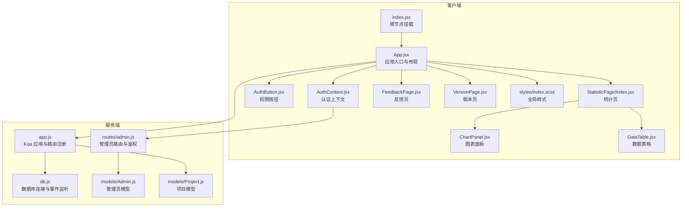
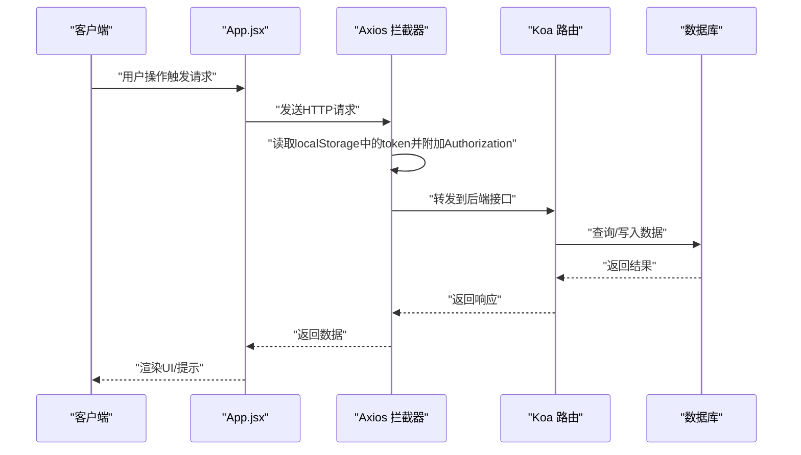
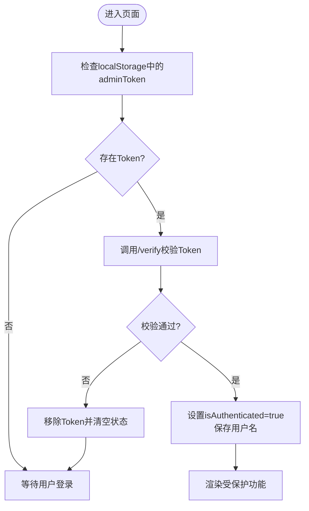
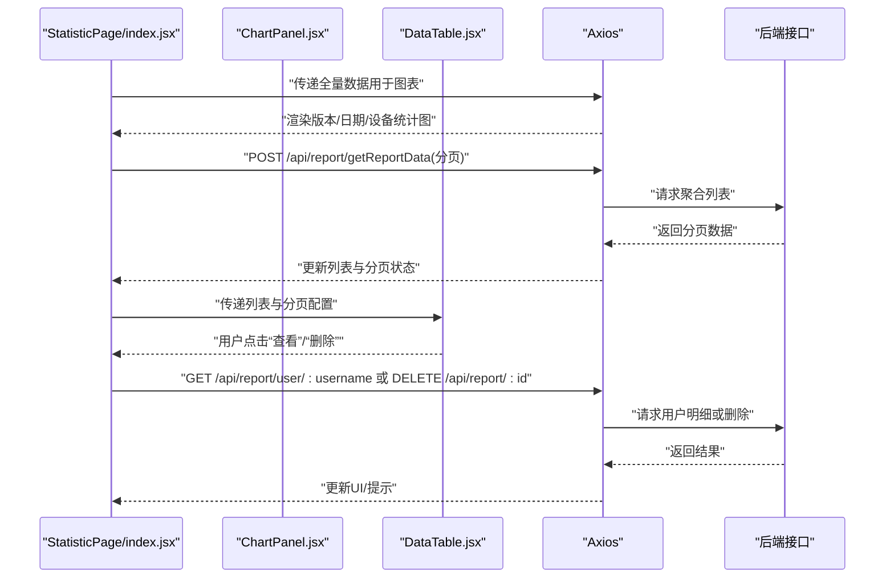
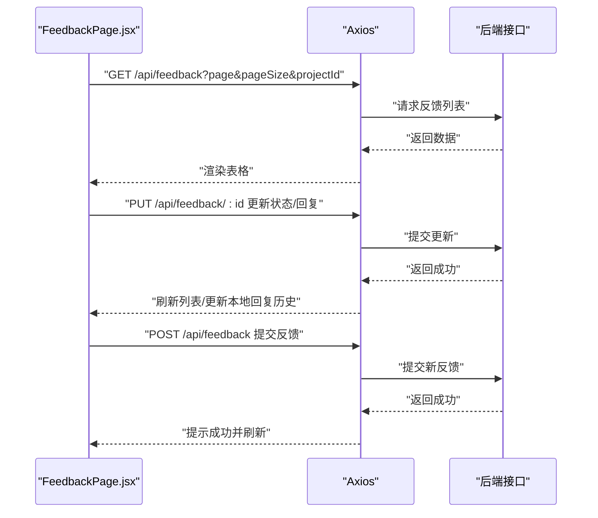
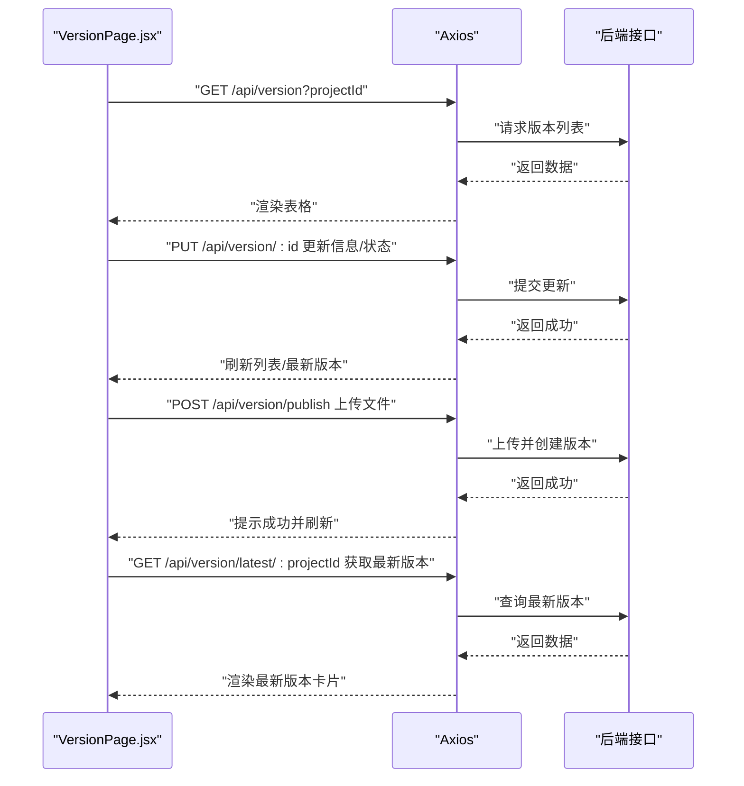
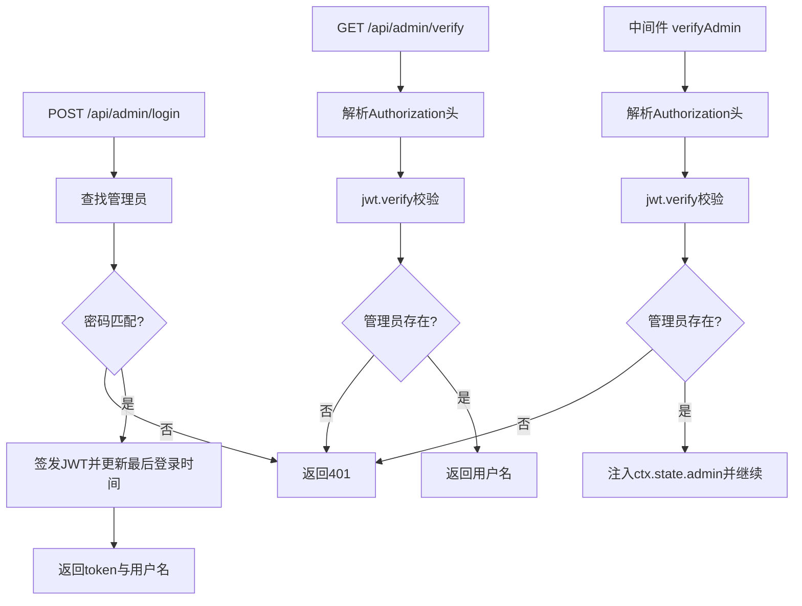
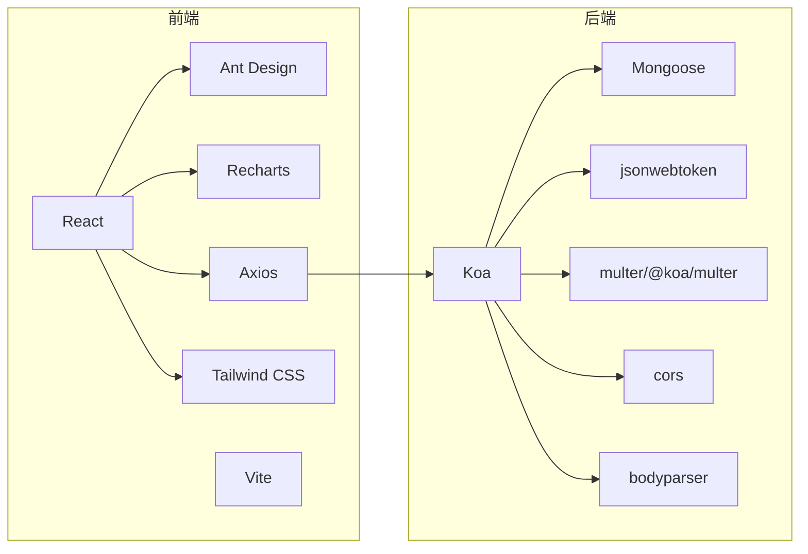

# 代码规范与最佳实践

<cite>
**本文引用的文件**
- [README.md](file://README.md)
- [client/package.json](file://client/package.json)
- [server/package.json](file://server/package.json)
- [client/src/App.jsx](file://client/src/App.jsx)
- [client/src/index.jsx](file://client/src/index.jsx)
- [client/src/context/AuthContext.jsx](file://client/src/context/AuthContext.jsx)
- [client/src/components/AuthButton.jsx](file://client/src/components/AuthButton.jsx)
- [client/src/pages/StatisticPage/index.jsx](file://client/src/pages/StatisticPage/index.jsx)
- [client/src/pages/StatisticPage/ChartPanel.jsx](file://client/src/pages/StatisticPage/ChartPanel.jsx)
- [client/src/pages/StatisticPage/DataTable.jsx](file://client/src/pages/StatisticPage/DataTable.jsx)
- [client/src/pages/FeedbackPage.jsx](file://client/src/pages/FeedbackPage.jsx)
- [client/src/pages/VersionPage.jsx](file://client/src/pages/VersionPage.jsx)
- [client/src/styles/index.scss](file://client/src/styles/index.scss)
- [server/app.js](file://server/app.js)
- [server/db.js](file://server/db.js)
- [server/routes/admin.js](file://server/routes/admin.js)
- [server/models/Admin.js](file://server/models/Admin.js)
- [server/models/Project.js](file://server/models/Project.js)
</cite>

## 目录
1. [简介](#简介)
2. [项目结构](#项目结构)
3. [核心组件](#核心组件)
4. [架构总览](#架构总览)
5. [详细组件分析](#详细组件分析)
6. [依赖关系分析](#依赖关系分析)
7. [性能考量](#性能考量)
8. [故障排查指南](#故障排查指南)
9. [结论](#结论)
10. [附录](#附录)

## 简介
本文件面向WoaX项目的开发与维护，系统性梳理前端与后端的编码规范、最佳实践与协作标准，覆盖以下方面：
- JavaScript/ES6+ 编码标准：变量命名、函数定义、异步编程、错误处理
- React 组件开发规范：结构设计、Props 校验、State 管理、Hook 使用、性能优化
- 后端 API 设计原则：RESTful 设计、路由组织、中间件与鉴权、数据库操作
- CSS/SCSS 样式规范：命名约定、样式隔离、响应式设计
- 代码审查清单、重构指南与团队协作标准

## 项目结构
WoaX 采用前后端分离架构：
- 前端：React + Vite 构建，Ant Design + Recharts 组件与可视化，Axios 进行 HTTP 请求
- 后端：Koa + MongoDB（Mongoose），JWT 实现管理员鉴权，静态资源托管上传目录
- 数据：JSON 文件作为示例数据源，配合 MongoDB 模型

**图示来源**
- [client/src/index.jsx](file://client/src/index.jsx#L1-L15)
- [client/src/App.jsx](file://client/src/App.jsx#L1-L253)
- [client/src/context/AuthContext.jsx](file://client/src/context/AuthContext.jsx#L1-L155)
- [client/src/components/AuthButton.jsx](file://client/src/components/AuthButton.jsx#L1-L43)
- [client/src/pages/StatisticPage/index.jsx](file://client/src/pages/StatisticPage/index.jsx#L1-L262)
- [client/src/pages/StatisticPage/ChartPanel.jsx](file://client/src/pages/StatisticPage/ChartPanel.jsx#L1-L129)
- [client/src/pages/StatisticPage/DataTable.jsx](file://client/src/pages/StatisticPage/DataTable.jsx#L1-L124)
- [client/src/pages/FeedbackPage.jsx](file://client/src/pages/FeedbackPage.jsx#L1-L496)
- [client/src/pages/VersionPage.jsx](file://client/src/pages/VersionPage.jsx#L1-L890)
- [client/src/styles/index.scss](file://client/src/styles/index.scss#L1-L36)
- [server/app.js](file://server/app.js#L1-L61)
- [server/db.js](file://server/db.js#L1-L45)
- [server/routes/admin.js](file://server/routes/admin.js#L1-L128)
- [server/models/Admin.js](file://server/models/Admin.js#L1-L32)
- [server/models/Project.js](file://server/models/Project.js#L1-L21)

**章节来源**
- [README.md](file://README.md#L1-L44)
- [client/package.json](file://client/package.json#L1-L47)
- [server/package.json](file://server/package.json#L1-L24)

## 核心组件
- 应用入口与布局：负责菜单导航、项目切换、登录态展示与页面路由
- 认证上下文：集中管理登录弹窗、令牌校验、登录/注销流程
- 权限按钮：统一处理“未登录即触发登录”的交互
- 统计页：聚合分页列表与全量图表数据，支持查看用户明细与删除记录
- 反馈页：列表、详情、状态更新、回复、删除与提交反馈
- 版本页：版本列表、详情、状态更新、设为最新、下载、发布新版本
- 全局样式：基于 Tailwind CSS 的基础样式与布局容器

**章节来源**
- [client/src/App.jsx](file://client/src/App.jsx#L1-L253)
- [client/src/context/AuthContext.jsx](file://client/src/context/AuthContext.jsx#L1-L155)
- [client/src/components/AuthButton.jsx](file://client/src/components/AuthButton.jsx#L1-L43)
- [client/src/pages/StatisticPage/index.jsx](file://client/src/pages/StatisticPage/index.jsx#L1-L262)
- [client/src/pages/FeedbackPage.jsx](file://client/src/pages/FeedbackPage.jsx#L1-L496)
- [client/src/pages/VersionPage.jsx](file://client/src/pages/VersionPage.jsx#L1-L890)
- [client/src/styles/index.scss](file://client/src/styles/index.scss#L1-L36)

## 架构总览
- 前端通过 Axios 统一发起请求，请求拦截器自动附加 Bearer Token
- 后端 Koa 应用注册路由前缀，静态文件服务处理上传目录
- 管理员登录签发 JWT，后续接口通过中间件校验并注入管理员信息
- 数据库连接通过 Mongoose，监听断连与错误事件，优雅关闭

**图示来源**
- [client/src/App.jsx](file://client/src/App.jsx#L18-L25)
- [server/app.js](file://server/app.js#L30-L55)
- [server/db.js](file://server/db.js#L10-L24)

**章节来源**
- [server/app.js](file://server/app.js#L1-L61)
- [server/db.js](file://server/db.js#L1-L45)

## 详细组件分析

### 认证上下文与权限按钮
- 认证上下文职责：初始化时校验本地 Token；登录表单校验与提交；登录成功持久化 Token；注销清理；提供登录弹窗控制
- 权限按钮：未登录时以 Tooltip 提示并禁用，点击触发登录弹窗；已登录则透传原生点击行为

**图示来源**
- [client/src/context/AuthContext.jsx](file://client/src/context/AuthContext.jsx#L16-L48)

**章节来源**
- [client/src/context/AuthContext.jsx](file://client/src/context/AuthContext.jsx#L1-L155)
- [client/src/components/AuthButton.jsx](file://client/src/components/AuthButton.jsx#L1-L43)

### 统计页组件链路
- 页面组件负责聚合分页列表与全量图表数据，监听项目变化事件，支持查看用户明细与删除记录
- 图表面板按版本、日期、设备维度聚合数据并渲染多种图表
- 数据表格支持横向滚动与分页，列宽固定并提供 Tooltip 展示溢出内容

**图示来源**
- [client/src/pages/StatisticPage/index.jsx](file://client/src/pages/StatisticPage/index.jsx#L57-L109)
- [client/src/pages/StatisticPage/ChartPanel.jsx](file://client/src/pages/StatisticPage/ChartPanel.jsx#L8-L53)
- [client/src/pages/StatisticPage/DataTable.jsx](file://client/src/pages/StatisticPage/DataTable.jsx#L6-L93)

**章节来源**
- [client/src/pages/StatisticPage/index.jsx](file://client/src/pages/StatisticPage/index.jsx#L1-L262)
- [client/src/pages/StatisticPage/ChartPanel.jsx](file://client/src/pages/StatisticPage/ChartPanel.jsx#L1-L129)
- [client/src/pages/StatisticPage/DataTable.jsx](file://client/src/pages/StatisticPage/DataTable.jsx#L1-L124)

### 反馈页组件链路
- 列表：分页获取反馈，支持状态徽章与操作按钮
- 详情：可更新状态与回复，支持富文本编辑器
- 提交：匿名用户可提交反馈，携带项目 ID

**图示来源**
- [client/src/pages/FeedbackPage.jsx](file://client/src/pages/FeedbackPage.jsx#L66-L191)

**章节来源**
- [client/src/pages/FeedbackPage.jsx](file://client/src/pages/FeedbackPage.jsx#L1-L496)

### 版本页组件链路
- 列表：分页获取版本，支持状态徽章与操作按钮
- 详情：可更新版本号、描述、状态与更新方式
- 发布：支持上传安装包与描述文件，设置最新版本并下载

**图示来源**
- [client/src/pages/VersionPage.jsx](file://client/src/pages/VersionPage.jsx#L72-L120)
- [client/src/pages/VersionPage.jsx](file://client/src/pages/VersionPage.jsx#L406-L459)

**章节来源**
- [client/src/pages/VersionPage.jsx](file://client/src/pages/VersionPage.jsx#L1-L890)

### 后端路由与鉴权
- 管理员登录：校验用户名/密码，签发 JWT 并更新最后登录时间
- 校验 Token：解析 JWT 并查询管理员是否存在
- 鉴权中间件：校验 Token 并将管理员对象注入 ctx.state

**图示来源**
- [server/routes/admin.js](file://server/routes/admin.js#L26-L98)
- [server/routes/admin.js](file://server/routes/admin.js#L100-L125)

**章节来源**
- [server/routes/admin.js](file://server/routes/admin.js#L1-L128)
- [server/models/Admin.js](file://server/models/Admin.js#L1-L32)

## 依赖关系分析
- 前端依赖：React 生态、Ant Design、Recharts、Axios、Tailwind CSS、Vite
- 后端依赖：Koa 生态、Mongoose、JWT、Multer、CORS、BodyParser
- 项目通过代理将前端请求转发至后端，便于联调

**图示来源**
- [client/package.json](file://client/package.json#L1-L47)
- [server/package.json](file://server/package.json#L1-L24)

**章节来源**
- [client/package.json](file://client/package.json#L1-L47)
- [server/package.json](file://server/package.json#L1-L24)

## 性能考量
- 前端
  - 使用响应式图表容器与固定列宽，避免频繁重排
  - 表格启用横向滚动与分页，减少一次性渲染的数据量
  - 项目切换通过自定义事件通知子组件，避免深层重渲染
  - 登录态校验仅在初始化时执行，避免重复请求
- 后端
  - 静态文件服务仅处理上传目录，其他请求走路由
  - 数据库连接监听断连与错误，应用退出时关闭连接
  - 接口返回统一结构，前端按 success 字段判断业务逻辑

[本节为通用指导，无需列出具体文件来源]

## 故障排查指南
- 登录失败
  - 检查管理员用户名/密码是否正确
  - 确认 JWT Secret 是否一致
  - 查看后端日志与 401/500 错误
- 请求无权限
  - 确认 Authorization 头是否包含 Bearer Token
  - 检查 Token 是否过期或被篡改
  - 确认中间件 verifyAdmin 是否正确注入 ctx.state.admin
- 图表/表格空白
  - 检查项目 ID 是否有效
  - 确认后端接口返回 success 且 data 非空
  - 查看前端 loading 状态与错误提示
- 文件下载异常
  - 检查 downloadUrl 是否存在
  - 确认文件名编码修复逻辑是否生效
  - 使用 fetch + Blob 方式下载并设置正确的 Content-Type

**章节来源**
- [client/src/App.jsx](file://client/src/App.jsx#L18-L25)
- [client/src/context/AuthContext.jsx](file://client/src/context/AuthContext.jsx#L62-L92)
- [server/routes/admin.js](file://server/routes/admin.js#L100-L125)
- [client/src/pages/VersionPage.jsx](file://client/src/pages/VersionPage.jsx#L351-L404)

## 结论
本规范围绕 WoaX 项目的实际实现，总结了从前端组件到后端 API 的编码与协作标准。建议团队在日常开发中遵循本文档的命名、结构、异步与错误处理规范，持续完善测试与文档，确保代码一致性与可维护性。

[本节为总结性内容，无需列出具体文件来源]

## 附录

### JavaScript/ES6+ 编码标准
- 命名约定
  - 变量与函数：驼峰命名
  - 常量：大写下划线分隔
  - 类与组件：帕斯卡命名
- 函数定义
  - 优先使用箭头函数表达式
  - 异步函数统一使用 async/await
  - 参数默认值与解构赋值提升可读性
- 异步编程
  - 使用 Promise 包装回调 API
  - 在组件中通过 useEffect 管理副作用
  - 对外暴露统一的错误处理与消息提示
- 错误处理
  - try/catch 包裹异步调用
  - 对 4xx/5xx 响应进行分支处理
  - 控制台输出错误但不泄露敏感信息

**章节来源**
- [client/src/pages/StatisticPage/index.jsx](file://client/src/pages/StatisticPage/index.jsx#L57-L109)
- [client/src/pages/FeedbackPage.jsx](file://client/src/pages/FeedbackPage.jsx#L66-L191)
- [client/src/pages/VersionPage.jsx](file://client/src/pages/VersionPage.jsx#L72-L120)

### React 组件开发规范
- 组件结构设计
  - 页面组件负责数据聚合与状态管理，子组件专注展示
  - 使用受控组件与表单库进行表单校验
- Props 校验
  - 对外部传入的 props 进行类型与必填校验
  - 使用默认值保证组件健壮性
- State 管理
  - 将可复用的状态抽离为自定义 Hook
  - 使用 Context 管理跨层级共享状态
- Hook 使用规范
  - useEffect 的依赖数组明确，避免无限循环
  - useCallback/useMemo 缓存计算结果与回调
- 性能优化技巧
  - 表格横向滚动与分页
  - 图表容器响应式与懒渲染
  - 项目切换事件驱动，减少不必要的重渲染

**章节来源**
- [client/src/pages/StatisticPage/DataTable.jsx](file://client/src/pages/StatisticPage/DataTable.jsx#L6-L93)
- [client/src/pages/StatisticPage/ChartPanel.jsx](file://client/src/pages/StatisticPage/ChartPanel.jsx#L8-L53)
- [client/src/context/AuthContext.jsx](file://client/src/context/AuthContext.jsx#L16-L48)

### 后端 API 设计原则
- RESTful 设计模式
  - 资源命名使用名词复数，路径清晰表达层级
  - 使用标准 HTTP 方法表达 CRUD 操作
- 路由组织
  - 按模块划分路由前缀，如 /api/report、/api/feedback、/api/version、/api/projects、/api/admin
- 中间件与鉴权
  - 使用 verifyAdmin 中间件统一校验管理员权限
  - 将管理员对象注入 ctx.state 供后续处理器使用
- 数据库操作规范
  - 使用 Mongoose Schema 定义数据结构
  - 连接监听断连与错误，优雅关闭连接
  - 返回统一的成功/失败结构，便于前端处理

**章节来源**
- [server/app.js](file://server/app.js#L48-L55)
- [server/routes/admin.js](file://server/routes/admin.js#L100-L125)
- [server/db.js](file://server/db.js#L26-L40)

### CSS/SCSS 样式编写规范
- 命名约定
  - 使用语义化类名，避免过度依赖 BEM
  - 与 Tailwind CSS 协同时，保持最小化自定义样式
- 组件样式隔离
  - 优先使用内联样式或 CSS-in-JS 控制局部样式
  - 避免全局污染，必要时通过作用域或命名空间限定
- 响应式设计原则
  - 使用 Tailwind 的响应式前缀适配多端
  - 图表与表格容器使用响应式高度与宽度

**章节来源**
- [client/src/styles/index.scss](file://client/src/styles/index.scss#L1-L36)

### 代码审查清单
- 前端
  - 是否使用统一的错误处理与消息提示
  - 是否存在未使用的依赖与冗余代码
  - 是否遵循命名与导入顺序规范
  - 是否对关键交互进行了单元/集成测试
- 后端
  - 是否对输入参数进行校验与清洗
  - 是否使用中间件统一处理鉴权与日志
  - 是否对数据库操作进行事务与回滚处理
  - 是否对敏感信息进行脱敏与安全防护

[本节为通用指导，无需列出具体文件来源]

### 重构指南
- 组件拆分
  - 将复杂页面拆分为多个小而专一的子组件
  - 提取可复用的展示组件与业务组件
- 状态抽取
  - 将跨组件共享的状态迁移至 Context 或集中式状态管理
  - 使用自定义 Hook 封装复杂逻辑
- API 适配
  - 统一响应结构，便于前端消费
  - 对外暴露稳定接口，内部实现可演进

[本节为通用指导，无需列出具体文件来源]

### 团队协作编码标准
- 提交信息
  - 使用动宾短语，简述变更内容与影响范围
- 分支策略
  - 主分支保护，功能开发在特性分支完成
- 代码评审
  - 至少一次同行评审，关注可读性与安全性
- 文档同步
  - 变更接口与数据结构需同步更新文档

[本节为通用指导，无需列出具体文件来源]