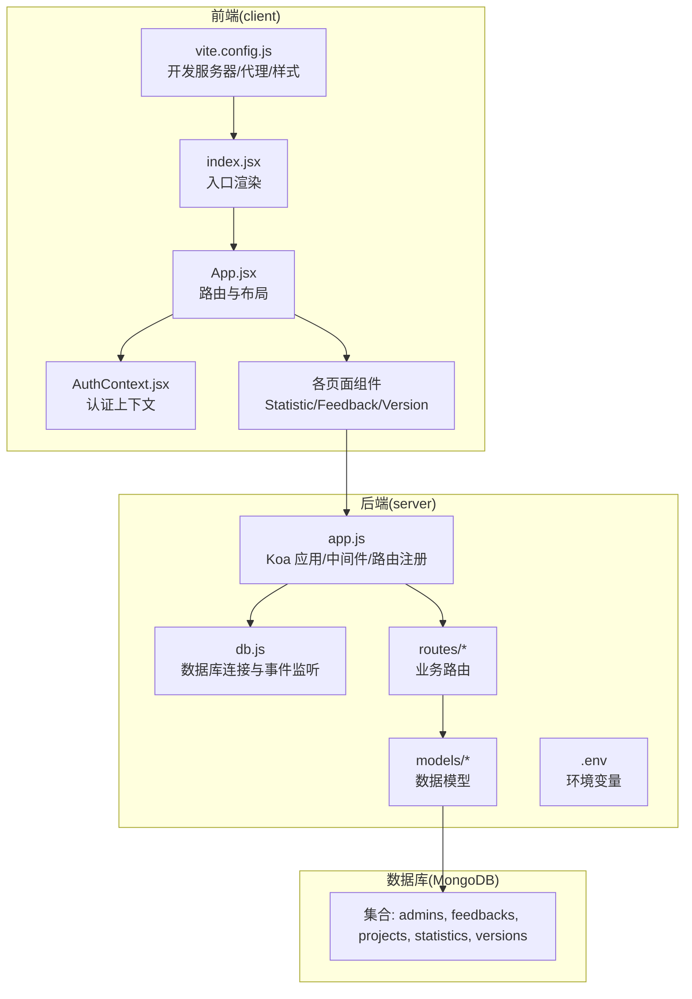
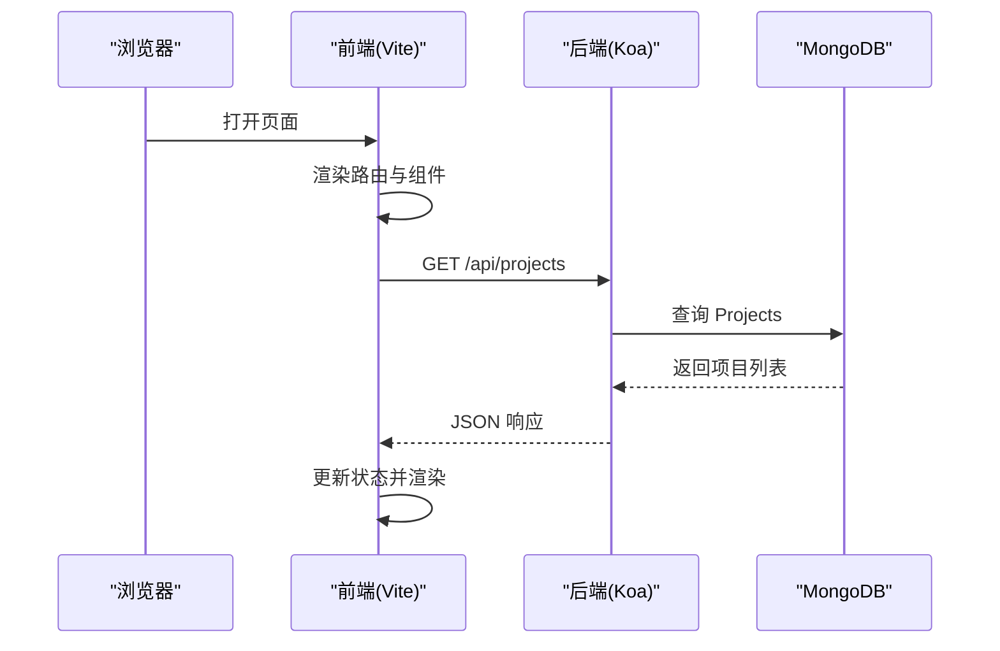
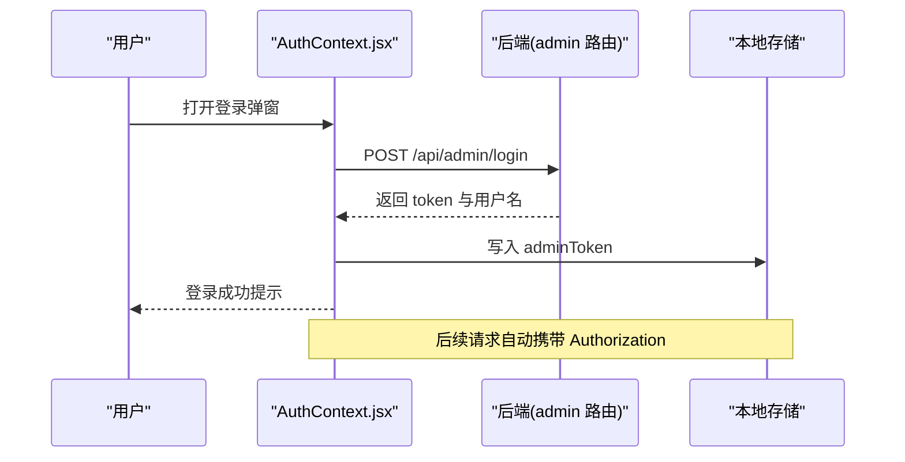
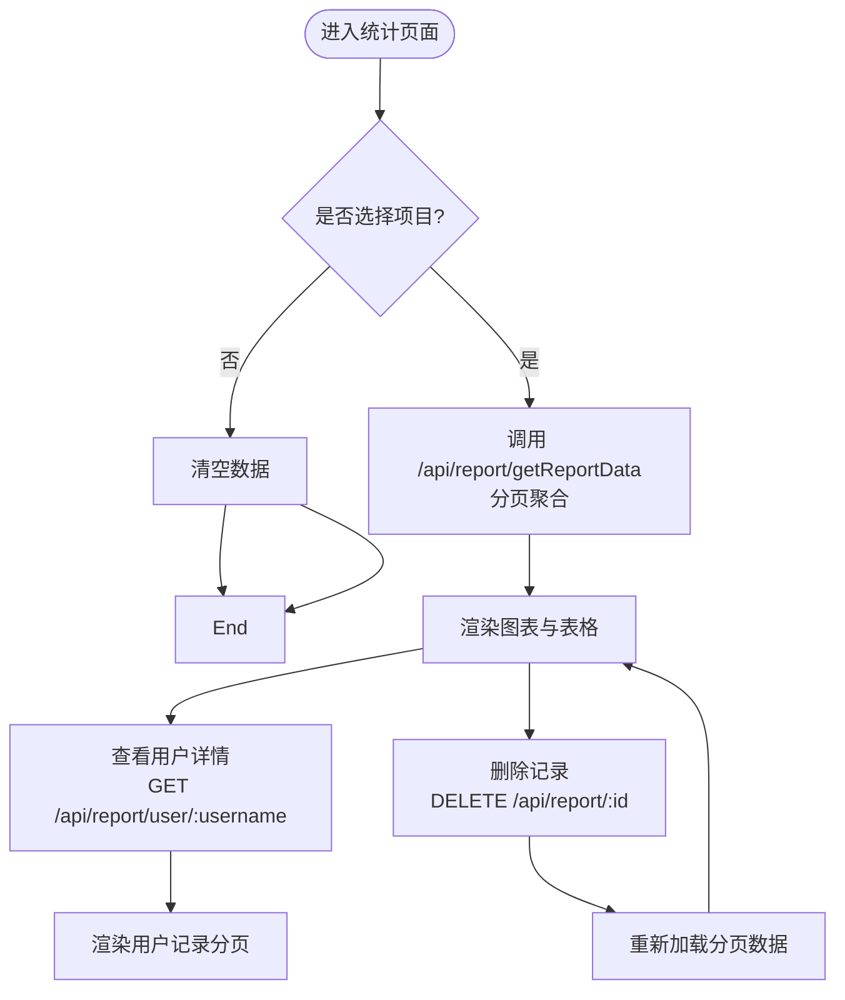
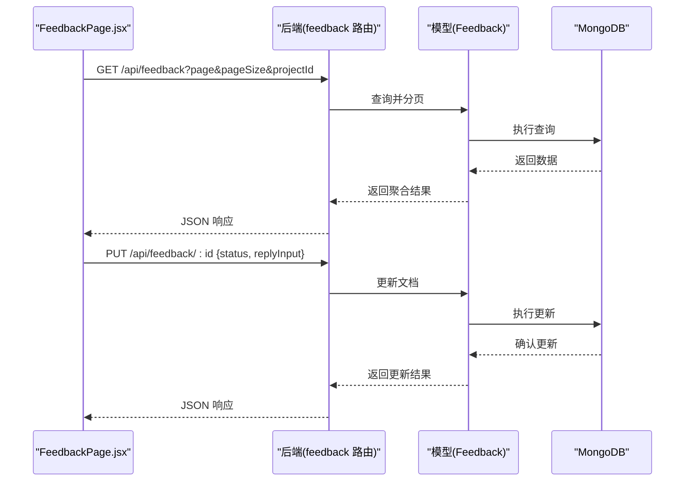
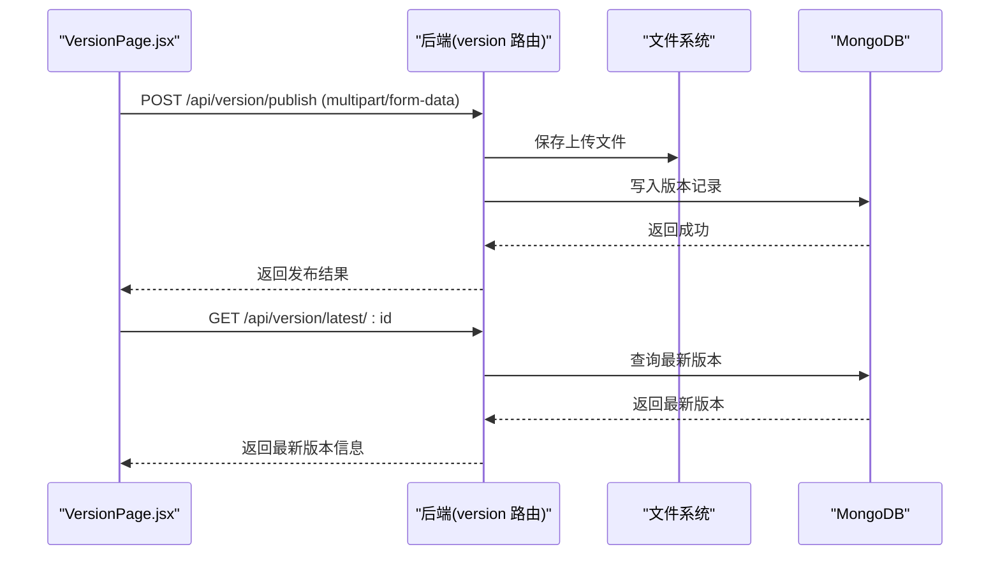
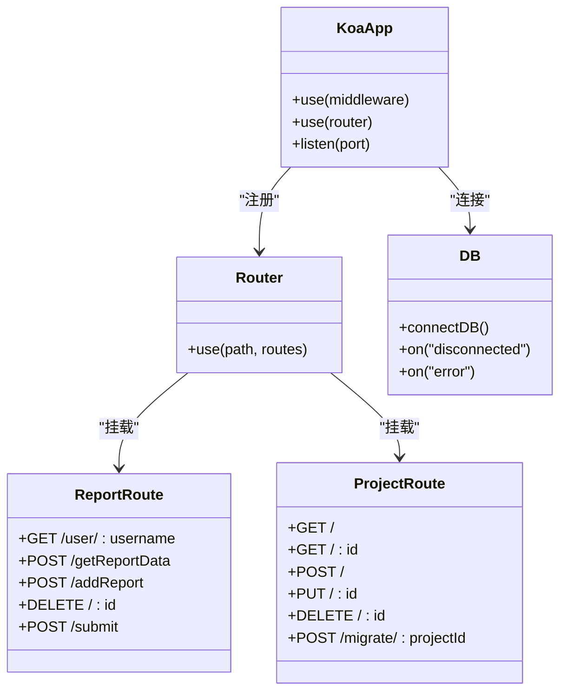
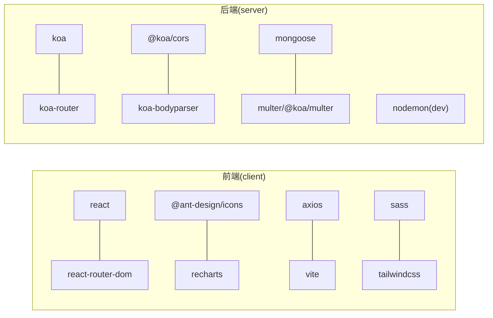

# 开发指南

<cite>
**本文引用的文件**
- [README.md](file://README.md)
- [client/package.json](file://client/package.json)
- [server/package.json](file://server/package.json)
- [client/vite.config.js](file://client/vite.config.js)
- [client/src/App.jsx](file://client/src/App.jsx)
- [client/src/index.jsx](file://client/src/index.jsx)
- [client/src/context/AuthContext.jsx](file://client/src/context/AuthContext.jsx)
- [client/src/pages/StatisticPage/index.jsx](file://client/src/pages/StatisticPage/index.jsx)
- [client/src/pages/FeedbackPage.jsx](file://client/src/pages/FeedbackPage.jsx)
- [client/src/pages/VersionPage.jsx](file://client/src/pages/VersionPage.jsx)
- [server/app.js](file://server/app.js)
- [server/db.js](file://server/db.js)
- [server/.env](file://server/.env)
- [server/routes/report.js](file://server/routes/report.js)
- [server/routes/project.js](file://server/routes/project.js)
- [server/models/Admin.js](file://server/models/Admin.js)
</cite>

## 目录
1. [简介](#简介)
2. [项目结构](#项目结构)
3. [核心组件](#核心组件)
4. [架构总览](#架构总览)
5. [详细组件分析](#详细组件分析)
6. [依赖关系分析](#依赖关系分析)
7. [性能考虑](#性能考虑)
8. [调试与开发工具](#调试与开发工具)
9. [测试策略与质量保证](#测试策略与质量保证)
10. [扩展与插件机制](#扩展与插件机制)
11. [开发环境配置与团队协作](#开发环境配置与团队协作)
12. [故障排查指南](#故障排查指南)
13. [结论](#结论)

## 简介
WoaX 是一个基于 React 前端、Node.js + Koa 后端与 MongoDB 的全栈应用，提供三类核心能力：
- 数据统计：收集用户上报数据（时间、用户名、IP、设备信息等），支持聚合展示与分页。
- 意见反馈：收集用户反馈，支持状态管理与回复历史。
- 版本更新通知：管理版本信息与文件发布，支持多种更新策略与下载。

项目采用前后端分离架构，前端使用 Vite + React + Ant Design，后端使用 Koa + Mongoose，数据库为 MongoDB；通过 .env 统一管理环境变量，支持静态资源与上传文件服务。

章节来源
- [README.md](file://README.md#L1-L44)

## 项目结构
- 前端 client
  - 构建工具：Vite
  - 路由：React Router
  - UI 组件库：Ant Design
  - 样式：TailwindCSS + SCSS
  - 代理与开发服务器：vite.config.js
- 后端 server
  - Web 框架：Koa
  - ORM：Mongoose
  - 路由：Koa Router
  - 中间件：CORS、BodyParser、Multer
  - 环境变量：.env
  - 静态文件与上传目录：/uploads

图示来源
- [client/src/App.jsx](file://client/src/App.jsx#L1-L253)
- [client/src/index.jsx](file://client/src/index.jsx#L1-L15)
- [client/vite.config.js](file://client/vite.config.js#L1-L50)
- [server/app.js](file://server/app.js#L1-L61)
- [server/db.js](file://server/db.js#L1-L45)
- [server/.env](file://server/.env#L1-L9)

章节来源
- [client/package.json](file://client/package.json#L1-L47)
- [server/package.json](file://server/package.json#L1-L24)
- [client/vite.config.js](file://client/vite.config.js#L1-L50)
- [server/app.js](file://server/app.js#L1-L61)
- [server/db.js](file://server/db.js#L1-L45)
- [server/.env](file://server/.env#L1-L9)

## 核心组件
- 前端核心
  - 应用入口与路由：App.jsx 负责菜单、头部、页面路由与全局状态；index.jsx 负责渲染根节点。
  - 认证上下文：AuthContext.jsx 提供登录弹窗、令牌校验、登出与状态管理。
  - 页面组件：StatisticPage（统计图表与表格）、FeedbackPage（反馈列表与回复）、VersionPage（版本发布与下载）。
- 后端核心
  - 应用入口：app.js 注册 CORS、BodyParser、静态文件服务与路由，启动服务器。
  - 数据库连接：db.js 负责连接 MongoDB、事件监听与优雅关闭。
  - 路由模块：report.js（统计）、feedback.js（反馈）、version.js（版本）、project.js（项目）、admin.js（认证）。
  - 模型：Admin 等模型定义数据结构与方法。

章节来源
- [client/src/App.jsx](file://client/src/App.jsx#L1-L253)
- [client/src/index.jsx](file://client/src/index.jsx#L1-L15)
- [client/src/context/AuthContext.jsx](file://client/src/context/AuthContext.jsx#L1-L155)
- [client/src/pages/StatisticPage/index.jsx](file://client/src/pages/StatisticPage/index.jsx#L1-L262)
- [client/src/pages/FeedbackPage.jsx](file://client/src/pages/FeedbackPage.jsx#L1-L496)
- [client/src/pages/VersionPage.jsx](file://client/src/pages/VersionPage.jsx#L1-L800)
- [server/app.js](file://server/app.js#L1-L61)
- [server/db.js](file://server/db.js#L1-L45)
- [server/models/Admin.js](file://server/models/Admin.js#L1-L32)

## 架构总览
整体采用前后端分离模式，前端通过 /api 前缀调用后端接口，后端通过 Koa Router 路由到对应控制器，使用 Mongoose 操作 MongoDB。

图示来源
- [client/src/App.jsx](file://client/src/App.jsx#L77-L118)
- [server/app.js](file://server/app.js#L48-L55)
- [server/routes/project.js](file://server/routes/project.js#L9-L25)

章节来源
- [client/src/App.jsx](file://client/src/App.jsx#L1-L253)
- [server/app.js](file://server/app.js#L1-L61)

## 详细组件分析

### 前端应用与认证流程
- 登录弹窗与令牌校验：AuthContext.jsx 在初始化时读取本地存储的 adminToken 并调用 /api/admin/verify 校验；登录成功后写入本地存储。
- 请求拦截：App.jsx 中 axios 请求拦截器自动附加 Authorization 头，简化后端鉴权。
- 项目切换：App.jsx 通过 localStorage 保存当前项目，页面组件监听 projectChanged 事件刷新数据。

图示来源
- [client/src/context/AuthContext.jsx](file://client/src/context/AuthContext.jsx#L24-L92)
- [client/src/App.jsx](file://client/src/App.jsx#L18-L25)

章节来源
- [client/src/context/AuthContext.jsx](file://client/src/context/AuthContext.jsx#L1-L155)
- [client/src/App.jsx](file://client/src/App.jsx#L1-L253)

### 统计页面数据流
- 聚合分页：StatisticPage/index.jsx 调用 /api/report/getReportData，后端使用聚合管道按用户名去重并分页。
- 全量数据：用于图表展示，一次性获取较大数量数据。
- 用户详情：点击用户查看其完整记录，后端按用户名与项目 ID 查询分页列表。
- 删除记录：调用 /api/report/:id，需管理员权限。

图示来源
- [client/src/pages/StatisticPage/index.jsx](file://client/src/pages/StatisticPage/index.jsx#L57-L125)
- [server/routes/report.js](file://server/routes/report.js#L8-L88)

章节来源
- [client/src/pages/StatisticPage/index.jsx](file://client/src/pages/StatisticPage/index.jsx#L1-L262)
- [server/routes/report.js](file://server/routes/report.js#L1-L271)

### 反馈页面交互
- 列表与分页：GET /api/feedback，支持按项目 ID 过滤。
- 状态与回复：PUT /api/feedback/:id 更新状态与回复内容；删除反馈需管理员权限。
- 提交反馈：POST /api/feedback，支持匿名用户提交。

图示来源
- [client/src/pages/FeedbackPage.jsx](file://client/src/pages/FeedbackPage.jsx#L66-L175)
- [server/routes/report.js](file://server/routes/report.js#L89-L131)

章节来源
- [client/src/pages/FeedbackPage.jsx](file://client/src/pages/FeedbackPage.jsx#L1-L496)
- [server/routes/report.js](file://server/routes/report.js#L1-L271)

### 版本页面与文件上传
- 列表与最新版本：GET /api/version 与 GET /api/version/latest/:id。
- 发布新版本：POST /api/version/publish，支持多文件上传与更新类型选择。
- 下载与文件名修复：处理中文文件名编码问题，确保下载文件名正确。

图示来源
- [client/src/pages/VersionPage.jsx](file://client/src/pages/VersionPage.jsx#L406-L459)
- [server/app.js](file://server/app.js#L24-L45)

章节来源
- [client/src/pages/VersionPage.jsx](file://client/src/pages/VersionPage.jsx#L1-L800)
- [server/app.js](file://server/app.js#L1-L61)

### 后端路由与数据库连接
- 中间件：CORS、BodyParser、静态文件服务（/uploads）。
- 路由注册：/api/report、/api/feedback、/api/version、/api/projects、/api/admin。
- 数据库：连接字符串来自 .env，监听断开与错误事件，应用退出时关闭连接。

图示来源
- [server/app.js](file://server/app.js#L1-L61)
- [server/db.js](file://server/db.js#L1-L45)
- [server/routes/report.js](file://server/routes/report.js#L1-L271)
- [server/routes/project.js](file://server/routes/project.js#L1-L226)

章节来源
- [server/app.js](file://server/app.js#L1-L61)
- [server/db.js](file://server/db.js#L1-L45)
- [server/routes/report.js](file://server/routes/report.js#L1-L271)
- [server/routes/project.js](file://server/routes/project.js#L1-L226)

## 依赖关系分析
- 前端依赖
  - React 生态：react、react-dom、react-router-dom、@ant-design/icons、react-quill、recharts。
  - 构建与样式：vite、@vitejs/plugin-react、tailwindcss、sass。
  - 网络：axios。
- 后端依赖
  - Web 框架：koa、@koa/cors、koa-router、koa-bodyparser。
  - 数据库：mongoose。
  - 文件上传：@koa/multer、multer。
  - 开发：nodemon。

图示来源
- [client/package.json](file://client/package.json#L1-L47)
- [server/package.json](file://server/package.json#L1-L24)

章节来源
- [client/package.json](file://client/package.json#L1-L47)
- [server/package.json](file://server/package.json#L1-L24)

## 性能考虑
- 前端
  - 图表数据一次性拉取较大数量以减少多次请求，但需注意内存占用与渲染性能。
  - 分页查询建议后端增加索引与投影字段，避免不必要的字段传输。
- 后端
  - 聚合管道中对用户名去重与排序需确保相关字段建立索引，提升聚合性能。
  - 静态文件服务仅处理 /uploads，避免不必要的 IO。
  - 上传文件大小限制与类型校验可进一步增强，防止异常文件导致磁盘压力。
- 数据库
  - 为常用查询字段（如 username、projectId、timestamp）建立复合索引，优化分页与聚合性能。

章节来源
- [client/src/pages/StatisticPage/index.jsx](file://client/src/pages/StatisticPage/index.jsx#L87-L109)
- [server/routes/report.js](file://server/routes/report.js#L26-L74)
- [server/app.js](file://server/app.js#L24-L45)
- [server/.env](file://server/.env#L7-L9)

## 调试与开发工具
- 浏览器调试
  - React DevTools：检查组件树与 props/state。
  - 网络面板：观察 /api 请求的响应体与状态码，定位接口问题。
  - 控制台：查看 axios 请求拦截器注入的 Authorization 头是否正确。
- Node.js 调试
  - 后端使用 nodemon 开发模式自动重启，便于热更新。
  - 在 app.js 中设置断点，逐步跟踪中间件与路由执行流程。
  - 数据库连接失败时关注 db.js 的错误日志与退出策略。
- 数据库查询优化
  - 使用聚合管道时，先在 MongoDB Shell 中验证 pipeline，再集成到后端。
  - 对高频查询字段建立索引，结合 explain() 分析执行计划。
- 开发服务器与代理
  - 前端 Vite 代理将 /api 请求转发至后端 3001 端口，确保跨域与本地联调顺畅。

章节来源
- [client/vite.config.js](file://client/vite.config.js#L14-L22)
- [client/src/App.jsx](file://client/src/App.jsx#L18-L25)
- [server/app.js](file://server/app.js#L58-L61)
- [server/db.js](file://server/db.js#L18-L23)

## 测试策略与质量保证
- 单元测试
  - 前端：针对组件逻辑（如统计页面分页、反馈状态切换）编写测试，覆盖边界条件与错误分支。
  - 后端：对路由处理器进行单元测试，模拟请求与响应，验证鉴权、参数校验与数据库操作。
- 集成测试
  - 端到端验证：从前端页面触发动作（如发布版本、提交反馈），后端写入数据库并返回正确响应。
  - 数据一致性：验证聚合查询与分页结果与数据库记录一致。
- 质量保证
  - ESLint：遵循 React App 推荐规则，保持代码风格统一。
  - 依赖安全：定期更新依赖，关注安全公告。
  - 日志与监控：在关键路径输出日志，便于问题追踪。

章节来源
- [client/package.json](file://client/package.json#L25-L30)

## 扩展与插件机制
- 中间件扩展
  - 在 app.js 中新增自定义中间件（如日志、限流、鉴权），插入到现有中间件之前或之后，确保顺序合理。
- 组件复用
  - 将通用 UI（如弹窗、表单、分页控件）抽象为独立组件，提高复用性与可维护性。
- 功能模块化
  - 路由与模型按功能拆分（report/feedback/version/project/admin），新增功能时遵循相同目录结构。
- 插件化思路
  - 可引入插件注册机制（如钩子系统）在关键节点注入行为（如审计日志、指标上报），但需谨慎评估复杂度与性能影响。

章节来源
- [server/app.js](file://server/app.js#L30-L55)
- [server/routes/report.js](file://server/routes/report.js#L1-L271)
- [server/routes/project.js](file://server/routes/project.js#L1-L226)

## 开发环境配置与团队协作
- 环境变量
  - 使用 .env 管理端口、数据库连接与上传目录大小限制，避免硬编码。
- 本地开发
  - 前端：Vite 提供快速热更新与代理；后端：nodemon 实现自动重启。
- 团队协作
  - 统一代码风格（ESLint）、提交前 lint 与格式化。
  - 分支策略：功能开发在特性分支，合并前进行代码评审与测试。
  - 文档同步：变更路由、模型或数据库结构时同步更新 README 或设计文档。

章节来源
- [server/.env](file://server/.env#L1-L9)
- [client/vite.config.js](file://client/vite.config.js#L1-L50)
- [server/package.json](file://server/package.json#L7-L8)

## 故障排查指南
- 前端常见问题
  - 无法登录：检查 AuthContext 是否正确写入 adminToken，确认 /api/admin/verify 能正常访问。
  - 接口 401：确认 axios 请求拦截器是否注入 Authorization 头。
  - 项目为空：前端会尝试创建默认项目，若失败检查后端 /api/projects 的创建逻辑。
- 后端常见问题
  - 数据库连接失败：检查 .env 中 MONGODB_URI，查看 db.js 的错误日志。
  - 上传失败：确认 /uploads 目录存在且具备写权限，检查文件大小与类型限制。
  - 聚合性能差：为相关字段建立索引，优化聚合管道。
- 数据库常见问题
  - 聚合结果为空：确认 projectId 参数传递正确，检查数据是否已迁移至带 projectId 的记录。

章节来源
- [client/src/context/AuthContext.jsx](file://client/src/context/AuthContext.jsx#L24-L48)
- [client/src/App.jsx](file://client/src/App.jsx#L18-L25)
- [server/db.js](file://server/db.js#L18-L23)
- [server/app.js](file://server/app.js#L24-L28)
- [server/routes/report.js](file://server/routes/report.js#L26-L74)

## 结论
WoaX 提供了清晰的前后端分离架构与模块化的业务功能。通过合理的中间件与路由组织、完善的认证与权限控制、以及可扩展的数据库设计，能够支撑数据统计、意见反馈与版本管理等核心场景。建议在后续迭代中持续完善测试体系、性能优化与可观测性建设，以保障系统的稳定性与可维护性。