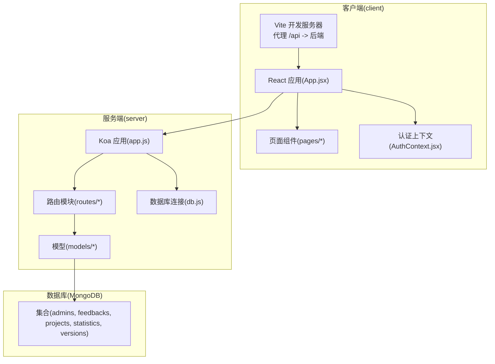
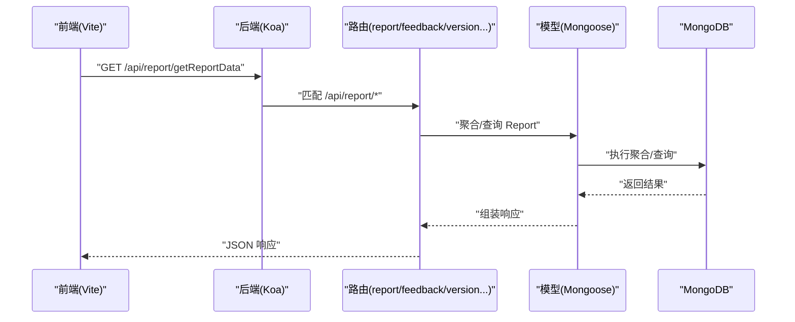
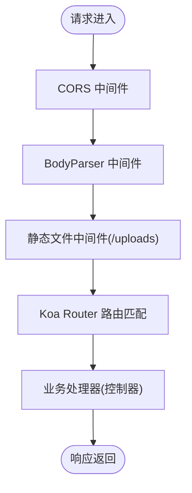
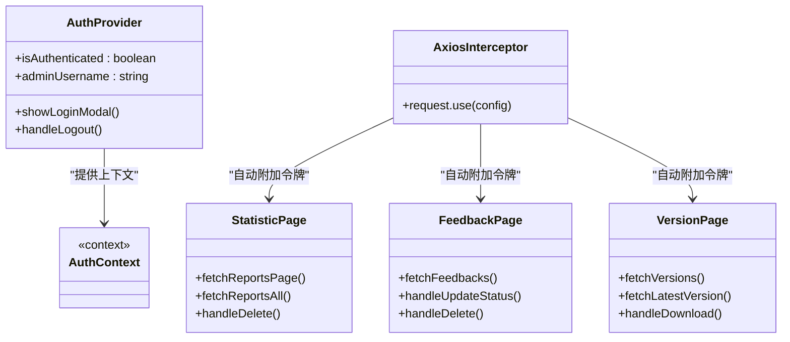
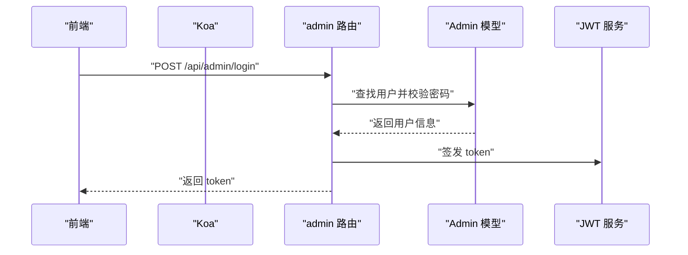
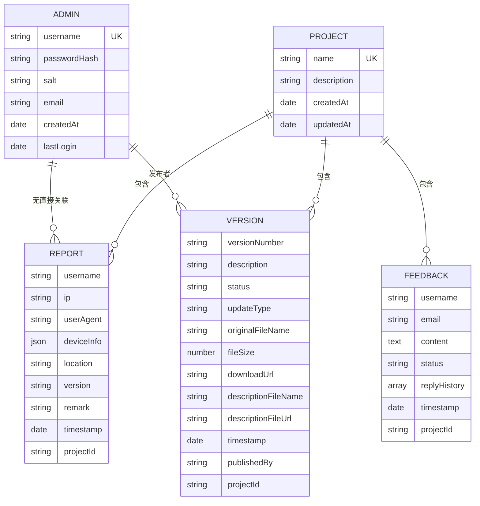
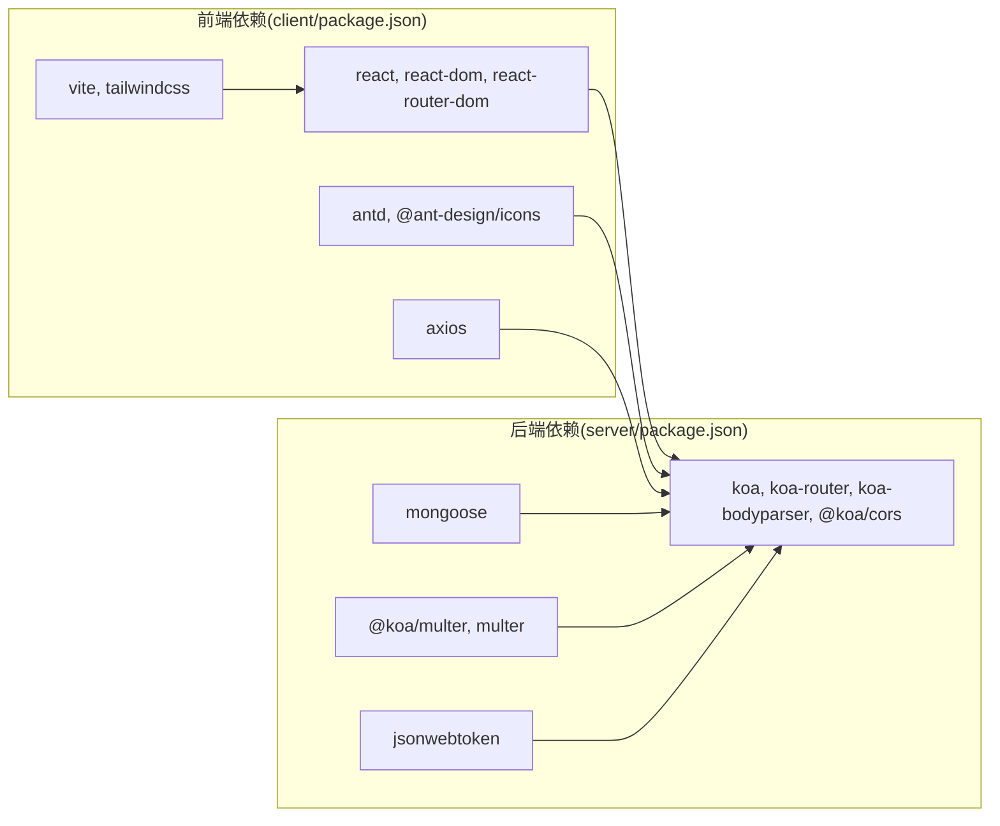

# 扩展开发与插件机制

<cite>
**本文引用的文件**
- [README.md](file://README.md)
- [client/package.json](file://client/package.json)
- [server/package.json](file://server/package.json)
- [client/src/App.jsx](file://client/src/App.jsx)
- [server/app.js](file://server/app.js)
- [server/db.js](file://server/db.js)
- [client/src/context/AuthContext.jsx](file://client/src/context/AuthContext.jsx)
- [server/routes/report.js](file://server/routes/report.js)
- [server/models/Admin.js](file://server/models/Admin.js)
- [client/vite.config.js](file://client/vite.config.js)
- [server/routes/admin.js](file://server/routes/admin.js)
- [server/models/Project.js](file://server/models/Project.js)
- [client/src/pages/StatisticPage/index.jsx](file://client/src/pages/StatisticPage/index.jsx)
- [client/src/pages/FeedbackPage.jsx](file://client/src/pages/FeedbackPage.jsx)
- [client/src/pages/VersionPage.jsx](file://client/src/pages/VersionPage.jsx)
</cite>

## 目录
1. [简介](#简介)
2. [项目结构](#项目结构)
3. [核心组件](#核心组件)
4. [架构总览](#架构总览)
5. [详细组件分析](#详细组件分析)
6. [依赖关系分析](#依赖关系分析)
7. [性能考虑](#性能考虑)
8. [故障排查指南](#故障排查指南)
9. [结论](#结论)
10. [附录](#附录)

## 简介
本文件面向希望在WoaX项目上进行扩展开发与插件化的工程师，系统阐述以下主题：
- Koa中间件扩展方法：自定义中间件开发、中间件链路管理与性能优化策略
- React组件扩展机制：高阶组件设计、组件组合模式与插件化架构实现
- 后端API扩展方法：路由模块化、业务逻辑封装与第三方服务集成
- 数据库模型扩展指南：Schema设计、索引优化与数据迁移策略
- 配置系统扩展、国际化支持与主题定制机制
- 插件开发模板、发布流程与版本兼容性管理

WoaX是一个基于React前端、Node.js+Koa后端与MongoDB数据库的全栈应用，提供数据统计、意见反馈与版本更新通知三大功能模块。

章节来源
- file://README.md#L1-L44

## 项目结构
项目采用前后端分离架构，客户端使用Vite构建，服务端使用Koa框架，数据库采用MongoDB并通过Mongoose建模。

图示来源
- [client/vite.config.js](file://client/vite.config.js#L14-L22)
- [server/app.js](file://server/app.js#L1-L61)
- [server/db.js](file://server/db.js#L1-L45)

章节来源
- file://client/package.json#L1-L47
- file://server/package.json#L1-L24
- file://client/vite.config.js#L1-L50
- file://server/app.js#L1-L61
- file://server/db.js#L1-L45

## 核心组件
- 客户端认证与拦截器：通过Axios请求拦截器自动附加认证令牌；认证上下文负责登录态管理与弹窗交互。
- Koa中间件链：CORS、BodyParser、静态资源服务（/uploads）、路由注册。
- 路由模块化：按功能拆分路由（report、feedback、version、project、admin），统一挂载至根路由。
- 数据模型：Admin、Project等基础模型，配合Mongoose Schema与索引策略。
- 页面组件：统计页、反馈页、版本页，均通过Axios调用后端API并进行分页与权限控制。

章节来源
- file://client/src/App.jsx#L18-L25
- file://client/src/context/AuthContext.jsx#L1-L155
- file://server/app.js#L30-L55
- file://server/routes/report.js#L1-L271
- file://server/models/Admin.js#L1-L32
- file://server/models/Project.js#L1-L21
- file://client/src/pages/StatisticPage/index.jsx#L1-L262
- file://client/src/pages/FeedbackPage.jsx#L1-L496
- file://client/src/pages/VersionPage.jsx#L1-L800

## 架构总览
WoaX采用“前端Vite + 后端Koa + MongoDB”的经典全栈组合。前端通过Vite代理将/api前缀转发到后端，后端以Koa Router组织REST接口，数据访问通过Mongoose模型层完成。

图示来源
- [server/app.js](file://server/app.js#L48-L55)
- [server/routes/report.js](file://server/routes/report.js#L8-L88)
- [server/db.js](file://server/db.js#L9-L24)

章节来源
- file://server/app.js#L1-L61
- file://server/routes/report.js#L1-L271
- file://server/db.js#L1-L45

## 详细组件分析

### Koa中间件扩展与中间件链路管理
- CORS与BodyParser：全局启用跨域与请求体解析，确保前端跨域请求与表单数据正常传输。
- 静态文件服务：对/uploads路径进行拦截，读取本地文件并流式返回，便于版本文件下载。
- 中间件顺序：CORS与BodyParser应置于静态服务之前，避免静态文件被错误解析；路由中间件需位于最后，确保未匹配路径进入后续处理或默认响应。
- 权限中间件：admin路由中提供verifyAdmin中间件，用于校验JWT并注入管理员上下文，可复用到其他受保护路由。

图示来源
- [server/app.js](file://server/app.js#L30-L55)
- [server/routes/admin.js](file://server/routes/admin.js#L100-L125)

章节来源
- file://server/app.js#L30-L55
- file://server/routes/admin.js#L100-L125

### React组件扩展机制与高阶组件设计
- 请求拦截器：在App.jsx中为Axios配置请求拦截器，自动携带本地存储的令牌，简化各页面的认证处理。
- 认证上下文：AuthContext提供登录态、登录弹窗、注销等能力，页面组件通过useContext消费，形成统一的认证扩展点。
- 高阶组件模式：AuthButton作为权限控制的高阶组件，封装了按钮渲染与权限提示，可在多处复用。
- 组件组合：统计页、反馈页、版本页均以props注入currentProject，实现“项目维度”扩展；页面内部再细分为图表面板、数据表格、弹窗等子组件，便于插件化扩展。

图示来源
- [client/src/App.jsx](file://client/src/App.jsx#L18-L25)
- [client/src/context/AuthContext.jsx](file://client/src/context/AuthContext.jsx#L1-L155)
- [client/src/pages/StatisticPage/index.jsx](file://client/src/pages/StatisticPage/index.jsx#L57-L109)
- [client/src/pages/FeedbackPage.jsx](file://client/src/pages/FeedbackPage.jsx#L66-L96)
- [client/src/pages/VersionPage.jsx](file://client/src/pages/VersionPage.jsx#L72-L120)

章节来源
- file://client/src/App.jsx#L18-L25
- file://client/src/context/AuthContext.jsx#L1-L155
- file://client/src/pages/StatisticPage/index.jsx#L1-L262
- file://client/src/pages/FeedbackPage.jsx#L1-L496
- file://client/src/pages/VersionPage.jsx#L1-L800

### 后端API扩展方法：路由模块化、业务封装与第三方集成
- 路由模块化：按功能拆分路由文件（report、feedback、version、project、admin），在app.js中统一挂载，便于扩展新模块。
- 业务封装：路由内封装查询、分页、聚合、鉴权等逻辑，保持控制器简洁；模型层负责Schema与方法。
- 第三方集成：版本页支持文件上传与下载，结合后端静态文件服务与上传目录，可扩展为对接云存储（如OSS/MinIO）。
- 权限控制：admin路由提供JWT登录与令牌验证，verifyAdmin中间件可复用到其他受保护接口。

图示来源
- [server/routes/admin.js](file://server/routes/admin.js#L26-L67)
- [server/models/Admin.js](file://server/models/Admin.js#L16-L30)

章节来源
- file://server/app.js#L48-L55
- file://server/routes/report.js#L1-L271
- file://server/routes/admin.js#L1-L128
- file://server/models/Admin.js#L1-L32

### 数据库模型扩展指南：Schema设计、索引优化与迁移策略
- Schema设计：Admin与Project等模型采用Mongoose Schema定义字段类型、约束与默认值，建议在新增字段时明确必填、唯一与trim策略。
- 索引优化：针对常用查询字段（如Report的username、projectId、timestamp）建立复合索引或单字段索引，提升聚合与分页性能。
- 数据迁移：使用脚本（如scripts/generateData.js、initProject.js）进行初始化与批量数据准备；迁移时遵循向后兼容，保留旧字段并在新版本逐步替换。
- 连接管理：db.js集中管理数据库连接、断线重连与进程退出清理，保证服务稳定性。

图示来源
- [server/models/Admin.js](file://server/models/Admin.js#L4-L14)
- [server/models/Project.js](file://server/models/Project.js#L3-L19)
- [server/routes/report.js](file://server/routes/report.js#L8-L88)
- [client/src/pages/VersionPage.jsx](file://client/src/pages/VersionPage.jsx#L406-L459)
- [client/src/pages/FeedbackPage.jsx](file://client/src/pages/FeedbackPage.jsx#L66-L96)

章节来源
- file://server/db.js#L1-L45
- file://server/models/Admin.js#L1-L32
- file://server/models/Project.js#L1-L21
- file://server/routes/report.js#L1-L271
- file://client/src/pages/VersionPage.jsx#L1-L800
- file://client/src/pages/FeedbackPage.jsx#L1-L496

### 配置系统扩展、国际化支持与主题定制机制
- 配置系统：后端通过dotenv加载环境变量（如数据库URI、JWT密钥、端口），建议将敏感配置与非敏感配置分离，区分开发/生产环境。
- 国际化支持：当前项目未内置i18n库，可在前端引入i18n方案（如react-i18next），并结合Vite插件与按需加载实现多语言切换。
- 主题定制：项目使用TailwindCSS与Ant Design，可通过Tailwind配置文件与主题变量实现主题切换；建议将主题变量抽取为独立配置，便于插件化主题扩展。

章节来源
- file://server/app.js#L8
- file://server/package.json#L10-L19
- file://client/vite.config.js#L23-L33

### 插件开发模板、发布流程与版本兼容性管理
- 插件开发模板：建议定义统一的插件接口（如install(app, options)），在app.js中集中注册；前端可参考AuthContext模式，提供插件上下文与生命周期钩子。
- 发布流程：前端通过Vite构建产物，后端通过NPM脚本启动；建议引入CI/CD流水线，自动化测试、打包与部署。
- 版本兼容性：严格遵循语义化版本，对破坏性变更进行大版本升级；在路由与模型层面保留向后兼容字段，提供迁移脚本与过渡期策略。

章节来源
- file://client/vite.config.js#L20-L22
- file://server/package.json#L6-L8

## 依赖关系分析
- 前端依赖：React、Ant Design、Axios、Vite、TailwindCSS等；通过package.json管理依赖与脚本。
- 后端依赖：Koa、Koa Router、Koa BodyParser、CORS、Mongoose、Multer、jsonwebtoken等；通过package.json管理依赖与脚本。
- 代理与构建：Vite代理将/api转发至后端，前端构建输出至build目录；后端监听端口提供REST服务。

图示来源
- [client/package.json](file://client/package.json#L5-L18)
- [server/package.json](file://server/package.json#L10-L19)

章节来源
- file://client/package.json#L1-L47
- file://server/package.json#L1-L24

## 性能考虑
- 前端性能
  - 依赖预构建与按需加载：Vite已启用esbuild与loader配置，建议结合动态导入与路由级懒加载进一步优化首屏。
  - 图表与表格：统计页与反馈页的数据量较大时，建议分页与虚拟滚动结合，减少DOM节点数量。
  - 缓存策略：利用浏览器缓存与HTTP缓存头，减少重复请求。
- 后端性能
  - 中间件顺序与职责：确保CORS与BodyParser在静态服务之前，避免不必要的I/O；对上传文件使用流式读取。
  - 查询优化：为高频查询字段建立索引；聚合查询尽量在服务端完成，避免一次性返回大量数据。
  - 连接池与超时：合理配置数据库连接池与请求超时，避免阻塞与资源泄露。

章节来源
- file://client/vite.config.js#L37-L49
- file://server/app.js#L30-L55
- file://server/routes/report.js#L25-L88

## 故障排查指南
- 认证失败
  - 检查本地存储是否存在adminToken；确认JWT密钥与过期时间配置；核对verifyAdmin中间件是否正确注入admin上下文。
- 数据库连接失败
  - 检查MONGODB_URI配置与网络连通性；查看db.js中的连接日志与错误事件处理。
- 路由404或权限不足
  - 确认路由挂载路径与前缀一致；检查admin路由的verifyAdmin中间件是否生效；确认请求头Authorization格式。
- 文件上传/下载异常
  - 检查上传目录是否存在且具备写权限；确认静态文件中间件对/uploads路径的处理；下载时注意文件名编码修复逻辑。

章节来源
- file://client/src/context/AuthContext.jsx#L24-L48
- file://server/db.js#L9-L24
- file://server/routes/admin.js#L100-L125
- file://server/app.js#L24-L28
- file://client/src/pages/VersionPage.jsx#L319-L349

## 结论
WoaX提供了清晰的前后端分离架构与模块化扩展点。通过Koa中间件链、React上下文与高阶组件、Mongoose模型与路由模块化，开发者可以快速扩展新功能。建议在扩展过程中关注中间件顺序、查询索引、认证与权限控制、文件上传与下载、国际化与主题定制，并制定完善的发布与版本兼容策略，以保障系统的可维护性与可扩展性。

## 附录
- 快速启动
  - 前端：进入client目录，安装依赖并启动开发服务器。
  - 后端：进入server目录，安装依赖并启动开发服务器。
- 默认管理员账号：用户名 admin，密码 admin123（仅用于演示，生产环境务必修改）。

章节来源
- file://README.md#L19-L44
- file://server/routes/admin.js#L8-L21