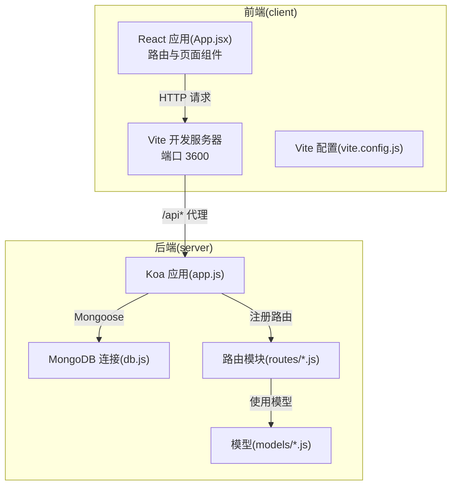
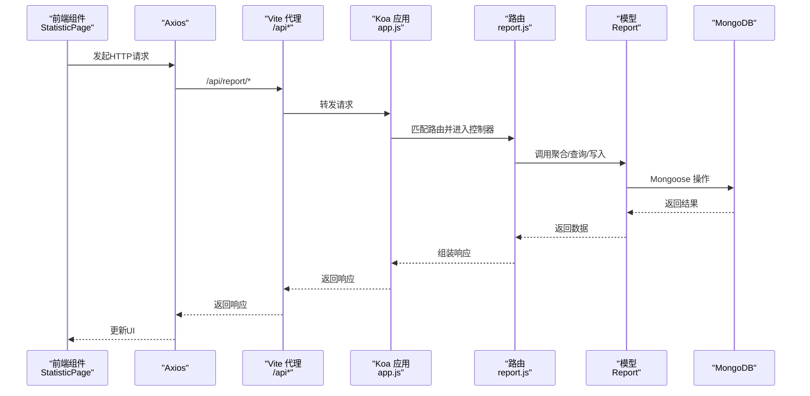
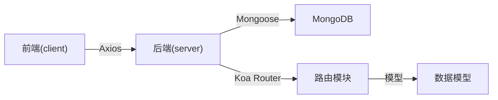

# 测试策略与质量保证

<cite>
**本文引用的文件**
- [client/package.json](file://client/package.json)
- [client/vite.config.js](file://client/vite.config.js)
- [client/src/App.jsx](file://client/src/App.jsx)
- [client/src/index.jsx](file://client/src/index.jsx)
- [client/src/context/AuthContext.jsx](file://client/src/context/AuthContext.jsx)
- [client/src/components/AuthButton.jsx](file://client/src/components/AuthButton.jsx)
- [client/src/pages/StatisticPage/index.jsx](file://client/src/pages/StatisticPage/index.jsx)
- [server/app.js](file://server/app.js)
- [server/db.js](file://server/db.js)
- [server/package.json](file://server/package.json)
- [server/routes/report.js](file://server/routes/report.js)
- [server/models/Admin.js](file://server/models/Admin.js)
- [README.md](file://README.md)
</cite>

## 目录
1. [引言](#引言)
2. [项目结构](#项目结构)
3. [核心组件](#核心组件)
4. [架构总览](#架构总览)
5. [详细组件分析](#详细组件分析)
6. [依赖分析](#依赖分析)
7. [性能考虑](#性能考虑)
8. [故障排查指南](#故障排查指南)
9. [结论](#结论)
10. [附录](#附录)

## 引言
本方案针对WoaX项目的测试策略与质量保证进行全面规划，覆盖单元测试、集成测试、端到端测试、性能测试、安全测试与兼容性测试，并明确测试数据管理、测试环境配置、测试用例设计原则、代码覆盖率要求、持续集成配置与自动化测试流水线建议。目标是在不改变现有技术栈的前提下，建立可落地的质量保障体系。

## 项目结构
WoaX采用前后端分离架构：前端基于Vite + React + Ant Design；后端基于Koa + MongoDB；通过REST接口通信。前端通过代理将/api前缀转发至后端服务端口，后端提供多条业务路由（统计、反馈、版本、项目、管理员）。

图示来源
- [client/vite.config.js](file://client/vite.config.js#L1-L50)
- [client/src/App.jsx](file://client/src/App.jsx#L1-L253)
- [server/app.js](file://server/app.js#L1-L61)
- [server/db.js](file://server/db.js#L1-L45)
- [server/routes/report.js](file://server/routes/report.js#L1-L271)
- [server/models/Admin.js](file://server/models/Admin.js#L1-L32)

章节来源
- [client/vite.config.js](file://client/vite.config.js#L1-L50)
- [client/src/App.jsx](file://client/src/App.jsx#L1-L253)
- [server/app.js](file://server/app.js#L1-L61)
- [server/db.js](file://server/db.js#L1-L45)
- [README.md](file://README.md#L1-L44)

## 核心组件
- 前端应用入口与路由：负责页面渲染、菜单导航、项目切换、登录弹窗与权限控制。
- 认证上下文：封装登录、令牌校验、登出与登录弹窗状态管理。
- 统计页面：负责调用后端接口获取报表数据、图表数据、用户明细与分页，支持删除与自主上报。
- 后端应用：统一中间件、静态资源服务、路由注册与数据库连接。
- 数据库连接：集中管理MongoDB连接、断开与错误监听。
- 统计路由：提供报表聚合查询、用户明细分页、上报与删除等接口，并集成管理员鉴权中间件。

章节来源
- [client/src/index.jsx](file://client/src/index.jsx#L1-L15)
- [client/src/App.jsx](file://client/src/App.jsx#L1-L253)
- [client/src/context/AuthContext.jsx](file://client/src/context/AuthContext.jsx#L1-L155)
- [client/src/pages/StatisticPage/index.jsx](file://client/src/pages/StatisticPage/index.jsx#L1-L262)
- [server/app.js](file://server/app.js#L1-L61)
- [server/db.js](file://server/db.js#L1-L45)
- [server/routes/report.js](file://server/routes/report.js#L1-L271)

## 架构总览
下图展示测试视角下的系统交互：前端组件通过Axios发起HTTP请求，经由Vite代理转发到Koa后端；后端路由根据请求类型调用对应控制器逻辑，访问Mongoose模型与MongoDB；管理员相关操作受鉴权中间件保护。

图示来源
- [client/src/pages/StatisticPage/index.jsx](file://client/src/pages/StatisticPage/index.jsx#L58-L171)
- [client/src/App.jsx](file://client/src/App.jsx#L18-L25)
- [client/vite.config.js](file://client/vite.config.js#L14-L22)
- [server/app.js](file://server/app.js#L48-L55)
- [server/routes/report.js](file://server/routes/report.js#L8-L88)

## 详细组件分析

### 单元测试策略
- 测试框架与配置
  - 前端：基于Vite与React，建议引入测试运行器（如 Vitest 或 Jest），并结合React Testing Library进行组件测试。利用Vite的JSX加载与别名解析能力，确保测试环境与构建一致。
  - 后端：使用Mocha/Chai或Jest对路由与控制器进行单元测试，重点覆盖鉴权中间件、聚合查询与错误分支。
- React组件测试
  - 组件清单：AuthContext、AuthButton、StatisticPage及其子组件（ChartPanel、DataTable、ReportFormModal、ReportModal）。
  - 测试要点：
    - 认证上下文：模拟登录/登出、令牌校验、登录弹窗显隐。
    - 权限按钮：未登录时禁用并触发登录弹窗；已登录时正常回调。
    - 统计页面：分页加载、图表数据聚合、用户明细分页、删除与上报流程。
  - Mock策略：对Axios进行拦截，返回固定响应；对LocalStorage进行沙箱化；对全局事件进行隔离。
- API接口测试
  - 路由清单：/api/report/getReportData、/api/report/user/:username、/api/report/addReport、/api/report/submit、/api/report/:id。
  - 测试要点：
    - 参数校验：缺失projectId、分页参数非法等边界条件。
    - 聚合逻辑：按用户名去重取最新记录、排序与分页一致性。
    - 写入与删除：自主上报必填字段校验、删除权限校验。
- Mock数据准备
  - 前端：使用Axios Mock Adapter或Vitest的mock实现，构造成功/失败响应与异常场景。
  - 后端：使用内存数据库（如MongoDB内存版）或测试专用数据库，预置管理员账户与测试项目数据。

章节来源
- [client/src/context/AuthContext.jsx](file://client/src/context/AuthContext.jsx#L1-L155)
- [client/src/components/AuthButton.jsx](file://client/src/components/AuthButton.jsx#L1-L43)
- [client/src/pages/StatisticPage/index.jsx](file://client/src/pages/StatisticPage/index.jsx#L1-L262)
- [server/routes/report.js](file://server/routes/report.js#L8-L268)

### 集成测试方法
- 端到端测试流程
  - 场景一：管理员登录 → 项目选择 → 查看统计 → 用户明细分页 → 删除记录 → 自主上报。
  - 场景二：无权限操作（非管理员）尝试删除/上报 → 触发登录弹窗。
  - 工具建议：Cypress或Playwright，支持真实浏览器与网络拦截。
- 数据库集成测试
  - 使用独立测试数据库或容器化MongoDB，测试聚合查询、分页与事务一致性。
  - 在测试前清理集合，测试后回滚或重建，避免污染。
- 第三方服务集成验证
  - 静态资源：确认/uploads目录静态服务可用。
  - 环境变量：确保MONGODB_URI与端口配置正确。

章节来源
- [client/src/App.jsx](file://client/src/App.jsx#L78-L118)
- [client/src/pages/StatisticPage/index.jsx](file://client/src/pages/StatisticPage/index.jsx#L112-L171)
- [server/app.js](file://server/app.js#L24-L45)
- [server/db.js](file://server/db.js#L10-L24)

### 质量保证流程
- 代码覆盖率要求
  - 前端：组件与业务逻辑覆盖率不低于80%，关键分支（鉴权、错误处理）100%。
  - 后端：路由与控制器覆盖率不低于80%，聚合与鉴权逻辑100%。
- 持续集成配置
  - 推荐流水线步骤：安装依赖 → Lint → 单测（带覆盖率）→ 集成测试 → 构建产物 → 结果报告。
  - 并行任务：前端与后端测试可并行执行，减少总耗时。
- 自动化测试流水线
  - 触发条件：PR/MR触发；主分支保护策略启用。
  - 报告输出：生成HTML/Cobertura/JUnit报告，集成到CI平台。

章节来源
- [client/package.json](file://client/package.json#L20-L29)
- [server/package.json](file://server/package.json#L6-L8)

### 测试数据管理与环境配置
- 测试数据管理
  - 前端：使用Axios拦截器模拟响应，或在测试中注入Mock数据；对用户输入进行参数化。
  - 后端：使用工厂模式生成测试文档，按场景拆分Fixture；对敏感字段（如密码）使用哈希占位。
- 测试环境配置
  - 前端：Vite开发服务器端口3600，代理到后端3001；可通过环境变量切换代理目标。
  - 后端：通过环境变量指定数据库连接；启动前确保uploads目录存在。

章节来源
- [client/vite.config.js](file://client/vite.config.js#L14-L22)
- [server/app.js](file://server/app.js#L24-L28)
- [server/db.js](file://server/db.js#L10-L16)

### 性能测试
- 接口性能
  - 对聚合接口（/api/report/getReportData）进行压力测试，评估大数据量下的分页与排序性能。
- 前端性能
  - 使用Lighthouse或Web Vitals监控首屏渲染、交互延迟与布局抖动。
- 数据库性能
  - 在测试数据库上创建索引（如projectId、username、timestamp），观察聚合执行计划。

章节来源
- [server/routes/report.js](file://server/routes/report.js#L26-L51)

### 安全测试
- 认证与授权
  - 验证删除与自主上报接口仅对已登录管理员开放；伪造令牌与越权访问应被拒绝。
- 输入校验
  - 对缺失参数、非法分页参数与超长字符串进行边界测试。
- 敏感信息
  - 确保日志不泄露令牌与密码哈希；对上传文件进行类型与大小限制。

章节来源
- [server/routes/report.js](file://server/routes/report.js#L205-L268)
- [server/models/Admin.js](file://server/models/Admin.js#L16-L30)

### 兼容性测试
- 浏览器兼容性
  - 使用Sauce Labs或BrowserStack在主流浏览器上验证UI与交互。
- 移动端适配
  - 检查Ant Design组件在小屏幕下的布局与点击区域。
- Node版本
  - 在CI中使用不同Node LTS版本运行测试，确保稳定性。

章节来源
- [client/package.json](file://client/package.json#L31-L41)

## 依赖分析
- 前端依赖
  - React、Ant Design、Axios、Recharts等；Vite提供开发与构建能力。
- 后端依赖
  - Koa、Koa-Router、Koa-BodyParser、CORS、Mongoose、Multer等。
- 耦合关系
  - 前端通过Axios与后端REST接口耦合；后端路由依赖模型与数据库；鉴权中间件贯穿关键路由。

图示来源
- [client/src/App.jsx](file://client/src/App.jsx#L84-L103)
- [server/app.js](file://server/app.js#L10-L15)
- [server/routes/report.js](file://server/routes/report.js#L1-L6)
- [server/db.js](file://server/db.js#L1-L24)

章节来源
- [client/package.json](file://client/package.json#L5-L18)
- [server/package.json](file://server/package.json#L10-L19)

## 性能考虑
- 前端
  - 图表渲染：对大数据量图表进行虚拟化或采样；分页加载与懒渲染。
  - 请求合并：对多次相似请求进行防抖或缓存。
- 后端
  - 聚合优化：为常用查询字段建立索引；避免N+1查询。
  - 连接池：合理配置Mongoose连接池大小与超时。
- 测试中的性能指标
  - 接口响应时间、吞吐量、数据库慢查询分析。

章节来源
- [client/src/pages/StatisticPage/index.jsx](file://client/src/pages/StatisticPage/index.jsx#L88-L109)
- [server/routes/report.js](file://server/routes/report.js#L26-L67)

## 故障排查指南
- 常见问题
  - 代理不通：确认Vite代理配置与后端端口；检查CORS设置。
  - 登录失败：核对管理员账户是否存在、密码哈希逻辑；检查令牌存储与请求头。
  - 数据为空：确认项目ID传递、数据库连接与集合初始化。
- 日志与监控
  - 前端：对Axios拦截器增加错误日志；对关键事件埋点。
  - 后端：数据库连接错误、聚合异常、路由错误均需记录堆栈。

章节来源
- [client/vite.config.js](file://client/vite.config.js#L14-L22)
- [client/src/context/AuthContext.jsx](file://client/src/context/AuthContext.jsx#L24-L48)
- [server/app.js](file://server/app.js#L31-L32)
- [server/db.js](file://server/db.js#L27-L33)

## 结论
通过分层测试策略（单元、集成、E2E）、完善的Mock与数据管理、严格的覆盖率与CI集成，以及性能、安全与兼容性专项测试，WoaX可在保持现有技术栈稳定的同时，显著提升交付质量与可维护性。建议优先落地单元测试与API测试，再逐步扩展到端到端与性能安全测试。

## 附录
- 测试工具推荐
  - 前端：Vitest + React Testing Library；Cypress/Playwright（E2E）。
  - 后端：Jest/Mocha + Supertest；MongoMemoryServer（测试数据库）。
- 报告生成
  - 前端：生成HTML与Cobertura覆盖率报告；集成到CI工件。
  - 后端：生成JUnit XML与覆盖率报告；统一归档。