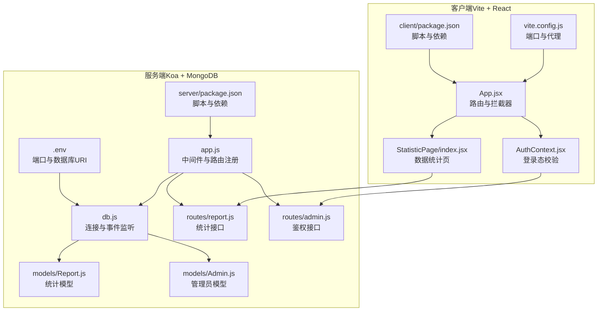
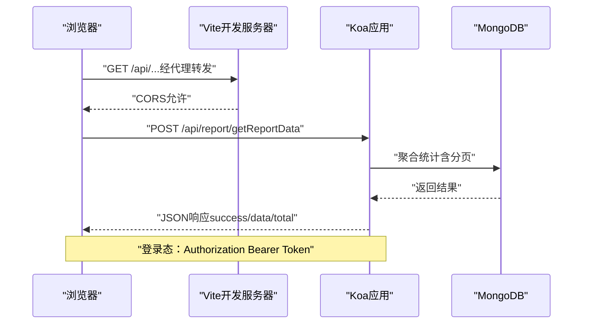
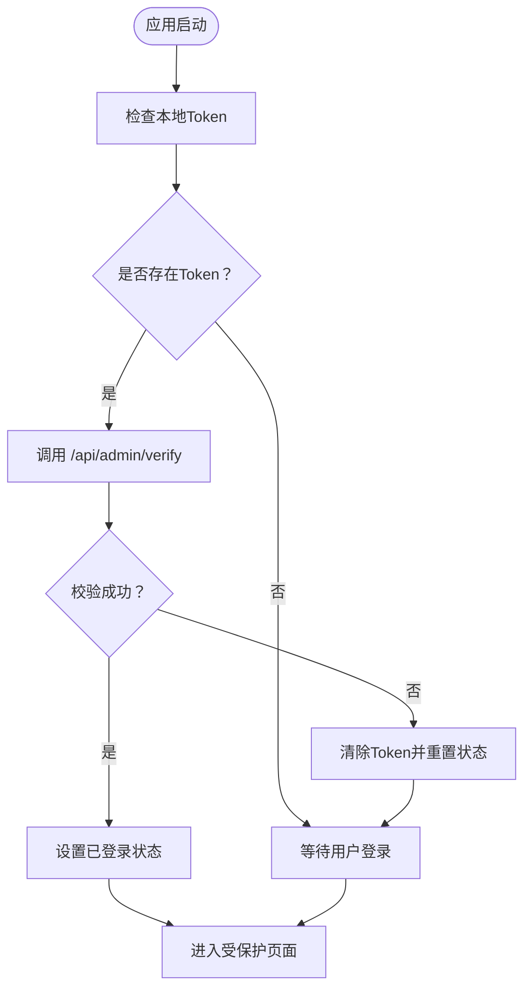
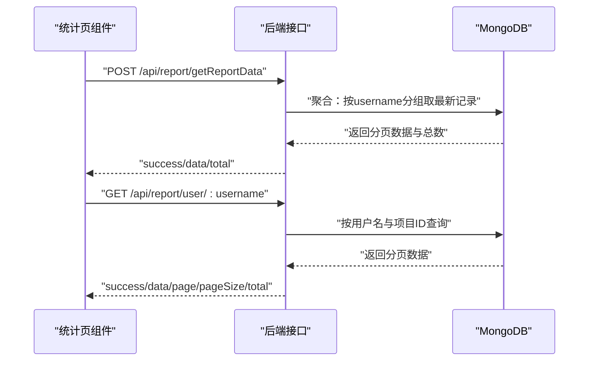
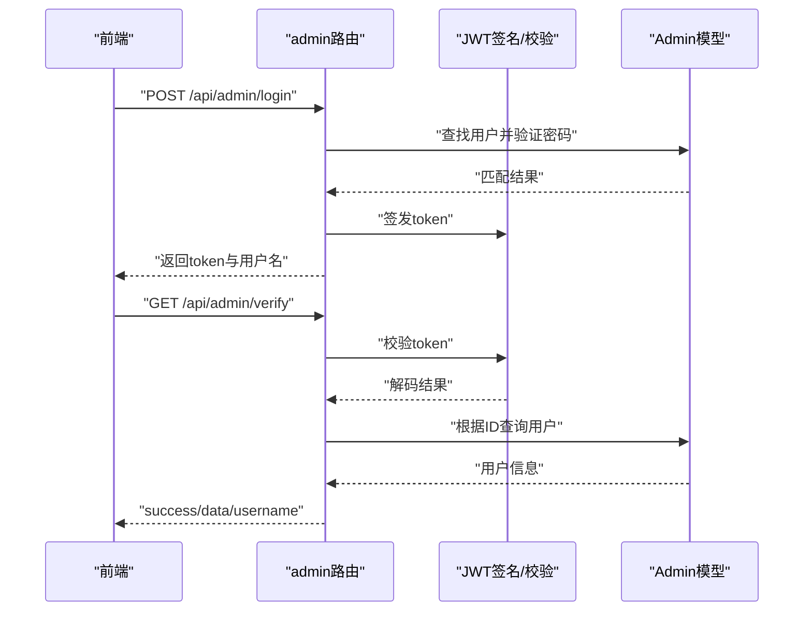
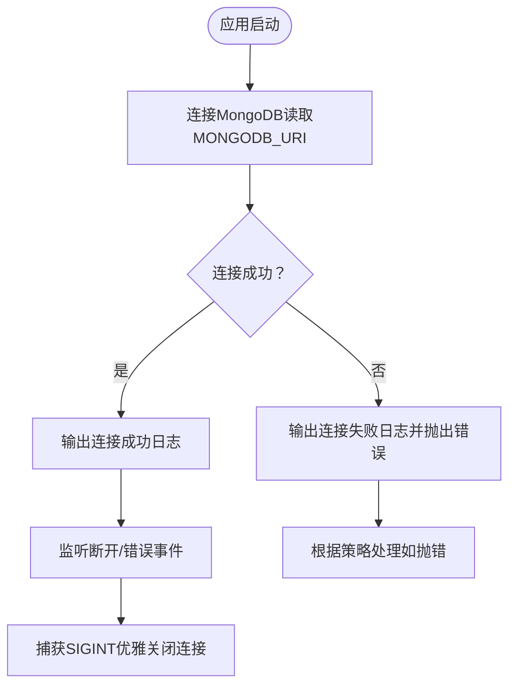
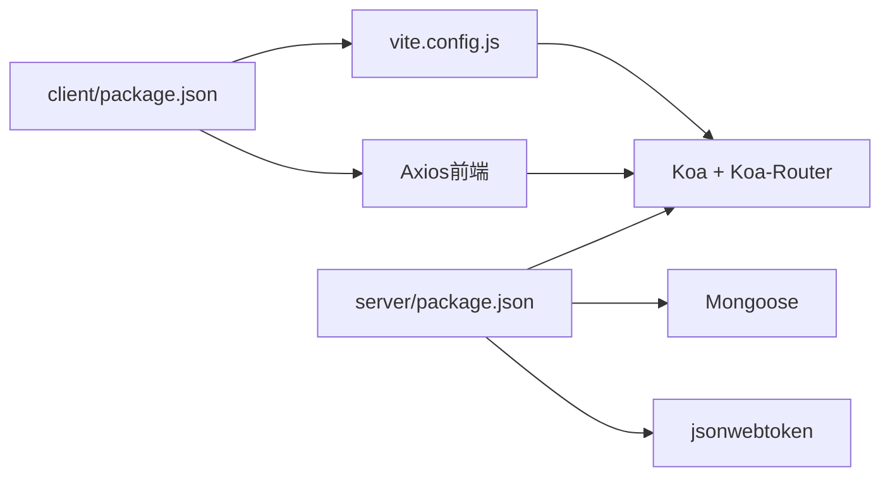

# 调试技巧与开发工具

<cite>
**本文引用的文件**
- [README.md](file://README.md)
- [vite.config.js](file://client/vite.config.js)
- [package.json](file://client/package.json)
- [app.js](file://server/app.js)
- [db.js](file://server/db.js)
- [.env](file://server/.env)
- [package.json](file://server/package.json)
- [report.js](file://server/routes/report.js)
- [admin.js](file://server/routes/admin.js)
- [Report.js](file://server/models/Report.js)
- [Admin.js](file://server/models/Admin.js)
- [AuthContext.jsx](file://client/src/context/AuthContext.jsx)
- [index.jsx](file://client/src/pages/StatisticPage/index.jsx)
- [tailwind.config.js](file://client/tailwind.config.js)
- [postcss.config.js](file://client/postcss.config.js)
</cite>

## 目录
1. [简介](#简介)
2. [项目结构](#项目结构)
3. [核心组件](#核心组件)
4. [架构总览](#架构总览)
5. [详细组件分析](#详细组件分析)
6. [依赖关系分析](#依赖关系分析)
7. [性能考量](#性能考量)
8. [故障排查指南](#故障排查指南)
9. [结论](#结论)
10. [附录](#附录)

## 简介
本指南面向WoaX项目的开发者与运维人员，系统性介绍浏览器与Node.js调试方法、MongoDB数据库调试策略、Vite开发服务器配置与热重载机制，并提供常见问题诊断、性能瓶颈识别与生产环境排查流程。文档结合仓库现有实现，给出可操作的调试步骤与最佳实践。

## 项目结构
WoaX采用前后端分离架构：前端基于React与Vite，后端基于Koa与MongoDB；通过代理实现跨域联调；数据库连接与路由集中在后端；前端通过Axios访问后端接口。

**图示来源**
- [vite.config.js](file://client/vite.config.js#L1-L50)
- [package.json](file://client/package.json#L1-L47)
- [app.js](file://server/app.js#L1-L61)
- [db.js](file://server/db.js#L1-L45)
- [.env](file://server/.env#L1-L9)
- [package.json](file://server/package.json#L1-L24)
- [report.js](file://server/routes/report.js#L1-L271)
- [admin.js](file://server/routes/admin.js#L1-L128)
- [Report.js](file://server/models/Report.js#L1-L22)
- [Admin.js](file://server/models/Admin.js#L1-L32)

**章节来源**
- [README.md](file://README.md#L1-L44)
- [vite.config.js](file://client/vite.config.js#L1-L50)
- [package.json](file://client/package.json#L1-L47)
- [app.js](file://server/app.js#L1-L61)
- [db.js](file://server/db.js#L1-L45)
- [.env](file://server/.env#L1-L9)
- [package.json](file://server/package.json#L1-L24)
- [report.js](file://server/routes/report.js#L1-L271)
- [admin.js](file://server/routes/admin.js#L1-L128)
- [Report.js](file://server/models/Report.js#L1-L22)
- [Admin.js](file://server/models/Admin.js#L1-L32)

## 核心组件
- 浏览器端调试要点
  - 网络面板：观察接口请求/响应、状态码、耗时、请求头与Cookies；利用“复制请求”功能复现问题。
  - 控制台：查看错误堆栈、断点调试、监视变量、执行表达式；结合拦截器输出请求/响应摘要。
  - 元素检查：定位UI异常、样式冲突、布局问题；结合Tailwind与PostCSS配置定位样式来源。
  - 性能监控：使用Performance标签记录渲染与交互耗时，结合React DevTools定位重渲染热点。
- Node.js应用调试要点
  - 断点与变量：使用Node inspect/nodemon配合VS Code/Chrome DevTools设置断点、监视变量、查看调用栈。
  - 异步调试：关注Promise链、async/await、Koa中间件顺序与异常传播；利用日志与错误处理器定位问题。
  - 端口与代理：确认前端Vite端口与后端Koa端口一致，代理规则正确转发/api前缀。
- MongoDB调试要点
  - 连接与事件：监听连接成功/断开/错误事件，核对URI与环境变量；在生产环境考虑连接失败时的降级策略。
  - 查询与聚合：审查聚合管道、分页逻辑与索引使用；对高频查询建立合适索引。
  - 数据一致性：校验字段类型、外键引用（如projectId）、默认值与必填约束。

**章节来源**
- [vite.config.js](file://client/vite.config.js#L14-L22)
- [package.json](file://client/package.json#L20-L24)
- [app.js](file://server/app.js#L31-L55)
- [db.js](file://server/db.js#L10-L24)
- [report.js](file://server/routes/report.js#L8-L88)

## 架构总览
下图展示从浏览器到后端再到数据库的典型请求链路，以及关键调试位置。

**图示来源**
- [vite.config.js](file://client/vite.config.js#L16-L21)
- [app.js](file://server/app.js#L48-L55)
- [report.js](file://server/routes/report.js#L8-L88)
- [AuthContext.jsx](file://client/src/context/AuthContext.jsx#L18-L48)

## 详细组件分析

### 组件A：前端请求拦截与登录态校验
- 请求拦截器：自动为带认证的接口附加Authorization头，便于统一调试登录态问题。
- 登录态校验：启动时读取本地Token并调用后端校验接口；失败时清理本地存储并重置状态。
- 项目切换：通过自定义事件触发数据刷新，避免重复请求。

**图示来源**
- [AuthContext.jsx](file://client/src/context/AuthContext.jsx#L16-L48)
- [AuthContext.jsx](file://client/src/context/AuthContext.jsx#L62-L92)

**章节来源**
- [AuthContext.jsx](file://client/src/context/AuthContext.jsx#L18-L48)
- [AuthContext.jsx](file://client/src/context/AuthContext.jsx#L62-L92)

### 组件B：数据统计页（聚合与分页）
- 聚合接口：按用户分组取最新上报记录，支持分页与项目过滤。
- 全量数据：用于图表渲染，一次性拉取较大数量数据。
- 用户详情：按用户名分页查询该用户的完整上报历史。

**图示来源**
- [index.jsx](file://client/src/pages/StatisticPage/index.jsx#L58-L85)
- [index.jsx](file://client/src/pages/StatisticPage/index.jsx#L128-L154)
- [report.js](file://server/routes/report.js#L8-L88)
- [report.js](file://server/routes/report.js#L91-L131)

**章节来源**
- [index.jsx](file://client/src/pages/StatisticPage/index.jsx#L58-L85)
- [index.jsx](file://client/src/pages/StatisticPage/index.jsx#L128-L154)
- [report.js](file://server/routes/report.js#L8-L88)
- [report.js](file://server/routes/report.js#L91-L131)

### 组件C：管理员鉴权与JWT
- 登录：校验用户名/密码，签发JWT并返回给前端。
- 校验：解析JWT并查询用户是否存在，返回用户名。
- 权限中间件：校验请求头中的Authorization，仅对受保护接口生效。

**图示来源**
- [admin.js](file://server/routes/admin.js#L27-L67)
- [admin.js](file://server/routes/admin.js#L69-L98)
- [admin.js](file://server/routes/admin.js#L100-L125)
- [Admin.js](file://server/models/Admin.js#L16-L30)

**章节来源**
- [admin.js](file://server/routes/admin.js#L27-L67)
- [admin.js](file://server/routes/admin.js#L69-L98)
- [admin.js](file://server/routes/admin.js#L100-L125)
- [Admin.js](file://server/models/Admin.js#L16-L30)

### 组件D：数据库连接与事件监听
- 连接：读取环境变量中的MONGODB_URI，启用兼容选项并输出连接状态。
- 事件：监听断开与错误事件，便于快速定位连接问题。
- 关闭：捕获SIGINT优雅关闭连接，确保资源释放。

**图示来源**
- [db.js](file://server/db.js#L10-L24)
- [db.js](file://server/db.js#L27-L40)
- [.env](file://server/.env#L5)

**章节来源**
- [db.js](file://server/db.js#L10-L24)
- [db.js](file://server/db.js#L27-L40)
- [.env](file://server/.env#L5)

## 依赖关系分析
- 前端依赖：React、Axios、Ant Design、Vite、TailwindCSS等；通过package.json定义脚本与代理。
- 后端依赖：Koa、Koa-Router、Koa-BodyParser、CORS、Mongoose、JWT等；通过package.json定义脚本与开发依赖。
- 开发服务器：Vite默认端口与代理规则，将/api前缀转发至后端Koa服务。

**图示来源**
- [package.json](file://client/package.json#L1-L47)
- [vite.config.js](file://client/vite.config.js#L1-L50)
- [package.json](file://server/package.json#L1-L24)

**章节来源**
- [package.json](file://client/package.json#L1-L47)
- [vite.config.js](file://client/vite.config.js#L1-L50)
- [package.json](file://server/package.json#L1-L24)

## 性能考量
- 前端性能
  - 使用Tailwind与PostCSS提升样式构建效率；合理拆分组件，减少不必要的重渲染。
  - 在统计页中，全量数据用于图表渲染时应限制最大条数，避免内存压力。
- 后端性能
  - 聚合查询需确保有合适的索引（如按projectId与username/time排序），避免全表扫描。
  - 分页逻辑应先计总数再取数据，避免超大数据集导致延迟。
- 开发服务器
  - Vite默认开启热重载与按需编译；如需更快启动，可调整optimizeDeps与esbuild配置。

[本节为通用指导，不直接分析具体文件]

## 故障排查指南
- 浏览器端
  - 网络面板：确认/api请求被代理转发、CORS是否允许、响应状态码与错误消息。
  - 控制台：查看Axios拦截器输出、登录态校验错误、组件渲染异常。
  - 元素检查：定位样式冲突、布局异常；结合Tailwind与PostCSS配置文件定位来源。
- Node.js后端
  - 日志：关注数据库连接日志、路由处理日志、错误处理器输出。
  - 端口与代理：确认Vite端口与代理目标、后端端口一致且未被占用。
  - 鉴权：检查Authorization头格式、JWT密钥与过期时间。
- MongoDB
  - 连接：核对MONGODB_URI、网络连通性、认证信息；监听断开/错误事件。
  - 查询：对高频聚合与分页查询建立索引；使用explain分析执行计划。
- 生产环境
  - 连接失败策略：在连接失败时决定是否退出进程或降级处理。
  - 优雅关闭：确保SIGINT信号能正确关闭数据库连接。

**章节来源**
- [vite.config.js](file://client/vite.config.js#L14-L22)
- [app.js](file://server/app.js#L31-L55)
- [db.js](file://server/db.js#L10-L24)
- [report.js](file://server/routes/report.js#L8-L88)
- [admin.js](file://server/routes/admin.js#L27-L67)

## 结论
通过结合浏览器与Node.js调试工具、完善的代理与日志体系、合理的数据库索引与查询设计，以及规范的开发与生产流程，可以高效定位并解决WoaX项目中的各类问题。建议在日常开发中持续完善日志与监控，定期审查聚合与分页逻辑，确保系统稳定与高性能。

[本节为总结，不直接分析具体文件]

## 附录

### A. 浏览器开发者工具使用清单
- 网络面板
  - 观察/api前缀请求的URL、方法、状态码、响应体与Headers。
  - 检查CORS与Cookie是否正确携带。
- 控制台
  - 设置条件断点于Axios拦截器与登录态校验处。
  - 使用Console执行表达式验证响应结构。
- 元素检查
  - 使用Elements面板检查类名与内联样式，结合Tailwind配置定位来源。
- 性能
  - 使用Performance录制交互过程，定位长任务与重渲染。

**章节来源**
- [AuthContext.jsx](file://client/src/context/AuthContext.jsx#L18-L48)
- [index.jsx](file://client/src/pages/StatisticPage/index.jsx#L58-L85)
- [tailwind.config.js](file://client/tailwind.config.js#L1-L10)
- [postcss.config.js](file://client/postcss.config.js#L1-L7)

### B. Node.js调试清单
- 断点与变量
  - 使用nodemon与VS Code/Chrome DevTools设置断点，监视ctx、req、res与数据库操作。
- 异步调试
  - 关注Koa中间件顺序、异常捕获与错误响应格式。
- 端口与代理
  - 确认Vite代理目标与后端端口一致，避免跨域与404。

**章节来源**
- [package.json](file://server/package.json#L6-L8)
- [vite.config.js](file://client/vite.config.js#L16-L21)
- [app.js](file://server/app.js#L31-L55)

### C. MongoDB调试清单
- 连接
  - 核对MONGODB_URI与环境变量，监听断开/错误事件。
- 查询与索引
  - 对按projectId与username/time的查询建立复合索引。
- 数据一致性
  - 校验Report与Admin模型字段类型与必填约束。

**章节来源**
- [.env](file://server/.env#L5)
- [db.js](file://server/db.js#L27-L40)
- [Report.js](file://server/models/Report.js#L3-L19)
- [Admin.js](file://server/models/Admin.js#L4-L14)

### D. Vite开发服务器配置与热重载
- 端口与代理
  - Vite默认端口与代理规则已在配置中定义，确保与后端端口一致。
- 热重载
  - Vite默认启用HMR；如需优化首屏或依赖预构建，可调整optimizeDeps与esbuild配置。

**章节来源**
- [vite.config.js](file://client/vite.config.js#L14-L22)
- [vite.config.js](file://client/vite.config.js#L34-L50)

### E. 开发工具推荐与配置模板
- 浏览器
  - Chrome DevTools：Network/Console/Elements/Performance。
- Node.js
  - VS Code + Chrome调试扩展；或使用node --inspect与Chrome DevTools。
- MongoDB
  - MongoDB Compass或mongosh进行可视化与explain分析。
- 前端样式
  - Tailwind与PostCSS配置文件用于样式构建与调试。

**章节来源**
- [tailwind.config.js](file://client/tailwind.config.js#L1-L10)
- [postcss.config.js](file://client/postcss.config.js#L1-L7)