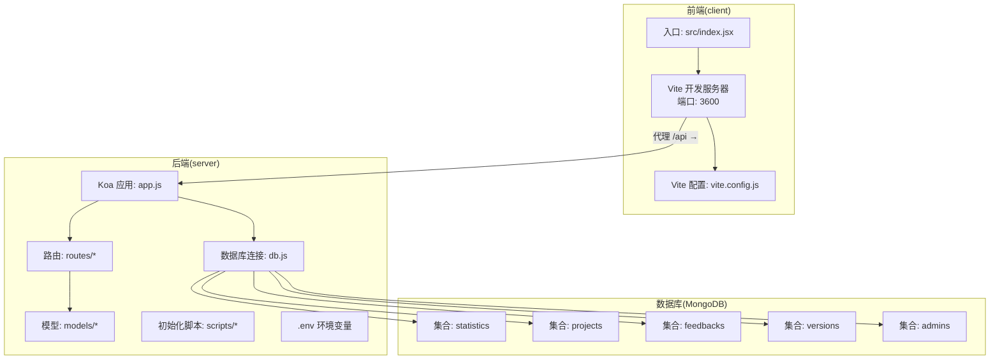
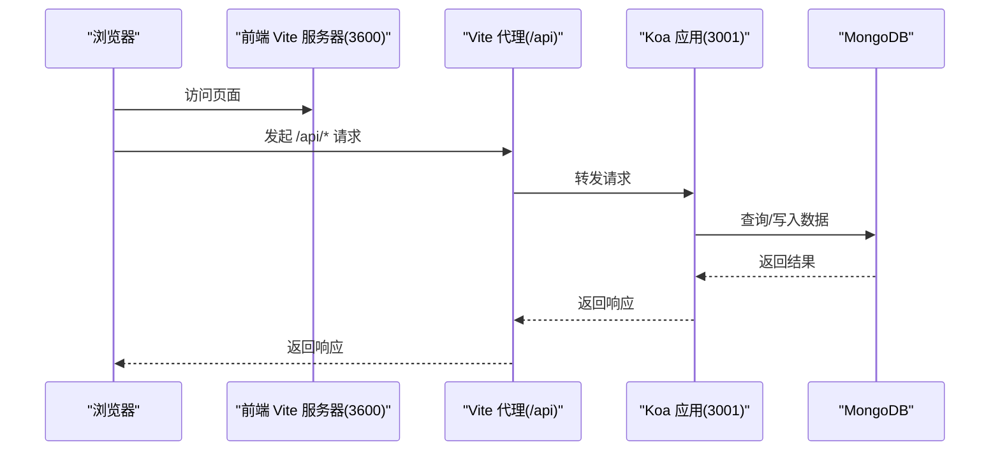
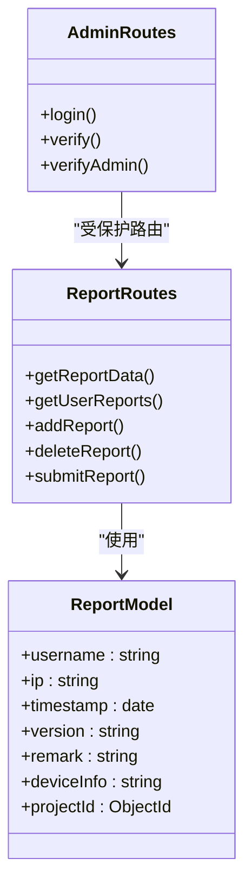
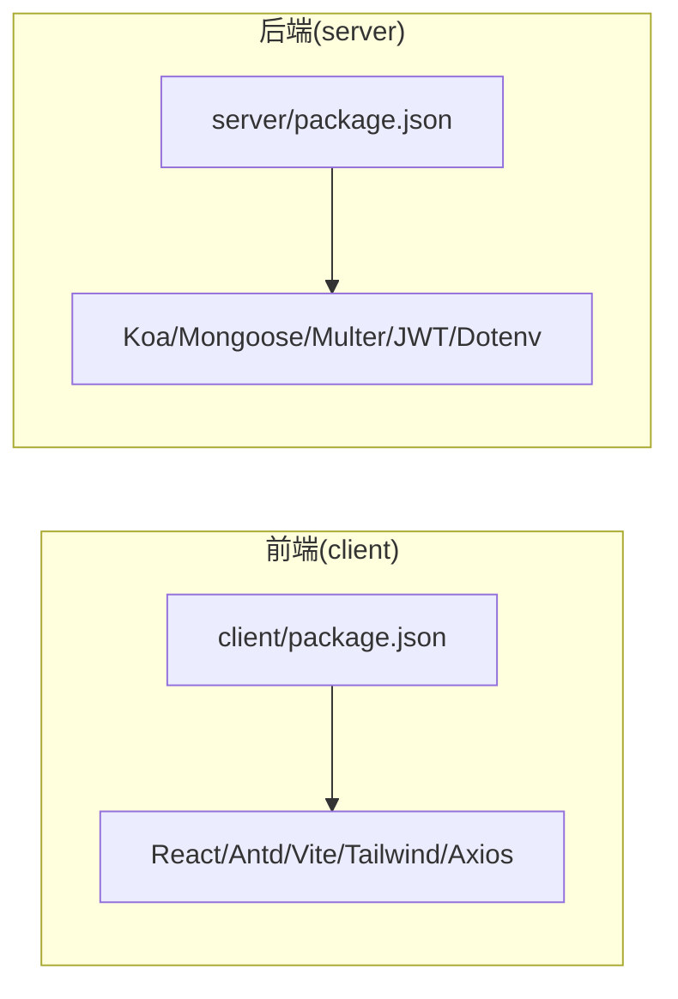

# 快速开始

<cite>
**本文引用的文件**
- [README.md](file://README.md)
- [client/package.json](file://client/package.json)
- [client/vite.config.js](file://client/vite.config.js)
- [client/tailwind.config.js](file://client/tailwind.config.js)
- [client/postcss.config.js](file://client/postcss.config.js)
- [client/src/index.jsx](file://client/src/index.jsx)
- [server/package.json](file://server/package.json)
- [server/.env](file://server/.env)
- [server/app.js](file://server/app.js)
- [server/db.js](file://server/db.js)
- [server/routes/report.js](file://server/routes/report.js)
- [server/models/Report.js](file://server/models/Report.js)
- [server/routes/admin.js](file://server/routes/admin.js)
- [server/scripts/initProject.js](file://server/scripts/initProject.js)
- [server/scripts/generateData.js](file://server/scripts/generateData.js)
- [db/woax.admins.json](file://db/woax.admins.json)
</cite>

## 目录
1. [简介](#简介)
2. [项目结构](#项目结构)
3. [核心组件](#核心组件)
4. [架构总览](#架构总览)
5. [详细组件分析](#详细组件分析)
6. [依赖关系分析](#依赖关系分析)
7. [性能注意事项](#性能注意事项)
8. [故障排除指南](#故障排除指南)
9. [结论](#结论)
10. [附录](#附录)

## 简介
本指南面向新手开发者，帮助你在最短时间内完成 WoaX 项目的本地开发环境搭建与运行。WoaX 是一个基于 React 前端、Node.js + Koa 后端与 MongoDB 数据库的全栈应用，提供“数据统计”“意见反馈”“版本更新通知”等功能。

你将学到：
- 环境要求与安装步骤（Node.js、MongoDB）
- 前端与后端分别的依赖安装、环境变量配置与数据库初始化
- 开发与生产运行方式
- 常见问题排查与故障排除

## 项目结构
项目采用前后端分离结构：
- client：React 前端应用，使用 Vite 构建与开发，代理转发至后端 API
- server：Node.js + Koa 后端，提供 REST 接口，使用 MongoDB 存储数据
- db：示例数据文件，用于理解数据结构
- 根目录 README 提供整体说明与默认管理员账号

图表来源
- [client/src/index.jsx](file://client/src/index.jsx#L1-L15)
- [client/vite.config.js](file://client/vite.config.js#L1-L50)
- [server/app.js](file://server/app.js#L1-L61)
- [server/db.js](file://server/db.js#L1-L45)
- [server/routes/report.js](file://server/routes/report.js#L1-L271)
- [server/models/Report.js](file://server/models/Report.js#L1-L22)

章节来源
- [README.md](file://README.md#L1-L44)

## 核心组件
- 前端（client）
  - 使用 Vite 进行开发与构建，开发服务器默认端口为 3600，并通过代理将 /api 请求转发到后端 3001 端口
  - 依赖管理与脚本由 package.json 管理
- 后端（server）
  - Koa 应用，启用 CORS 与 BodyParser 中间件；静态文件服务支持 /uploads/ 路径
  - 通过 dotenv 读取 .env 环境变量，连接 MongoDB 并监听端口
  - 路由模块化，提供 report、feedback、version、project、admin 等接口
- 数据库（MongoDB）
  - 使用 mongoose 连接，默认数据库名 woax，集合包括 statistics、projects、feedbacks、versions、admins
  - 提供初始化脚本与示例数据脚本

章节来源
- [client/package.json](file://client/package.json#L1-L47)
- [client/vite.config.js](file://client/vite.config.js#L1-L50)
- [server/package.json](file://server/package.json#L1-L24)
- [server/.env](file://server/.env#L1-L9)
- [server/app.js](file://server/app.js#L1-L61)
- [server/db.js](file://server/db.js#L1-L45)
- [server/routes/report.js](file://server/routes/report.js#L1-L271)
- [server/models/Report.js](file://server/models/Report.js#L1-L22)

## 架构总览
下图展示了从浏览器到后端再到数据库的整体调用链路，以及开发模式下的代理机制。

图表来源
- [client/vite.config.js](file://client/vite.config.js#L14-L22)
- [server/app.js](file://server/app.js#L34-L55)
- [server/db.js](file://server/db.js#L9-L24)

## 详细组件分析

### 环境要求与安装准备
- Node.js 版本
  - 前端与后端均使用 npm 生态，建议使用稳定版 Node.js LTS（具体版本请以各包管理器与依赖要求为准）
- MongoDB
  - 默认连接地址为 mongodb://localhost:27017/woax，需确保本地或远程 MongoDB 已安装并可访问
  - 若使用远程数据库，请在 .env 中修改 MONGODB_URI

章节来源
- [server/.env](file://server/.env#L4-L6)
- [server/db.js](file://server/db.js#L10-L16)

### 前端安装与配置
- 依赖安装
  - 在 client 目录执行依赖安装命令
- 开发与构建
  - 开发：使用 Vite 开发服务器，端口 3600
  - 构建：生成静态资源到 build 目录
- 代理配置
  - Vite 将 /api 请求代理到后端 3001 端口，便于前后端联调
- 样式与工具
  - TailwindCSS 与 PostCSS 已配置，支持 SCSS

章节来源
- [client/package.json](file://client/package.json#L20-L24)
- [client/vite.config.js](file://client/vite.config.js#L14-L22)
- [client/tailwind.config.js](file://client/tailwind.config.js#L1-L10)
- [client/postcss.config.js](file://client/postcss.config.js#L1-L7)

### 后端安装与配置
- 依赖安装
  - 在 server 目录执行依赖安装命令
- 环境变量
  - 端口：PORT（默认 3001）
  - 数据库：MONGODB_URI（默认本地数据库）
  - 上传目录与大小限制：UPLOAD_DIR、MAX_FILE_SIZE
- 启动方式
  - 开发：使用 nodemon 实时重启
  - 生产：使用 node 启动

章节来源
- [server/package.json](file://server/package.json#L6-L8)
- [server/.env](file://server/.env#L1-L9)

### 数据库初始化与示例数据
- 初始化默认项目与迁移数据
  - 使用初始化脚本检查并创建默认项目，同时迁移历史数据到新项目 ID
- 示例数据生成
  - 使用生成脚本向后端接口批量插入模拟数据
- 示例数据文件
  - db 目录包含 admins 等集合的示例 JSON，可用于理解数据结构

章节来源
- [server/scripts/initProject.js](file://server/scripts/initProject.js#L8-L58)
- [server/scripts/generateData.js](file://server/scripts/generateData.js#L100-L149)
- [db/woax.admins.json](file://db/woax.admins.json#L1-L15)

### 启动流程（开发与生产）
- 开发模式
  1) 启动 MongoDB（确保可连通）
  2) 启动后端：在 server 目录执行开发命令
  3) 启动前端：在 client 目录执行开发命令
  4) 浏览器访问前端地址，即可通过代理访问后端 API
- 生产模式
  1) 前端：构建静态资源
  2) 后端：使用 node 启动应用，确保 .env 配置正确
  3) 反向代理（如 Nginx）将 /api 前缀转发至后端 3001 端口

章节来源
- [README.md](file://README.md#L19-L35)
- [client/vite.config.js](file://client/vite.config.js#L14-L22)
- [server/app.js](file://server/app.js#L57-L61)

### API 路由与数据模型概览
- 报表接口（report）
  - 提供分页查询、按用户查询、新增上报、删除、管理员自主上报等能力
- 管理员接口（admin）
  - 登录、令牌校验、中间件鉴权
- 数据模型（Report）
  - 字段包含用户名、IP、时间戳、版本、备注、设备信息、项目 ID 等

图表来源
- [server/models/Report.js](file://server/models/Report.js#L3-L19)
- [server/routes/report.js](file://server/routes/report.js#L8-L271)
- [server/routes/admin.js](file://server/routes/admin.js#L26-L125)

章节来源
- [server/routes/report.js](file://server/routes/report.js#L1-L271)
- [server/models/Report.js](file://server/models/Report.js#L1-L22)
- [server/routes/admin.js](file://server/routes/admin.js#L1-L128)

## 依赖关系分析
- 前端依赖
  - React、Ant Design、Vite、TailwindCSS、Axios 等
  - 通过 package.json 的 scripts 管理 dev/build/preview
- 后端依赖
  - Koa、Koa Router、CORS、BodyParser、Mongoose、Multer、jsonwebtoken、dotenv 等
  - 通过 package.json 的 scripts 管理 start/dev

图表来源
- [client/package.json](file://client/package.json#L5-L19)
- [server/package.json](file://server/package.json#L10-L20)

章节来源
- [client/package.json](file://client/package.json#L1-L47)
- [server/package.json](file://server/package.json#L1-L24)

## 性能注意事项
- 前端
  - Vite 开发服务器默认端口 3600，代理仅在开发阶段生效
  - 构建产物输出到 build 目录，生产部署时应使用静态服务器托管
- 后端
  - 使用中间件统一处理跨域与请求体解析，注意生产环境的安全与性能优化
  - 数据库连接采用异步，异常时会抛出错误，建议在生产环境增加重试与监控

章节来源
- [client/vite.config.js](file://client/vite.config.js#L14-L22)
- [server/app.js](file://server/app.js#L31-L32)
- [server/db.js](file://server/db.js#L18-L23)

## 故障排除指南
- MongoDB 无法连接
  - 检查 MONGODB_URI 是否正确，确认 MongoDB 已启动且网络可达
  - 查看数据库连接日志与错误输出
- 端口冲突
  - 前端默认 3600，后端默认 3001；若被占用，请在相应配置中调整
- 代理不生效
  - 确认 Vite 配置中的 /api 代理指向后端地址
- 上传文件 404
  - 确认 uploads 目录存在，静态文件中间件已启用
- 管理员登录失败
  - 默认管理员账号与密码可在 README 中查看；登录成功后返回 JWT 令牌
- 初始化失败
  - 使用初始化脚本检查项目是否存在，若无项目则自动创建并迁移数据

章节来源
- [server/.env](file://server/.env#L1-L9)
- [server/app.js](file://server/app.js#L24-L45)
- [server/db.js](file://server/db.js#L18-L23)
- [server/scripts/initProject.js](file://server/scripts/initProject.js#L15-L47)
- [README.md](file://README.md#L44-L44)

## 结论
按照本指南，你可以快速完成 WoaX 的环境准备、依赖安装、数据库初始化与开发启动。建议在开发完成后，使用构建产物与生产启动方式部署到服务器，并结合反向代理实现 API 前缀转发与静态资源服务。

## 附录
- 默认管理员账号
  - 用户名：admin
  - 密码：admin123
- 常用命令参考
  - 前端开发：在 client 目录执行开发命令
  - 后端开发：在 server 目录执行开发命令
  - 初始化项目：在 server 目录执行初始化脚本
  - 生成示例数据：在 server 目录执行数据生成脚本

章节来源
- [README.md](file://README.md#L44-L44)
- [client/package.json](file://client/package.json#L20-L24)
- [server/package.json](file://server/package.json#L6-L8)
- [server/scripts/initProject.js](file://server/scripts/initProject.js#L61-L61)
- [server/scripts/generateData.js](file://server/scripts/generateData.js#L152-L152)