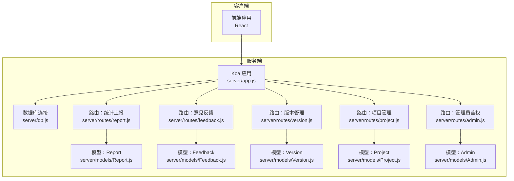
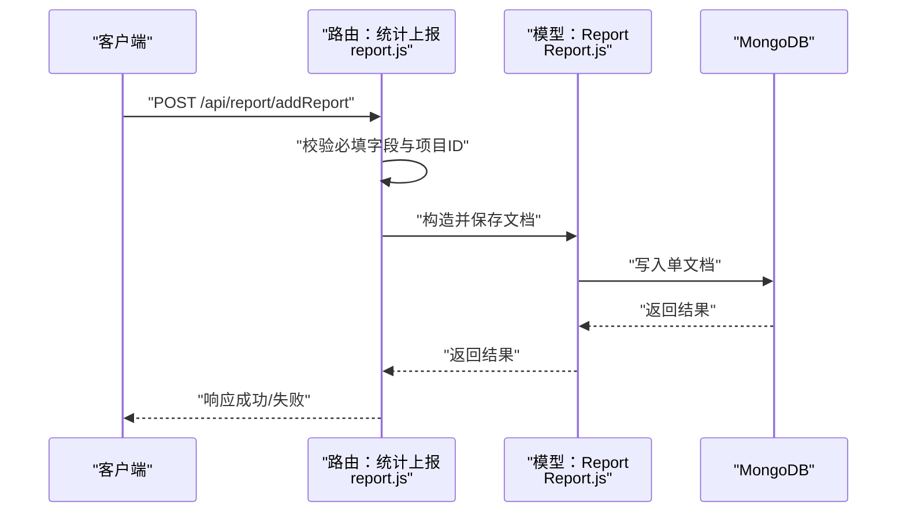
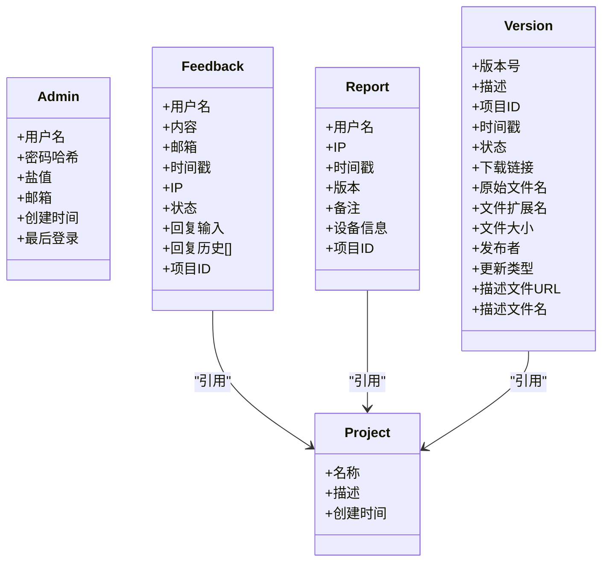
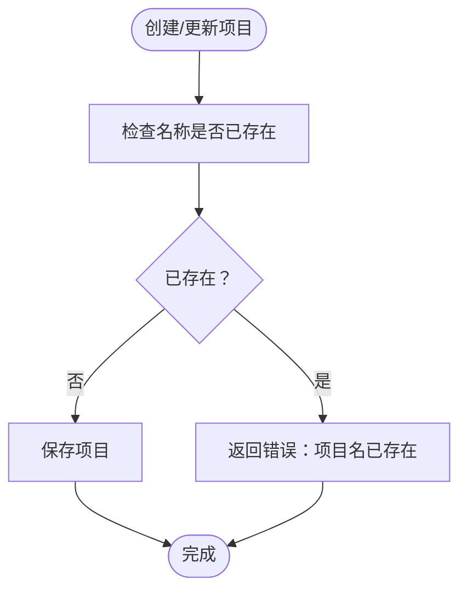
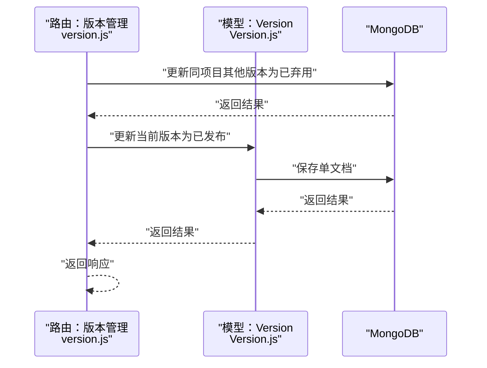
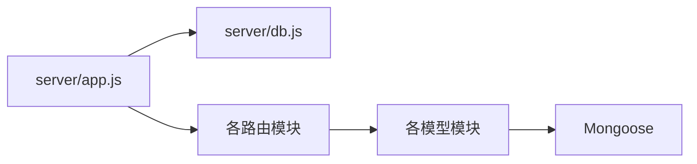

# 数据完整性与约束

<cite>
**本文引用的文件**
- [README.md](file://README.md)
- [server/db.js](file://server/db.js)
- [server/app.js](file://server/app.js)
- [server/models/Admin.js](file://server/models/Admin.js)
- [server/models/Feedback.js](file://server/models/Feedback.js)
- [server/models/Project.js](file://server/models/Project.js)
- [server/models/Report.js](file://server/models/Report.js)
- [server/models/Version.js](file://server/models/Version.js)
- [server/routes/admin.js](file://server/routes/admin.js)
- [server/routes/feedback.js](file://server/routes/feedback.js)
- [server/routes/project.js](file://server/routes/project.js)
- [server/routes/report.js](file://server/routes/report.js)
- [server/routes/version.js](file://server/routes/version.js)
- [server/scripts/initProject.js](file://server/scripts/initProject.js)
- [server/scripts/generateData.js](file://server/scripts/generateData.js)
- [db/woax.admins.json](file://db/woax.admins.json)
- [db/woax.projects.json](file://db/woax.projects.json)
</cite>

## 目录
1. [引言](#引言)
2. [项目结构](#项目结构)
3. [核心组件](#核心组件)
4. [架构总览](#架构总览)
5. [详细组件分析](#详细组件分析)
6. [依赖关系分析](#依赖关系分析)
7. [性能考量](#性能考量)
8. [故障排查指南](#故障排查指南)
9. [结论](#结论)
10. [附录](#附录)

## 引言
本文件围绕 WoaX 的数据完整性与约束展开，聚焦 MongoDB 中的字段验证规则、必填字段与数据类型约束、业务规则（唯一性、范围与格式）、一致性保障（单文档原子性与跨文档事务）、数据清理与修复策略，以及数据质量监控与异常检测方法。内容基于仓库中的模型定义、路由实现与初始化脚本，帮助开发者与运维人员建立一致、可靠且可维护的数据层。

## 项目结构
WoaX 采用前后端分离架构：前端为 React 应用，后端为 Koa 服务，数据库为 MongoDB。服务通过路由聚合不同业务域（统计上报、意见反馈、版本管理、项目管理、管理员鉴权），并在模型层定义数据结构与约束。

图表来源
- [server/app.js](file://server/app.js#L1-L61)
- [server/db.js](file://server/db.js#L1-L45)
- [server/routes/report.js](file://server/routes/report.js#L1-L271)
- [server/routes/feedback.js](file://server/routes/feedback.js#L1-L187)
- [server/routes/version.js](file://server/routes/version.js#L1-L432)
- [server/routes/project.js](file://server/routes/project.js#L1-L226)
- [server/routes/admin.js](file://server/routes/admin.js#L1-L128)
- [server/models/Report.js](file://server/models/Report.js#L1-L22)
- [server/models/Feedback.js](file://server/models/Feedback.js#L1-L52)
- [server/models/Version.js](file://server/models/Version.js#L1-L62)
- [server/models/Project.js](file://server/models/Project.js#L1-L21)
- [server/models/Admin.js](file://server/models/Admin.js#L1-L32)

章节来源
- [README.md](file://README.md#L1-L44)
- [server/app.js](file://server/app.js#L1-L61)
- [server/db.js](file://server/db.js#L1-L45)

## 核心组件
- 数据库连接与生命周期管理：负责连接字符串解析、错误监听、进程退出时的连接关闭。
- 模型层（Mongoose Schema）：定义字段类型、必填、唯一、枚举、默认值、嵌套数组与引用关系。
- 路由层：对输入参数进行基础校验（如必填项、项目 ID 存在性），调用模型持久化或查询。
- 初始化与迁移脚本：在无项目时创建默认项目并迁移历史数据，确保外键一致性。

章节来源
- [server/db.js](file://server/db.js#L1-L45)
- [server/models/Admin.js](file://server/models/Admin.js#L1-L32)
- [server/models/Feedback.js](file://server/models/Feedback.js#L1-L52)
- [server/models/Project.js](file://server/models/Project.js#L1-L21)
- [server/models/Report.js](file://server/models/Report.js#L1-L22)
- [server/models/Version.js](file://server/models/Version.js#L1-L62)
- [server/routes/admin.js](file://server/routes/admin.js#L1-L128)
- [server/routes/feedback.js](file://server/routes/feedback.js#L1-L187)
- [server/routes/project.js](file://server/routes/project.js#L1-L226)
- [server/routes/report.js](file://server/routes/report.js#L1-L271)
- [server/routes/version.js](file://server/routes/version.js#L1-L432)
- [server/scripts/initProject.js](file://server/scripts/initProject.js#L1-L61)

## 架构总览
下图展示请求从客户端到数据库的典型流程，以及关键的约束与校验点：

图表来源
- [server/routes/report.js](file://server/routes/report.js#L134-L176)
- [server/models/Report.js](file://server/models/Report.js#L1-L22)

章节来源
- [server/routes/report.js](file://server/routes/report.js#L1-L271)
- [server/models/Report.js](file://server/models/Report.js#L1-L22)

## 详细组件分析

### 数据模型与约束定义
- 字段验证规则
  - 必填字段：用户名、内容、项目引用等在模型或路由中均显式要求。
  - 数据类型约束：字符串、日期、数值、ObjectId、枚举等。
  - 文本处理：trim 去除首尾空白；默认值用于时间戳、状态等。
  - 嵌套结构：回复历史为数组元素，包含内容、时间、管理员标识。
- 唯一性约束
  - 管理员用户名唯一、项目名称唯一。
- 枚举约束
  - 反馈状态、版本状态、更新类型等使用枚举限定取值。
- 引用关系
  - Report/Feedback/Version 均通过 ObjectId 引用 Project，形成跨文档关联。

图表来源
- [server/models/Admin.js](file://server/models/Admin.js#L1-L32)
- [server/models/Feedback.js](file://server/models/Feedback.js#L1-L52)
- [server/models/Project.js](file://server/models/Project.js#L1-L21)
- [server/models/Report.js](file://server/models/Report.js#L1-L22)
- [server/models/Version.js](file://server/models/Version.js#L1-L62)

章节来源
- [server/models/Admin.js](file://server/models/Admin.js#L1-L32)
- [server/models/Feedback.js](file://server/models/Feedback.js#L1-L52)
- [server/models/Project.js](file://server/models/Project.js#L1-L21)
- [server/models/Report.js](file://server/models/Report.js#L1-L22)
- [server/models/Version.js](file://server/models/Version.js#L1-L62)

### 业务规则实现
- 唯一性约束
  - 项目名称唯一：创建与更新时均检查冲突并拒绝重复。
  - 管理员用户名唯一：Schema 层定义唯一索引，路由层也做存在性检查。
- 范围与格式验证
  - 枚举字段：反馈状态、版本状态、更新类型严格限定取值。
  - 文本格式：trim 规范化输入；必填字段在路由层进行显式校验。
- 外键一致性
  - 所有子表均强制要求 projectId；初始化脚本会批量迁移历史数据，确保引用有效。

图表来源
- [server/routes/project.js](file://server/routes/project.js#L58-L67)
- [server/routes/project.js](file://server/routes/project.js#L99-L114)

章节来源
- [server/routes/project.js](file://server/routes/project.js#L1-L226)
- [server/scripts/initProject.js](file://server/scripts/initProject.js#L1-L61)

### 一致性保障策略
- 单文档原子性
  - Mongoose 保存单文档为原子操作，模型层的默认值、类型转换与 Schema 验证在写入前执行。
- 跨文档事务
  - 当前代码未使用事务。在“设为最新版本”场景中，先更新其他版本状态再更新当前版本，属于多步写入，若需强一致可考虑引入事务。
- 引用完整性
  - 通过 ObjectId 引用与初始化迁移脚本保证历史数据的外键补全。

图表来源
- [server/routes/version.js](file://server/routes/version.js#L259-L296)
- [server/models/Version.js](file://server/models/Version.js#L1-L62)

章节来源
- [server/routes/version.js](file://server/routes/version.js#L1-L432)
- [server/models/Version.js](file://server/models/Version.js#L1-L62)

### 数据清理、重复处理与修复
- 数据清理
  - 版本删除时，若存在文件则删除本地文件后再删除数据库记录。
- 重复数据处理
  - 项目名称唯一约束与路由层检查可阻止重复创建；历史数据迁移脚本统一补全 projectId，减少重复或孤立数据。
- 数据修复
  - 初始化脚本在无项目时创建默认项目并迁移 Report/Feedback/Version 的历史数据，确保引用完整。
  - 可扩展：针对缺失 projectId 的数据，可在路由层或定时任务中补充默认项目引用。

章节来源
- [server/routes/version.js](file://server/routes/version.js#L395-L430)
- [server/scripts/initProject.js](file://server/scripts/initProject.js#L1-L61)

### 数据质量监控与异常检测
- 输入校验
  - 路由层对必填字段与项目 ID 进行显式校验，缺失时返回明确错误。
- 日志与错误处理
  - 统一的错误响应结构，便于前端与监控系统识别异常。
- 建议的监控指标
  - 请求成功率、平均响应时间、必填字段缺失率、唯一性冲突次数、文件上传失败率、版本状态变更频率。
- 异常检测建议
  - 对频繁出现的 400/404/500 错误进行告警；
  - 对唯一性冲突与外键缺失进行专项日志采集与报表。

章节来源
- [server/routes/report.js](file://server/routes/report.js#L134-L176)
- [server/routes/feedback.js](file://server/routes/feedback.js#L72-L111)
- [server/routes/version.js](file://server/routes/version.js#L147-L256)

## 依赖关系分析
- 组件耦合
  - 路由依赖模型；模型依赖 Mongoose；应用依赖数据库连接模块。
- 外部依赖
  - MongoDB（Mongoose）、JWT（鉴权）、multer（文件上传）。
- 潜在循环依赖
  - 未发现直接循环依赖；路由与模型之间为单向依赖。

图表来源
- [server/app.js](file://server/app.js#L1-L61)
- [server/db.js](file://server/db.js#L1-L45)
- [server/routes/report.js](file://server/routes/report.js#L1-L271)
- [server/routes/feedback.js](file://server/routes/feedback.js#L1-L187)
- [server/routes/version.js](file://server/routes/version.js#L1-L432)
- [server/routes/project.js](file://server/routes/project.js#L1-L226)
- [server/routes/admin.js](file://server/routes/admin.js#L1-L128)
- [server/models/Report.js](file://server/models/Report.js#L1-L22)
- [server/models/Feedback.js](file://server/models/Feedback.js#L1-L52)
- [server/models/Version.js](file://server/models/Version.js#L1-L62)
- [server/models/Project.js](file://server/models/Project.js#L1-L21)
- [server/models/Admin.js](file://server/models/Admin.js#L1-L32)

章节来源
- [server/app.js](file://server/app.js#L1-L61)
- [server/db.js](file://server/db.js#L1-L45)

## 性能考量
- 聚合与分页
  - 统计接口使用聚合管道进行去重与分组，注意在大数据量下为常用过滤字段建立索引。
- 写入路径
  - 单文档保存为原子操作，避免不必要的事务；对高频写入场景可考虑批量写入或异步处理。
- 文件存储
  - 上传文件落地磁盘，建议配合 CDN 与容量监控，定期清理临时文件。

## 故障排查指南
- 连接失败
  - 检查数据库连接字符串与网络连通性；关注连接断开与错误事件日志。
- 唯一性冲突
  - 项目名称或管理员用户名冲突时，确认是否已存在相同值；必要时清理重复数据。
- 外键缺失
  - 若出现找不到项目或关联数据异常，执行初始化迁移脚本补全 projectId。
- 文件上传失败
  - 检查上传目录权限、磁盘空间与文件名编码修复逻辑；失败时及时清理已上传文件。

章节来源
- [server/db.js](file://server/db.js#L1-L45)
- [server/routes/project.js](file://server/routes/project.js#L190-L224)
- [server/routes/version.js](file://server/routes/version.js#L147-L256)

## 结论
WoaX 在模型层与路由层共同实现了较为完善的约束与校验：必填字段、数据类型、唯一性、枚举与引用关系均有体现。通过初始化迁移脚本与路由层的显式校验，系统在大多数情况下能保证数据完整性。对于跨文档一致性与复杂业务流程，可进一步引入事务与更细粒度的监控与告警体系，以提升系统的可靠性与可观测性。

## 附录
- 示例数据导入脚本可用于快速生成测试数据，便于验证约束与流程。
- 初始项目与迁移脚本确保了历史数据的外键补全，建议在生产环境定期运行以修复异常。

章节来源
- [server/scripts/generateData.js](file://server/scripts/generateData.js#L1-L155)
- [server/scripts/initProject.js](file://server/scripts/initProject.js#L1-L61)
- [db/woax.admins.json](file://db/woax.admins.json#L1-L15)
- [db/woax.projects.json](file://db/woax.projects.json#L1-L28)