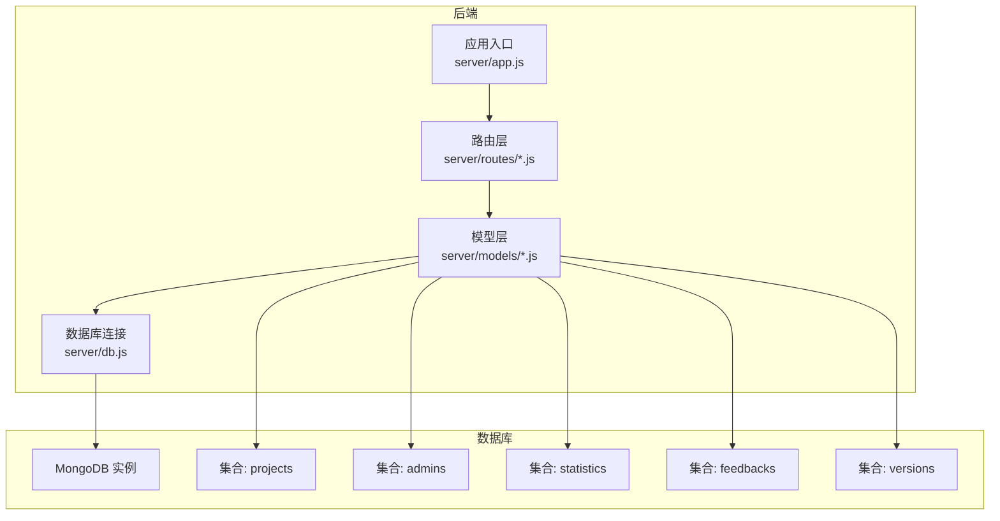
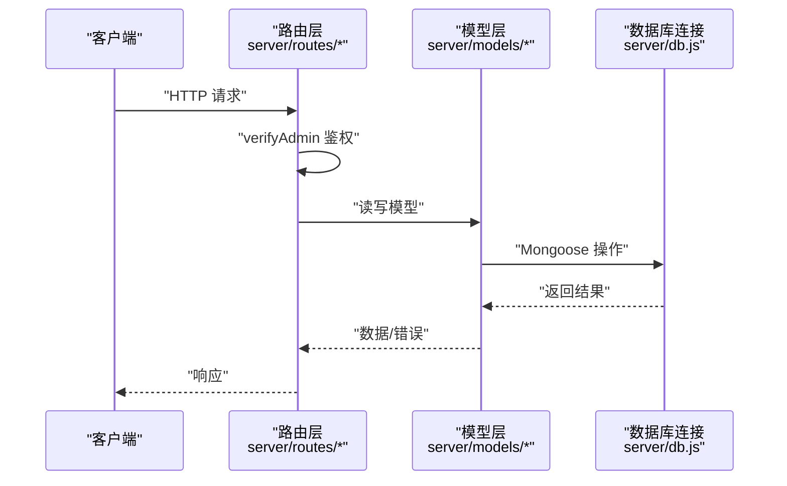
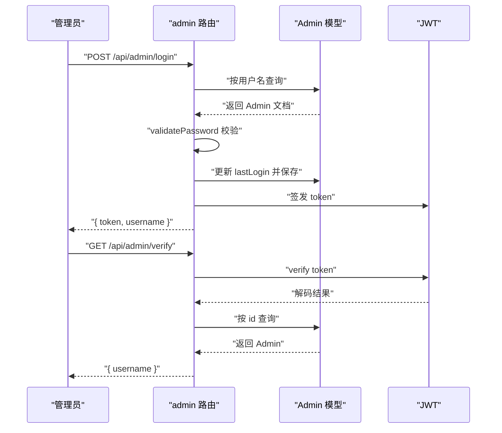
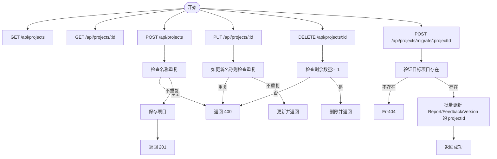
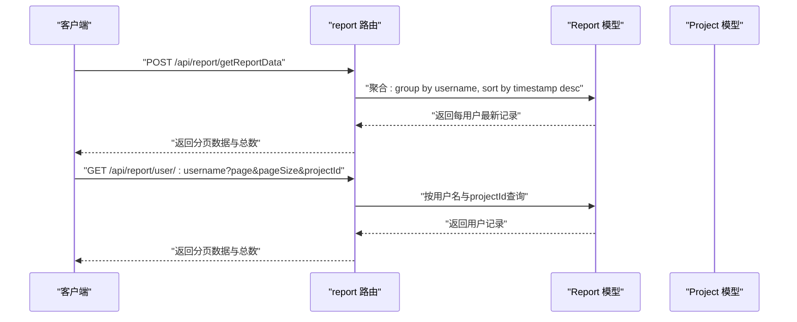
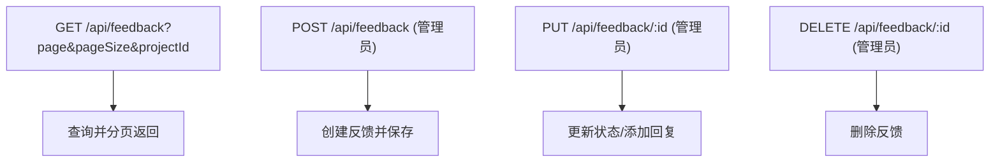
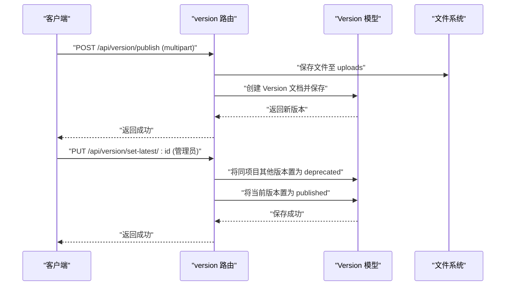
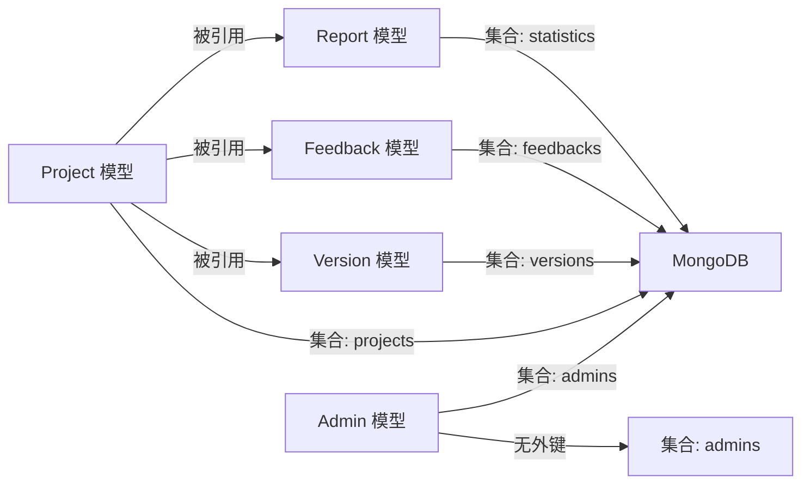
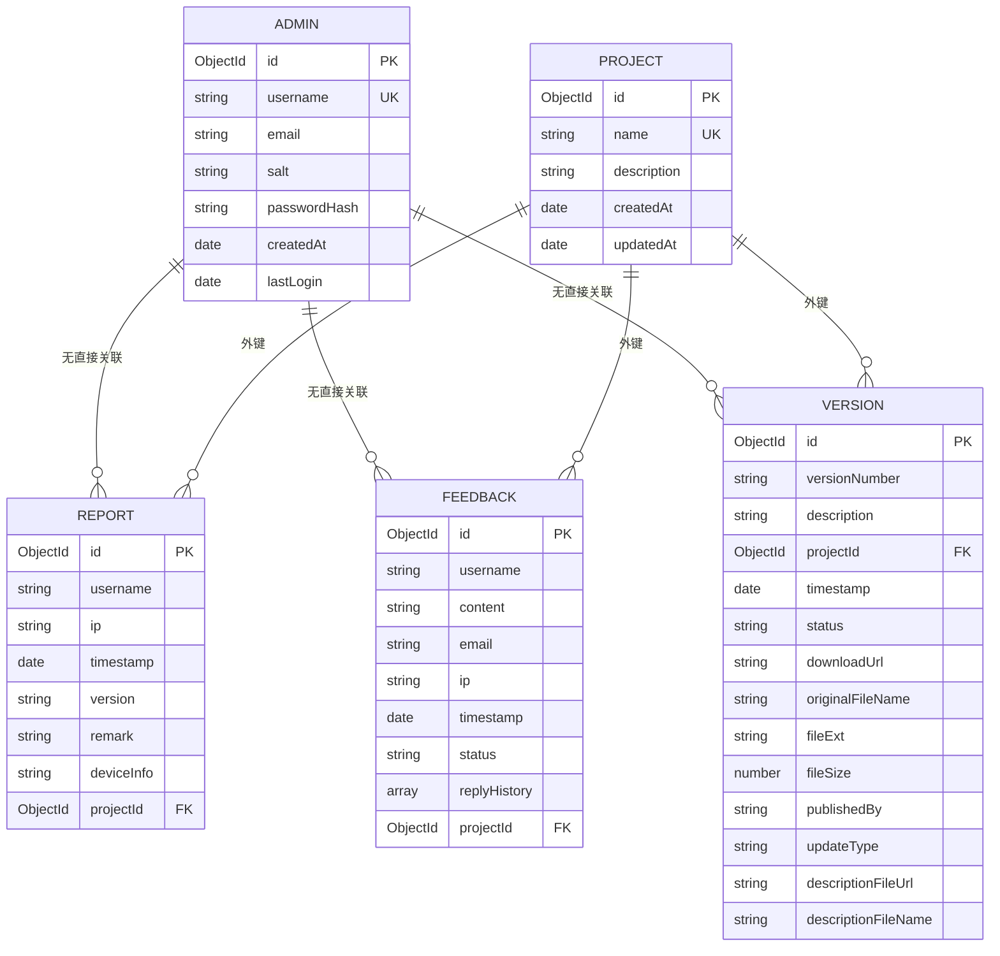

# 数据库设计

<cite>
**本文引用的文件**
- [server/models/Admin.js](file://server/models/Admin.js)
- [server/models/Project.js](file://server/models/Project.js)
- [server/models/Report.js](file://server/models/Report.js)
- [server/models/Feedback.js](file://server/models/Feedback.js)
- [server/models/Version.js](file://server/models/Version.js)
- [server/db.js](file://server/db.js)
- [server/app.js](file://server/app.js)
- [server/routes/admin.js](file://server/routes/admin.js)
- [server/routes/project.js](file://server/routes/project.js)
- [server/routes/report.js](file://server/routes/report.js)
- [server/routes/feedback.js](file://server/routes/feedback.js)
- [server/routes/version.js](file://server/routes/version.js)
- [server/.env](file://server/.env)
- [README.md](file://README.md)
- [db/woax.projects.json](file://db/woax.projects.json)
- [db/woax.admins.json](file://db/woax.admins.json)
- [db/woax.feedbacks.json](file://db/woax.feedbacks.json)
- [db/woax.versions.json](file://db/woax.versions.json)
</cite>

## 目录
1. [简介](#简介)
2. [项目结构](#项目结构)
3. [核心组件](#核心组件)
4. [架构总览](#架构总览)
5. [详细组件分析](#详细组件分析)
6. [依赖分析](#依赖分析)
7. [性能考虑](#性能考虑)
8. [故障排查指南](#故障排查指南)
9. [结论](#结论)
10. [附录](#附录)

## 简介
本文件面向WoaX数据库设计，系统性阐述基于MongoDB的数据库整体设计思路与架构原则，深入解析Report、Project、Admin、Feedback、Version等核心模型的定义与关系映射，说明集合间的关联、索引与查询优化策略，解释数据完整性约束、事务与并发控制现状，给出数据迁移、备份恢复与性能监控建议，并总结最佳实践与扩展指南。

## 项目结构
后端采用Koa框架，通过Mongoose连接MongoDB；模型定义位于server/models，路由位于server/routes，数据库连接与中间件在server/app.js与server/db.js中初始化。环境变量在server/.env中配置，示例数据位于db目录下的JSON文件中。

图表来源
- [server/app.js](file://server/app.js#L1-L61)
- [server/db.js](file://server/db.js#L1-L45)
- [server/models/Project.js](file://server/models/Project.js#L1-L21)
- [server/models/Admin.js](file://server/models/Admin.js#L1-L32)
- [server/models/Report.js](file://server/models/Report.js#L1-L22)
- [server/models/Feedback.js](file://server/models/Feedback.js#L1-L52)
- [server/models/Version.js](file://server/models/Version.js#L1-L62)

章节来源
- [server/app.js](file://server/app.js#L1-L61)
- [server/db.js](file://server/db.js#L1-L45)
- [server/.env](file://server/.env#L1-L9)

## 核心组件
- Admin：管理员账户模型，包含用户名、密码哈希、盐值、邮箱、创建时间与最近登录时间，提供密码设置与校验方法。
- Project：项目模型，包含名称、描述、创建时间与自动时间戳。
- Report：统计数据模型，包含用户名、IP、时间戳、版本号、备注、设备信息、项目外键，集合名为statistics。
- Feedback：反馈模型，包含用户名、内容、邮箱、IP、时间戳、状态、回复历史、项目外键，支持状态枚举与时间戳。
- Version：版本模型，包含版本号、描述、项目外键、时间戳、状态、下载地址、原始文件名、扩展名、大小、发布者、更新类型、描述文件URL与名称，支持状态枚举与时间戳。

章节来源
- [server/models/Admin.js](file://server/models/Admin.js#L1-L32)
- [server/models/Project.js](file://server/models/Project.js#L1-L21)
- [server/models/Report.js](file://server/models/Report.js#L1-L22)
- [server/models/Feedback.js](file://server/models/Feedback.js#L1-L52)
- [server/models/Version.js](file://server/models/Version.js#L1-L62)

## 架构总览
- 数据库连接：通过server/db.js统一管理连接、断开与错误监听，并在server/app.js启动时调用。
- 路由与权限：各业务路由均依赖server/routes/admin.js提供的管理员JWT鉴权中间件verifyAdmin，确保敏感操作受控。
- 集合命名与外键：Report与Feedback的projectId字段指向Project集合；Version同样引用Project；Report集合命名为statistics。
- 文件上传：Version路由集成multer进行文件上传，上传目录为server/uploads，支持中文文件名修复与可选重命名。

图表来源
- [server/routes/admin.js](file://server/routes/admin.js#L100-L125)
- [server/routes/report.js](file://server/routes/report.js#L205-L229)
- [server/routes/feedback.js](file://server/routes/feedback.js#L114-L158)
- [server/routes/version.js](file://server/routes/version.js#L259-L296)
- [server/db.js](file://server/db.js#L10-L24)

章节来源
- [server/routes/admin.js](file://server/routes/admin.js#L1-L128)
- [server/routes/report.js](file://server/routes/report.js#L1-L271)
- [server/routes/feedback.js](file://server/routes/feedback.js#L1-L187)
- [server/routes/version.js](file://server/routes/version.js#L1-L432)
- [server/db.js](file://server/db.js#L1-L45)

## 详细组件分析

### Admin 模型与认证流程
- 字段与约束：用户名唯一且必填；密码存储为哈希+盐；提供lastLogin与createdAt。
- 认证流程：登录接口根据用户名查找Admin，校验密码哈希，更新最近登录时间，签发JWT；校验接口从请求头提取令牌并验证。
- 默认管理员：应用启动时若不存在默认管理员则创建。

图表来源
- [server/routes/admin.js](file://server/routes/admin.js#L27-L98)
- [server/models/Admin.js](file://server/models/Admin.js#L17-L30)

章节来源
- [server/models/Admin.js](file://server/models/Admin.js#L1-L32)
- [server/routes/admin.js](file://server/routes/admin.js#L1-L128)

### Project 模型与项目管理
- 字段与约束：名称唯一且必填；描述可空；自动维护createdAt/updatedAt。
- 业务能力：列出项目、按ID查询、创建（去重）、更新（名称去重）、删除（强制保留至少一个）。
- 数据迁移：提供将无项目ID的历史数据批量迁移到指定项目的能力。

图表来源
- [server/routes/project.js](file://server/routes/project.js#L9-L226)

章节来源
- [server/models/Project.js](file://server/models/Project.js#L1-L21)
- [server/routes/project.js](file://server/routes/project.js#L1-L226)

### Report 模型与统计报表
- 字段与约束：用户名必填；IP可空；时间戳默认当前时间；版本号、备注、设备信息可空；projectId必填并引用Project。
- 集合命名：statistics。
- 统计接口：按项目聚合每个用户的最新上报记录，支持分页与总数统计；按用户名查询用户的所有上报记录；新增上报记录；删除与自主上报需管理员权限。

图表来源
- [server/routes/report.js](file://server/routes/report.js#L8-L131)
- [server/models/Report.js](file://server/models/Report.js#L1-L22)

章节来源
- [server/models/Report.js](file://server/models/Report.js#L1-L22)
- [server/routes/report.js](file://server/routes/report.js#L1-L271)

### Feedback 模型与反馈管理
- 字段与约束：用户名、内容必填；邮箱可空；状态枚举：pending/reviewed/resolved；默认pending；回复历史为数组，含内容、时间、管理员。
- 业务能力：分页列出反馈、按ID查询、提交反馈（管理员）、更新状态与回复、删除反馈（管理员）。

图表来源
- [server/routes/feedback.js](file://server/routes/feedback.js#L7-L187)
- [server/models/Feedback.js](file://server/models/Feedback.js#L1-L52)

章节来源
- [server/models/Feedback.js](file://server/models/Feedback.js#L1-L52)
- [server/routes/feedback.js](file://server/routes/feedback.js#L1-L187)

### Version 模型与版本管理
- 字段与约束：版本号必填；描述可空；projectId必填并引用Project；状态枚举：draft/published/deprecated；下载地址、原始文件名、扩展名、大小可空；更新类型枚举：force/active/passive；发布时间戳与发布者可空。
- 业务能力：分页列出版本、按ID查询、发布新版本（文件上传）、设为最新版本（原子更新同项目其他版本状态）、更新状态/类型/版本号/描述、删除版本（同时清理上传文件）。
- 文件上传：支持安装包与描述文件双文件上传，自动修复中文文件名，支持可选重命名。

图表来源
- [server/routes/version.js](file://server/routes/version.js#L147-L296)
- [server/models/Version.js](file://server/models/Version.js#L1-L62)

章节来源
- [server/models/Version.js](file://server/models/Version.js#L1-L62)
- [server/routes/version.js](file://server/routes/version.js#L1-L432)

## 依赖分析
- 模型依赖：Report/Feedback/Version均引用Project；Report集合名为statistics。
- 路由依赖：各业务路由依赖verifyAdmin中间件实现管理员鉴权。
- 数据库连接：统一通过db.js管理连接生命周期与事件监听。
- 环境变量：数据库URI、端口、上传目录与最大文件大小在.env中配置。

图表来源
- [server/models/Report.js](file://server/models/Report.js#L11-L15)
- [server/models/Feedback.js](file://server/models/Feedback.js#L42-L46)
- [server/models/Version.js](file://server/models/Version.js#L13-L17)
- [server/models/Project.js](file://server/models/Project.js#L1-L21)
- [server/models/Admin.js](file://server/models/Admin.js#L1-L32)

章节来源
- [server/models/Report.js](file://server/models/Report.js#L1-L22)
- [server/models/Feedback.js](file://server/models/Feedback.js#L1-L52)
- [server/models/Version.js](file://server/models/Version.js#L1-L62)
- [server/models/Project.js](file://server/models/Project.js#L1-L21)
- [server/models/Admin.js](file://server/models/Admin.js#L1-L32)

## 性能考虑
- 查询优化
  - 在projectId上建立索引，以加速Report/Feedback/Version的按项目查询与聚合。
  - 对Report按username进行分组聚合时，建议在username与projectId上建立复合索引以减少排序与分组成本。
  - 对Version按status与projectId建立复合索引，优化“获取最新版本”与状态变更查询。
- 分页与聚合
  - 使用聚合管道时先做$match再$sort与$group，避免对全表进行昂贵操作。
  - 聚合分页时先执行$count统计总数，再执行分页查询。
- 缓存与CDN
  - 版本文件建议使用CDN分发，降低服务器带宽压力。
- 连接与并发
  - 使用连接池与合理的超时配置，避免高并发下的连接阻塞。
- 存储与归档
  - 对历史统计数据定期归档或清理，避免statistics集合无限增长。
- 监控指标
  - 监控慢查询、聚合耗时、连接数、磁盘IO与CPU使用率。

## 故障排查指南
- 登录与鉴权
  - 若登录失败或令牌无效，检查JWT密钥、Admin文档是否存在、密码哈希是否正确。
- 数据迁移
  - 执行项目迁移前确认目标项目存在；迁移完成后检查Report/Feedback/Version的projectId是否更新。
- 文件上传
  - 若上传后无法访问文件，检查uploads目录权限、文件名编码修复逻辑与URL拼接。
- 连接问题
  - 数据库连接失败时，检查MONGODB_URI、网络连通性与MongoDB实例状态；关注db.js中的连接日志与错误事件。
- 权限问题
  - 删除/更新等敏感操作返回401或403时，确认请求头携带有效令牌且verifyAdmin中间件正常工作。

章节来源
- [server/routes/admin.js](file://server/routes/admin.js#L27-L98)
- [server/routes/project.js](file://server/routes/project.js#L189-L224)
- [server/routes/version.js](file://server/routes/version.js#L147-L256)
- [server/db.js](file://server/db.js#L10-L40)

## 结论
WoaX数据库设计以清晰的模型边界与外键引用为核心，结合JWT鉴权与聚合查询实现高效的统计与版本管理。通过在关键字段上建立索引、优化聚合与分页、规范文件上传与清理流程，可进一步提升系统性能与稳定性。建议在生产环境中完善备份恢复策略与监控告警体系，并持续评估扩展需求以迭代模型与索引设计。

## 附录

### 数据模型与关系图

图表来源
- [server/models/Project.js](file://server/models/Project.js#L1-L21)
- [server/models/Admin.js](file://server/models/Admin.js#L1-L32)
- [server/models/Report.js](file://server/models/Report.js#L1-L22)
- [server/models/Feedback.js](file://server/models/Feedback.js#L1-L52)
- [server/models/Version.js](file://server/models/Version.js#L1-L62)

### 示例数据参考
- 项目示例：db/woax.projects.json
- 管理员示例：db/woax.admins.json
- 反馈示例：db/woax.feedbacks.json
- 版本示例：db/woax.versions.json

章节来源
- [db/woax.projects.json](file://db/woax.projects.json#L1-L28)
- [db/woax.admins.json](file://db/woax.admins.json#L1-L15)
- [db/woax.feedbacks.json](file://db/woax.feedbacks.json#L1-L185)
- [db/woax.versions.json](file://db/woax.versions.json#L1-L52)