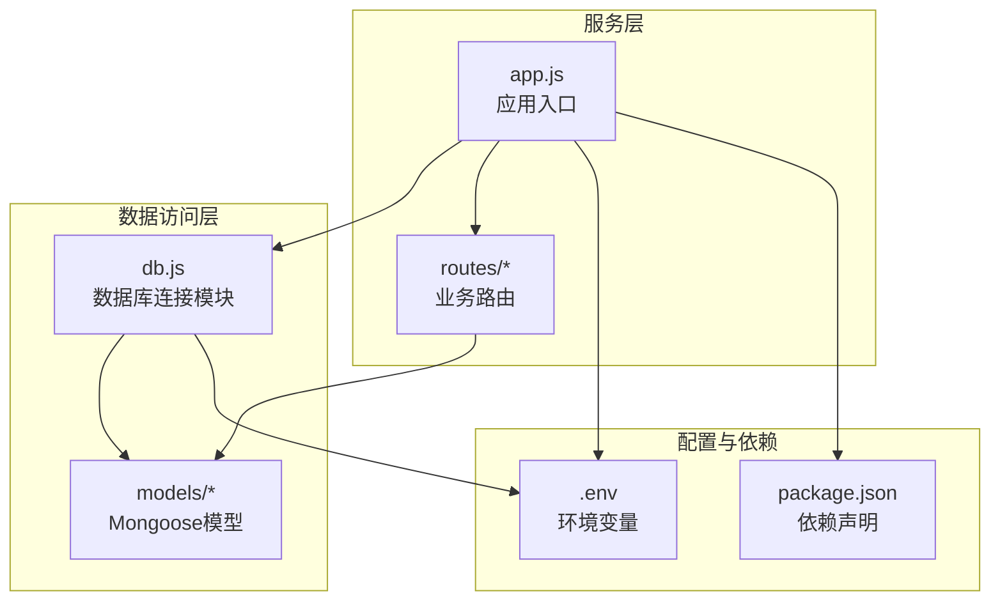
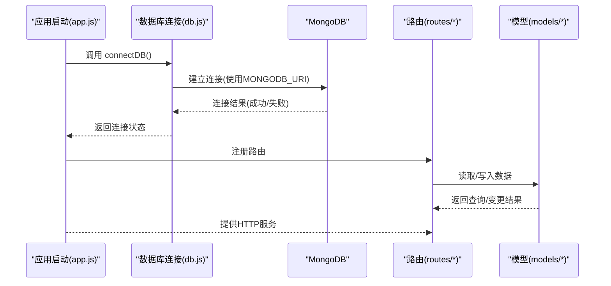
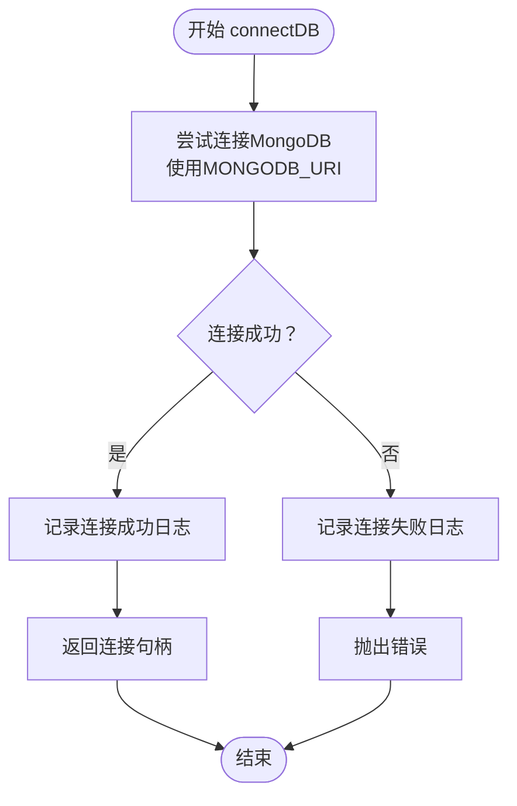
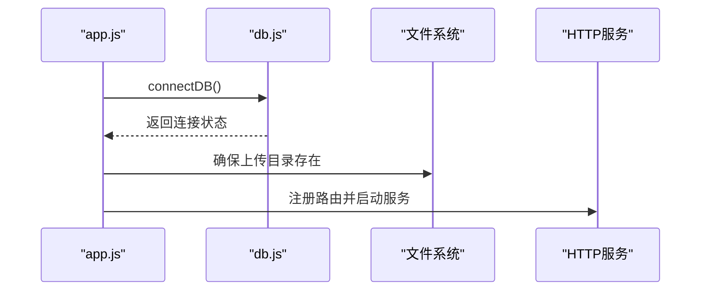
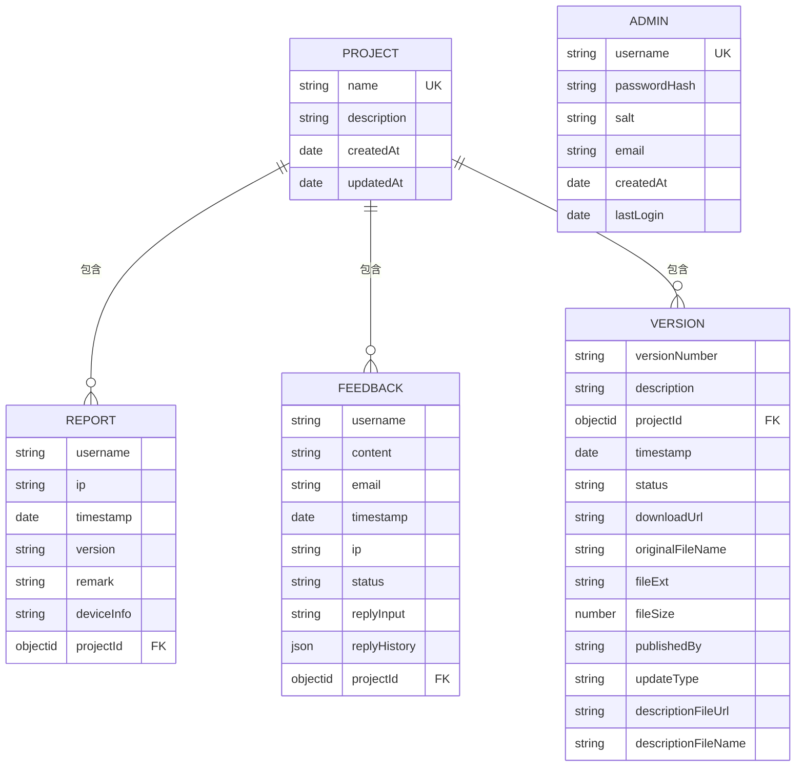
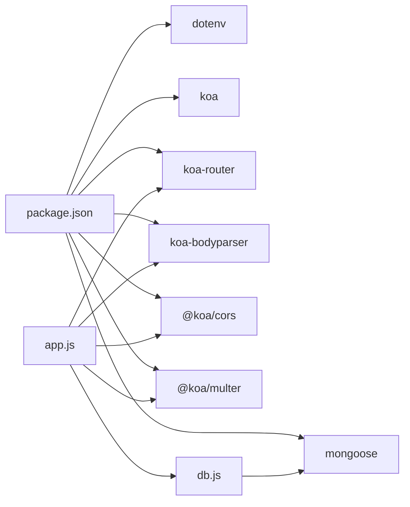

# 数据库连接配置

<cite>
**本文档引用的文件**
- [server/db.js](file://server/db.js)
- [server/.env](file://server/.env)
- [server/app.js](file://server/app.js)
- [server/package.json](file://server/package.json)
- [server/models/Admin.js](file://server/models/Admin.js)
- [server/models/Feedback.js](file://server/models/Feedback.js)
- [server/models/Project.js](file://server/models/Project.js)
- [server/models/Report.js](file://server/models/Report.js)
- [server/models/Version.js](file://server/models/Version.js)
- [server/routes/admin.js](file://server/routes/admin.js)
- [server/routes/project.js](file://server/routes/project.js)
</cite>

## 目录
1. [简介](#简介)
2. [项目结构](#项目结构)
3. [核心组件](#核心组件)
4. [架构总览](#架构总览)
5. [详细组件分析](#详细组件分析)
6. [依赖关系分析](#依赖关系分析)
7. [性能考虑](#性能考虑)
8. [故障排查指南](#故障排查指南)
9. [结论](#结论)

## 简介
本文件聚焦于WoaX项目的数据库连接配置与实现，系统性解析MongoDB连接模块的设计与实现细节，涵盖连接字符串配置、连接参数设置、错误处理机制、环境变量配置、连接生命周期管理、初始化流程、重连策略与异常处理策略，并补充连接安全性、性能优化与监控指标建议，以及故障排查与最佳实践。

## 项目结构
WoaX后端采用Koa框架，数据库通过Mongoose进行抽象，连接逻辑集中在独立模块中，应用启动时完成数据库连接初始化，随后注册路由并启动HTTP服务。

图表来源
- [server/app.js](file://server/app.js#L1-L61)
- [server/db.js](file://server/db.js#L1-L45)
- [server/.env](file://server/.env#L1-L9)
- [server/package.json](file://server/package.json#L1-L24)

章节来源
- [server/app.js](file://server/app.js#L1-L61)
- [server/db.js](file://server/db.js#L1-L45)
- [server/.env](file://server/.env#L1-L9)
- [server/package.json](file://server/package.json#L1-L24)

## 核心组件
- 数据库连接模块：负责建立与MongoDB的连接、监听连接事件、处理应用关闭时的资源清理。
- 应用入口：在启动阶段调用连接模块，确保数据库可用后再注册路由与中间件。
- 环境变量：集中存放数据库连接字符串等敏感配置。
- Mongoose模型：定义各集合的数据结构与约束，供路由层读写。

章节来源
- [server/db.js](file://server/db.js#L1-L45)
- [server/app.js](file://server/app.js#L1-L61)
- [server/.env](file://server/.env#L1-L9)

## 架构总览
下图展示从应用启动到数据库连接、模型使用与路由交互的整体流程。

图表来源
- [server/app.js](file://server/app.js#L21-L22)
- [server/db.js](file://server/db.js#L10-L24)
- [server/routes/project.js](file://server/routes/project.js#L10-L25)
- [server/models/Project.js](file://server/models/Project.js#L1-L21)

## 详细组件分析

### 数据库连接模块（db.js）
- 连接字符串配置
  - 优先使用环境变量中的连接字符串；若未提供，则回退到本地默认地址。
  - 连接参数启用统一拓扑与URL解析，确保兼容性与稳定性。
- 连接生命周期
  - 成功：记录日志并返回连接句柄。
  - 失败：记录错误并抛出异常，交由调用方处理。
  - 断开：监听断开事件并输出提示。
  - 错误：监听错误事件并输出错误信息。
  - 关闭：捕获中断信号，优雅关闭数据库连接并退出进程。
- 事件监听与资源管理
  - 使用连接事件进行可观测性输出，便于问题定位。
  - 在进程退出前主动关闭连接，避免资源泄漏。

图表来源
- [server/db.js](file://server/db.js#L10-L24)

章节来源
- [server/db.js](file://server/db.js#L1-L45)

### 应用入口（app.js）
- 初始化流程
  - 加载环境变量与依赖。
  - 调用数据库连接函数，捕获连接失败并记录。
  - 确保上传目录存在，注册静态文件服务。
  - 注册路由并启动HTTP服务。
- 与数据库连接模块的耦合
  - 仅在启动阶段调用连接函数，不直接暴露连接对象给其他模块，降低耦合度。

图表来源
- [server/app.js](file://server/app.js#L21-L28)
- [server/app.js](file://server/app.js#L48-L55)
- [server/app.js](file://server/app.js#L58-L61)

章节来源
- [server/app.js](file://server/app.js#L1-L61)

### 环境变量配置（.env）
- 数据库连接字符串
  - 使用统一的键值存储连接URI，便于在不同环境切换。
- 其他配置
  - 服务器端口、上传目录路径、文件大小限制等。

章节来源
- [server/.env](file://server/.env#L1-L9)

### Mongoose模型与路由交互
- 模型定义
  - 各模型定义了集合结构、索引与约束，如唯一性、枚举值等。
- 路由使用
  - 路由层通过模型进行数据读写，典型操作包括查询、创建、更新、删除与批量迁移。
- 关系映射
  - 模型之间通过ObjectId与ref建立关联，路由层可进行跨集合的聚合与迁移。

图表来源
- [server/models/Project.js](file://server/models/Project.js#L1-L21)
- [server/models/Report.js](file://server/models/Report.js#L1-L22)
- [server/models/Feedback.js](file://server/models/Feedback.js#L1-L52)
- [server/models/Version.js](file://server/models/Version.js#L1-L62)
- [server/models/Admin.js](file://server/models/Admin.js#L1-L32)

章节来源
- [server/models/Project.js](file://server/models/Project.js#L1-L21)
- [server/models/Report.js](file://server/models/Report.js#L1-L22)
- [server/models/Feedback.js](file://server/models/Feedback.js#L1-L52)
- [server/models/Version.js](file://server/models/Version.js#L1-L62)
- [server/models/Admin.js](file://server/models/Admin.js#L1-L32)
- [server/routes/project.js](file://server/routes/project.js#L10-L25)

### 安全性考虑
- 连接字符串安全
  - 使用环境变量存储连接URI，避免硬编码在代码中。
  - 在生产环境中建议使用更严格的认证方式（如用户凭据、SSL/TLS），并在部署时通过安全渠道注入环境变量。
- 认证与授权
  - 管理员登录与令牌校验示例展示了基于JWT的认证流程，配合路由中间件实现权限控制。
- 敏感信息保护
  - 密码哈希与盐值存储在模型中，避免明文存储。

章节来源
- [server/.env](file://server/.env#L4-L5)
- [server/routes/admin.js](file://server/routes/admin.js#L27-L67)
- [server/models/Admin.js](file://server/models/Admin.js#L17-L30)

### 性能优化配置
- 连接参数
  - 已启用统一拓扑与URL解析，有助于提升连接稳定性与兼容性。
- 连接池管理
  - 当前实现未显式配置连接池参数。建议在生产环境根据并发量与延迟需求调整池大小、超时与重试策略。
- 查询优化
  - 路由层使用排序、条件查询与批量更新，建议结合索引与分页策略进一步优化。
- 缓存与降级
  - 可引入查询缓存与只读副本，减少主库压力。

章节来源
- [server/db.js](file://server/db.js#L12-L15)
- [server/routes/project.js](file://server/routes/project.js#L190-L224)

### 监控指标建议
- 连接状态
  - 通过连接事件输出断开与错误日志，便于监控告警。
- 响应时间
  - 对关键路由接口记录请求耗时，识别慢查询与瓶颈。
- 错误率
  - 统计数据库相关错误（连接失败、查询超时、写入失败）占比。
- 资源使用
  - 监控数据库连接数、内存占用与磁盘IO。

章节来源
- [server/db.js](file://server/db.js#L27-L33)

### 异常处理策略
- 连接失败
  - 记录错误并抛出异常，交由调用方决定是否终止进程或重试。
- 应用关闭
  - 捕获中断信号，优雅关闭数据库连接并退出，避免数据损坏。
- 路由层异常
  - 路由层对数据库操作进行try-catch，返回标准化错误响应，避免内部异常泄露。

章节来源
- [server/db.js](file://server/db.js#L18-L23)
- [server/db.js](file://server/db.js#L36-L40)
- [server/routes/project.js](file://server/routes/project.js#L17-L24)

## 依赖关系分析
- 依赖声明
  - 使用Mongoose作为ODM，dotenv用于加载环境变量，Koa及其中间件提供Web服务。
- 版本与兼容性
  - 依赖版本满足最低Node引擎要求，确保运行环境稳定。

图表来源
- [server/package.json](file://server/package.json#L10-L20)
- [server/db.js](file://server/db.js#L1)
- [server/app.js](file://server/app.js#L1-L10)

章节来源
- [server/package.json](file://server/package.json#L1-L24)
- [server/db.js](file://server/db.js#L1-L45)
- [server/app.js](file://server/app.js#L1-L10)

## 性能考虑
- 连接池参数
  - 建议在生产环境显式配置连接池大小、最大等待时间与自动重试次数，以平衡吞吐与延迟。
- 查询优化
  - 对常用查询字段建立索引，避免全表扫描；对大文档进行投影裁剪。
- 并发控制
  - 控制路由层并发请求，防止数据库过载；必要时引入限流与熔断。
- 存储与备份
  - 定期备份数据库，确保灾难恢复能力。

[本节为通用性能指导，无需特定文件来源]

## 故障排查指南
- 连接失败
  - 检查环境变量中的连接字符串是否正确。
  - 确认MongoDB服务正在运行且网络可达。
  - 查看连接事件日志，定位具体错误类型。
- 断开与重连
  - 观察断开事件日志，确认是否为网络波动或服务重启导致。
  - 在应用层面实现指数退避重连策略，避免频繁重试。
- 权限与认证
  - 若使用带认证的连接，检查用户名、密码与数据库权限。
- 路由异常
  - 查看路由层错误响应，定位具体操作与输入参数问题。
- 日志与监控
  - 结合连接事件日志与应用日志，快速定位问题根因。

章节来源
- [server/db.js](file://server/db.js#L18-L23)
- [server/db.js](file://server/db.js#L27-L33)
- [server/routes/project.js](file://server/routes/project.js#L17-L24)

## 结论
WoaX的数据库连接模块以简洁清晰的方式实现了MongoDB的连接、事件监听与优雅关闭，配合环境变量与Mongoose模型，形成了稳定的后端数据访问层。建议在生产环境中补充连接池参数配置、监控指标与重连策略，并强化认证与授权机制，以进一步提升系统的可靠性与安全性。