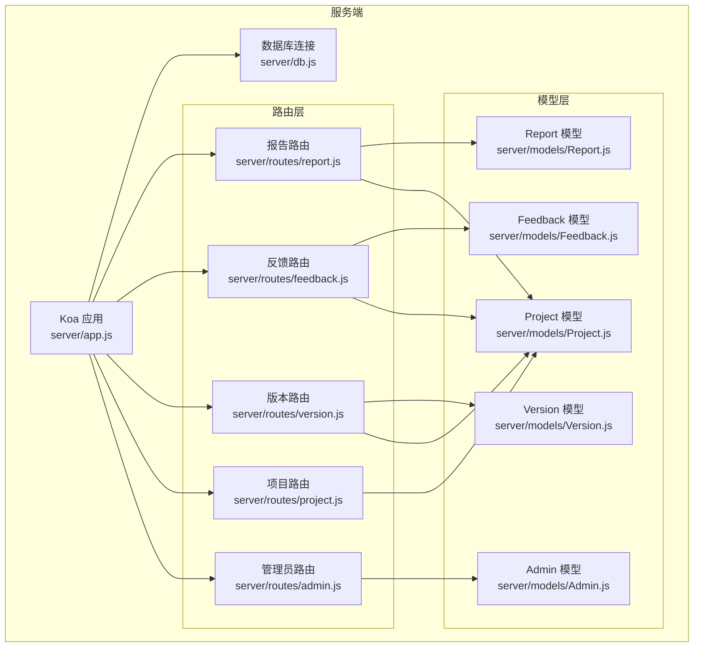
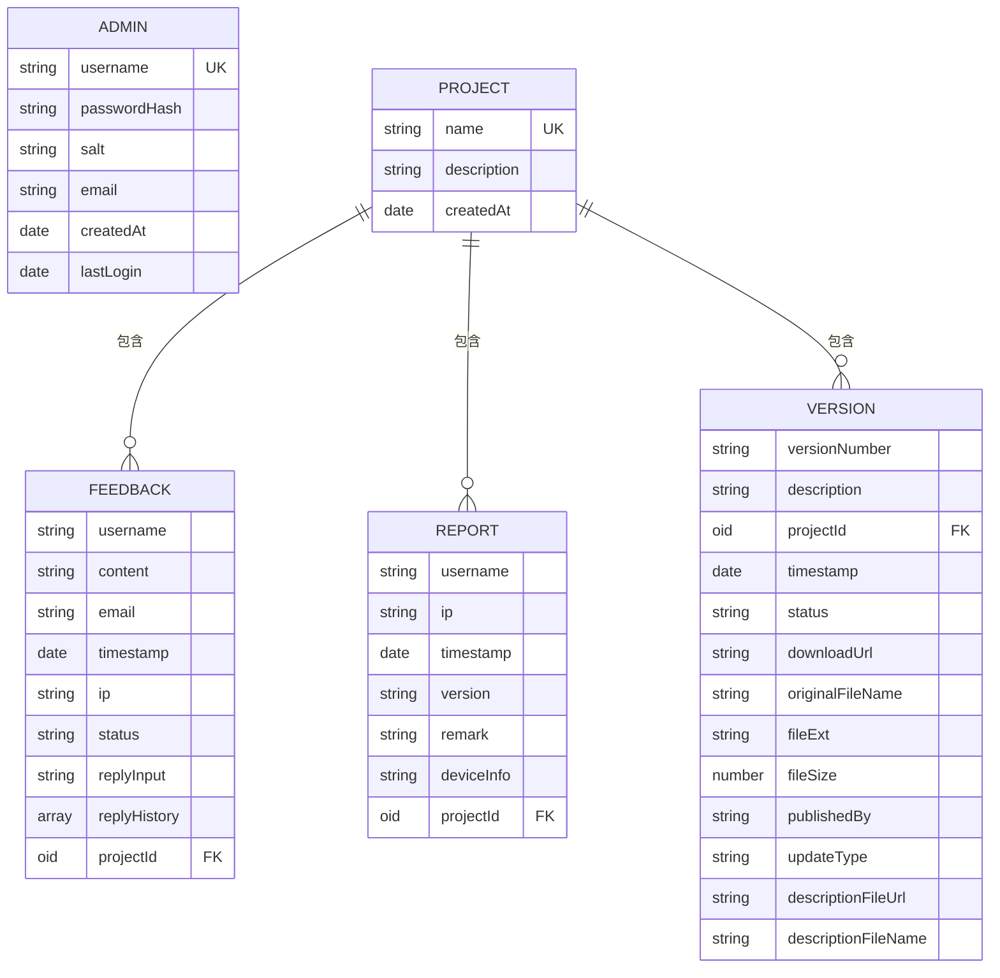
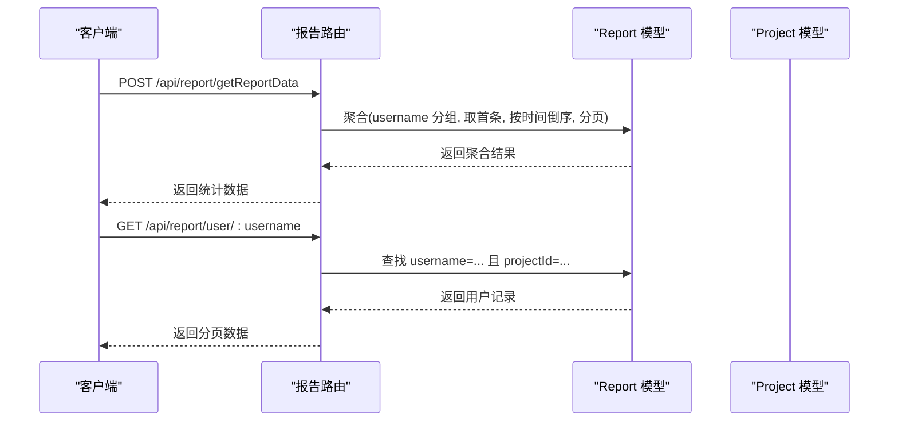
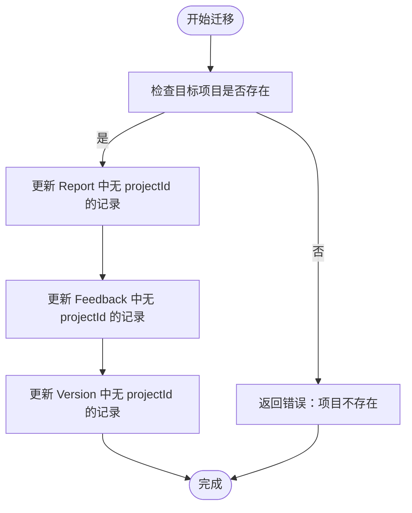
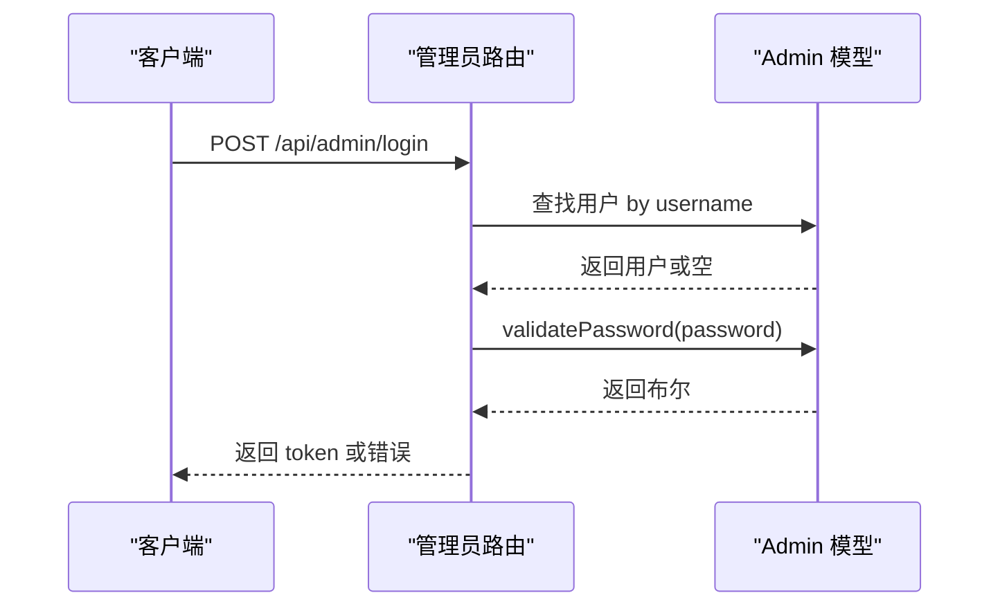
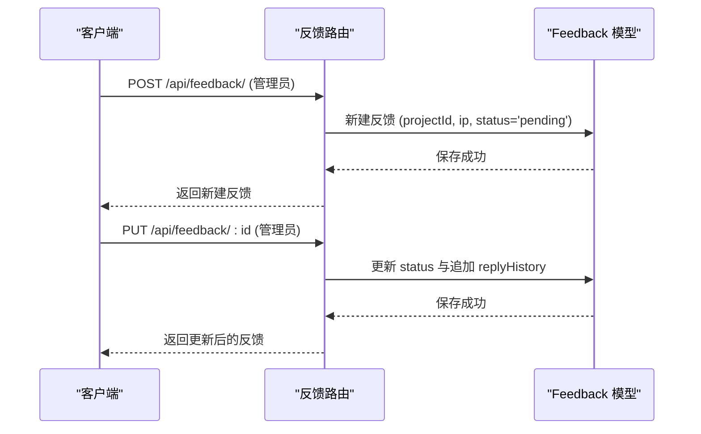
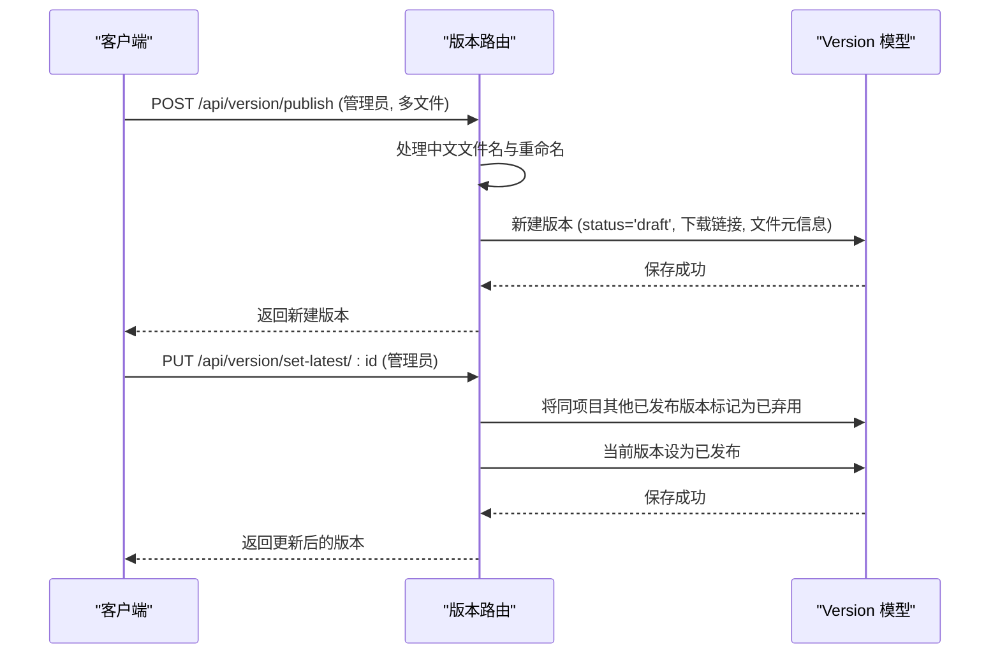
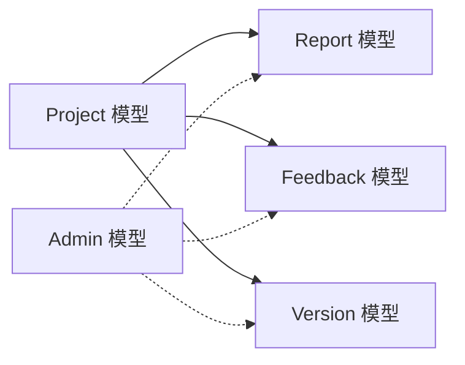

# 数据模型设计

<cite>
**本文档引用的文件**
- [server/models/Admin.js](file://server/models/Admin.js)
- [server/models/Feedback.js](file://server/models/Feedback.js)
- [server/models/Project.js](file://server/models/Project.js)
- [server/models/Report.js](file://server/models/Report.js)
- [server/models/Version.js](file://server/models/Version.js)
- [server/routes/admin.js](file://server/routes/admin.js)
- [server/routes/feedback.js](file://server/routes/feedback.js)
- [server/routes/project.js](file://server/routes/project.js)
- [server/routes/report.js](file://server/routes/report.js)
- [server/routes/version.js](file://server/routes/version.js)
- [server/db.js](file://server/db.js)
- [server/app.js](file://server/app.js)
- [db/woax.projects.json](file://db/woax.projects.json)
- [db/woax.feedbacks.json](file://db/woax.feedbacks.json)
- [db/woax.versions.json](file://db/woax.versions.json)
- [db/woax.statistics.json](file://db/woax.statistics.json)
- [db/woax.admins.json](file://db/woax.admins.json)
</cite>

## 目录
1. [简介](#简介)
2. [项目结构](#项目结构)
3. [核心组件](#核心组件)
4. [架构总览](#架构总览)
5. [详细组件分析](#详细组件分析)
6. [依赖分析](#依赖分析)
7. [性能考虑](#性能考虑)
8. [故障排查指南](#故障排查指南)
9. [结论](#结论)
10. [附录](#附录)

## 简介
本文件系统化梳理 WoaX 的数据模型设计，围绕以下核心模型展开：Report 用户统计模型、Project 项目模型、Admin 管理员模型、Feedback 反馈模型、Version 版本模型。我们将从字段定义、数据类型、验证规则、索引设计、模型间关联关系、嵌入与引用策略、数据完整性约束、默认值与虚拟字段、扩展指南与性能优化等方面进行全面解析，并结合路由层使用场景给出实践建议。

## 项目结构
后端采用 Koa + Mongoose 架构，模型位于 server/models，路由位于 server/routes，数据库连接与中间件在 server/app.js 与 server/db.js 中配置；示例数据位于 db 目录，便于理解字段与取值范围。

图表来源
- [server/app.js](file://server/app.js#L1-L61)
- [server/db.js](file://server/db.js#L1-L45)
- [server/routes/report.js](file://server/routes/report.js#L1-L271)
- [server/routes/feedback.js](file://server/routes/feedback.js#L1-L187)
- [server/routes/version.js](file://server/routes/version.js#L1-L432)
- [server/routes/project.js](file://server/routes/project.js#L1-L226)
- [server/routes/admin.js](file://server/routes/admin.js#L1-L128)
- [server/models/Admin.js](file://server/models/Admin.js#L1-L32)
- [server/models/Feedback.js](file://server/models/Feedback.js#L1-L52)
- [server/models/Project.js](file://server/models/Project.js#L1-L21)
- [server/models/Report.js](file://server/models/Report.js#L1-L22)
- [server/models/Version.js](file://server/models/Version.js#L1-L62)

章节来源
- [server/app.js](file://server/app.js#L1-L61)
- [server/db.js](file://server/db.js#L1-L45)

## 核心组件
本节概述各模型的核心字段、类型、约束与默认值，以及与路由层的典型交互。

- Admin 管理员模型
  - 字段要点：用户名唯一、密码哈希与盐值、邮箱、创建时间、最近登录时间
  - 方法：密码设置与校验（PBKDF2）
  - 关联：被管理员路由用于登录、令牌签发与权限校验
- Feedback 反馈模型
  - 字段要点：用户名、内容、邮箱、时间戳、IP、状态、回复输入与历史、项目外键
  - 约束：状态枚举、默认“待处理”
  - 关联：通过 ObjectId 引用 Project
- Project 项目模型
  - 字段要点：名称唯一、描述、时间戳
  - 关联：作为 Report/Feedback/Version 的父级容器
- Report 用户统计模型
  - 字段要点：用户名、IP、时间戳、版本、备注、设备信息、项目外键
  - 关联：通过 ObjectId 引用 Project
- Version 版本模型
  - 字段要点：版本号、描述、项目外键、时间戳、状态、下载链接、文件元信息、更新类型等
  - 约束：状态枚举、默认草稿；更新类型枚举、默认被动

章节来源
- [server/models/Admin.js](file://server/models/Admin.js#L1-L32)
- [server/models/Feedback.js](file://server/models/Feedback.js#L1-L52)
- [server/models/Project.js](file://server/models/Project.js#L1-L21)
- [server/models/Report.js](file://server/models/Report.js#L1-L22)
- [server/models/Version.js](file://server/models/Version.js#L1-L62)

## 架构总览
下图展示模型间的引用关系与典型查询路径（聚合、分页、外键过滤）：

图表来源
- [server/models/Project.js](file://server/models/Project.js#L1-L21)
- [server/models/Feedback.js](file://server/models/Feedback.js#L1-L52)
- [server/models/Report.js](file://server/models/Report.js#L1-L22)
- [server/models/Version.js](file://server/models/Version.js#L1-L62)

## 详细组件分析

### Report 用户统计模型
- 设计要点
  - 字段覆盖用户标识、设备与位置信息、上报时间、版本与备注等，便于统计分析
  - 通过 ObjectId 引用 Project，支持跨项目隔离与聚合
  - 集合命名为 statistics，便于区分与后续索引优化
- 关联与使用
  - 路由层提供按用户分页查询与按项目聚合“每个用户最后一次上报”的接口
  - 聚合管道先按用户分组取首条记录，再按时间倒序，最后分页
- 索引建议
  - 在 username + projectId 组合上建立复合索引，加速按用户与项目过滤
  - 在 timestamp 上建立索引，支持时间序列查询
- 数据完整性
  - 必填字段：username、projectId
  - 默认值：timestamp 默认当前时间
- 扩展建议
  - 可引入虚拟字段（如“最近一次上报时间”）以减少客户端重复计算
  - 可增加设备指纹字段以提升去重与识别能力

图表来源
- [server/routes/report.js](file://server/routes/report.js#L8-L88)
- [server/routes/report.js](file://server/routes/report.js#L90-L131)
- [server/models/Report.js](file://server/models/Report.js#L1-L22)

章节来源
- [server/models/Report.js](file://server/models/Report.js#L1-L22)
- [server/routes/report.js](file://server/routes/report.js#L8-L88)
- [server/routes/report.js](file://server/routes/report.js#L90-L131)

### Project 项目模型
- 设计要点
  - 名称唯一，描述可空，自动维护 createdAt 与 updatedAt
  - 作为 Report/Feedback/Version 的父级容器，支撑多租户式隔离
- 关联与使用
  - 路由层提供 CRUD 与数据迁移接口，支持将无项目 ID 的历史数据迁移至指定项目
- 索引建议
  - name 字段已唯一索引，满足去重与快速查找
- 数据完整性
  - 必填字段：name
  - 默认值：createdAt 默认当前时间
- 扩展建议
  - 可引入标签数组、项目状态等字段以支持更细粒度管理

图表来源
- [server/routes/project.js](file://server/routes/project.js#L189-L224)

章节来源
- [server/models/Project.js](file://server/models/Project.js#L1-L21)
- [server/routes/project.js](file://server/routes/project.js#L1-L226)

### Admin 管理员模型
- 设计要点
  - 密文存储：salt + passwordHash，使用 PBKDF2
  - 提供 setPassword 与 validatePassword 方法
  - 字段：username 唯一、email、创建时间、最近登录时间
- 关联与使用
  - 路由层提供登录、令牌校验与中间件权限控制
  - 启动时自动创建默认管理员账号（仅当不存在）
- 索引建议
  - username 已唯一索引，满足登录与鉴权需求
- 数据完整性
  - 必填字段：username、passwordHash、salt
  - 默认值：createdAt 默认当前时间
- 扩展建议
  - 可引入角色字段（如 super/admin），并配合中间件细化权限

图表来源
- [server/routes/admin.js](file://server/routes/admin.js#L26-L67)
- [server/models/Admin.js](file://server/models/Admin.js#L17-L30)

章节来源
- [server/models/Admin.js](file://server/models/Admin.js#L1-L32)
- [server/routes/admin.js](file://server/routes/admin.js#L1-L128)

### Feedback 反馈模型
- 设计要点
  - 字段：用户名、内容、邮箱、时间戳、IP、状态、回复输入与历史、项目外键
  - 状态枚举：待处理、已审阅、已解决，默认“待处理”
  - 回复历史为数组，包含内容、时间与管理员信息
- 关联与使用
  - 路由层提供列表、详情、新增、更新（含状态与回复）、删除接口，均需管理员权限
  - 通过 projectId 过滤反馈，支持分页与排序
- 索引建议
  - 在 projectId + timestamp 组合上建立索引，加速按项目与时间排序
  - 在 status 单列建立索引，支持按状态筛选
- 数据完整性
  - 必填字段：username、content、projectId
  - 默认值：timestamp 默认当前时间，status 默认“待处理”，replyInput 默认空字符串
- 扩展建议
  - 可引入评分字段、附件链接等增强反馈闭环

图表来源
- [server/routes/feedback.js](file://server/routes/feedback.js#L72-L111)
- [server/routes/feedback.js](file://server/routes/feedback.js#L113-L158)
- [server/models/Feedback.js](file://server/models/Feedback.js#L1-L52)

章节来源
- [server/models/Feedback.js](file://server/models/Feedback.js#L1-L52)
- [server/routes/feedback.js](file://server/routes/feedback.js#L1-L187)

### Version 版本模型
- 设计要点
  - 字段：版本号、描述、项目外键、时间戳、状态、下载链接、文件元信息、更新类型、描述文件 URL/名称
  - 状态枚举：草稿、已发布、已弃用，默认草稿
  - 更新类型枚举：强制、主动、被动，默认被动
- 关联与使用
  - 路由层提供版本列表、详情、发布（含文件上传）、设为最新、更新状态、删除（含文件清理）等接口
  - 支持多文件上传（安装包与描述文件），并处理中文文件名编码问题
  - 设为最新时，将同项目其他已发布版本标记为已弃用
- 索引建议
  - 在 projectId + status + timestamp 组合上建立复合索引，加速“最新版本”查询
  - 在 versionNumber 单列建立唯一索引，避免重复版本号
- 数据完整性
  - 必填字段：versionNumber、description、projectId
  - 默认值：timestamp 默认当前时间，status 默认草稿，updateType 默认被动
- 扩展建议
  - 可引入渠道字段、平台限制、强制更新条件等

图表来源
- [server/routes/version.js](file://server/routes/version.js#L146-L256)
- [server/routes/version.js](file://server/routes/version.js#L258-L296)
- [server/models/Version.js](file://server/models/Version.js#L1-L62)

章节来源
- [server/models/Version.js](file://server/models/Version.js#L1-L62)
- [server/routes/version.js](file://server/routes/version.js#L1-L432)

## 依赖分析
- 模型依赖
  - Report/Feedback/Version 均通过 ObjectId 引用 Project
  - Admin 与 Report/Feedback/Version 无直接外键关联，但通过业务流程（如管理员操作）间接耦合
- 路由依赖
  - 各路由模块依赖对应模型进行数据读写
  - 管理员路由提供中间件，其他路由通过中间件实现权限控制
- 数据一致性
  - 通过 ObjectId 引用保证跨集合的一致性；对于历史数据迁移，项目路由提供批量更新能力

图表来源
- [server/models/Project.js](file://server/models/Project.js#L1-L21)
- [server/models/Report.js](file://server/models/Report.js#L1-L22)
- [server/models/Feedback.js](file://server/models/Feedback.js#L1-L52)
- [server/models/Version.js](file://server/models/Version.js#L1-L62)
- [server/models/Admin.js](file://server/models/Admin.js#L1-L32)

章节来源
- [server/routes/project.js](file://server/routes/project.js#L189-L224)
- [server/routes/admin.js](file://server/routes/admin.js#L100-L125)

## 性能考虑
- 索引策略
  - Report：username+projectId（分组与过滤）、timestamp（排序与范围查询）
  - Feedback：projectId+timestamp、status（状态筛选）
  - Version：projectId+status+timestamp（最新版本查询）、versionNumber（唯一性）
- 聚合与分页
  - Report 聚合先按用户分组取首条，再整体排序与分页，建议在分组字段上建立复合索引
- 文件存储
  - Version 上传文件落地磁盘，建议定期清理过期文件并监控磁盘空间
- 认证与缓存
  - Admin 登录后签发短期 JWT，建议在网关或中间件层做令牌缓存以降低数据库查询

[本节为通用性能建议，不直接分析具体文件，故无章节来源]

## 故障排查指南
- 数据库连接
  - 若连接失败，检查环境变量 MONGODB_URI 与网络连通性；服务端已监听连接错误并输出日志
- 权限相关
  - 401 未提供令牌或无效令牌：确认请求头 Authorization 是否正确携带 Bearer token
  - 管理员中间件校验失败：确认 token 未过期且用户存在
- 聚合与分页
  - Report 聚合报错：确认传入 projectId 类型为 ObjectId 且存在
  - 分页异常：确认 page/pageSize 参数合法
- 文件上传
  - 中文文件名乱码：路由层已内置编码修复与重命名策略；若仍异常，检查上传目录权限与磁盘空间
- 历史数据迁移
  - 迁移失败：确认目标项目存在且无保护限制（例如项目数量不得少于 1）

章节来源
- [server/db.js](file://server/db.js#L10-L33)
- [server/routes/admin.js](file://server/routes/admin.js#L100-L125)
- [server/routes/report.js](file://server/routes/report.js#L8-L88)
- [server/routes/version.js](file://server/routes/version.js#L10-L36)

## 结论
WoaX 的数据模型以 Project 为核心容器，Report/Feedback/Version 通过外键引用实现清晰的层级关系。模型设计遵循最小必要原则，结合路由层的权限控制与聚合查询，满足统计分析与版本管理需求。建议后续在索引、文件清理与权限细化方面持续优化，以进一步提升稳定性与性能。

[本节为总结性内容，不直接分析具体文件，故无章节来源]

## 附录
- 示例数据参考
  - 项目样例：db/woax.projects.json
  - 反馈样例：db/woax.feedbacks.json
  - 版本样例：db/woax.versions.json
  - 统计样例：db/woax.statistics.json
  - 管理员样例：db/woax.admins.json

章节来源
- [db/woax.projects.json](file://db/woax.projects.json#L1-L28)
- [db/woax.feedbacks.json](file://db/woax.feedbacks.json#L1-L185)
- [db/woax.versions.json](file://db/woax.versions.json#L1-L52)
- [db/woax.statistics.json](file://db/woax.statistics.json#L1-L800)
- [db/woax.admins.json](file://db/woax.admins.json#L1-L15)