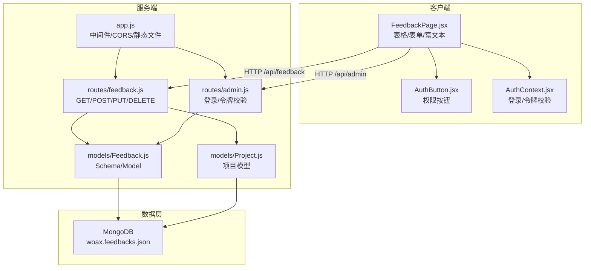
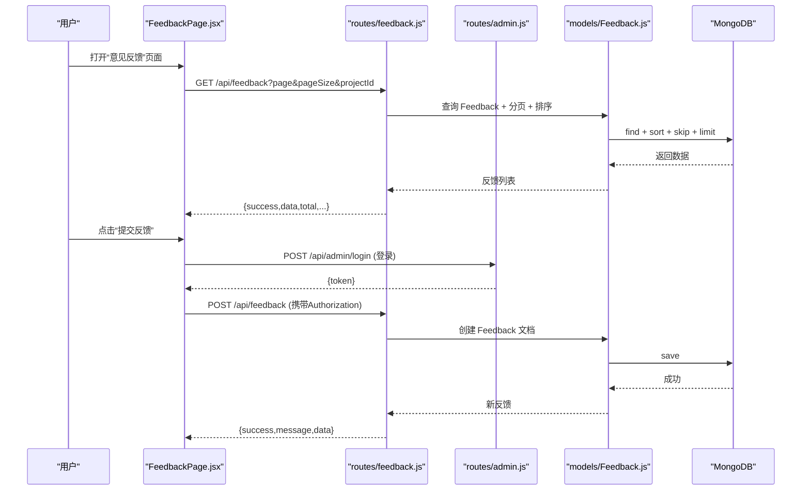
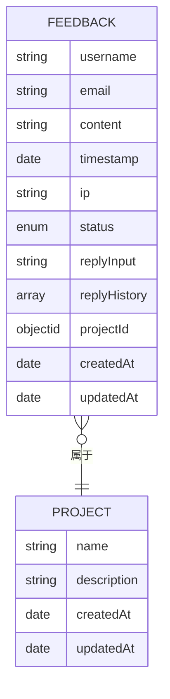
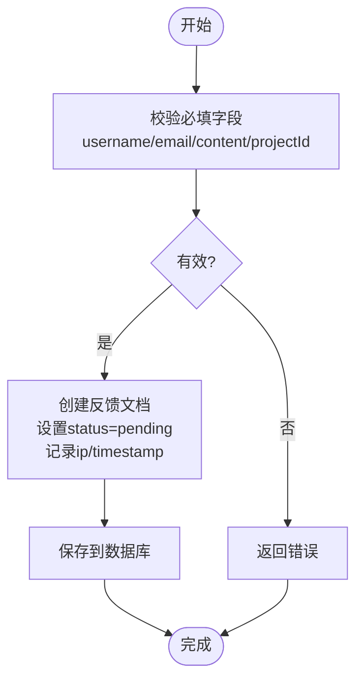
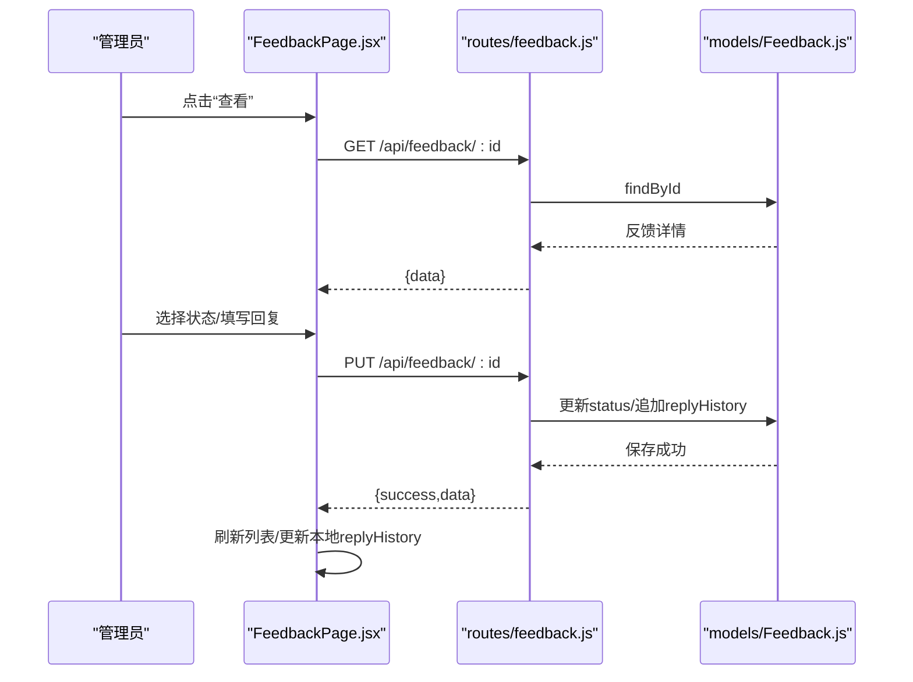
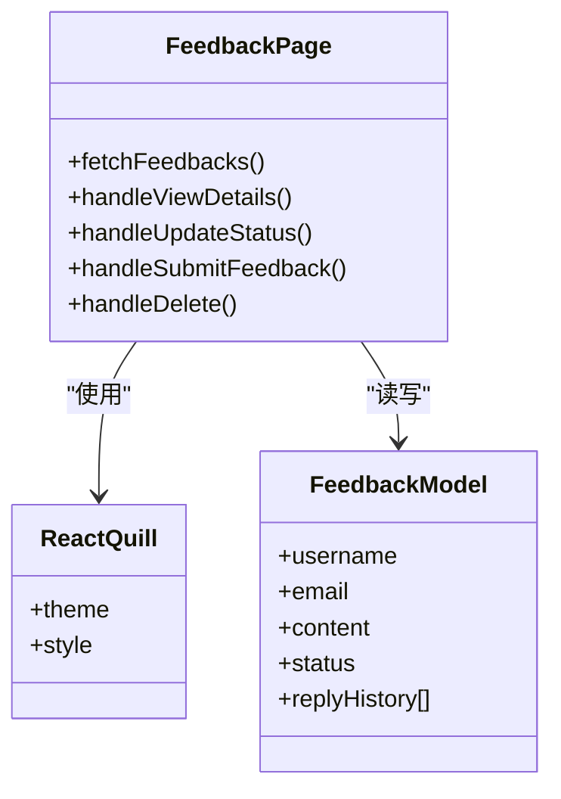
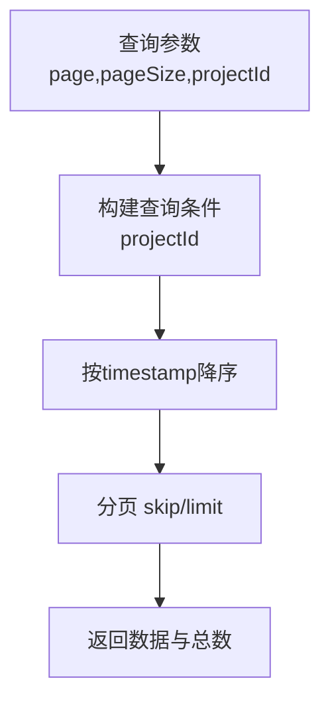
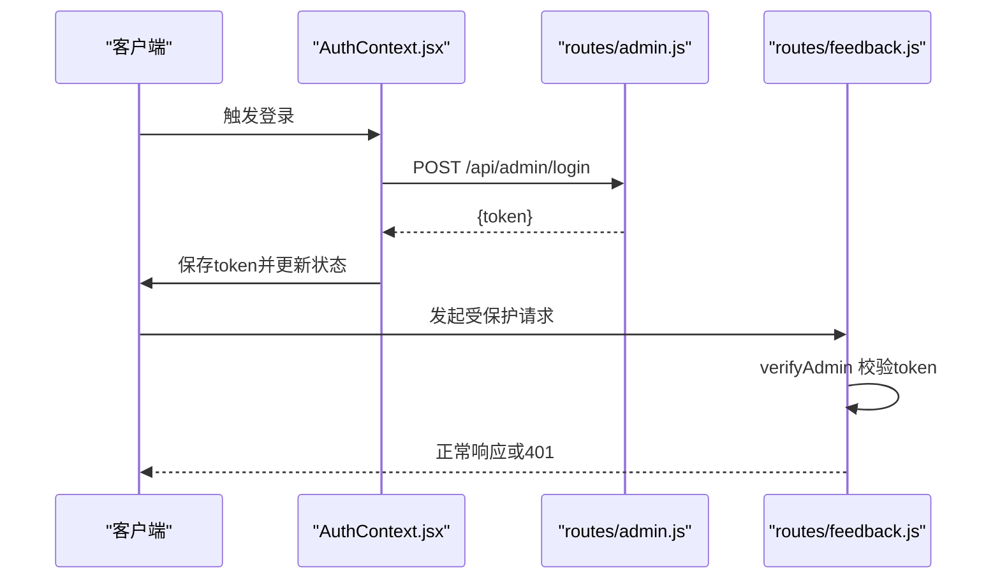
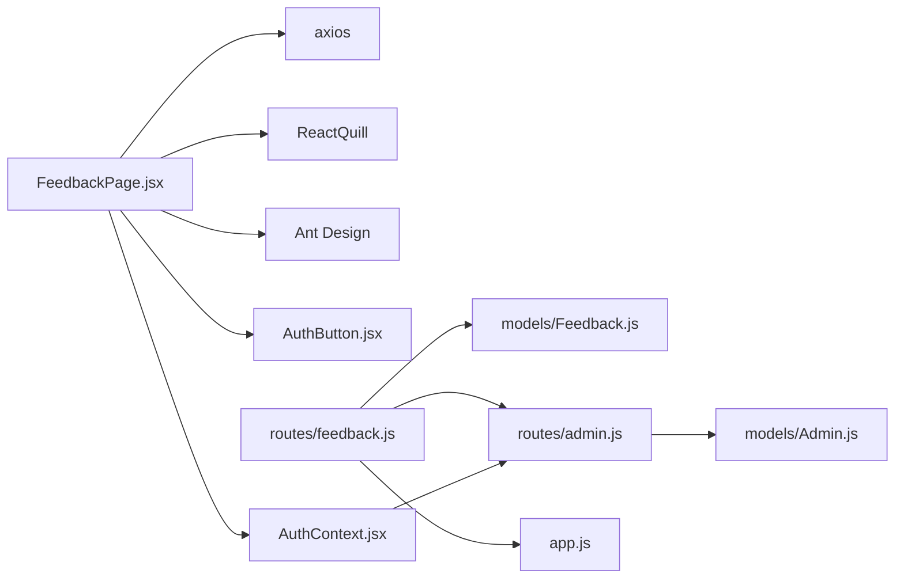

# 反馈集合 (feedbacks)

<cite>
**本文引用的文件**
- [woax.feedbacks.json](file://db/woax.feedbacks.json)
- [Feedback.js](file://server/models/Feedback.js)
- [feedback.js](file://server/routes/feedback.js)
- [FeedbackPage.jsx](file://client/src/pages/FeedbackPage.jsx)
- [README.md](file://README.md)
- [admin.js](file://server/routes/admin.js)
- [AuthButton.jsx](file://client/src/components/AuthButton.jsx)
- [AuthContext.jsx](file://client/src/context/AuthContext.jsx)
- [app.js](file://server/app.js)
- [Project.js](file://server/models/Project.js)
</cite>

## 目录
1. [简介](#简介)
2. [项目结构](#项目结构)
3. [核心组件](#核心组件)
4. [架构总览](#架构总览)
5. [详细组件分析](#详细组件分析)
6. [依赖关系分析](#依赖关系分析)
7. [性能考量](#性能考量)
8. [故障排查指南](#故障排查指南)
9. [结论](#结论)
10. [附录](#附录)

## 简介
本文件围绕 WoaX 项目的“反馈集合（feedbacks）”进行系统化文档化，覆盖以下方面：
- 文档结构与字段语义：用户反馈内容、联系方式、反馈类型、处理状态、关联项目等
- 收集流程、分类机制与状态管理
- 用户交互设计：富文本支持、回复历史、附件处理现状与建议
- 查询过滤、排序规则与搜索能力
- 权限控制、数据安全与隐私保护
- 扩展性设计与未来增强方案

## 项目结构
反馈集合位于后端 MongoDB 数据库中，通过 Koa 路由暴露 REST 接口；前端 React 页面负责展示与交互。整体采用前后端分离架构，权限通过 JWT 管理员令牌控制。

图表来源
- [app.js](file://server/app.js#L1-L61)
- [feedback.js](file://server/routes/feedback.js#L1-L187)
- [admin.js](file://server/routes/admin.js#L1-L128)
- [Feedback.js](file://server/models/Feedback.js#L1-L52)
- [Project.js](file://server/models/Project.js#L1-L21)
- [FeedbackPage.jsx](file://client/src/pages/FeedbackPage.jsx#L1-L496)
- [AuthButton.jsx](file://client/src/components/AuthButton.jsx#L1-L43)
- [AuthContext.jsx](file://client/src/context/AuthContext.jsx#L1-L155)

章节来源
- [README.md](file://README.md#L1-L44)
- [app.js](file://server/app.js#L1-L61)

## 核心组件
- 反馈模型（Feedback Model）
  - 字段：用户名、邮箱、内容（富文本）、时间戳、IP、状态、回复输入、回复历史、项目 ID
  - 状态枚举：待处理、已审阅、已解决
  - 时间戳自动维护
- 反馈路由（Feedback Routes）
  - 列表查询（分页、按项目过滤、按时间倒序）
  - 详情查询
  - 新增反馈（管理员权限）
  - 更新状态与添加回复（管理员权限）
  - 删除反馈（管理员权限）
- 前端页面（FeedbackPage）
  - 表格展示反馈列表
  - 详情弹窗查看与更新状态、添加回复
  - 提交反馈弹窗
  - 富文本编辑器（ReactQuill）
- 权限体系（Admin Routes + AuthButton/AuthContext）
  - 管理员登录、JWT 校验、中间件拦截
  - 前端按钮级权限控制

章节来源
- [Feedback.js](file://server/models/Feedback.js#L1-L52)
- [feedback.js](file://server/routes/feedback.js#L1-L187)
- [FeedbackPage.jsx](file://client/src/pages/FeedbackPage.jsx#L1-L496)
- [admin.js](file://server/routes/admin.js#L1-L128)
- [AuthButton.jsx](file://client/src/components/AuthButton.jsx#L1-L43)
- [AuthContext.jsx](file://client/src/context/AuthContext.jsx#L1-L155)

## 架构总览
反馈集合的端到端流程如下：

图表来源
- [FeedbackPage.jsx](file://client/src/pages/FeedbackPage.jsx#L66-L96)
- [feedback.js](file://server/routes/feedback.js#L7-L43)
- [admin.js](file://server/routes/admin.js#L26-L67)
- [Feedback.js](file://server/models/Feedback.js#L1-L52)

## 详细组件分析

### 数据模型与文档结构
- 字段说明
  - username：必填，字符串，去空白
  - email：可选，字符串，去空白
  - content：必填，富文本字符串
  - timestamp：必填，默认当前时间
  - ip：可选，字符串，去空白
  - status：枚举，取值为 pending/reviewed/resolved，默认 pending
  - replyInput：可选，字符串，默认空
  - replyHistory：数组，元素含 content/time/admin
  - projectId：必填，指向 Project 的 ObjectId
  - timestamps：自动维护 createdAt/updatedAt
- 示例参考
  - 参见数据库样例文件中的字段布局与嵌套结构

图表来源
- [Feedback.js](file://server/models/Feedback.js#L3-L49)
- [Project.js](file://server/models/Project.js#L3-L19)

章节来源
- [Feedback.js](file://server/models/Feedback.js#L1-L52)
- [woax.feedbacks.json](file://db/woax.feedbacks.json#L1-L185)

### 收集流程与分类机制
- 收集流程
  - 前端表单填写用户名、邮箱、内容，选择项目后提交
  - 后端接收请求，校验必填字段与管理员权限
  - 写入数据库，设置默认状态为“待处理”，记录 IP 与时间戳
- 分类机制
  - 通过 status 字段实现三态分类：待处理、已审阅、已解决
  - 前端以徽章形式直观展示状态

图表来源
- [feedback.js](file://server/routes/feedback.js#L72-L111)
- [Feedback.js](file://server/models/Feedback.js#L3-L49)

章节来源
- [feedback.js](file://server/routes/feedback.js#L71-L111)
- [FeedbackPage.jsx](file://client/src/pages/FeedbackPage.jsx#L193-L219)

### 处理状态管理
- 状态变更
  - 管理员可在详情弹窗中切换状态
  - 支持添加回复（replyInput），写入 replyHistory 数组
- 前端交互
  - 点击“查看”打开详情弹窗
  - 选择状态按钮更新状态
  - 富文本编辑器输入回复内容并提交
  - 提交后刷新列表，前端即时渲染新增回复（注意：实际以后端返回为准）

图表来源
- [FeedbackPage.jsx](file://client/src/pages/FeedbackPage.jsx#L103-L175)
- [feedback.js](file://server/routes/feedback.js#L113-L158)
- [Feedback.js](file://server/models/Feedback.js#L26-L46)

章节来源
- [FeedbackPage.jsx](file://client/src/pages/FeedbackPage.jsx#L103-L175)
- [feedback.js](file://server/routes/feedback.js#L113-L158)

### 用户交互设计与富文本支持
- 富文本支持
  - 前端使用 ReactQuill 提供富文本编辑器
  - 后端 content 字段存储富文本 HTML
  - 前端详情页以安全方式渲染 HTML（dangerouslySetInnerHTML）
- 回复历史
  - replyHistory 数组记录每次回复的时间、内容与管理员
  - 前端以卡片形式展示历史记录
- 附件处理现状
  - 当前反馈模型不包含附件字段
  - 上传目录存在且可提供静态文件访问（用于版本更新等场景）
  - 若需附件，建议在模型中增加附件元数据字段并在路由中扩展上传逻辑

图表来源
- [FeedbackPage.jsx](file://client/src/pages/FeedbackPage.jsx#L1-L496)
- [Feedback.js](file://server/models/Feedback.js#L1-L52)

章节来源
- [FeedbackPage.jsx](file://client/src/pages/FeedbackPage.jsx#L415-L459)
- [app.js](file://server/app.js#L24-L45)

### 查询过滤、排序规则与搜索功能
- 查询过滤
  - 必须提供 projectId 参数，按项目 ID 过滤
- 排序规则
  - 按 timestamp 字段降序排列（最新在前）
- 分页
  - 支持 page/pageSize 参数
- 搜索功能
  - 当前未实现基于内容或用户名的全文检索
  - 可通过前端二次筛选或后端增加模糊匹配实现

图表来源
- [feedback.js](file://server/routes/feedback.js#L8-L43)

章节来源
- [feedback.js](file://server/routes/feedback.js#L8-L43)

### 权限控制、数据安全与隐私保护
- 权限控制
  - 所有写操作（POST/PUT/DELETE）均需管理员权限
  - verifyAdmin 中间件校验 JWT 令牌有效性
  - 前端 AuthButton/AuthContext 提供按钮级权限与登录弹窗
- 数据安全
  - 管理员登录成功后返回 JWT，前端保存于本地存储
  - 请求头携带 Authorization: Bearer token
- 隐私保护
  - content 字段为富文本，需注意 XSS 风险
  - 建议在渲染前进行 HTML 白名单过滤或服务端净化
  - email/ip 等敏感信息仅管理员可见

图表来源
- [AuthContext.jsx](file://client/src/context/AuthContext.jsx#L62-L92)
- [admin.js](file://server/routes/admin.js#L26-L67)
- [admin.js](file://server/routes/admin.js#L100-L125)
- [feedback.js](file://server/routes/feedback.js#L72-L111)

章节来源
- [admin.js](file://server/routes/admin.js#L100-L125)
- [AuthButton.jsx](file://client/src/components/AuthButton.jsx#L1-L43)
- [AuthContext.jsx](file://client/src/context/AuthContext.jsx#L1-L155)

### 扩展性设计与未来增强方案
- 附件支持
  - 在 Feedback 模型中新增附件元数据字段
  - 在路由中扩展 multipart/form-data 上传处理
  - 统一上传目录与下载 URL 生成
- 搜索与筛选
  - 增加 content/username/email 的模糊匹配
  - 支持多状态筛选与时间范围筛选
- 审计与追踪
  - 记录操作人（管理员）与操作时间
  - 支持导出反馈报表
- 安全加固
  - 对富文本内容进行白名单过滤
  - 对上传文件进行类型与大小限制
  - 对敏感字段进行脱敏展示

章节来源
- [Feedback.js](file://server/models/Feedback.js#L1-L52)
- [feedback.js](file://server/routes/feedback.js#L1-L187)
- [app.js](file://server/app.js#L24-L45)

## 依赖关系分析
- 组件耦合
  - FeedbackPage 依赖 ReactQuill、Ant Design、Axios
  - Feedback 路由依赖 Feedback 模型与管理员中间件
  - 管理员中间件依赖 Admin 模型与 JWT
- 外部依赖
  - MongoDB 存储
  - Koa 中间件：CORS、bodyParser、静态文件
  - 前端依赖：React、Ant Design、ReactQuill

图表来源
- [FeedbackPage.jsx](file://client/src/pages/FeedbackPage.jsx#L1-L496)
- [feedback.js](file://server/routes/feedback.js#L1-L187)
- [admin.js](file://server/routes/admin.js#L1-L128)
- [app.js](file://server/app.js#L1-L61)

章节来源
- [FeedbackPage.jsx](file://client/src/pages/FeedbackPage.jsx#L1-L496)
- [feedback.js](file://server/routes/feedback.js#L1-L187)
- [admin.js](file://server/routes/admin.js#L1-L128)
- [app.js](file://server/app.js#L1-L61)

## 性能考量
- 查询性能
  - 建议在 projectId 上建立索引以提升分页查询效率
  - 对 content 字段如需全文检索，可考虑文本索引
- 前端性能
  - 表格列宽与 ellipsis 控制可减少渲染压力
  - 分页参数合理设置，避免一次性加载过多数据
- 安全与稳定性
  - 对富文本渲染进行白名单过滤，防止 XSS
  - 对请求体大小与字段长度进行限制

## 故障排查指南
- 常见错误与定位
  - 缺少项目 ID：后端返回 400 并提示缺少参数
  - 未找到反馈：后端返回 404
  - 未提供/无效令牌：后端返回 401
  - 提交失败：检查必填字段与管理员权限
- 前端排查
  - 确认登录状态与令牌是否有效
  - 检查网络请求与响应状态码
  - 查看控制台错误日志

章节来源
- [feedback.js](file://server/routes/feedback.js#L10-L43)
- [feedback.js](file://server/routes/feedback.js#L113-L158)
- [admin.js](file://server/routes/admin.js#L100-L125)
- [AuthContext.jsx](file://client/src/context/AuthContext.jsx#L24-L48)

## 结论
反馈集合在当前版本中提供了完善的管理员权限控制、状态管理与富文本支持。通过项目维度隔离与分页排序，满足了后台管理的基本需求。未来可在附件支持、全文检索、审计追踪与安全净化等方面进一步增强，以提升用户体验与系统安全性。

## 附录
- 默认管理员账号：用户名 admin，密码 admin123
- 技术栈：前端 React/Ant Design，后端 Koa/Mongoose，数据库 MongoDB

章节来源
- [README.md](file://README.md#L41-L44)
- [admin.js](file://server/routes/admin.js#L8-L21)