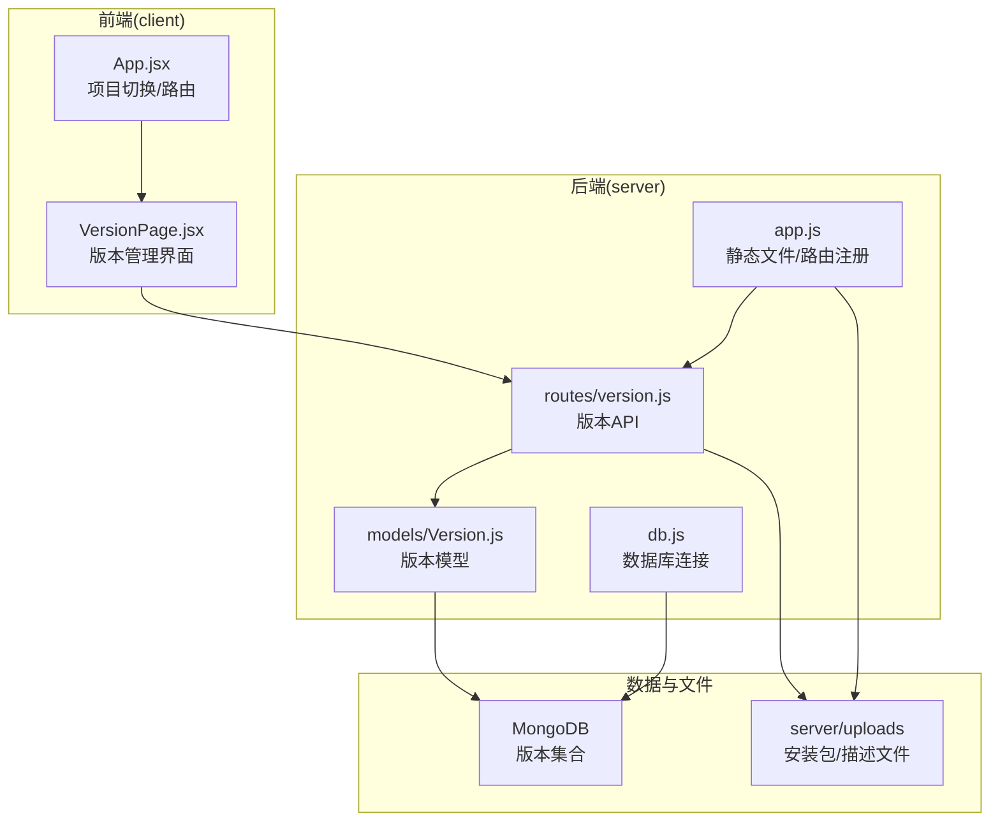
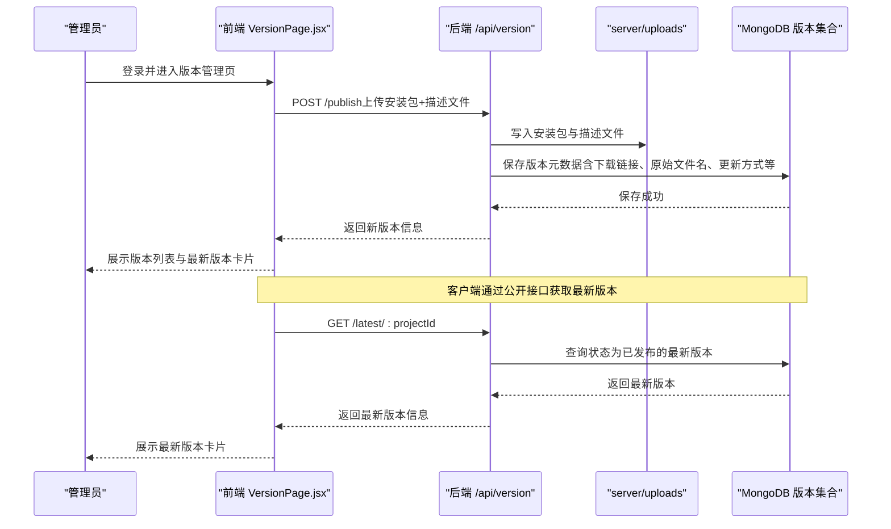
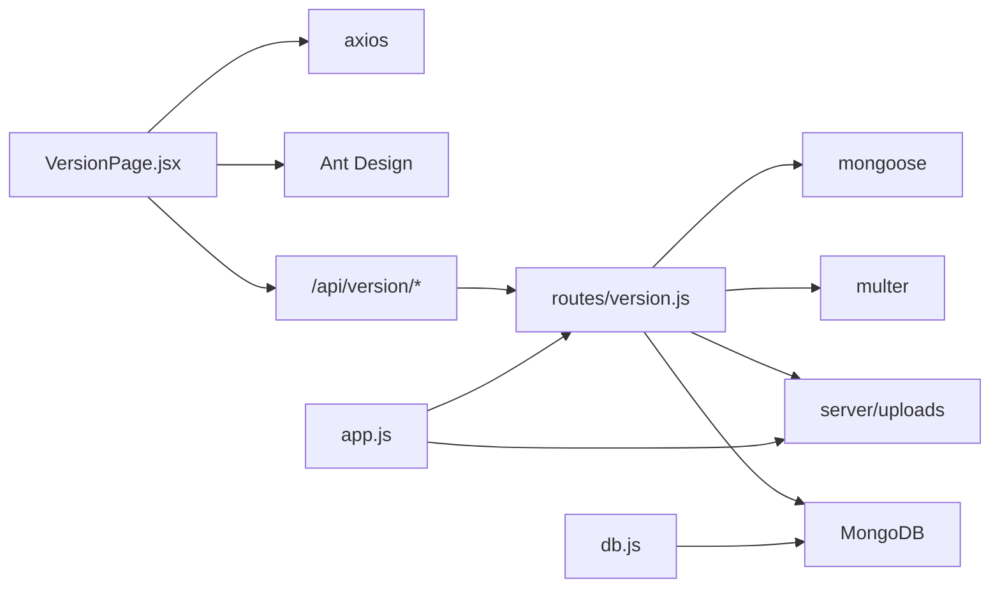

# 版本集合 (versions)

<cite>
**本文引用的文件**
- [db/woax.versions.json](file://db/woax.versions.json)
- [server/models/Version.js](file://server/models/Version.js)
- [server/routes/version.js](file://server/routes/version.js)
- [client/src/pages/VersionPage.jsx](file://client/src/pages/VersionPage.jsx)
- [server/uploads/latest.yml](file://server/uploads/latest.yml)
- [latest-example.yml](file://latest-example.yml)
- [update-type-feature.md](file://update-type-feature.md)
- [fix-chinese-filename.md](file://fix-chinese-filename.md)
- [test-file-name.md](file://test-file-name.md)
- [api-usage-latest-version.md](file://api-usage-latest-version.md)
- [server/app.js](file://server/app.js)
- [server/db.js](file://server/db.js)
- [client/src/App.jsx](file://client/src/App.jsx)
- [README.md](file://README.md)
</cite>

## 更新摘要
**变更内容**
- 新增更新方式字段 (updateType) 支持强制、主动、被动三种更新策略
- 新增描述文件相关字段 (descriptionFileUrl、descriptionFileName) 支持版本描述文件管理
- 改进文件上传处理机制，增强中文文件名支持
- 优化下载处理流程，提供更好的用户体验
- 增强版本管理功能，支持更灵活的版本控制

## 目录
1. [简介](#简介)
2. [项目结构](#项目结构)
3. [核心组件](#核心组件)
4. [架构总览](#架构总览)
5. [详细组件分析](#详细组件分析)
6. [依赖关系分析](#依赖关系分析)
7. [性能考量](#性能考量)
8. [故障排查指南](#故障排查指南)
9. [结论](#结论)
10. [附录](#附录)

## 简介
本文件围绕 WoaX 的"版本集合（versions）"进行系统化技术文档梳理，重点覆盖：
- 版本集合的数据结构与字段含义（版本号、发布日期、下载链接、更新日志、更新方式等）
- 版本管理流程、发布机制与文件上传处理
- 版本集合与用户通知系统的集成（最新版本推送、兼容性检查）
- 版本比较、升级路径与回滚机制
- 版本集合的缓存策略、CDN 集成与下载统计
- 版本集合的安全考虑与文件完整性校验

## 项目结构
WoaX 采用前后端分离架构，版本集合主要涉及以下模块：
- 前端：React + Ant Design，负责版本列表展示、发布新版本、下载、最新版本提示等
- 后端：Koa + MongoDB，负责版本数据模型、API 路由、文件上传与静态资源服务
- 数据：MongoDB 存储版本元数据；本地磁盘存储安装包与描述文件

**图表来源**
- [client/src/pages/VersionPage.jsx](file://client/src/pages/VersionPage.jsx#L1-L890)
- [server/routes/version.js](file://server/routes/version.js#L1-L432)
- [server/models/Version.js](file://server/models/Version.js#L1-L62)
- [server/app.js](file://server/app.js#L1-L61)
- [server/db.js](file://server/db.js#L1-L45)

**章节来源**
- [README.md](file://README.md#L1-L44)
- [client/src/App.jsx](file://client/src/App.jsx#L1-L253)

## 核心组件
- 版本模型（Version.js）：定义版本集合的字段结构，包括版本号、描述、项目关联、时间戳、状态、下载链接、原始文件名、扩展名、文件大小、发布者、更新方式、描述文件链接与名称等。
- 版本路由（version.js）：提供版本列表查询、详情查询、发布新版本（含多文件上传）、设为最新版本、更新状态与更新方式、删除版本等接口。
- 版本页面（VersionPage.jsx）：前端界面，负责展示版本列表、最新版本卡片、上传安装包与描述文件、下载、状态与更新方式编辑、设为最新、删除等。
- 最新版本接口文档（api-usage-latest-version.md）：说明公开接口 /api/version/latest/:projectId 的调用方式与返回格式。
- 描述文件样例（latest-example.yml）：描述文件（latest.yml）的标准字段与示例，用于客户端自动更新检查。
- 更新方式功能说明（update-type-feature.md）：介绍三种更新方式（强制、主动、被动）及其在前端界面与数据库中的体现。
- 中文文件名修复（fix-chinese-filename.md）：解决上传/下载过程中的中文文件名乱码问题。
- 文件名处理测试（test-file-name.md）：说明前端如何传递原始文件名、后端如何保存与前端如何下载。

**章节来源**
- [server/models/Version.js](file://server/models/Version.js#L1-L62)
- [server/routes/version.js](file://server/routes/version.js#L1-L432)
- [client/src/pages/VersionPage.jsx](file://client/src/pages/VersionPage.jsx#L1-L890)
- [api-usage-latest-version.md](file://api-usage-latest-version.md#L1-L227)
- [latest-example.yml](file://latest-example.yml#L1-L38)
- [update-type-feature.md](file://update-type-feature.md#L1-L277)
- [fix-chinese-filename.md](file://fix-chinese-filename.md#L1-L126)
- [test-file-name.md](file://test-file-name.md#L1-L61)

## 架构总览
版本集合的端到端流程如下：
- 管理员通过前端界面发布新版本，上传安装包与可选的描述文件（latest.yml），后端保存元数据并生成下载链接
- 客户端通过公开接口获取最新版本，用于自动更新检查
- 前端展示最新版本卡片与历史版本列表，支持下载与状态管理

**图表来源**
- [server/routes/version.js](file://server/routes/version.js#L147-L256)
- [server/app.js](file://server/app.js#L34-L45)
- [server/models/Version.js](file://server/models/Version.js#L1-L62)

## 详细组件分析

### 版本数据模型与字段说明
**更新** 新增更新方式和描述文件相关字段

- 关键字段
  - versionNumber：版本号（字符串，必填）
  - description：版本描述（字符串，可空）
  - projectId：所属项目（ObjectId，必填，关联 Project）
  - timestamp：发布时间（Date，默认当前时间）
  - status：版本状态（枚举 draft/published/deprecated，默认 draft）
  - downloadUrl：安装包下载地址（字符串，可空）
  - originalFileName：原始文件名（字符串，可空，用于下载时的友好文件名）
  - fileExt：文件扩展名（字符串，可空）
  - fileSize：文件大小（字节，可空）
  - publishedBy：发布者（字符串，可空）
  - updateType：更新方式（枚举 force/active/passive，默认 passive）
  - descriptionFileUrl：描述文件（latest.yml）下载地址（字符串，可空）
  - descriptionFileName：描述文件原始名称（字符串，可空）

- 字段约束与默认值
  - 必填字段：versionNumber、projectId
  - 状态与更新方式使用枚举限定，保证数据一致性
  - 时间戳默认使用当前时间
  - 更新方式默认 passive，向后兼容

**章节来源**
- [server/models/Version.js](file://server/models/Version.js#L1-L62)
- [db/woax.versions.json](file://db/woax.versions.json#L1-L52)

### 版本管理流程与发布机制
**更新** 增强文件上传处理和描述文件支持

- 发布新版本
  - 前端上传安装包与可选描述文件，同时传递版本号、描述、项目ID、发布者、原始文件名、更新方式、是否重命名等参数
  - 后端使用 multer 处理多文件上传，支持中文文件名修复与可选重命名
  - 生成 downloadUrl 与 descriptionFileUrl，保存到数据库
  - 默认状态为 draft，需管理员手动设为 published

- 设为最新版本
  - 后端将同项目下所有已发布版本的状态置为 deprecated，再将目标版本置为 published
  - 保证同一项目仅有一个最新版本

- 更新版本状态与更新方式
  - 支持单独更新 status 或 updateType，或同时更新
  - 前端提供状态与更新方式的可视化编辑

- 删除版本
  - 删除数据库记录的同时，删除服务器上的对应文件

**章节来源**
- [server/routes/version.js](file://server/routes/version.js#L147-L256)
- [server/routes/version.js](file://server/routes/version.js#L258-L296)
- [server/routes/version.js](file://server/routes/version.js#L341-L392)
- [server/routes/version.js](file://server/routes/version.js#L394-L430)
- [client/src/pages/VersionPage.jsx](file://client/src/pages/VersionPage.jsx#L406-L459)
- [client/src/pages/VersionPage.jsx](file://client/src/pages/VersionPage.jsx#L218-L233)
- [client/src/pages/VersionPage.jsx](file://client/src/pages/VersionPage.jsx#L134-L189)

### 文件上传与下载处理
**更新** 改进文件上传处理机制和下载流程

- 文件上传
  - 支持多文件上传：安装包文件与描述文件（latest.yml）
  - 中文文件名修复：后端与前端均提供修复函数，避免乱码
  - 可选重命名：根据 enableRename 控制是否使用时间戳+随机数重命名
  - 保存原始文件名 originalFileName，用于下载时的友好文件名

- 静态文件服务
  - 后端提供 /uploads/* 的静态文件服务，直接读取 server/uploads 目录
  - 自动生成 downloadUrl 与 descriptionFileUrl

- 下载
  - 前端使用 fetch 获取 Blob，再通过 URL.createObjectURL 创建下载链接
  - 优先使用 originalFileName，其次使用 fileName，最后根据版本号与扩展名生成默认文件名
  - 下载完成后清理内存对象 URL

**章节来源**
- [server/routes/version.js](file://server/routes/version.js#L38-L80)
- [server/routes/version.js](file://server/routes/version.js#L147-L256)
- [server/app.js](file://server/app.js#L34-L45)
- [client/src/pages/VersionPage.jsx](file://client/src/pages/VersionPage.jsx#L319-L349)
- [client/src/pages/VersionPage.jsx](file://client/src/pages/VersionPage.jsx#L351-L404)

### 版本集合与用户通知系统的集成
**更新** 增强更新方式支持和描述文件集成

- 最新版本推送
  - 公开接口 /api/version/latest/:projectId 返回状态为 published 的最新版本
  - 前端在版本页面展示"当前最新版本"卡片，包含版本号、发布时间、文件名与下载按钮
  - 客户端可定时轮询该接口进行自动更新检查

- 兼容性检查
  - 描述文件（latest.yml）包含版本号、发布日期、文件信息（url、sha512、size）、发布说明、更新策略等
  - 客户端可根据 updateType 实现不同级别的更新策略（强制/主动/被动）
  - 前端表格与详情页展示描述文件链接，便于管理员与用户查看

**章节来源**
- [api-usage-latest-version.md](file://api-usage-latest-version.md#L1-L227)
- [client/src/pages/VersionPage.jsx](file://client/src/pages/VersionPage.jsx#L96-L120)
- [client/src/pages/VersionPage.jsx](file://client/src/pages/VersionPage.jsx#L490-L509)
- [server/uploads/latest.yml](file://server/uploads/latest.yml#L1-L9)
- [latest-example.yml](file://latest-example.yml#L1-L38)
- [update-type-feature.md](file://update-type-feature.md#L1-L277)

### 版本比较、升级路径与回滚机制
**更新** 增强版本管理功能

- 版本比较
  - 前端表格按 timestamp 降序展示版本列表，便于直观比较发布时间
  - 前端详情页展示版本号与发布时间，支持与当前版本进行对比

- 升级路径
  - 通过"设为最新版本"将目标版本置为 published，其余同项目已发布版本自动置为 deprecated
  - 客户端通过 /api/version/latest/:projectId 获取最新版本，实现自动升级

- 回滚机制
  - 通过"设为最新版本"回滚到之前的已发布版本
  - 若需恢复被弃用版本，可在后台将状态改为 published

**章节来源**
- [server/routes/version.js](file://server/routes/version.js#L258-L296)
- [client/src/pages/VersionPage.jsx](file://client/src/pages/VersionPage.jsx#L218-L233)
- [client/src/pages/VersionPage.jsx](file://client/src/pages/VersionPage.jsx#L642-L649)

### 缓存策略、CDN 集成与下载统计
**更新** 增强缓存和统计功能

- 缓存策略
  - 建议对 /api/version/latest/:projectId 接口进行短期缓存（如 5 分钟），以减少重复查询
  - 前端版本列表可使用分页缓存，避免频繁刷新

- CDN 集成
  - 将 server/uploads 目录托管至 CDN，提升下载性能与稳定性
  - 生成的 downloadUrl 与 descriptionFileUrl 可指向 CDN 地址

- 下载统计
  - 建议在 CDN 层面统计下载次数与流量
  - 后端可增加下载计数字段并在下载时更新（当前模型未包含该字段）

**章节来源**
- [server/app.js](file://server/app.js#L34-L45)
- [server/routes/version.js](file://server/routes/version.js#L180-L223)

### 安全考虑与文件完整性验证
**更新** 增强文件完整性验证

- 文件完整性验证
  - 描述文件（latest.yml）包含 sha512 字段，客户端可据此验证下载文件的完整性
  - 建议在下载完成后进行 sha512 校验，失败则提示用户重试

- 安全建议
  - 限制上传文件类型与大小，防止恶意文件上传
  - 对 /api/version 的写操作（发布、更新、删除）应严格鉴权
  - 对 /uploads/* 的访问控制，避免未授权下载
  - 对描述文件进行白名单校验，确保字段合法

**章节来源**
- [server/uploads/latest.yml](file://server/uploads/latest.yml#L1-L9)
- [latest-example.yml](file://latest-example.yml#L147-L172)
- [server/routes/version.js](file://server/routes/version.js#L147-L256)

## 依赖关系分析
- 组件耦合
  - VersionPage.jsx 依赖 axios 与 Ant Design 组件，调用 /api/version 相关接口
  - version.js 路由依赖 multer 处理文件上传，依赖 mongoose 操作数据库
  - app.js 负责静态文件服务与路由注册，db.js 负责数据库连接

- 外部依赖
  - 前端：React、Ant Design、Axios、Moment
  - 后端：Koa、Mongoose、Multer、CORS、Dotenv
  - 数据库：MongoDB

**图表来源**
- [client/src/pages/VersionPage.jsx](file://client/src/pages/VersionPage.jsx#L1-L890)
- [server/routes/version.js](file://server/routes/version.js#L1-L432)
- [server/app.js](file://server/app.js#L1-L61)
- [server/db.js](file://server/db.js#L1-L45)

**章节来源**
- [client/src/pages/VersionPage.jsx](file://client/src/pages/VersionPage.jsx#L1-L890)
- [server/routes/version.js](file://server/routes/version.js#L1-L432)
- [server/app.js](file://server/app.js#L1-L61)
- [server/db.js](file://server/db.js#L1-L45)

## 性能考量
- 数据库查询
  - 版本列表按 timestamp 降序分页查询，建议在 projectId 与 status 上建立索引
- 文件传输
  - 使用 CDN 加速下载，减少服务器带宽压力
- 前端渲染
  - 版本列表使用虚拟滚动与懒加载，避免大数据量时的卡顿
- 缓存
  - 对 /api/version/latest/:projectId 进行短期缓存，降低数据库压力

## 故障排查指南
**更新** 增强故障排查指南

- 中文文件名乱码
  - 症状：上传或下载时文件名为乱码
  - 处理：后端与前端均已提供文件名修复函数，检查上传参数 originalFileName 是否正确传递
  - 参考：[fix-chinese-filename.md](file://fix-chinese-filename.md#L1-L126)、[test-file-name.md](file://test-file-name.md#L1-L61)

- 无法获取最新版本
  - 症状：调用 /api/version/latest/:projectId 返回 404
  - 处理：确认项目 ID 正确且存在状态为 published 的版本
  - 参考：[api-usage-latest-version.md](file://api-usage-latest-version.md#L33-L47)

- 下载失败
  - 症状：下载链接无效或下载后文件损坏
  - 处理：检查 downloadUrl 是否指向 /uploads/*，确认文件存在于 server/uploads；客户端可进行 sha512 校验
  - 参考：[server/app.js](file://server/app.js#L34-L45)、[server/uploads/latest.yml](file://server/uploads/latest.yml#L1-L9)

- 权限不足
  - 症状：发布、更新、删除版本时报权限错误
  - 处理：确认已登录管理员账户并携带有效令牌
  - 参考：[client/src/App.jsx](file://client/src/App.jsx#L18-L25)

- 更新方式异常
  - 症状：更新方式显示不正确或无法保存
  - 处理：检查前端 Radio.Group 组件绑定的 updateType 字段，确认后端模型包含 updateType 字段
  - 参考：[update-type-feature.md](file://update-type-feature.md#L1-L277)

- 描述文件上传失败
  - 症状：描述文件无法上传或保存
  - 处理：确认文件格式为 .yml 或 .yaml，检查后端 multer 配置的 accept 类型
  - 参考：[client/src/pages/VersionPage.jsx](file://client/src/pages/VersionPage.jsx#L841-L858)

**章节来源**
- [fix-chinese-filename.md](file://fix-chinese-filename.md#L1-L126)
- [test-file-name.md](file://test-file-name.md#L1-L61)
- [api-usage-latest-version.md](file://api-usage-latest-version.md#L33-L47)
- [server/app.js](file://server/app.js#L34-L45)
- [server/uploads/latest.yml](file://server/uploads/latest.yml#L1-L9)
- [client/src/App.jsx](file://client/src/App.jsx#L18-L25)
- [update-type-feature.md](file://update-type-feature.md#L1-L277)

## 结论
WoaX 的版本集合通过清晰的数据模型与完善的 API，实现了版本发布、状态管理、描述文件与安装包的统一管理，并提供了面向客户端的公开接口以支持自动更新检查。前端界面直观易用，后端具备中文文件名修复、多文件上传与静态资源服务能力。为进一步提升系统稳定性与安全性，建议引入 CDN、下载统计、sha512 校验与更严格的权限控制。

## 附录
- 最新版本接口调用示例与返回格式参考：[api-usage-latest-version.md](file://api-usage-latest-version.md#L1-L227)
- 描述文件（latest.yml）标准字段与示例：[latest-example.yml](file://latest-example.yml#L1-L38)
- 更新方式功能说明（强制/主动/被动）：[update-type-feature.md](file://update-type-feature.md#L1-L277)
- 中文文件名修复与测试指南：[fix-chinese-filename.md](file://fix-chinese-filename.md#L1-L126)、[test-file-name.md](file://test-file-name.md#L1-L61)