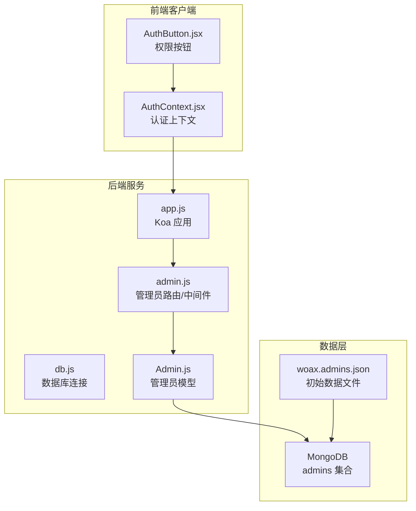
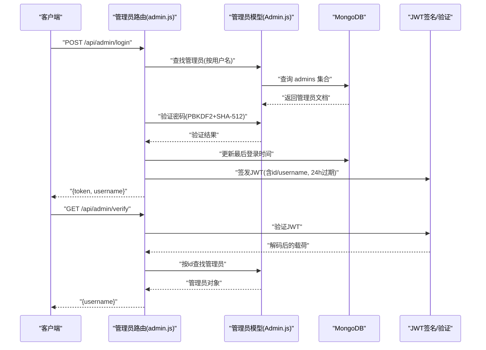
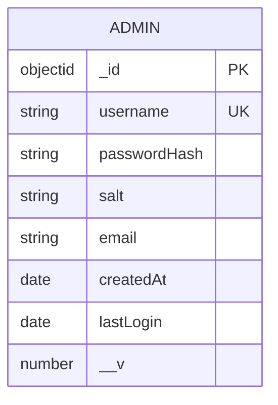
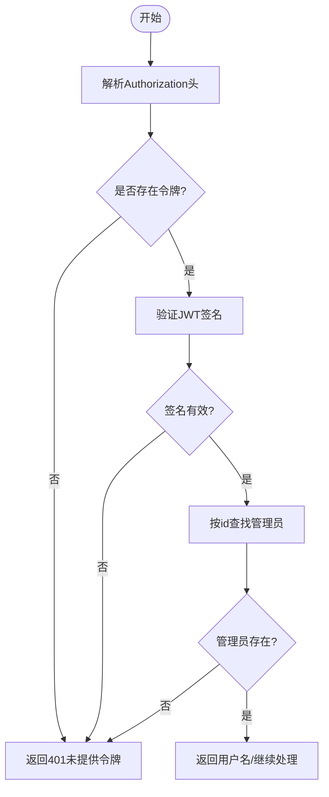
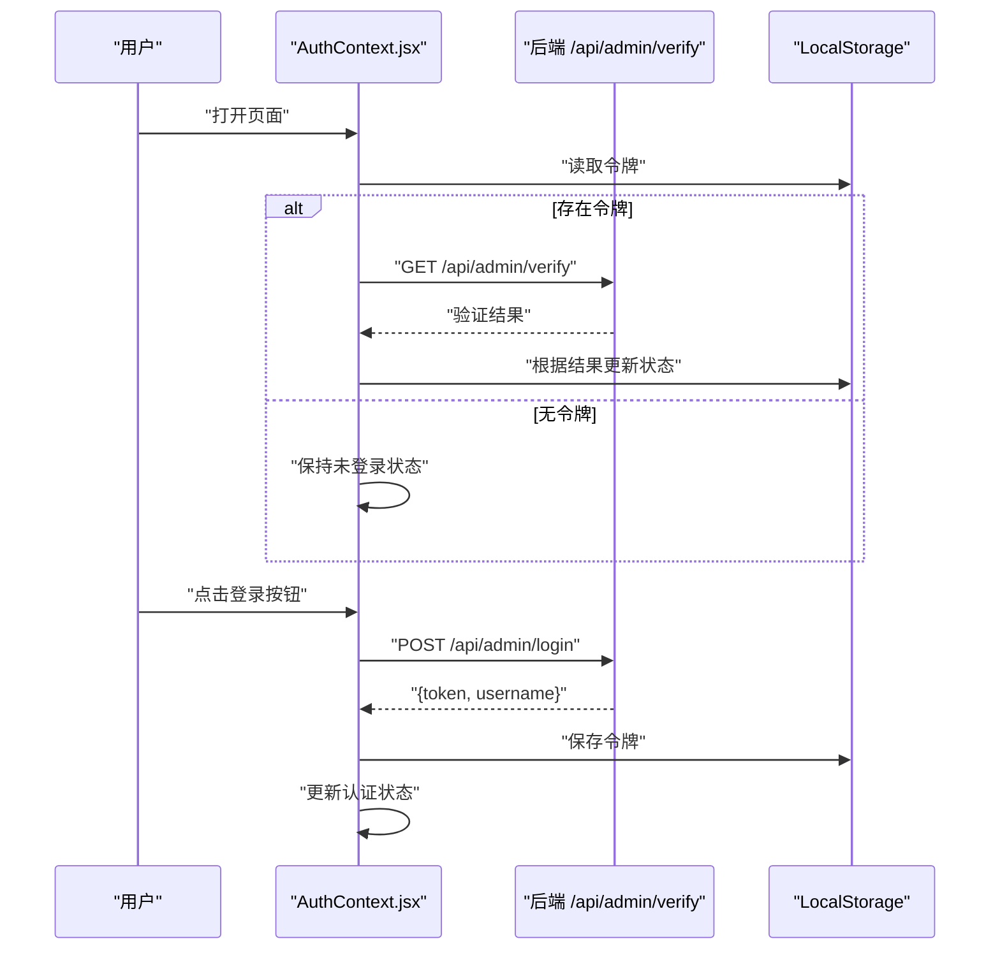
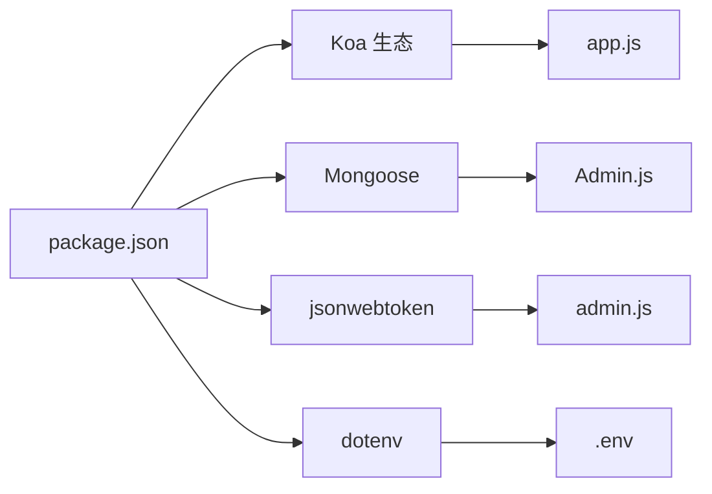

# 管理员集合 (admins)

<cite>
**本文引用的文件**
- [woax.admins.json](file://db/woax.admins.json)
- [Admin.js](file://server/models/Admin.js)
- [admin.js](file://server/routes/admin.js)
- [app.js](file://server/app.js)
- [db.js](file://server/db.js)
- [AuthContext.jsx](file://client/src/context/AuthContext.jsx)
- [AuthButton.jsx](file://client/src/components/AuthButton.jsx)
- [.env](file://server/.env)
- [package.json](file://server/package.json)
</cite>

## 目录
1. [简介](#简介)
2. [项目结构](#项目结构)
3. [核心组件](#核心组件)
4. [架构总览](#架构总览)
5. [详细组件分析](#详细组件分析)
6. [依赖关系分析](#依赖关系分析)
7. [性能考虑](#性能考虑)
8. [故障排查指南](#故障排查指南)
9. [结论](#结论)
10. [附录](#附录)

## 简介
本文件系统性梳理 WoaX 管理员集合（admins）的设计与实现，覆盖以下主题：
- admins 文档结构与字段语义
- 管理员账户创建、权限管理与安全机制
- JWT 令牌生成、验证与刷新流程
- 管理员认证流程、会话管理与安全策略
- 权限控制、审计日志与安全监控现状与建议
- 备份恢复、密码重置与账户锁定机制现状与建议

## 项目结构
WoaX 采用前后端分离架构：
- 前端使用 React + Ant Design，通过上下文与组件实现登录弹窗、令牌校验与受保护操作按钮
- 后端基于 Koa + Mongoose，提供管理员认证接口与中间件，并通过 JSON 文件预置初始管理员数据

图表来源
- [app.js](file://server/app.js#L1-L61)
- [db.js](file://server/db.js#L1-L45)
- [Admin.js](file://server/models/Admin.js#L1-L32)
- [admin.js](file://server/routes/admin.js#L1-L128)
- [woax.admins.json](file://db/woax.admins.json#L1-L15)

章节来源
- [app.js](file://server/app.js#L1-L61)
- [db.js](file://server/db.js#L1-L45)
- [Admin.js](file://server/models/Admin.js#L1-L32)
- [admin.js](file://server/routes/admin.js#L1-L128)
- [woax.admins.json](file://db/woax.admins.json#L1-L15)

## 核心组件
- 管理员模型（Admin）
  - 定义字段：用户名、密码哈希、盐值、邮箱、创建时间、最后登录时间
  - 提供密码设置与验证方法（PBKDF2+SHA-512，随机盐）
- 管理员路由与中间件
  - 登录接口：校验凭据、更新最后登录时间、签发 JWT
  - 验证接口：校验 JWT 并返回用户名
  - 权限中间件：从 JWT 解析管理员身份，注入到请求上下文
- 前端认证上下文
  - 本地存储令牌、自动验证、登录弹窗、受保护按钮
- 数据初始化
  - 应用启动时若不存在默认管理员则创建（用户名、默认密码、随机盐与哈希）

章节来源
- [Admin.js](file://server/models/Admin.js#L1-L32)
- [admin.js](file://server/routes/admin.js#L1-L128)
- [AuthContext.jsx](file://client/src/context/AuthContext.jsx#L1-L155)
- [AuthButton.jsx](file://client/src/components/AuthButton.jsx#L1-L43)
- [woax.admins.json](file://db/woax.admins.json#L1-L15)

## 架构总览
管理员认证的整体流程如下：
- 前端发起登录请求，携带用户名与密码
- 后端查询管理员记录，验证密码（PBKDF2+SHA-512）
- 成功后更新最后登录时间并签发 JWT（有效期 24 小时）
- 前端保存令牌并在后续请求中携带 Authorization: Bearer
- 中间件解析 JWT，校验管理员有效性，注入管理员对象

图表来源
- [admin.js](file://server/routes/admin.js#L27-L98)
- [Admin.js](file://server/models/Admin.js#L17-L30)
- [woax.admins.json](file://db/woax.admins.json#L1-L15)

## 详细组件分析

### 管理员模型与文档结构
- 字段语义
  - _id：MongoDB ObjectId
  - username：唯一标识，必填
  - passwordHash：PBKDF2+SHA-512 哈希值
  - salt：随机盐值，每次设置密码时生成
  - email：可选
  - createdAt：创建时间，默认当前时间
  - lastLogin：最近一次登录时间
  - __v：Mongoose 版本字段
- 安全要点
  - 密码不以明文存储；验证时使用相同盐值与迭代次数重新计算哈希比对
  - 盐值长度足够且随机，降低彩虹表与碰撞攻击风险

图表来源
- [Admin.js](file://server/models/Admin.js#L4-L14)
- [woax.admins.json](file://db/woax.admins.json#L1-L15)

章节来源
- [Admin.js](file://server/models/Admin.js#L1-L32)
- [woax.admins.json](file://db/woax.admins.json#L1-L15)

### 管理员账户创建与初始化
- 应用启动时自动检测是否存在默认管理员（用户名为 admin），如不存在则创建并设置默认密码
- 默认密码在代码中硬编码，建议在生产环境替换为安全的随机初始密码并通过环境变量或安全渠道下发

章节来源
- [admin.js](file://server/routes/admin.js#L8-L24)

### JWT 令牌生成、验证与刷新
- 生成
  - 载荷包含管理员 id 与 username
  - 使用环境变量中的密钥进行签名
  - 有效期为 24 小时
- 验证
  - 从 Authorization 请求头提取 Bearer 令牌
  - 使用相同密钥验证签名并解码载荷
  - 按 id 查询管理员，确保账户仍有效
- 刷新
  - 当前实现未提供刷新接口；建议引入刷新令牌（refresh token）与短期访问令牌（access token）配合的双令牌方案，以提升安全性与用户体验

图表来源
- [admin.js](file://server/routes/admin.js#L69-L98)
- [admin.js](file://server/routes/admin.js#L100-L125)

章节来源
- [admin.js](file://server/routes/admin.js#L48-L61)
- [admin.js](file://server/routes/admin.js#L69-L98)
- [admin.js](file://server/routes/admin.js#L100-L125)

### 前端认证流程与会话管理
- 自动验证
  - 页面加载时读取本地存储的令牌，调用后端验证接口确认有效性
- 登录弹窗
  - 表单收集用户名与密码，提交后保存令牌并更新认证状态
- 受保护按钮
  - 未登录时显示锁定图标并禁用，引导用户登录
- 会话策略
  - 令牌存储于本地存储；建议结合 HttpOnly Cookie 与 SameSite 属性，减少 XSS 与 CSRF 风险

图表来源
- [AuthContext.jsx](file://client/src/context/AuthContext.jsx#L16-L48)
- [AuthContext.jsx](file://client/src/context/AuthContext.jsx#L61-L92)
- [admin.js](file://server/routes/admin.js#L27-L67)

章节来源
- [AuthContext.jsx](file://client/src/context/AuthContext.jsx#L1-L155)
- [AuthButton.jsx](file://client/src/components/AuthButton.jsx#L1-L43)
- [admin.js](file://server/routes/admin.js#L27-L67)

### 权限控制与安全策略
- 当前实现
  - 提供 verifyAdmin 中间件，拦截所有需要管理员权限的路由
  - 在中间件中完成 JWT 验证与管理员有效性校验
- 建议增强
  - 引入细粒度权限模型（角色/资源/动作），在中间件中增加权限判定
  - 对敏感操作增加二次确认或验证码
  - 限制登录尝试次数与速率，防止暴力破解

章节来源
- [admin.js](file://server/routes/admin.js#L100-L125)

### 审计日志与安全监控
- 现状
  - 管理员集合仅记录最后登录时间，未见专门的审计日志表
  - 其他集合（如统计）展示了审计思路（用户名、IP、UA、位置、时间戳等）
- 建议
  - 新建 admins_audit 日志集合，记录登录/登出、关键操作、异常登录（异地/高风险）等事件
  - 结合 IP 地址、User-Agent、地理位置与设备信息进行风险评估
  - 对失败登录与异常操作触发告警

章节来源
- [woax.admins.json](file://db/woax.admins.json#L1-L15)
- [woax.statistics.json](file://db/woax.statistics.json#L1-L1967)

### 备份恢复、密码重置与账户锁定
- 备份恢复
  - 当前未见专用备份脚本；建议使用 MongoDB 备份工具定期导出 admins 集合
  - 恢复时需注意环境变量（JWT 密钥、数据库连接）与部署一致性
- 密码重置
  - 当前未实现密码重置流程；建议引入“重置令牌”机制（带过期时间），通过安全通道发送
- 账户锁定
  - 当前未实现失败尝试计数与锁定；建议在登录中间件中加入失败计数与临时锁定逻辑

章节来源
- [db.js](file://server/db.js#L1-L45)
- [admin.js](file://server/routes/admin.js#L27-L67)

## 依赖关系分析
- 后端依赖
  - Koa、Koa-Router、Koa-BodyParser、CORS
  - Mongoose（ODM）、jsonwebtoken（JWT）、dotenv（环境变量）
- 前端依赖
  - React、Ant Design、Axios（HTTP 客户端）

图表来源
- [package.json](file://server/package.json#L1-L24)
- [app.js](file://server/app.js#L1-L61)
- [Admin.js](file://server/models/Admin.js#L1-L32)
- [admin.js](file://server/routes/admin.js#L1-L128)
- [.env](file://server/.env#L1-L9)

章节来源
- [package.json](file://server/package.json#L1-L24)
- [app.js](file://server/app.js#L1-L61)
- [admin.js](file://server/routes/admin.js#L1-L128)

## 性能考虑
- 密码哈希
  - PBKDF2 迭代次数较高，验证时 CPU 开销较大；建议在生产环境监控登录延迟并根据硬件能力调整参数
- JWT 验证
  - 验证过程轻量，主要瓶颈在数据库查询；可通过索引优化（username、_id）与缓存热点管理员信息
- 数据库连接
  - 使用连接池与统一连接管理；避免频繁重连导致的延迟

## 故障排查指南
- 登录失败
  - 检查用户名是否存在与密码是否正确
  - 确认 JWT 密钥一致（后端环境变量）
- 令牌无效
  - 确认 Authorization 头格式为 Bearer
  - 检查令牌是否过期（默认 24 小时）
- 数据库连接问题
  - 检查 MONGODB_URI 是否可达
  - 查看连接事件监听输出

章节来源
- [admin.js](file://server/routes/admin.js#L27-L67)
- [admin.js](file://server/routes/admin.js#L69-L98)
- [db.js](file://server/db.js#L10-L24)

## 结论
WoaX 的管理员集合实现了基础的安全模型：凭据验证、PBKDF2 哈希、JWT 令牌与中间件权限控制。为进一步提升安全性与可运维性，建议引入：
- 细粒度权限模型与审计日志
- 双令牌（访问/刷新）与更严格的会话策略
- 密码重置与账户锁定机制
- 定期备份与灾难恢复演练

## 附录
- 环境变量
  - JWT_SECRET：用于 JWT 签名与验证
  - MONGODB_URI：数据库连接地址
  - PORT：服务端口
- 初始管理员
  - 应用启动时若不存在默认管理员，将创建并设置默认密码

章节来源
- [.env](file://server/.env#L1-L9)
- [admin.js](file://server/routes/admin.js#L8-L24)
- [woax.admins.json](file://db/woax.admins.json#L1-L15)