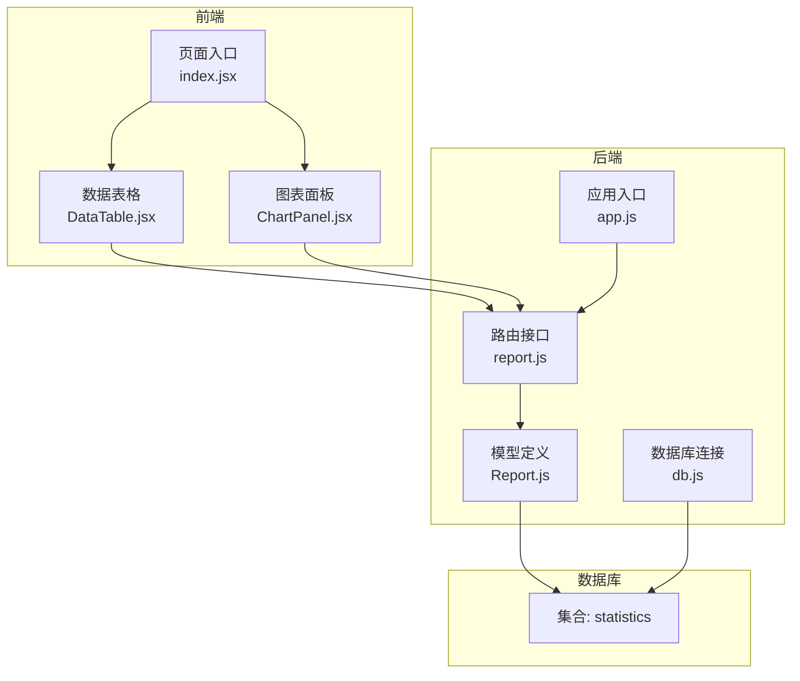
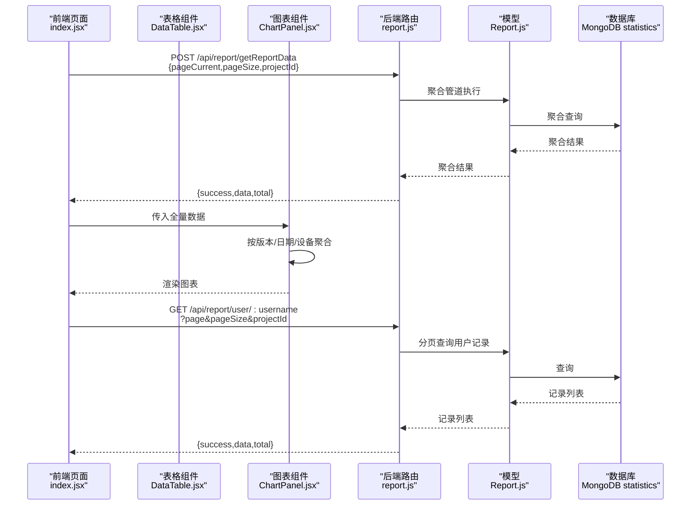
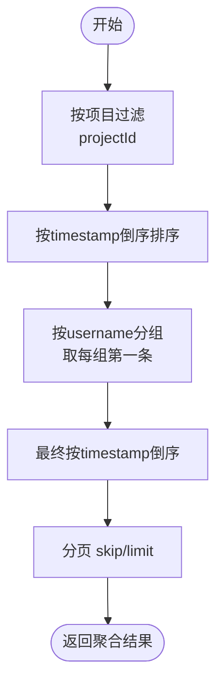
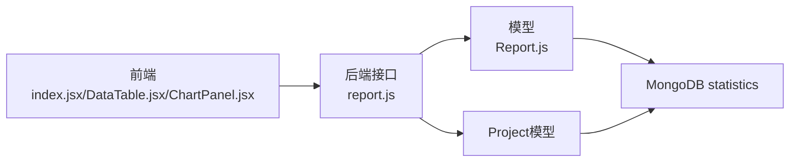

# 统计数据集合 (statistics)

<cite>
**本文引用的文件**
- [woax.statistics.json](file://db/woax.statistics.json)
- [Report.js](file://server/models/Report.js)
- [report.js](file://server/routes/report.js)
- [ChartPanel.jsx](file://client/src/pages/StatisticPage/ChartPanel.jsx)
- [DataTable.jsx](file://client/src/pages/StatisticPage/DataTable.jsx)
- [index.jsx](file://client/src/pages/StatisticPage/index.jsx)
- [db.js](file://server/db.js)
- [app.js](file://server/app.js)
- [Project.js](file://server/models/Project.js)
</cite>

## 目录
1. [简介](#简介)
2. [项目结构](#项目结构)
3. [核心组件](#核心组件)
4. [架构总览](#架构总览)
5. [详细组件分析](#详细组件分析)
6. [依赖关系分析](#依赖关系分析)
7. [性能考量](#性能考量)
8. [故障排查指南](#故障排查指南)
9. [结论](#结论)
10. [附录](#附录)

## 简介
本文件面向WoaX项目的“统计数据集合（statistics）”进行系统化技术文档整理，重点覆盖以下方面：
- statistics集合的文档结构与字段语义（用户行为、时间戳、设备信息、地理位置、附加数据等）
- 数据采集机制、数据格式与存储策略
- 查询模式（按时间范围、按项目、按用户维度）
- 聚合计算、数据分析与可视化支持
- 性能优化、索引设计与大数据量处理策略
- 备份恢复与数据清理方案

## 项目结构
WoaX采用前后端分离架构，前端使用React + Ant Design，后端基于Koa + MongoDB，统计数据集合通过Mongoose模型映射到MongoDB的“statistics”集合。

**图表来源**
- [app.js](file://server/app.js#L1-L61)
- [report.js](file://server/routes/report.js#L1-L271)
- [Report.js](file://server/models/Report.js#L1-L22)
- [db.js](file://server/db.js#L1-L45)

**章节来源**
- [app.js](file://server/app.js#L1-L61)
- [db.js](file://server/db.js#L1-L45)

## 核心组件
- 前端页面组件
  - 页面入口：负责项目切换监听、分页加载、图表全量数据拉取、用户详情弹窗与删除操作。
  - 数据表格：展示每用户的最后一条上报记录，支持分页与查看详情。
  - 图表面板：对版本分布、时间趋势、设备分布进行聚合统计并可视化。
- 后端接口
  - 聚合接口：按项目维度聚合每用户最后一条上报记录，并支持分页。
  - 用户记录接口：按用户名与项目ID查询用户的所有上报记录，支持分页。
  - 上报接口：新增上报记录（含IP、UA、设备信息、位置、版本、备注等）。
  - 删除接口：管理员权限删除指定记录。
- 数据模型
  - Mongoose模型定义了statistics集合的字段约束与集合名映射。

**章节来源**
- [index.jsx](file://client/src/pages/StatisticPage/index.jsx#L1-L262)
- [DataTable.jsx](file://client/src/pages/StatisticPage/DataTable.jsx#L1-L124)
- [ChartPanel.jsx](file://client/src/pages/StatisticPage/ChartPanel.jsx#L1-L129)
- [report.js](file://server/routes/report.js#L1-L271)
- [Report.js](file://server/models/Report.js#L1-L22)

## 架构总览
下图展示了从客户端到数据库的完整调用链路与数据流向。

**图表来源**
- [index.jsx](file://client/src/pages/StatisticPage/index.jsx#L58-L109)
- [ChartPanel.jsx](file://client/src/pages/StatisticPage/ChartPanel.jsx#L10-L51)
- [report.js](file://server/routes/report.js#L9-L88)
- [report.js](file://server/routes/report.js#L91-L131)
- [Report.js](file://server/models/Report.js#L1-L22)

## 详细组件分析

### 数据集合结构与字段语义
statistics集合的文档结构包含以下关键字段：
- 基础字段
  - username：字符串，必填，标识上报用户。
  - ip：字符串，上报时的客户端IP。
  - timestamp：日期类型，默认当前时间，表示上报发生的时间点。
  - version：字符串，版本号。
  - remark：字符串，备注说明。
  - deviceInfo：字符串，设备信息（如“平台 - 浏览器”）。
  - projectId：对象ID，关联到项目集合，用于多项目隔离。
- 可选扩展字段
  - userAgent：字符串，浏览器User-Agent。
  - location：字符串，地理位置（城市）。
  - additionalData：嵌套对象，可包含feature、status、duration、timestamp等。
- 元数据
  - createdAt/updatedAt：文档创建与更新时间。
  - _id：MongoDB ObjectId。

示例文档片段路径参考：
- [woax.statistics.json](file://db/woax.statistics.json#L1-L3254)

字段设计体现了用户行为追踪的典型要素：身份、设备、时间、版本、地点与行为上下文（additionalData），便于后续的多维分析与可视化。

**章节来源**
- [woax.statistics.json](file://db/woax.statistics.json#L1-L3254)
- [Report.js](file://server/models/Report.js#L1-L22)

### 数据采集机制与存储策略
- 前端上报流程
  - 自主上报：管理员通过弹窗提交，后端写入statistics集合。
  - 用户行为上报：前端在页面中调用新增接口，携带username、ip、userAgent、deviceInfo、location、version、remark、projectId等。
- 存储策略
  - 单条记录即一次上报行为，不强制去重；通过聚合接口按用户维度取最新记录，避免重复展示。
  - 项目维度隔离：所有查询均以projectId过滤，确保不同项目数据互不干扰。

接口与调用路径参考：
- 新增上报接口：[report.js](file://server/routes/report.js#L134-L176)
- 自主上报接口：[report.js](file://server/routes/report.js#L232-L268)
- 前端调用示例：[index.jsx](file://client/src/pages/StatisticPage/index.jsx#L180-L196)

**章节来源**
- [report.js](file://server/routes/report.js#L134-L176)
- [report.js](file://server/routes/report.js#L232-L268)
- [index.jsx](file://client/src/pages/StatisticPage/index.jsx#L180-L196)

### 查询模式与聚合计算
- 按项目维度的“每用户最后一条记录”聚合
  - 聚合步骤：按username分组，取各组第一条（按timestamp倒序后取first），再整体按timestamp倒序，配合分页skip/limit。
  - 接口：POST /api/report/getReportData
  - 参考：[report.js](file://server/routes/report.js#L9-L88)
- 按用户维度的“全部记录”分页查询
  - 查询条件：username + projectId
  - 排序：timestamp倒序
  - 分页：skip/limit
  - 接口：GET /api/report/user/:username
  - 参考：[report.js](file://server/routes/report.js#L91-L131)
- 时间趋势分析
  - 前端按日期字符串聚合，生成折线图数据。
  - 参考：[ChartPanel.jsx](file://client/src/pages/StatisticPage/ChartPanel.jsx#L20-L43)
- 设备分布分析
  - 前端按设备前缀聚合，生成饼图数据。
  - 参考：[ChartPanel.jsx](file://client/src/pages/StatisticPage/ChartPanel.jsx#L27-L48)

**图表来源**
- [report.js](file://server/routes/report.js#L26-L51)

**章节来源**
- [report.js](file://server/routes/report.js#L9-L88)
- [report.js](file://server/routes/report.js#L91-L131)
- [ChartPanel.jsx](file://client/src/pages/StatisticPage/ChartPanel.jsx#L10-L51)

### 可视化支持
- 版本分布柱状图：按version统计数量。
- 时间趋势折线图：按日期统计数量，按日期升序排列。
- 设备分布饼图：按设备前缀统计占比。
- 前端渲染：使用Recharts组件，数据来源于全量聚合接口返回的allReports。

参考：
- [ChartPanel.jsx](file://client/src/pages/StatisticPage/ChartPanel.jsx#L1-L129)
- [index.jsx](file://client/src/pages/StatisticPage/index.jsx#L88-L109)

**章节来源**
- [ChartPanel.jsx](file://client/src/pages/StatisticPage/ChartPanel.jsx#L1-L129)
- [index.jsx](file://client/src/pages/StatisticPage/index.jsx#L88-L109)

### 数据模型与集合映射
- Mongoose模型定义了statistics集合的字段约束与集合名映射。
- 关联关系：projectId引用Project模型，确保项目维度隔离。

参考：
- [Report.js](file://server/models/Report.js#L1-L22)
- [Project.js](file://server/models/Project.js#L1-L21)

**章节来源**
- [Report.js](file://server/models/Report.js#L1-L22)
- [Project.js](file://server/models/Project.js#L1-L21)

## 依赖关系分析
- 前端依赖
  - axios：HTTP请求封装，调用后端接口。
  - antd：UI组件库，表格、按钮、卡片等。
  - recharts：图表库，用于版本分布、时间趋势、设备分布可视化。
- 后端依赖
  - koa-router：路由管理。
  - mongoose：ODM，连接MongoDB并执行聚合与查询。
  - dotenv：读取环境变量（如数据库URI）。
- 数据库依赖
  - statistics集合：承载用户行为上报数据。
  - Project集合：项目元数据，用于多项目隔离。

**图表来源**
- [index.jsx](file://client/src/pages/StatisticPage/index.jsx#L1-L262)
- [report.js](file://server/routes/report.js#L1-L271)
- [Report.js](file://server/models/Report.js#L1-L22)
- [Project.js](file://server/models/Project.js#L1-L21)

**章节来源**
- [report.js](file://server/routes/report.js#L1-L271)
- [Report.js](file://server/models/Report.js#L1-L22)
- [Project.js](file://server/models/Project.js#L1-L21)

## 性能考量
- 聚合查询优化
  - 在聚合阶段先按timestamp倒序，再分组取first，减少后续排序成本。
  - 分页使用skip/limit，建议结合索引优化。
- 索引设计建议
  - 常用查询字段建立复合索引：
    - (projectId, username, timestamp)：支持按项目+用户+时间的高效查询与分页。
    - (projectId, timestamp)：支持按项目+时间的快速筛选。
  - 说明：当前代码未显式声明索引，可在模型中添加索引定义或通过迁移脚本创建。
- 大数据量处理
  - 前端图表使用一次性拉取全量数据（pageSize较大），适合中小规模数据；大规模场景建议后端分页或按时间窗口切片。
  - 对additionalData中的嵌套字段（如feature/status/duration）若需频繁查询，可考虑在聚合阶段提取到顶层字段，降低查询复杂度。
- 缓存策略
  - 对热门报表（如“每用户最后一条记录”）可引入Redis缓存，设置合理过期时间，降低数据库压力。
- 并发与限流
  - 对新增上报接口增加限流策略，防止恶意刷写。

[本节为通用性能建议，不直接分析具体文件，故无“章节来源”标注]

## 故障排查指南
- 数据库连接问题
  - 检查环境变量与连接字符串是否正确，确认MongoDB服务可用。
  - 参考：[db.js](file://server/db.js#L10-L24)
- 接口返回错误
  - 缺少projectId参数：接口会返回400并提示消息。
  - 聚合异常：检查聚合管道语法与字段是否存在。
  - 参考：[report.js](file://server/routes/report.js#L13-L20)，[report.js](file://server/routes/report.js#L80-L87)
- 权限相关
  - 删除与自主上报接口需要管理员权限，若无权限会返回错误。
  - 参考：[report.js](file://server/routes/report.js#L205-L229)，[report.js](file://server/routes/report.js#L232-L268)
- 前端加载异常
  - 若图表或表格为空，检查全量数据拉取与分页参数传递是否正确。
  - 参考：[index.jsx](file://client/src/pages/StatisticPage/index.jsx#L88-L109)，[index.jsx](file://client/src/pages/StatisticPage/index.jsx#L164-L171)

**章节来源**
- [db.js](file://server/db.js#L10-L24)
- [report.js](file://server/routes/report.js#L13-L20)
- [report.js](file://server/routes/report.js#L80-L87)
- [report.js](file://server/routes/report.js#L205-L229)
- [report.js](file://server/routes/report.js#L232-L268)
- [index.jsx](file://client/src/pages/StatisticPage/index.jsx#L88-L109)
- [index.jsx](file://client/src/pages/StatisticPage/index.jsx#L164-L171)

## 结论
statistics集合为WoaX提供了完整的用户行为数据采集与分析基础。通过项目维度隔离、聚合查询与前端可视化，能够快速洞察版本分布、时间趋势与设备分布。建议在现有基础上进一步完善索引、缓存与限流策略，以支撑更大规模的数据增长与更复杂的分析需求。

[本节为总结性内容，不直接分析具体文件，故无“章节来源”标注]

## 附录

### 字段定义与示例
- 字段清单与类型
  - username: 字符串（必填）
  - ip: 字符串
  - timestamp: 日期（默认当前时间）
  - version: 字符串
  - remark: 字符串
  - deviceInfo: 字符串
  - projectId: 对象ID（关联Project）
  - userAgent: 字符串（可选）
  - location: 字符串（可选）
  - additionalData: 嵌套对象（可选）
  - createdAt/updatedAt: 日期
- 示例文档片段路径参考：
  - [woax.statistics.json](file://db/woax.statistics.json#L1-L3254)

**章节来源**
- [woax.statistics.json](file://db/woax.statistics.json#L1-L3254)
- [Report.js](file://server/models/Report.js#L1-L22)

### API定义概览
- 获取每用户最后一条记录（分页）
  - 方法：POST
  - 路径：/api/report/getReportData
  - 请求体：{ pageCurrent, pageSize, projectId }
  - 返回：{ success, data[], total }
  - 参考：[report.js](file://server/routes/report.js#L9-L88)
- 获取用户全部记录（分页）
  - 方法：GET
  - 路径：/api/report/user/:username
  - 查询参数：{ page, pageSize, projectId }
  - 返回：{ success, data[], total, page, pageSize }
  - 参考：[report.js](file://server/routes/report.js#L91-L131)
- 新增上报记录
  - 方法：POST
  - 路径：/api/report/addReport
  - 请求体：{ username, ip, userAgent, deviceInfo, location, version, remark, projectId }
  - 返回：{ success, message, data }
  - 参考：[report.js](file://server/routes/report.js#L134-L176)
- 自主上报（管理员）
  - 方法：POST
  - 路径：/api/report/submit
  - 请求体：{ username, projectId, ... }
  - 返回：{ success, message, data }
  - 参考：[report.js](file://server/routes/report.js#L232-L268)
- 删除记录（管理员）
  - 方法：DELETE
  - 路径：/api/report/:id
  - 返回：{ success, message }
  - 参考：[report.js](file://server/routes/report.js#L205-L229)

**章节来源**
- [report.js](file://server/routes/report.js#L9-L88)
- [report.js](file://server/routes/report.js#L91-L131)
- [report.js](file://server/routes/report.js#L134-L176)
- [report.js](file://server/routes/report.js#L232-L268)
- [report.js](file://server/routes/report.js#L205-L229)

### 备份与恢复方案
- 备份
  - 使用MongoDB官方工具mongodump导出statistics集合：
    - 命令示例：mongodump --db woax --collection statistics --out ./backup
  - 或通过程序化方式读取集合并序列化为JSON文件（参考现有woax.statistics.json格式）。
- 恢复
  - 使用mongorestore从备份目录恢复：
    - 命令示例：mongorestore --db woax --collection statistics ./backup/woax/statistics.bson
  - 或通过程序化方式批量插入文档。
- 数据清理
  - 按时间范围清理：在聚合查询中加入时间过滤条件，然后批量删除。
  - 按项目清理：先按projectId过滤，再批量删除。
  - 注意：删除操作需管理员权限，谨慎执行。

[本节为通用运维建议，不直接分析具体文件，故无“章节来源”标注]