# 集合结构说明

<cite>
**本文档引用的文件**
- [woax.projects.json](file://db/woax.projects.json)
- [woax.statistics.json](file://db/woax.statistics.json)
- [woax.feedbacks.json](file://db/woax.feedbacks.json)
- [woax.versions.json](file://db/woax.versions.json)
- [woax.admins.json](file://db/woax.admins.json)
- [Project.js](file://server/models/Project.js)
- [Report.js](file://server/models/Report.js)
- [Feedback.js](file://server/models/Feedback.js)
- [Version.js](file://server/models/Version.js)
- [Admin.js](file://server/models/Admin.js)
- [project.js](file://server/routes/project.js)
- [feedback.js](file://server/routes/feedback.js)
- [version.js](file://server/routes/version.js)
- [db.js](file://server/db.js)
- [app.js](file://server/app.js)
- [.env](file://server/.env)
</cite>

## 目录
1. [简介](#简介)
2. [项目结构](#项目结构)
3. [核心组件](#核心组件)
4. [架构概览](#架构概览)
5. [详细组件分析](#详细组件分析)
6. [依赖关系分析](#依赖关系分析)
7. [性能考虑](#性能考虑)
8. [故障排除指南](#故障排除指南)
9. [结论](#结论)

## 简介

WoaX是一个基于MongoDB的数据库系统，主要用于管理项目版本发布、用户反馈和统计信息。该系统包含五个核心集合：projects（项目）、statistics（统计数据）、feedbacks（反馈）、versions（版本）和admins（管理员）。每个集合都有明确的数据结构和业务逻辑，通过Mongoose ORM进行数据持久化。

## 项目结构

系统采用分层架构设计，主要分为以下层次：

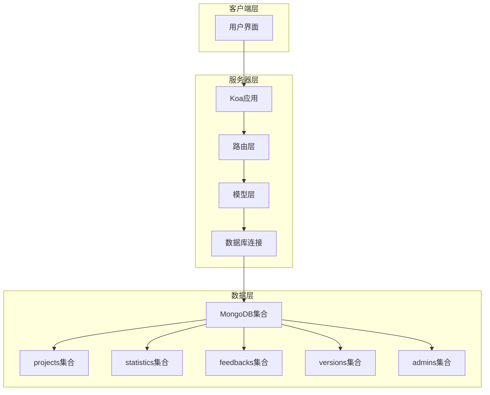

**图表来源**
- [app.js](file://server/app.js#L1-L61)
- [db.js](file://server/db.js#L1-L45)

**章节来源**
- [app.js](file://server/app.js#L1-L61)
- [db.js](file://server/db.js#L1-L45)

## 核心组件

### 数据库连接配置

系统使用Mongoose作为ODM，通过统一的连接管理模块处理数据库连接：

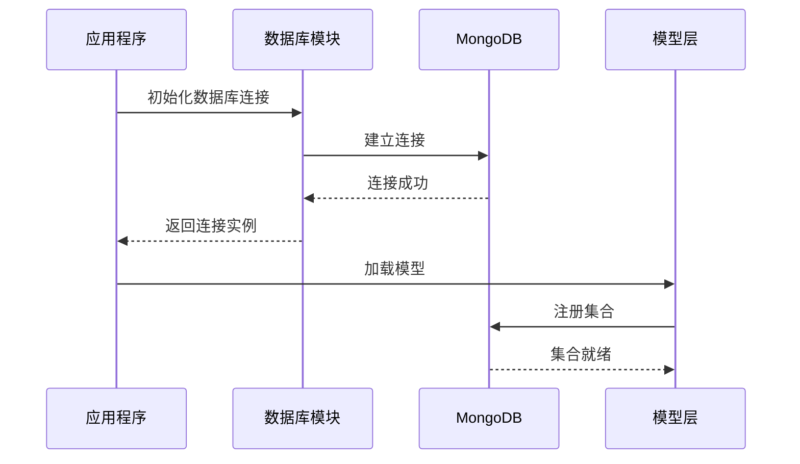

**图表来源**
- [db.js](file://server/db.js#L10-L24)
- [app.js](file://server/app.js#L21-L22)

### 环境配置

数据库连接通过环境变量进行配置，支持灵活的部署场景：

| 配置项 | 默认值 | 说明 |
|--------|--------|------|
| PORT | 3001 | 服务器监听端口 |
| MONGODB_URI | mongodb://localhost:27017/woax | MongoDB连接字符串 |
| UPLOAD_DIR | uploads | 文件上传目录 |
| MAX_FILE_SIZE | 10485760 | 最大文件大小(字节) |

**章节来源**
- [.env](file://server/.env#L1-L9)

## 架构概览

系统采用RESTful API架构，通过Koa框架提供HTTP服务。每个集合对应独立的路由模块，实现完整的CRUD操作。

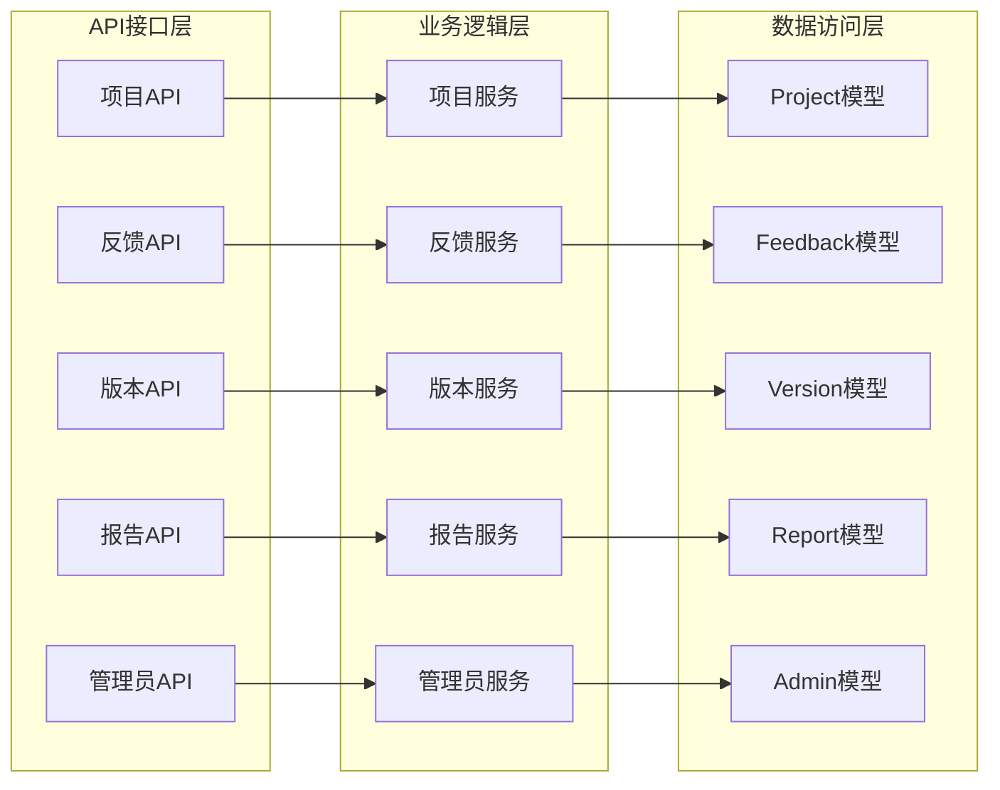

**图表来源**
- [project.js](file://server/routes/project.js#L1-L226)
- [feedback.js](file://server/routes/feedback.js#L1-L187)
- [version.js](file://server/routes/version.js#L1-L432)

## 详细组件分析

### Projects项目集合

Projects集合用于存储项目基本信息，是整个系统的核心实体。

#### 文档结构

| 字段名 | 类型 | 必填 | 唯一 | 默认值 | 说明 |
|--------|------|------|------|--------|------|
| name | String | 是 | 是 | 无 | 项目名称，唯一标识 |
| description | String | 否 | 否 | 空字符串 | 项目描述 |
| createdAt | Date | 否 | 否 | 当前时间 | 创建时间 |
| updatedAt | Date | 否 | 否 | 当前时间 | 更新时间 |

#### 数据模型定义

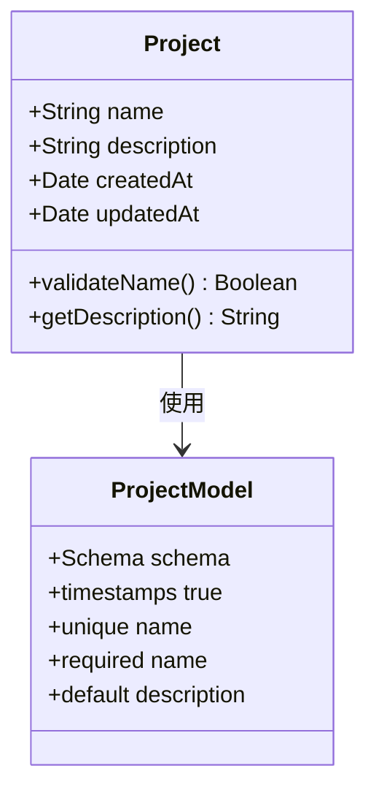

**图表来源**
- [Project.js](file://server/models/Project.js#L3-L19)

#### 查询模式

项目集合支持多种查询模式：

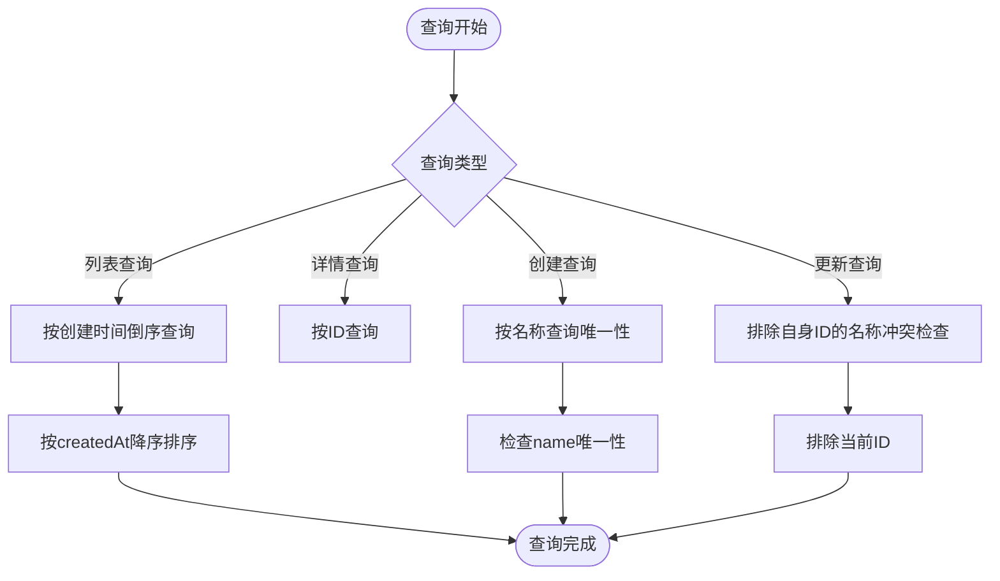

**图表来源**
- [project.js](file://server/routes/project.js#L10-L14)
- [project.js](file://server/routes/project.js#L58-L67)
- [project.js](file://server/routes/project.js#L100-L114)

**章节来源**
- [Project.js](file://server/models/Project.js#L1-L21)
- [project.js](file://server/routes/project.js#L1-L226)
- [woax.projects.json](file://db/woax.projects.json#L1-L28)

### Statistics统计数据集合

Statistics集合用于收集用户行为统计数据，包含详细的用户交互信息。

#### 文档结构

| 字段名 | 类型 | 必填 | 唯一 | 默认值 | 说明 |
|--------|------|------|------|--------|------|
| username | String | 是 | 否 | 无 | 用户名 |
| ip | String | 否 | 否 | 无 | 用户IP地址 |
| timestamp | Date | 否 | 否 | 当前时间 | 事件发生时间 |
| userAgent | String | 否 | 否 | 无 | 用户代理字符串 |
| deviceInfo | String | 否 | 否 | 无 | 设备信息 |
| location | String | 否 | 否 | 无 | 用户位置 |
| version | String | 否 | 否 | 无 | 应用版本 |
| remark | String | 否 | 否 | 无 | 备注信息 |
| additionalData | Object | 否 | 否 | 空对象 | 扩展数据 |
| projectId | ObjectId | 是 | 否 | 无 | 关联项目ID |
| createdAt | Date | 否 | 否 | 当前时间 | 创建时间 |
| updatedAt | Date | 否 | 否 | 当前时间 | 更新时间 |

#### 扩展数据结构

additionalData字段包含具体的用户行为数据：

| 子字段 | 类型 | 必填 | 说明 |
|--------|------|------|------|
| feature | String | 是 | 功能名称 |
| status | String | 是 | 任务状态 |
| duration | Number | 是 | 持续时间(毫秒) |
| timestamp | Date | 是 | 任务开始时间 |

#### 数据模型定义

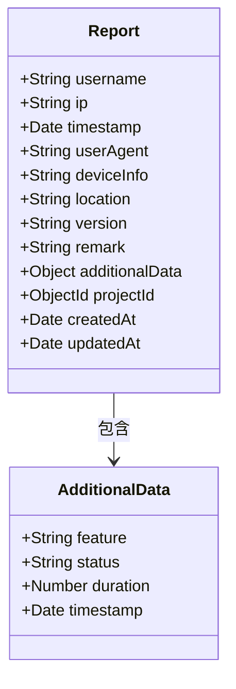

**图表来源**
- [Report.js](file://server/models/Report.js#L3-L19)

#### 查询模式

统计数据集合支持基于时间范围和项目ID的复杂查询：

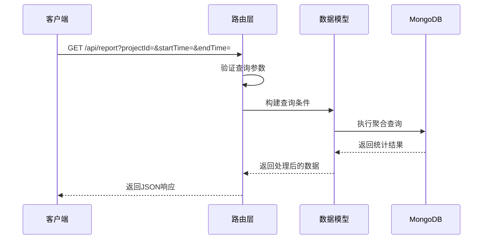

**图表来源**
- [Report.js](file://server/models/Report.js#L3-L19)

**章节来源**
- [Report.js](file://server/models/Report.js#L1-L22)
- [woax.statistics.json](file://db/woax.statistics.json#L1-L3254)

### Feedbacks反馈集合

Feedbacks集合用于管理用户反馈和回复历史。

#### 文档结构

| 字段名 | 类型 | 必填 | 唯一 | 默认值 | 说明 |
|--------|------|------|------|--------|------|
| username | String | 是 | 否 | 无 | 用户名 |
| content | String | 是 | 否 | 无 | 反馈内容 |
| email | String | 否 | 否 | 空字符串 | 用户邮箱 |
| timestamp | Date | 否 | 否 | 当前时间 | 反馈时间 |
| ip | String | 否 | 否 | 无 | 用户IP地址 |
| status | String | 否 | 否 | pending | 状态(pending/reviewed/resolved) |
| replyInput | String | 否 | 否 | 空字符串 | 回复内容 |
| replyHistory | Array | 否 | 否 | 空数组 | 回复历史记录 |
| projectId | ObjectId | 是 | 否 | 无 | 关联项目ID |
| createdAt | Date | 否 | 否 | 当前时间 | 创建时间 |
| updatedAt | Date | 否 | 否 | 当前时间 | 更新时间 |

#### 回复历史结构

replyHistory数组中的每条记录包含：

| 子字段 | 类型 | 必填 | 默认值 | 说明 |
|--------|------|------|--------|------|
| content | String | 是 | 无 | 回复内容 |
| time | Date | 否 | 当前时间 | 回复时间 |
| admin | String | 否 | "管理员" | 管理员名称 |

#### 数据模型定义

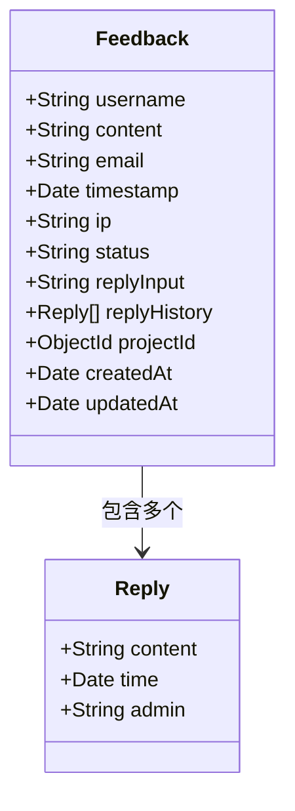

**图表来源**
- [Feedback.js](file://server/models/Feedback.js#L3-L49)

#### 管理员权限控制

反馈管理操作需要管理员权限验证：

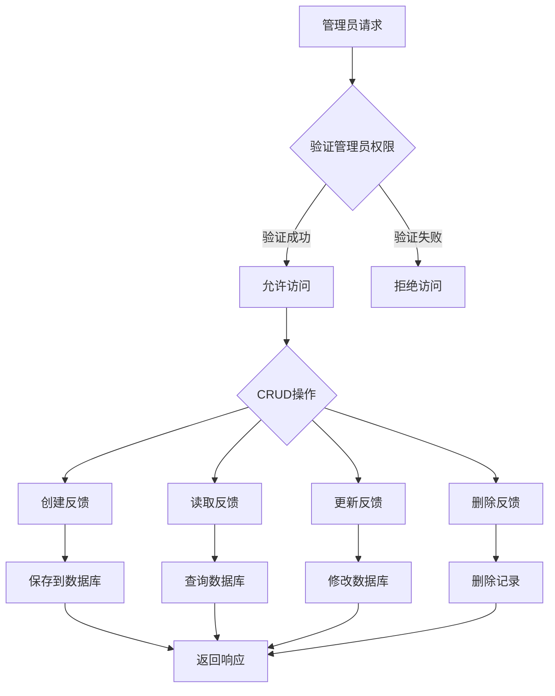

**图表来源**
- [feedback.js](file://server/routes/feedback.js#L72-L111)
- [feedback.js](file://server/routes/feedback.js#L114-L158)
- [feedback.js](file://server/routes/feedback.js#L161-L184)

**章节来源**
- [Feedback.js](file://server/models/Feedback.js#L1-L52)
- [feedback.js](file://server/routes/feedback.js#L1-L187)
- [woax.feedbacks.json](file://db/woax.feedbacks.json#L1-L185)

### Versions版本集合

Versions集合用于管理软件版本发布和更新信息。

#### 文档结构

| 字段名 | 类型 | 必填 | 唯一 | 默认值 | 说明 |
|--------|------|------|------|--------|------|
| versionNumber | String | 是 | 否 | 无 | 版本号 |
| description | String | 否 | 否 | 空字符串 | 版本描述 |
| projectId | ObjectId | 是 | 否 | 无 | 关联项目ID |
| timestamp | Date | 否 | 否 | 当前时间 | 发布时间 |
| status | String | 否 | 否 | draft | 状态(draft/published/deprecated) |
| downloadUrl | String | 否 | 否 | 无 | 下载链接 |
| originalFileName | String | 否 | 否 | 无 | 原始文件名 |
| fileExt | String | 否 | 否 | 无 | 文件扩展名 |
| fileSize | Number | 否 | 否 | 无 | 文件大小(字节) |
| publishedBy | String | 否 | 否 | "Admin" | 发布者 |
| updateType | String | 否 | 否 | passive | 更新类型(force/active/passive) |
| descriptionFileUrl | String | 否 | 否 | 无 | 描述文件URL |
| descriptionFileName | String | 否 | 否 | 无 | 描述文件名 |
| createdAt | Date | 否 | 否 | 当前时间 | 创建时间 |
| updatedAt | Date | 否 | 否 | 当前时间 | 更新时间 |

#### 文件上传处理

系统支持多文件上传，包括安装包和描述文件：

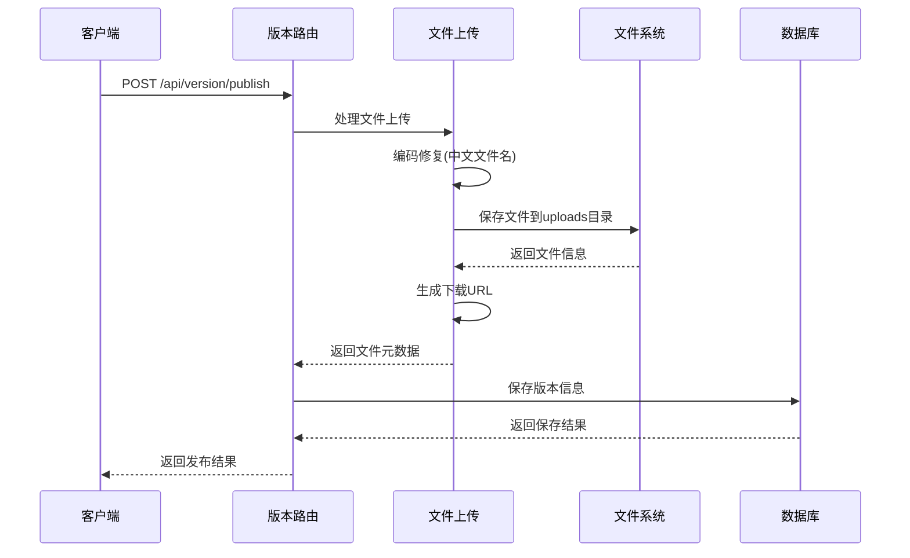

**图表来源**
- [version.js](file://server/routes/version.js#L147-L256)

#### 版本状态管理

版本状态转换遵循严格的业务规则：

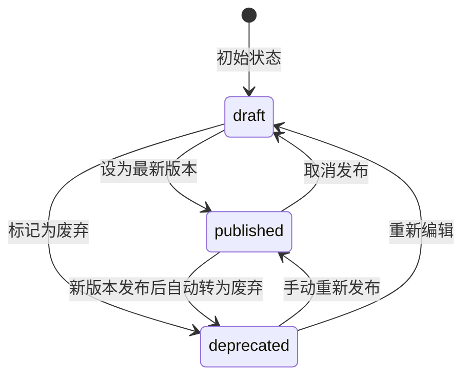

**图表来源**
- [version.js](file://server/routes/version.js#L259-L296)

**章节来源**
- [Version.js](file://server/models/Version.js#L1-L62)
- [version.js](file://server/routes/version.js#L1-L432)
- [woax.versions.json](file://db/woax.versions.json#L1-L52)

### Admins管理员集合

Admins集合用于存储管理员账户信息，包含密码安全机制。

#### 文档结构

| 字段名 | 类型 | 必填 | 唯一 | 默认值 | 说明 |
|--------|------|------|------|--------|------|
| username | String | 是 | 是 | 无 | 用户名 |
| passwordHash | String | 是 | 否 | 无 | 密码哈希值 |
| salt | String | 是 | 否 | 无 | 盐值 |
| email | String | 否 | 否 | 无 | 邮箱地址 |
| createdAt | Date | 否 | 否 | 当前时间 | 创建时间 |
| lastLogin | Date | 否 | 否 | 无 | 最后登录时间 |

#### 密码安全机制

系统采用PBKDF2算法进行密码加密：

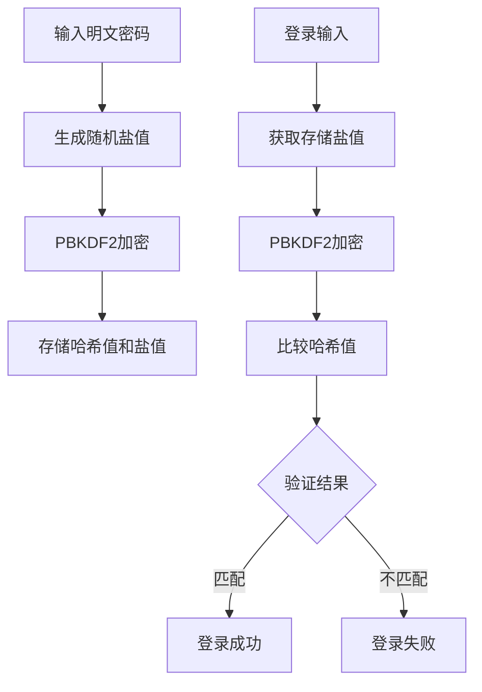

**图表来源**
- [Admin.js](file://server/models/Admin.js#L17-L30)

**章节来源**
- [Admin.js](file://server/models/Admin.js#L1-L32)
- [woax.admins.json](file://db/woax.admins.json#L1-L15)

## 依赖关系分析

系统各组件之间的依赖关系如下：

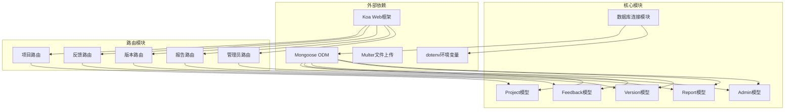

**图表来源**
- [app.js](file://server/app.js#L1-L61)
- [db.js](file://server/db.js#L1-L45)

**章节来源**
- [app.js](file://server/app.js#L1-L61)
- [db.js](file://server/db.js#L1-L45)

## 性能考虑

### 索引设计建议

基于现有的查询模式，建议为以下字段建立索引：

| 集合名称 | 索引字段 | 索引类型 | 用途 |
|----------|----------|----------|------|
| projects | name | 唯一索引 | 唯一性约束和快速查找 |
| statistics | projectId | 普通索引 | 按项目查询 |
| statistics | timestamp | 索引 | 时间范围查询 |
| feedbacks | projectId | 普通索引 | 按项目查询 |
| feedbacks | status | 普通索引 | 按状态查询 |
| versions | projectId | 普通索引 | 按项目查询 |
| versions | status | 普通索引 | 按状态查询 |
| admins | username | 唯一索引 | 登录验证 |

### 查询优化策略

1. **分页查询优化**
   - 使用`skip()`和`limit()`进行分页
   - 对频繁查询的字段建立索引

2. **聚合查询优化**
   - 使用`$lookup`进行关联查询时注意性能
   - 避免在聚合管道中进行复杂的字符串操作

3. **缓存策略**
   - 对热点数据建立内存缓存
   - 使用Redis等缓存解决方案

### 存储优化

1. **文档结构优化**
   - 合理使用嵌套对象和数组
   - 避免过深的嵌套结构

2. **文件存储优化**
   - 大文件使用外部存储服务
   - 实施文件压缩和去重策略

3. **数据清理策略**
   - 定期清理过期数据
   - 实施数据归档机制

## 故障排除指南

### 常见问题及解决方案

#### 数据库连接问题

**症状**: 应用启动时报数据库连接失败

**排查步骤**:
1. 检查MONGODB_URI配置是否正确
2. 验证MongoDB服务是否正常运行
3. 确认网络连接和防火墙设置

**解决方案**:
```javascript
// 在连接失败时添加重试机制
const connectDB = async () => {
  for (let i = 0; i < 5; i++) {
    try {
      return await mongoose.connect(connectionString);
    } catch (error) {
      console.log(`连接尝试 ${i + 1} 失败`);
      await new Promise(resolve => setTimeout(resolve, 1000));
    }
  }
  throw new Error('数据库连接失败');
};
```

#### 数据一致性问题

**症状**: 数据更新后查询结果不一致

**排查步骤**:
1. 检查事务处理是否正确
2. 验证并发访问控制
3. 确认数据验证逻辑

**解决方案**:
```javascript
// 使用事务确保数据一致性
const session = await mongoose.startSession();
try {
  await session.withTransaction(async () => {
    await Project.findByIdAndUpdate(projectId, updateData);
    await Statistics.updateMany({ projectId }, { projectId });
  });
} finally {
  await session.endSession();
}
```

#### 性能问题诊断

**症状**: 查询响应时间过长

**排查工具**:
1. 使用MongoDB Profiler监控慢查询
2. 分析查询执行计划
3. 检查索引使用情况

**优化建议**:
```javascript
// 添加适当的索引
db.statistics.createIndex({ "projectId": 1, "timestamp": -1 })
db.feedbacks.createIndex({ "projectId": 1, "status": 1 })
db.versions.createIndex({ "projectId": 1, "status": 1 })
```

**章节来源**
- [db.js](file://server/db.js#L10-L24)

## 结论

WoaX数据库系统通过清晰的集合结构和完善的业务逻辑，为项目管理和版本发布提供了完整的解决方案。系统采用模块化的架构设计，具有良好的可扩展性和维护性。

### 主要优势

1. **清晰的数据模型**: 每个集合都有明确的职责和结构
2. **完善的权限控制**: 管理员权限验证确保数据安全
3. **灵活的查询支持**: 支持多种查询模式和分页功能
4. **文件上传处理**: 完善的文件管理机制

### 改进建议

1. **索引优化**: 为高频查询字段建立合适的索引
2. **缓存机制**: 实施多级缓存提升查询性能
3. **监控告警**: 添加数据库性能监控和告警机制
4. **备份策略**: 实施定期数据备份和恢复机制

该系统为后续的功能扩展和性能优化奠定了良好的基础，能够满足不断增长的业务需求。