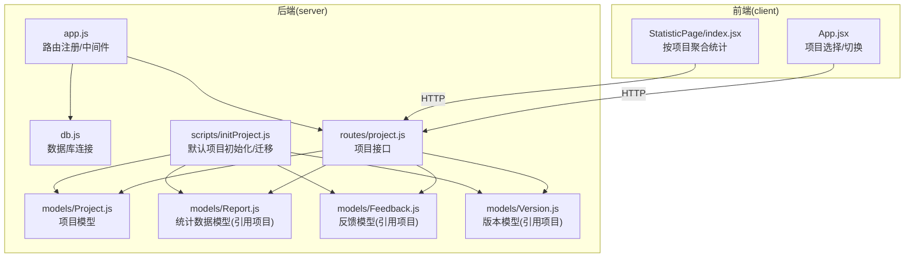
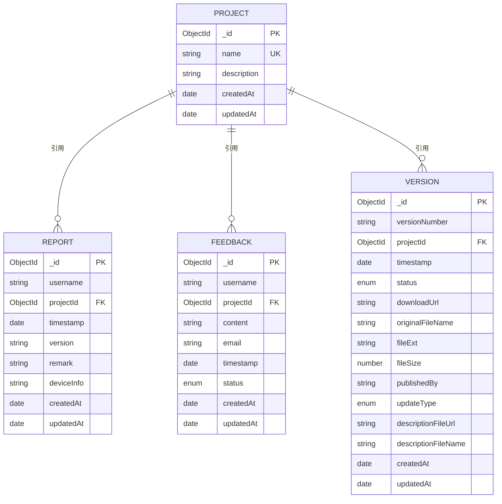
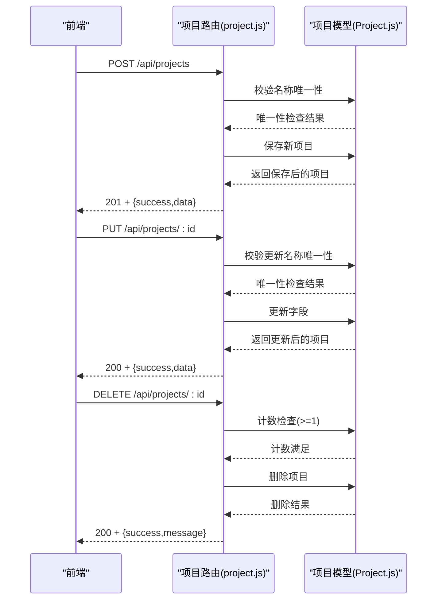
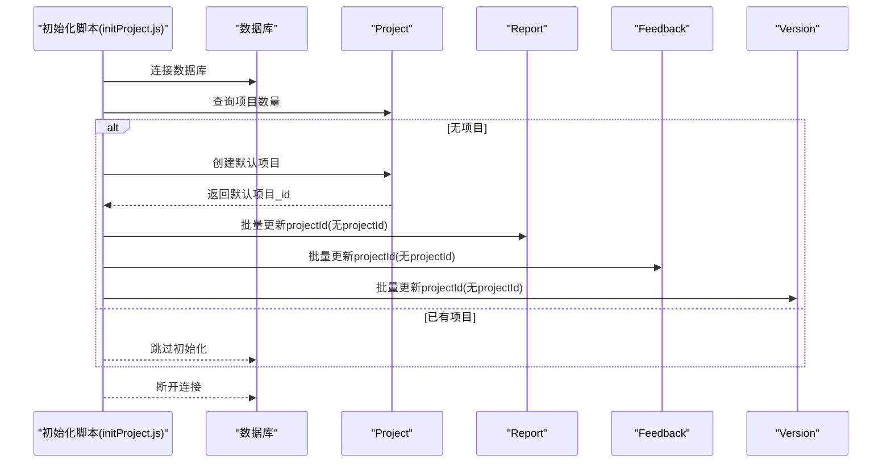
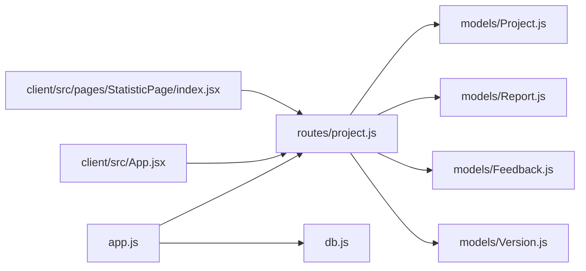

# 项目集合 (projects)

<cite>
**本文引用的文件**
- [db/woax.projects.json](file://db/woax.projects.json)
- [server/models/Project.js](file://server/models/Project.js)
- [server/routes/project.js](file://server/routes/project.js)
- [server/models/Report.js](file://server/models/Report.js)
- [server/models/Feedback.js](file://server/models/Feedback.js)
- [server/models/Version.js](file://server/models/Version.js)
- [server/scripts/initProject.js](file://server/scripts/initProject.js)
- [server/db.js](file://server/db.js)
- [server/app.js](file://server/app.js)
- [client/src/App.jsx](file://client/src/App.jsx)
- [client/src/pages/StatisticPage/index.jsx](file://client/src/pages/StatisticPage/index.jsx)
- [README.md](file://README.md)
</cite>

## 目录
1. [简介](#简介)
2. [项目结构](#项目结构)
3. [核心组件](#核心组件)
4. [架构总览](#架构总览)
5. [详细组件分析](#详细组件分析)
6. [依赖关系分析](#依赖关系分析)
7. [性能考虑](#性能考虑)
8. [故障排查指南](#故障排查指南)
9. [结论](#结论)
10. [附录](#附录)

## 简介
本文件围绕 WoaX 项目的“项目集合（projects）”进行系统化文档化，目标包括：
- 深入解析项目集合的文档结构与字段语义（如 _id、name、description、createdAt、updatedAt）
- 解释项目集合在多项目管理中的作用与边界
- 说明项目文档的创建、更新、删除与迁移流程
- 阐述项目集合与统计数据集合（statistics）及其它集合的关系
- 提供查询模式、索引设计建议与性能优化策略
- 给出扩展方案与数据迁移注意事项

## 项目结构
WoaX 采用前后端分离架构，项目集合位于后端 MongoDB 数据库中，并通过 Koa 路由暴露 REST 接口；前端 React 应用负责项目选择与切换，并在统计页面按项目维度聚合数据。

图示来源
- [server/app.js](file://server/app.js#L1-L61)
- [server/db.js](file://server/db.js#L1-L45)
- [server/routes/project.js](file://server/routes/project.js#L1-L226)
- [server/models/Project.js](file://server/models/Project.js#L1-L21)
- [server/models/Report.js](file://server/models/Report.js#L1-L22)
- [server/models/Feedback.js](file://server/models/Feedback.js#L1-L52)
- [server/models/Version.js](file://server/models/Version.js#L1-L62)
- [server/scripts/initProject.js](file://server/scripts/initProject.js#L1-L61)
- [client/src/App.jsx](file://client/src/App.jsx#L76-L156)
- [client/src/pages/StatisticPage/index.jsx](file://client/src/pages/StatisticPage/index.jsx#L1-L262)

章节来源
- [README.md](file://README.md#L1-L44)
- [server/app.js](file://server/app.js#L1-L61)
- [server/db.js](file://server/db.js#L1-L45)

## 核心组件
- 项目模型（Project）：定义项目文档的字段类型、约束与时间戳自动维护
- 项目路由（project.js）：提供项目 CRUD 与迁移能力
- 数据统计模型（Report）：通过 projectId 引用项目，实现按项目维度的数据聚合
- 反馈模型（Feedback）：同样通过 projectId 引用项目
- 版本模型（Version）：通过 projectId 引用项目
- 默认项目初始化脚本（initProject.js）：在无项目时创建默认项目并迁移历史数据
- 前端项目选择（App.jsx）：负责项目列表获取、当前项目持久化与切换
- 统计页面（StatisticPage/index.jsx）：按当前项目过滤统计数据

章节来源
- [server/models/Project.js](file://server/models/Project.js#L1-L21)
- [server/routes/project.js](file://server/routes/project.js#L1-L226)
- [server/models/Report.js](file://server/models/Report.js#L1-L22)
- [server/models/Feedback.js](file://server/models/Feedback.js#L1-L52)
- [server/models/Version.js](file://server/models/Version.js#L1-L62)
- [server/scripts/initProject.js](file://server/scripts/initProject.js#L1-L61)
- [client/src/App.jsx](file://client/src/App.jsx#L76-L156)
- [client/src/pages/StatisticPage/index.jsx](file://client/src/pages/StatisticPage/index.jsx#L1-L262)

## 架构总览
项目集合在系统中的定位：
- 作为“项目域”的根实体，承载项目元信息（名称、描述、时间戳）
- 通过外键（projectId）被统计数据、反馈、版本等集合引用，形成“按项目隔离”的数据空间
- 前端通过项目选择实现“多项目管理”，每个项目独立展示统计与反馈

图示来源
- [server/models/Project.js](file://server/models/Project.js#L1-L21)
- [server/models/Report.js](file://server/models/Report.js#L1-L22)
- [server/models/Feedback.js](file://server/models/Feedback.js#L1-L52)
- [server/models/Version.js](file://server/models/Version.js#L1-L62)

## 详细组件分析

### 项目集合文档结构与字段语义
- _id：MongoDB ObjectId 主键，唯一标识项目
- name：字符串，必填且唯一，用于项目标识与展示
- description：字符串，可选，默认空字符串
- createdAt：自动维护，项目创建时间
- updatedAt：自动维护，项目更新时间
- __v：Mongoose 内部版本字段

上述字段在数据库样例与模型定义中均有体现。

章节来源
- [db/woax.projects.json](file://db/woax.projects.json#L1-L28)
- [server/models/Project.js](file://server/models/Project.js#L3-L19)

### 项目集合在多项目管理中的作用
- 项目是“数据隔离”的最小单位：统计数据、反馈、版本均通过 projectId 与项目关联
- 前端提供项目下拉选择，切换当前项目后，统计页面按当前项目过滤数据
- 系统不允许删除最后一个项目，确保始终有项目可用

章节来源
- [client/src/App.jsx](file://client/src/App.jsx#L76-L156)
- [client/src/pages/StatisticPage/index.jsx](file://client/src/pages/StatisticPage/index.jsx#L33-L55)
- [server/routes/project.js](file://server/routes/project.js#L154-L163)

### 项目文档的创建、更新与删除流程
- 创建项目
  - 校验名称唯一性（trim 后去重）
  - 保存新项目，返回成功响应
- 更新项目
  - 若更新 name，需再次校验唯一性（排除自身 _id）
  - 仅更新传入字段（name/description），返回最新文档
- 删除项目
  - 限制：系统必须保留至少一个项目
  - 成功删除后返回成功消息

图示来源
- [server/routes/project.js](file://server/routes/project.js#L53-L187)
- [server/models/Project.js](file://server/models/Project.js#L1-L21)

章节来源
- [server/routes/project.js](file://server/routes/project.js#L53-L187)

### 项目集合与其他集合的关系
- 与统计数据集合（statistics）的关系
  - Report 模型通过 projectId 引用 Project，实现按项目维度的数据聚合与过滤
  - 统计页面在请求数据时携带 projectId，从而实现“按项目查看”
- 与反馈集合（Feedback）的关系
  - Feedback 模型同样通过 projectId 引用 Project，保证反馈数据按项目隔离
- 与版本集合（Version）的关系
  - Version 模型通过 projectId 引用 Project，版本发布与项目绑定
- 与默认项目初始化脚本的关系
  - 当数据库中不存在任何项目时，脚本会创建默认项目，并将 Report/Feedback/Version 中未设置 projectId 的历史数据迁移至该默认项目

图示来源
- [server/scripts/initProject.js](file://server/scripts/initProject.js#L8-L61)
- [server/models/Project.js](file://server/models/Project.js#L1-L21)
- [server/models/Report.js](file://server/models/Report.js#L1-L22)
- [server/models/Feedback.js](file://server/models/Feedback.js#L1-L52)
- [server/models/Version.js](file://server/models/Version.js#L1-L62)

章节来源
- [server/models/Report.js](file://server/models/Report.js#L11-L15)
- [server/models/Feedback.js](file://server/models/Feedback.js#L42-L46)
- [server/models/Version.js](file://server/models/Version.js#L13-L17)
- [server/scripts/initProject.js](file://server/scripts/initProject.js#L8-L61)

### 查询模式与索引设计建议
- 查询模式
  - 列表查询：按 createdAt 降序排序，便于查看最新项目
  - 单项查询：按 _id 查询
  - 唯一性约束：name 字段唯一，用于避免重复项目
- 索引设计建议
  - 在 name 上建立唯一索引（已由模型定义唯一约束）
  - createdAt 上建立升/降序索引，优化排序与分页
  - 如需频繁按 name 精确匹配或模糊匹配，可考虑复合索引或文本索引（视业务而定）

章节来源
- [server/routes/project.js](file://server/routes/project.js#L10-L12)
- [server/models/Project.js](file://server/models/Project.js#L4-L19)

### 性能优化策略
- 分页与排序
  - 列表查询按 createdAt 降序，结合分页参数，避免一次性加载过多项目
- 唯一性检查
  - 创建/更新时对 name 进行唯一性校验，减少后续查询歧义
- 批量迁移
  - 初始化脚本使用 Promise.all 并发更新多个集合的 projectId，缩短迁移耗时
- 时间戳字段
  - 使用 timestamps 选项自动维护 createdAt/updatedAt，减少手动写入成本

章节来源
- [server/routes/project.js](file://server/routes/project.js#L10-L12)
- [server/scripts/initProject.js](file://server/scripts/initProject.js#L34-L38)
- [server/models/Project.js](file://server/models/Project.js#L19)

### 扩展方案与数据迁移注意事项
- 扩展方案
  - 项目标签/分类：可在 Project 模型中增加 tags 或 category 字段，便于筛选
  - 项目状态：增加 status 字段（如 active/inactive），用于逻辑删除或禁用
  - 项目配额：引入 quota 字段限制项目内资源上限（如最大统计条目数）
- 数据迁移注意事项
  - 迁移前备份数据库
  - 使用事务或批量操作（Promise.all）提升迁移效率
  - 迁移后验证数据完整性（如 projectId 是否正确填充）
  - 对于历史数据，建议先在测试环境验证迁移脚本

章节来源
- [server/scripts/initProject.js](file://server/scripts/initProject.js#L34-L38)

## 依赖关系分析
- 项目路由依赖项目模型与其它集合模型（Report/Feedback/Version）用于迁移
- 前端应用依赖项目路由获取项目列表并持久化当前项目
- 统计页面依赖项目 ID 过滤统计数据
- 数据库连接由 db.js 统一管理，app.js 注册路由并启动服务

图示来源
- [server/app.js](file://server/app.js#L1-L61)
- [server/db.js](file://server/db.js#L1-L45)
- [server/routes/project.js](file://server/routes/project.js#L1-L226)
- [server/models/Project.js](file://server/models/Project.js#L1-L21)
- [server/models/Report.js](file://server/models/Report.js#L1-L22)
- [server/models/Feedback.js](file://server/models/Feedback.js#L1-L52)
- [server/models/Version.js](file://server/models/Version.js#L1-L62)
- [client/src/App.jsx](file://client/src/App.jsx#L76-L156)
- [client/src/pages/StatisticPage/index.jsx](file://client/src/pages/StatisticPage/index.jsx#L58-L97)

章节来源
- [server/app.js](file://server/app.js#L1-L61)
- [server/db.js](file://server/db.js#L1-L45)
- [server/routes/project.js](file://server/routes/project.js#L1-L226)

## 性能考虑
- 查询性能
  - 为 name 建唯一索引，避免重复插入
  - 为 createdAt 建索引，优化排序与分页
- 写入性能
  - 批量迁移使用并发更新，减少迁移时间
- 前端体验
  - 列表分页与懒加载，避免一次性渲染大量项目
  - 当前项目持久化到本地存储，减少重复请求

章节来源
- [server/models/Project.js](file://server/models/Project.js#L4-L19)
- [server/routes/project.js](file://server/routes/project.js#L10-L12)
- [server/scripts/initProject.js](file://server/scripts/initProject.js#L34-L38)
- [client/src/App.jsx](file://client/src/App.jsx#L88-L98)

## 故障排查指南
- 无法获取项目列表
  - 检查数据库连接是否正常（db.js）
  - 检查路由是否正确注册（app.js）
- 创建项目失败
  - 检查 name 是否唯一
  - 检查请求体格式与必填字段
- 更新项目失败
  - 检查 name 是否与其他项目冲突（排除自身 _id）
- 删除项目失败
  - 确认系统至少保留一个项目
- 数据迁移失败
  - 检查 Report/Feedback/Version 中是否存在未设置 projectId 的历史数据
  - 确认默认项目已创建

章节来源
- [server/db.js](file://server/db.js#L10-L24)
- [server/app.js](file://server/app.js#L48-L55)
- [server/routes/project.js](file://server/routes/project.js#L58-L67)
- [server/routes/project.js](file://server/routes/project.js#L100-L114)
- [server/routes/project.js](file://server/routes/project.js#L154-L163)
- [server/scripts/initProject.js](file://server/scripts/initProject.js#L34-L38)

## 结论
项目集合（projects）是 WoaX 多项目管理的核心实体，通过唯一名称与时间戳字段实现清晰的项目标识与生命周期管理。配合外键（projectId）与统计数据、反馈、版本集合的关联，实现了“按项目隔离”的数据空间。系统提供了完善的 CRUD 与迁移能力，并在前端实现了项目选择与切换，使用户能够灵活地在不同项目之间切换并查看各自的统计数据。建议在生产环境中进一步完善索引与监控，确保查询与写入性能稳定。

## 附录
- 默认管理员账号：用户名 admin，密码 admin123
- 技术栈：前端 React、后端 Koa.js、数据库 MongoDB

章节来源
- [README.md](file://README.md#L43-L44)