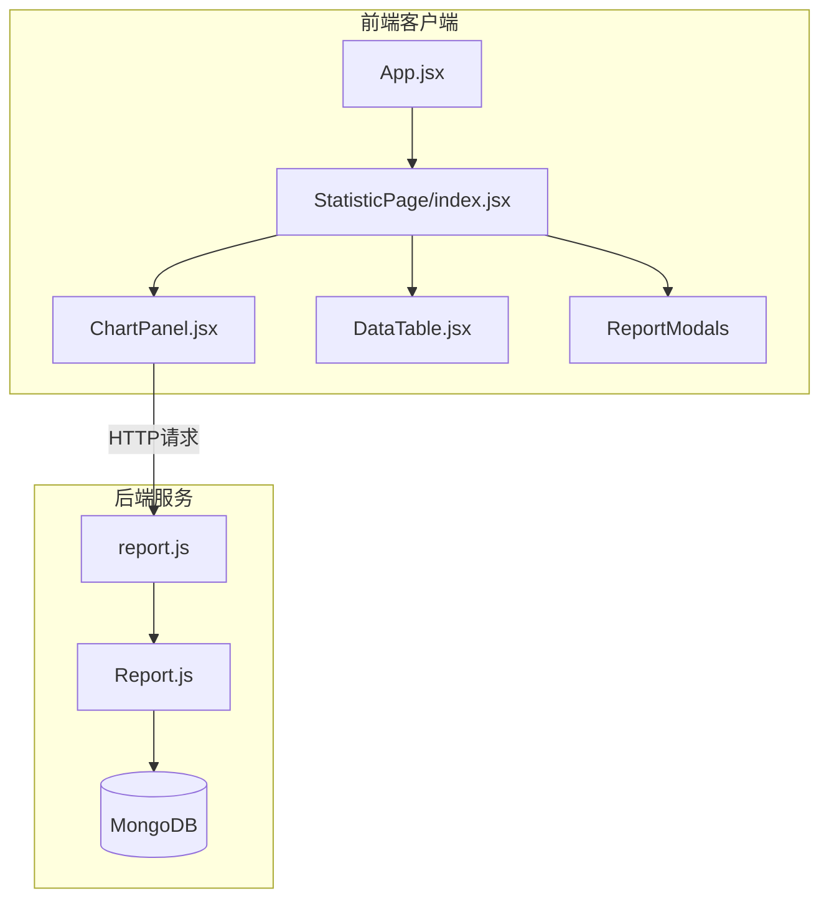
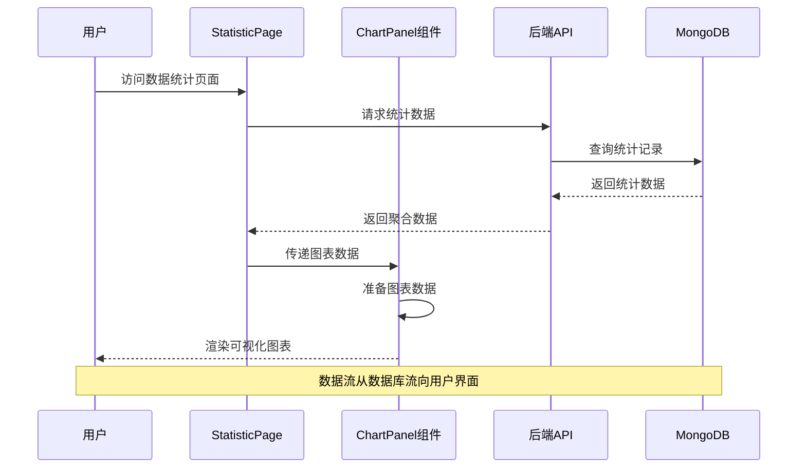
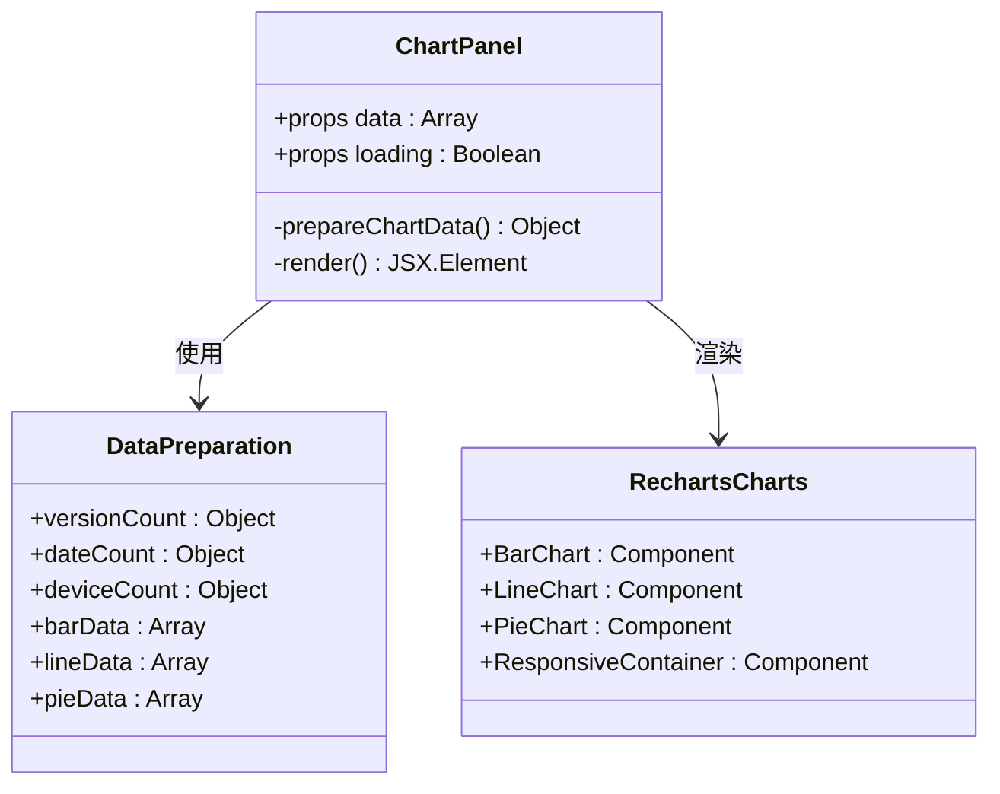
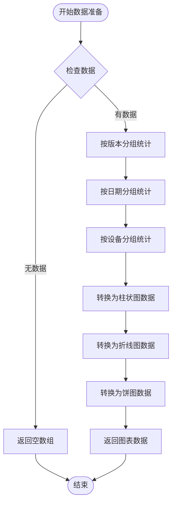
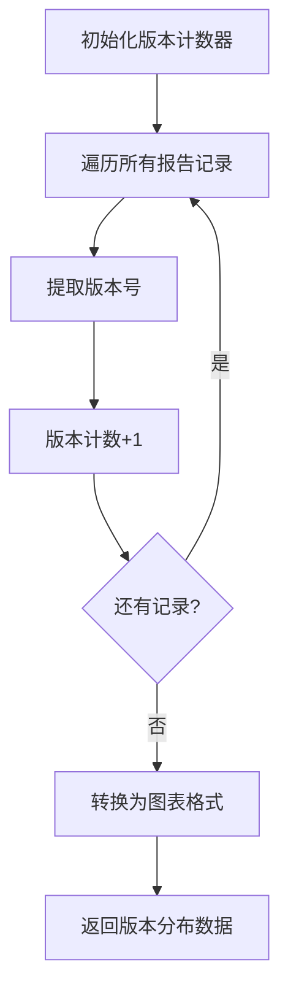
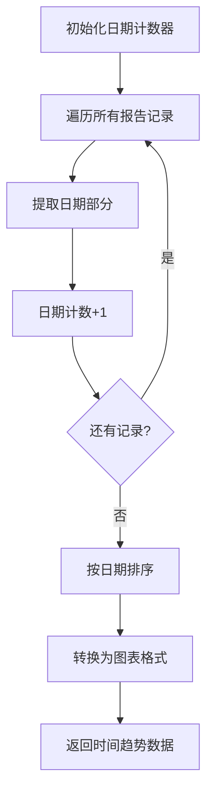
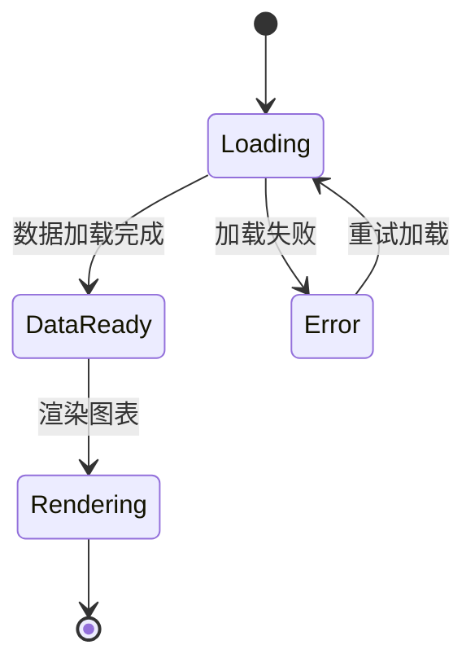
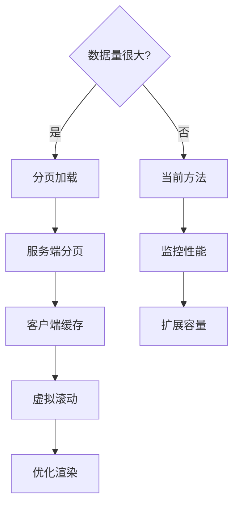
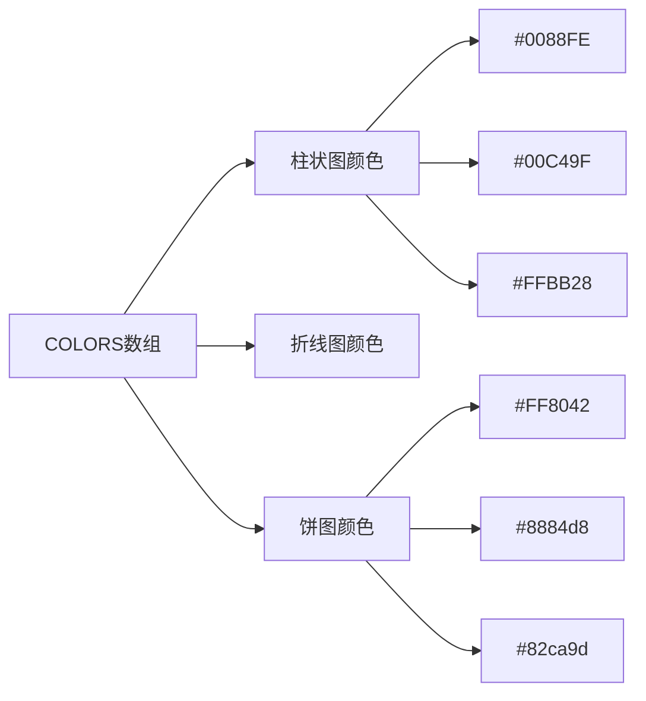
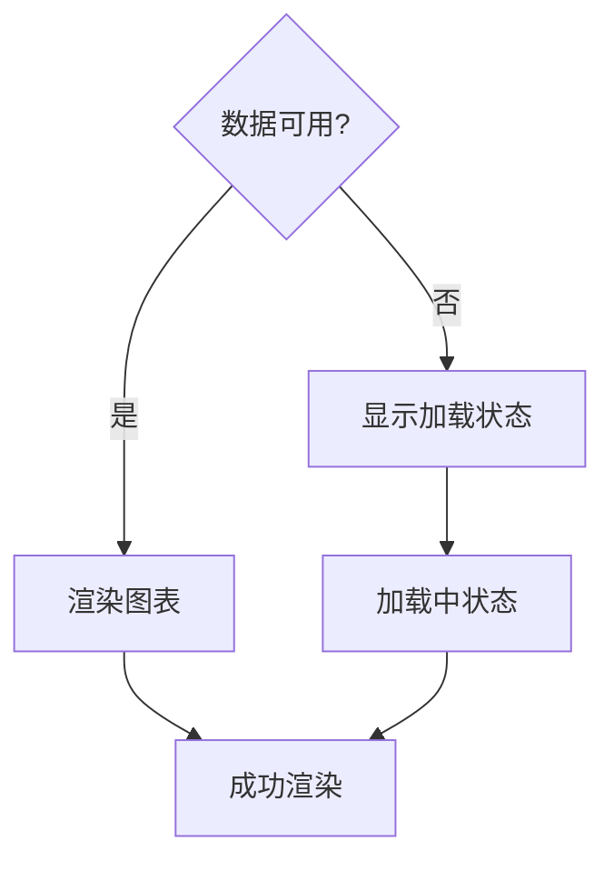

# 图表面板组件

<cite>
**本文档引用的文件**
- [ChartPanel.jsx](file://client/src/pages/StatisticPage/ChartPanel.jsx)
- [index.jsx](file://client/src/pages/StatisticPage/index.jsx)
- [DataTable.jsx](file://client/src/pages/StatisticPage/DataTable.jsx)
- [ReportFormModal.jsx](file://client/src/pages/StatisticPage/ReportFormModal.jsx)
- [ReportModal.jsx](file://client/src/pages/StatisticPage/ReportModal.jsx)
- [report.js](file://server/routes/report.js)
- [Report.js](file://server/models/Report.js)
- [woax.statistics.json](file://db/woax.statistics.json)
- [package.json](file://client/package.json)
- [App.jsx](file://client/src/App.jsx)
</cite>

## 目录
1. [简介](#简介)
2. [项目结构](#项目结构)
3. [核心组件](#核心组件)
4. [架构概览](#架构概览)
5. [详细组件分析](#详细组件分析)
6. [数据聚合算法](#数据聚合算法)
7. [图表交互功能](#图表交互功能)
8. [性能优化策略](#性能优化策略)
9. [自定义配置选项](#自定义配置选项)
10. [使用示例](#使用示例)
11. [最佳实践指南](#最佳实践指南)
12. [故障排除指南](#故障排除指南)
13. [结论](#结论)

## 简介

ChartPanel图表面板组件是WoaX项目中用于展示统计数据可视化的核心组件。该组件基于Recharts图表库实现了多种图表类型，包括柱状图、折线图和饼图，为用户提供直观的数据分析界面。组件集成了数据聚合、图表渲染、交互控制等功能，支持实时数据更新和响应式设计。

该组件主要服务于数据统计页面，通过三个核心图表展示不同维度的数据分布：
- 版本分布统计：显示各版本的使用情况
- 时间趋势分析：展示数据随时间的变化趋势  
- 设备分布统计：分析用户设备类型的分布情况

## 项目结构

WoaX项目采用前后端分离架构，ChartPanel组件位于前端React应用中，负责数据可视化展示。



**图表来源**
- [App.jsx](file://client/src/App.jsx#L158-L242)
- [index.jsx](file://client/src/pages/StatisticPage/index.jsx#L198-L259)
- [ChartPanel.jsx](file://client/src/pages/StatisticPage/ChartPanel.jsx#L55-L126)

**章节来源**
- [package.json](file://client/package.json#L1-L47)
- [App.jsx](file://client/src/App.jsx#L1-L253)

## 核心组件

ChartPanel组件是整个数据可视化系统的核心，它负责：

### 主要职责
- **数据准备**：将原始统计数据转换为图表可用的数据格式
- **图表渲染**：使用Recharts库渲染多种类型的图表
- **响应式设计**：适配不同屏幕尺寸和设备
- **状态管理**：处理图表加载状态和空数据场景

### 组件特性
- 支持三种图表类型：柱状图、折线图、饼图
- 实时数据更新和响应式布局
- 内置加载状态指示器
- 友好的空数据处理

**章节来源**
- [ChartPanel.jsx](file://client/src/pages/StatisticPage/ChartPanel.jsx#L8-L129)

## 架构概览

ChartPanel组件在整个应用架构中扮演着关键角色，连接了数据层、业务逻辑层和用户界面层。



**图表来源**
- [index.jsx](file://client/src/pages/StatisticPage/index.jsx#L88-L109)
- [report.js](file://server/routes/report.js#L9-L88)

**章节来源**
- [index.jsx](file://client/src/pages/StatisticPage/index.jsx#L12-L262)
- [report.js](file://server/routes/report.js#L1-L271)

## 详细组件分析

### ChartPanel组件架构

ChartPanel组件采用了函数式组件的设计模式，结合React Hooks实现状态管理和数据处理。



**图表来源**
- [ChartPanel.jsx](file://client/src/pages/StatisticPage/ChartPanel.jsx#L8-L53)

### 数据准备流程

组件的核心功能是将原始统计数据转换为图表可用的格式，这一过程包含三个关键步骤：



**图表来源**
- [ChartPanel.jsx](file://client/src/pages/StatisticPage/ChartPanel.jsx#L10-L51)

**章节来源**
- [ChartPanel.jsx](file://client/src/pages/StatisticPage/ChartPanel.jsx#L10-L53)

### 图表配置详解

组件集成了三种不同类型的图表，每种图表都有特定的配置和用途：

#### 柱状图配置
- **用途**：展示版本分布统计
- **数据源**：按版本号分组统计的结果
- **配置特点**：使用ResponsiveContainer实现响应式布局

#### 折线图配置  
- **用途**：展示时间趋势分析
- **数据源**：按日期分组统计并排序后的结果
- **配置特点**：按日期字符串排序确保时间序列正确性

#### 饼图配置
- **用途**：展示设备分布统计
- **数据源**：按设备信息分组统计的结果
- **配置特点**：使用预定义颜色数组实现一致的颜色方案

**章节来源**
- [ChartPanel.jsx](file://client/src/pages/StatisticPage/ChartPanel.jsx#L58-L124)

## 数据聚合算法

ChartPanel组件实现了高效的数据聚合算法，将原始统计数据转换为适合图表展示的格式。

### 版本分布统计算法

版本分布统计通过哈希表实现O(n)时间复杂度的统计：



**图表来源**
- [ChartPanel.jsx](file://client/src/pages/StatisticPage/ChartPanel.jsx#L13-L18)

### 日期趋势统计算法

日期趋势统计不仅进行分组统计，还需要进行时间排序：



**图表来源**
- [ChartPanel.jsx](file://client/src/pages/StatisticPage/ChartPanel.jsx#L20-L25)

### 设备分布统计算法

设备分布统计通过字符串分割实现设备类型的识别：

```mermaid
flowchart TD
Init[初始化设备计数器] --> Iterate[遍历所有报告记录]
Iterate --> ExtractDeviceInfo[提取设备信息]
ExtractDeviceInfo --> SplitDevice[按" - "分割]
SplitDevice --> GetDeviceType[获取设备类型]
GetDeviceType --> IncrementCount[设备计数+1]
IncrementCount --> NextRecord{还有记录?}
NextRecord --> |是| Iterate
NextRecord --> |否| ConvertFormat[转换为图表格式]
ConvertFormat --> Result[返回设备分布数据]
```

**图表来源**
- [ChartPanel.jsx](file://client/src/pages/StatisticPage/ChartPanel.jsx#L27-L32)

**章节来源**
- [ChartPanel.jsx](file://client/src/pages/StatisticPage/ChartPanel.jsx#L10-L51)

## 图表交互功能

ChartPanel组件提供了丰富的交互功能，增强用户体验和数据探索能力。

### 加载状态管理

组件实现了完善的加载状态管理，确保用户在数据加载过程中获得良好的反馈：



**图表来源**
- [ChartPanel.jsx](file://client/src/pages/StatisticPage/ChartPanel.jsx#L59-L74)

### 响应式布局设计

组件使用ResponsiveContainer确保图表在不同设备上都能良好显示：

- **宽度**：100%自适应容器宽度
- **高度**：固定高度确保布局稳定性
- **比例**：保持图表纵横比不被破坏

### 图表工具提示

每个图表都集成了Tooltip组件，提供详细的数据信息：

- **悬停效果**：鼠标悬停时显示详细信息
- **格式化显示**：对数值进行适当的格式化
- **位置自适应**：根据图表内容自动调整位置

**章节来源**
- [ChartPanel.jsx](file://client/src/pages/StatisticPage/ChartPanel.jsx#L58-L124)

## 性能优化策略

ChartPanel组件在设计时充分考虑了性能优化，特别是在处理大量数据时的性能表现。

### 数据预处理优化

- **单次遍历**：每个聚合操作只遍历数据一次
- **哈希表索引**：使用对象作为哈希表实现O(1)查找
- **内存复用**：避免不必要的中间变量创建

### 渲染性能优化

- **条件渲染**：只有在有数据时才渲染图表
- **空状态处理**：使用Spin组件提供加载指示
- **响应式容器**：避免强制重排和重绘

### 大数据量处理

虽然当前实现使用了较大的pageSize（100000），但在实际生产环境中建议：



**图表来源**
- [index.jsx](file://client/src/pages/StatisticPage/index.jsx#L88-L109)

**章节来源**
- [index.jsx](file://client/src/pages/StatisticPage/index.jsx#L88-L109)

## 自定义配置选项

ChartPanel组件提供了灵活的配置选项，支持样式调整和主题定制。

### 颜色配置系统

组件使用预定义的颜色数组实现一致的视觉风格：



**图表来源**
- [ChartPanel.jsx](file://client/src/pages/StatisticPage/ChartPanel.jsx#L5-L6)

### 图表样式定制

每个图表都可以独立定制样式属性：

- **边距配置**：通过margin属性控制图表边距
- **网格样式**：CartesianGrid提供虚线网格背景
- **轴标签**：XAxis和YAxis支持自定义标签格式
- **图例位置**：Legend组件支持多位置配置

### 响应式配置

- **容器尺寸**：ResponsiveContainer自动适配父元素尺寸
- **字体大小**：根据容器尺寸调整标签字体大小
- **间距调整**：自动调整图表元素间的间距

**章节来源**
- [ChartPanel.jsx](file://client/src/pages/StatisticPage/ChartPanel.jsx#L5-L129)

## 使用示例

### 基础使用方式

ChartPanel组件可以简单地通过props传递数据：

```javascript
// 在StatisticPage中使用
<ChartPanel 
  data={allReports} 
  loading={chartLoading} 
/>
```

### 数据格式要求

组件期望的数据格式如下：

```javascript
const sampleData = [
  {
    username: "user123",
    ip: "192.168.1.1",
    timestamp: "2025-05-10T19:27:00.669Z",
    version: "v2.1.1",
    remark: "测试备注",
    deviceInfo: "Windows - Chrome",
    projectId: "682031eaba8af1129bfdf62c"
  }
];
```

### 错误处理示例

组件内置了完善的错误处理机制：



**图表来源**
- [ChartPanel.jsx](file://client/src/pages/StatisticPage/ChartPanel.jsx#L59-L74)

**章节来源**
- [ChartPanel.jsx](file://client/src/pages/StatisticPage/ChartPanel.jsx#L8-L129)

## 最佳实践指南

### 数据预处理最佳实践

1. **数据验证**：在传递给ChartPanel之前验证数据完整性
2. **性能监控**：监控数据处理时间和内存使用
3. **错误恢复**：实现数据处理失败时的降级方案

### 图表设计最佳实践

1. **颜色搭配**：使用对比度高的颜色确保可读性
2. **标签优化**：合理设置标签长度避免重叠
3. **交互设计**：提供清晰的交互反馈

### 性能优化最佳实践

1. **数据分页**：对于大量数据使用分页加载
2. **缓存策略**：实现数据缓存减少重复请求
3. **懒加载**：图表组件支持懒加载机制

### 用户体验最佳实践

1. **加载状态**：始终提供明确的加载指示
2. **错误处理**：优雅处理数据加载失败的情况
3. **响应式设计**：确保在移动设备上的良好体验

## 故障排除指南

### 常见问题及解决方案

#### 图表不显示问题

**症状**：图表区域空白或显示异常

**可能原因**：
- 数据格式不正确
- 缺少必要的数据字段
- 组件未正确接收props

**解决方法**：
1. 检查数据格式是否符合预期
2. 确认所有必需字段都存在
3. 验证组件props传递是否正确

#### 性能问题

**症状**：图表渲染缓慢或页面卡顿

**可能原因**：
- 数据量过大
- 频繁的数据更新
- 不必要的重渲染

**解决方法**：
1. 实现数据分页加载
2. 优化数据处理算法
3. 使用React.memo避免不必要的重渲染

#### 响应式问题

**症状**：图表在小屏幕上显示异常

**解决方法**：
1. 检查ResponsiveContainer配置
2. 调整图表尺寸设置
3. 优化标签字体大小

**章节来源**
- [ChartPanel.jsx](file://client/src/pages/StatisticPage/ChartPanel.jsx#L58-L124)

## 结论

ChartPanel图表面板组件是一个功能完善、设计合理的数据可视化组件。它成功地将复杂的统计数据转换为直观的图表展示，为用户提供了强大的数据分析工具。

### 主要优势

1. **功能完整**：支持多种图表类型，满足不同的数据展示需求
2. **性能优化**：采用高效的算法和优化策略，确保良好的用户体验
3. **易于使用**：简洁的API设计，便于集成和使用
4. **可定制性强**：提供丰富的配置选项，支持个性化定制

### 技术亮点

- 基于Recharts的现代化图表库集成
- 响应式设计确保跨设备兼容性
- 完善的错误处理和加载状态管理
- 高效的数据聚合算法

### 发展方向

未来可以在以下方面进一步改进：
- 实现更智能的数据分页和懒加载机制
- 增加更多的图表交互功能
- 优化大数据量场景下的性能表现
- 提供更丰富的主题定制选项

ChartPanel组件为WoaX项目的数据可视化奠定了坚实的基础，为用户提供了直观、易用的数据分析界面。