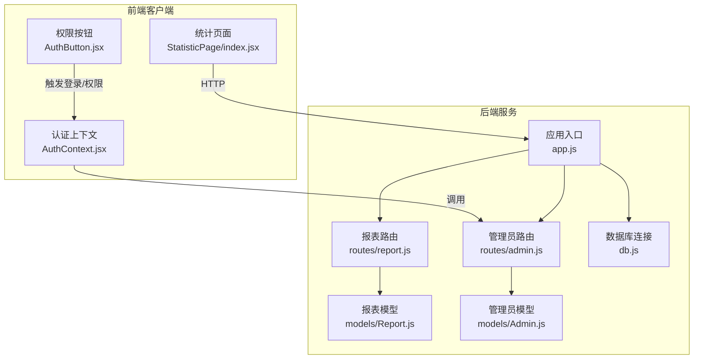
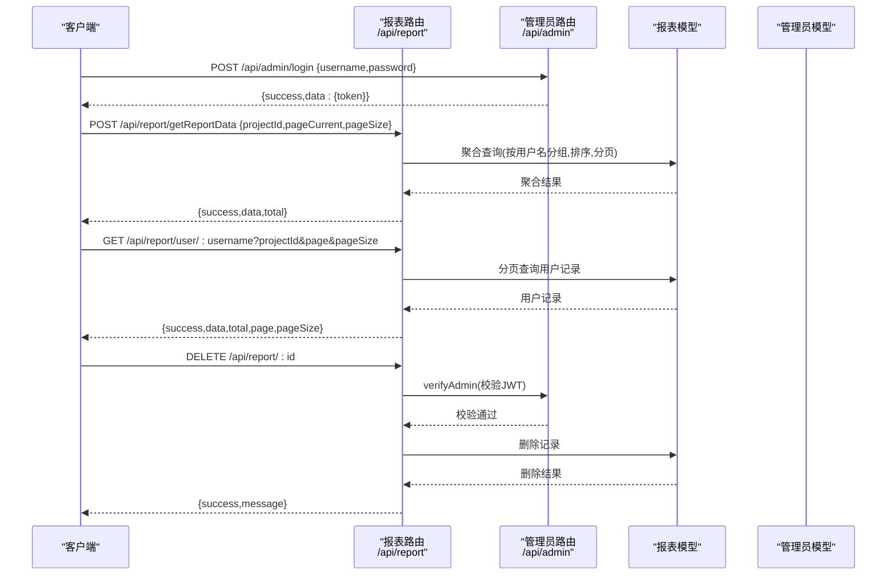
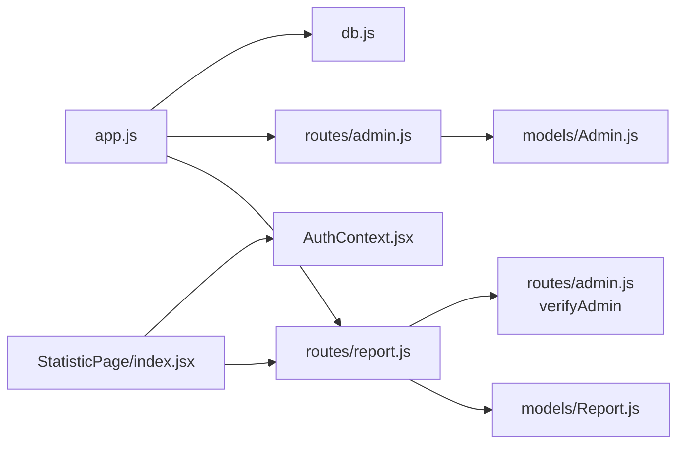

# 报表API接口

<cite>
**本文引用的文件**
- [server/app.js](file://server/app.js)
- [server/db.js](file://server/db.js)
- [server/routes/report.js](file://server/routes/report.js)
- [server/models/Report.js](file://server/models/Report.js)
- [server/routes/admin.js](file://server/routes/admin.js)
- [server/models/Admin.js](file://server/models/Admin.js)
- [client/src/pages/StatisticPage/index.jsx](file://client/src/pages/StatisticPage/index.jsx)
- [client/src/components/AuthButton.jsx](file://client/src/components/AuthButton.jsx)
- [client/src/context/AuthContext.jsx](file://client/src/context/AuthContext.jsx)
- [README.md](file://README.md)
</cite>

## 目录
1. [简介](#简介)
2. [项目结构](#项目结构)
3. [核心组件](#核心组件)
4. [架构总览](#架构总览)
5. [详细组件分析](#详细组件分析)
6. [依赖关系分析](#依赖关系分析)
7. [性能考虑](#性能考虑)
8. [故障排查指南](#故障排查指南)
9. [结论](#结论)
10. [附录](#附录)

## 简介
本文件为报表API接口的完整技术文档，覆盖以下要点：
- 所有RESTful端点的请求参数与响应格式
- 数据聚合接口的实现细节（分页、条件筛选、排序）
- 用户详情接口（按用户名查询用户历史记录）
- 安全机制（权限验证、数据访问控制）
- 错误处理与状态码规范
- 请求与响应示例
- API版本管理与兼容性说明

## 项目结构
后端基于Koa框架，采用模块化路由组织；前端React应用通过Axios调用后端API。数据库为MongoDB，使用Mongoose模型。

**图示来源**
- [server/app.js](file://server/app.js#L1-L61)
- [server/routes/report.js](file://server/routes/report.js#L1-L271)
- [server/routes/admin.js](file://server/routes/admin.js#L1-L128)
- [server/models/Report.js](file://server/models/Report.js#L1-L22)
- [server/models/Admin.js](file://server/models/Admin.js#L1-L32)
- [server/db.js](file://server/db.js#L1-L45)
- [client/src/pages/StatisticPage/index.jsx](file://client/src/pages/StatisticPage/index.jsx#L1-L262)
- [client/src/components/AuthButton.jsx](file://client/src/components/AuthButton.jsx#L1-L43)
- [client/src/context/AuthContext.jsx](file://client/src/context/AuthContext.jsx#L1-L155)

**章节来源**
- [server/app.js](file://server/app.js#L1-L61)
- [server/db.js](file://server/db.js#L1-L45)
- [README.md](file://README.md#L1-L44)

## 核心组件
- 报表路由模块：提供报表数据的聚合查询、用户详情查询、上报、删除、自主上报等接口。
- 管理员路由模块：提供登录、令牌校验、中间件权限校验。
- 报表模型：定义统计数据的字段结构与集合名称。
- 管理员模型：定义管理员账户的字段结构与密码加盐哈希方法。
- 前端统计页面：封装了报表聚合分页、用户详情分页、删除与自主上报等交互。

**章节来源**
- [server/routes/report.js](file://server/routes/report.js#L1-L271)
- [server/models/Report.js](file://server/models/Report.js#L1-L22)
- [server/routes/admin.js](file://server/routes/admin.js#L1-L128)
- [server/models/Admin.js](file://server/models/Admin.js#L1-L32)
- [client/src/pages/StatisticPage/index.jsx](file://client/src/pages/StatisticPage/index.jsx#L1-L262)

## 架构总览
后端通过Koa Router注册各模块路由，报表API位于/api/report前缀下。管理员相关接口位于/api/admin前缀下。前端通过Axios发起请求，部分敏感操作需携带JWT令牌。

**图示来源**
- [server/routes/report.js](file://server/routes/report.js#L1-L271)
- [server/routes/admin.js](file://server/routes/admin.js#L100-L125)
- [server/models/Report.js](file://server/models/Report.js#L1-L22)
- [server/models/Admin.js](file://server/models/Admin.js#L1-L32)

## 详细组件分析

### 报表聚合接口
- 端点：POST /api/report/getReportData
- 功能：按项目ID聚合每个用户的最后一条上报记录，支持分页与排序
- 请求体参数
  - pageCurrent: number，默认1
  - pageSize: number，默认20
  - projectId: string，必填
- 响应
  - success: boolean
  - data: array，每项包含用户名、IP、时间戳、版本、备注、设备信息、文档ID、项目ID等
  - total: number，聚合后的总条数

实现要点
- 使用聚合管道先按时间戳降序排序，再按用户名分组取第一条记录
- 再次对最终结果按时间戳降序排序
- 使用跳过与限制实现分页

**章节来源**
- [server/routes/report.js](file://server/routes/report.js#L8-L88)
- [client/src/pages/StatisticPage/index.jsx](file://client/src/pages/StatisticPage/index.jsx#L57-L109)

### 用户详情接口
- 端点：GET /api/report/user/:username
- 功能：按用户名查询用户在指定项目下的历史记录，支持分页
- 路径参数
  - username: string，必填
- 查询参数
  - projectId: string，必填
  - page: number，默认1
  - pageSize: number，默认10
- 响应
  - success: boolean
  - data: array，用户历史记录
  - total: number
  - page: number
  - pageSize: number

实现要点
- 以用户名与项目ID为查询条件
- 按时间戳降序排序
- 使用跳过与限制实现分页

**章节来源**
- [server/routes/report.js](file://server/routes/report.js#L90-L131)
- [client/src/pages/StatisticPage/index.jsx](file://client/src/pages/StatisticPage/index.jsx#L127-L171)

### 上报接口
- 端点：POST /api/report/addReport
- 功能：新增一条上报记录
- 请求体参数
  - username: string
  - ip: string
  - userAgent: string
  - deviceInfo: string
  - location: string
  - version: string
  - remark: string
  - projectId: string，必填
- 响应
  - success: boolean
  - message: string
  - data: 新增记录

实现要点
- 校验项目ID必填
- 保存时写入当前时间戳

**章节来源**
- [server/routes/report.js](file://server/routes/report.js#L133-L176)

### 单条统计记录详情
- 端点：GET /api/report/:id
- 功能：获取某条统计记录详情
- 响应
  - success: boolean
  - data: object，记录详情

实现要点
- 通过ID查找记录，未找到返回404

**章节来源**
- [server/routes/report.js](file://server/routes/report.js#L178-L202)

### 删除统计记录
- 端点：DELETE /api/report/:id
- 功能：删除某条统计记录
- 安全机制：需管理员权限（JWT）
- 响应
  - success: boolean
  - message: string

实现要点
- 使用管理员中间件校验JWT
- 未找到记录返回404

**章节来源**
- [server/routes/report.js](file://server/routes/report.js#L204-L229)
- [server/routes/admin.js](file://server/routes/admin.js#L100-L125)

### 自主上报接口
- 端点：POST /api/report/submit
- 功能：管理员自主上报一条记录
- 安全机制：需管理员权限（JWT）
- 请求体参数
  - username: string，必填
  - projectId: string，必填
  - 其他字段可选
- 响应
  - success: boolean
  - message: string
  - data: 新增记录

实现要点
- 校验必填字段
- 自动写入时间戳与客户端IP

**章节来源**
- [server/routes/report.js](file://server/routes/report.js#L231-L268)
- [server/routes/admin.js](file://server/routes/admin.js#L100-L125)

### 报表数据模型
- 集合：statistics
- 关键字段
  - username: string，必填
  - ip: string
  - timestamp: date，默认当前时间
  - version: string
  - remark: string
  - deviceInfo: string
  - projectId: ObjectId，必填，关联项目
- 关系
  - projectId -> Project（外部引用）

**章节来源**
- [server/models/Report.js](file://server/models/Report.js#L1-L22)

### 管理员安全机制
- 登录
  - 端点：POST /api/admin/login
  - 参数：username, password
  - 成功返回JWT令牌
- 校验令牌
  - 端点：GET /api/admin/verify
  - 请求头：Authorization: Bearer <token>
  - 成功返回用户名
- 中间件
  - verifyAdmin：校验JWT并注入管理员信息

前端集成
- 登录成功后将令牌存入本地存储
- 通过上下文提供登录弹窗与注销
- 权限按钮在未登录时禁用并提示

**章节来源**
- [server/routes/admin.js](file://server/routes/admin.js#L27-L98)
- [server/routes/admin.js](file://server/routes/admin.js#L100-L125)
- [client/src/context/AuthContext.jsx](file://client/src/context/AuthContext.jsx#L24-L104)
- [client/src/components/AuthButton.jsx](file://client/src/components/AuthButton.jsx#L12-L41)
- [README.md](file://README.md#L44-L44)

## 依赖关系分析
- 报表路由依赖报表模型与管理员中间件
- 管理员路由依赖管理员模型与JWT
- 前端统计页面依赖报表路由与认证上下文
- 应用入口负责注册路由与数据库连接

**图示来源**
- [server/routes/report.js](file://server/routes/report.js#L1-L271)
- [server/models/Report.js](file://server/models/Report.js#L1-L22)
- [server/routes/admin.js](file://server/routes/admin.js#L1-L128)
- [server/models/Admin.js](file://server/models/Admin.js#L1-L32)
- [server/app.js](file://server/app.js#L1-L61)
- [server/db.js](file://server/db.js#L1-L45)
- [client/src/pages/StatisticPage/index.jsx](file://client/src/pages/StatisticPage/index.jsx#L1-L262)
- [client/src/context/AuthContext.jsx](file://client/src/context/AuthContext.jsx#L1-L155)

**章节来源**
- [server/app.js](file://server/app.js#L47-L55)
- [server/db.js](file://server/db.js#L9-L24)

## 性能考虑
- 聚合查询
  - 先排序再分组，避免大结果集二次处理
  - 分页使用跳过与限制，建议配合索引优化
- 用户详情查询
  - 建议在username与projectId上建立复合索引
- 删除与更新
  - 对于高频删除场景，建议定期归档或软删除策略
- 前端分页
  - 图表展示使用较大pageSize（如100000），注意内存占用与网络传输

[本节为通用指导，无需列出具体文件来源]

## 故障排查指南
- 400 缺少项目ID参数
  - 检查请求体/查询参数是否包含projectId
- 401 未提供令牌/无效的令牌
  - 确认Authorization头格式为Bearer <token>
  - 检查本地存储中的令牌是否存在且未过期
- 404 未找到记录
  - 确认ID或用户名是否正确
- 500 服务器错误
  - 查看后端日志，检查数据库连接与聚合管道语法

**章节来源**
- [server/routes/report.js](file://server/routes/report.js#L13-L20)
- [server/routes/report.js](file://server/routes/report.js#L95-L102)
- [server/routes/admin.js](file://server/routes/admin.js#L72-L98)
- [client/src/context/AuthContext.jsx](file://client/src/context/AuthContext.jsx#L24-L48)

## 结论
本API围绕“报表数据聚合与用户历史查询”展开，结合管理员JWT权限实现了受控的数据变更能力。前端通过Axios与认证上下文完成权限引导与调用。建议在生产环境中为高频查询建立索引、限制大分页范围、并完善监控与日志。

[本节为总结性内容，无需列出具体文件来源]

## 附录

### 请求与响应示例（路径引用）
- 聚合分页请求
  - 路径：POST /api/report/getReportData
  - 请求体示例路径：[client/src/pages/StatisticPage/index.jsx](file://client/src/pages/StatisticPage/index.jsx#L64-L68)
  - 成功响应示例路径：[server/routes/report.js](file://server/routes/report.js#L75-L80)
- 用户详情分页请求
  - 路径：GET /api/report/user/:username
  - 请求参数示例路径：[client/src/pages/StatisticPage/index.jsx](file://client/src/pages/StatisticPage/index.jsx#L133-L138)
  - 成功响应示例路径：[server/routes/report.js](file://server/routes/report.js#L116-L122)
- 上报请求
  - 路径：POST /api/report/addReport
  - 请求体示例路径：[server/routes/report.js](file://server/routes/report.js#L136-L145)
  - 成功响应示例路径：[server/routes/report.js](file://server/routes/report.js#L163-L167)
- 删除请求
  - 路径：DELETE /api/report/:id
  - 请求头示例路径：[server/routes/admin.js](file://server/routes/admin.js#L103-L108)
  - 成功响应示例路径：[server/routes/report.js](file://server/routes/report.js#L209-L213)
- 自主上报请求
  - 路径：POST /api/report/submit
  - 请求体示例路径：[server/routes/report.js](file://server/routes/report.js#L234-L244)
  - 成功响应示例路径：[server/routes/report.js](file://server/routes/report.js#L255-L259)

### API版本管理与兼容性
- 本仓库未提供独立的API版本号字段或URL路径版本化（如/v1/）
- 建议后续引入语义化版本控制，通过路径或Header携带版本信息，以保证向后兼容
- 当前接口遵循REST风格，尽量保持稳定；新增字段建议向后兼容，避免破坏既有客户端

[本节为通用指导，无需列出具体文件来源]