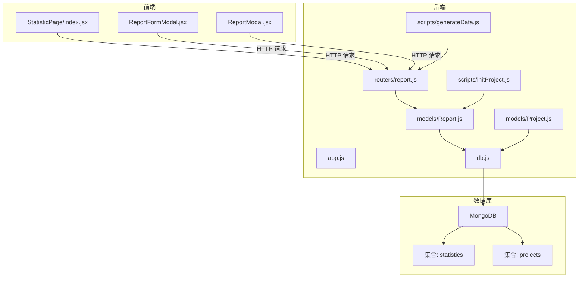
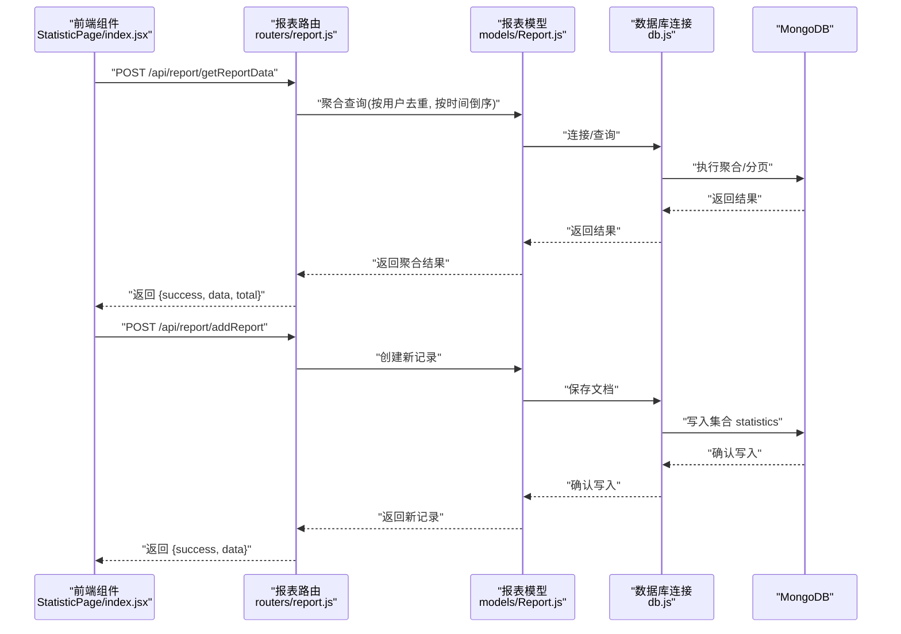
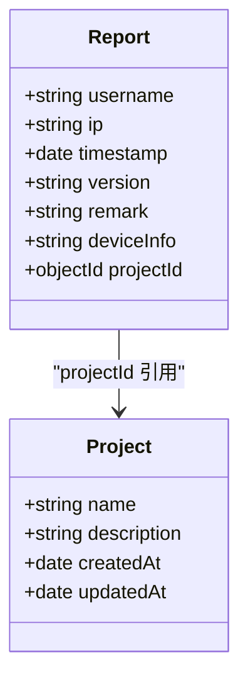
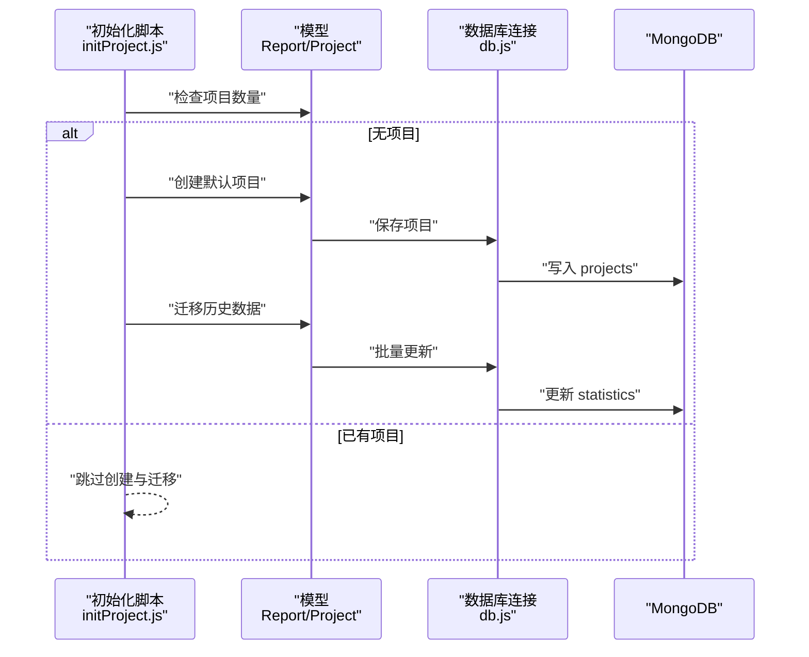
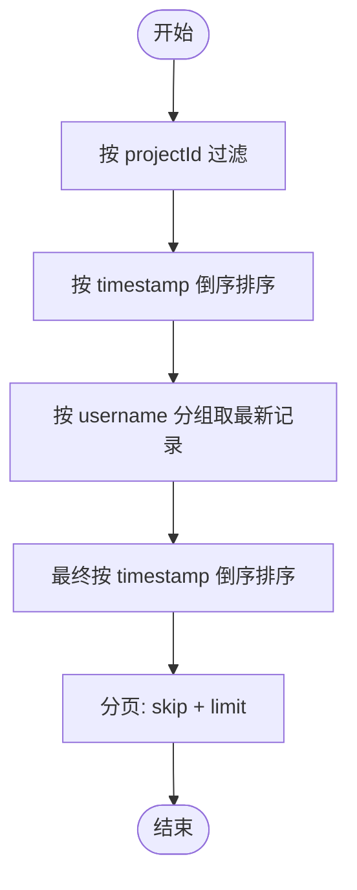
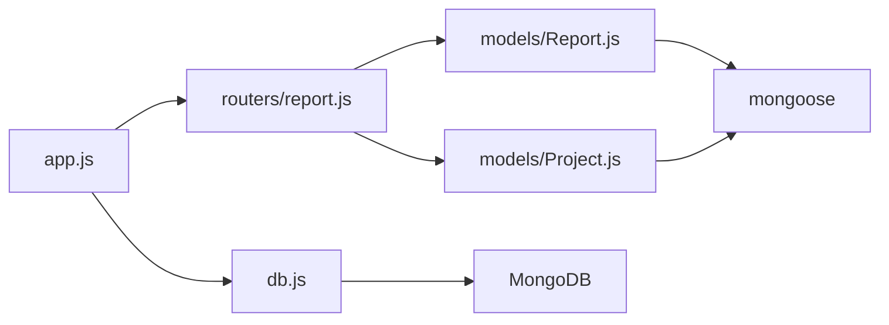

# 报表数据模型

<cite>
**本文引用的文件**
- [server/models/Report.js](file://server/models/Report.js)
- [server/routers/report.js](file://server/routers/report.js)
- [server/models/Project.js](file://server/models/Project.js)
- [server/db.js](file://server/db.js)
- [server/scripts/initProject.js](file://server/scripts/initProject.js)
- [server/scripts/generateData.js](file://server/scripts/generateData.js)
- [client/src/pages/StatisticPage/index.jsx](file://client/src/pages/StatisticPage/index.jsx)
- [client/src/pages/StatisticPage/ReportFormModal.jsx](file://client/src/pages/StatisticPage/ReportFormModal.jsx)
- [client/src/pages/StatisticPage/ReportModal.jsx](file://client/src/pages/StatisticPage/ReportModal.jsx)
- [db/woax.statistics.json](file://db/woax.statistics.json)
- [db/woax.projects.json](file://db/woax.projects.json)
- [server/app.js](file://server/app.js)
</cite>

## 目录
1. [简介](#简介)
2. [项目结构](#项目结构)
3. [核心组件](#核心组件)
4. [架构总览](#架构总览)
5. [详细组件分析](#详细组件分析)
6. [依赖关系分析](#依赖关系分析)
7. [性能考虑](#性能考虑)
8. [故障排查指南](#故障排查指南)
9. [结论](#结论)
10. [附录](#附录)

## 简介
本文件为“报表数据模型”提供全面的数据模型文档，聚焦于 ReportSchema 的字段定义、数据类型与验证规则、索引与性能优化、与其他模型的关系映射、数据生命周期管理、数据迁移与版本策略，以及完整的 API 接口说明与数据操作示例。目标是帮助开发者与运维人员快速理解并高效使用该数据模型。

## 项目结构
本项目采用前后端分离架构：
- 前端使用 React + Ant Design，负责用户界面与交互。
- 后端使用 Koa + MongoDB（Mongoose），负责业务逻辑与数据持久化。
- 数据模型位于 server/models，路由位于 server/routers，数据库连接与配置位于 server/db.js，脚本位于 server/scripts。

图示来源
- [server/app.js](file://server/app.js#L1-L61)
- [server/db.js](file://server/db.js#L1-L45)
- [server/routers/report.js](file://server/routers/report.js#L1-L271)
- [server/models/Report.js](file://server/models/Report.js#L1-L22)
- [server/models/Project.js](file://server/models/Project.js#L1-L21)
- [server/scripts/initProject.js](file://server/scripts/initProject.js#L1-L39)
- [server/scripts/generateData.js](file://server/scripts/generateData.js#L1-L155)

章节来源
- [server/app.js](file://server/app.js#L1-L61)
- [server/db.js](file://server/db.js#L1-L45)

## 核心组件
- 报表数据模型 Report：定义了用户标识、时间戳、IP 地址、版本号、备注、设备信息、项目关联等字段，并指定集合名为 statistics。
- 项目数据模型 Project：定义了项目名称、描述、时间戳等字段，用于与 Report 建立关联。
- 报表路由 report.js：提供报表数据的增删查、聚合统计、分页查询等接口。
- 数据库连接 db.js：封装 MongoDB 连接、事件监听与进程退出处理。
- 初始化脚本 initProject.js：在无项目时创建默认项目并将历史数据迁移至新项目。
- 生成数据脚本 generateData.js：批量生成模拟数据并调用上报接口。
- 前端页面与组件：StatisticPage/index.jsx、ReportFormModal.jsx、ReportModal.jsx，负责展示与操作报表数据。

章节来源
- [server/models/Report.js](file://server/models/Report.js#L1-L22)
- [server/models/Project.js](file://server/models/Project.js#L1-L21)
- [server/routers/report.js](file://server/routers/report.js#L1-L271)
- [server/db.js](file://server/db.js#L1-L45)
- [server/scripts/initProject.js](file://server/scripts/initProject.js#L1-L39)
- [server/scripts/generateData.js](file://server/scripts/generateData.js#L1-L155)
- [client/src/pages/StatisticPage/index.jsx](file://client/src/pages/StatisticPage/index.jsx#L1-L262)
- [client/src/pages/StatisticPage/ReportFormModal.jsx](file://client/src/pages/StatisticPage/ReportFormModal.jsx#L1-L107)
- [client/src/pages/StatisticPage/ReportModal.jsx](file://client/src/pages/StatisticPage/ReportModal.jsx#L1-L51)

## 架构总览
下图展示了从前端到后端再到数据库的整体流程，以及报表数据模型在系统中的位置与职责。

图示来源
- [server/routers/report.js](file://server/routers/report.js#L8-L88)
- [server/routers/report.js](file://server/routers/report.js#L134-L176)
- [server/models/Report.js](file://server/models/Report.js#L1-L22)
- [server/db.js](file://server/db.js#L1-L45)

## 详细组件分析

### 报表数据模型 ReportSchema 字段定义与验证规则
- 字段与类型
  - username: 字符串，必填
  - ip: 字符串，非必填
  - timestamp: 日期，默认值为当前时间
  - version: 字符串，非必填
  - remark: 字符串，非必填
  - deviceInfo: 字符串，非必填
  - projectId: ObjectId 引用 Project，必填
- 集合命名
  - 指定集合名为 statistics
- 关联关系
  - 通过 projectId 与 Project 模型建立关联，便于按项目维度进行筛选与统计

图示来源
- [server/models/Report.js](file://server/models/Report.js#L3-L19)
- [server/models/Project.js](file://server/models/Project.js#L3-L19)

章节来源
- [server/models/Report.js](file://server/models/Report.js#L1-L22)

### 报表路由与 API 接口说明
- 获取报表聚合数据（每用户最后上报）
  - 方法与路径: POST /api/report/getReportData
  - 请求体参数: pageCurrent, pageSize, projectId
  - 返回: success, data(每用户最新记录), total
  - 实现要点: 使用聚合管道按用户名分组取最新记录，再按时间倒序分页
- 获取用户所有记录（分页）
  - 方法与路径: GET /api/report/user/:username
  - 查询参数: page, pageSize, projectId
  - 返回: success, data, total, page, pageSize
- 添加上报数据
  - 方法与路径: POST /api/report/addReport
  - 请求体参数: username, ip, userAgent, deviceInfo, location, version, remark, projectId
  - 返回: success, message, data(newReport)
- 获取单条统计记录详情
  - 方法与路径: GET /api/report/:id
  - 返回: success, data
- 删除统计记录（需管理员权限）
  - 方法与路径: DELETE /api/report/:id
  - 返回: success, message 或错误信息
- 自主上报（需管理员权限）
  - 方法与路径: POST /api/report/submit
  - 请求体: 报表数据对象（含 username, projectId 必填）
  - 返回: success, message, data

章节来源
- [server/routers/report.js](file://server/routers/report.js#L8-L88)
- [server/routers/report.js](file://server/routers/report.js#L90-L131)
- [server/routers/report.js](file://server/routers/report.js#L133-L176)
- [server/routers/report.js](file://server/routers/report.js#L178-L202)
- [server/routers/report.js](file://server/routers/report.js#L204-L229)
- [server/routers/report.js](file://server/routers/report.js#L231-L268)

### 数据关系映射
- Report 与 Project 的一对一关联
  - Report.projectId 引用 Project._id
  - 在前端页面中，当前选中的项目通过 currentProject._id 传入后端接口，作为查询与新增的过滤条件
- 数据迁移策略
  - 初始化脚本会在无项目时创建默认项目，并将历史数据（如 Report、Feedback、Version）中未设置 projectId 的记录统一迁移到该默认项目
  - 项目迁移接口可将所有未设置项目的现有数据迁移到指定项目

图示来源
- [server/scripts/initProject.js](file://server/scripts/initProject.js#L1-L39)
- [server/models/Report.js](file://server/models/Report.js#L11-L15)
- [server/models/Project.js](file://server/models/Project.js#L1-L21)
- [server/db.js](file://server/db.js#L1-L45)

章节来源
- [server/scripts/initProject.js](file://server/scripts/initProject.js#L1-L39)
- [server/models/Report.js](file://server/models/Report.js#L11-L15)
- [server/models/Project.js](file://server/models/Project.js#L1-L21)

### 数据生命周期管理
- 创建
  - 通过 POST /api/report/addReport 或 POST /api/report/submit 创建新记录
  - 自动设置 timestamp 与 ip（自主上报时由后端注入）
- 更新
  - 当前路由未提供更新接口；如需更新可在前端收集数据后重新提交或扩展后端接口
- 删除
  - 通过 DELETE /api/report/:id 删除指定记录（需管理员权限）

章节来源
- [server/routers/report.js](file://server/routers/report.js#L133-L176)
- [server/routers/report.js](file://server/routers/report.js#L204-L229)

### 数据验证与格式约束
- 必填字段
  - username（前端表单校验）、projectId（路由参数校验）
- 格式与范围
  - timestamp 默认为当前时间，建议前端传入时保持 ISO 8601 格式
  - ip、version、remark、deviceInfo、location 等字符串字段无强制格式校验
- 前端表单校验
  - 自主上报弹窗对 username、ip、userAgent、deviceInfo、location、version、remark 进行必填校验

章节来源
- [server/models/Report.js](file://server/models/Report.js#L5-L15)
- [client/src/pages/StatisticPage/ReportFormModal.jsx](file://client/src/pages/StatisticPage/ReportFormModal.jsx#L48-L96)

### 索引设计与性能优化
- 现状
  - ReportSchema 未显式声明索引
  - 聚合查询按 projectId 与 username 分组，按 timestamp 排序
- 建议索引
  - 在 statistics 集合上为 { projectId: 1, username: 1, timestamp: -1 } 建立复合索引，以优化按项目与用户分组、时间排序的查询
  - 为 { projectId: 1 } 单列索引，提升按项目过滤的效率
- 性能考量
  - 聚合阶段先按 timestamp 倒序，再 group 取 first，最后再 sort，避免多次全表扫描
  - 分页使用 skip/limit，建议结合游标分页或基于时间戳的分页以减少大偏移带来的性能问题

图示来源
- [server/routers/report.js](file://server/routers/report.js#L26-L51)

章节来源
- [server/routers/report.js](file://server/routers/report.js#L26-L51)

### 数据操作示例
- 新增上报
  - 前端调用 POST /api/report/addReport，携带 username、ip、userAgent、deviceInfo、location、version、remark、projectId
  - 后端保存后返回新记录
- 获取每用户最后上报（分页）
  - 前端调用 POST /api/report/getReportData，传入 pageCurrent、pageSize、projectId
  - 后端返回 data（每用户最新记录）与 total
- 获取用户全部记录（分页）
  - 前端调用 GET /api/report/user/:username，传入 page、pageSize、projectId
  - 后端返回该用户的全部上报记录
- 删除记录
  - 前端调用 DELETE /api/report/:id（需管理员权限）
  - 后端返回成功或失败信息

章节来源
- [client/src/pages/StatisticPage/index.jsx](file://client/src/pages/StatisticPage/index.jsx#L58-L85)
- [client/src/pages/StatisticPage/index.jsx](file://client/src/pages/StatisticPage/index.jsx#L128-L154)
- [client/src/pages/StatisticPage/index.jsx](file://client/src/pages/StatisticPage/index.jsx#L112-L125)
- [server/routers/report.js](file://server/routers/report.js#L133-L176)
- [server/routers/report.js](file://server/routers/report.js#L8-L88)
- [server/routers/report.js](file://server/routers/report.js#L90-L131)
- [server/routers/report.js](file://server/routers/report.js#L204-L229)

## 依赖关系分析
- 组件耦合
  - routers/report.js 依赖 models/Report.js 与 models/Project.js
  - models/Report.js 依赖 mongoose 并引用 Project 模型
  - app.js 注册路由并连接数据库
- 外部依赖
  - MongoDB（通过 mongoose 连接）
  - 前端通过 axios 发起 HTTP 请求

图示来源
- [server/routers/report.js](file://server/routers/report.js#L1-L6)
- [server/models/Report.js](file://server/models/Report.js#L1-L2)
- [server/models/Project.js](file://server/models/Project.js#L1-L2)
- [server/app.js](file://server/app.js#L1-L16)
- [server/db.js](file://server/db.js#L1-L2)

章节来源
- [server/routers/report.js](file://server/routers/report.js#L1-L6)
- [server/models/Report.js](file://server/models/Report.js#L1-L2)
- [server/models/Project.js](file://server/models/Project.js#L1-L2)
- [server/app.js](file://server/app.js#L1-L16)
- [server/db.js](file://server/db.js#L1-L2)

## 性能考虑
- 聚合查询优化
  - 建议在 statistics 集合上为 { projectId: 1, username: 1, timestamp: -1 } 建立复合索引
  - 对于超大分页场景，优先考虑基于时间戳的游标分页
- 写入性能
  - 批量导入可通过脚本 generateData.js 逐步插入，注意控制并发与延时
- 缓存与热点
  - 对于高频查询（如最近一次上报），可考虑在应用层缓存用户到最新记录的映射

[本节为通用性能建议，不直接分析具体文件]

## 故障排查指南
- 数据库连接失败
  - 检查 .env 中的 MONGODB_URI，确认 MongoDB 服务可用
  - 查看 db.js 的连接日志与错误事件
- 报表接口报错
  - 检查请求体是否包含必需字段（如 username、projectId）
  - 确认前端传入的 projectId 与后端当前项目一致
- 聚合查询结果为空
  - 确认 projectId 是否正确传入
  - 检查 statistics 集合中是否存在匹配记录
- 删除记录失败
  - 确认当前用户具备管理员权限
  - 检查记录 ID 是否有效

章节来源
- [server/db.js](file://server/db.js#L10-L24)
- [server/routers/report.js](file://server/routers/report.js#L13-L20)
- [server/routers/report.js](file://server/routers/report.js#L95-L102)
- [server/routers/report.js](file://server/routers/report.js#L205-L229)

## 结论
Report 数据模型围绕用户标识、时间戳、IP 地址、版本号、备注、设备信息与项目关联构建，配合聚合与分页查询实现高效的报表统计能力。通过明确的字段定义、路由接口与数据迁移策略，系统能够稳定地支撑数据采集、展示与管理。建议后续补充索引与游标分页策略以进一步提升性能，并在需要时扩展更新接口以满足更复杂的业务需求。

[本节为总结性内容，不直接分析具体文件]

## 附录

### 数据模型字段对照表
- username: 字符串，必填
- ip: 字符串，非必填
- timestamp: 日期，默认当前时间
- version: 字符串，非必填
- remark: 字符串，非必填
- deviceInfo: 字符串，非必填
- projectId: ObjectId 引用 Project，必填

章节来源
- [server/models/Report.js](file://server/models/Report.js#L5-L15)

### 示例数据参考
- statistics 集合样例（部分字段）
  - 包含 username、ip、timestamp、userAgent、deviceInfo、location、version、remark、projectId 等字段
- projects 集合样例
  - 包含 name、description、createdAt、updatedAt 等字段

章节来源
- [db/woax.statistics.json](file://db/woax.statistics.json#L1-L800)
- [db/woax.projects.json](file://db/woax.projects.json#L1-L28)