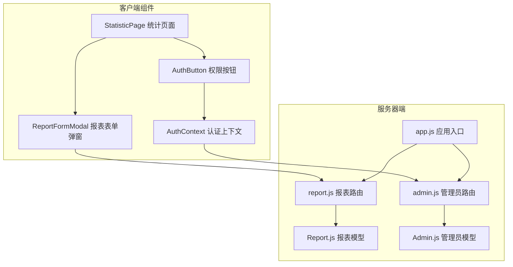
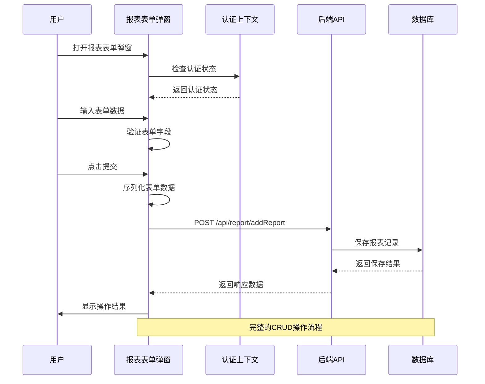
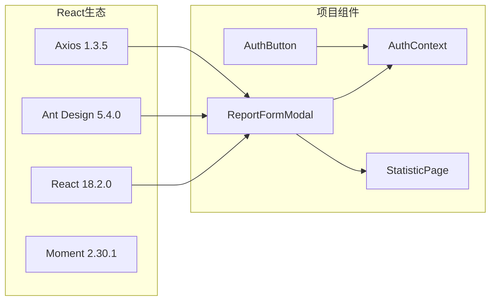

# 报表表单弹窗

<cite>
**本文档引用的文件**
- [ReportFormModal.jsx](file://client/src/pages/StatisticPage/ReportFormModal.jsx)
- [index.jsx](file://client/src/pages/StatisticPage/index.jsx)
- [AuthContext.jsx](file://client/src/context/AuthContext.jsx)
- [AuthButton.jsx](file://client/src/components/AuthButton.jsx)
- [report.js](file://server/routes/report.js)
- [admin.js](file://server/routes/admin.js)
- [Report.js](file://server/models/Report.js)
- [Admin.js](file://server/models/Admin.js)
- [app.js](file://server/app.js)
- [package.json](file://client/package.json)
</cite>

## 目录
1. [简介](#简介)
2. [项目结构](#项目结构)
3. [核心组件](#核心组件)
4. [架构概览](#架构概览)
5. [详细组件分析](#详细组件分析)
6. [依赖关系分析](#依赖关系分析)
7. [性能考虑](#性能考虑)
8. [故障排除指南](#故障排除指南)
9. [结论](#结论)
10. [附录](#附录)

## 简介

报表表单弹窗是WoaX项目中的一个关键功能组件，允许管理员用户提交统计数据上报。该组件提供了完整的表单验证、数据序列化、API调用和响应处理机制，同时集成了权限控制系统，确保只有经过身份验证的管理员才能执行敏感操作。

该组件采用现代化的React Hooks模式，结合Ant Design的表单组件和Axios进行HTTP通信，实现了用户友好的界面和可靠的后端集成。

## 项目结构

报表表单弹窗位于统计页面模块中，与相关的权限控制和数据展示组件共同构成完整的统计功能体系。



**图表来源**
- [ReportFormModal.jsx](file://client/src/pages/StatisticPage/ReportFormModal.jsx#L1-L107)
- [index.jsx](file://client/src/pages/StatisticPage/index.jsx#L1-L262)
- [AuthContext.jsx](file://client/src/context/AuthContext.jsx#L1-L155)
- [report.js](file://server/routes/report.js#L1-L271)

**章节来源**
- [ReportFormModal.jsx](file://client/src/pages/StatisticPage/ReportFormModal.jsx#L1-L107)
- [index.jsx](file://client/src/pages/StatisticPage/index.jsx#L1-L262)

## 核心组件

### 报表表单弹窗组件

ReportFormModal是一个受控的React组件，负责处理用户的数据上报表单。该组件具有以下核心特性：

- **表单验证**：使用Ant Design的Form组件进行实时验证
- **状态管理**：通过React Hooks管理表单状态和生命周期
- **权限控制**：集成认证上下文，确保只有管理员可以访问
- **数据处理**：提供数据序列化和API调用功能

### 权限控制机制

系统采用基于JWT的认证机制，通过AuthContext提供全局认证状态管理：

- **令牌验证**：自动检查本地存储的管理员令牌
- **实时状态更新**：根据认证状态动态调整UI行为
- **权限按钮封装**：AuthButton组件提供统一的权限控制接口

**章节来源**
- [ReportFormModal.jsx](file://client/src/pages/StatisticPage/ReportFormModal.jsx#L5-L107)
- [AuthContext.jsx](file://client/src/context/AuthContext.jsx#L1-L155)
- [AuthButton.jsx](file://client/src/components/AuthButton.jsx#L1-L43)

## 架构概览

报表表单弹窗的架构采用前后端分离的设计模式，实现了清晰的关注点分离和职责划分。



**图表来源**
- [ReportFormModal.jsx](file://client/src/pages/StatisticPage/ReportFormModal.jsx#L15-L38)
- [report.js](file://server/routes/report.js#L134-L176)

**章节来源**
- [ReportFormModal.jsx](file://client/src/pages/StatisticPage/ReportFormModal.jsx#L15-L38)
- [report.js](file://server/routes/report.js#L134-L176)

## 详细组件分析

### 报表表单弹窗组件详解

#### 组件结构和属性

ReportFormModal组件接受以下属性：
- `visible`: 控制弹窗显示状态
- `onCancel`: 弹窗取消回调函数
- `onSuccess`: 成功回调函数
- `projectId`: 关联的项目ID

#### 表单字段设计

组件包含以下必填字段，每个字段都配置了相应的验证规则：

| 字段名 | 标签 | 验证规则 | 用途 |
|--------|------|----------|------|
| username | 用户名 | 必填，长度>=3 | 上报用户标识 |
| ip | IP地址 | 必填，格式验证 | 用户网络信息 |
| userAgent | 用户代理 | 必填 | 浏览器和操作系统信息 |
| deviceInfo | 设备信息 | 必填 | 硬件设备描述 |
| location | 位置 | 必填 | 地理位置信息 |
| version | 版本 | 必填 | 软件版本号 |
| remark | 备注 | 必填 | 附加说明信息 |

#### 数据验证机制

表单验证采用Ant Design的Form.Item组件，支持：
- **实时验证**：用户输入时即时反馈
- **错误提示**：针对每个字段提供具体的错误信息
- **条件验证**：根据项目ID状态进行条件性验证

#### 错误处理策略

组件实现了多层次的错误处理：
- **前端验证错误**：表单字段验证失败
- **网络请求错误**：API调用失败
- **业务逻辑错误**：服务器返回的业务错误

**章节来源**
- [ReportFormModal.jsx](file://client/src/pages/StatisticPage/ReportFormModal.jsx#L47-L96)

### 权限控制机制

#### 认证上下文设计

AuthContext提供全局认证状态管理，包含以下核心功能：

- **认证状态跟踪**：`isAuthenticated`标志位
- **用户信息管理**：`adminUsername`存储当前登录用户
- **登录弹窗控制**：`isLoginModalVisible`管理登录对话框
- **令牌生命周期管理**：自动验证和刷新令牌

#### 权限按钮组件

AuthButton组件封装了权限控制逻辑：
- **智能提示**：未登录时显示权限要求提示
- **自动跳转**：未登录时自动打开登录弹窗
- **状态同步**：与认证上下文保持状态同步

#### 服务器端权限验证

后端使用verifyAdmin中间件确保API安全：
- **JWT令牌验证**：验证令牌的有效性和时效性
- **用户状态检查**：确认用户账户有效
- **权限继承**：为后续操作提供用户上下文

**章节来源**
- [AuthContext.jsx](file://client/src/context/AuthContext.jsx#L107-L112)
- [AuthButton.jsx](file://client/src/components/AuthButton.jsx#L12-L27)
- [admin.js](file://server/routes/admin.js#L100-L125)

### 数据流和状态管理

#### 表单状态管理

组件采用React Hooks进行状态管理：
- **表单实例**：`Form.useForm()`创建受控表单
- **生命周期**：`useEffect`处理弹窗关闭时的表单重置
- **异步状态**：`handleOk`函数管理提交流程

#### 加载状态处理

系统实现了完整的加载状态管理：
- **表单加载**：表单初始化时的加载指示
- **提交状态**：提交过程中的禁用和加载状态
- **错误状态**：错误发生时的状态标记

#### 数据同步机制

组件实现了双向数据同步：
- **表单重置**：弹窗关闭时自动重置表单字段
- **成功回调**：提交成功后的数据刷新
- **状态同步**：与父组件的状态保持同步

**章节来源**
- [ReportFormModal.jsx](file://client/src/pages/StatisticPage/ReportFormModal.jsx#L9-L13)
- [ReportFormModal.jsx](file://client/src/pages/StatisticPage/ReportFormModal.jsx#L15-L38)

### API集成和数据处理

#### 后端API设计

服务器端提供专门的报表API：
- **数据上报**：POST `/api/report/addReport`
- **数据查询**：GET `/api/report/user/:username`
- **聚合统计**：POST `/api/report/getReportData`
- **记录删除**：DELETE `/api/report/:id`

#### 数据序列化

提交的数据包含以下字段：
- **用户信息**：username, ip, userAgent, deviceInfo
- **产品信息**：location, version, remark
- **关联信息**：projectId, timestamp
- **系统信息**：自动添加的时间戳

#### 响应处理

API响应遵循统一的格式：
- **成功响应**：包含success标志和数据
- **错误响应**：包含错误信息和状态码
- **状态码规范**：使用标准HTTP状态码

**章节来源**
- [report.js](file://server/routes/report.js#L134-L176)
- [Report.js](file://server/models/Report.js#L3-L19)

## 依赖关系分析

### 前端依赖关系



**图表来源**
- [package.json](file://client/package.json#L5-L18)
- [ReportFormModal.jsx](file://client/src/pages/StatisticPage/ReportFormModal.jsx#L1-L3)

### 后端依赖关系

```mermaid
graph LR
subgraph "Node.js生态"
Koa[Koa 2.x]
Mongoose[Mongoose]
JWT[jsonwebtoken]
CORS[@koa/cors]
BodyParser[koa-bodyparser]
end
subgraph "路由模块"
ReportRoute[Report Route]
AdminRoute[Admin Route]
ProjectRoute[Project Route]
FeedbackRoute[Feedback Route]
VersionRoute[Version Route]
end
subgraph "模型层"
ReportModel[Report Model]
AdminModel[Admin Model]
ProjectModel[Project Model]
FeedbackModel[Feedback Model]
VersionModel[Version Model]
end
Koa --> ReportRoute
Koa --> AdminRoute
Mongoose --> ReportModel
Mongoose --> AdminModel
JWT --> AdminRoute
ReportRoute --> ReportModel
AdminRoute --> AdminModel
```

**图表来源**
- [app.js](file://server/app.js#L1-L61)
- [report.js](file://server/routes/report.js#L1-L6)
- [admin.js](file://server/routes/admin.js#L1-L6)

**章节来源**
- [package.json](file://client/package.json#L1-L47)
- [app.js](file://server/app.js#L1-L61)

## 性能考虑

### 前端性能优化

- **组件懒加载**：统计页面按需加载，减少初始包大小
- **表单缓存**：表单实例复用，避免重复创建
- **状态最小化**：只在必要时更新组件状态
- **内存管理**：及时清理事件监听器和定时器

### 后端性能优化

- **数据库索引**：为常用查询字段建立索引
- **聚合查询**：使用MongoDB聚合管道优化复杂查询
- **连接池管理**：合理配置数据库连接池
- **缓存策略**：对热点数据实施缓存

### 网络性能优化

- **请求合并**：减少不必要的API调用
- **数据压缩**：启用Gzip压缩传输
- **CDN加速**：静态资源使用CDN分发
- **预加载策略**：关键资源预加载

## 故障排除指南

### 常见问题及解决方案

#### 认证相关问题

**问题**：登录后仍然显示未认证状态
**原因**：本地存储的令牌过期或损坏
**解决**：清除浏览器本地存储，重新登录

**问题**：权限按钮始终显示锁定状态
**原因**：认证上下文未正确初始化
**解决**：检查AuthContext Provider的配置

#### 表单验证问题

**问题**：表单字段无法通过验证
**原因**：验证规则配置错误或数据格式不正确
**解决**：检查Form.Item的rules配置

**问题**：提交按钮无响应
**原因**：表单验证失败或项目ID为空
**解决**：确保所有必填字段都已正确填写

#### API调用问题

**问题**：提交数据后没有收到响应
**原因**：网络连接问题或服务器异常
**解决**：检查网络连接和服务器状态

**问题**：API返回401错误
**原因**：令牌无效或过期
**解决**：重新登录获取新令牌

**章节来源**
- [AuthContext.jsx](file://client/src/context/AuthContext.jsx#L25-L48)
- [ReportFormModal.jsx](file://client/src/pages/StatisticPage/ReportFormModal.jsx#L15-L38)

## 结论

报表表单弹窗组件展现了现代Web应用开发的最佳实践，成功地将用户界面、数据验证、权限控制和API集成整合在一个功能完整的组件中。

该组件的主要优势包括：
- **完整的权限控制**：从UI层面到API层面的多层保护
- **健壮的错误处理**：覆盖前端、网络和业务逻辑各个层面
- **良好的用户体验**：直观的表单设计和及时的反馈机制
- **可维护的代码结构**：清晰的组件分离和职责划分

通过这个组件，开发者可以快速理解和扩展类似的功能需求，为构建更复杂的企业级应用奠定了坚实的基础。

## 附录

### 使用示例

#### 基本使用方式

```jsx
// 在统计页面中使用
<ReportFormModal
  visible={isReportModalVisible}
  onCancel={handleCloseReportModal}
  onSuccess={handleReportSuccess}
  projectId={currentProject?._id}
/>
```

#### 自定义配置选项

组件支持以下自定义配置：
- **表单字段定制**：通过修改Form.Item配置添加或删除字段
- **验证规则定制**：根据业务需求调整验证规则
- **样式定制**：通过CSS类名覆盖默认样式
- **行为定制**：通过回调函数扩展功能

### 集成指南

#### 与现有系统的集成

1. **导入组件**：从统计页面模块导入ReportFormModal
2. **状态管理**：在父组件中管理弹窗的显示状态
3. **回调处理**：实现onSuccess和onCancel回调函数
4. **权限集成**：通过AuthButton组件集成权限控制

#### 扩展开发建议

1. **字段扩展**：根据业务需求添加新的表单字段
2. **验证增强**：实现更复杂的验证逻辑
3. **样式定制**：提供主题定制能力
4. **国际化支持**：添加多语言支持

**章节来源**
- [index.jsx](file://client/src/pages/StatisticPage/index.jsx#L251-L257)
- [ReportFormModal.jsx](file://client/src/pages/StatisticPage/ReportFormModal.jsx#L47-L103)