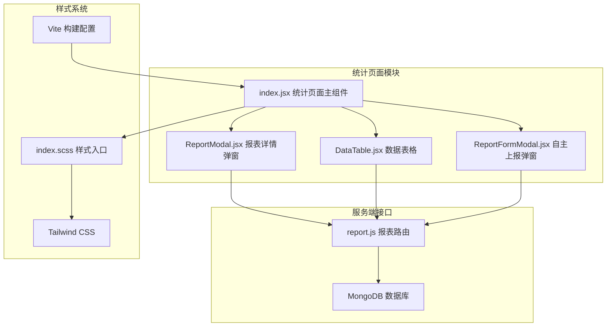
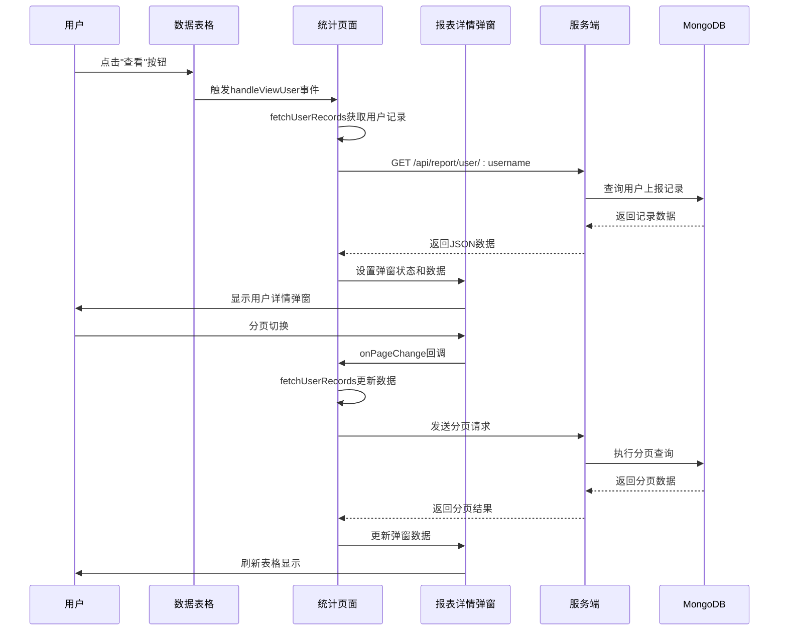
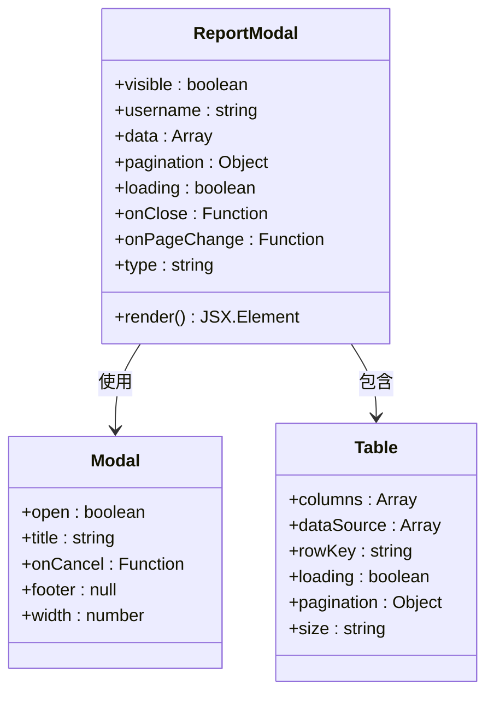
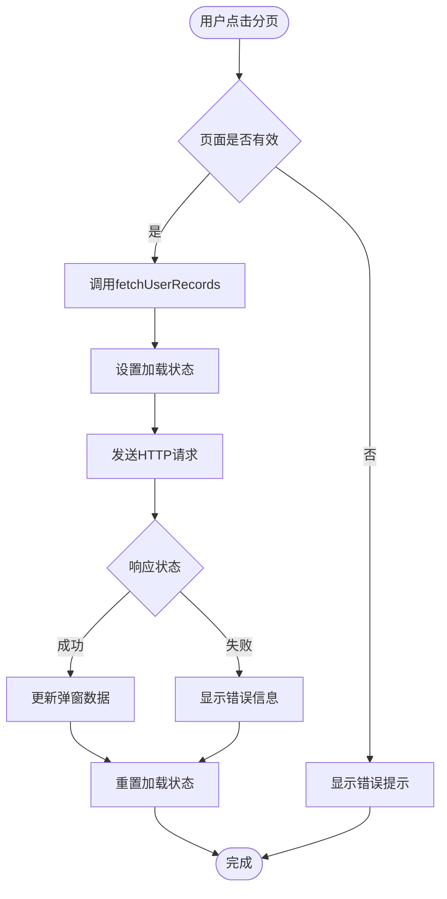
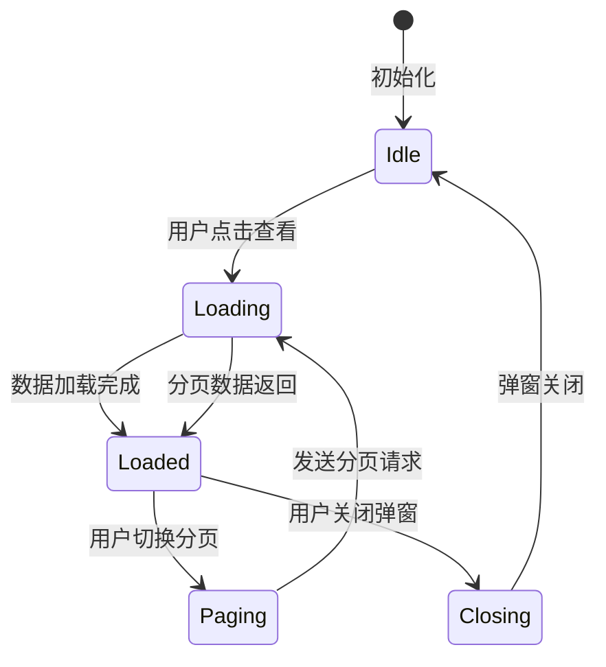
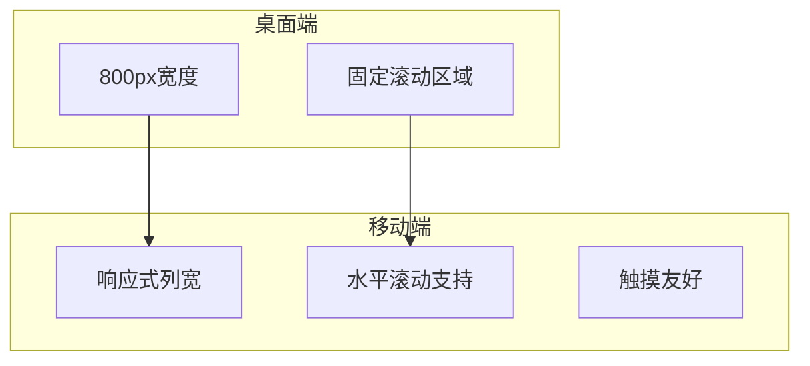
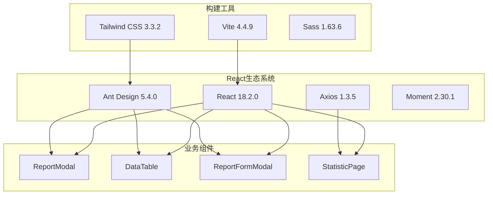
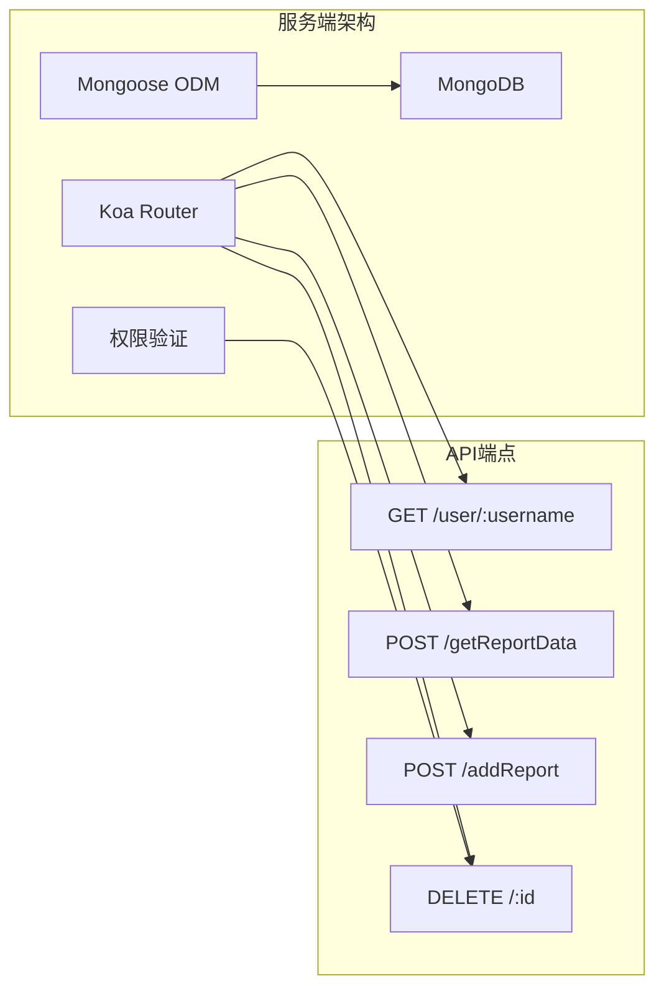
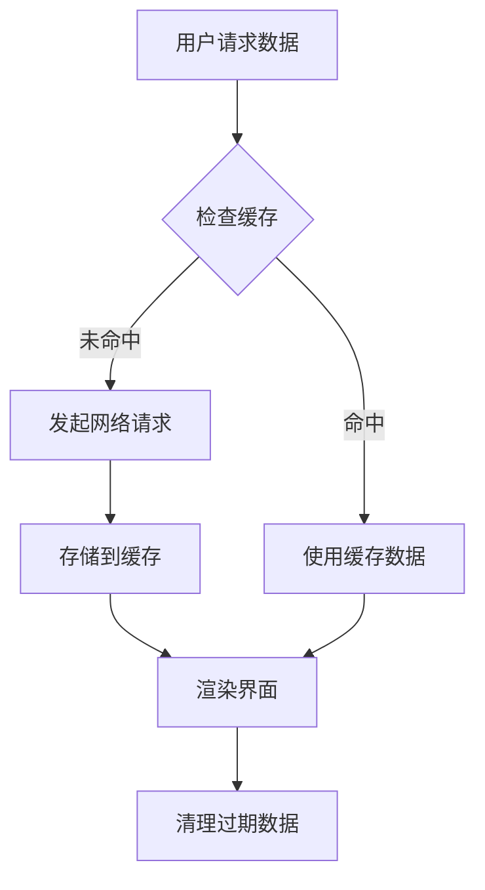
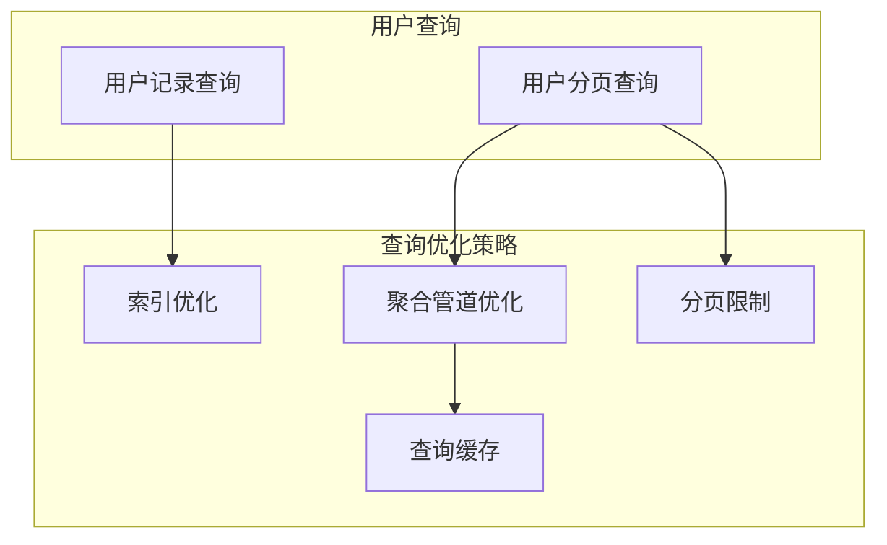

# 报表详情弹窗

<cite>
**本文档引用的文件**
- [ReportModal.jsx](file://client/src/pages/StatisticPage/ReportModal.jsx)
- [index.jsx](file://client/src/pages/StatisticPage/index.jsx)
- [DataTable.jsx](file://client/src/pages/StatisticPage/DataTable.jsx)
- [ReportFormModal.jsx](file://client/src/pages/StatisticPage/ReportFormModal.jsx)
- [report.js](file://server/routes/report.js)
- [index.scss](file://client/src/styles/index.scss)
- [tailwind.config.js](file://client/tailwind.config.js)
- [vite.config.js](file://client/vite.config.js)
- [package.json](file://client/package.json)
</cite>

## 目录
1. [简介](#简介)
2. [项目结构](#项目结构)
3. [核心组件](#核心组件)
4. [架构概览](#架构概览)
5. [详细组件分析](#详细组件分析)
6. [依赖关系分析](#依赖关系分析)
7. [性能考虑](#性能考虑)
8. [故障排除指南](#故障排除指南)
9. [结论](#结论)
10. [附录](#附录)

## 简介

报表详情弹窗是WoaX项目中的一个关键功能模块，专门用于展示用户的详细上报记录。该弹窗提供了用户历史记录的查询和显示功能，支持分页加载机制来处理大量用户数据的分批获取和展示。弹窗采用现代化的交互设计，包括打开关闭动画、数据刷新和状态同步机制。

该功能模块基于React和Ant Design构建，实现了完整的用户详情展示流程，从数据获取到界面渲染的全过程都经过精心设计和优化。

## 项目结构

报表详情弹窗功能位于统计页面的子模块中，采用模块化的设计方式，便于维护和扩展。



**图表来源**
- [index.jsx](file://client/src/pages/StatisticPage/index.jsx#L1-L262)
- [ReportModal.jsx](file://client/src/pages/StatisticPage/ReportModal.jsx#L1-L51)
- [report.js](file://server/routes/report.js#L1-L271)

**章节来源**
- [index.jsx](file://client/src/pages/StatisticPage/index.jsx#L1-L262)
- [ReportModal.jsx](file://client/src/pages/StatisticPage/ReportModal.jsx#L1-L51)

## 核心组件

### 报表详情弹窗组件

报表详情弹窗是本功能的核心组件，负责展示用户的详细上报历史记录。该组件具有以下特点：

- **类型化设计**：通过type属性区分不同的展示模式
- **分页支持**：内置完整的分页机制，支持大数据量的分批加载
- **响应式布局**：根据屏幕尺寸自动调整显示效果
- **数据格式化**：对时间戳等数据进行格式化处理

### 数据表格组件

数据表格组件提供用户列表的展示功能，支持：
- 列宽自适应和固定宽度设置
- 数据溢出处理和提示功能
- 操作按钮的权限控制

### 自主上报弹窗

自主上报弹窗允许管理员手动添加上报数据，包含完整的表单验证和错误处理机制。

**章节来源**
- [ReportModal.jsx](file://client/src/pages/StatisticPage/ReportModal.jsx#L14-L49)
- [DataTable.jsx](file://client/src/pages/StatisticPage/DataTable.jsx#L6-L93)
- [ReportFormModal.jsx](file://client/src/pages/StatisticPage/ReportFormModal.jsx#L5-L107)

## 架构概览

报表详情弹窗功能采用前后端分离的架构设计，实现了清晰的职责划分和良好的可维护性。



**图表来源**
- [index.jsx](file://client/src/pages/StatisticPage/index.jsx#L127-L171)
- [ReportModal.jsx](file://client/src/pages/StatisticPage/ReportModal.jsx#L12-L49)
- [report.js](file://server/routes/report.js#L90-L131)

## 详细组件分析

### 报表详情弹窗组件详解

报表详情弹窗组件采用了类型化的设计模式，通过type属性来区分不同的展示场景。

#### 组件结构分析



**图表来源**
- [ReportModal.jsx](file://client/src/pages/StatisticPage/ReportModal.jsx#L4-L13)

#### 数据列配置

弹窗中的表格列配置针对用户记录进行了专门优化：

| 列名 | 字段名 | 类型 | 功能描述 |
|------|--------|------|----------|
| 时间 | timestamp | 时间戳 | 显示记录创建时间，自动格式化为本地时间 |
| 版本号 | version | 字符串 | 显示软件版本信息 |
| 备注 | remark | 字符串 | 显示用户备注信息，支持溢出省略 |
| 设备信息 | deviceInfo | 字符串 | 显示设备相关信息，支持溢出省略 |

#### 分页机制实现

弹窗内置了完整的分页处理机制：



**图表来源**
- [index.jsx](file://client/src/pages/StatisticPage/index.jsx#L127-L171)
- [ReportModal.jsx](file://client/src/pages/StatisticPage/ReportModal.jsx#L35-L42)

**章节来源**
- [ReportModal.jsx](file://client/src/pages/StatisticPage/ReportModal.jsx#L14-L49)

### 数据格式化和展示逻辑

#### 时间戳转换机制

系统实现了统一的时间戳格式化处理：


**图表来源**
- [ReportModal.jsx](file://client/src/pages/StatisticPage/ReportModal.jsx#L16)
- [DataTable.jsx](file://client/src/pages/StatisticPage/DataTable.jsx#L35)

#### 数据类型处理

系统对不同类型的数据进行了专门的处理：

- **字符串类型**：支持溢出省略显示，通过Tooltip提供完整信息
- **时间戳类型**：自动转换为本地化时间格式
- **数值类型**：保持原格式显示

**章节来源**
- [ReportModal.jsx](file://client/src/pages/StatisticPage/ReportModal.jsx#L16-L19)
- [DataTable.jsx](file://client/src/pages/StatisticPage/DataTable.jsx#L45-L71)

### 弹窗交互设计

#### 打开关闭动画

弹窗采用Ant Design的默认动画效果，提供了流畅的用户体验：

- **打开动画**：淡入效果，持续时间适中
- **关闭动画**：淡出效果，确保视觉连贯性
- **遮罩层**：半透明背景，突出弹窗内容

#### 数据刷新和状态同步

系统实现了完整的数据刷新机制：



**图表来源**
- [index.jsx](file://client/src/pages/StatisticPage/index.jsx#L156-L178)

**章节来源**
- [index.jsx](file://client/src/pages/StatisticPage/index.jsx#L156-L178)

### 响应式设计和移动端适配

#### 响应式布局策略

系统采用了多层次的响应式设计：

- **桌面端**：800px宽度的固定弹窗，适合大屏幕浏览
- **平板端**：自动调整表格列宽，确保内容可读性
- **移动端**：通过滚动条处理溢出内容

#### 移动端优化



**图表来源**
- [ReportModal.jsx](file://client/src/pages/StatisticPage/ReportModal.jsx#L28)
- [DataTable.jsx](file://client/src/pages/StatisticPage/DataTable.jsx#L96-L107)

**章节来源**
- [ReportModal.jsx](file://client/src/pages/StatisticPage/ReportModal.jsx#L28)
- [DataTable.jsx](file://client/src/pages/StatisticPage/DataTable.jsx#L96-L107)

### 弹窗自定义选项

#### 内容定制

弹窗支持多种内容定制选项：

- **列配置**：可根据需求添加更多字段列
- **样式调整**：通过CSS类名自定义外观
- **交互行为**：支持自定义按钮和操作

#### 样式调整方法

系统提供了灵活的样式调整机制：

- **全局样式**：通过SCSS变量统一管理
- **局部样式**：组件内部的样式覆盖
- **Tailwind集成**：利用实用类快速样式调整

**章节来源**
- [ReportModal.jsx](file://client/src/pages/StatisticPage/ReportModal.jsx#L22-L46)
- [index.scss](file://client/src/styles/index.scss#L1-L36)

## 依赖关系分析

### 前端依赖关系



**图表来源**
- [package.json](file://client/package.json#L5-L18)
- [vite.config.js](file://client/vite.config.js#L1-L50)

### 后端依赖关系

服务端采用Koa框架和MongoDB数据库，实现了RESTful API设计：



**图表来源**
- [report.js](file://server/routes/report.js#L1-L271)

**章节来源**
- [package.json](file://client/package.json#L5-L18)
- [report.js](file://server/routes/report.js#L1-L271)

## 性能考虑

### 前端性能优化

#### 分页加载策略

系统采用了智能的分页加载策略来优化性能：

- **按需加载**：只在用户需要时才加载数据
- **缓存机制**：避免重复请求相同数据
- **并发控制**：限制同时进行的请求数量

#### 内存管理



#### 渲染优化

- **虚拟滚动**：对于超大数据集，考虑实现虚拟滚动
- **懒加载**：延迟加载非关键资源
- **代码分割**：按需加载组件代码

### 后端性能优化

#### 数据库查询优化



**图表来源**
- [report.js](file://server/routes/report.js#L90-L131)

**章节来源**
- [report.js](file://server/routes/report.js#L90-L131)

## 故障排除指南

### 常见问题及解决方案

#### 数据加载失败

**问题症状**：弹窗无法显示用户记录，出现加载错误

**可能原因**：
- 网络连接异常
- 服务端API不可用
- 用户名参数错误

**解决步骤**：
1. 检查网络连接状态
2. 验证服务端API运行状态
3. 确认用户名参数格式正确

#### 分页功能异常

**问题症状**：分页切换无效或数据不更新

**可能原因**：
- 分页参数传递错误
- 状态管理问题
- API响应格式不正确

**解决步骤**：
1. 检查onPageChange回调函数
2. 验证分页状态更新逻辑
3. 确认API响应数据结构

#### 样式显示问题

**问题症状**：弹窗样式错乱或显示异常

**可能原因**：
- CSS类名冲突
- Tailwind配置问题
- 响应式断点设置

**解决步骤**：
1. 检查CSS类名使用
2. 验证Tailwind配置
3. 测试不同屏幕尺寸下的显示效果

**章节来源**
- [index.jsx](file://client/src/pages/StatisticPage/index.jsx#L127-L171)
- [ReportModal.jsx](file://client/src/pages/StatisticPage/ReportModal.jsx#L35-L42)

### 调试技巧

#### 开发环境调试

- 使用浏览器开发者工具监控网络请求
- 检查Redux DevTools（如使用）的状态变化
- 利用React Developer Tools分析组件树

#### 生产环境监控

- 实施错误边界捕获未处理异常
- 记录详细的错误日志
- 设置性能指标监控

## 结论

报表详情弹窗功能模块展现了现代Web应用开发的最佳实践。通过合理的架构设计、完善的分页机制和优雅的用户界面，该功能模块为用户提供了优秀的数据查看体验。

主要优势包括：
- **模块化设计**：清晰的组件职责划分
- **性能优化**：智能的分页加载策略
- **用户体验**：流畅的交互和响应式设计
- **可维护性**：规范的代码结构和文档

未来可以考虑的改进方向：
- 实现虚拟滚动以支持更大的数据集
- 添加搜索和筛选功能
- 优化移动端触摸体验
- 增强错误处理和用户反馈机制

## 附录

### 使用示例

#### 基本使用方法

```javascript
// 在统计页面中使用
<ReportModal
  visible={isModalVisible}
  username={selectedUser}
  data={userRecords}
  loading={userRecordsLoading}
  pagination={{
    current: userRecordsPage,
    pageSize: userRecordsPageSize,
    total: userRecordsTotal
  }}
  onPageChange={handleUserRecordsChange}
  onClose={handleModalClose}
  type="userRecords"
/>
```

#### 高级配置选项

```javascript
// 自定义列配置
const customColumns = [
  { 
    title: '自定义列',
    dataIndex: 'customField',
    key: 'customField',
    render: (text) => <CustomRenderer value={text} />
  }
];

// 自定义分页设置
const customPagination = {
  ...pagination,
  showSizeChanger: true,
  pageSizeOptions: [10, 25, 50, 100],
  showTotal: (total) => `共 ${total} 条记录`
};
```

### 最佳实践

#### 代码组织建议

- 将公共逻辑提取到自定义Hook中
- 使用TypeScript提高代码质量
- 实施单元测试覆盖关键功能
- 编写详细的组件文档

#### 性能优化建议

- 实施防抖和节流机制
- 优化图片和资源加载
- 使用Web Workers处理复杂计算
- 实施缓存策略减少重复请求

#### 安全考虑

- 对用户输入进行严格验证
- 实施CSRF保护
- 使用HTTPS加密传输
- 定期更新依赖包修复安全漏洞