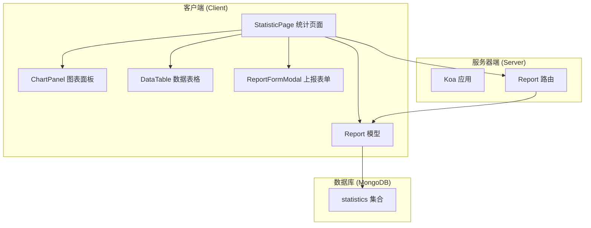
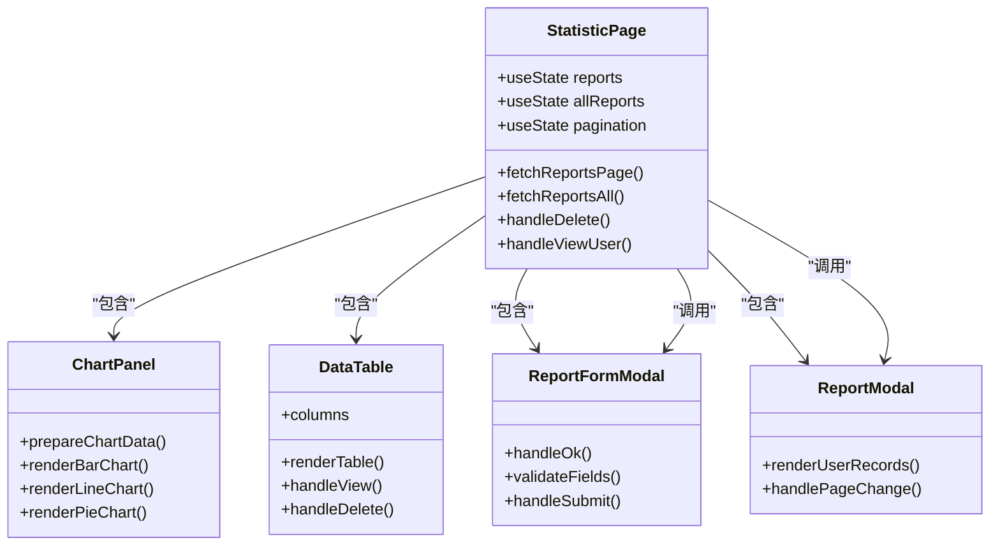
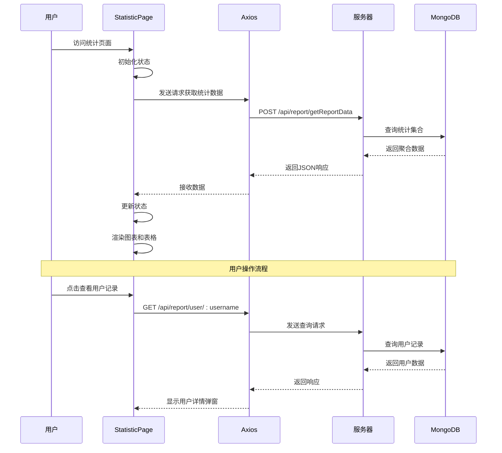
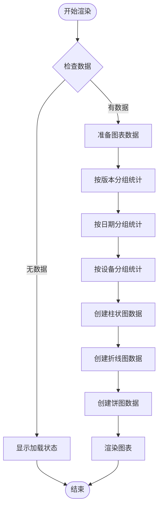
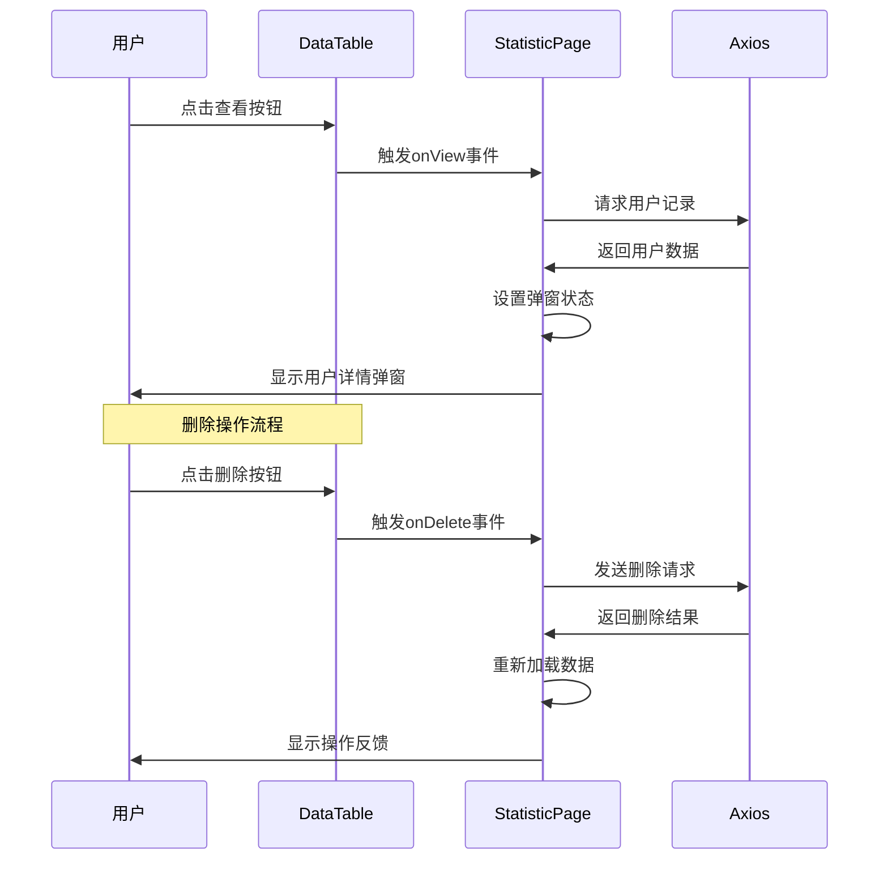
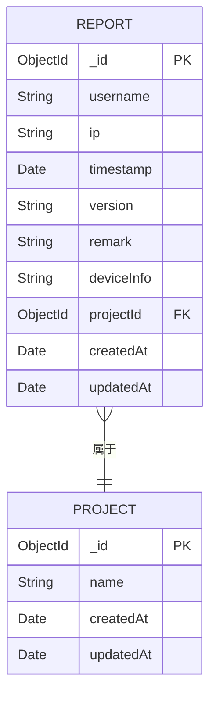
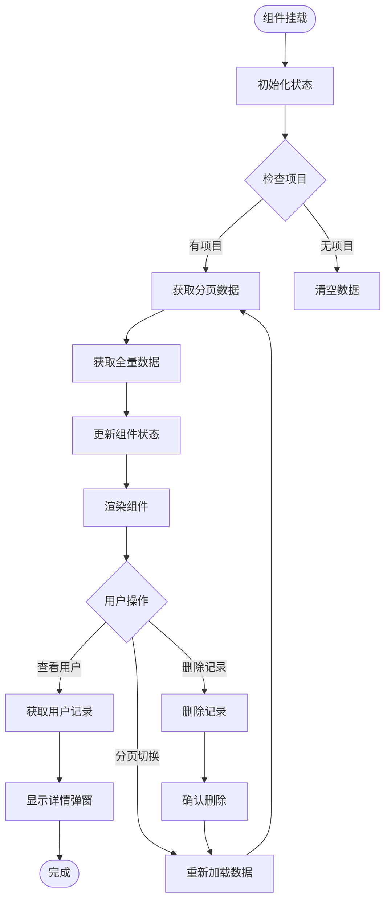
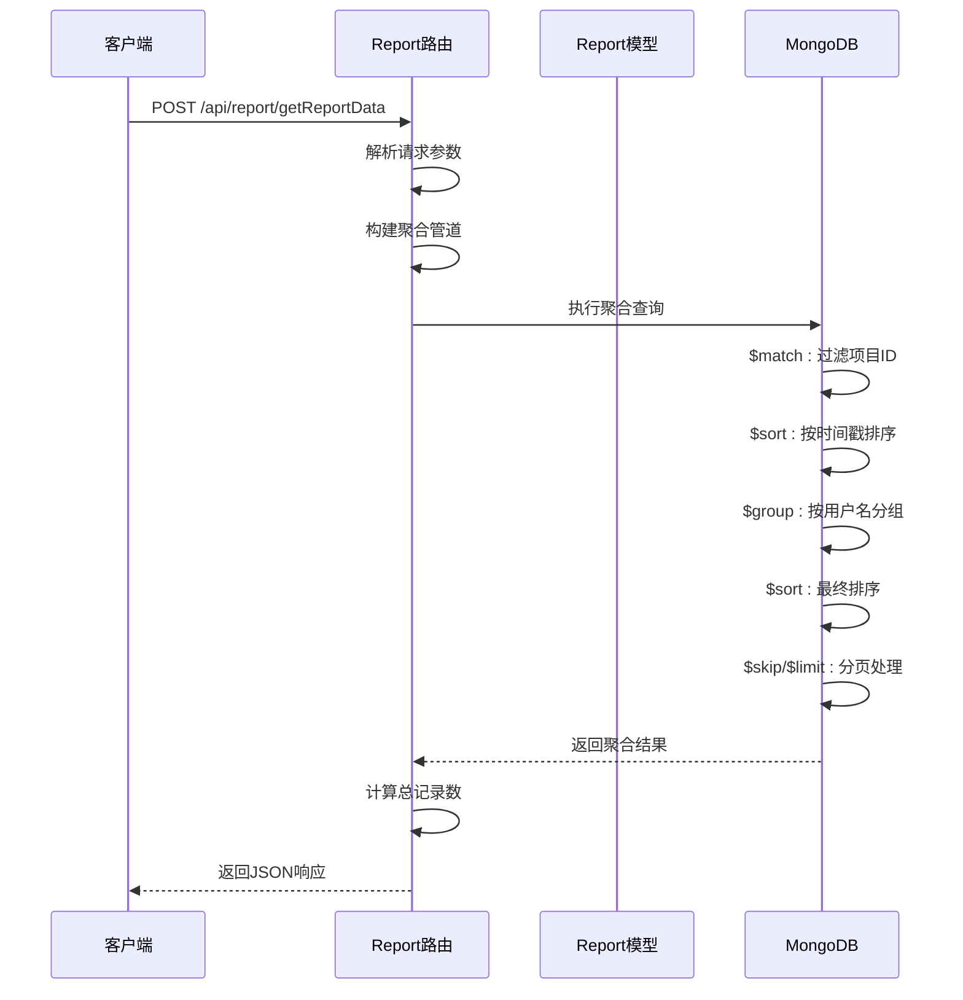

# 数据统计模块

<cite>
**本文档引用的文件**
- [client/src/pages/StatisticPage/index.jsx](file://client/src/pages/StatisticPage/index.jsx)
- [client/src/pages/StatisticPage/ChartPanel.jsx](file://client/src/pages/StatisticPage/ChartPanel.jsx)
- [client/src/pages/StatisticPage/DataTable.jsx](file://client/src/pages/StatisticPage/DataTable.jsx)
- [client/src/pages/StatisticPage/ReportFormModal.jsx](file://client/src/pages/StatisticPage/ReportFormModal.jsx)
- [client/src/pages/StatisticPage/ReportModal.jsx](file://client/src/pages/StatisticPage/ReportModal.jsx)
- [server/models/Report.js](file://server/models/Report.js)
- [server/routes/report.js](file://server/routes/report.js)
- [client/src/App.jsx](file://client/src/App.jsx)
- [server/app.js](file://server/app.js)
- [client/package.json](file://client/package.json)
- [server/package.json](file://server/package.json)
- [db/woax.statistics.json](file://db/woax.statistics.json)
</cite>

## 目录
1. [简介](#简介)
2. [项目结构](#项目结构)
3. [核心组件](#核心组件)
4. [架构概览](#架构概览)
5. [详细组件分析](#详细组件分析)
6. [数据模型设计](#数据模型设计)
7. [API接口规范](#api接口规范)
8. [数据流分析](#数据流分析)
9. [性能优化策略](#性能优化策略)
10. [故障排除指南](#故障排除指南)
11. [结论](#结论)

## 简介

数据统计模块是WoaX项目中的核心功能模块，负责展示和管理应用程序的统计数据。该模块提供了直观的图表可视化界面和详细的数据表格，支持管理员进行数据上报、查看用户详细记录以及进行数据删除操作。模块采用前后端分离架构，前端使用React + Ant Design + Recharts技术栈，后端基于Koa.js + MongoDB构建。

## 项目结构

数据统计模块位于客户端的页面组件目录中，采用清晰的组件化架构设计：



**图表来源**
- [client/src/pages/StatisticPage/index.jsx](file://client/src/pages/StatisticPage/index.jsx#L1-L262)
- [server/routes/report.js](file://server/routes/report.js#L1-L271)
- [server/models/Report.js](file://server/models/Report.js#L1-L22)

**章节来源**
- [client/src/pages/StatisticPage/index.jsx](file://client/src/pages/StatisticPage/index.jsx#L1-L262)
- [client/src/App.jsx](file://client/src/App.jsx#L1-L253)

## 核心组件

数据统计模块由以下核心组件构成：

### 主要组件职责

| 组件名称 | 主要功能 | 技术实现 |
|---------|----------|----------|
| StatisticPage | 主页面容器，管理状态和数据流 | React Hooks + Ant Design |
| ChartPanel | 图表可视化组件，展示统计数据 | Recharts + Ant Design Card |
| DataTable | 数据表格组件，显示统计记录 | Ant Design Table + 分页 |
| ReportFormModal | 自主上报表单，管理员专用 | Ant Design Modal + Form |
| ReportModal | 用户详情弹窗，查看用户记录 | Ant Design Modal + Table |

### 组件关系图



**图表来源**
- [client/src/pages/StatisticPage/index.jsx](file://client/src/pages/StatisticPage/index.jsx#L12-L262)
- [client/src/pages/StatisticPage/ChartPanel.jsx](file://client/src/pages/StatisticPage/ChartPanel.jsx#L8-L129)
- [client/src/pages/StatisticPage/DataTable.jsx](file://client/src/pages/StatisticPage/DataTable.jsx#L6-L124)

**章节来源**
- [client/src/pages/StatisticPage/index.jsx](file://client/src/pages/StatisticPage/index.jsx#L1-L262)
- [client/src/pages/StatisticPage/ChartPanel.jsx](file://client/src/pages/StatisticPage/ChartPanel.jsx#L1-L129)
- [client/src/pages/StatisticPage/DataTable.jsx](file://client/src/pages/StatisticPage/DataTable.jsx#L1-L124)

## 架构概览

数据统计模块采用现代化的全栈架构，实现了前后端分离和数据可视化：



**图表来源**
- [client/src/pages/StatisticPage/index.jsx](file://client/src/pages/StatisticPage/index.jsx#L58-L171)
- [server/routes/report.js](file://server/routes/report.js#L9-L131)

## 详细组件分析

### ChartPanel 图表组件

ChartPanel组件负责将统计数据转换为多种图表形式，提供直观的数据可视化：

#### 图表类型与数据准备



**图表来源**
- [client/src/pages/StatisticPage/ChartPanel.jsx](file://client/src/pages/StatisticPage/ChartPanel.jsx#L10-L53)

#### 图表特性

| 图表类型 | 数据源 | 可视化方式 | 交互功能 |
|---------|--------|-----------|----------|
| 版本分布柱状图 | 版本统计 | 柱状图展示数量 | 鼠标悬停显示数值 |
| 时间趋势折线图 | 日期统计 | 折线图展示趋势 | 响应式布局 |
| 设备分布饼图 | 设备统计 | 饼图展示占比 | 颜色编码 |

**章节来源**
- [client/src/pages/StatisticPage/ChartPanel.jsx](file://client/src/pages/StatisticPage/ChartPanel.jsx#L1-L129)

### DataTable 数据表格组件

DataTable组件提供完整的数据展示和操作功能：

#### 表格列定义

| 列名 | 字段 | 宽度 | 功能 |
|------|------|------|------|
| 序号 | index | 80px | 自动编号 |
| 用户名 | username | 120px | 文本截断显示 |
| IP地址 | ip | 120px | 文本截断显示 |
| 时间 | timestamp | 170px | 本地化时间格式 |
| 版本号 | version | 100px | 文本截断显示 |
| 备注 | remark | 150px | 工具提示 |
| 设备信息 | deviceInfo | 150px | 工具提示 |
| 操作 | action | 120px | 查看/删除按钮 |

#### 表格交互流程



**图表来源**
- [client/src/pages/StatisticPage/DataTable.jsx](file://client/src/pages/StatisticPage/DataTable.jsx#L76-L92)
- [client/src/pages/StatisticPage/index.jsx](file://client/src/pages/StatisticPage/index.jsx#L127-L171)

**章节来源**
- [client/src/pages/StatisticPage/DataTable.jsx](file://client/src/pages/StatisticPage/DataTable.jsx#L1-L124)

### ReportFormModal 上报表单组件

ReportFormModal为管理员提供自主上报功能：

#### 表单字段验证

| 字段名 | 必填 | 验证规则 | 用途 |
|--------|------|----------|------|
| username | 是 | 必填字段 | 用户标识 |
| ip | 是 | 必填字段 | IP地址 |
| userAgent | 是 | 必填字段 | 浏览器信息 |
| deviceInfo | 是 | 必填字段 | 设备信息 |
| location | 是 | 必填字段 | 地理位置 |
| version | 是 | 必填字段 | 版本号 |
| remark | 是 | 必填字段 | 备注说明 |

**章节来源**
- [client/src/pages/StatisticPage/ReportFormModal.jsx](file://client/src/pages/StatisticPage/ReportFormModal.jsx#L1-L107)

### ReportModal 用户详情组件

ReportModal专门用于展示用户的完整上报记录历史：

#### 用户记录展示

| 字段 | 类型 | 显示方式 |
|------|------|----------|
| 时间 | Date | 本地化时间格式 |
| 版本号 | String | 文本显示 |
| 备注 | String | 文本截断显示 |
| 设备信息 | String | 文本截断显示 |

**章节来源**
- [client/src/pages/StatisticPage/ReportModal.jsx](file://client/src/pages/StatisticPage/ReportModal.jsx#L1-L51)

## 数据模型设计

### Report 数据模型

Report模型定义了统计数据的结构和约束条件：



**图表来源**
- [server/models/Report.js](file://server/models/Report.js#L3-L19)

### 字段详细说明

| 字段名 | 类型 | 必填 | 描述 | 约束 |
|--------|------|------|------|------|
| _id | ObjectId | 是 | 数据唯一标识 | 自动生成 |
| username | String | 是 | 用户名 | 必填 |
| ip | String | 否 | IP地址 | 可为空 |
| timestamp | Date | 否 | 时间戳 | 默认当前时间 |
| version | String | 否 | 版本号 | 可为空 |
| remark | String | 否 | 备注 | 可为空 |
| deviceInfo | String | 否 | 设备信息 | 可为空 |
| projectId | ObjectId | 是 | 项目关联 | 必须关联有效项目 |
| createdAt | Date | 否 | 创建时间 | 自动生成 |
| updatedAt | Date | 否 | 更新时间 | 自动生成 |

**章节来源**
- [server/models/Report.js](file://server/models/Report.js#L1-L22)

## API接口规范

### 统计数据接口

#### 获取聚合统计数据

**请求方法**: POST `/api/report/getReportData`

**请求参数**:
```javascript
{
  pageCurrent: number,    // 当前页码，默认1
  pageSize: number,       // 每页条数，默认20
  projectId: string       // 项目ID，必填
}
```

**响应格式**:
```javascript
{
  success: boolean,
  data: Array,           // 统计数据数组
  total: number          // 总记录数
}
```

#### 获取用户详细记录

**请求方法**: GET `/api/report/user/:username`

**查询参数**:
```javascript
{
  page: number,          // 页码，默认1
  pageSize: number,      // 每页条数，默认10
  projectId: string       // 项目ID，必填
}
```

**响应格式**:
```javascript
{
  success: boolean,
  data: Array,           // 用户记录数组
  total: number,         // 总记录数
  page: number,          // 当前页码
  pageSize: number       // 每页条数
}
```

#### 自主上报数据

**请求方法**: POST `/api/report/addReport`

**请求参数**:
```javascript
{
  username: string,      // 用户名，必填
  ip: string,            // IP地址，可选
  userAgent: string,     // 用户代理，必填
  deviceInfo: string,    // 设备信息，必填
  location: string,      // 位置，必填
  version: string,       // 版本，必填
  remark: string,        // 备注，必填
  projectId: string      // 项目ID，必填
}
```

**响应格式**:
```javascript
{
  success: boolean,
  message: string,
  data: Object           // 新创建的报告记录
}
```

**章节来源**
- [server/routes/report.js](file://server/routes/report.js#L9-L176)

## 数据流分析

### 前端数据流



**图表来源**
- [client/src/pages/StatisticPage/index.jsx](file://client/src/pages/StatisticPage/index.jsx#L34-L171)

### 后端数据聚合流程



**图表来源**
- [server/routes/report.js](file://server/routes/report.js#L26-L79)

**章节来源**
- [client/src/pages/StatisticPage/index.jsx](file://client/src/pages/StatisticPage/index.jsx#L58-L171)
- [server/routes/report.js](file://server/routes/report.js#L8-L88)

## 性能优化策略

### 前端性能优化

1. **数据懒加载**: ChartPanel组件仅在有数据时渲染图表，避免空数据时的计算开销
2. **分页策略**: 使用合理的pageSize值(默认20)，减少单次请求数据量
3. **状态管理**: 使用React Hooks进行局部状态管理，避免不必要的重渲染
4. **图表优化**: Recharts组件自动处理图表的响应式和性能优化

### 后端性能优化

1. **聚合查询**: 使用MongoDB聚合管道进行服务器端分组和排序
2. **索引优化**: 建议在projectId和timestamp字段上建立复合索引
3. **分页优化**: 使用$skip和$limit进行高效分页
4. **内存管理**: 控制单次查询返回的最大数据量(ChartPanel使用100000限制)

### 数据库优化建议

```javascript
// 建议的索引配置
db.statistics.createIndex({ "projectId": 1, "timestamp": -1 })
db.statistics.createIndex({ "username": 1 })
db.statistics.createIndex({ "timestamp": -1 })
```

**章节来源**
- [client/src/pages/StatisticPage/ChartPanel.jsx](file://client/src/pages/StatisticPage/ChartPanel.jsx#L88-L109)
- [server/routes/report.js](file://server/routes/report.js#L26-L51)

## 故障排除指南

### 常见问题及解决方案

#### 图表不显示或显示空白

**可能原因**:
1. 项目ID未正确设置
2. 数据格式不符合预期
3. 网络请求失败

**解决步骤**:
1. 检查当前项目是否正确选择
2. 验证数据格式是否包含必需字段
3. 查看浏览器控制台网络请求状态

#### 表格数据加载缓慢

**可能原因**:
1. 数据量过大
2. 网络延迟
3. 分页参数不合理

**优化建议**:
1. 调整pageSize参数
2. 实施数据缓存策略
3. 优化数据库查询索引

#### 图表渲染异常

**可能原因**:
1. Recharts库版本冲突
2. 数据格式不正确
3. 组件卸载时的状态更新

**调试方法**:
1. 检查数据结构是否符合图表要求
2. 验证颜色配置和数据键名
3. 确认组件生命周期内的状态管理

**章节来源**
- [client/src/pages/StatisticPage/ChartPanel.jsx](file://client/src/pages/StatisticPage/ChartPanel.jsx#L55-L126)
- [client/src/pages/StatisticPage/index.jsx](file://client/src/pages/StatisticPage/index.jsx#L111-L125)

## 结论

数据统计模块通过精心设计的组件架构和数据流，为用户提供了完整的数据可视化和管理功能。模块采用了现代化的技术栈，具有良好的扩展性和维护性。

### 主要优势

1. **组件化设计**: 清晰的组件职责划分，便于维护和测试
2. **数据可视化**: 丰富的图表类型满足不同场景需求
3. **权限控制**: 完善的管理员权限验证机制
4. **响应式设计**: 适配不同屏幕尺寸的用户界面
5. **性能优化**: 合理的分页策略和数据加载机制

### 改进建议

1. **数据导出功能**: 可考虑添加CSV/Excel导出功能
2. **搜索过滤**: 增加基于用户名、版本号等字段的搜索功能
3. **实时更新**: 实现WebSocket实现实时数据更新
4. **数据验证**: 增强前端和后端的数据验证机制
5. **缓存策略**: 实施更高效的缓存策略提升性能

该模块为WoaX项目提供了强大的数据统计能力，为后续的功能扩展奠定了坚实的基础。