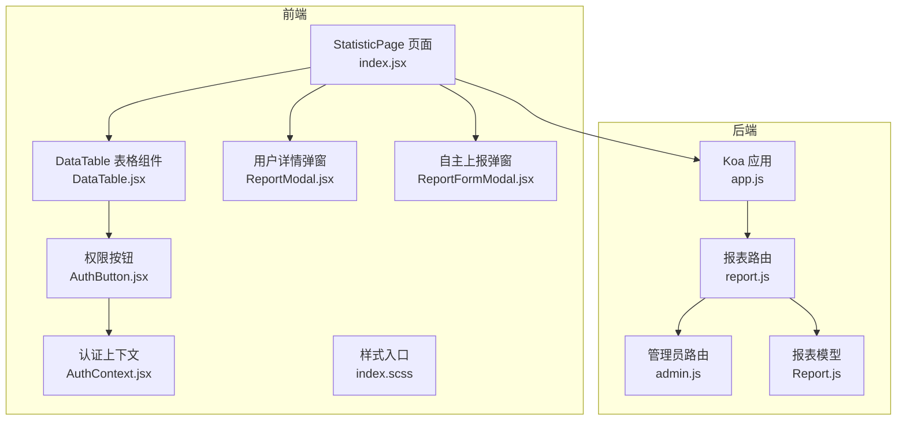
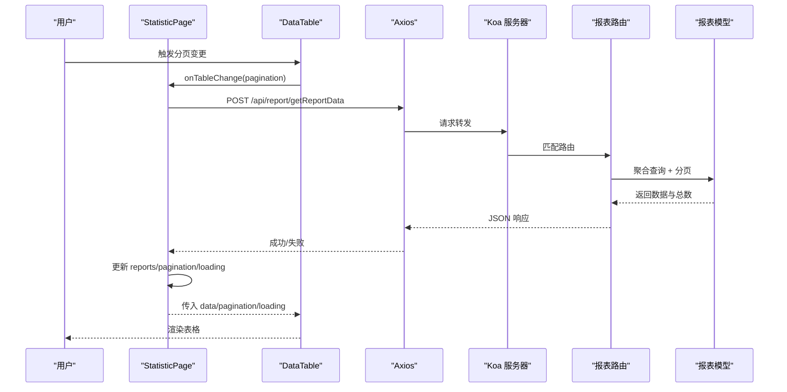
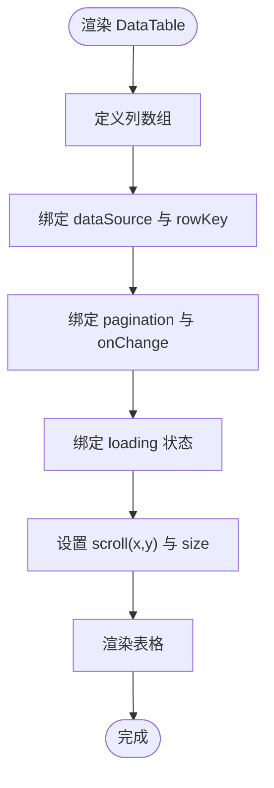
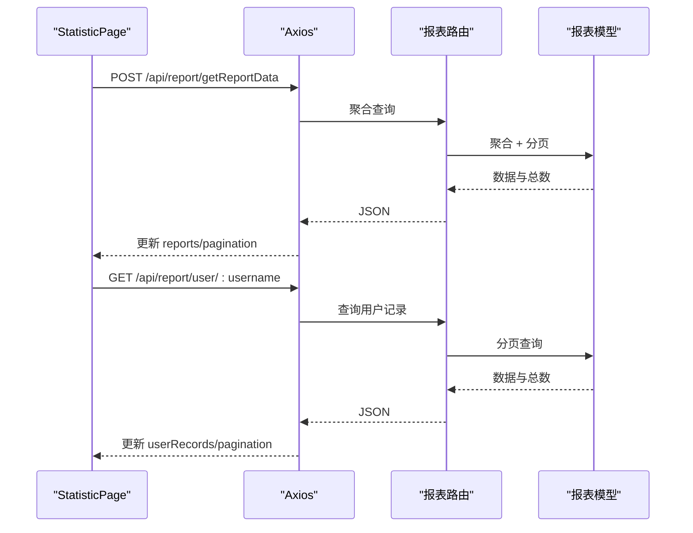
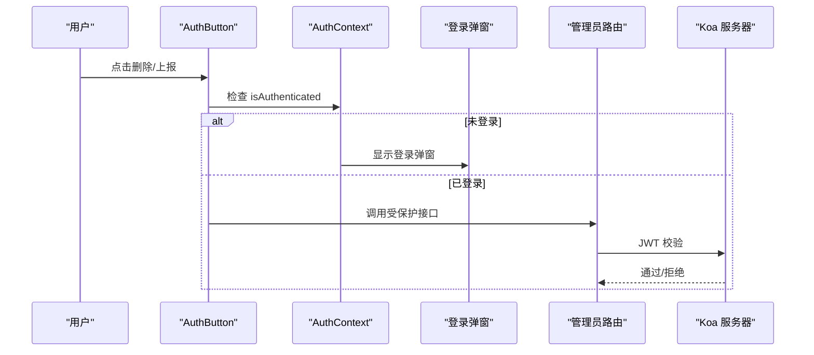
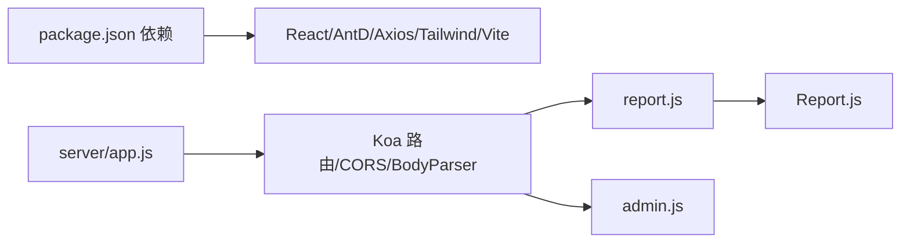

# 数据表格组件

<cite>
**本文引用的文件**
- [DataTable.jsx](file://client/src/pages/StatisticPage/DataTable.jsx)
- [index.jsx](file://client/src/pages/StatisticPage/index.jsx)
- [ReportModal.jsx](file://client/src/pages/StatisticPage/ReportModal.jsx)
- [ReportFormModal.jsx](file://client/src/pages/StatisticPage/ReportFormModal.jsx)
- [AuthButton.jsx](file://client/src/components/AuthButton.jsx)
- [AuthContext.jsx](file://client/src/context/AuthContext.jsx)
- [report.js](file://server/routes/report.js)
- [admin.js](file://server/routes/admin.js)
- [Report.js](file://server/models/Report.js)
- [app.js](file://server/app.js)
- [index.scss](file://client/src/styles/index.scss)
- [package.json](file://client/package.json)
</cite>

## 目录
1. [简介](#简介)
2. [项目结构](#项目结构)
3. [核心组件](#核心组件)
4. [架构总览](#架构总览)
5. [组件详细分析](#组件详细分析)
6. [依赖关系分析](#依赖关系分析)
7. [性能考量](#性能考量)
8. [故障排查指南](#故障排查指南)
9. [结论](#结论)
10. [附录](#附录)

## 简介
本文件为“数据表格组件”提供全面的功能文档，聚焦于：
- 数据绑定与动态更新：数据源配置、分页联动、加载状态
- 分页功能：页码控制、每页数量调整、总记录数计算
- 列配置：字段定义、显示格式、可选排序与渲染定制
- 数据操作：删除记录、用户详情查看、批量操作建议
- 性能优化：虚拟滚动、数据缓存、渲染优化
- 自定义选项：列宽调整、固定列、响应式布局
- 完整API接口说明与使用示例

## 项目结构
该功能位于前端统计页面模块中，采用“页面容器 + 子组件”的组织方式，后端通过Koa路由提供REST接口，MongoDB作为数据存储。

**图示来源**
- [index.jsx](file://client/src/pages/StatisticPage/index.jsx#L1-L262)
- [DataTable.jsx](file://client/src/pages/StatisticPage/DataTable.jsx#L1-L124)
- [ReportModal.jsx](file://client/src/pages/StatisticPage/ReportModal.jsx#L1-L51)
- [ReportFormModal.jsx](file://client/src/pages/StatisticPage/ReportFormModal.jsx#L1-L107)
- [AuthButton.jsx](file://client/src/components/AuthButton.jsx#L1-L43)
- [AuthContext.jsx](file://client/src/context/AuthContext.jsx#L1-L155)
- [app.js](file://server/app.js#L1-L61)
- [report.js](file://server/routes/report.js#L1-L271)
- [admin.js](file://server/routes/admin.js#L1-L128)
- [Report.js](file://server/models/Report.js#L1-L22)

**章节来源**
- [index.jsx](file://client/src/pages/StatisticPage/index.jsx#L1-L262)
- [DataTable.jsx](file://client/src/pages/StatisticPage/DataTable.jsx#L1-L124)
- [app.js](file://server/app.js#L1-L61)

## 核心组件
- DataTable：负责展示统计列表，支持列定义、滚动、分页回调、加载状态、操作按钮等
- StatisticPage：页面容器，管理分页状态、加载状态、删除与查看详情的业务流程
- ReportModal：用户详情弹窗，展示某用户的全部上报记录，支持分页切换
- ReportFormModal：自主上报弹窗，管理员可提交新记录
- AuthButton：权限按钮封装，未登录时触发登录弹窗
- AuthContext：认证上下文，提供登录、登出、令牌校验能力
- 后端路由：提供聚合查询、用户详情分页、删除、上报等接口

**章节来源**
- [DataTable.jsx](file://client/src/pages/StatisticPage/DataTable.jsx#L6-L124)
- [index.jsx](file://client/src/pages/StatisticPage/index.jsx#L12-L262)
- [ReportModal.jsx](file://client/src/pages/StatisticPage/ReportModal.jsx#L4-L51)
- [ReportFormModal.jsx](file://client/src/pages/StatisticPage/ReportFormModal.jsx#L5-L107)
- [AuthButton.jsx](file://client/src/components/AuthButton.jsx#L12-L43)
- [AuthContext.jsx](file://client/src/context/AuthContext.jsx#L9-L155)

## 架构总览
前端通过Axios调用后端接口，后端使用Koa Router处理请求，MongoDB存储数据。权限控制通过JWT中间件实现。

**图示来源**
- [index.jsx](file://client/src/pages/StatisticPage/index.jsx#L58-L85)
- [report.js](file://server/routes/report.js#L9-L88)
- [Report.js](file://server/models/Report.js#L3-L22)

## 组件详细分析

### DataTable 组件
- 数据绑定
  - 接收 props：data、loading、pagination、onTableChange、onView、onDelete
  - 使用 Ant Design Table 组件，dataSource、rowKey、pagination、onChange、loading、scroll、size
- 列配置
  - 序号列：根据当前页与每页大小计算行号
  - 用户名/IP/版本/时间/备注/设备信息：基础字段展示，部分列启用省略提示
  - 时间列：渲染为本地化字符串
  - 操作列：包含“查看”和“删除”按钮；删除按钮使用权限组件
- 样式与滚动
  - 固定容器尺寸，开启横向滚动，设置表格尺寸为 middle
  - 内联样式覆盖占位符与展开行的最大宽度

**图示来源**
- [DataTable.jsx](file://client/src/pages/StatisticPage/DataTable.jsx#L6-L124)

**章节来源**
- [DataTable.jsx](file://client/src/pages/StatisticPage/DataTable.jsx#L6-L124)

### StatisticPage 页面容器
- 状态管理
  - reports/allReports：分页列表与全量图表数据
  - pagination：当前页、每页条数、总数
  - loading/chartLoading：列表与图表加载状态
  - 用户详情弹窗相关：selectedUser、userRecords、userRecordsTotal、userRecordsPage、userRecordsPageSize、userRecordsLoading
- 数据获取
  - 聚合分页列表：POST /api/report/getReportData，支持项目筛选
  - 全量图表数据：POST /api/report/getReportData（pageSize较大）
  - 用户详情分页：GET /api/report/user/:username
- 删除记录
  - DELETE /api/report/:id（需管理员权限）
- 查看用户详情
  - 打开弹窗并拉取用户记录
- 分页回调
  - onTableChange -> fetchReportsPage
  - 弹窗分页回调 -> fetchUserRecords

**图示来源**
- [index.jsx](file://client/src/pages/StatisticPage/index.jsx#L58-L171)
- [report.js](file://server/routes/report.js#L9-L131)
- [Report.js](file://server/models/Report.js#L3-L22)

**章节来源**
- [index.jsx](file://client/src/pages/StatisticPage/index.jsx#L12-L262)

### ReportModal 用户详情弹窗
- 功能：展示指定用户的上报记录，支持分页切换
- 列定义：时间、版本、备注、设备信息
- 分页控件：showSizeChanger、pageSizeOptions、showTotal、onChange/onShowSizeChange

**章节来源**
- [ReportModal.jsx](file://client/src/pages/StatisticPage/ReportModal.jsx#L4-L51)

### ReportFormModal 自主上报弹窗
- 功能：管理员提交新上报记录
- 字段：username、ip、userAgent、deviceInfo、location、version、remark
- 提交：POST /api/report/addReport

**章节来源**
- [ReportFormModal.jsx](file://client/src/pages/StatisticPage/ReportFormModal.jsx#L5-L107)

### 权限与认证
- AuthButton：未登录时显示锁定图标并弹出登录提示，已登录则执行原生点击事件
- AuthContext：提供登录/登出、令牌校验、登录弹窗控制
- 后端中间件 verifyAdmin：校验JWT并注入管理员信息

**图示来源**
- [AuthButton.jsx](file://client/src/components/AuthButton.jsx#L12-L43)
- [AuthContext.jsx](file://client/src/context/AuthContext.jsx#L9-L155)
- [admin.js](file://server/routes/admin.js#L101-L125)

**章节来源**
- [AuthButton.jsx](file://client/src/components/AuthButton.jsx#L12-L43)
- [AuthContext.jsx](file://client/src/context/AuthContext.jsx#L9-L155)
- [admin.js](file://server/routes/admin.js#L101-L125)

## 依赖关系分析
- 前端依赖
  - React、Ant Design、Axios、TailwindCSS、Vite
  - 代理至后端服务端口
- 后端依赖
  - Koa、koa-router、koa-bodyparser、@koa/cors、MongoDB(mongoose)
  - 环境变量：JWT_SECRET、PORT
- 组件耦合
  - DataTable 与 StatisticPage 通过 props 与回调解耦
  - 删除与查看操作通过 Axios 与后端路由解耦
  - 权限控制通过 AuthButton 与 AuthContext 解耦

**图示来源**
- [package.json](file://client/package.json#L5-L18)
- [app.js](file://server/app.js#L1-L61)
- [report.js](file://server/routes/report.js#L1-L271)
- [admin.js](file://server/routes/admin.js#L1-L128)
- [Report.js](file://server/models/Report.js#L1-L22)

**章节来源**
- [package.json](file://client/package.json#L1-L47)
- [app.js](file://server/app.js#L1-L61)

## 性能考量
- 分页策略
  - 前端仅维护当前页数据，后端聚合与分页返回，避免一次性拉取全量数据
  - 图表使用较大 pageSize 获取全量数据，注意内存占用
- 渲染优化
  - 表格固定列宽与容器尺寸，减少重排
  - 文本溢出使用 Tooltip 与省略，避免长文本影响布局
- 缓存与复用
  - 可在 StatisticPage 层对最近一次查询结果做轻量缓存，减少重复请求
- 虚拟滚动
  - 当前未启用虚拟滚动；如数据量大，建议引入虚拟滚动方案以降低 DOM 节点数量
- 并发控制
  - 在分页切换时可增加防抖或取消上一次请求，避免竞态

[本节为通用性能建议，不直接分析具体文件]

## 故障排查指南
- 删除失败
  - 确认已登录且具备管理员权限
  - 检查后端 verifyAdmin 中间件是否正确校验 JWT
  - 查看网络面板与后端日志
- 分页异常
  - 确认前端 pagination 对象包含 current/pageSize/total
  - 检查后端聚合查询是否正确传入 projectId
- 时间显示异常
  - 确认时间字段为合法日期类型
  - 检查客户端时区与渲染逻辑
- 权限按钮不可用
  - 检查 AuthContext 是否正确初始化与提供上下文
  - 确认本地存储中的令牌有效

**章节来源**
- [index.jsx](file://client/src/pages/StatisticPage/index.jsx#L112-L125)
- [report.js](file://server/routes/report.js#L205-L229)
- [admin.js](file://server/routes/admin.js#L101-L125)
- [AuthContext.jsx](file://client/src/context/AuthContext.jsx#L25-L48)

## 结论
该数据表格组件通过清晰的前后端职责划分，实现了稳定的分页、权限控制与数据展示。建议后续引入虚拟滚动、缓存与防抖等优化手段，并扩展批量操作与排序能力，进一步提升用户体验与性能表现。

[本节为总结性内容，不直接分析具体文件]

## 附录

### API 接口说明
- 获取统计列表（聚合每用户最后一次）
  - 方法：POST
  - 路径：/api/report/getReportData
  - 请求体字段：pageCurrent、pageSize、projectId
  - 响应字段：success、data（含 _id、username、ip、timestamp、version、remark、deviceInfo）、total
- 获取用户所有记录（分页）
  - 方法：GET
  - 路径：/api/report/user/:username
  - 查询参数：page、pageSize、projectId
  - 响应字段：success、data、total、page、pageSize
- 删除统计记录（管理员）
  - 方法：DELETE
  - 路径：/api/report/:id
  - 响应字段：success、message
- 自主上报（管理员）
  - 方法：POST
  - 路径：/api/report/addReport
  - 请求体字段：username、ip、userAgent、deviceInfo、location、version、remark、projectId
  - 响应字段：success、message、data
- 管理员登录
  - 方法：POST
  - 路径：/api/admin/login
  - 请求体字段：username、password
  - 响应字段：success、data.token、data.username
- 管理员令牌校验
  - 方法：GET
  - 路径：/api/admin/verify
  - 请求头：Authorization: Bearer <token>
  - 响应字段：success、data.username

**章节来源**
- [report.js](file://server/routes/report.js#L9-L268)
- [admin.js](file://server/routes/admin.js#L27-L98)

### 使用示例
- 基础表格渲染
  - 将 reports 作为 data，pagination 作为分页配置，onTableChange 作为分页回调
  - 参考路径：[DataTable.jsx](file://client/src/pages/StatisticPage/DataTable.jsx#L95-L121)
- 分页切换
  - 在 StatisticPage 中监听分页变化并重新拉取数据
  - 参考路径：[index.jsx](file://client/src/pages/StatisticPage/index.jsx#L164-L166)
- 删除记录
  - 调用删除接口并刷新当前页
  - 参考路径：[index.jsx](file://client/src/pages/StatisticPage/index.jsx#L112-L125)
- 查看用户详情
  - 打开 ReportModal 并拉取用户记录
  - 参考路径：[index.jsx](file://client/src/pages/StatisticPage/index.jsx#L157-L161)、[ReportModal.jsx](file://client/src/pages/StatisticPage/ReportModal.jsx#L14-L47)
- 自主上报
  - 打开 ReportFormModal 并提交表单
  - 参考路径：[ReportFormModal.jsx](file://client/src/pages/StatisticPage/ReportFormModal.jsx#L15-L38)

**章节来源**
- [DataTable.jsx](file://client/src/pages/StatisticPage/DataTable.jsx#L95-L121)
- [index.jsx](file://client/src/pages/StatisticPage/index.jsx#L157-L166)
- [ReportModal.jsx](file://client/src/pages/StatisticPage/ReportModal.jsx#L14-L47)
- [ReportFormModal.jsx](file://client/src/pages/StatisticPage/ReportFormModal.jsx#L15-L38)