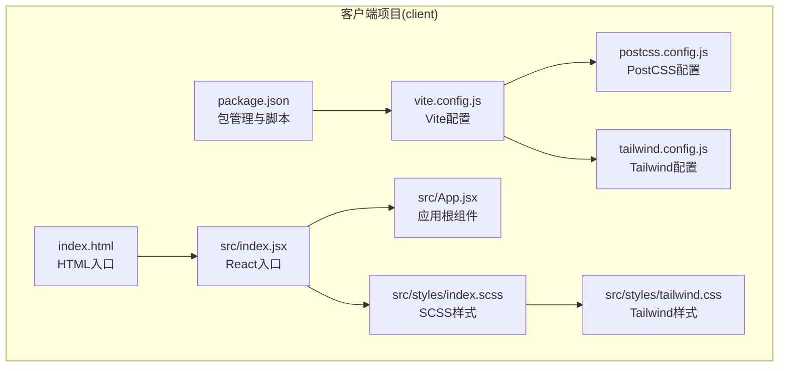
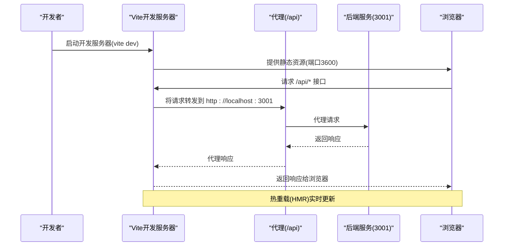
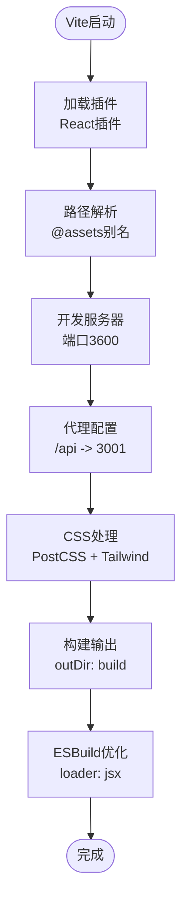
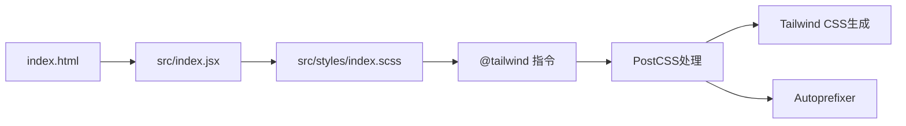
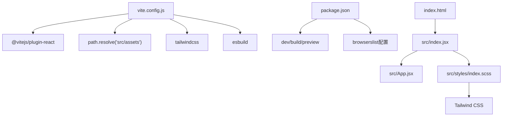

# 前端构建配置

<cite>
**本文档引用的文件**
- [vite.config.js](file://client/vite.config.js)
- [postcss.config.js](file://client/postcss.config.js)
- [tailwind.config.js](file://client/tailwind.config.js)
- [package.json](file://client/package.json)
- [index.html](file://client/index.html)
- [index.jsx](file://client/src/index.jsx)
- [App.jsx](file://client/src/App.jsx)
- [index.scss](file://client/src/styles/index.scss)
- [tailwind.css](file://client/src/styles/tailwind.css)
</cite>

## 目录
1. [简介](#简介)
2. [项目结构](#项目结构)
3. [核心组件](#核心组件)
4. [架构概览](#架构概览)
5. [详细组件分析](#详细组件分析)
6. [依赖关系分析](#依赖关系分析)
7. [性能考虑](#性能考虑)
8. [故障排除指南](#故障排除指南)
9. [结论](#结论)
10. [附录](#附录)

## 简介
本文件详细解析WoaX前端项目的Vite构建配置，涵盖开发服务器设置、代理配置、热重载机制、React插件配置、路径别名设置、ESBuild优化选项、CSS预处理器配置（含PostCSS和Tailwind CSS集成）、代码分割策略、资源压缩和缓存配置等。同时提供构建优化技巧、性能监控和调试方法，并说明生产环境构建流程和静态资源处理策略。

## 项目结构
客户端项目采用标准的Vite + React + Tailwind CSS架构，主要目录和文件如下：
- 配置文件：vite.config.js、postcss.config.js、tailwind.config.js、package.json
- 源码入口：index.html、src/index.jsx、src/App.jsx
- 样式文件：src/styles/index.scss、src/styles/tailwind.css
- 资源文件：src/assets（通过路径别名@assets访问）

**图表来源**
- [vite.config.js](file://client/vite.config.js#L1-L50)
- [postcss.config.js](file://client/postcss.config.js#L1-L7)
- [tailwind.config.js](file://client/tailwind.config.js#L1-L10)
- [package.json](file://client/package.json#L1-L47)
- [index.html](file://client/index.html#L1-L20)
- [index.jsx](file://client/src/index.jsx#L1-L14)
- [App.jsx](file://client/src/App.jsx#L1-L253)
- [index.scss](file://client/src/styles/index.scss#L1-L36)
- [tailwind.css](file://client/src/styles/tailwind.css#L1-L3)

**章节来源**
- [vite.config.js](file://client/vite.config.js#L1-L50)
- [package.json](file://client/package.json#L1-L47)

## 核心组件
本节概述Vite构建系统的关键配置模块及其职责：
- 插件系统：React插件用于JSX转换和开发时特性
- 解析系统：路径别名@assets映射到src/assets，扩展名解析支持.js/.jsx/.json
- 开发服务器：端口3600，API代理到后端服务
- CSS处理：PostCSS集成Tailwind CSS和Autoprefixer
- 构建输出：输出目录build，ESBuild加载器配置
- 依赖优化：针对JSX的ESBuild加载器优化

**章节来源**
- [vite.config.js](file://client/vite.config.js#L6-L50)
- [package.json](file://client/package.json#L20-L24)

## 架构概览
下图展示Vite在开发模式下的工作流，包括开发服务器、代理、热重载以及构建流程。

**图表来源**
- [vite.config.js](file://client/vite.config.js#L14-L22)
- [package.json](file://client/package.json#L21-L23)

## 详细组件分析

### Vite配置详解
Vite配置文件集中定义了开发服务器、代理、CSS处理、构建输出和ESBuild优化等核心功能。

- 插件配置
  - React插件：提供JSX转换、开发时特性（如HMR）
  - 路径别名：@assets指向src/assets，便于资源引用
  - 扩展名解析：支持.js/.jsx/.json

- 开发服务器
  - 端口：3600
  - 代理：/api前缀代理到http://localhost:3001，changeOrigin为true

- CSS处理
  - PostCSS：启用tailwindcss插件
  - SCSS预处理器：预留additionalData配置位置（注释说明）

- 构建输出
  - 输出目录：build

- ESBuild优化
  - loader: 'jsx'，处理JSX语法
  - include: /\.(jsx|js)$/
  - optimizeDeps中esbuildOptions.loader对.js和.jsx统一设置为jsx

**图表来源**
- [vite.config.js](file://client/vite.config.js#L6-L50)

**章节来源**
- [vite.config.js](file://client/vite.config.js#L6-L50)

### PostCSS与Tailwind CSS集成
PostCSS配置启用Tailwind CSS和Autoprefixer两个插件，确保CSS自动前缀和实用类生成。

- PostCSS配置
  - tailwindcss: {} 启用Tailwind CSS
  - autoprefixer: {} 自动添加浏览器前缀

- Tailwind CSS配置
  - content: 包含src/**/*.{js,jsx,ts,tsx}和public/index.html
  - theme.extend: 当前为空，可扩展主题
  - plugins: 空数组，未启用额外插件

- 样式入口
  - index.html中引入/src/index.jsx，该文件导入index.scss
  - index.scss中引入Tailwind指令，确保Tailwind实用类生效

**图表来源**
- [postcss.config.js](file://client/postcss.config.js#L1-L7)
- [tailwind.config.js](file://client/tailwind.config.js#L1-L10)
- [index.html](file://client/index.html#L17-L18)
- [index.jsx](file://client/src/index.jsx#L1-L1)
- [index.scss](file://client/src/styles/index.scss#L1-L5)

**章节来源**
- [postcss.config.js](file://client/postcss.config.js#L1-L7)
- [tailwind.config.js](file://client/tailwind.config.js#L1-L10)
- [index.html](file://client/index.html#L17-L18)
- [index.jsx](file://client/src/index.jsx#L1-L1)
- [index.scss](file://client/src/styles/index.scss#L1-L5)

### React插件与路径别名
React插件负责JSX转换和开发时特性，路径别名@assets简化资源引用。

- React插件
  - 作用：JSX语法转换、开发时特性（如HMR）
  - 在vite.config.js中通过@vitejs/plugin-react引入

- 路径别名@assets
  - 映射：path.resolve(__dirname, 'src/assets')
  - 使用场景：在组件中通过@assets引用静态资源，提升可维护性

- 扩展名解析
  - 支持.js/.jsx/.json，便于模块导入

**章节来源**
- [vite.config.js](file://client/vite.config.js#L7-L13)
- [package.json](file://client/package.json#L45-L45)

### ESBuild优化选项
ESBuild作为Vite的默认打包器，提供快速编译和优化能力。

- ESBuild配置
  - loader: 'jsx'：将JSX语法转换为JS
  - include: /\.(jsx|js)$/：仅处理JS/JSX文件
  - exclude: []：不排除任何文件

- 依赖优化
  - optimizeDeps.esbuildOptions.loader：对.js和.jsx统一设置为jsx
  - 目的：确保依赖预构建时正确处理JSX语法

**章节来源**
- [vite.config.js](file://client/vite.config.js#L37-L49)

### 开发服务器与代理配置
开发服务器提供本地开发体验，代理解决跨域问题。

- 开发服务器
  - port: 3600：指定开发服务器端口
  - 用途：提供静态资源服务、热重载、错误处理

- 代理配置
  - /api前缀：代理到http://localhost:3001
  - changeOrigin: true：修改请求头的Origin字段
  - 目的：解决前端开发时的跨域问题，将API请求转发到后端服务

**章节来源**
- [vite.config.js](file://client/vite.config.js#L14-L22)

### CSS预处理器与样式组织
项目采用SCSS作为预处理器，结合Tailwind CSS实现原子化样式与传统样式的融合。

- SCSS配置
  - preprocessorOptions.scss：预留additionalData配置位置
  - 可在此注入变量、混入或函数导入，提升样式复用性

- Tailwind CSS集成
  - tailwind.config.js中content包含src/**/*.{js,jsx,ts,tsx}和public/index.html
  - 确保未使用的样式被清理，避免打包体积膨胀

- 样式入口
  - index.html中引入/src/index.jsx
  - src/index.jsx导入index.scss
  - index.scss中引入@tailwind base/components/utilities

**章节来源**
- [vite.config.js](file://client/vite.config.js#L23-L33)
- [tailwind.config.js](file://client/tailwind.config.js#L4-L4)
- [index.html](file://client/index.html#L17-L18)
- [index.jsx](file://client/src/index.jsx#L1-L1)
- [index.scss](file://client/src/styles/index.scss#L1-L5)

### 生产环境构建流程
生产构建通过Vite完成，输出到build目录，遵循现代前端工程的最佳实践。

- 构建命令
  - package.json中提供build脚本：vite build
  - 作用：执行生产构建，生成优化后的静态资源

- 输出目录
  - outDir: 'build'：构建产物输出到build目录
  - 包含：优化后的JS/CSS、图片、字体等静态资源

- 浏览器兼容性
  - browserslist配置分别定义了生产环境和开发环境的浏览器目标
  - 生产环境：>0.2%，not dead，not op_mini all
  - 开发环境：last 1 chrome version，last 1 firefox version，last 1 safari version

**章节来源**
- [package.json](file://client/package.json#L20-L42)
- [vite.config.js](file://client/vite.config.js#L34-L36)

### 静态资源处理策略
静态资源处理涉及HTML模板、入口脚本、样式文件和资源别名。

- HTML模板
  - index.html：定义基础HTML结构，包含manifest.json、favicon.svg、apple-touch-icon等
  - 通过<script type="module" src="/src/index.jsx">引入React入口

- 入口脚本
  - src/index.jsx：导入样式和App组件，使用React.StrictMode包裹
  - 通过ReactDOM.createRoot挂载到#root元素

- 样式组织
  - index.scss：导入reset.css和Tailwind指令，定义全局样式
  - tailwind.css：仅包含Tailwind指令，便于按需引入

- 资源别名
  - @assets：指向src/assets，便于在组件中引用静态资源
  - 在App.jsx中通过import logo from './assets/logo.png'使用

**章节来源**
- [index.html](file://client/index.html#L1-L20)
- [index.jsx](file://client/src/index.jsx#L1-L14)
- [App.jsx](file://client/src/App.jsx#L6-L6)
- [index.scss](file://client/src/styles/index.scss#L1-L1)
- [tailwind.css](file://client/src/styles/tailwind.css#L1-L3)
- [vite.config.js](file://client/vite.config.js#L9-L11)

## 依赖关系分析
本节分析Vite配置与其他文件之间的依赖关系，帮助理解构建系统的整体运作。

**图表来源**
- [vite.config.js](file://client/vite.config.js#L1-L50)
- [package.json](file://client/package.json#L1-L47)
- [index.html](file://client/index.html#L17-L18)
- [index.jsx](file://client/src/index.jsx#L1-L14)
- [App.jsx](file://client/src/App.jsx#L1-L253)
- [index.scss](file://client/src/styles/index.scss#L1-L36)

**章节来源**
- [vite.config.js](file://client/vite.config.js#L1-L50)
- [package.json](file://client/package.json#L1-L47)

## 性能考虑
以下是一些通用的性能优化建议，适用于本项目的Vite配置：
- 代码分割：利用动态导入实现路由级别的懒加载，减少首屏体积
- 资源压缩：生产构建时自动启用压缩，可通过rollupOptions进一步优化
- 缓存策略：合理设置HTTP缓存头，结合文件指纹实现长效缓存
- 依赖预构建：optimizeDeps确保第三方依赖的快速预构建
- 样式优化：Tailwind CSS的content配置确保未使用样式被清理，减少CSS体积

[本节提供一般性指导，无需特定文件来源]

## 故障排除指南
常见问题及解决方案：
- 开发服务器无法访问
  - 检查端口3600是否被占用，或修改vite.config.js中的port配置
  - 确认防火墙设置允许本地连接

- API代理失败
  - 确认后端服务已在http://localhost:3001运行
  - 检查代理配置中的target地址和changeOrigin设置

- 样式未生效
  - 确认index.html中正确引入/src/index.jsx
  - 检查index.scss中是否包含Tailwind指令
  - 验证tailwind.config.js的content路径是否覆盖到所有使用Tailwind的文件

- 路径别名无效
  - 确认@assets别名已正确配置
  - 检查组件中是否使用正确的相对路径引用

**章节来源**
- [vite.config.js](file://client/vite.config.js#L14-L22)
- [index.html](file://client/index.html#L17-L18)
- [index.scss](file://client/src/styles/index.scss#L1-L5)
- [tailwind.config.js](file://client/tailwind.config.js#L4-L4)

## 结论
本项目基于Vite构建，配置简洁而功能完整。通过合理的开发服务器设置、代理配置、CSS预处理器集成和ESBuild优化，实现了高效的开发体验和良好的生产构建质量。建议在后续迭代中关注代码分割策略、资源压缩和缓存配置，以进一步提升性能表现。

## 附录
- 开发命令：npm run dev（或yarn dev，取决于包管理器）
- 构建命令：npm run build（或yarn build）
- 预览命令：npm run preview（或yarn preview）

[本节为一般性信息，无需特定文件来源]