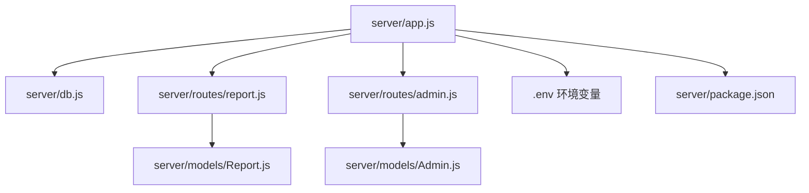
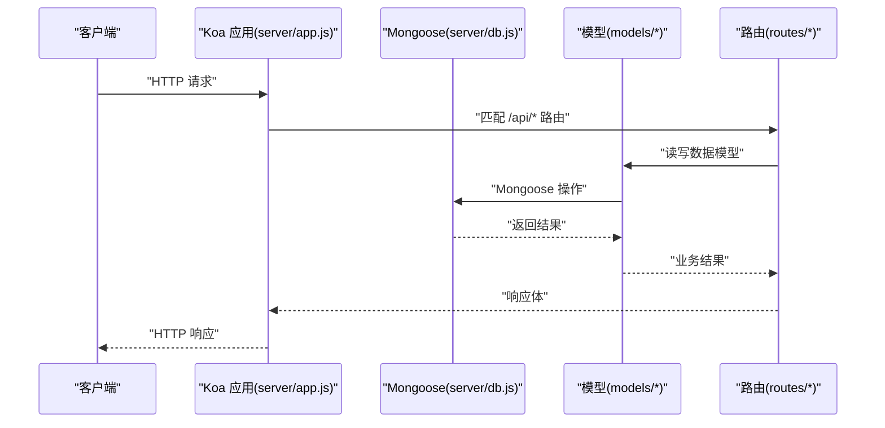
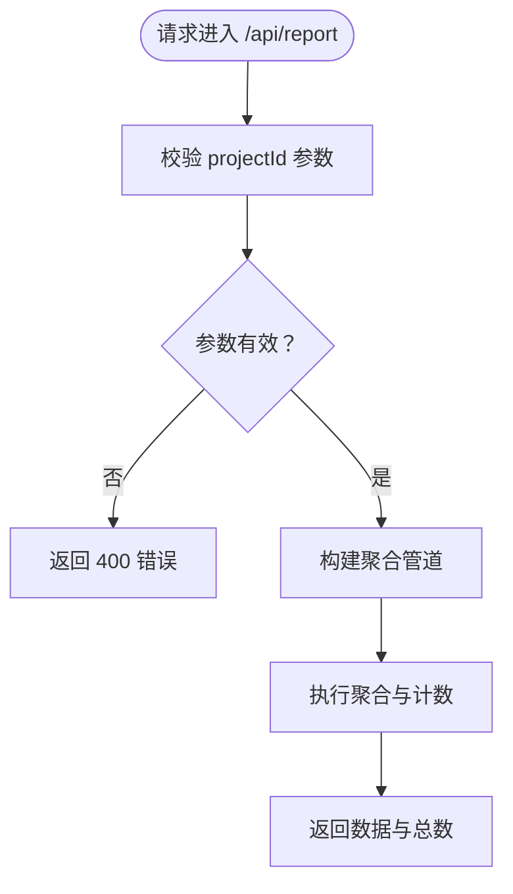
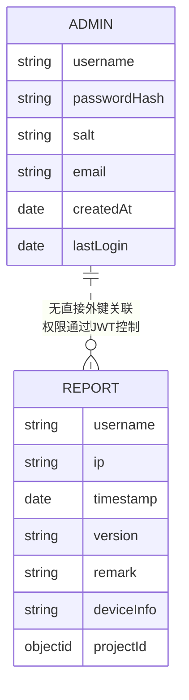
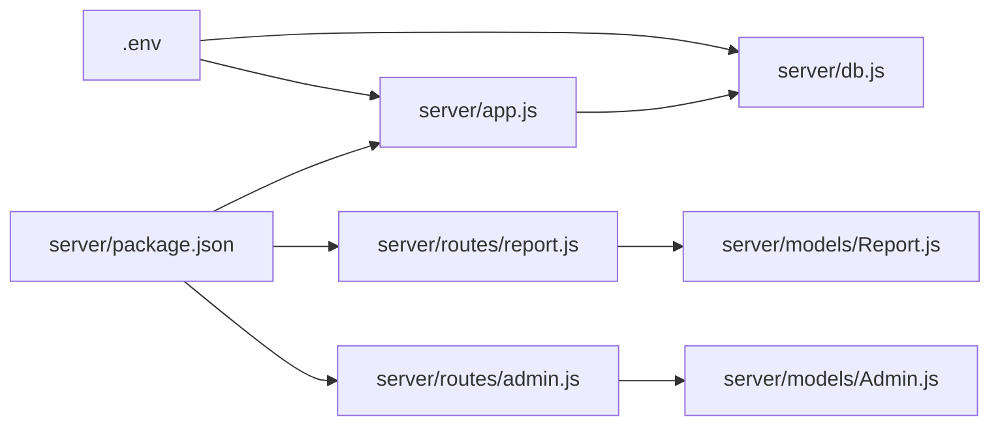

# 后端部署配置

<cite>
**本文引用的文件**
- [server/app.js](file://server/app.js)
- [server/db.js](file://server/db.js)
- [server/package.json](file://server/package.json)
- [server/.env](file://server/.env)
- [server/routes/report.js](file://server/routes/report.js)
- [server/routes/admin.js](file://server/routes/admin.js)
- [server/models/Admin.js](file://server/models/Admin.js)
- [server/models/Report.js](file://server/models/Report.js)
- [README.md](file://README.md)
- [latest-example.yml](file://latest-example.yml)
</cite>

## 目录
1. [简介](#简介)
2. [项目结构](#项目结构)
3. [核心组件](#核心组件)
4. [架构总览](#架构总览)
5. [详细组件分析](#详细组件分析)
6. [依赖关系分析](#依赖关系分析)
7. [性能考虑](#性能考虑)
8. [故障排查指南](#故障排查指南)
9. [结论](#结论)
10. [附录](#附录)

## 简介
本指南面向运维与开发团队，提供WoaX后端（Node.js + Koa + MongoDB）的完整部署配置说明，覆盖以下主题：
- 依赖安装与环境配置
- 进程管理（含PM2建议）
- MongoDB连接与连接池优化
- 环境变量管理、配置文件处理与敏感信息保护
- Docker容器化部署思路与Nginx反向代理、SSL配置要点
- 负载均衡与高可用部署方案
- 性能监控、日志管理与错误处理机制

## 项目结构
后端位于 server 目录，采用模块化组织：
- 应用入口与中间件：app.js
- 数据库连接与生命周期：db.js
- 路由模块：routes 下各业务路由（如 report、admin）
- 数据模型：models 下 Mongoose 模型（如 Admin、Report）
- 环境变量：.env
- 包管理：package.json

图表来源
- [server/app.js](file://server/app.js#L1-L61)
- [server/db.js](file://server/db.js#L1-L45)
- [server/routes/report.js](file://server/routes/report.js#L1-L271)
- [server/routes/admin.js](file://server/routes/admin.js#L1-L128)
- [server/models/Admin.js](file://server/models/Admin.js#L1-L32)
- [server/models/Report.js](file://server/models/Report.js#L1-L22)
- [server/.env](file://server/.env#L1-L9)
- [server/package.json](file://server/package.json#L1-L24)

章节来源
- [README.md](file://README.md#L1-L44)
- [server/package.json](file://server/package.json#L1-L24)

## 核心组件
- 应用入口与中间件
  - 初始化 Koa 应用与路由
  - 加载 .env 并读取端口、数据库地址、上传目录与最大文件大小
  - 注册 CORS、BodyParser 中间件
  - 提供静态文件服务（/uploads/*）
  - 统一注册 /api/* 路由前缀
- 数据库连接
  - 使用 Mongoose 连接 MongoDB，启用统一选项
  - 监听断开与错误事件；进程退出时关闭连接
- 路由与模型
  - 报表路由：聚合统计、分页查询、新增上报、删除与管理员上报
  - 管理员路由：登录、令牌校验、中间件鉴权
  - 模型：Admin（密码哈希存储）、Report（关联 Project）

章节来源
- [server/app.js](file://server/app.js#L1-L61)
- [server/db.js](file://server/db.js#L1-L45)
- [server/routes/report.js](file://server/routes/report.js#L1-L271)
- [server/routes/admin.js](file://server/routes/admin.js#L1-L128)
- [server/models/Admin.js](file://server/models/Admin.js#L1-L32)
- [server/models/Report.js](file://server/models/Report.js#L1-L22)

## 架构总览
下图展示从客户端请求到数据库访问的关键路径，以及关键配置来源。

图表来源
- [server/app.js](file://server/app.js#L1-L61)
- [server/db.js](file://server/db.js#L1-L45)
- [server/routes/report.js](file://server/routes/report.js#L1-L271)
- [server/routes/admin.js](file://server/routes/admin.js#L1-L128)
- [server/models/Admin.js](file://server/models/Admin.js#L1-L32)
- [server/models/Report.js](file://server/models/Report.js#L1-L22)

## 详细组件分析

### 应用入口与进程管理
- 启动方式
  - 开发：使用脚本 dev（基于 nodemon）
  - 生产：使用脚本 start（直接 node app.js）
- 进程管理建议
  - 使用 PM2 管理 Node.js 进程，实现自动重启、日志聚合与集群模式
  - 推荐配置项：应用名称、工作目录、脚本入口、环境变量、日志路径、进程数、自动重启阈值
- 端口与静态资源
  - 端口来自环境变量，默认 3001
  - /uploads/* 静态文件服务，确保目录存在

章节来源
- [server/package.json](file://server/package.json#L6-L8)
- [server/app.js](file://server/app.js#L57-L61)
- [server/.env](file://server/.env#L2)

### 数据库连接与连接池优化
- 连接建立
  - 通过 Mongoose 连接字符串（默认本地 MongoDB），启用统一选项
  - 连接成功与失败的日志输出
- 生命周期管理
  - 断开与错误事件监听
  - SIGINT 信号优雅关闭数据库连接
- 连接池优化建议
  - 在生产环境增加连接池参数（如最大连接数、空闲超时、连接超时）
  - 使用副本集或分片以提升可用性与扩展性
  - 将连接字符串置于环境变量中，避免硬编码

章节来源
- [server/db.js](file://server/db.js#L10-L24)
- [server/db.js](file://server/db.js#L27-L40)
- [server/.env](file://server/.env#L5)

### 环境变量管理与敏感信息保护
- 关键变量
  - PORT：服务端口
  - MONGODB_URI：数据库连接串
  - UPLOAD_DIR：上传目录名
  - MAX_FILE_SIZE：上传文件大小限制
  - JWT_SECRET：管理员登录 JWT 密钥
- 管理策略
  - .env 仅用于本地开发；生产环境通过系统环境注入
  - 敏感信息（如数据库密码、JWT密钥）不进入代码仓库
  - 使用配置中心或平台提供的密钥管理服务

章节来源
- [server/.env](file://server/.env#L1-L9)
- [server/routes/admin.js](file://server/routes/admin.js#L6)

### 路由与权限控制
- 报表路由
  - 聚合统计与分页查询
  - 新增上报与管理员上报
  - 删除记录（需管理员权限）
- 管理员路由
  - 登录、令牌校验、中间件鉴权
  - 默认管理员初始化（用户名 admin，密码在首次创建时设定）

图表来源
- [server/routes/report.js](file://server/routes/report.js#L8-L88)

章节来源
- [server/routes/report.js](file://server/routes/report.js#L1-L271)
- [server/routes/admin.js](file://server/routes/admin.js#L1-L128)

### 模型设计与数据流
- Admin 模型
  - 字段：用户名、密码哈希、盐、邮箱、创建时间、最近登录时间
  - 方法：设置密码（PBKDF2 + 盐）、验证密码
- Report 模型
  - 字段：用户名、IP、时间戳、版本、备注、设备信息、项目ID（关联 Project）
- 关系
  - Report 的 projectId 引用 Project 集合

图表来源
- [server/models/Admin.js](file://server/models/Admin.js#L4-L14)
- [server/models/Report.js](file://server/models/Report.js#L3-L19)

章节来源
- [server/models/Admin.js](file://server/models/Admin.js#L1-L32)
- [server/models/Report.js](file://server/models/Report.js#L1-L22)

### 版本发布与自动更新（参考）
- latest.yml 示例
  - 包含版本号、发布日期、文件信息、发布说明、更新策略等
- 建议
  - 将最新版本描述文件托管于受控的静态资源位置
  - 通过后端接口发布版本并生成/更新 latest.yml

章节来源
- [latest-example.yml](file://latest-example.yml#L1-L38)

## 依赖关系分析
- 应用对框架与库的依赖集中在 server/package.json
- 路由与模型之间为松耦合，通过 Mongoose 与数据库交互
- 环境变量贯穿应用层、路由层与数据库层

图表来源
- [server/package.json](file://server/package.json#L1-L24)
- [server/app.js](file://server/app.js#L1-L61)
- [server/db.js](file://server/db.js#L1-L45)
- [server/routes/report.js](file://server/routes/report.js#L1-L271)
- [server/routes/admin.js](file://server/routes/admin.js#L1-L128)
- [server/models/Report.js](file://server/models/Report.js#L1-L22)
- [server/models/Admin.js](file://server/models/Admin.js#L1-L32)
- [server/.env](file://server/.env#L1-L9)

章节来源
- [server/package.json](file://server/package.json#L1-L24)

## 性能考虑
- 数据库连接池
  - 增加连接池大小、设置空闲超时与连接超时
  - 使用副本集/分片提升读写能力与可用性
- 路由与聚合
  - 对大集合进行聚合时，合理使用索引与投影
  - 分页查询时避免深度分页，优先使用游标或基于时间戳的分页
- 上传与静态资源
  - 控制文件大小与类型，结合 CDN 或对象存储优化静态资源访问
- 进程与并发
  - 使用 PM2 集群模式，结合负载均衡器
  - 设置健康检查与自动重启阈值，保障稳定性

## 故障排查指南
- 数据库连接失败
  - 检查 MONGODB_URI 是否正确、网络连通性与认证信息
  - 查看连接断开与错误事件日志
- 上传失败
  - 检查上传目录是否存在且具备写权限
  - 核对 MAX_FILE_SIZE 与实际文件大小
- 权限与认证
  - 确认 JWT_SECRET 一致，令牌格式与有效期
  - 核对管理员账户是否创建成功
- 进程与日志
  - 使用 PM2 查看日志与状态
  - 关注 SIGINT 优雅关闭流程

章节来源
- [server/db.js](file://server/db.js#L27-L40)
- [server/app.js](file://server/app.js#L24-L28)
- [server/.env](file://server/.env#L8-L9)
- [server/routes/admin.js](file://server/routes/admin.js#L6-L21)

## 结论
本指南提供了WoaX后端部署的系统性配置与最佳实践。通过规范的环境变量管理、合理的数据库连接池配置、完善的进程与日志管理，以及可扩展的容器化与反向代理方案，可实现稳定、可维护、高性能的生产级部署。

## 附录

### Docker 容器化部署（思路）
- 构建镜像
  - 基于 Node.js 运行时镜像
  - 复制 server 目录与依赖，安装依赖并构建
- 运行容器
  - 映射端口与挂载上传目录
  - 通过环境变量注入 MONGODB_URI、JWT_SECRET 等
- 编排建议
  - 使用 docker-compose 管理服务编排与网络
  - 结合 Nginx 作为反向代理与 SSL 终止

### Nginx 反向代理与 SSL（要点）
- 反向代理
  - 将域名指向后端服务，开启 gzip、缓存静态资源
- SSL 证书
  - 使用 Let’s Encrypt 自动签发与续期
  - 强制 HTTPS 重定向与安全头配置

### PM2 进程管理（建议配置项）
- 应用名称、脚本入口、工作目录
- 环境变量（NODE_ENV、PORT、MONGODB_URI、JWT_SECRET）
- 日志路径与轮转策略
- 进程数（CPU核数或固定值）、自动重启阈值
- 健康检查与优雅重启