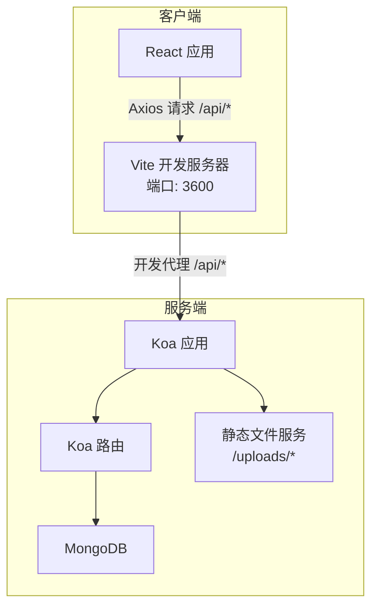
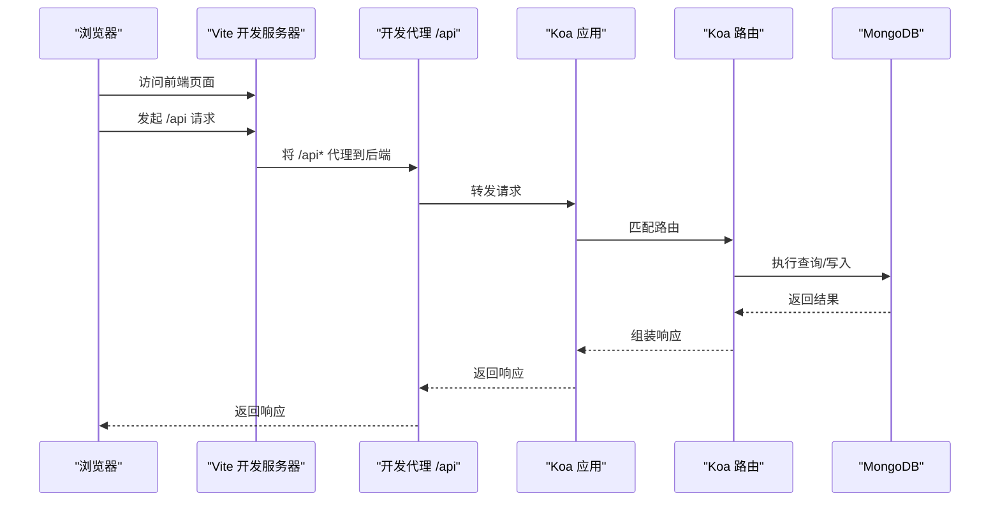
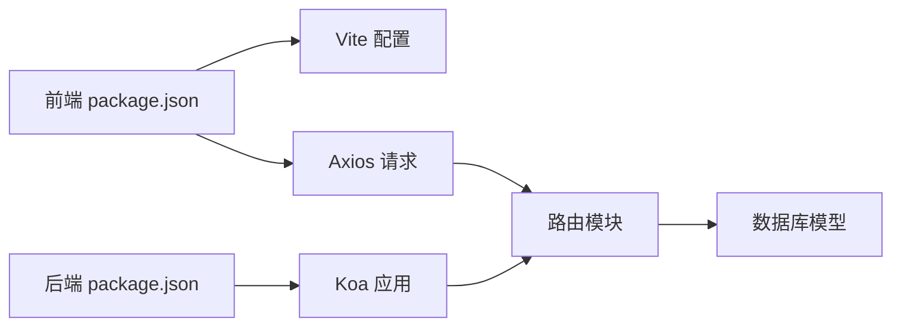

# 构建与部署

<cite>
**本文引用的文件**
- [client/vite.config.js](file://client/vite.config.js)
- [client/package.json](file://client/package.json)
- [client/postcss.config.js](file://client/postcss.config.js)
- [client/tailwind.config.js](file://client/tailwind.config.js)
- [client/src/index.jsx](file://client/src/index.jsx)
- [client/src/App.jsx](file://client/src/App.jsx)
- [server/app.js](file://server/app.js)
- [server/db.js](file://server/db.js)
- [server/.env](file://server/.env)
- [server/package.json](file://server/package.json)
- [server/routes/report.js](file://server/routes/report.js)
- [server/models/Report.js](file://server/models/Report.js)
- [README.md](file://README.md)
- [api-usage-latest-version.md](file://api-usage-latest-version.md)
</cite>

## 目录
1. [简介](#简介)
2. [项目结构](#项目结构)
3. [核心组件](#核心组件)
4. [架构总览](#架构总览)
5. [详细组件分析](#详细组件分析)
6. [依赖关系分析](#依赖关系分析)
7. [性能考虑](#性能考虑)
8. [故障排除指南](#故障排除指南)
9. [结论](#结论)
10. [附录](#附录)

## 简介
本指南面向WoaX项目的构建与部署，覆盖前端Vite构建配置与优化策略（代码分割、资源压缩、缓存策略）、后端Node.js/Koa应用的打包与部署流程、环境变量与配置文件管理、敏感信息保护、Docker容器化部署、CI/CD流水线与自动化部署策略，以及生产环境优化、性能监控与日志管理建议，并提供常见部署问题排查与故障排除清单。

## 项目结构
WoaX采用前后端分离架构：
- 前端：基于Vite + React + Ant Design，通过代理访问后端API。
- 后端：基于Koa + MongoDB，提供REST风格API与静态文件服务。
- 数据：MongoDB存储统计数据、反馈、版本等业务数据；上传文件位于后端的uploads目录。

图表来源
- [client/vite.config.js](file://client/vite.config.js#L14-L22)
- [client/src/App.jsx](file://client/src/App.jsx#L18-L25)
- [server/app.js](file://server/app.js#L34-L45)
- [server/routes/report.js](file://server/routes/report.js#L1-L20)

章节来源
- [README.md](file://README.md#L11-L17)

## 核心组件
- 前端构建与开发工具链
  - Vite作为构建与开发服务器，启用React插件、PostCSS/TailwindCSS、路径别名与开发代理。
  - 生产构建输出至build目录，使用esbuild进行JSX处理与依赖预构建。
- 后端应用与数据库
  - Koa应用加载路由、中间件（CORS、bodyParser），提供静态文件服务与API路由。
  - MongoDB连接封装，监听断开与错误事件，优雅关闭数据库连接。
- 配置与环境
  - 前端：Vite配置、Tailwind/CSS处理、浏览器兼容性目标。
  - 后端：.env集中管理端口、数据库连接、上传目录与文件大小限制。

章节来源
- [client/vite.config.js](file://client/vite.config.js#L1-L50)
- [client/package.json](file://client/package.json#L1-L47)
- [client/postcss.config.js](file://client/postcss.config.js#L1-L7)
- [client/tailwind.config.js](file://client/tailwind.config.js#L1-L10)
- [server/app.js](file://server/app.js#L1-L61)
- [server/db.js](file://server/db.js#L1-L45)
- [server/.env](file://server/.env#L1-L9)
- [server/package.json](file://server/package.json#L1-L24)

## 架构总览
下图展示从浏览器到数据库的完整请求链路，包括开发代理、静态文件服务与API路由。

图表来源
- [client/vite.config.js](file://client/vite.config.js#L14-L22)
- [server/app.js](file://server/app.js#L48-L55)
- [server/routes/report.js](file://server/routes/report.js#L8-L88)

## 详细组件分析

### 前端构建与优化（Vite）
- 代码分割与依赖预构建
  - 通过esbuild与optimizeDeps配置，确保JSX正确处理与依赖预构建，减少冷启动时间。
  - 生产构建输出目录为build，便于静态托管。
- 资源处理与样式
  - PostCSS集成TailwindCSS与autoprefixer，实现原子化样式与浏览器兼容。
  - SCSS预处理器选项预留注入能力，便于全局变量与混入复用。
- 开发体验
  - 开发服务器端口与代理规则明确，将/api前缀转发至后端，避免跨域问题。
  - 路径别名@assets简化资源导入。
- 性能优化建议（实践层面）
  - 使用动态导入进行路由级代码分割。
  - 图片与媒体资源按需加载，结合懒加载策略。
  - 生产构建开启压缩与最小化，合理设置缓存头以提升二次加载速度。

章节来源
- [client/vite.config.js](file://client/vite.config.js#L6-L50)
- [client/postcss.config.js](file://client/postcss.config.js#L1-L7)
- [client/tailwind.config.js](file://client/tailwind.config.js#L1-L10)
- [client/package.json](file://client/package.json#L20-L24)

### 后端打包与部署（Node.js/Koa）
- 本地与开发脚本
  - 后端提供start与dev脚本，分别用于生产与开发模式。
- 部署要点
  - 生产环境建议使用PM2或Docker容器运行，配合环境变量与进程管理。
  - 确保MongoDB可达且连接字符串正确，上传目录存在且具备写权限。
- 安全与健壮性
  - 通过dotenv加载环境变量，避免硬编码敏感信息。
  - 数据库连接异常时记录错误，必要时优雅退出，避免僵尸进程。

章节来源
- [server/package.json](file://server/package.json#L6-L8)
- [server/app.js](file://server/app.js#L1-L61)
- [server/db.js](file://server/db.js#L1-L45)
- [server/.env](file://server/.env#L1-L9)

### 环境变量管理与敏感信息保护
- 前端
  - Vite配置中未直接暴露后端密钥；开发代理指向后端地址，生产构建产物不包含后端密钥。
- 后端
  - .env集中管理端口、数据库连接、上传目录与最大文件大小。
  - 建议在生产环境通过系统环境变量或容器编排工具注入，避免提交到仓库。
- 最佳实践
  - 对于需要在前端使用的只读配置，可通过构建时注入或后端接口下发受控配置。
  - 敏感令牌与密钥仅在后端处理，前端仅持有临时访问令牌。

章节来源
- [client/vite.config.js](file://client/vite.config.js#L14-L22)
- [server/.env](file://server/.env#L1-L9)
- [server/app.js](file://server/app.js#L8-L8)

### API与数据模型
- API路由
  - report路由提供数据统计相关接口，包含分页聚合、用户记录查询、上报与删除等。
- 数据模型
  - Report模型定义字段与集合名，关联项目ID，便于多项目隔离与查询。
- 前端调用
  - App.jsx中通过axios拦截器统一注入认证令牌，路由中发起API请求。

章节来源
- [server/routes/report.js](file://server/routes/report.js#L1-L271)
- [server/models/Report.js](file://server/models/Report.js#L1-L22)
- [client/src/App.jsx](file://client/src/App.jsx#L18-L25)

### 版本接口与上传流程（参考）
- 版本接口
  - 提供公开的最新版本查询接口，返回版本号、描述、下载链接、文件大小等。
- 上传流程
  - 前端支持安装包与描述文件上传，后端静态服务提供文件下载。
- 注意事项
  - 仅返回已发布版本；若无发布版本返回404；建议前端妥善处理404场景。

章节来源
- [api-usage-latest-version.md](file://api-usage-latest-version.md#L1-L227)
- [server/app.js](file://server/app.js#L34-L45)

## 依赖关系分析
- 前端依赖
  - React、Ant Design、Axios、Recharts、Sass、TailwindCSS、Vite及其React插件。
- 后端依赖
  - Koa、Koa Router、CORS、BodyParser、MongoDB驱动、Multer、dotenv。
- 关键耦合点
  - 前端通过代理访问后端API；后端路由依赖数据库模型；静态文件服务依赖上传目录。

图表来源
- [client/package.json](file://client/package.json#L1-L47)
- [server/package.json](file://server/package.json#L1-L24)
- [server/routes/report.js](file://server/routes/report.js#L1-L20)
- [server/models/Report.js](file://server/models/Report.js#L1-L22)

章节来源
- [client/package.json](file://client/package.json#L1-L47)
- [server/package.json](file://server/package.json#L1-L24)

## 性能考虑
- 前端
  - 代码分割：对路由级组件使用动态导入，减少首屏体积。
  - 资源压缩：生产构建启用压缩与最小化，结合HTTP/2与Gzip/Brotli。
  - 缓存策略：静态资源设置长缓存，HTML短缓存；通过构建产物指纹化实现强缓存失效。
  - 样式：Tailwind原子类减少冗余CSS，PostCSS优化输出。
- 后端
  - 连接池与超时：合理配置MongoDB连接池与请求超时。
  - 中间件顺序：CORS与BodyParser顺序影响性能与安全性，应保持最佳实践。
  - 静态文件：上传目录静态服务需限制访问范围与扩展名白名单。
- 监控与日志
  - 前端：错误边界与网络错误上报；后端：统一日志格式与错误捕获。
  - 建议接入APM（如Sentry、DataDog）与日志聚合（如ELK/Fluentd）。

## 故障排除指南
- 前端无法访问后端API
  - 检查Vite开发代理是否正确指向后端地址与端口。
  - 确认CORS中间件已启用，跨域请求被允许。
- 数据库连接失败
  - 检查MONGODB_URI是否正确，本地MongoDB服务是否运行。
  - 查看数据库连接错误日志，确认网络与防火墙设置。
- 上传文件无法下载
  - 确认上传目录存在且具备读权限；静态服务路径匹配。
- 404未找到版本
  - 确认版本状态为已发布；若无发布版本属正常行为，前端需处理404。
- 生产构建后页面空白
  - 检查构建输出目录与Web服务器根目录配置；确认静态资源路径与缓存头设置。

章节来源
- [client/vite.config.js](file://client/vite.config.js#L14-L22)
- [server/app.js](file://server/app.js#L34-L45)
- [server/db.js](file://server/db.js#L18-L23)
- [api-usage-latest-version.md](file://api-usage-latest-version.md#L33-L47)

## 结论
WoaX的构建与部署遵循前后端分离的最佳实践：前端通过Vite快速迭代与优化，后端以Koa稳定提供API与静态文件服务。通过合理的环境变量管理、数据库连接与静态文件服务配置，可在本地与生产环境中高效运行。建议进一步完善容器化与CI/CD流程，强化安全与可观测性，持续提升交付质量与稳定性。

## 附录

### Docker容器化部署（步骤概述）
- 前端镜像
  - 使用多阶段构建，先安装依赖并构建，再复制到轻量Nginx镜像中提供静态服务。
- 后端镜像
  - 安装Node依赖，复制构建产物与配置文件，通过环境变量注入运行时配置。
- Compose编排
  - 使用docker-compose编排MongoDB、后端与前端，挂载上传目录持久化数据。
- 安全与运维
  - 限制容器权限、使用只读根文件系统、健康检查与日志采集。

### CI/CD流水线（步骤概述）
- 触发条件
  - push到主分支或发布标签触发流水线。
- 步骤
  - 代码检出 → 前端安装依赖与构建 → 后端安装依赖与构建 → 单元测试（可选） → 构建镜像 → 推送镜像 → 部署（Kubernetes/Docker Swarm/PM2） → 健康检查。
- 产物
  - 镜像仓库、制品库（可选）、部署报告。

### 生产环境优化建议
- 前端
  - 启用HTTP/2与现代压缩算法；配置CDN与边缘缓存；启用HTTPS与安全响应头。
- 后端
  - 进程管理与自动重启、连接池与限流、慢查询与错误监控。
- 日志与监控
  - 结构化日志、指标采集（Prometheus）、分布式追踪（Jaeger）与告警。