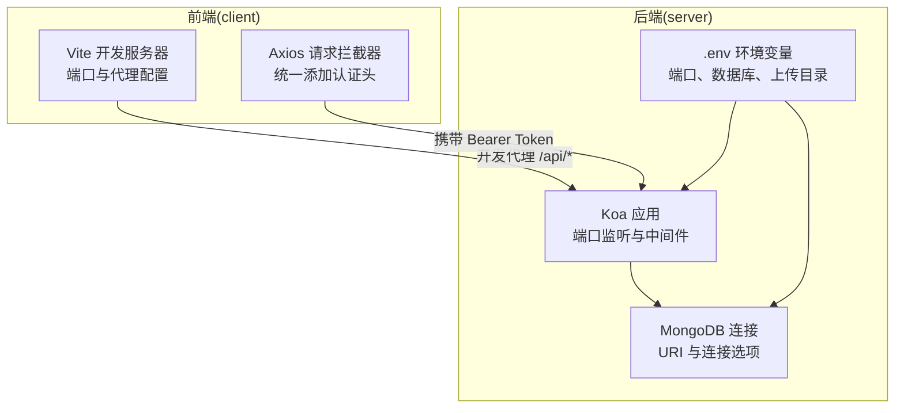
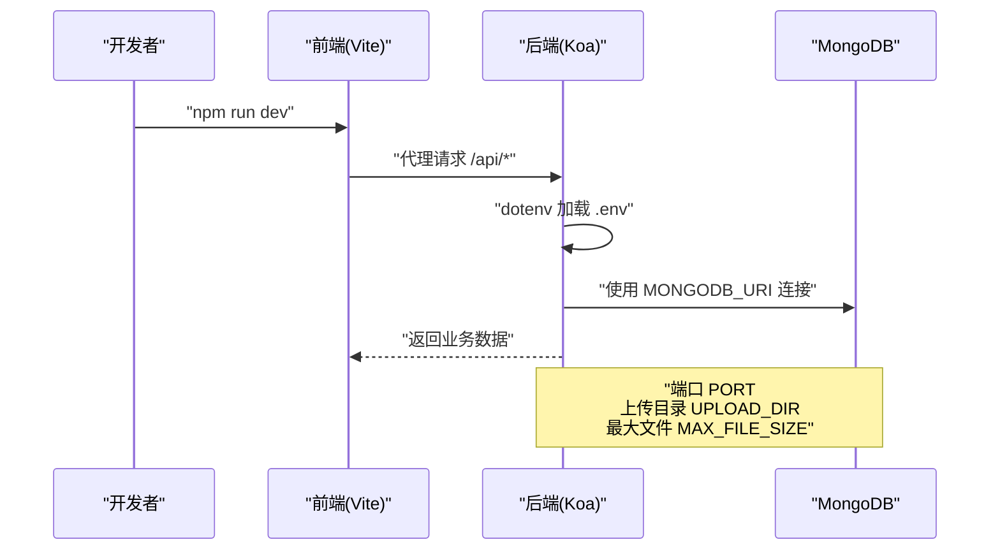
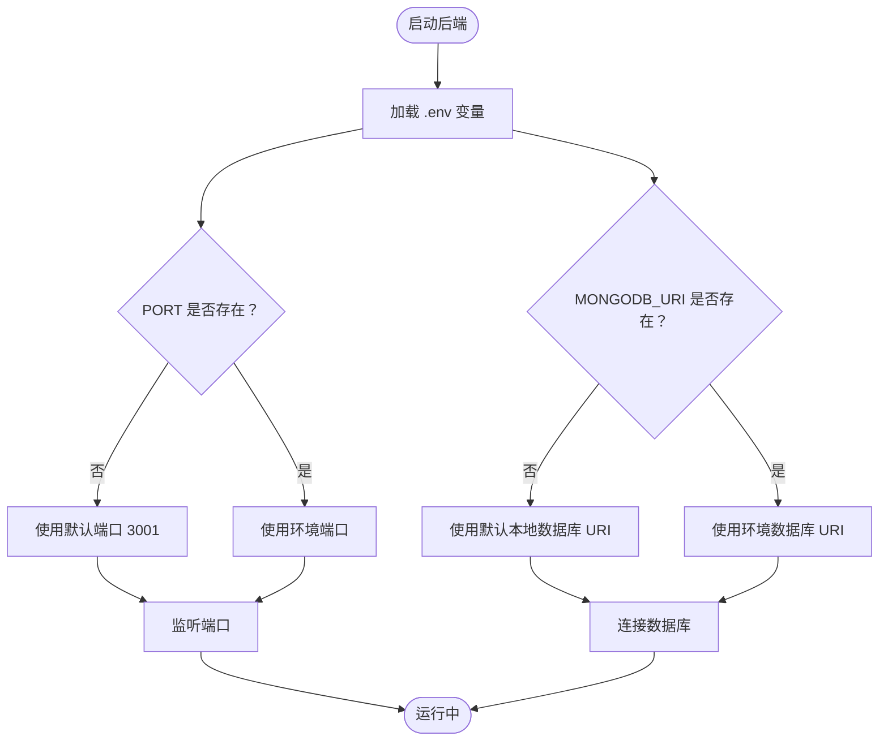
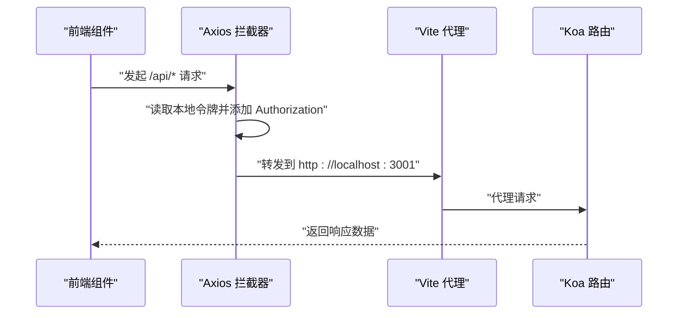
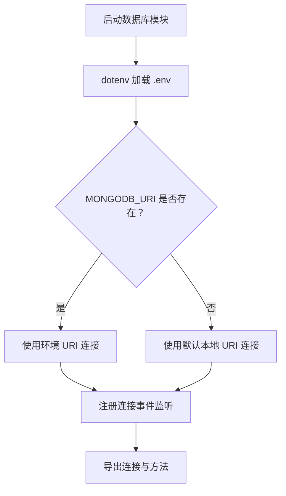
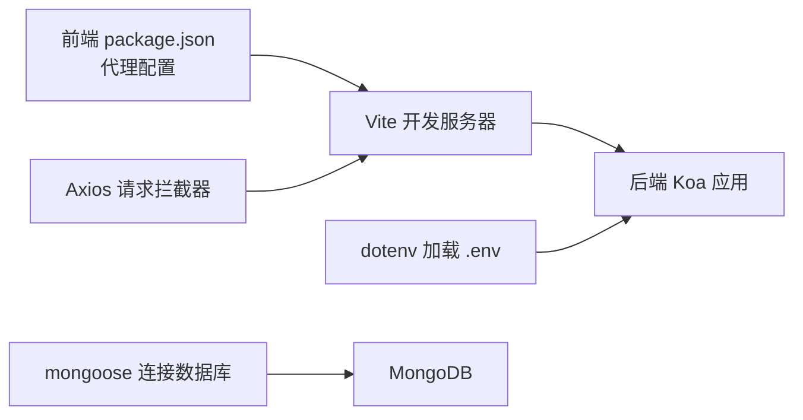

# 环境配置管理

<cite>
**本文档引用的文件**
- [server/.env](file://server/.env)
- [server/app.js](file://server/app.js)
- [server/db.js](file://server/db.js)
- [server/package.json](file://server/package.json)
- [client/package.json](file://client/package.json)
- [client/vite.config.js](file://client/vite.config.js)
- [client/src/App.jsx](file://client/src/App.jsx)
- [.gitignore](file://.gitignore)
- [README.md](file://README.md)
</cite>

## 目录
1. [简介](#简介)
2. [项目结构](#项目结构)
3. [核心组件](#核心组件)
4. [架构总览](#架构总览)
5. [详细组件分析](#详细组件分析)
6. [依赖关系分析](#依赖关系分析)
7. [性能考虑](#性能考虑)
8. [故障排查指南](#故障排查指南)
9. [结论](#结论)
10. [附录](#附录)

## 简介
本指南围绕 WoaX 项目的环境配置管理展开，覆盖开发、测试与生产三类环境的配置差异与最佳实践；详解 .env 文件结构、变量命名规范与安全存储策略；阐述前后端环境变量的使用方式（API 端点、数据库连接、文件上传与第三方服务密钥）；提供动态加载、验证与默认值设置方法；并给出 Git 忽略规则、敏感信息保护与配置文件版本控制策略，以及多环境部署的配置同步与变更管理流程。

## 项目结构
WoaX 采用前后端分离架构：
- 前端：基于 Vite 的 React 应用，通过本地代理访问后端 API。
- 后端：基于 Koa 的 Node.js 服务，使用 dotenv 加载环境变量，连接 MongoDB 并提供 REST 接口。
- 配置文件：后端使用 .env 存放运行时配置；前端通过 Vite 配置与 package.json 的代理进行开发期联调。

图表来源
- [client/vite.config.js](file://client/vite.config.js#L14-L21)
- [client/src/App.jsx](file://client/src/App.jsx#L18-L25)
- [server/app.js](file://server/app.js#L58-L61)
- [server/db.js](file://server/db.js#L10-L24)
- [server/.env](file://server/.env#L1-L9)

章节来源
- [client/vite.config.js](file://client/vite.config.js#L1-L50)
- [client/package.json](file://client/package.json#L43-L43)
- [server/app.js](file://server/app.js#L58-L61)
- [server/db.js](file://server/db.js#L10-L24)
- [server/.env](file://server/.env#L1-L9)

## 核心组件
- 后端环境加载与使用
  - dotenv 在应用启动时加载 .env；数据库连接读取 MONGODB_URI；端口读取 PORT；上传目录与大小限制来自 UPLOAD_DIR 与 MAX_FILE_SIZE。
- 前端开发代理与 API 访问
  - Vite 开发服务器通过代理将 /api* 请求转发至后端；Axios 在请求前自动附加 Bearer Token。
- 版本控制与忽略规则
  - .gitignore 忽略 node_modules、构建产物与日志；.env 不应纳入版本控制，需通过模板文件与团队约定管理。

章节来源
- [server/app.js](file://server/app.js#L8-L8)
- [server/db.js](file://server/db.js#L2-L2)
- [server/.env](file://server/.env#L2-L9)
- [client/vite.config.js](file://client/vite.config.js#L16-L21)
- [client/src/App.jsx](file://client/src/App.jsx#L18-L25)
- [.gitignore](file://.gitignore#L10-L16)

## 架构总览
下图展示前后端在不同环境下的配置交互与数据流：

图表来源
- [client/vite.config.js](file://client/vite.config.js#L14-L21)
- [server/app.js](file://server/app.js#L58-L61)
- [server/db.js](file://server/db.js#L10-L24)
- [server/.env](file://server/.env#L2-L9)

## 详细组件分析

### 后端环境变量与加载机制
- dotenv 加载时机
  - 在入口文件中显式调用 dotenv 加载 .env；数据库模块同样加载 dotenv 以确保连接参数可用。
- 关键变量
  - 端口：PORT（默认 3001）
  - 数据库：MONGODB_URI（默认本地数据库）
  - 上传：UPLOAD_DIR（默认 uploads）、MAX_FILE_SIZE（默认 10MB）
- 默认值与容错
  - 应用层与数据库层均对缺失变量提供默认值，避免启动失败；建议在生产环境强制要求关键变量存在并进行校验。

图表来源
- [server/app.js](file://server/app.js#L58-L61)
- [server/db.js](file://server/db.js#L10-L24)
- [server/.env](file://server/.env#L2-L9)

章节来源
- [server/app.js](file://server/app.js#L8-L8)
- [server/db.js](file://server/db.js#L2-L2)
- [server/.env](file://server/.env#L2-L9)

### 前端环境变量与 API 使用
- 开发代理
  - Vite 开发服务器将 /api* 请求代理到后端地址，便于前后端联调。
- 请求拦截与认证
  - Axios 在请求前从本地存储读取管理员令牌并附加到 Authorization 头部，用于受保护接口。
- API 端点
  - 前端通过 /api/* 调用后端路由，如获取项目列表、版本信息等。

图表来源
- [client/src/App.jsx](file://client/src/App.jsx#L18-L25)
- [client/vite.config.js](file://client/vite.config.js#L16-L21)

章节来源
- [client/vite.config.js](file://client/vite.config.js#L14-L21)
- [client/src/App.jsx](file://client/src/App.jsx#L18-L25)

### 数据库连接与上传配置
- 数据库连接
  - 通过 MONGODB_URI 连接数据库；连接成功与断开、错误事件均有监听；应用退出时主动关闭连接。
- 上传配置
  - 上传目录与最大文件大小来自环境变量；后端启动时确保上传目录存在。

图表来源
- [server/db.js](file://server/db.js#L10-L24)

章节来源
- [server/db.js](file://server/db.js#L10-L24)
- [server/app.js](file://server/app.js#L24-L28)
- [server/.env](file://server/.env#L5-L9)

### .env 文件结构与命名规范
- 结构建议
  - 分节注释：服务器配置、数据库配置、上传配置等，便于维护与识别。
  - 键值对：使用大写加下划线的命名风格，例如 PORT、MONGODB_URI、UPLOAD_DIR、MAX_FILE_SIZE。
  - 注释：每行配置建议添加简要注释，说明用途与默认值。
- 变量清单
  - 端口：PORT（默认 3001）
  - 数据库：MONGODB_URI（默认 mongodb://localhost:27017/woax）
  - 上传：UPLOAD_DIR（默认 uploads）、MAX_FILE_SIZE（默认 10MB）

章节来源
- [server/.env](file://server/.env#L1-L9)

### 安全存储策略与敏感信息保护
- 敏感信息隔离
  - .env 不纳入版本控制；使用 .gitignore 忽略 node_modules、构建产物与日志。
- 模板与示例
  - 提供 .env.example 或 .env.template，仅包含变量名与注释，不包含真实值。
- 权限与最小暴露
  - 仅在必要环境中加载敏感变量；CI/CD 中通过安全的密钥管理服务注入变量。
- 审计与轮换
  - 对数据库与第三方服务密钥定期轮换；变更后立即同步到各环境并重启服务。

章节来源
- [.gitignore](file://.gitignore#L10-L16)
- [README.md](file://README.md#L44-L44)

### 动态加载、验证与默认值设置
- 动态加载
  - 在应用与数据库模块分别加载 dotenv，保证模块内可直接读取环境变量。
- 验证与默认值
  - 对关键变量提供默认值，避免启动失败；生产环境建议增加校验并在缺失时抛出错误。
- 类型与范围
  - 端口建议为数字类型且在有效范围内；文件大小建议为数值字节单位。

章节来源
- [server/app.js](file://server/app.js#L58-L61)
- [server/db.js](file://server/db.js#L10-L24)

### 多环境部署与配置同步
- 环境分层
  - 开发：本地 .env，端口与数据库指向本地实例；代理到后端。
  - 测试：独立 .env，数据库与后端地址指向测试环境；启用更严格的日志与监控。
  - 生产：通过平台或 CI/CD 注入环境变量，禁用开发工具与调试输出。
- 同步与变更管理
  - 变更前先在测试环境验证；通过发布清单与回滚预案管理；变更后进行健康检查与功能回归。

章节来源
- [client/vite.config.js](file://client/vite.config.js#L14-L21)
- [server/.env](file://server/.env#L2-L9)

## 依赖关系分析
- 前端依赖
  - Vite 提供开发服务器与代理；Axios 用于 HTTP 请求；react-router-dom 管理路由。
- 后端依赖
  - dotenv 用于加载 .env；mongoose 连接数据库；Koa 提供 Web 服务与中间件。
- 代理链路
  - 前端通过 Vite 代理到后端，后端通过 dotenv 读取 .env，再连接数据库。

图表来源
- [client/package.json](file://client/package.json#L43-L43)
- [client/src/App.jsx](file://client/src/App.jsx#L18-L25)
- [client/vite.config.js](file://client/vite.config.js#L14-L21)
- [server/app.js](file://server/app.js#L8-L8)
- [server/db.js](file://server/db.js#L1-L2)

章节来源
- [client/package.json](file://client/package.json#L43-L43)
- [server/package.json](file://server/package.json#L13-L13)

## 性能考虑
- 端口与并发
  - 开发环境端口与代理配置合理，避免端口冲突；生产环境建议使用反向代理与负载均衡。
- 数据库连接
  - 连接池与超时配置应在生产环境细化；避免频繁重连导致延迟。
- 上传性能
  - 控制最大文件大小与并发上传数量；对大文件采用分片或后台任务处理。

## 故障排查指南
- 端口占用
  - 若端口被占用，修改 .env 中的 PORT 或释放端口。
- 数据库连接失败
  - 检查 MONGODB_URI 是否正确；确认数据库服务运行状态；查看连接错误日志。
- 上传目录异常
  - 确认 UPLOAD_DIR 存在且具备写权限；检查 MAX_FILE_SIZE 是否过大。
- CORS 与代理问题
  - 确认 Vite 代理配置正确；浏览器控制台查看网络请求与跨域错误。

章节来源
- [server/app.js](file://server/app.js#L24-L28)
- [server/db.js](file://server/db.js#L18-L23)
- [client/vite.config.js](file://client/vite.config.js#L16-L21)

## 结论
WoaX 的环境配置管理以 dotenv 为核心，结合前后端的明确分工与代理链路，实现了开发、测试与生产的差异化配置。建议在现有基础上完善 .env 模板、加强生产环境的变量校验与安全存储，并建立标准化的多环境同步与变更流程，以提升系统的稳定性与可维护性。

## 附录
- .env 变量速查
  - PORT：后端监听端口（默认 3001）
  - MONGODB_URI：数据库连接字符串（默认本地数据库）
  - UPLOAD_DIR：上传目录（默认 uploads）
  - MAX_FILE_SIZE：最大文件大小（默认 10MB）
- 前端代理与 API
  - 开发代理目标：http://localhost:3001
  - Axios 自动附加 Authorization 头（Bearer Token）
- 版本控制与忽略
  - .gitignore 已忽略 node_modules、构建产物与日志；.env 不应纳入版本控制

章节来源
- [server/.env](file://server/.env#L2-L9)
- [client/vite.config.js](file://client/vite.config.js#L16-L21)
- [client/src/App.jsx](file://client/src/App.jsx#L18-L25)
- [.gitignore](file://.gitignore#L10-L16)